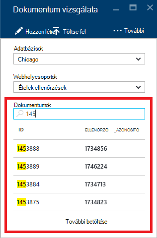

<properties
    pageTitle="DocumentDB dokumentum Explorer JSON megtekintéséhez |} Microsoft Azure"
    description="Tudjon meg többet a DocumentDB dokumentum Intéző-Azure portál eszköz JSON megtekintése, szerkesztése, létrehozása és feltöltése DocumentDB, NoSQL dokumentum adatbázis JSON-dokumentumokat."
        keywords="json megtekintése"
    services="documentdb"
    authors="kirillg"
    manager="jhubbard"
    editor="monicar"
    documentationCenter=""/>

<tags
    ms.service="documentdb"
    ms.workload="data-services"
    ms.tgt_pltfrm="na"
    ms.devlang="na"
    ms.topic="article"
    ms.date="08/30/2016"
    ms.author="kirillg"/>

# Megtekintése, szerkesztése, létrehozása és DocumentDB dokumentum Intézővel JSON dokumentumok feltöltése

Ez a cikk a [Microsoft Azure DocumentDB](https://azure.microsoft.com/services/documentdb/) dokumentum Intéző-Azure portál eszköz, amely lehetővé teszi, hogy megtekintése, szerkesztése, létrehozása, töltse fel és DocumentDB JSON-dokumentumokat szűrése áttekintést nyújt. 

Figyelje meg, hogy a dokumentum Explorer nincs engedélyezve DocumentDB fiókok MongoDB protokoll támogatása. Ezen az oldalon frissülnek, amikor ezt a szolgáltatást.

## Indítsa el a dokumentum Explorer

1. Kattintson az Azure portált a Jumpbar, **DocumentDB (NoSQL)**. Ha **DocumentDB (NoSQL)** nem látható, kattintson a **További szolgáltatások** elemre, és válassza a **DocumentDB (NoSQL)**.

2. Kattintson a fiók nevére. 

3. Az erőforrás menüjében kattintson a **Dokumentum Explorer**. 
 
    

    Kattintson a **Dokumentum Explorer** lap a az **adatbázisok** és **webhelycsoportok** legördülő listák vannak előre kitöltött attól függően, hogy a környezetben, amelyben a dokumentum Explorer indított. 

## Dokumentum létrehozása

1. [Indítsa el a dokumentum Explorer](#launch-document-explorer).

2. Kattintson a **Dokumentum Explorer** lap **Dokumentum létrehozása**. 

    A **dokumentumokban** a lap egy minimális JSON kódtöredékének megadni.

    

2. A **dokumentum** lap az írja be vagy illessze be a JSON-dokumentum szeretne létrehozni, és kattintson a **Mentés** véglegesítse a dokumentumokban az adatbázis és a **Dokumentum Explorer** lap megadott webhelycsoport.

    

    > [AZURE.NOTE] Ha nem ad meg az "azonosító" tulajdonságot, dokumentum Explorer automatikusan hozzáadja az azonosító tulajdonságot, majd létrehoz egy GUID azonosítója értékként.

    Ha már van JSON adatainak fájlok, MongoDB, SQL Server, CSV-fájlok, Azure táblatárolóhoz, Amazon DynamoDB, HBase, vagy más DocumentDB gyűjtemények használhatja DocumentDB cég [adatainak áttelepítési eszköz](documentdb-import-data.md) gyorsan importálja az adatokat.

## Dokumentum szerkesztése

1. A [dokumentum Explorer indítása](#launch-document-explorer).

2. Meglévő dokumentum szerkesztéséhez jelölje ki azt a **Dokumentumot Explorer** lap, szerkesztenie a dokumentumot a **dokumentum** lap, és kattintson a **Mentés**parancsra.

    

    Ha dokumentumot szerkeszt döntse el, hogy el szeretné vetni a szerkesztések aktuális készlete, egyszerűen kattintson a **dokumentum** lap **elvetése** , az Elvetés művelet megerősítéséhez, és a dokumentum előző állapotát van-e tölteni.

    

## Dokumentumok törlése

1. [Indítsa el a dokumentum Explorer](#launch-document-explorer).

2. Jelölje ki a dokumentumot a **Dokumentum Intézőben**, kattintson a **Törlés**gombra, és kattintson a törlés megerősítéséhez. Arról, hogy, a dokumentum van azonnal eltávolítása után a dokumentum Explorer listából.

    

## JSON-dokumentumok használata

Dokumentum Explorer ellenőrzi, hogy minden új vagy módosított dokumentum tartalmaz-e érvényes JSON.  Megteheti még nézet JSON hibák mutatva részleteket szeretne megtudni az adatérvényesítési hiba a nem a megfelelő szakaszban.

Ezenkívül dokumentum Explorer nem lehet az érvénytelen JSON tartalommal rendelkező dokumentum mentése.

Végezetül dokumentum Explorer lehetővé teszi, hogy a rendszer a betöltve dokumentum tulajdonságainak egyszerűen tekintheti meg a **Tulajdonságok** gombra.

> [AZURE.NOTE] A időbélyegző (_ts) tulajdonság belső megfelelője alapidőpont idő, de a dokumentum Explorer értéket GMT emberi e olvasható formátumban jeleníti meg.

## Dokumentumok szűrése
Dokumentum Explorer támogatja a navigációs beállítások számát, és a Speciális beállítások.

Alapértelmezés szerint dokumentum Explorer betölti a kijelölt gyűjteményében, a létrehozott adatokat dátumok szerint a legkorábbitól a legkésőbbiig első 100 dokumentumokat.  A dokumentum Explorer a lap alján a **betöltése több** lehetőség választásával betöltheti további dokumentumok (kötegekben 100). Megadhatja, hogy mely dokumentumokat betöltése a **Szűrés** parancs segítségével.

1. [Indítsa el a dokumentum Explorer](#launch-document-explorer).

2. A **Dokumentum Explorer** a lap tetején kattintson a **Szűrés**gombra.  

    
  
3.  A szűrési beállítások a parancssáv alatt jelennek meg. Adja meg a WHERE záradékot, illetve ORDER BY záradék a szűrőbeállításokat, és válassza a **szűrő**.

    

    Dokumentum Explorer az eredmények automatikusan frissíti a szűrő lekérdezésnek dokumentumok. Olvassa el a további tudnivalók a DocumentDB SQL nyelvhelyesség-ellenőrzés az [SQL-lekérdezés és SQL-szintaxisa](documentdb-sql-query.md) cikket, és nyomtassa ki az [SQL-lekérdezés cheat lap](documentdb-sql-query-cheat-sheet.md).

    Az **adatbázis** és a **webhelycsoport** legördülő listák könnyen módosíthatja a gyűjteményt, amelyből dokumentumokat vannak jelenleg megtekintett nélkül zárja be, és futtassa ismét a dokumentum Explorer használható.  

    Dokumentum Explorer is lehetővé teszi a dokumentumok betöltve készlete szűrés a azonosító tulajdonságban.  Egyszerűen írja be a dokumentumok szűrés jelölőnégyzetből.

    

    A dokumentum Explorer lista szűri a találatokat a megadott feltételek alapján.

    

    > [AZURE.IMPORTANT] A dokumentum Explorer szűrő funkciók csak szűrők a ***jelenleg*** a töltődnek be a dokumentumok, és ne hajtsa végre az éppen kijelölt webhelycsoport ellen lekérdezés.

4. Dokumentum Explorer által betöltött dokumentumok listájának frissítéséhez kattintson a **frissítés** elemre a lap tetején.

    

## Dokumentumok hozzáadása a tömeges

Dokumentum Explorer tömeges bevitel egy vagy több meglévő JSON dokumentumokat legfeljebb 100 JSON fájlok száma feltöltés műveletet támogat.  

1. [Indítsa el a dokumentum Explorer](#launch-document-explorer).

2. Az upload megkezdéséhez kattintson a **Dokumentum feltöltése**gombra.

    

    A **Dokumentum feltöltése** lap megnyitása 

2. A Tallózás gombra kattintva nyissa meg a intézőablakban, jelölje ki egy vagy több JSON dokumentumokat tölthet fel, és kattintson a **Megnyitás**gombra.

    

    > [AZURE.NOTE] Dokumentum Explorer jelenleg támogatott legfeljebb 100 JSON dokumentumok egyes feltöltés művelet.

3. Miután meg van elégedve a kijelölést, kattintson a **feltöltése** gombra.  A dokumentumok automatikusan megjelennek a dokumentum Explorer rács és a feltöltés találat jelenik meg a műveletet előrehaladtával. Egyes fájlok importálási hibák jelzett.

    

4. A művelet befejezése után, választhat egy másik 100 dokumentumok felfelé tölthet fel.

## A portálon kívüli JSON-dokumentumok használata

A dokumentum Intéző az Azure-portálon módja a csak egy DocumentDB lévő dokumentumok használata. A [REST API](https://msdn.microsoft.com/library/azure/mt489082.aspx) - vagy az [ügyfél SDK](documentdb-sdk-dotnet.md)használatával dokumentumokat is dolgozhat. Például kód, a [.NET SDK dokumentum példák](documentdb-dotnet-samples.md#document-examples) és a [Node.js SDK dokumentum példákat](documentdb-nodejs-samples.md#document-examples).

Ha szeretne importálni vagy fájlok áttelepítése más forrásból (JSON fájlokat, MongoDB, SQL Server, CSV fájlok, Azure-táblából tárhely, Amazon DynamoDB vagy HBase), a DocumentDB [adatok áttelepítési eszköz](documentdb-import-data.md) gyorsan az adatok importálását DocumentDB is használhatja.

## Kapcsolatos hibák elhárítása

**A jelenség**: dokumentum Explorer **nem található dokumentumok**adja eredményül.

**Megoldás**: Győződjön meg arról, hogy választotta-e a megfelelő előfizetést, az adatbázis és a webhelycsoport, ahol a dokumentumok beszúrt. Is jelölje be annak érdekében, hogy működik a átviteli kvótákat belül. Akkor működnek Ha a maximális sebesség szintű és lekérdezése szabályozott, csoportban a gyűjtemény a maximális sebesség kvótája működtetéséhez alsó alkalmazás használatát.

**Magyarázat**: A portálon egy olyan alkalmazás, mint bármely más kezdeményezhet hívásokat a DocumentDB adatbázis és a webhelycsoport. Ha a kérelmek a vannak jelenleg szabályozott miatt hívások éppen egy külön alkalmazásból, a portálon előfordulhat, hogy is kell szabályozott, okozó erőforrások nem jelennek meg a portálon. A probléma megoldásához, a probléma okát, a nagy átviteli használatát a cím, majd frissítse az a portál lap. Információk felmérni, hogy miként és az alsó átviteli használatát a [Teljesítmény tippek](documentdb-performance-tips.md) a cikk [átviteli](documentdb-performance-tips.md#throughput) szakaszában találhatók.

## Következő lépések

További tudnivalók a dokumentum Intézőben támogatott DocumentDB SQL nyelvhelyesség-ellenőrzés, olvassa el az [SQL-lekérdezés és SQL-szintaxisa](documentdb-sql-query.md) , vagy nyomtassa ki az [SQL-lekérdezés cheat lap](documentdb-sql-query-cheat-sheet.md).

A [tanulási javaslat](https://azure.microsoft.com/documentation/learning-paths/documentdb/) hasznos segítséget nyújtanak a tudjon meg többet a DocumentDB erőforrásként is szerepel. 
