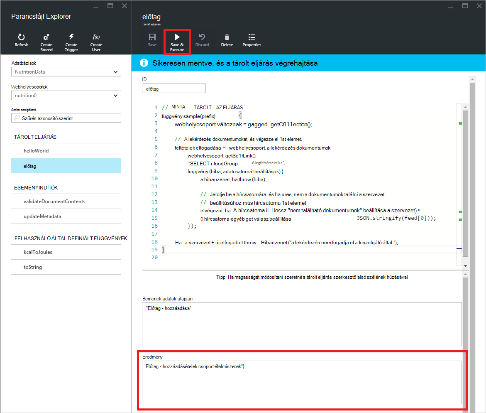

<properties
    pageTitle="DocumentDB parancsfájl Explorer, a JavaScript-szerkesztő |} Microsoft Azure"
    description="Tudjon meg többet a DocumentDB parancsfájl Intéző-Azure portál eszköz kezelése DocumentDB kiszolgálóoldali programozási eltérések tárolt eljárások, eseményindítók és a felhasználó által definiált függvények többek között."
    keywords="JavaScript-szerkesztő"
    services="documentdb"
    authors="kirillg"
    manager="jhubbard"
    editor="monicar"
    documentationCenter=""/>

<tags
    ms.service="documentdb"
    ms.workload="data-services"
    ms.tgt_pltfrm="na"
    ms.devlang="na"
    ms.topic="article"
    ms.date="08/30/2016"
    ms.author="kirillg"/>

# Létrehozása és futtatása a tárolt eljárások, eseményindítók és a DocumentDB parancsfájl Intézővel felhasználó által definiált függvények

Ez a cikk áttekintést nyújt a JavaScript-szerkesztő az Azure-portálon, amely lehetővé teszi, hogy a megjelenítése, majd hajtsa végre a DocumentDB kiszolgálóoldali programozási eltérések tárolt eljárások, eseményindítók és a felhasználó által definiált függvények többek között [A Microsoft Azure DocumentDB](https://azure.microsoft.com/services/documentdb/) parancsfájl Explorer. További információk DocumentDB kiszolgálóoldali programozás [tárolt eljárások, az adatbázis eseményindítók, és a függvényekben](documentdb-programming.md) című témakörben.

## Parancsfájl Explorer indítása

1. Kattintson az Azure portált a Jumpbar, **DocumentDB (NoSQL)**. Ha **DocumentDB-fiókok** nem látható, kattintson a **További szolgáltatások** elemre, és válassza a **DocumentDB (NoSQL)**.

2. Kattintson a források menü **Parancsfájl Explorer**.

    
 
    Az **adatbázis** és a **webhelycsoport** legördülő listák vannak előre kitöltött attól függően, hogy a környezetben, amelyben parancsfájl Explorer indítása.  Például az egy adatbázis lap indít, majd az aktuális adatbázis esetén már előre kitölt.  Ha egy webhelycsoport lap indít az aktuális gyűjtemény már előre kitölt.

4.  Az **adatbázis** és a **webhelycsoport** legördülő listák használatával könnyen módosíthatja a gyűjteményt, amelyből parancsfájlok vannak jelenleg megtekintett nélkül zárja be, és futtassa ismét a parancsprogram Explorer.  

5. Parancsfájl Explorer is támogat a parancsfájlok betöltve készlete szűrés a azonosító tulajdonságban.  Egyszerűen írja be a szűrő mezőben, és az eredmények a parancsprogram Explorer listában a megadott feltételek alapján szűri.

    

    > [AZURE.IMPORTANT] A parancsprogram Intéző funkciók csak szűrők csoportjából a ***jelenleg*** betöltött parancsfájlok szűrése, és nem frissíti automatikusan a kijelölt gyűjteményben.

5. Frissítse a listát, parancsfájl Explorer által betöltött parancsfájlok, egyszerűen kattintson a **frissítés** parancs a lap tetején.

    

## Létrehozása, megtekintése és szerkesztése a tárolt eljárások, eseményindítók és a felhasználó által definiált függvények

Parancsfájl Explorer lehetővé teszi, hogy könnyen DocumentDB kiszolgálóoldali programozási eltérések CRUD műveletek hajthatók végre.  

- Parancsfájl, egyszerűen kattintson a megfelelő hozzon létre parancsfájl Explorerrel parancs, adja meg az azonosító, adja meg a parancsfájlt tartalmát, és kattintson a **Mentés**gombra.

    

- Az eseményindító létrehozásakor meg kell adni a kiváltó ok mező típusát, és a kiváltó ok mező művelet

    

- Parancsfájl, egyszerűen gombra a parancsfájlt, amely érdekli.

    

- Parancsfájl szerkesztéséhez végezze el a kívánt módosításokat a JavaScript a szerkesztő, és kattintson a **Mentés**gombra.

    

- Ha el szeretné vetni a függőben lévő változtatásait parancsfájl, egyszerűen kattintson a **elvetése** parancsra.

    

- Parancsfájl Explorer is lehetővé teszi, hogy a rendszer tulajdonságai betöltve parancsfájl egyszerűen tekintheti meg a **Tulajdonságok** gombra.

    

    > [AZURE.NOTE] A időbélyeg (_ts) tulajdonságot belső megfelelője alapidőpont idő, de parancsfájl Explorer értéket GMT emberi e olvasható formátumban jeleníti meg.

- Parancsfájl törléséhez jelölje ki azt az parancsfájl Explorerben, és kattintson a **Törlés** parancsra.

    

- A Törlés művelet megerősítéséhez az **Igen** gombra kattintva, illetve a Mégse a törlési művelet **nem**kattint.

    

## Hajtsa végre a tárolt eljárás

> [AZURE.WARNING] Tárolt eljárások végrehajtása a parancsprogram Intézőben még nem támogatott kiszolgáló particionálva oldalsó gyűjtemények. További tudnivalókért látogassa meg a [particionálására és DocumentDB a méretezés](documentdb-partition-data.md).

Parancsfájl Explorerrel hajtsa végre a kiszolgálóoldali tárolt eljárások az Azure portálról.

- Amikor megnyit egy új létrehozása a tárolt eljárás lap, már kell adni egy alapértelmezett parancsfájl (*előtag*). Annak érdekében, hogy futtatni az *előtag* vagy egyéni parancsfájl, vegye fel az *azonosító* és a *bemeneti adatok alapján*. Fogadja el a több paraméterek tárolt eljárások az összes ráfordítások (pl. *["élőlá", "sáv"]*) tömbön belüli kell lennie.

    

- Hajtsa végre a tárolt eljárás, egyszerűen kattintson a **Mentés és végrehajtása** parancs parancsfájl-szerkesztő ablaktáblájának.

    > [AZURE.NOTE] A **Mentés és végrehajtása** parancs végrehajtása, mielőtt a tárolt eljárás, ami azt jelenti, felül a tárolt eljárás a korábban mentett verzióját menti.

- A sikeres tárolt eljárás végrehajtások lesz a *sikeres mentve, és a tárolt eljárás végrehajtása* állapotú, és a visszaadott találatok tölti fel, az *eredmény* ablaktáblában.

    

- A végrehajtási hiba lép fel, ha a hiba fognak megjelenni az *eredmény* ablaktáblában.

    

## Parancsfájlok kívül a portál használata

A parancsprogram Intéző az Azure-portálon módja a csak egy tárolt eljárások, eseményindítók és DocumentDB a felhasználó által definiált függvényeket. Parancsfájlok használatával is dolgozhat a REST API-t, és az [ügyfél SDK](documentdb-sdk-dotnet.md). A REST API-dokumentáció a [tárolt eljárás használatával a többi](https://msdn.microsoft.com/library/azure/mt489092.aspx) [felhasználó által definiált függvények használata a többi](https://msdn.microsoft.com/library/azure/dn781481.aspx)és [indítók segítségével a többi](https://msdn.microsoft.com/library/azure/mt489116.aspx)minták tartalmazza. Mintákat is elérhető megjelenítő [parancsfájlok C# használata](documentdb-dotnet-samples.md#server-side-programming-examples) és [parancsfájlok Node.js használatával](documentdb-nodejs-samples.md#server-side-programming-examples).

## Következő lépések

További tudnivalók a DocumentDB kiszolgálóoldali programozás [tárolt eljárások, az adatbázis eseményindítók, és a függvényekben](documentdb-programming.md) című témakörben.

A [tanulási javaslat](https://azure.microsoft.com/documentation/learning-paths/documentdb/) hasznos segítséget nyújtanak a tudjon meg többet a DocumentDB erőforrásként is szerepel.  
