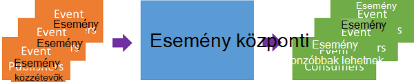
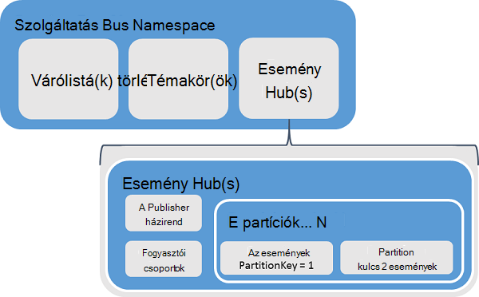
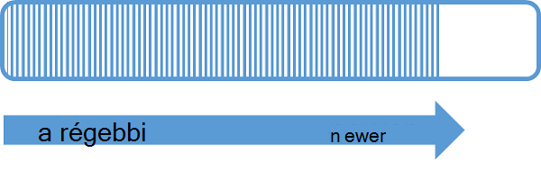
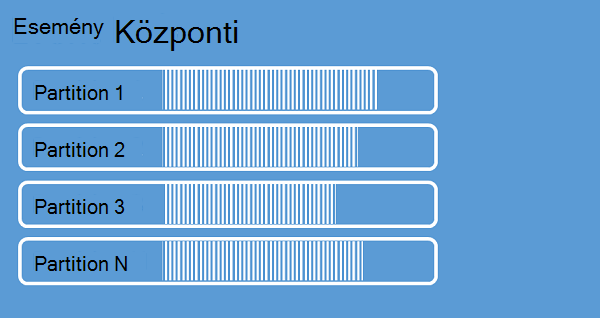
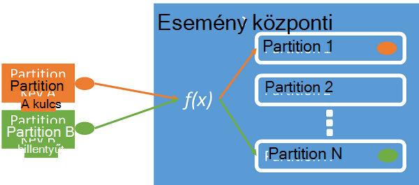
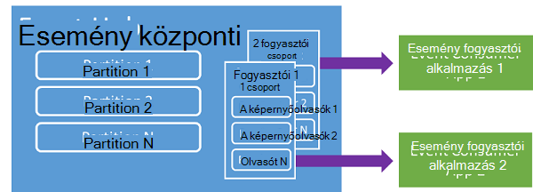
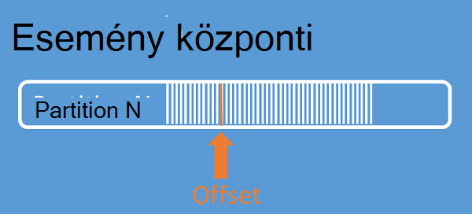
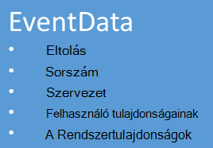

<properties 
    pageTitle="Azure esemény hubok áttekintése |} Microsoft Azure"
    description="– Bevezetés és Azure esemény hubok áttekintése."
    services="event-hubs"
    documentationCenter="na"
    authors="sethmanheim"
    manager="timlt"
    editor="" />
<tags 
    ms.service="event-hubs"
    ms.devlang="na"
    ms.topic="get-started-article"
    ms.tgt_pltfrm="na"
    ms.workload="na"
    ms.date="08/16/2016"
    ms.author="sethm" />

# Azure esemény hubok – áttekintés

Sok modern megoldások lehetővé szeretné tenni, adaptív felhasználói élményt biztosít vagy javítása a termékek folyamatos visszajelzési és automatizált telemetriai keresztül. A kérdés, hogy miként tudnak stabilan és biztonságos módon feldolgozása adatokat számos egyidejű gyártóktól származó nagy mennyiségű ilyen megoldások is projektvezetők. Microsoft Azure esemény hubok olyan esetek széles különböző nagyméretű adatok bevitele, amely a alap felügyelt platform szolgáltatás. Példák olyan esetek viselkedés mobilalkalmazások webes farmok, mérkőzés szavakat az esemény rögzítési konzol játékok, a forgalom adatait a követés vagy telemetriai adatokat ipari gépek gyűjtött, vagy járműveket csatlakozik. A közös esemény hubok hanglejátszás beállítása a megoldást architektúrákban feladata, hogy működik-e az "első ajtó" az egy esemény folyamat, más néven egy *esemény ingestor*. Egy esemény ingestor összetevő vagy szolgáltatás, amely az adott események felhasználása egy esemény adatfolyam előállítására decouple esemény közzétevők és esemény fogyasztói között helyezkedik el.

Azure esemény hubok szolgáltatása, amely a felhőbe tömeges méreteket, a bejövő Eseménynapló és telemetriai adatok kis késés és a magas megbízhatóság feldolgozása eseményről szó. Ezt a szolgáltatást, használja az egyéb lefelé irányuló szolgáltatásaival, akkor különösen hasznos alkalmazás műszerezettségi, felhasználói felület vagy a munkafolyamat feldolgozása, és -esetek dolog Internet (IoT). Esemény hubok tartalmaz egy üzenet adatfolyam kezelése lehetőséget, és abban az esetben, ha egy esemény hubhoz még a súgótémaköröket, és a sorok hasonló egységek, rendelkezik, amelyek lényegesen eltér hagyományos vállalati üzenetküldés jellemzők. Vállalati üzenetküldési forgatókönyvek gyakran szükség összetett funkciók sorrendjét, kézbesítetlen-formában szerepelnek, tranzakciók támogatása és erős kézbesítési biztosítékai, például a közben az esemény bevitelt meghatározó szándék nagy teljesítmény és esemény adatfolyamok rugalmasság feldolgozása. Ezért esemény hubok funkciók különböznek szolgáltatás Bus témaköröket, azok erősen torzított nagy teljesítmény és esemény esetek feldolgozása felé. Ilyen esemény hubok nem egyes végrehajtása az üzenetben szolgáltatásait témaköröket. Ha ezek a Funkciók, a témakörök az optimális választás maradnak.

Egy esemény hubhoz esemény hubok névtér szintre, de hasonló szolgáltatás Bus sorban várakozó és témakörök jön létre. Esemény hubok használja, mint az elsődleges API felületek AMQP és a HTTP. A következő ábrán esemény hubok és szolgáltatás Bus közötti kapcsolatra.

## Elvi áttekintése

Esemény hubok üzenet a folyamatos átvitelű particionált fogyasztói mintát keresztül biztosít. Sorok és témakörök használjon, amelyben minden egyes fogyasztói megkísérli azonos várólista vagy erőforrás olvassák [Gyorskorcsolyázásban fogyasztói](https://msdn.microsoft.com/library/dn568101.aspx) modellt. Ez a verseny erőforrások végül összetettsége és feldolgozása alkalmazások adatfolyam-skála korlátozások eredményez. Esemény hubok, amelyben minden egyes fogyasztói csak beolvassa a meghatározott részhalmazát vagy a partíciók, az üzenet adatfolyam particionált fogyasztói mintát használja. A minta lehetővé teszi, hogy a vízszintes méret esemény feldolgozása, és más adatfolyam fókuszáló funkciók, amelyek nem érhetők el a súgótémaköröket, és a sorok biztosít.

### Partíciót

Egy partíciót egy rendezett események sorozata az esemény-központban tartott. Új események érkezésekor, hozzáadásuk a folyamat végére. Egy partíciót a tekinthető "jóváhagyás naplózási."

Partíciót megőrzi az adatok konfigurált adatmegőrzési időpontra, amely az esemény központi szinten van állítva. Ezt a beállítást alkalmazza az összes partíciót végig az Eseménynapló központi. Események lejárati idő alapon; nem explicit módon törölheti őket. Egy esemény hubhoz több partíciót tartalmazza. Egyes partíciók független és saját adatokat tartalmazza. Emiatt partíciót gyakran a nagyobb különböző kamatlába mellett.

Partíciók száma az esemény központi létrehozáskor megadni, és a 2 és 32 (az alapértelmezett érték a 4-es) között kell lennie. Partíciót egy adatok szervezeti mechanizmusa és több kapcsolódó használata más programokban, mint az esemény hubok átviteli szükséges lefelé irányuló párhuzamos szögben. A választási lehetőségek, a partíciók számát egy esemény-központban közvetlenül a várt, hogy az egyidejű olvasók száma kapcsolódó így. Esemény központi a létrehozás után partíciót számának nem módosítható; Vegye figyelembe a hosszú távú várható skála értelmez szám. A 32 partíciót korlát növelése kapcsolatba lépne a szolgáltatás Bus részlegével.

Miközben partíciót azonosíthatók, és közvetlenül lehet küldeni, célszerű az adatokat küldi adott partíciót elkerülése érdekében. Ehelyett jelent meg az [esemény publisher](#event-publisher) és a [Publisher házirend](#capacity-and-security) szakaszok magasabb szintű szerkezeteket is használhatja.

Az esemény hubok környezetben üzenetek nevezik *eseményadatok*. Esemény adatai tartalmazza az esemény törzsében, a felhasználó által definiált tulajdonság között, és az esemény, például az eltolás különböző metaadatait partíciót és a szám adatfolyam sorrendben. Partíciót vannak töltve eseményadatok sorozatát.

## Esemény publisher

Olyan személy által küldött adatok vagy események esemény-hubon keresztül csatlakozott egy *esemény publisher*. Esemény közzétevők közzéteheti a HTTPS vagy a AMQP 1.0 eseményeket. Esemény közzétevők egy megosztott Access-aláírás (Társítások) token segítségével azonosítani magukat egy esemény-hubon keresztül csatlakozott, és olyan egy egyedi azonosító, vagy használata a közös Társítások jogkivonat, attól függően, hogy az alkalmazási példát követelményeinek.

További információt a Társítások használata olvassa el a [Megosztott Access aláírás hitelesítési szolgáltatás Bus](../service-bus-messaging/service-bus-shared-access-signature-authentication.md)című témakört.

### Publisher-feladatok

Ez a szakasz ismerteti a gyakori feladatok az esemény közzétevők.

#### A biztonsági jogkivonat finomítása

Megosztott Access aláírás (Társítások) az esemény hubok hitelesítési módszer. Szolgáltatás Bus a névtér és esemény központi szinten Társítások házirendeket biztosít. A biztonsági jogkivonat hozza létre a rendszer egy Társítások billentyűt, és egy SHA kivonat egy URL-címként kódolt egy bizonyos formátumban. A kulcs (házirend) és a jogkivonat, szolgáltatás Bus segítségével a kivonat újragenerálása és így hitelesíteni a feladó. Az esemény közzétevők Társítások tokenek általában csak **küldése** adott esemény hubon jogosultságokkal rendelkező jönnek létre. A Társítások jogkivonat URL-cím mechanizmusa alapja jelent meg, a publisher házirend publisher azonosításához. További információt a Társítások használata olvassa el a [Megosztott Access aláírás hitelesítési szolgáltatás Bus](../service-bus-messaging/service-bus-shared-access-signature-authentication.md)című témakört.

#### Esemény közzététele

Esemény AMQP 1.0 vagy a HTTPS közzéteheti. Szolgáltatás Bus biztosít egy [EventHubClient](https://msdn.microsoft.com/library/microsoft.servicebus.messaging.eventhubclient.aspx) osztály közzétételi események esemény-hubon keresztül csatlakozott .NET-ügyfelek. Egyéb szükséges és platformokon bármely AMQP 1.0 ügyfélprogram, például [Apache Qpid](http://qpid.apache.org/)is használhatja. Egyenként közzéteheti eseményeket, illetve kötegelt. Egyetlen kiadványban (esemény adatok példány) tartalmaz, függetlenül attól, hogy az egyetlen olyan esemény vagy egy köteg legfeljebb 256KB. Közzétételi események nagyobb, mint ez a művelet hibát eredményezi. Közzétevők belül az esemény-központban partíciót nem tudják, és csak adja meg a *kulcs partition* (jelent meg a következő szakaszban), vagy a biztonsági jogkivonat keresztül a személyazonosságot a legjobb módszer.

Használati eset AMQP vagy HTTPS külön az. AMQP újdonság a közlekedési Sávos security (TLS) vagy az SSL/TLS állandó kétirányú szoftvercsatornához létrehozására van szükség. Ez lehet egy hálózati forgalmának engedélyezésére pedig költséges műveletet, de csak egy AMQP munkamenet elején történik. HTTPS egy alsó kezdeti terhelést rendelkezik, de SSL-kapcsolatot további felsőbb összes kérés. Az események gyakran közzétevő közzétevők AMQP kínál jelentős teljesítménybeli, időtartama és átviteli megtakarítási.

### Partition billentyűt

Partition kulcs értéke, amely térképadatok bejövő esemény az adott partíciót adatok szervezeti céljából. A partíciók kulcsa egy esemény-elosztóhoz átadott feladója által megadott értéket. A program dolgozza fel, amelyek az eredményt hoz létre a partíciót hozzárendelés statikus ujjlenyomat funkción keresztül. Ha egy partíciót kulcs nem adja meg, ha az esemény közzétételi, egy ciklikus hozzárendelés használják. Termékkulcsok használatakor az esemény publisher lehetőség csak tudatában annak partíciót kulcsát, nem, amelyhez az események közzétett partíciót. A feladó az erre szolgáló tudni túl nagy a későbbi feldolgozás és a teljes tárterület szétválasztás billentyűt és partition insulates. Termékkulcsok fontosak a későbbi feldolgozásra adatok rendszerezése, de saját maguk partíciót alapvetően nem kapcsolódnak. Kapcsolódó eseményeket csoportosíthatja egyetlen partíciót egy eszköz vagy a felhasználó egyedi azonosító teszi a helyes kulcs, de más attribútumait, például a geography is használható. Az alábbi képen látható az esemény feladók rögzítés partíciót a termékkulcsok használatával.

Esemény hubok biztosítja, hogy az azonos partíciót kulcs értékét megosztása minden események érkeznek sorrendben, és a azonos partíciót. Fontosabb, termékkulcsok a publisher-házirendek, a következő szakaszban leírt használatakor majd azonosítója a publisher és a partíciót kulcs értékét meg kell egyeznie. Egyéb esetben a hiba történik.

### Esemény fogyasztói

Olyan személy, amely egy esemény központból esemény-adatokat olvas be egy esemény fogyasztói. Az összes esemény fogyasztói olvassa el az esemény adatfolyam keresztül partíciót egy fogyasztói csoportban. Egyes partíciók egyszerre csak egy aktív olvasó kell tartalmaznia. Az összes esemény hubok fogyasztói csatlakozás keresztül a AMQP 1.0 munkamenet, amelyben eseményekről érkeznek, amint elérhetővé válnak. Az ügyfél lekérdezik az adatokat elérhetőség nem szükséges.

#### Fogyasztói csoportok

Esemény hubok közzététel/előfizetés mechanizmusa fogyasztói csoportokon keresztül érhető el. A fogyasztói csoport egy teljes esemény hubhoz megjelenítése (állapot, pozíció vagy eltolás). Fogyasztói csoportok engedélyezése a több igénybe alkalmazásokat, mindegyik külön nézet az esemény adatfolyam, és olvassa el a saját tempójában független, és saját eltolás adatfolyam van. Architektúra feldolgozása adatfolyam, az egyes lefelé irányuló alkalmazás fogyasztói csoport megfelel. Ha hosszú távú tároló eseményadatok írni szeretne, majd tároló író alkalmazás csoport, akkor fogyasztói. Összetett esemény feldolgozása, egy másik fogyasztói csoport hajtja végre. Partíciót csak egy fogyasztói csoporton keresztül érheti el. Csoport van, akkor mindig alapértelmezett fogyasztóvédelmi esemény-központban, és az egy szabványos réteg esemény központi legfeljebb 20 fogyasztói csoportokat hozhat létre.

A következő példák az fogyasztói csoport URI használni:

    //<my namespace>.servicebus.windows.net/<event hub name>/<Consumer Group #1>
    //<my namespace>.servicebus.windows.net/<event hub name>/<Consumer Group #2>

Az alábbi képen látható az esemény fogyasztói fogyasztói csoportokon belül.

#### Adatfolyam-eltolja

Eltolás belül partíciót esemény pozícióját. Érdemes elképzelnie eltolás ügyféloldali kurzor szerint. Az eltolás egy bájt számozás az esemény. Egy esemény fogyasztói (olvasó) megadhatja, hogy az Eseménynapló adatfolyam valamit, amelyhez események olvasni kezdi szeretnének lehetővé teszi. Az eltolás időbélyeg vagy eltolás értelmezi is megadhat. Vonzóbbak lehetnek az esemény hubok szolgáltatás kívül saját eltolás értékek tárolására felelősek.

Egy partíciót, belül az egyes események eltolás tartalmazza. Ez az eltolás fogyasztói kattintva jelenítse meg a helyet az adott partíciót esemény sorrendben használja. Eltolás továbbíthatók az esemény elosztóhoz időbélyeg értékként vagy számként, vagy egy olvasót csatlakozik.

#### Ellenőrzésipont

*Ellenőrzésipont* az egy folyamat, amellyel olvasók jelre, vagy partíciót esemény sémadefiníciója elfoglalt helyük véglegesítése. Ellenőrzésipont a fogyasztói feladata, és a fogyasztói csoporton belül partíciót alapon történik. Ez azt jelenti, hogy az egyes fogyasztói csoportok egyes partíciót olvasó kell nyomon követheti a jelenlegi helyén az Eseménynapló adatfolyam, és a szolgáltatás is tájékoztassa, ha megítélése szerint a adatfolyam teljes. Ha olvasót bontja a partíciók, amikor azt meg ismét az ellenőrzés, amely az adott partíciót utolsó olvasó fogyasztói csoport korábban küldte a olvasási kezdődik. Amikor csatlakozik az olvasó, ez az eltolás továbbítja az esemény-központban, amelynél indítása Olvasóablak helyének megadásához. Ezzel a módszerrel is be van jelölve események meg "elvégzettként" ellenőrzésipont alkalmazásait, és úgy, hogy más gépeken futó olvasók között feladatátvételnél erősítése is használhatja. Esemény adatok megőrződnek, az adatmegőrzési intervallum meg egyszerre az esemény-központban hoz létre, mert ajánlatos való visszatéréshez a régebbi adatokat egy alsó eltolás ellenőrzésipont folyamathoz a megadásával. Ez az eljárás keresztül ellenőrzésipont lehetővé teszi, hogy feladatátvevő tűrőképessége és ellenőrzött esemény adatfolyam ismétléses is.

#### Alapműveletek fogyasztói

Ez a szakasz ismerteti a gyakori feladatok az esemény hubok esemény fogyasztói vagy olvasók. Az összes esemény hubok fogyasztói csatlakozás AMQP 1.0 keresztül. AMQP 1.0 pedig a munkamenet állapot-et kétirányú kommunikációt csatornát. Minden egyes partíciót egy AMQP 1.0 hivatkozás munkamenet, amely elősegíti az események által partíciót elkülönített szállítása tartalmaz.

##### Csatlakozás egy partíciót

Annak érdekében, hogy egy esemény központból események felhasználása, a fogyasztói csatlakoznia kell egy partíciót. Korábban említett, mindig hozzáférhet partíciót egy fogyasztói csoporton keresztül. A particionált fogyasztói modell részeként csak egyetlen olvasó kell partíciót aktív egyszerre fogyasztói csoporton belül. Általános gyakorlat célszerű közvetlenül a bérleti mechanizmusa annak érdekében, hogy az adott partíciót olvasó kapcsolatok koordinálása partíciók való csatlakozáskor. Ezzel a módszerrel lehetőség az összes partíciót, hogy csak egy aktív olvasó fogyasztói csoportban. A pozíció sorrendben olvasókat kezelése fontos feladat, amely ellenőrzésipont keresztül érhető el. Ez a funkció egyszerűsített .NET ügyfelek számára a [EventProcessorHost](https://msdn.microsoft.com/library/microsoft.servicebus.messaging.eventprocessorhost.aspx) osztály használatával. [EventProcessorHost](https://msdn.microsoft.com/library/microsoft.servicebus.messaging.eventprocessorhost.aspx) intelligens fogyasztói ügynökkel, és a következő szakaszban ismertetett.

##### Olvassa el az események

Miután egy adott partíciót egy AMQP 1.0 munkamenetet, és a hivatkozás van megnyitva, események érkeznek a AMQP 1.0 ügyfél esemény hubok szolgáltatás. A kézbesítési mechanizmusa lehetővé teszi, hogy magasabb átvitel és ki alapú mechanizmusok, például a HTTP GET-nél kisebb késés. Események elküldi az ügyfél, mint az egyes esemény adatok példány fontos metaadatokat, például az eltolás és a sorozat szám megkönnyítése érdekében az esemény sorrendben ellenőrzésipont használt tartalmazza.

A feladata a eltolás oly módon, hogy a legjobb lehetővé teszi, hogy az adatfolyam feldolgozása irányító előrehaladásának kezelése.

## Kapacitás és biztonság

Esemény hubok egy adatfolyam bejövő adatok nagymértékben méretezhető párhuzamos architektúrája. Vannak, több fő szempontok szempontjai méretezése és méretezését esemény hubok alapján megoldást. Az első kapacitás vezérlő neve *átviteli mennyiség*, az alábbi szakaszban ismertetett.

### Átviteli mennyiség

Esemény hubok átviteli kapacitása átviteli egységek szabályozza. Átviteli vannak előre megvásárolt darabszám kapacitás egységek. Egy egyetlen átviteli egység az alábbiakat tartalmazza:

- Bejövő adatok: Legfeljebb 1 MB méretű másodpercenként a második vagy 1000 eseményeket.

- Kilépési: Legfeljebb 2 MB másodpercenként.

Bejövő adatok vásárolt átviteli mennyiségek által biztosított kapacitás ugyanannyi folyamatban van. A mennyiség eredménye a fenti adatok elküldése egy "kvóta kimerítve" kivétel. Ez az összeg, vagy egy második vagy 1000 események másodpercenként 1 MB, amelyik megtalálható először. Kilépési szabályozási kivételek nem hozhatók létre, de a megvásárolt átviteli egységek által biztosított adatátvitel mennyiségét korlátozni: 2 MB átviteli egységnyi másodpercenként. Ha kap a közzétételi ráta kivételek vagy is látni szeretne kilépési magasabb feltétlenül ellenőrizze, hogy a névtér, amelyben az esemény-központban készült vásárolt hány átviteli egységek. További átviteli egységek beszerzéséhez módosíthatja a beállítást a **méret** lapon az [Azure klasszikus portál][] **névtér** lapon. Ez a beállítás használatával az Azure API-khoz is módosíthatja.

Habár partíciót csak a szervezeti adatokat fogalma, átviteli egységek tisztán kapacitás fogalma. Átviteli erőforrás-mennyiség / h számlázva vannak, és előre vásárolt. Miután vásárolt, a átviteli egységek legalább egy órával e a számlázásra. Legfeljebb 20 átviteli egységek vásárolhatók meg egy esemény hubok névtér, és az Azure-fiók korlátozott 20 átviteli egységek. Ezek az átviteli egységek megadott névteret megosztott összes esemény hubra keresztül.

Átviteli egységek legjobb munkamennyiség alapon kiépített, és nem mindig lehet azonnali vásárolható. Ha szüksége van egy adott beosztását, javasolt, hogy ezek átviteli egységek időszakokra vásárolhat. Ha több, mint 20 átviteli egységek van szüksége, további átviteli mennyiség, az első 100 átviteli egységek legfeljebb 20 blokkokban lekötési alapon vásárlásához Azure támogatási is fordulhat. Túl 100 átviteli egység szövegblokkokat is vásárolhat.

Javasoljuk, hogy Ön gondosan egyenleg átviteli mennyiség és a partíciók esemény hubok optimális áttetszőséggel eléréséhez. Egy olyan partíciót egy átviteli egység maximális méretaránnyal tartalmaz. Átviteli mennyiségek kisebb vagy egyenlő, a partíciók száma az esemény-központban kell lennie.

A részletes információkat árak, olvassa el a [Esemény hubok árak](https://azure.microsoft.com/pricing/details/event-hubs/)című témakört.

### A Publisher házirend

Esemény hubok lehetővé teszi, hogy a *publisher*házirendek esemény közzétevők részletes szabályozható. Publisher-házirendek olyan esemény független gyártók nagyszámú elősegítő futási idejű funkciói. A publisher-házirendek minden publisher eseményeket egy esemény-hubon keresztül csatlakozott, használja az alábbi eljárás közzétételkor használja saját egyedi azonosító:

    //<my namespace>.servicebus.windows.net/<event hub name>/publishers/<my publisher name>

Nem kell létrehozása a publisher nevek időszakokra, de egyeznie kell a Társítások jogkivonat használatos, ha egy eseményt, közzétételi független publisher identitások biztosítása érdekében. Társítások kapcsolatos további tudnivalókért olvassa el a [Megosztott Access aláírás hitelesítési szolgáltatás Bus](../service-bus-messaging/service-bus-shared-access-signature-authentication.md)című témakört. Publisher-házirendek használatakor a **PartitionKey** értéke a közzétevő nevét. Működéséhez, ezeket az értékeket kell lennie.

## Összefoglalás

Azure esemény hubok hyper skála esemény és telemetriai feldolgozó bármely skála ellenőrzés közös alkalmazás és a felhasználó munkafolyamat használható szolgáltatást biztosít. Az azt jelenti, hogy adja meg a közzététel-előfizetés funkciók alacsony válaszidejű, és a tömeges méreteket, esemény hubok nagy adatok lesz a "bekapcsolt emelkedő". Ezek a funkciók a publisher-alapú identitás és a visszavonási listák kibővíti az Internet a dolog, amit tipikus esetei. Esemény hubok-alkalmazások fejlesztésével kapcsolatos további tudnivalókért lásd: az [esemény hubok programozási útmutató](event-hubs-programming-guide.md).

## Következő lépések

Most, hogy Ön már értesült az esemény hubok fogalmak, áthelyezhetők a következő esetekben:

- Első lépések az [esemény hubok oktatóprogram].
- Egy teljes [minta alkalmazást használó esemény hubok].

[Azure klasszikus portál]: http://manage.windowsazure.com
[Esemény hubok oktatóprogram]: event-hubs-csharp-ephcs-getstarted.md
[Esemény hubok használó minta alkalmazás]: https://code.msdn.microsoft.com/windowsazure/Service-Bus-Event-Hub-286fd097
