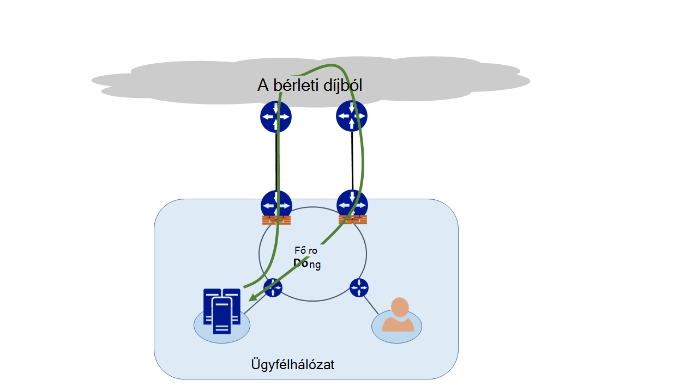
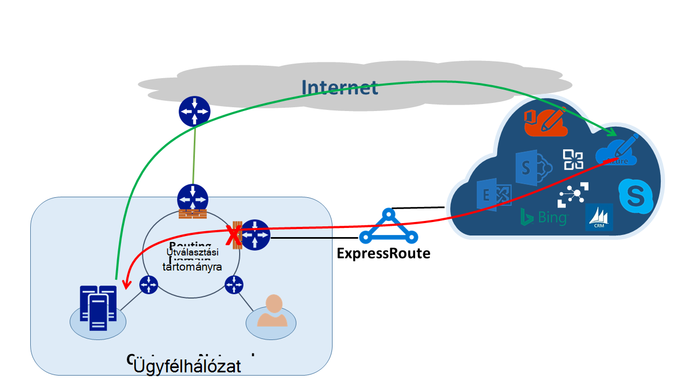
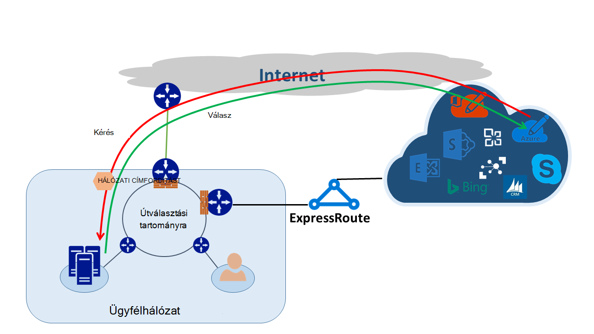

<properties
   pageTitle="Aszimmetrikus Útválasztás |} Microsoft Azure"
   description="Ez a cikk végigvezeti a egy ügyfél előfordulhat, hogy arcra, amely több hivatkozást tartalmaz a címzetthez hálózatban aszimmetrikus útválasztási problémákat."
   documentationCenter="na"
   services="expressroute"
   authors="osamazia"
   manager="carmonm"
   editor=""/>
<tags
   ms.service="expressroute"
   ms.devlang="na"
   ms.topic="get-started-article"
   ms.tgt_pltfrm="na"
   ms.workload="infrastructure-services"
   ms.date="10/10/2016"
   ms.author="osamazia"/>

# Több hálózat út aszimmetrikus Útválasztás

Ez a cikk bemutatja, hogyan lehet előre és vissza hálózati forgalmának engedélyezésére igénybe különböző módjai, ha több út közötti hálózati forrás- és céltáblák érhetők el.

Fontos aszimmetrikus útválasztás megérteni a két fogalmak megértéséhez. Még több hálózati elérési utakat hatását. A másik pedig hogyan eszközök, például a tűzfalat, hogy a állapota. Állapot-nyilvántartó eszközök ilyen típusú eszközöket nevezik. E két tényezők kombinációi hálózati forgalmának engedélyezésére megszakad állapot-nyilvántartó eszközzel, mert az állapot-nyilvántartó eszköz nem észleli, hogy a forgalmat magának az eszköznek származik esetek hoz létre.

## Több hálózat út

Amikor egy vállalati hálózat az interneten keresztül az internetszolgáltatóval csak egy hivatkozás van, az összes bejövő és az internetről halad ugyanazt az elérési utat. Gyakran cégek szerint felesleges elérési utak listában javítható a hálózati üzemidőt megvásárolni több áramkörök. Amikor ez történik, akkor lehet, hogy a forgalmat Ugrás kívül a hálózaton, az interneten keresztül egy hivatkozást, és visszatérő forgalom Ugrás különböző kapcsolaton keresztül. Ez gyakran nevezik aszimmetrikus útválasztás. Fordított hálózati forgalmának engedélyezésére aszimmetrikus útválasztás esetén az eredeti adatfolyamban egy másikat.

Bár elsősorban akkor, az interneten, más több út kombinációját aszimmetrikus útválasztás is érinti. Érvényes, például egy internetes elérési utat és egy személyes elérési útját, hogy ugyanazt a cél, és nyissa meg a ugyanabban a célhely több magánjellegű utakat egyaránt.

Minden cél forrástól menet útválasztó kiszámítja a legjobb útvonalat a cél eléréséhez. Legjobb lehetséges elérési út az útválasztó meghatározása két fő tényezők alapján történik:

-   Külső hálózatok között útválasztás útválasztási protokoll, szegély átjáró Protocol (BGP) alapján. BGP hirdetések megnyitja a szomszédok, és a lépésekkel megállapíthatja, a legjobb elérési útját a kívánt célhelyre sorozata keresztül futtatja őket. A legjobb elérési út az útválasztási táblázatát tárolja.
-   Egy útvonal társított alhálózat maszk hossza útválasztási útvonalat befolyásolja. Ha útválasztó több hirdetések ugyanazt a címet, de másik alhálózat maszkokkal kap, az útválasztó inkább a hirdetési hosszabb alhálózat maszkkal, mert adott útvonal vette.

## Állapot-nyilvántartó eszközök

Útválasztó útválasztási célokra tekintse meg az IP-fejléc csomag. Egyes eszközök esetén nézze meg a csomagba még mélyebb. A szokásos, nézze meg ezeket az eszközöket Layer4 (Transmission Control Protocol vagy TCP; vagy felhasználói datagramprotokollt vagy UDP), vagy akár Layer7 fejlécek (alkalmazási réteg). A különféle eszközökre olyan biztonsági eszközök vagy a sávszélesség-optimalizálási eszközökön. 

A tűzfal legyen a közös példa egy állapot-nyilvántartó eszközt. A tűzfal lehetővé teszi, hogy, vagy a kapcsolatok, például protokollt, TCP/UDP-portok és URL-cím fejlécek különböző mezők alapján át egy csomag letiltja. Ez az engedélyszint csomag ellenőrzés nagy terhelés az eszközön feldolgozása helyezi. A teljesítmény javítása érdekében a tűzfal megvizsgálja az első csomagot folyamat. A csomagban, a folytatáshoz lehetővé teszi, ha az állapot táblázat megőrzi a folyamat információkat. Ez a folyamat kapcsolódó összes későbbi csomagok engedélyezett a kezdeti meghatározása alapján. Egy meglévő munkafolyamat részét képező csomagot előfordulhat, hogy mire eljut az üzenetem a tűzfalon. Ha a tűzfalon keresztül nem korábbi állapotát, a rá vonatkozó információkat tartalmaz, a tűzfal csökken a a csomagot.

## Aszimmetrikus útválasztás készült ExpressRoute

Amikor legközelebb csatlakozik a Microsoft Azure készült ExpressRoute keresztül, a hálózati módosítások így:

-   Ha több hivatkozást a Microsoftnak. Egy hivatkozás a meglévő internetkapcsolat, és a többi készült ExpressRoute keresztül. Előfordulhat, hogy néhány Microsoft-alapú forgalmat lépjen az interneten keresztül, de a visszatérhet készült ExpressRoute keresztül, vagy fordítva.
-   Adott IP-címek készült ExpressRoute keresztül kapja. Igen a forgalmat a hálózatról a Microsoftnak a via készült ExpressRoute kínált szolgáltatások, útválasztó mindig szívesebben készült ExpressRoute.

A hálózat van két a módosítások hatása megértéséhez, nézzünk meg bizonyos helyzetekben. Szerepel példaként csak egy áramkör az internethez van, és Ön felhasználása az összes Microsoft-szolgáltatás az interneten keresztül. A forgalmat a hálózatról a Microsoft, és vissza rajta áthaladó egyazon internetes kapcsolat, és átadja a tűzfalon keresztül. A tűzfal rekordok a folyamat, ahogy azt látja, hogy az első csomagot, és visszatérési csomagok engedélyezettek, mert a folyamat létezik, az állapot táblázatban.

Ezután készült ExpressRoute bekapcsolása, és felhasználja készült ExpressRoute fölé a Microsoft által kínált szolgáltatások. A Microsoft más szolgáltatások felhasznált az interneten keresztül. Külön tűzfalat a szélén készült ExpressRoute csatlakoztatott rendszerbe. A Microsoft meghirdetése szűkebb prefixumokban a hálózathoz egyes szolgáltatások számára készült ExpressRoute fölé. A útválasztási infrastruktúra készült ExpressRoute a használni kívánt mappa elérési útjaként ezeket a prefixumokban választja ki. Ha a Microsoft nyilvános IP-címek vannak nem reklámozása, készült ExpressRoute fölé, Microsoft kommunikál a nyilvános IP-címek az interneten keresztül. Előre-alapú forgalmat a hálózatról Microsoft használ készült ExpressRoute, és a Microsoft fordított forgalom használja az interneten. A tűzfal szélén láthatja, hogy az állapot táblázat nem található egy továbbításhoz válasz csomagot, ha a feladó forgalom esik.

Ha úgy dönt, hogy használja a hálózati cím azonos címfordító készletben készült ExpressRoute és az interneten, a saját IP-címek hálózati hasonló problémákat megjelenik az ügyfelekkel. Szolgáltatásai, például a Windows Update kérelem lépjen az interneten keresztül, mert az IP-címét az alábbi szolgáltatások vannak nincs közzététel készült ExpressRoute keresztül. Jó helyen jár a visszatérési forgalom megtalálható vissza készült ExpressRoute keresztül. Ha Microsoft azonos alhálózat maszkkal IP-címet az internetes és készült ExpressRoute kap, az interneten keresztül szívesebben készült ExpressRoute. Ha tűzfalat vagy egy másik állapot-nyilvántartó eszköz, amely a hálózati széle és a szemben lévő készült ExpressRoute nincs a folyamat előzetes információt, a csomagok tartoznak, hogy a munkafolyamat esik.

## Aszimmetrikus útválasztási megoldások

Aszimmetrikus útválasztási a probléma megoldásához két fő lehetőség közül választhat. Egy Útválasztás keresztül, és a másik pedig a forrás-alapú hálózati Címfordítást (SNAT).

### Továbbítás

Győződjön meg arról, hogy a nyilvános IP-címek vannak-e közzététel megfelelő nagytávolságú hálózati (WAN) hivatkozásra. Például hitelesítési forgalmat és készült ExpressRoute az e-mail forgalom az interneten használni szeretné, ha meg kell nem helyüket az Active Directory összevonási szolgáltatások (AD FS) nyilvános IP-címek készült ExpressRoute fölé. Hasonlóan ügyeljen arra, hogy egy helyszíni Active Directory összevonási szolgáltatások kiszolgáló IP-címek, amely az útválasztó készült ExpressRoute keresztül kapja. Fogadott fölé készült ExpressRoute útvonalak is szűkebb, így ők végre készült ExpressRoute hitelesítési forgalom az előnyben részesített elérési Microsoft. Ennek hatására aszimmetrikus útválasztás.

Ha hitelesítéshez készült ExpressRoute használni szeretne, győződjön meg arról, hogy hirdetési AD FS nyilvános IP-címek fölé címfordító nélkül készült ExpressRoute Ezzel a módszerrel a Microsoft származik, és egy helyszíni ugrik forgalom készült ExpressRoute áttekintést AD FS-kiszolgáló. A Microsoft ügyfél visszatérési forgalom az készült ExpressRoute használja, mert az előnyben részesített útvonalat az interneten keresztül.

### Adatforrás-alapú hálózati Címfordítást

Úgy aszimmetrikus útválasztási problémák megoldására, a SNAT használatával. Például meg van nincs közzététel egy helyszíni Simple Mail Transfer Protocol (SMTP) kiszolgáló nyilvános IP-címe fölé készült ExpressRoute mivel kívánja használni az interneten az ilyen típusú kommunikáció. A Microsofttal származik, és az SMTP-kiszolgáló helyszíni majd kerül kérés rajta áthaladó az internethez. Akkor SNAT belső IP-címet a bejövő kérelmet. Az SMTP-kiszolgáló fordított forgalmat a széllel (amely hálózati Címfordítást használ) helyett keresztül tűzfalon készült ExpressRoute ugrik. A feladó forgalom vissza az interneten keresztül.

## Aszimmetrikus útválasztási kimutatására

Traceroute győződjön meg arról, hogy a hálózati forgalmat a várt elérési áthaladó a legjobb módja. Ha várhatóan forgalmat a helyszíni SMTP-kiszolgáló a Microsoft Internet elérési érvénybe, a várt traceroute származik, az SMTP-kiszolgáló az Office 365-be. Az eredmény ellenőrzi, hogy forgalom valóban elhagyja a hálózat az Internet felé, és nem készült ExpressRoute felé.
