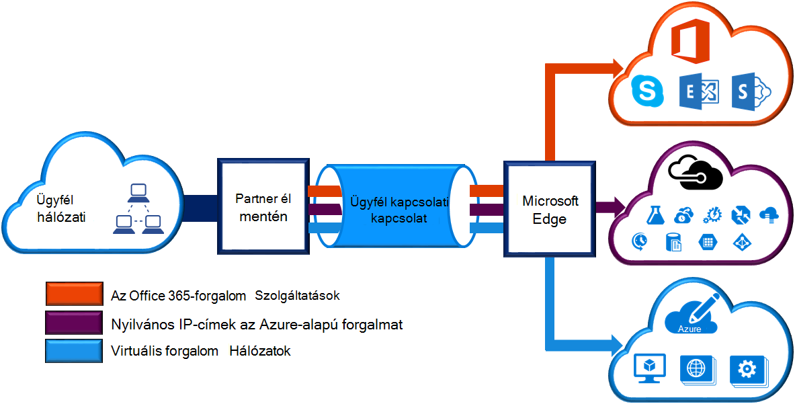
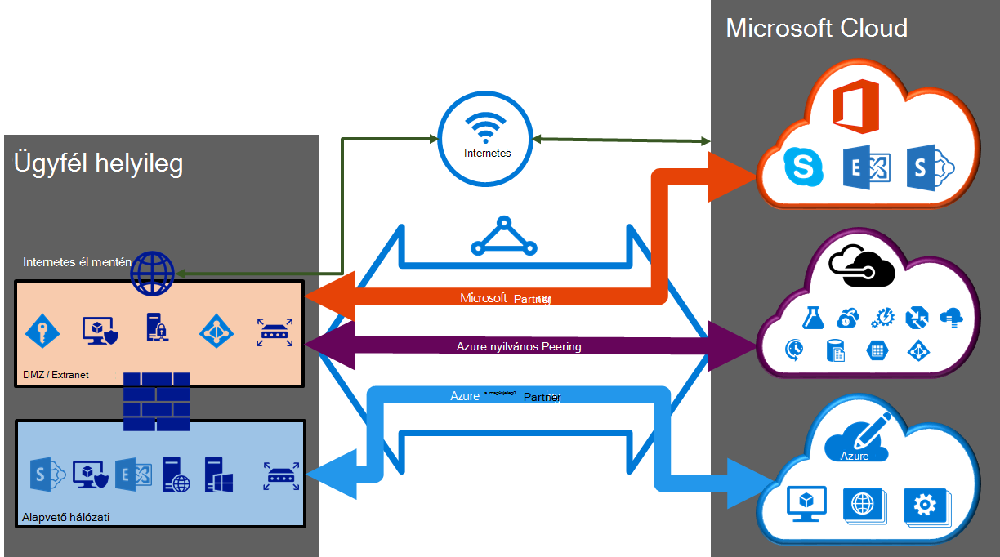

<properties 
   pageTitle="Készült ExpressRoute áramkörök és útválasztási tartományok |} Microsoft Azure"
   description="Ezen az oldalon a készült ExpressRoute áramkörök és a útválasztási tartományok áttekintése."
   documentationCenter="na"
   services="expressroute"
   authors="cherylmc"
   manager="carmonm"
   editor=""/>
<tags 
   ms.service="expressroute"
   ms.devlang="na"
   ms.topic="article" 
   ms.tgt_pltfrm="na"
   ms.workload="infrastructure-services" 
   ms.date="10/10/2016"
   ms.author="cherylmc"/>

# Készült ExpressRoute áramkörök és útválasztási tartományok

 Egy *készült ExpressRoute áramkör* a helyszíni infrastruktúra csatlakozni a Microsoft egy kapcsolatot szolgáltatón keresztül kell rendelni. Az alábbi ábrán egy logikai ábrázolhatók az a WAN- és Microsoft közötti kapcsolatot.

## Áramkörök készült ExpressRoute

Az *készült ExpressRoute áramkör* a helyszíni infrastruktúra és a Microsoft felhőszolgáltatásokhoz egy kapcsolatot közvetítésével közötti logikai kapcsolat jelöli. Több készült ExpressRoute áramkörök sorrendbe is. Minden áramkör egyforma vagy különböző régiók lehet, és a másik csatlakozási szolgáltatók keresztül a helyi kapcsolhat össze. 

Bármely fizikai entitás nem feleltesse meg készült ExpressRoute áramkörök. A kapcsolat egyedileg azonosítjuk globálisan egyedi azonosítója (s-kulcs) szolgáltatás kulcsként nevű szabvány. Az adatok között a Microsoft, és a kapcsolat szolgáltatója, csak a szolgáltatás kulcs. Az s billentyűt nem egy biztonsági okokból titkos. Nincs 1:1 megfeleltetés között egy készült ExpressRoute áramkör, és az s billentyűt.

Az készült ExpressRoute áramkör beállíthatja, hogy legfeljebb három független peerings:, és a Microsoft Azure nyilvános, Azure magánjellegűként. Független BGP két minden peering munkamenetek minden redundantly be van állítva magas elérhetősége közülük. Van egy 1: n (1 < = N < = 3) közötti az készült ExpressRoute áramkör megfeleltetés és tartományok útválasztás. Egy készült ExpressRoute áramkör bármelyik, kétszeres vagy összes három peerings per készült ExpressRoute áramkör engedélyezve van.
 
Minden áramkör sávszélessége rögzített (50 MB, 100 MB, 200 MB, 500 MB, 1 GB/s, 10 GB/s), és a kapcsolat szolgáltatója és peering hely van rendelve. A sávszélesség, akkor jelölje be a áramköri az összes peerings megoszthatók legyenek. 

### Kvóták korlátai és korlátai

Alapértelmezett kvóták és korlátok vonatkoznak minden készült ExpressRoute áramkör. Keresse meg az [Azure-előfizetést és a szolgáltatás korlátozások, a kvótákat, és a kényszerek](../azure-subscription-service-limits.md) lap kvóták legfrissebb információkat.

## A tartományok útválasztási készült ExpressRoute

Az készült ExpressRoute áramkör van társítva több útválasztási tartományra: Azure nyilvános, Azure személyes és a Microsoft. Minden egyes a útválasztási tartományhoz van beállítva azonos útválasztó két (az aktív-aktív vagy a betöltés megosztása konfigurációja) magas elérhetőség. Azure szolgáltatások kategóriába sorolt *Azure nyilvános* és a *magánjellegű Azure* az IP-címek sémák ábrázolására.

### A magánjellegű peering

Azure-szolgáltatásokkal, azaz a virtuális gépek (IaaS) számítja ki, és egy virtuális hálózaton belül telepített cloud services (PaaS), a személyes peering tartomány keresztül kapcsolhat össze. A magánjellegű peering tartomány egy megbízható bővítmény a Microsoft Azure alapvető hálózati számít. Beállíthatja a kétirányú kapcsolat az alapvető hálózati és Azure virtuális hálózatok (VNets) között. A peering lehetővé teszi a virtuális gépeken futó csatlakozzon, és a felhőszolgáltatásokba közvetlenül az illető saját IP-címek.  

A magánjellegű peering tartomány egynél több virtuális hálózati csatlakozhat. Tekintse át a [Gyakori kérdések lap](expressroute-faqs.md) információt korlátai és korlátai. Korlátozások is keresse fel a legfrissebb információkat [Azure-előfizetést és a szolgáltatás korlátozások, a kvótákat, és a kényszerek](../azure-subscription-service-limits.md) lapot.  Keresse meg a [Útválasztás](expressroute-routing.md) lap útválasztási konfigurációs részletes információkat.

### Nyilvános peering

A nyilvános IP-címek szolgáltatásokból, például a Azure tárhely, az SQL-adatbázisok és a webhelyek ajánlja fel. Magánjellegű csatlakozhat szolgáltatások nyilvános IP-címek, beleértve a felhőbeli szolgáltatások, a nyilvános peering útválasztási tartományra keresztül VIP is. A nyilvános peering tartományt összekapcsolta az a DMZ, és a nyilvános IP-címeket Azure szolgáltatások beolvasása a WAN anélkül, hogy az interneten keresztül csatlakozik. 

Csatlakozási mindig kezdeményezni a WAN Microsoft Azure-szolgáltatásokhoz. Microsoft Azure szolgáltatás nem tudja a hálózatba, és a útválasztási tartományra kapcsolatok kezdeményezhet. Miután engedélyezte a nyilvános peering, tud csatlakozni az Azure szolgáltatások fogja. Azt nem engedélyezik a szelektív válassza a szolgáltatások, amelynek azt meghirdetése útvonalak. Ellenőrizheti, hogy azt meg meghirdetése peering a [Microsoft Azure adatközpont IP-tartományok](http://www.microsoft.com/download/details.aspx?id=41653) lapon keresztül prefixumokban listáját. A lapon a heti frissül.

Egyéni útvonal szűrők adhatja meg a szükséges útvonalak használhatnak a hálózaton belül. Keresse meg a [Útválasztás](expressroute-routing.md) lap útválasztási konfigurációs részletes információkat. Egyéni útvonal szűrők kizárólag a szükséges útvonalak használhatnak a hálózaton belül határozhatja meg. 

További információt a [Gyakori lap](expressroute-faqs.md) nézze át a nyilvános peering útválasztási tartományra támogatott szolgáltatások listája. 
 
### A Microsoft peering

[AZURE.INCLUDE [expressroute-office365-include](../../includes/expressroute-office365-include.md)]

Minden más Microsoft online szolgáltatások (például Office 365-szolgáltatásokkal) kapcsolódási lesz a Microsoft peering keresztül. A WAN- és a Microsoft cloud szolgáltatások a Microsoft peering útválasztási tartományra keresztül kétirányú összekapcsolását engedélyezése azt. Csatolnia kell a Microsoft cloud services csak nyilvános IP-címeket, vagy a kapcsolat szolgáltatója tulajdonában lévő fölé, és meg kell igazodjon a definiált szabályokat. Lásd a [készült ExpressRoute előfeltételekről](expressroute-prerequisites.md) további információt.

Lásd: további információt a támogatott szolgáltatások, a költségek és a konfigurációs részletek [lap – gyakori kérdések](expressroute-faqs.md) . Nézze meg a listában a csatlakozási szolgáltatók peering Microsofthoz kínáló információt [Készült ExpressRoute helyek](expressroute-locations.md) lapon.

## Útválasztási tartomány összehasonlítása

Az alábbi táblázat a három útválasztási tartományok hasonlítja össze.

||**A magánjellegű Peering**|**Nyilvános Peering**|**A Microsoft Peering**|
|---|---|---|---|
|**Max. támogatott per peering # prefixumokban**|Alapértelmezés szerint az készült ExpressRoute prémium verzióval 10 000 4000|200|200|
|**Támogatott IP-címtartományok**|Bármely érvényes IPv4-címet a WAN belül.|Nyilvános IPv4-címei tulajdonosa, vagy a kapcsolat szolgáltatója.|Nyilvános IPv4-címei tulajdonosa, vagy a kapcsolat szolgáltatója.|
|**Szám követelmény**|Személyes és nyilvános SZÁMKÉNT. A nyilvános kell tulajdonjogának SZÁMKÉNT, ha úgy dönt, hogy közül válasszon. | Személyes és nyilvános SZÁMKÉNT. Azonban igazolnia kell a nyilvános IP-címek tulajdonjogát.| Személyes és nyilvános SZÁMKÉNT. Azonban igazolnia kell a nyilvános IP-címek tulajdonjogát.|
|**Útválasztási felület IP-címek**|RFC1918 és a nyilvános IP-címtartományok|Nyilvános IP-címek a útválasztási nyilvántartó regisztrált.| Nyilvános IP-címek a útválasztási nyilvántartó regisztrált.|
|**MD5 kivonat támogatás**| igen|igen|igen|

Megadhatja, hogy egy vagy több útválasztási tartományok engedélyezése a készült ExpressRoute áramkör részeként. Megadhatja, hogy az útválasztó tartományok ugyanazt a VPN elhelyezése, ha azt szeretné, hogy egy egyetlen útválasztási tartományra egyesítheti őket. Is elhelyezheti őket különböző útválasztási tartományok hasonlóan, mint a diagramot. Az ajánlott konfiguráció, hogy magánjellegű peering közvetlenül a core hálózathoz csatlakozik, de a nyilvános és a Microsoft peering hivatkozásokat a DMZ csatlakozik.
 
Ha úgy dönt, hogy az összes három peering munkamenetek, BGP munkamenetek (egy pár az egyes peering:) három párban kell rendelkeznie. Az BGP munkamenet pár biztosítson könnyen hozzáférhető hivatkozást. Réteg 2 kapcsolódási szolgáltatók keresztül csatlakozik, fogja beállításáról és kezeléséről a továbbítás felelős. A [munkafolyamatok](expressroute-workflows.md) készült ExpressRoute beállításának megtekintésével többet is megtudhat.

## Következő lépések

- A szolgáltató keresése. Lásd: [készült ExpressRoute szolgáltatók és helyek megjelenítésére](expressroute-locations.md).
- Győződjön meg arról, hogy a szükséges összes feltétel teljesül-e. Lásd: [készült ExpressRoute Előfeltételek](expressroute-prerequisites.md).
- Állítsa be a készült ExpressRoute kapcsolatot.
    - [Készült ExpressRoute áramkör létrehozása](expressroute-howto-circuit-classic.md)
    - [Állítsa be a útválasztási (áramkör peerings)](expressroute-howto-routing-classic.md)
    - [Hivatkozás egy VNet egy készült ExpressRoute áramkör](expressroute-howto-linkvnet-classic.md)
