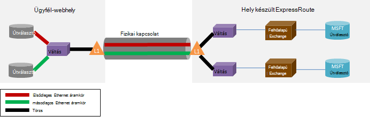

<properties
   pageTitle="Készült ExpressRoute – gyakori kérdések"
   description="Készült ExpressRoute kapcsolatos Gyakori Azure Services támogatott, költség, adatok és a kapcsolatok, SLA, szolgáltatók és helyekre, sávszélesség és további technikai részleteket információkat tartalmazza."
   documentationCenter="na"
   services="expressroute"
   authors="cherylmc"
   manager="carmonm"
   editor=""/>
<tags
   ms.service="expressroute"
   ms.devlang="na"
   ms.topic="article" 
   ms.tgt_pltfrm="na"
   ms.workload="infrastructure-services"
   ms.date="10/10/2016"
   ms.author="cherylmc"/>

# Készült ExpressRoute – gyakori kérdések

## ActiveX-vezérlőket készült ExpressRoute
Készült ExpressRoute egy Azure szolgáltatás, amellyel hozzon létre saját kapcsolatot a Microsoft-adatközpontokkal és a helyszíni, vagy egy colocation intézményben infrastruktúra között. Készült ExpressRoute kapcsolatok ne nyissa meg a nyilvános interneten keresztül, és nagyobb biztonság, megbízhatósága és tipikus kapcsolatok-nél kisebb késések sebesség kínál az interneten keresztül.

### Mik azok a készült ExpressRoute és magánhálózati kapcsolatok használatának előnyei
Készült ExpressRoute kapcsolatok ne nyissa meg a nyilvános interneten keresztül, és nagyobb biztonság, megbízhatóságának és tipikus kapcsolatok-nél kisebb és következetes késések sebesség kínál az interneten keresztül. Egyes esetekben az adatok közötti átviteléhez készült ExpressRoute kapcsolattal a helyszíni eszközök és Azure is hozam költség jelentős előnyökkel jár.

### Melyik Microsoft cloud services támogatja készült ExpressRoute keresztül?
Készült ExpressRoute ma többek között az Office 365-ben a legtöbb Microsoft Azure szolgáltatást támogat.  Keresse meg az általános elérhetősége hamarosan.

### Hol van a szolgáltatás?
Lásd: Ez a szolgáltatás helyét és elérhetősége lap: [készült ExpressRoute partnerek és helyek megjelenítésére](expressroute-locations.md).

### Hogyan használhatom készült ExpressRoute Microsoft csatlakozhat, ha nem rendelkezem partneri egy a készült ExpressRoute-carrier partnereket?
Jelölje ki a regionális carrier, és a szolgáltató helyek land Ethernet-kapcsolatok támogatott cseréje egyikére. A Microsoft a szolgáltató helyen majd peer. Jelölje be a [készült ExpressRoute partnerek és a helyek](expressroute-locations.md) láthatja a szolgáltató szerepel-e az exchange helyeken utolsó szakaszát. A Kapcsolódás a Azure-szolgáltatón keresztül egy készült ExpressRoute áramkör majd sorrendbe is.

### Mennyibe kerül az készült ExpressRoute költség?
Jelölje be a [Részletek árak](https://azure.microsoft.com/pricing/details/expressroute/) árinformációkat.

### Ha egy adott sávszélesség-készült ExpressRoute áramkör lehet fizet, nem lehet megvásárolni a szolgáltató a virtuális Magánhálózati kapcsolat kell lenniük ugyanolyan legyen a sebessége?
nem. A virtuális Magánhálózati kapcsolat bármely sebességének szolgáltatótól vásárolhat. A kapcsolat a Azure azonban vásárolhat készült ExpressRoute áramkör sávszélességét korlátozott lesz.

### Ha egy adott sávszélesség-készült ExpressRoute áramkör lehet fizet, van az azt jelenti, hogy burst felfelé nagyobb sebesség, szükség esetén?
igen. Támogatja az esetekben, ahol azt is burst legfeljebb kétszer, nincs további költség beszerzett sávszélességre vonatkozó készült ExpressRoute áramkörök vannak beállítva. Ha támogatják ezt a lehetőséget, jelölje be a szolgáltató.

### Van lehetőség a azonos magánhálózati kapcsolat virtuális hálózati és más Azure szolgáltatásokhoz egyidejű?
igen. Az készült ExpressRoute áramkör egyszer beállítás lehetővé teszi, egyidejű elérése és egyéb Azure szolgáltatás egy virtuális hálózaton belül. Fog virtuális hálózatok keresztül kapcsolódik a magánjellegű peering elérési utat és a más szolgáltatásokhoz nyilvános peering elérési fölé.

### Ajánlja fel a szolgáltatási szerződés SZOLGÁLTATÁSISZINT-készült ExpressRoute?
Olvassa el a [készült ExpressRoute szolgáltatásiszint-szerződés lap](https://azure.microsoft.com/support/legal/sla/) további információt.

## Támogatott szolgáltatások
Leginkább Azure-szolgáltatások támogatottak készült ExpressRoute fölé.

- Virtuális gépeken futó és üzembe virtuális hálózatok felhőszolgáltatások kapcsolódási fölé a magánjellegű peering elérési támogatottak.
- Azure webhelyek keresztüli nyilvános peering elérési támogatottak.
- IoT központi keresztüli nyilvános peering elérési használata támogatott.
- Az Office 365 támogatott Microsoft peering elérési fölé.
- Minden más szolgáltatások keresztüli nyilvános peering elérési érhetők el. A kivételek a következők:

    **Az alábbi szolgáltatások nem támogatottak:**

    - CDN
    - Visual Studio csapat szolgáltatások betöltés tesztelése
    - Többtényezős hitelesítés
    - Adatforgalom Manager

## Adatok és a kapcsolatokkal

### Van-e készült ExpressRoute segítségével átviheti adatmennyiség vonatkozó korlátok?
Azt nem korlátozhatja adatátvitel mennyiségét. Keresse meg a [Részletek árak](https://azure.microsoft.com/pricing/details/expressroute/) sávszélesség díjak olvashat.

### Milyen kapcsolat sebessége készült ExpressRoute által támogatott?
Támogatott sávszélesség ajánlatok:

|} 50 MB, 100 MB, 200 MB, 500 MB, 1Gbps, 2 GB/s, 5 GB/s, 10Gbps |}

### Melyik szolgáltatók érhetők el?
Lásd: [készült ExpressRoute partnerek és a helyek](expressroute-locations.md) szolgáltatók és helyek listáját.

## Műszaki információk

### Mik azok a helyszíni tartózkodási csatlakoztatása az Azure technikai követelményei?
Követelményeket, lásd: [készült ExpressRoute Előfeltételek lapot](expressroute-prerequisites.md) .

### Nem kapcsolatok készült ExpressRoute felesleges?
igen. Minden Express útvonal áramkör tartományok magas rendelkezésre állás konfigurált kapcsolatok felesleges két tartalmaz.

### Elvesznek a kapcsolatot, ha az egyik saját készült ExpressRoute hivatkozások nem?
Nem elveszti a kapcsolatot, ha nem sikerül egy egyik közötti kapcsolatot. A felesleges kapcsolatot támogató hálózatát terhelését érhető el. A hiba címtárfrissítések eléréséhez peering máshová továbbá több áramkörök hozhat létre.

### Ha a nem vagyok a felhőben exchange közös található, és a szolgáltató biztosít pontok közötti kapcsolat, kell a helyszíni hálózaton és a Microsoft között két fizikai kapcsolatok rendezése? 
Nem, csak akkor van szüksége egy fizikai kapcsolat, ha a szolgáltató két Ethernet virtuális kapcsolatokat hozhat létre a fizikai kapcsolaton keresztül. A fizikai kapcsolat (pl. optikai szál) megszakad a réteg 1 (L1) eszköz (lásd az alábbi képen). A két Ethernet virtuális kapcsolatok különböző virtuális azonosítók, egy, az elsődleges áramkör és egy másodlagos vannak címkézve. Adott virtuális azonosítók szerepelnek, a külső 802.1Q Ethernet fejléc. A belső 802.1Q Ethernet fejléc (nem jelenik meg) hozzá van rendelve egy adott [készült ExpressRoute útválasztási tartományra](expressroute-circuit-peerings.md). 

### Is lehet ki egyet a VLAN Azure készült ExpressRoute használatával?
nem. Az Azure nem támogatjuk az réteg 2 kapcsolódási bővítmények.

### Lehet-e több készült ExpressRoute áramkör az előfizetésem?
igen. Az előfizetés a egynél több készült ExpressRoute áramkör is. Alapértelmezett korlát a dedikált áramkörök 10 értékre van állítva. Kapcsolatba léphet a Microsoft Support növelheti a korlátot, ha szükséges.

### Lehet, hogy a különböző szolgáltatók készült ExpressRoute áramkörök?
igen. Sok szolgáltatókkal készült ExpressRoute áramkörök is. Minden készült ExpressRoute áramkör lesz egy szolgáltatót társítva.

### Hogyan a virtuális hálózatok csatlakoztatása az készült ExpressRoute áramkör
Az alapvető lépések alatti mutatja.

- Az készült ExpressRoute áramkör létrehozására és a hozzáférés-szolgáltató kapcsolhatja be van.
- Ön vagy a szolgáltató konfigurálnia kell a BGP peering (vasárnap).
- A virtuális hálózat hozzá kell rendelnie az készült ExpressRoute áramkör.

További információt talál [készült ExpressRoute munkafolyamatok áramkör kiépítési és áramkör állapotát](expressroute-workflows.md) .

### Vannak-e a készült ExpressRoute áramkör kapcsolódási határai?
igen. [Készült ExpressRoute partnerek és a helyek](expressroute-locations.md) lapon a kapcsolat határok áttekintést nyújt az készült ExpressRoute áramkör. Kapcsolat-készült ExpressRoute áramkör korlátozódik egyetlen geopolitikai területére. Csatlakozási kibontható geopolitikai régiók cross, mivel a készült ExpressRoute prémium funkció.

### Hivatkozhatok egy készült ExpressRoute áramkör egynél több virtuális hálózat?
igen. Legfeljebb 10 virtuális hálózatok hozzákapcsolhatja egy készült ExpressRoute áramkör.

### Virtuális hálózatok tartalmazó több Azure előfizetés-e. Csatlakoztathatja virtuális hálózatok, amelyek a egyetlen készült ExpressRoute áramkört külön előfizetés?
igen. Engedélyezheti, hogy legfeljebb 10 Azure előfizetések egy egyetlen készült ExpressRoute áramkör használni. Ezt a korlátot, mivel a készült ExpressRoute prémium funkció növelhető.

További részletekért olvassa el [az készült ExpressRoute áramkör több előfizetésekben megosztása](expressroute-howto-linkvnet-arm.md).

### Az azonos áramkör, egymástól elszigetelt csatlakoztatott virtuális hálózatok?
nem. Az azonos készült ExpressRoute áramkör kapcsolódó összes virtuális hálózatok útválasztási tartományra részeként, és nem a útválasztási szemszögéből egymástól elszigetelt. Ha útvonal elkülönítési, kell külön készült ExpressRoute áramkör létrehozása.

### Felvehetek-e több készült ExpressRoute áramkör csatlakozik egy virtuális hálózatot?
igen. A 4 készült ExpressRoute áramkörök virtuális egyetlen hálózat csatolhat. Azok 4 különböző [készült ExpressRoute helyek](expressroute-locations.md)keresztül kell rendelni.

### Elérhető a saját virtuális hálózati készült ExpressRoute áramkörök csatlakozik az internethez?
igen. Ha nincs közzététel alapértelmezett útvonalak (0.0.0.0/0) vagy az internet útvonal prefixumokban a BGP munkamenet keresztül, lesz csatolva az készült ExpressRoute áramkör virtuális hálózaton keresztül csatlakozik az internethez.

### Megakadályozhatja a virtuális hálózatokhoz kapcsolódó készült ExpressRoute áramkörök internetkapcsolat?
igen. Alapértelmezett útvonalak (0.0.0.0/0) összes internetkapcsolat virtuális gépeken futó virtuális hálózaton belül rendszerbe való blokkolásához meghirdetése, és a forgalmat minden, a készült ExpressRoute áramkör keresztül. Figyelje meg, hogy alapértelmezett útvonalak meghirdetése akkor, ha azt fogja kényszerítése forgalmat a helyszíni környezetbe nyilvános peering (például Azure tárolási és SQL-adatbázis) vissza fölé kínált szolgáltatások. Be kell konfigurálni az útválasztó forgalom való visszatéréshez Azure vagy az interneten keresztül a nyilvános peering elérési.

### Az azonos készült ExpressRoute áramkör kapcsolt virtuális hálózatok beszélgethet egymást?
igen. Virtuális gépeken futó telepítését virtuális hálózatok ugyanazt az készült ExpressRoute áramkört csatlakozik az egymással kommunikálhat.

### Van lehetőség a webhely kapcsolat készült ExpressRoute együtt virtuális hálózatok?
igen. Készült ExpressRoute a webhely VPN adatai is megtalálhatók.

### Áthelyezhetők-e egy virtuális hálózati hely közötti / webhely-pont konfiguráció készült ExpressRoute használni?
igen. Be kell hozzon létre egy készült ExpressRoute átjáró a virtuális hálózaton belül. A folyamathoz kapcsolódó egy kis állásidőt lesz.

### Mit kell csatlakozás Azure tároló készült ExpressRoute keresztül?
Az készült ExpressRoute áramkör létrehozni és útvonalak nyilvános peering konfigurálnia kell.

### Vannak-e az e is meghirdetése útvonalak számával?
igen. Azt fogadja el a személyes peering 4000 útvonal prefixumokban és 200 minden nyilvános peering és Microsoft peering felfelé. A magánjellegű peering, ha engedélyezi a készült ExpressRoute prémium funkció 10 000 útvonalak növelheti.

### Van-e is meghirdetése fölé a BGP munkamenet IP-címtartományai korlátozásai?
Azt a nyilvános és a Microsoft peering BGP munkamenetben nem fogadja el a magánjellegű prefixumokban (RFC1918).

### Mi történik, ha lehet nagyobb, mint a BGP korlátozza?
A program eltávolítja BGP munkamenetek. Ha az előtag száma meghaladja az Ugrás törlődnek.

### Mi az a készült ExpressRoute BGP tartsa időt? Rá lehet beállítani?
A hívásvárakoztatás ideje 180. A életben üzenetküldés 60 másodpercenként. Javított ezek beállítások nem módosíthatók a Microsoft oldalon.

### Miután a virtuális hálózatokhoz lehet meghirdetése az alapértelmezett útvonal (0.0.0.0/0), az Azure VMs futó Windows nem aktiválhatók. Hogyan szeretné oldható meg?
Azure ismeri fel az aktiválási kérést segítséget nyújt az alábbi lépéseket:

1. A szülőlekérdezésben hozza létre a készült ExpressRoute áramkör nyilvános peering.
2. Végezze el a DNS-keresés és **kms.core.windows.net** IP-címének megkeresése
3. Hajtsa végre az alábbi két elemet, hogy a kulcskezelő szolgáltatás fel fogja ismerni az, hogy az aktiválási kérést Azure származik, és akkor figyelembe veszi a kérést.
    - A helyszíni hálózaton átirányíthatja az adatforgalmat vissza az Azure keresztül peering nyilvános IP-cím (kapott lépés: 2).
    - A NSP szolgáltató szőr-PIN-kódot a forgalmat a nyilvános peering keresztül Azure van.

### Megváltoztathatom-e a sávszélesség-készült ExpressRoute áramkör?
igen. A sávszélesség-készült ExpressRoute áramkör növelésével vághat azt nélkül. Be kell nyomon követésre beállított annak érdekében, hogy a saját hálózatát sávszélesség növekedés támogatásához belül szabályozás frissítse a csatlakozási szolgáltatónál. Azonban nem fogja tudni a sávszélesség-készült ExpressRoute áramkör csökkentése érdekében. A sávszélesség le azt jelenti, egy könnycsepp alsó és szabadidő-készült ExpressRoute áramkör kellene.

### Hogyan módosíthatom a sávszélesség-készült ExpressRoute áramkör?
A sávszélesség a dedikált frissítés áramkör API-val és a PowerShell alrendszer készült ExpressRoute áramkör frissíthetők.

## Prémium készült ExpressRoute

### Mit nevezünk készült ExpressRoute prémium verzióban?
Készült ExpressRoute prémium az alábbi funkciók gyűjteménye.

 - Nagyobb 10 000 útvonalak magánjellegű peering a 4000 útvonalak útválasztási táblázat korlátozott.
 - Nagyobb, amely a készült ExpressRoute áramkör kapcsolhat össze VNets száma (az alapértelmezés: 10). További információt az alábbi táblázatban látható.
 - Globális kapcsolatot a Microsoft core hálózaton keresztül. Most már tudja csatolni egy másik régióban egy készült ExpressRoute áramkör, geopolitikai régióban VNet. **Példa:** Az készült ExpressRoute áramkör szilícium völgyi létrehozott Europe nyugati programban létrehozott egy VNet csatolhat.
 - Az Office 365-szolgáltatások és CRM Online kapcsolat.

### Hány VNets hivatkozhatok egy készült ExpressRoute áramkör lehet engedélyezés készült ExpressRoute prémium verzió esetén?
Az alábbi táblázatoknak megjelenítése a készült ExpressRoute korlátai és készült ExpressRoute áramkör VNets száma.

[AZURE.INCLUDE [expressroute-limits](../../includes/expressroute-limits.md)]

### Hogyan engedélyezhetem készült ExpressRoute prémium verzióban?
Ha engedélyezve van a szolgáltatás, és a kapcsolat állapota frissítésével kell leállítása engedélyezheti készült ExpressRoute prémium szolgáltatásaihoz. Áramköri létrehozáskor készült ExpressRoute prémium engedélyezheti, vagy felhívhatja, ha a frissítés dedikált áramkör API / PowerShell-parancsmag ahhoz, hogy készült ExpressRoute prémium verzióban.

### Hogyan tilthatom le a készült ExpressRoute prémium verzióban?
Letilthatja készült ExpressRoute prémium hívja fel a kitűzött célja frissítés áramkör API-t, és győződjön meg arról, hogy van-e átméretezi a csatlakozási PowerShell-parancsmag kell felel meg az alapértelmezett korlátokat készült ExpressRoute prémium letiltása előtt. Azt a kérelem készült ExpressRoute prémium letiltása, ha a kihasználtság méretezze át az alapértelmezett korlátokat túl sikertelen lesz.

### E kiválaszthatja a funkciók a prémium funkció készletből szeretnék?
nem. Nem tudja válassza ki a szolgáltatásokra van szükség. Az összes szolgáltatások azt engedélyezése, ha bekapcsolja készült ExpressRoute prémium.

### Mennyibe kerül az készült ExpressRoute prémium költség?
Keresse meg a [Részletek árak](https://azure.microsoft.com/pricing/details/expressroute/) költség.

### Végezze el e fizetni készült ExpressRoute prémium szabványos készült ExpressRoute díjak kívül?
igen. Készült ExpressRoute prémium tarifa szerint a készült ExpressRoute áramkör és a kapcsolat szolgáltatója szükséges díjakat fölött.

## Készült ExpressRoute és az Office 365-szolgáltatások CRM Online

[AZURE.INCLUDE [expressroute-office365-include](../../includes/expressroute-office365-include.md)]

### Hogyan hozhatok létre egy készült ExpressRoute áramkör, az Office 365-szolgáltatások és CRM Online csatlakozni?

1. A [készült ExpressRoute Előfeltételek lap](expressroute-prerequisites.md) áttekintése ellenőrizze, hogy a követelményeknek.
2. Tekintse át a győződjön meg arról, hogy igényeinek megfelelően kapcsolat teljesül a szolgáltatók és a helyek [készült ExpressRoute partnerek](expressroute-locations.md) és a helyek listáját.
3. [Hálózattervezés és teljesítményhangolás az Office 365](http://aka.ms/tune/)megtekintésével tervezze meg az kapacitás igényeknek megfelelően alakíthatja.
4. Kövesse az munkafolyamatokban kapcsolódási [áramkör kiépítési és áramkör állapotát készült ExpressRoute munkafolyamatok](expressroute-workflows.md)beállítása az alábbi lépéseket.

>[AZURE.IMPORTANT] Győződjön meg arról, hogy engedélyezte a készült ExpressRoute prémium bővítmény használatára feljogosító Office 365-szolgáltatások és CRM Online kapcsolódási konfigurálásakor.

### Szükség van Azure nyilvános Peering Office 365-szolgáltatásokkal való kapcsolódáshoz és CRM Online engedélyezése?
Nem, csak kell ahhoz, hogy a Microsoft Peering. Azure Active Directory Authentication forgalom Microsoft Peering keresztül küld. 

### A meglévő készült ExpressRoute áramkörök támogatniuk connectivity az Office 365-szolgáltatások és CRM Online?
igen. A meglévő készült ExpressRoute áramkör beállítható úgy, hogy az Office 365-ös szolgáltatásokhoz kapcsolódási támogatja. Győződjön meg arról, hogy rendelkezik-e elegendő kapacitása ahhoz, hogy az Office 365-ös szolgáltatásokhoz csatlakozhat, és győződjön meg arról, hogy engedélyezte a prémium bővítmény. [Hálózattervezés és teljesítményhangolás az Office 365](http://aka.ms/tune/) segítik majd kapcsolódási igényeinek megfelelően. Lásd még [létrehozása és módosítása az készült ExpressRoute áramkör](expressroute-howto-circuit-classic.md).

### Milyen szolgáltatások készült ExpressRoute-kapcsolaton keresztül érhető el az Office 365?

Naprakész fölé készült ExpressRoute támogatott szolgáltatások listáját [az Office 365 URL-EK és IP-címtartományok](http://aka.ms/o365endpoints) lap vonatkoznak.

### Mennyibe kerül készült ExpressRoute az Office 365-szolgáltatások és CRM Online költség?
Az Office 365-szolgáltatások és CRM Online szükséges prémium bővítmény engedélyezését. A [Részletek lap árak](https://azure.microsoft.com/pricing/details/expressroute/) költségek részleteit biztosít készült ExpressRoute.

### Milyen régiók az Office 365-höz készült ExpressRoute támogatott?
Olvassa el az [készült ExpressRoute partnerek és a helyek](expressroute-locations.md) további információt a listáról, partnerek és a helyek, ahol készült ExpressRoute támogatott.

### Elérhető az Office 365-ben az interneten keresztül még akkor is, ha a szervezet számára készült ExpressRoute konfigurált?
igen. Az Office 365 szolgáltatás végpontok az interneten keresztül érhető el, annak ellenére, hogy a hálózat készült ExpressRoute lett beállítva. Ha van konfigurálva, hogy csatlakoztatása az Office 365-szolgáltatásokkal keresztül készült ExpressRoute helyre, fog keresztül csatlakozik az internetre készült ExpressRoute.

### Dynamics AX Online is elérhető készült ExpressRoute-kapcsolaton keresztül?
Nem, nem támogatott.
