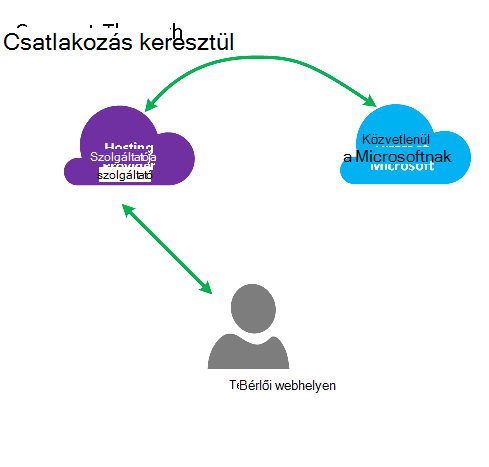
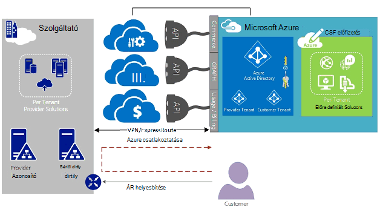
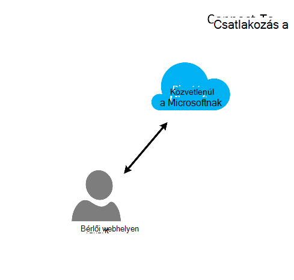
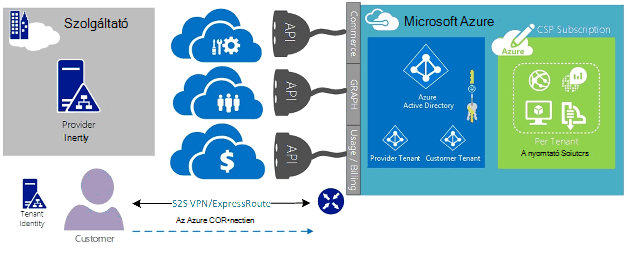
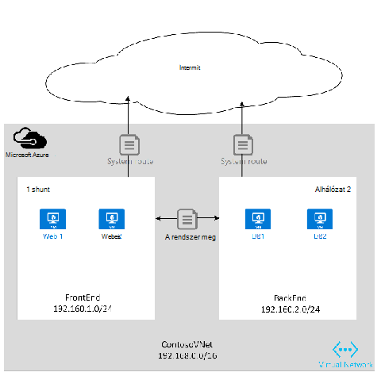
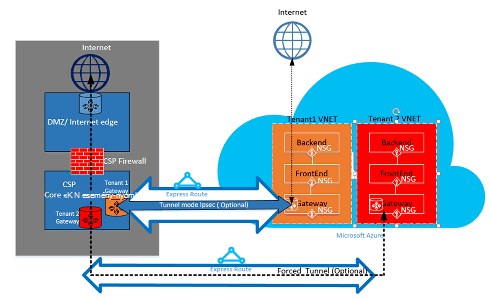

<properties
   pageTitle="Felhőalapú megoldás szolgáltatók számára készült Azure ExpressRoute |} Microsoft Azure"
   description="Ebben a cikkben az adatok szeretné szerepeltetni a Azure szolgáltatások felhő szolgáltatók és készült ExpressRoute az illető szeretne rendelni."
   documentationCenter="na"
   services="expressroute"
   authors="richcar"
   manager="carmonm"
   editor=""/>
<tags
   ms.service="expressroute"
   ms.devlang="na"
   ms.topic="get-started-article"
   ms.tgt_pltfrm="na"
   ms.workload="infrastructure-services"
   ms.date="10/10/2016"
   ms.author="richcar"/>

# Felhőalapú megoldás szolgáltatók (CSP) készült ExpressRoute

A Microsoft nyújt a Hyper-skála szolgáltatások, a hagyományos viszonteladókon és a disztribútorok (CSP) engedélyezni szeretné gyorsan kiépítése az új szolgáltatások és megoldások nincs szükség fejlesztésében ezeket a szolgáltatásokat igénybe veszi ügyfeleinek. Ha engedélyezni szeretné a felhőben megoldás szolgáltató (CSP) az azt jelenti, hogy közvetlenül a következő új szolgáltatások kezelése, a Microsoft programok és az API-hoz, amely lehetővé teszi a Microsoft Azure erőforrások nevében az ügyfelekkel, ha biztosít. Ezek az erőforrások egyik készült ExpressRoute. Készült ExpressRoute, ha meglévő erőforrások ügyfelek számára csatlakoztatása Azure szolgáltatás lehetővé teszi. Készült ExpressRoute található egy nagy sebességű magánjellegű kommunikációt hivatkozás szolgáltatások Azure-ban. 

Egy egyetlen ügyfél előfizetés(ek) vannak csatolva, és nem kell megosztania több ügyfél áramkörök magas elérhetőség két ExpresRoute áll. Minden áramkör meg kell szüntetni a különböző az útválasztó magas rendelkezésre állásának.

>[AZURE.NOTE] Nincsenek sávszélessége és a kapcsolat CAPS LOCK készült ExpressRoute, ami azt jelenti, hogy nagy/komplex megvalósítás van szükség több készült ExpressRoute áramkörök egyetlen ügyfél számára.

Microsoft Azure többféle növekvő ügyfeleinek kínálhat szolgáltatásokat.  A legjobb take előnyeit, az alábbi szolgáltatások használata esetén kell készült ExpressRoute kapcsolatok nyújtanak nagy sebességű alacsony késés eléréséhez a Microsoft Azure környezetben.

## Microsoft Azure kezelése
A Microsoft az Azure ügyfél előfizetések kezelése azáltal, hogy a saját szolgáltatás rendszerek programozott integráció az API-khoz a szolgáltató sincs biztosít. Támogatott kezelési lehetőségek találhatók [Itt](https://msdn.microsoft.com/library/partnercenter/dn974944.aspx).

## Microsoft Azure az erőforrás-kezelés
Attól függően, hogy az ügyfél szerződés meghatározza, hogy az előfizetés kezelésének. A CSP közvetlenül kezelhetik a létrehozás és erőforrások vagy a vevő a karbantartás is kezelése a Microsoft Azure-előfizetés vezérlő és létrehozása az Azure erőforrások szükségük van. Ha az ügyfél kezeli az erőforrások a Microsoft Azure-előfizetésének kibocsátása alkalmazzák két modell egyik: modell "Csatlakozás-től" vagy "Közvetlen – vagy ha" modell. Ezek a modellek az alábbi szakaszok részletesen.  

### Csatlakozás keresztül modell

  

A csatlakozás keresztül modell a CSP kapcsolatot hoz létre közvetlenül a adatközponthoz és Azure az ügyfél-előfizetés között. A közvetlen kapcsolat készült, a hálózati csatlakozás Azure ExpressRoute használatával. Kattintson az ügyfél a hálózathoz csatlakozik. Ebben az esetben igényel, hogy az ügyfél halad-e a CSP hálózat Azure szolgáltatások eléréséhez. 

Az ügyfél tartalmazza az egyéb Azure nem az Ön által felügyelt, ha azokat a nyilvános internetkapcsolat, vagy a saját személyes kapcsolat azokat a szolgáltatásokat, csoportban a nem CSP előfizetés kiépítve csatlakozhat használna. 

Az Azure-szolgáltatások kezelése CSP annak feltételezett, hogy a CSP van-e egy korábban létrehozott felhasználói identitás tárolására, amely szeretné majd kell replikált az Azure Active Directory CSP előfizetésének keresztül Administrate-On-Behalf-Of (AOBO) kezelésére. Ebben az esetben kulcs illesztőprogramjainak hol egy adott partner vagy szolgáltató egy elfogadott kapcsolatban az ügyféllel, az ügyfél jelenleg fogyasztása a szolgáltató services vagy a partner tartalmaz kell, adja meg a szolgáltató által üzemeltetett, és a Azure megoldások rugalmasság és megadására vevő címe problémáit, amelyben egyedül CSP által nem teljesül kombinációi tartalmazzák. Ez a modell alább látható az **ábrán**.

### Csatlakozás a modell

A csatlakozás a modell a szolgáltató kapcsolatot hoz létre közvetlenül az ügyfél adatközponthoz és a kiépítve CSP Azure előfizetés készült ExpressRoute használata során az ügyfél (ügyfél) közötti hálózati.

>[AZURE.NOTE] Készült ExpressRoute az ügyfél kellene létrehozása és kezelése a készült ExpressRoute áramkör.  

Ebben az esetben a kapcsolat szükséges, hogy az ügyfél csatlakozik közvetlenül az Azure előfizetésének CSP kezelt elérési ügyfél hálózaton keresztül létrehozott, a tulajdonosa és részben vagy egészben felügyelt ügyfél által közvetlen hálózati kapcsolaton keresztül. A vevők azt feltételezzük, hogy a szolgáltató pillanatnyilag nem rendelkezik egy ügyfél-azonosító tároló létrehozott, és a szolgáltatót szeretne segítséget nyújt az ügyfél az aktuális azonosítás store replikálása az Azure Active Directory AOBO keresztül előfizetésének kezelése az. Ebben az esetben kulcs illesztőprogramjainak hol egy adott partner vagy szolgáltató egy elfogadott kapcsolatban az ügyféllel, az ügyfél jelenleg fogyasztása a szolgáltató szolgáltatások, vagy a partner tartalmaz kell alapuló kizárólag megoldások Azure által üzemeltetett meglévő szolgáltató adatközponthoz vagy infrastruktúra nélkül szolgáltatások tartalmazzák.

Az alábbi két lehetőség közötti választást az ügyfél igényeinek és Azure szolgáltatások nyújtása a jelenlegi kell alapulnak. A részletek, ezek a modellek és a kapcsolódó szerepköralapú hozzáférés-vezérlőjével, a hálózathasználatra és az Identitáskezelés tervezés mintázatok tartoznak, az alábbi hivatkozások részletei:
-   **Szerepkör alapján Access vezérlő (RBAC)** – RBAC Azure Active Directory alapul.  Azure RBAC további információt talál [az alábbi](../active-directory/role-based-access-control-configure.md).
-   A **hálózat** – bemutatja a különböző témakörök a hálózat Microsoft Azure-ban.
-   **Azure Active Directory (AAD)** – AAD biztosít az Identitáskezelés Microsoft Azure és a 3 szoftver alkalmazásait. Azure Active Directory Lásd: további információt [Itt](https://azure.microsoft.com/documentation/services/active-directory/).  

## Hálózati sebesség
Készült ExpressRoute támogatja a 10Gb/s: 50 Mb/s hálózati sebességet. Ez lehetővé teszi a felhasználóknak saját egyedi környezet szükséges hálózati sávszélességet vásárlásához.

>[AZURE.NOTE] Hálózati sávszélesség kommunikáció megszakítása nélkül szükség szerint kell emelni, de csökkentheti a hálózat sebességétől és elő kell készítenie lefelé a áramkör szakadás elemre az alsó hálózat sebességétől kiindulópontként azt.  

Készült ExpressRoute több vNets egy egyetlen készült ExpressRoute áramkör szeretne csatlakozni a gyorsabb kapcsolatok jobb hasznosítása támogatja. Egy egyetlen készült ExpressRoute áramkör közösen ugyanazon ügyfél által birtokolt több Azure előfizetés használhatják.

## Készült ExpressRoute konfigurálása
Készült ExpressRoute beállítható úgy, hogy háromféle forgalom ([Útválasztási tartományok](#ExpressRoute-routing-domains)) támogatja a egyetlen készült ExpressRoute áramkört fölé. A forgalom Microsoft peering, Azure nyilvános peering, és a személyes peering van elkülönítve. Megadhatja, hogy egy vagy összes típusú forgalom fölé egy egyetlen készült ExpressRoute áramkör el lehet küldeni, vagy használja a készült ExpressRoute áramkör és az ügyfél által igényelt elkülönítési méretétől függően több készült ExpressRoute áramkörök. Az ügyfél, a biztonsági testtartását címeknél nem alkalmazható, nyilvános és titkos forgalmat bejárásához ugyanazt az áramkört fölé.

### Csatlakozás keresztül modell
Csatlakozás keresztül konfigurációban a fogja az összes a hálózati underpinnings az ügyfelek adatközponthoz erőforrások csatlakozhat az Azure-ban tárolt előfizetések felelős. Az ügyfél Azure lehetőségeit használni kívánt minden egyes szükségük van a saját készült ExpressRoute kapcsolat kezelik az Ön által. A fogja használni a készült ExpressRoute áramkör szerezze be az ügyfél használna ugyanazokat a módszereket. Az Ön követi áramkör kiépítési és áramkör állapotát a [készült ExpressRoute munkafolyamatok](./expressroute-workflows.md) cikkben ismertetett lépéseket. A, majd beállítja a szegély átjáró Protocol (BGP) útvonalak szabályozhatja a forgalmat a helyszíni hálózaton és Azure vNet között folyó.

### Csatlakozás a modell
Csatlakozás a konfigurációban az ügyfél már van egy meglévő kapcsolat Azure vagy készült ExpressRoute összekapcsolása az ügyfél saját adatközponthoz a közvetlenül az Azure helyett a adatközponthoz internetszolgáltatóhoz kapcsolat kezdeményez. A kiépítési folyamat indításához az ügyfél fog kövesse a fentebb ismertetett a csatlakozás keresztül modell. Miután a kapcsolat létrejött, az ügyfél kell a helyszíni útválasztó fér hozzá a hálózati és az Azure vNets konfigurálása.

Állítsa be a kapcsolatot, és a útvonalak beállításához az erőforrások engedélyezni az ügyfél erőforrások az adatközpont, vagy az erőforrások Azure-ban is kapcsolatba lépni a datacenter(s) segítséget.

## A tartományok útválasztási készült ExpressRoute
Készült ExpressRoute kínál három útválasztási tartományok: nyilvános, a személyes és a Microsoft peering. Minden útválasztási a tartomány aktív-aktív konfigurációban magas elérhetőség azonos útválasztó van beállítva. További információt a készült ExpressRoute útválasztási tartományok keresse meg [az alábbi](./expressroute-circuit-peerings.md).

Egyéni útvonalak szűrők engedélyezése csak a engedélyezése vagy szükséges módra határozhatja meg. További információk és megtudhatja, hogy miként, olvassa el a változtatások: [létrehozása és módosítása a PowerShell használatá készült ExpressRoute áramkör útválasztás](./expressroute-howto-routing-classic.md) útválasztási szűrők olvashat bővebben.

>[AZURE.NOTE] A Microsoft és a nyilvános Peering kapcsolódási azonban a nyilvános IP-címet, az ügyfél vagy CSP tulajdonában kell lennie, és az összes meghatározott szabályokat kell igazodjon. További tudnivalókért lásd: a [Készült ExpressRoute Előfeltételek](expressroute-prerequisites.md) lapot.  

## Továbbítás
Az Azure hálózatok között az Azure virtuális hálózati átjáró készült ExpressRoute csatlakozik. Hálózati átjárók adja meg az Azure virtuális hálózatok útválasztás.

Azure virtuális hálózatok létrehozása is táblát hoz létre alapértelmezett útválasztási esetében a vNet irányítsa át a alhálózat, a vNet/érkező forgalmat. Ha az alapértelmezett útvonal táblázat nem elegendő az egyéni megoldás útvonalak létrehozhatók a forgalmat a kimenő egyéni készülékek vagy blokk útvonalak adott alhálózat vagy külső hálózatokhoz.

### Alapértelmezett továbbítása
Az alapértelmezett útvonal táblázat az alábbi útvonalak tartalmazza:

- Továbbítás alhálózat
- Alhálózat-a-alhálózat a virtuális hálózaton belül
- Internetkapcsolat
- Virtuális hálózati és – a virtuális hálózati VPN-átjáró segítségével
- Virtuális hálózat-a-helyszíni hálózaton VPN vagy készült ExpressRoute átjáró segítségével

  

### Felhasználó által definiált útválasztási (UDR)
Felhasználó által definiált útvonalak lehetővé a forgalom kimenő a tevékenységhez rendelt alhálózat más alhálózathoz a virtuális hálózat vagy az előre definiált átjárók (készült ExpressRoute; internetes vagy VPN) feletti közül. Az alapértelmezett rendszer útválasztási tábla is egy felhasználó által definiált kiosztási táblázat, amely az alapértelmezett útválasztási táblázat cseréli az egyéni útvonalak kell cserélni. Felhasználó által definiált útválasztási ügyfelek létrehozhat adott utakat, például a tűzfalak készülékek vagy behatolási készülékek, vagy letiltása az access adott alhálózathoz az alhálózathoz szolgáltatója a felhasználó által definiált útvonal. Keresse meg a felhasználó által definiált útvonalak áttekintése [Itt](../virtual-network/virtual-networks-udr-overview.md). 

## Biztonsági
Attól függően, hogy melyik modellt használatban van, csatlakozás vagy csatlakozás keresztül az ügyfél határozza meg, hogy a biztonsági házirendek azok vNet, vagy azok vNets meghatározhatja a CSP házirend követelmények biztonságát. Az alábbi biztonsági feltételek határozható meg:

1.  **Ügyfél elkülönítési** – az Azure platform Vevőkód és vNet információ tárolása biztonságos adatbázis, amellyel a egy es alagutas az egyes ügyfelek forgalom beágyazására ügyfél elkülönítési biztosít.
2.  **Hálózati biztonsági csoport (NSG)** szabályok be- és kijelentkezés a alhálózat belül vNets Azure-ban engedélyezett a forgalom definiálása vannak. Alapértelmezés szerint a NSG blokk olyan szabályokat tartalmaz, blokkolja a forgalmat a vNet az internetről, és engedélyezni a forgalmat a vNet belül. További információt a hálózat biztonsági csoportok keresése [Itt](https://azure.microsoft.com/blog/network-security-groups/).
3.  **Kötelező tunneling** – Ez a beállítás egy kötött internetes forgalmat a helyszíni környezetbe a adatközponthoz készült ExpressRoute-kapcsolaton keresztül átirányítását Azure származó irányítja. További információt a kényszerített tunneling keresse meg [az alábbi](./expressroute-routing.md#advertising-default-routes).  

4.  **Titkosítás** – annak ellenére, hogy a készült ExpressRoute áramkörök kizárólag egy adott ügyfél vannak fenntartva, fennáll a lehetősége annak, hogy a hálózati szolgáltató sikerült kell megsértése esetén lehetővé teszi az illetéktelen személyeknek, hogy vizsgálja meg a csomag forgalmat. A lehetséges megoldására egy ügyfél vagy CSP is titkosítása forgalmat a kapcsolaton keresztül alagutas módú házirendeket lépés, a helyiségek, erőforrások és Azure közötti forgalmához megadásával erőforrások (nem kötelező Alagutas módra IPSec olvassa el az ügyfél 1 az 5: készült ExpressRoute biztonsági, a fenti). A második lehetőség a készült ExpressRoute áramkör végpontját használni egy tűzfal készülék minden lenne. Ehhez a tűzfal további 3 fél VMs/készülékek mindkét végén titkosítása a forgalmat a készült ExpressRoute áramkör keresztül telepíthető.

  

## Következő lépések
A felhőalapú megoldás szolgáltató szolgáltatás növelje a értékét meg drága infrastruktúra- és videofunkcióinak vásárol, az elsődleges kiszervezés szolgáltatóként helyezést megőrzésével nélkül ügyfeleinek lehetőséget nyújt. Zökkenőmentes integráció a Microsoft Azure integráció a meglévő management kereteken belül a Microsoft Azure irányítása lehetővé teszi az CSP API keresztül végezhető el.  

További információt az alábbi hivatkozások találhatók:

[Microsoft Cloud megoldás Provider programot](https://partner.microsoft.com/en-US/Solutions/cloud-reseller-overview).  
[Készüljön fel egy felhőalapú megoldás szolgáltatóként transact](https://partner.microsoft.com/en-us/solutions/cloud-reseller-pre-launch).  
[Microsoft Cloud megoldás Provider erőforrásokat](https://partner.microsoft.com/en-us/solutions/cloud-reseller-resources).
