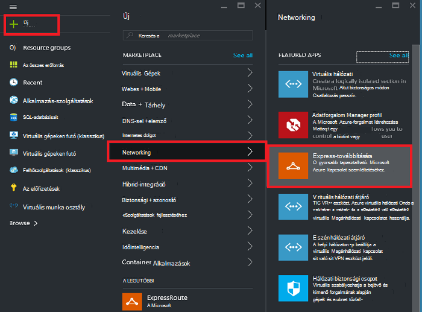
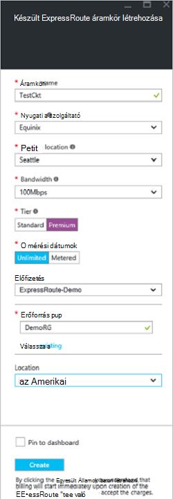
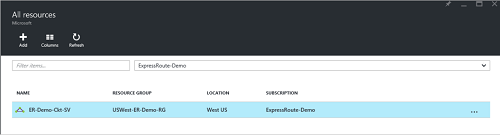
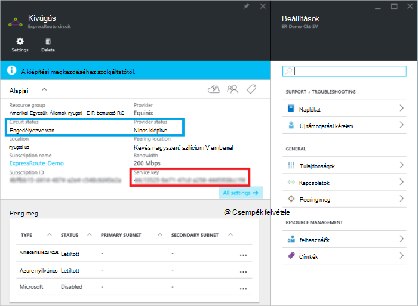
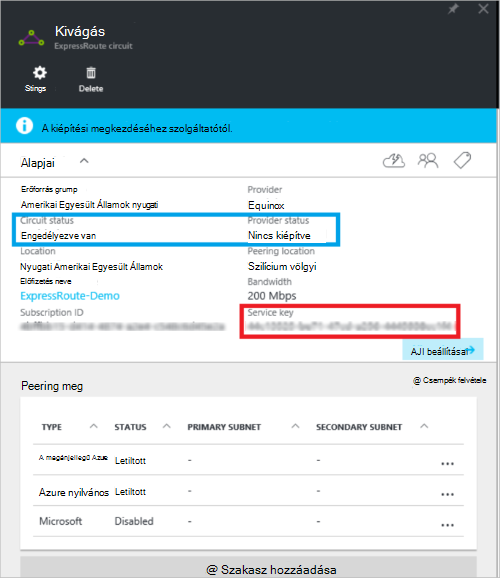
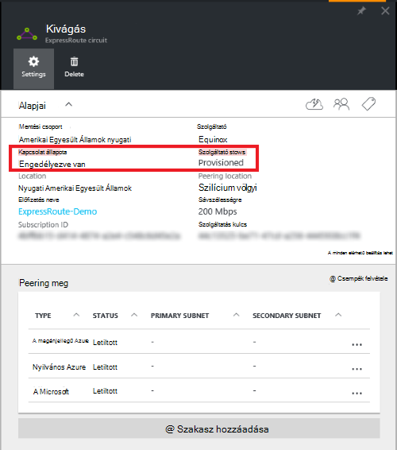

<properties
   pageTitle="Létrehozása és módosítása az készült ExpressRoute áramkör erőforrás-kezelő és az Azure portal segítségével |} Microsoft Azure"
   description="Ez a cikk ismerteti, hogyan hozhat létre, kiépítése, ellenőrizze, módosítása, törlése és az készült ExpressRoute áramkör deprovision."
   documentationCenter="na"
   services="expressroute"
   authors="cherylmc"
   manager="carmonm"
   editor=""
   tags="azure-resource-manager"/>
<tags
   ms.service="expressroute"
   ms.devlang="na"
   ms.topic="article"
   ms.tgt_pltfrm="na"
   ms.workload="infrastructure-services"
   ms.date="10/10/2016"
   ms.author="cherylmc"/>

# Létrehozása és módosítása az készült ExpressRoute áramkör

> [AZURE.SELECTOR]
[Azure portál - erőforrás-kezelő](expressroute-howto-circuit-portal-resource-manager.md)
[PowerShell - erőforrás-kezelő](expressroute-howto-circuit-arm.md)
[PowerShell - klasszikus](expressroute-howto-circuit-classic.md)

Ez a cikk ismerteti a készült Azure ExpressRoute áramkör létrehozása az Azure-portálra, és az erőforrás-kezelő Azure telepítési modell használatával. Az alábbi lépésekkel is követnie a kapcsolat állapotának ellenőrzése, telepítse azt, vagy törölheti vagy deprovision azt.

**Azure környezetben modellek**

[AZURE.INCLUDE [vpn-gateway-clasic-rm](../../includes/vpn-gateway-classic-rm-include.md)] 

## Első lépések

- Tekintse át a [előfeltételei](expressroute-prerequisites.md) és [munkafolyamatok](expressroute-workflows.md) konfigurációs megkezdése előtt.
- Győződjön meg arról, hogy az [Azure portál](https://portal.azure.com)hozzáférése van.
- Győződjön meg arról, hogy van-e jogosultsága hozzon létre új hálózati erőforrásokat. Ha nem rendelkezik a megfelelő engedélyekkel, lépjen kapcsolatba a fiók rendszergazda.

## Hozzon létre, és egy készült ExpressRoute áramkör kiépítése

### 1. Jelentkezzen be az Azure-portálra

A böngészőben nyissa meg az [Azure portál](http://portal.azure.com) , és jelentkezzen be az Azure-fiók.

### 2. Hozzon létre egy új készült ExpressRoute áramkör

>[AZURE.IMPORTANT] A készült ExpressRoute áramkör fog egy szolgáltatás kulcs kibocsátott pillanatától számlát kapni. Győződjön meg arról, hogy ha a kapcsolat szolgáltatója a áramkör kiépítése készen áll a művelet végrehajtása.

1. Létrehozhat egy készült ExpressRoute áramkör hozzon létre egy új erőforrást lehetőség kiválasztásával. Kattintson az **Új** > **Networking** > **készült ExpressRoute**, az alábbi képen látható módon:

    

2. **Készült ExpressRoute**gombra kattintás után megjelenik a **létrehozása készült ExpressRoute áramköri** lap. Kitöltésekor, hogy a szükséges értékeket Ez a lap a, győződjön meg arról, hogy a helyes Termékváltozat réteg és az adatok mérési megadása.

    - **Réteg** határozza meg, hogy egy készült ExpressRoute normál vagy a készült ExpressRoute prémium bővítmény engedélyezve van. Megadhatja, hogy **szabványos** a szokásos Termékváltozat vagy **prémium** beszerzése a prémium bővítményt.

    - A számlázási típusú **adatok mérési** határozza meg. A forgalmi díjas mobilinternet-előfizetéssel és **korlátlan** **forgalmi díjas** egy adatforgalmi számára is megadhat. Figyelje meg, hogy módosíthatja a számlázási típusát a **forgalmi díjas** **korlátlan**azonban nem állíthatja a írja be a **korlátlan** **forgalmi díjas**.

    

>[AZURE.IMPORTANT] Ne feledje, hogy, hogy Peering helyét a [tényleges helyét](expressroute-locations.md) jelöli, hol vannak a Microsofttal peering. Ez **nem** kapcsolódik "Hely" tulajdonság, amely a földrajzi hely, ahol az Azure hálózati erőforrás szolgáltató található vonatkozik. Nem kapcsolódnak, azt is javasolt egy hálózati erőforrás szolgáltató földrajzilag közelébe az áramkör Peering helyének kiválasztása. 

### 3. a áramkörök és a Tulajdonságok megtekintése

**Az összes áramkörök megtekintése**

Az Ön által létrehozott **összes erőforrás** kiválasztásával, kattintson a bal oldali menü áramkörök tekintheti meg.
    

**A Tulajdonságok megtekintése**

    You can view the properties of the circuit by selecting it. On this blade, note the service key for the circuit. You must copy the circuit key for your circuit and pass it down to the service provider to complete the provisioning process. The circuit key is specific to your circuit.

### 4. küldése a szolgáltatás billentyűt a kapcsolat szolgáltatója a kiépítéséhez

Ez a lap, a **szolgáltató állapot** információk-szolgáltató oldalán kiépítési aktuális állapotáról. **Áramkör állapot** Ez a témakör a Microsoft egymás állapotát. További információt a kiépítési államok áramkör a [munkafolyamatok](expressroute-workflows.md#expressroute-circuit-provisioning-states) témakört is.

Amikor létrehoz egy új készült ExpressRoute áramkör, a kapcsolat a következő állapotban lesz:

Szolgáltatók állapota: nincs kiépítve 
Állapot áramkör: engedélyezve

A kapcsolat változni fog a következő állapotát a kapcsolat szolgáltatója webhelyet, amely lehetővé teszi Önnek:

Szolgáltatók állapota: kiépítése 
Állapot áramkör: engedélyezve

Szeretné használni az készült ExpressRoute áramkör a következő állapotban kell lennie:

Szolgáltatók állapota: kiépítése 
Állapot áramkör: engedélyezve

### 5. rendszeres időközönként ellenőrizze, hogy az állapot és a áramkör kulcs állapota

A áramkör, amely éppen szeretne kijelöléssel tulajdonságainak megtekintése Jelölje be a **szolgáltató állapotát** , és győződjön meg arról, hogy kerül **Provisioned** a folytatás előtt.

### 6. a útválasztási konfiguráció létrehozása

Részletes útmutató hozhat létre és módosíthat áramkör peerings [készült ExpressRoute áramkör útválasztási konfigurációs](expressroute-howto-routing-portal-resource-manager.md) cikke nyújt útmutatást.

>[AZURE.IMPORTANT] Ezeket az utasításokat tartalmazó réteget 2 kapcsolatszolgáltatások szolgáltatókkal létrehozott áramkörök csak vonatkoznak. Egy szolgáltatót, amely felajánlja a felügyelt használata layer 3 szolgáltatások (általában egy IP VPN, például MPLS), a kapcsolat szolgáltatója fog konfigurálása és kezelése a továbbítás meg.

### 7. hivatkozás egy készült ExpressRoute áramkör virtuális hálózaton

Ezután a virtuális hálózati a készült ExpressRoute áramkört ábrázoló mutató hivatkozás A [virtuális hálózatok Linking készült ExpressRoute áramkörök](expressroute-howto-linkvnet-arm.md) cikk dolgozik, az erőforrás-kezelő telepítési modell használata

## Bevezetés az készült ExpressRoute áramkör állapotát

A kapcsolat állapotának is meg szeretne, jelölje ki. 

## Az készült ExpressRoute áramkör módosítása

Az készült ExpressRoute áramkör bizonyos tulajdonságai módosíthatók érintő kapcsolat nélkül. Jelenleg nem lehet módosítani a készült ExpressRoute kapcsolatok tulajdonságai az Azure portálon. Azonban áramkör tulajdonságainak módosítása PowerShell is használhatja. További információt [az készült ExpressRoute áramkör PowerShell használatával módosítása](expressroute-howto-circuit-arm.md#modify)című.

Nincs legrövidebb leállás az alábbi műveleteket végezheti el:

- Engedélyezheti vagy letilthatja a készült ExpressRoute áramkör prémium készült ExpressRoute bővítményt.

- A sávszélesség a készült ExpressRoute áramkör növelése Figyelje meg, hogy a Visszalépés a kapcsolat a sávszélesség-ról nem támogatott. 

- A mérési terv forgalmi adatokból adatforgalmi módosítsa. Figyelje meg, hogy a mérési terv az adatforgalmi forgalmi adatokat nem lehet módosítani.

-  Engedélyezze, és tiltsa le a **Klasszikus működés engedélyezése**.

Korlátozások és érvényes korlátozások a további tudnivalókért tekintse át a [Készült ExpressRoute – gyakori kérdések](expressroute-faqs.md).

## Megszüntetés, és egy készült ExpressRoute áramkör törlése

A **Törlés** ikonra kattintva törölheti a készült ExpressRoute áramkör. Vegye figyelembe az alábbiakat:

- A készült ExpressRoute áramköri az összes virtuális hálózatok szétválasztása Ha nem sikerül a művelet, ellenőrizze, hogy bármilyen virtuális hálózatok a áramkör vannak csatolva.

- Ha a készült ExpressRoute áramkör service provider kiépítési állapot **létesítése** vagy **Provisioned** a szolgáltatót a kapcsolat az oldalon deprovision kell dolgozni. Erőforrások lefoglalása és bill, amíg a szolgáltató befejeződik, a áramkör megszüntetés, és értesítést küld a kapcsolatfelvételi folytatjuk.

- Ha a szolgáltató van leépítve az (a szolgáltatás szolgáltató kiépítési állapotának értéke **nincs kiépítve**) áramkör törölje a áramkör. Ezzel leállítja a áramkör számlázását

## Következő lépések

Miután létrehozta a áramkör, ügyeljen, tegye a következőket:

- [Létrehozása és módosítása a készült ExpressRoute áramkör továbbítása](expressroute-howto-routing-portal-resource-manager.md)
- [A virtuális hálózat csatolása a készült ExpressRoute áramkör](expressroute-howto-linkvnet-arm.md)
