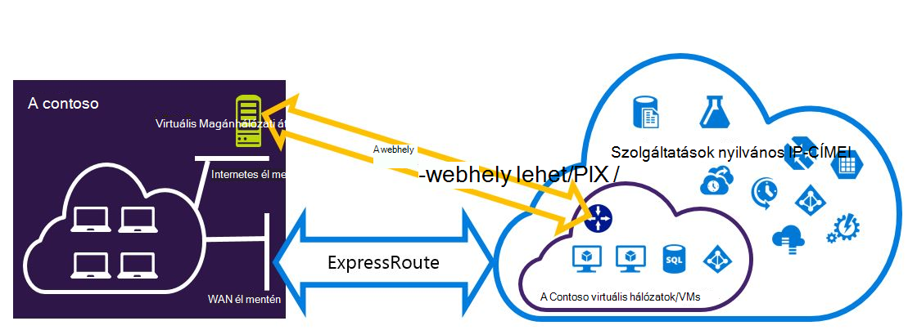
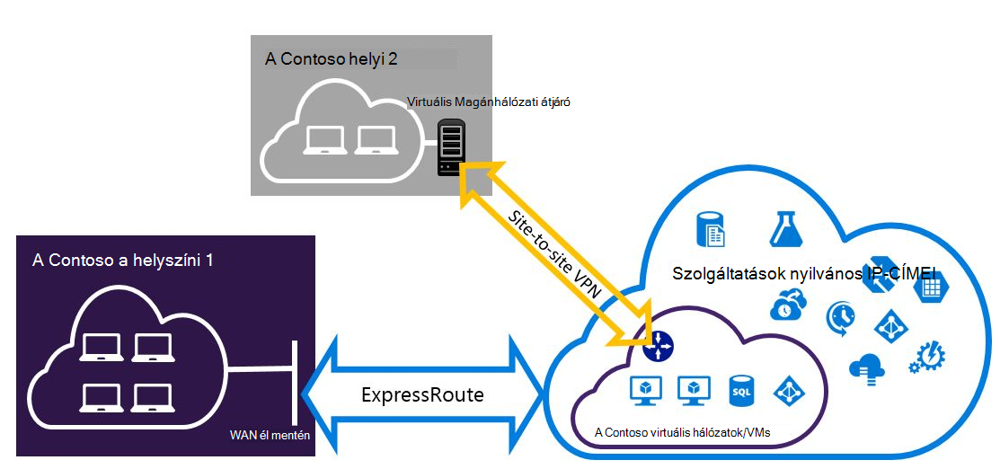

<properties
   pageTitle="Is megtalálhatók készült Expressroute és webhely virtuális Magánhálózati kapcsolat beállítása |} Microsoft Azure"
   description="Ez a cikk végigvezeti konfigurálás készült ExpressRoute és webhely virtuális Magánhálózati kapcsolat, amely a klasszikus telepítési modell is megtalálhatók."
   documentationCenter="na"
   services="expressroute"
   authors="charwen"
   manager="carmonm"
   editor=""
   tags="azure-service-management"/>
<tags
   ms.service="expressroute"
   ms.devlang="na"
   ms.topic="get-started-article"
   ms.tgt_pltfrm="na"
   ms.workload="infrastructure-services"
   ms.date="10/10/2016"
   ms.author="charwen"/>

# A klasszikus telepítési modell készült ExpressRoute és webhely coexisting kapcsolatainak konfigurálása

> [AZURE.SELECTOR]
- [A PowerShell - erőforrás-kezelő](expressroute-howto-coexist-resource-manager.md)
- [A PowerShell - klasszikus](expressroute-howto-coexist-classic.md)

Az azt jelenti, hogy a webhely VPN és készült ExpressRoute konfigurálása problémákat számos előnye van. Biztonságos feladatátvevő elérési beállítása webhely VPN ExressRoute, vagy csatlakozhat webhely VPN adatai készült ExpressRoute keresztül nem kapcsolódó webhelyek. A lépéseket követve mindkét esetek konfigurálása a jelen cikkben témákat vesszük sorra. Ez a cikk a klasszikus telepítési modell vonatkozik. Ez a beállítás nem érhető el a portálon.

**Azure környezetben modellek**

[AZURE.INCLUDE [vpn-gateway-clasic-rm](../../includes/vpn-gateway-classic-rm-include.md)] 

>[AZURE.IMPORTANT] Készült ExpressRoute áramkörök előre előtt kell konfigurálni az alábbi lépéseket. Győződjön meg arról, hogy elvégezte a segédvonalak [készült ExpressRoute áramkör létrehozása](expressroute-howto-circuit-classic.md) és [konfigurálása a továbbítás](expressroute-howto-routing-classic.md) a előtt hajtsa végre az alábbi lépéseket.

## Korlátozások és korlátai

- **Nem támogatott a hálózaton átvitt útválasztás.** A helyi hálózaton keresztül, a webhely VPN kapcsolódó és a helyi hálózaton keresztül készült ExpressRoute kapcsolódó közötti útvonal nem (keresztül Azure).
- **Pont-webhely nem támogatott.** Webhely-pont VPN-kapcsolatokat az azonos VNet készült ExpressRoute csatlakoztatott nem engedélyezi. Webhely-pont VPN és készült ExpressRoute nem használható az azonos VNet.
- **Kényszerített tunneling webhely VPN átjáró nem engedélyezett.** Csak "kényszerítheti" összes internetes kötött forgalmat a helyszíni hálózaton keresztül készült ExpressRoute visszatér.
- **Egyszerű Termékváltozat átjáró nem támogatott.** Az átjáró nem egyszerű Termékváltozat az [készült ExpressRoute átjáró](expressroute-about-virtual-network-gateways.md) és az [átjáró VPN](../vpn-gateway/vpn-gateway-about-vpngateways.md)kell használnia.
- **Virtuális Magánhálózati átjáró csak útvonal-alapú használata támogatott.** [Virtuális Magánhálózati átjáró](../vpn-gateway/vpn-gateway-about-vpngateways.md)útvonal-alapú kell használnia.
- **A virtuális Magánhálózati átjáró statikus útvonal kell beállítania.** Ha a helyi hálózaton készült ExpressRoute és a webhely virtuális Magánhálózattal kapcsolódik, és a webhely virtuális Magánhálózati kapcsolat irányítja a nyilvános internetkapcsolat a helyi hálózaton konfigurált statikus útvonal kell rendelkeznie.
- **Először készült ExpressRoute átjáró kell beállítania.** A webhely VPN-átjáró felvétele előtt először kell létrehoznia a készült ExpressRoute átjáró.

## Konfigurációs látványtervek

### A webhely VPN feladatátvevő elérési beállítása készült ExpressRoute

A webhely virtuális Magánhálózati kapcsolat másolatként készült ExpressRoute konfigurálható. Ez csak magánjellegű Azure peering elérési csatolni virtuális hálózatok vonatkozik. Nincs feladatátvevő VPN-alapú megoldást szolgáltatások nem Azure nyilvános és a Microsoft peerings keresztül érhető el. A készült ExpressRoute áramkör értéke mindig az elsődleges hivatkozásra. Fog adatfolyam a webhely VPN elérési útján csak akkor, ha a készült ExpressRoute áramkör sikertelen lesz. 

### Webhely virtuális Magánhálózattal kapcsolódik készült ExpressRoute keresztül nem csatlakozik webhelyek csatlakoztatása konfigurálása

Beállíthatja, hogy hol bizonyos webhelyek Csatlakozás közvetlenül Azure webhely VPN fölé, és bizonyos webhelyek készült ExpressRoute protokollal csatlakozzon a hálózathoz. 

>[AZURE.NOTE] Egy virtuális hálózat beállítása a hálózaton átvitt útválasztó, nem lehet.

## Jelölje ki a szükséges lépéseket

Nincsenek két különböző csoportjaihoz eljárások közül választhat, annak érdekében, hogy állítsa be a kapcsolatok alapértelmezés szerint is megtalálhatók. A konfigurációs eljárás választhat, hogy van-e egy meglévő virtuális hálózat, amelyhez csatlakozni szeretne, vagy hozzon létre egy új virtuális hálózat szeretne függ.

- Nem rendelkezik egy VNet és kell létrehoznia.
    
    Ha még nem rendelkezik egy virtuális hálózaton, ezt az eljárást végigvezeti a klasszikus telepítési modell használ, és új készült ExpressRoute és webhely virtuális Magánhálózati kapcsolat létrehozása új virtuális hálózat létrehozása. Ha szeretné beállítani, kövesse a cikk szakaszában [hozhat létre egy új virtuális hálózati és coexisting kapcsolatok](#new).

- Már rendelkezik egy klasszikus telepítési modell VNet.

    Előfordulhat, hogy már egy virtuális hálózati helyről egy meglévő webhelyre történő virtuális Magánhálózati kapcsolatot vagy a készült ExpressRoute kapcsolat. A cikk szakaszt [egy már meglévő VNet coexsiting kapcsolatainak konfigurálása](#add) azt ismerteti, hogy az átjáró törlése, és kattintson az új készült ExpressRoute és webhely VPN kapcsolatok létrehozásának keresztül. Figyelje meg, hogy az új kapcsolatok létrehozásakor a lépéseket kell elvégezni nagyon meghatározott sorrendben. További cikkek a képernyőn megjelenő utasításokat a átjárók és a kapcsolatokkal létrehozása nem használható.

    Az eljárás létrehozása a kapcsolatok alapértelmezés szerint is megtalálhatók lesz szüksége, törölheti az átjárót, és állítsa be új átjárókat. Ez azt jelenti, hogy a határokon helyszíni kapcsolatok legrövidebb leállás közben törlése, és hozza létre újból a átjáró és a kapcsolatokkal, de nem szükséges új virtuális hálózat áttelepítése a VMs vagy a szolgáltatások bármelyikét lesz. A VMs és szolgáltatások továbbra is tudjanak közben az átjáró beállítása, ha ezt konfigurálhatók a terheléselosztó keresztül meg kommunikálni.

## Egy új virtuális hálózati és coexisting kapcsolatok létrehozása

Ez az eljárás ismerteti, hogy egy VNet létrehozását, és a webhely és fog futhatnak készült ExpressRoute kapcsolatokat hozhat létre.

1. Telepítse az Azure PowerShell-parancsmagok legújabb verzióját kell. Megtudhatja, [hogy miként telepítheti, állíthatja Azure PowerShell](../powershell-install-configure.md) PowerShell-parancsmagok telepítésével kapcsolatos további információt. Előfordulhat, hogy ebben a konfigurációban kell megadnia parancsmagokról némileg eltérő mi akkor lehet is ismert. Ne felejtse el az alábbi útmutatást megadott-parancsmagok használata. 

2. Hozzon létre egy virtuális hálózatához séma. A konfigurációs séma kapcsolatos további tudnivalókért olvassa el az [Azure virtuális hálózati konfigurációja séma](https://msdn.microsoft.com/library/azure/jj157100.aspx)című témakört.

    A séma létrehozásakor győződjön meg arról, hogy a következő értékeket használja:

    - Az átjáró alhálózat virtuális hálózatok /27 vagy rövidebb előtaggal (például /26 vagy /25) kell lennie.
    - Az átjáró kapcsolattípusokra "kitűzött célja".

              <VirtualNetworkSite name="MyAzureVNET" Location="Central US">
                <AddressSpace>
                  <AddressPrefix>10.17.159.192/26</AddressPrefix>
                </AddressSpace>
                <Subnets>
                  <Subnet name="Subnet-1">
                    <AddressPrefix>10.17.159.192/27</AddressPrefix>
                  </Subnet>
                  <Subnet name="GatewaySubnet">
                    <AddressPrefix>10.17.159.224/27</AddressPrefix>
                  </Subnet>
                </Subnets>
                <Gateway>
                  <ConnectionsToLocalNetwork>
                    <LocalNetworkSiteRef name="MyLocalNetwork">
                      <Connection type="Dedicated" />
                    </LocalNetworkSiteRef>
                  </ConnectionsToLocalNetwork>
                </Gateway>
              </VirtualNetworkSite>

3. Után létrehozása és konfigurálása az XML-sémafájl, töltse fel a fájlt. A virtuális hálózat ez hoz létre.

    A következő parancsmagot segítségével töltse fel a fájlt, az érték lecserélve a saját.

        Set-AzureVNetConfig -ConfigurationPath 'C:\NetworkConfig.xml'

4. Hozzon létre egy készült ExpressRoute átjáró. Ügyeljen arra, hogy adja meg a GatewaySKU *normál*, *HighPerformance*, vagy *UltraPerformance* és a következőképpen *DynamicRouting*GatewayType.

    Használja az alábbi példa a helyettesítése a saját értékeit.

        New-AzureVNetGateway -VNetName MyAzureVNET -GatewayType DynamicRouting -GatewaySKU HighPerformance

5. Hivatkozás az készült ExpressRoute átjáró a készült ExpressRoute áramkör. Ez a lépés befejezése után létrejött a kapcsolat a helyszíni hálózaton és Azure keresztül készült ExpressRoute, között.

        New-AzureDedicatedCircuitLink -ServiceKey <service-key> -VNetName MyAzureVNET

6. Ezután hozzon létre a webhely virtuális Magánhálózati átjárót. A GatewaySKU *szabványos* *HighPerformance*, vagy *UltraPerformance* és a GatewayType *DynamicRouting*kell lennie.

        New-AzureVirtualNetworkGateway -VNetName MyAzureVNET -GatewayName S2SVPN -GatewayType DynamicRouting -GatewaySKU  HighPerformance

    A virtuális hálózati átjáró beállítások, beleértve az átjáró azonosító és a nyilvános IP beolvasásához használja a `Get-AzureVirtualNetworkGateway` parancsmag.

        Get-AzureVirtualNetworkGateway

        GatewayId            : 348ae011-ffa9-4add-b530-7cb30010565e
        GatewayName          : S2SVPN
        LastEventData        :
        GatewayType          : DynamicRouting
        LastEventTimeStamp   : 5/29/2015 4:41:41 PM
        LastEventMessage     : Successfully created a gateway for the following virtual network: GNSDesMoines
        LastEventID          : 23002
        State                : Provisioned
        VIPAddress           : 104.43.x.y
        DefaultSite          :
        GatewaySKU           : HighPerformance
        Location             :
        VnetId               : 979aabcf-e47f-4136-ab9b-b4780c1e1bd5
        SubnetId             :
        EnableBgp            : False
        OperationDescription : Get-AzureVirtualNetworkGateway
        OperationId          : 42773656-85e1-a6b6-8705-35473f1e6f6a
        OperationStatus      : Succeeded

7. Hozzon létre egy helyi webhelyet VPN átjáró entitás. Ez a parancs nem konfigurálja a helyszíni VPN átjárót. Inkább azt lehetővé teszi a helyi átjáró beállításait, például a nyilvános IP- és a helyszíni cím szóközzel, hogy az Azure virtuális Magánhálózati átjáró csatlakozhat hozzá.

    >[AZURE.IMPORTANT] Az adott helyen a webhely VPN nincs megadva, az a netcfg. Ehelyett ezzel a parancsmaggal kell használnia az adott helyen paramétert. Nem definiálhatók portálon vagy a netcfg fájl használatával.

    A következő példa, az értékek lecserélése saját használja.

        New-AzureLocalNetworkGateway -GatewayName MyLocalNetwork -IpAddress <MyLocalGatewayIp> -AddressSpace <MyLocalNetworkAddress>

    > [AZURE.NOTE] Ha a helyi hálózaton van a több útvonalon, átviheti őket a mind tömbként.  $MyLocalNetworkAddress =@("10.1.2.0/24","10.1.3.0/24","10.2.1.0/24")  

    A virtuális hálózati átjáró beállítások, beleértve az átjáró azonosító és a nyilvános IP beolvasásához használja a `Get-AzureVirtualNetworkGateway` parancsmag. Az alábbi példában látható.

        Get-AzureLocalNetworkGateway

        GatewayId            : 532cb428-8c8c-4596-9a4f-7ae3a9fcd01b
        GatewayName          : MyLocalNetwork
        IpAddress            : 23.39.x.y
        AddressSpace         : {10.1.2.0/24}
        OperationDescription : Get-AzureLocalNetworkGateway
        OperationId          : ddc4bfae-502c-adc7-bd7d-1efbc00b3fe5
        OperationStatus      : Succeeded

8. Állítsa be az új átjáró csatlakozni a helyi VPN eszköz. Használja az információkat, amely a virtuális Magánhálózati eszköz megadásakor az a 6 beolvasott. VPN eszköz konfigurációval kapcsolatos további tudnivalókért olvassa el a [Virtuális Magánhálózati eszközök konfigurálása](../vpn-gateway/vpn-gateway-about-vpn-devices.md)című témakört.

9. Hivatkozás az Azure-webhely VPN átjáró a helyi átjáró.

    Ebben a példában connectedEntityId a helyi átjáró-azonosító futtatásával talál `Get-AzureLocalNetworkGateway`. VirtualNetworkGatewayId megkeresése segítségével a `Get-AzureVirtualNetworkGateway` parancsmag. Ezt a lépést követően a webhely VPN-kapcsolaton keresztül a helyi hálózat és Azure közötti kapcsolat folyamatban van.

        New-AzureVirtualNetworkGatewayConnection -connectedEntityId <local-network-gateway-id> -gatewayConnectionName Azure2Local -gatewayConnectionType IPsec -sharedKey abc123 -virtualNetworkGatewayId <azure-s2s-vpn-gateway-id>

## Egy már meglévő VNet coexsiting kapcsolatainak konfigurálása

Ha egy meglévő virtuális hálózat, ellenőrizze az átjáró alhálózat méretét. Ha az átjáró alhálózat /28 vagy /29, el kell először a virtuális hálózati átjáró törlése és az átjáró alhálózat méretének növelése. Ebben a szakaszban szereplő lépéseket kell követnie megtennie.

Ha az átjáró alhálózat /27 vagy nagyobb és a virtuális hálózat készült ExpressRoute keresztül csatlakozik, az alábbi lépésekkel átugrása, és folytassa a ["6 lépés - webhelyre való VPN átjáró létrehozása"](#vpngw) az előző szakaszban.

>[AZURE.NOTE] A meglévő átjáró törlésekor a helyi helyileg elvesznek a kapcsolatot a virtuális hálózathoz ebben a konfigurációban a munka közben.

1. Telepítse az Azure erőforrás-kezelő PowerShell-parancsmagok legújabb verzióját kell. Megtudhatja, [hogy miként telepítheti, állíthatja Azure PowerShell](../powershell-install-configure.md) PowerShell-parancsmagok telepítésével kapcsolatos további információt. Előfordulhat, hogy ebben a konfigurációban kell megadnia parancsmagokról némileg eltérő mi akkor lehet is ismert. Ne felejtse el az alábbi útmutatást megadott-parancsmagok használata. 

2. A meglévő készült ExpressRoute vagy a webhely VPN átjáró törlése. A következő parancsmagot, az értékek lecserélése saját használja.

        Remove-AzureVNetGateway –VnetName MyAzureVNET

3. A virtuális hálózati séma exportálása. Az alábbi PowerShell-parancsmag, az értékek lecserélése saját használata.

        Get-AzureVNetConfig –ExportToFile “C:\NetworkConfig.xml”

4. A hálózati konfigurációs fájl séma szerkesztése, úgy, hogy az átjáró alhálózat /27 vagy rövidebb előtaggal (például /26 vagy /25). Az alábbi példában látható. 
>[AZURE.NOTE] Ha nincs elég IP-címek átjáró alhálózat méretének növelése a virtuális hálózaton balra, kell hozzáadnia több IP-cím helyet. A konfigurációs séma kapcsolatos további tudnivalókért olvassa el az [Azure virtuális hálózati konfigurációja séma](https://msdn.microsoft.com/library/azure/jj157100.aspx)című témakört.

          <Subnet name="GatewaySubnet">
            <AddressPrefix>10.17.159.224/27</AddressPrefix>
          </Subnet>

5. Ha az előző átjáró volt egy webhely VPN, is módosítania kell a kapcsolat típusának **Dedicated**.

                 <Gateway>
                  <ConnectionsToLocalNetwork>
                    <LocalNetworkSiteRef name="MyLocalNetwork">
                      <Connection type="Dedicated" />
                    </LocalNetworkSiteRef>
                  </ConnectionsToLocalNetwork>
                </Gateway>

6. Ezen a ponton a nincs átjárók egy VNet lesz. Hozzon létre új átjárókat, és fejezze be a kapcsolatokat, kitöltése [lépés: 4 – egy készült ExpressRoute átjáró létrehozása](#gw), a megelőző lépéscsoportra található.

## Következő lépések

Készült ExpressRoute kapcsolatos további tudnivalókért olvassa el az [Készült ExpressRoute – gyakori kérdések](expressroute-faqs.md)
