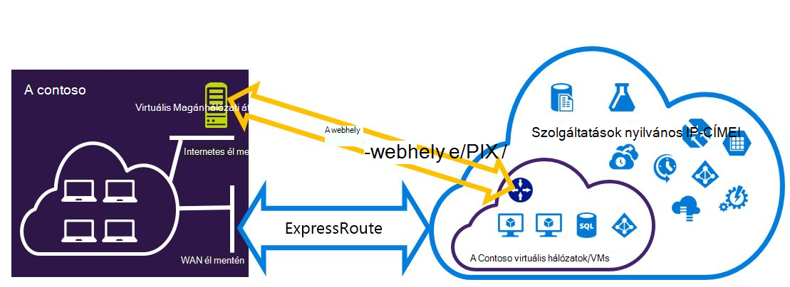

<properties
   pageTitle="Az erőforrás-kezelő telepítési modell is megtalálhatók készült Expressroute és webhely VPN kapcsolatok beállítása |} Microsoft Azure"
   description="Ez a cikk végigvezeti konfigurálása készült ExpressRoute és webhely virtuális Magánhálózati kapcsolat, hogy az erőforrás-kezelő modell is megtalálhatók."
   documentationCenter="na"
   services="expressroute"
   authors="charwen"
   manager="carmonm"
   editor=""
   tags="azure-resource-manager"/>
<tags
   ms.service="expressroute"
   ms.devlang="na"
   ms.topic="get-started-article"
   ms.tgt_pltfrm="na"
   ms.workload="infrastructure-services"
   ms.date="10/10/2016"
   ms.author="charleywen"/>

# Az erőforrás-kezelő telepítési modell készült ExpressRoute és webhely coexisting kapcsolatainak konfigurálása

> [AZURE.SELECTOR]
- [A PowerShell - erőforrás-kezelő](expressroute-howto-coexist-resource-manager.md)
- [A PowerShell - klasszikus](expressroute-howto-coexist-classic.md)

Az azt jelenti, hogy a webhely VPN és készült ExpressRoute konfigurálása problémákat számos előnye van. Biztonságos feladatátvevő elérési beállítása webhely VPN ExressRoute, vagy csatlakozhat webhely VPN adatai készült ExpressRoute keresztül nem kapcsolódó webhelyek. A lépéseket követve mindkét esetek konfigurálása a jelen cikkben témákat vesszük sorra. Ez a cikk az erőforrás-kezelő telepítési modell vonatkozik. Ez a beállítás nem érhető el az Azure-portálon.

**Azure környezetben modellek**

[AZURE.INCLUDE [vpn-gateway-clasic-rm](../../includes/vpn-gateway-classic-rm-include.md)] 

>[AZURE.IMPORTANT] Készült ExpressRoute áramkörök előre előtt kell konfigurálni az alábbi lépéseket. Győződjön meg arról, hogy elvégezte a segédvonalak [készült ExpressRoute áramkör létrehozása](expressroute-howto-circuit-arm.md) és [konfigurálása a továbbítás](expressroute-howto-routing-arm.md) a előtt hajtsa végre az alábbi lépéseket.

## Korlátozások és korlátai

- **Nem támogatott a hálózaton átvitt útválasztás.** A helyi hálózaton keresztül, a webhely VPN kapcsolódó és a helyi hálózaton keresztül készült ExpressRoute kapcsolódó közötti útvonal nem (keresztül Azure).
- **Egyszerű Termékváltozat átjáró nem támogatott.** Az átjáró nem egyszerű Termékváltozat az [készült ExpressRoute átjáró](expressroute-about-virtual-network-gateways.md) és az [átjáró VPN](../vpn-gateway/vpn-gateway-about-vpngateways.md)kell használnia.
- **Virtuális Magánhálózati átjáró csak útvonal-alapú használata támogatott.** [Virtuális Magánhálózati átjáró](../vpn-gateway/vpn-gateway-about-vpngateways.md)útvonal-alapú kell használnia.
- **A virtuális Magánhálózati átjáró statikus útvonal kell beállítania.** Ha a helyi hálózaton készült ExpressRoute és a webhely virtuális Magánhálózattal kapcsolódik, és a webhely virtuális Magánhálózati kapcsolat irányítja a nyilvános internetkapcsolat a helyi hálózaton konfigurált statikus útvonal kell rendelkeznie.
- **Először készült ExpressRoute átjáró kell beállítania.** A webhely VPN-átjáró felvétele előtt először kell létrehoznia a készült ExpressRoute átjáró.

## Konfigurációs látványtervek

### A webhely VPN feladatátvevő elérési beállítása készült ExpressRoute

A webhely virtuális Magánhálózati kapcsolat másolatként készült ExpressRoute konfigurálható. Ez csak magánjellegű Azure peering elérési csatolni virtuális hálózatok vonatkozik. Nincs feladatátvevő VPN-alapú megoldást szolgáltatások nem Azure nyilvános és a Microsoft peerings keresztül érhető el. A készült ExpressRoute áramkör értéke mindig az elsődleges hivatkozásra. Fog adatfolyam a webhely VPN elérési útján csak akkor, ha a készült ExpressRoute áramkör sikertelen lesz.
>[AZURE.NOTE] Noha készült ExpressRoute áramkör preferált webhely VPN fölé Ha mindkét útvonalak ugyanaz, Azure fogja használni az longuest előtag egyező válassza az útvonal a csomag cél felé.

### Webhely virtuális Magánhálózattal kapcsolódik készült ExpressRoute keresztül nem csatlakozik webhelyek csatlakoztatása konfigurálása

Beállíthatja, hogy hol bizonyos webhelyek Csatlakozás közvetlenül Azure webhely VPN fölé, és bizonyos webhelyek készült ExpressRoute protokollal csatlakozzon a hálózathoz. 

>[AZURE.NOTE] Egy virtuális hálózat beállítása a hálózaton átvitt útválasztó, nem lehet.

## Jelölje ki a szükséges lépéseket

Nincsenek két különböző csoportjaihoz eljárások közül választhat, annak érdekében, hogy állítsa be a kapcsolatok alapértelmezés szerint is megtalálhatók. A konfigurációs eljárás választhat, hogy van-e egy meglévő virtuális hálózat, amelyhez csatlakozni szeretne, vagy hozzon létre egy új virtuális hálózat szeretne függ.

- Nem rendelkezik egy VNet és kell létrehoznia.
    
    Ha még nem rendelkezik egy virtuális hálózaton, ez az eljárás végigvezeti új virtuális hálózati erőforrás-kezelő telepítési modell használata és létrehozása új készült ExpressRoute és webhely virtuális Magánhálózati kapcsolat létrehozása. Ha szeretné beállítani, kövesse a cikk szakaszában [hozhat létre egy új virtuális hálózati és coexisting kapcsolatok](#new).

- Már rendelkezik egy erőforrás-kezelő telepítési modell VNet.

    Előfordulhat, hogy már egy virtuális hálózati helyről egy meglévő webhelyre történő virtuális Magánhálózati kapcsolatot vagy a készült ExpressRoute kapcsolat. Az [egy már meglévő VNet coexsiting kapcsolatainak konfigurálása](#add) szakaszban azt ismerteti, hogy az átjáró törlése, és kattintson az új készült ExpressRoute és webhely VPN kapcsolatok létrehozásának keresztül. Figyelje meg, hogy az új kapcsolatok létrehozásakor a lépéseket kell elvégezni nagyon meghatározott sorrendben. További cikkek a képernyőn megjelenő utasításokat a átjárók és a kapcsolatokkal létrehozása nem használható.

    Az eljárás létrehozása a kapcsolatok alapértelmezés szerint is megtalálhatók lesz szüksége, törölheti az átjárót, és állítsa be új átjárókat. Ez azt jelenti, hogy a határokon helyszíni kapcsolatok legrövidebb leállás közben törlése, és hozza létre újból a átjáró és a kapcsolatokkal, de nem szükséges új virtuális hálózat áttelepítése a VMs vagy a szolgáltatások bármelyikét lesz. A VMs és szolgáltatások továbbra is tudjanak közben az átjáró beállítása, ha ezt konfigurálhatók a terheléselosztó keresztül meg kommunikálni.

## Egy új virtuális hálózati és coexisting kapcsolatok létrehozása

Ez az eljárás ismerteti, hogy egy VNet létrehozását, és a webhely és fog futhatnak készült ExpressRoute kapcsolatokat hozhat létre.
    
1. Telepítse az Azure PowerShell-parancsmagok legújabb verzióját kell. Megtudhatja, [hogy miként telepítheti, állíthatja Azure PowerShell](../powershell-install-configure.md) PowerShell-parancsmagok telepítésével kapcsolatos további információt. Előfordulhat, hogy ebben a konfigurációban kell megadnia parancsmagokról némileg eltérő mi akkor lehet is ismert. Ne felejtse el az alábbi útmutatást megadott-parancsmagok használata.

2. Jelentkezzen be a fiókjához, és állítsa be a környezetet.
    
        login-AzureRmAccount
        Select-AzureRmSubscription -SubscriptionName 'yoursubscription'
        $location = "Central US"
        $resgrp = New-AzureRmResourceGroup -Name "ErVpnCoex" -Location $location

3. Hozzon létre egy virtuális hálózatot, többek között az átjáró alhálózat. A virtuális hálózati konfigurálásról kapcsolatos további tudnivalókért olvassa el a [Azure virtuális hálózat konfigurálása](../virtual-network/virtual-networks-create-vnet-arm-ps.md)című témakört.

    >[AZURE.IMPORTANT] Az átjáró alhálózat /27 vagy rövidebb előtaggal (például /26 vagy /25) kell lennie.
    
    Hozzon létre egy új VNet.

        $vnet = New-AzureRmVirtualNetwork -Name "CoexVnet" -ResourceGroupName $resgrp.ResourceGroupName -Location $location -AddressPrefix "10.200.0.0/16" 

    Adja hozzá az alhálózathoz.

        Add-AzureRmVirtualNetworkSubnetConfig -Name "App" -VirtualNetwork $vnet -AddressPrefix "10.200.1.0/24"
        Add-AzureRmVirtualNetworkSubnetConfig -Name "GatewaySubnet" -VirtualNetwork $vnet -AddressPrefix "10.200.255.0/24"

    Mentse a VNet konfiguráció.

        $vnet = Set-AzureRmVirtualNetwork -VirtualNetwork $vnet

4. Hozzon létre egy készült ExpressRoute átjáró. A készült ExpressRoute átjáró konfigurációval kapcsolatos további tudnivalókért olvassa el a [készült ExpressRoute átjáró beállítása](expressroute-howto-add-gateway-resource-manager.md)című témakört. A GatewaySKU *Standard*, *HighPerformance*vagy *UltraPerformance*kell lennie.

        $gwSubnet = Get-AzureRmVirtualNetworkSubnetConfig -Name "GatewaySubnet" -VirtualNetwork $vnet
        $gwIP = New-AzureRmPublicIpAddress -Name "ERGatewayIP" -ResourceGroupName $resgrp.ResourceGroupName -Location $location -AllocationMethod Dynamic
        $gwConfig = New-AzureRmVirtualNetworkGatewayIpConfig -Name "ERGatewayIpConfig" -SubnetId $gwSubnet.Id -PublicIpAddressId $gwIP.Id
        $gw = New-AzureRmVirtualNetworkGateway -Name "ERGateway" -ResourceGroupName $resgrp.ResourceGroupName -Location $location -IpConfigurations $gwConfig -GatewayType "ExpressRoute" -GatewaySku Standard 

5. Hivatkozás az készült ExpressRoute átjáró a készült ExpressRoute áramkör. Ez a lépés befejezése után létrejött a kapcsolat a helyszíni hálózaton és Azure keresztül készült ExpressRoute, között. A hivatkozás működésével kapcsolatos további tudnivalókért lásd: a [Hivatkozás VNets készült ExpressRoute szeretne](expressroute-howto-linkvnet-arm.md).

        $ckt = Get-AzureRmExpressRouteCircuit -Name "YourCircuit" -ResourceGroupName "YourCircuitResourceGroup"
        New-AzureRmVirtualNetworkGatewayConnection -Name "ERConnection" -ResourceGroupName $resgrp.ResourceGroupName -Location $location -VirtualNetworkGateway1 $gw -PeerId $ckt.Id -ConnectionType ExpressRoute

6. Ezután hozzon létre a webhely virtuális Magánhálózati átjárót. A virtuális Magánhálózati átjáró konfigurációval kapcsolatos további tudnivalókért lásd: a [Configure egy VNet hely közötti kapcsolatot](../vpn-gateway/vpn-gateway-create-site-to-site-rm-powershell.md). A GatewaySKU *Standard*, *HighPerformance*vagy *UltraPerformance*kell lennie. A VpnType *RouteBased*kell.

        $gwSubnet = Get-AzureRmVirtualNetworkSubnetConfig -Name "GatewaySubnet" -VirtualNetwork $vnet
        $gwIP = New-AzureRmPublicIpAddress -Name "VPNGatewayIP" -ResourceGroupName $resgrp.ResourceGroupName -Location $location -AllocationMethod Dynamic
        $gwConfig = New-AzureRmVirtualNetworkGatewayIpConfig -Name "VPNGatewayIpConfig" -SubnetId $gwSubnet.Id -PublicIpAddressId $gwIP.Id
        New-AzureRmVirtualNetworkGateway -Name "VPNGateway" -ResourceGroupName $resgrp.ResourceGroupName -Location $location -IpConfigurations $gwConfig -GatewayType "Vpn" -VpnType "RouteBased" -GatewaySku "Standard"

    Azure virtuális Magánhálózati átjáró támogatja a BGP. A következő parancsot a - EnableBgp is megadhat.

        $azureVpn = New-AzureRmVirtualNetworkGateway -Name "VPNGateway" -ResourceGroupName $resgrp.ResourceGroupName -Location $location -IpConfigurations $gwConfig -GatewayType "Vpn" -VpnType "RouteBased" -GatewaySku "Standard" -EnableBgp $true

    Az IP- és az AS szám a virtuális Magánhálózati átjáró $azureVpn.BgpSettings.BgpPeeringAddress és $azureVpn.BgpSettings.Asn Azure használó peering BGP is megkeresheti. További tudnivalókért lásd: [Konfigurálása BGP](../vpn-gateway/vpn-gateway-bgp-resource-manager-ps.md) Azure virtuális Magánhálózati átjáró.

7. Hozzon létre egy helyi webhelyet VPN átjáró entitás. Ez a parancs nem konfigurálja a helyszíni VPN átjárót. Inkább azt lehetővé teszi a helyi átjáró beállításait, például a nyilvános IP- és a helyszíni cím szóközzel, hogy az Azure virtuális Magánhálózati átjáró csatlakozhat hozzá.

    Ha a helyi VPN eszköz csak támogatja a statikus útválasztás, beállíthatja a statikus útvonalak az alábbi módon.

        $MyLocalNetworkAddress = @("10.100.0.0/16","10.101.0.0/16","10.102.0.0/16")
        $localVpn = New-AzureRmLocalNetworkGateway -Name "LocalVPNGateway" -ResourceGroupName $resgrp.ResourceGroupName -Location $location -GatewayIpAddress *<Public IP>* -AddressPrefix $MyLocalNetworkAddress

    Ha a helyi VPN eszköz támogatja-e a BGP és dinamikus útválasztás engedélyezni szeretné, kell tudnia a BGP peering IP- és az AS szám, amely a virtuális Magánhálózati helyi eszközt használ.

        $localVPNPublicIP = "<Public IP>"
        $localBGPPeeringIP = "<Private IP for the BGP session>"
        $localBGPASN = "<ASN>"
        $localAddressPrefix = $localBGPPeeringIP + "/32"
        $localVpn = New-AzureRmLocalNetworkGateway -Name "LocalVPNGateway" -ResourceGroupName $resgrp.ResourceGroupName -Location $location -GatewayIpAddress $localVPNPublicIP -AddressPrefix $localAddressPrefix -BgpPeeringAddress $localBGPPeeringIP -Asn $localBGPASN

8. Állítsa be a helyi VPN eszközét, hogy az új Azure virtuális Magánhálózati átjárón. VPN eszköz konfigurációval kapcsolatos további tudnivalókért olvassa el a [Virtuális Magánhálózati eszközök konfigurálása](../vpn-gateway/vpn-gateway-about-vpn-devices.md)című témakört.

9. Hivatkozás az Azure-webhely VPN átjáró a helyi átjáró.

        $azureVpn = Get-AzureRmVirtualNetworkGateway -Name "VPNGateway" -ResourceGroupName $resgrp.ResourceGroupName
        New-AzureRmVirtualNetworkGatewayConnection -Name "VPNConnection" -ResourceGroupName $resgrp.ResourceGroupName -Location $location -VirtualNetworkGateway1 $azureVpn -LocalNetworkGateway2 $localVpn -ConnectionType IPsec -SharedKey <yourkey>

## Egy már meglévő VNet coexsiting kapcsolatainak konfigurálása

Ha egy meglévő virtuális hálózat, ellenőrizze az átjáró alhálózat méretét. Ha az átjáró alhálózat /28 vagy /29, el kell először a virtuális hálózati átjáró törlése és az átjáró alhálózat méretének növelése. Ebben a szakaszban szereplő lépéseket kell követnie megtennie.

Ha az átjáró alhálózat /27 vagy nagyobb és a virtuális hálózat készült ExpressRoute keresztül csatlakozik, az alábbi lépésekkel átugrása, és folytassa a ["6 lépés - webhelyre való VPN átjáró létrehozása"](#vpngw) az előző szakaszban. 

>[AZURE.NOTE] A meglévő átjáró törlésekor a helyi helyileg elvesznek a kapcsolatot a virtuális hálózathoz ebben a konfigurációban a munka közben. 

1. Telepítse az Azure PowerShell-parancsmagok legújabb verzióját kell. Megtudhatja, [hogy miként telepítheti, állíthatja Azure PowerShell](../powershell-install-configure.md) PowerShell-parancsmagok telepítésével kapcsolatos további információt. Előfordulhat, hogy ebben a konfigurációban kell megadnia parancsmagokról némileg eltérő mi akkor lehet is ismert. Ne felejtse el az alábbi útmutatást megadott-parancsmagok használata. 

2. A meglévő készült ExpressRoute vagy a webhely VPN átjáró törlése. 

        Remove-AzureRmVirtualNetworkGateway -Name <yourgatewayname> -ResourceGroupName <yourresourcegroup>

3. Átjáró alhálózat törlése.
        
        $vnet = Get-AzureRmVirtualNetwork -Name <yourvnetname> -ResourceGroupName <yourresourcegroup> 
        Remove-AzureRmVirtualNetworkSubnetConfig -Name GatewaySubnet -VirtualNetwork $vnet

4. Egy átjáró alhálózat, amely /27 hozzáadása vagy annál nagyobb.
    >[AZURE.NOTE] Ha nincs elég IP-címek átjáró alhálózat méretének növelése a virtuális hálózaton balra, kell hozzáadnia több IP-cím helyet.

        $vnet = Get-AzureRmVirtualNetwork -Name <yourvnetname> -ResourceGroupName <yourresourcegroup>
        Add-AzureRmVirtualNetworkSubnetConfig -Name "GatewaySubnet" -VirtualNetwork $vnet -AddressPrefix "10.200.255.0/24"

    Mentse a VNet konfiguráció.

        $vnet = Set-AzureRmVirtualNetwork -VirtualNetwork $vnet

5. Ezen a ponton a nincs átjárók egy VNet lesz. Hozzon létre új átjárókat, és fejezze be a kapcsolatokat, kitöltése [lépés: 4 – egy készült ExpressRoute átjáró létrehozása](#gw), a megelőző lépéscsoportra található.

## A virtuális Magánhálózati átjáró pont-webhely konfigurálása hozzáadása
Az alábbi lépéseket követve pont-webhely konfigurálása hozzáadása egy együttes jelenléte beállítása a virtuális Magánhálózati átjáró követheti.

1. Adja hozzá a VPN-ügyfél cím készlet. 

        $azureVpn = Get-AzureRmVirtualNetworkGateway -Name "VPNGateway" -ResourceGroupName $resgrp.ResourceGroupName
        Set-AzureRmVirtualNetworkGatewayVpnClientConfig -VirtualNetworkGateway $azureVpn -VpnClientAddressPool "10.251.251.0/24"

2. Töltse fel a virtuális Magánhálózati legfelső szintű tanúsítvány Azure a virtuális Magánhálózati átjáró. Ebben a példában feltételezzük, hogy a legfelső szintű tanúsítvány tárolja a helyi számítógépen, ahová az alábbi PowerShell-parancsmagok futnak. 

        $p2sCertFullName = "RootErVpnCoexP2S.cer"
        $p2sCertMatchName = "RootErVpnCoexP2S"
        $p2sCertToUpload=get-childitem Cert:\CurrentUser\My | Where-Object {$_.Subject -match $p2sCertMatchName}
        if ($p2sCertToUpload.count -eq 1){
            write-host "cert found"
        } else {
            write-host "cert not found"
            exit
        } 
        $p2sCertData = [System.Convert]::ToBase64String($p2sCertToUpload.RawData)
        Add-AzureRmVpnClientRootCertificate -VpnClientRootCertificateName $p2sCertFullName -VirtualNetworkGatewayname $azureVpn.Name -ResourceGroupName $resgrp.ResourceGroupName -PublicCertData $p2sCertData

További információt a webhely-pont VPN a [konfigurálása webhely-pont kapcsolat](../vpn-gateway/vpn-gateway-howto-point-to-site-rm-ps.md)című témakört.

## Következő lépések

Készült ExpressRoute kapcsolatos további tudnivalókért olvassa el az [Készült ExpressRoute – gyakori kérdések](expressroute-faqs.md).
