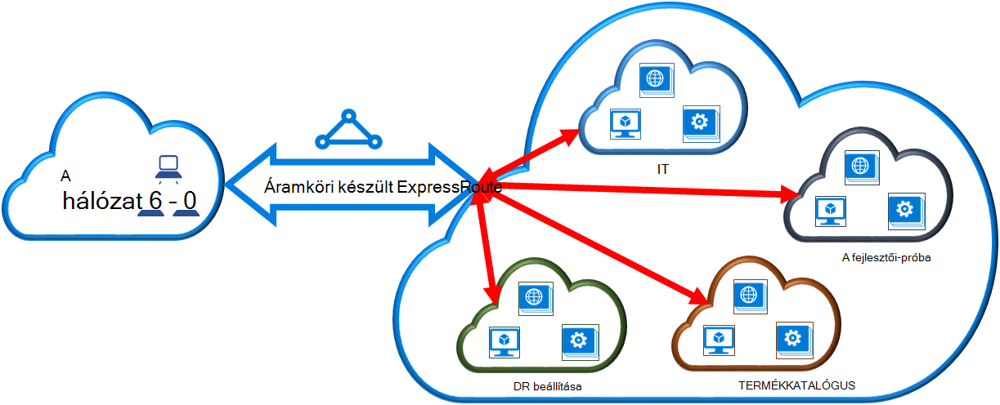

<properties 
   pageTitle="A virtuális hálózati csatolása az készült ExpressRoute áramkör PowerShell használatával |} Microsoft Azure"
   description="A dokumentum áttekintése csatolni virtuális hálózatok (VNets) módját készült ExpressRoute áramkörök szeretné az erőforrás-kezelő telepítési modell és a PowerShell használatával."
   services="expressroute"
   documentationCenter="na"
   authors="ganesr"
   manager="carmonm"
   editor=""
   tags="azure-resource-manager"/>
<tags 
   ms.service="expressroute"
   ms.devlang="na"
   ms.topic="article"
   ms.tgt_pltfrm="na"
   ms.workload="infrastructure-services"
   ms.date="10/10/2016"
   ms.author="ganesr" />

# Csatolni virtuális hálózat egy készült ExpressRoute áramkör

> [AZURE.SELECTOR]
- [Azure portál - erőforrás-kezelő](expressroute-howto-linkvnet-portal-resource-manager.md)
- [A PowerShell - erőforrás-kezelő](expressroute-howto-linkvnet-arm.md)
- [A PowerShell - klasszikus](expressroute-howto-linkvnet-classic.md)

Ez a cikk segít a virtuális hálózatok (VNets) csatolása a készült Azure ExpressRoute áramkörök az erőforrás-kezelő telepítési modell és a PowerShell használatával. Virtuális hálózatok a előfizetés ugyanazon vagy másik előfizetéshez tartozó lehet.

**Azure környezetben modellek**

[AZURE.INCLUDE [vpn-gateway-clasic-rm](../../includes/vpn-gateway-classic-rm-include.md)] 

## Konfigurációs vonatkozó követelmények

- Az Azure PowerShell-modul legújabb verziójának szükséges (legalább 1.0 verziójú). Megtudhatja, [hogy miként telepítheti, állíthatja Azure PowerShell](../powershell-install-configure.md) PowerShell-parancsmagok telepítésével kapcsolatos további információt.
- A [Előfeltételek](expressroute-prerequisites.md) [útválasztási követelmények](expressroute-routing.md)és [munkafolyamatok](expressroute-workflows.md) konfigurációs előtt tanulmányozza át van szükség.
- Az aktív készült ExpressRoute áramkör kell rendelkeznie. 
    - Az utasításokat követve [Hozzon létre egy készült ExpressRoute áramkör](expressroute-howto-circuit-arm.md) , és a kapcsolat a kapcsolat szolgáltatója engedélyezve van. 
    - Gondoskodhat arról, hogy Ön Azure magánjellegű peering be van állítva a áramkör. Ismertető [útválasztás konfigurálása](expressroute-howto-routing-arm.md) útválasztási utasításokat. 
    - Győződjön meg arról, hogy magánjellegű Azure peering konfigurációja és BGP peering között a hálózat és a Microsoft be, hogy a végpontok közötti kapcsolat engedélyezheti.
    - Győződjön meg arról, hogy van-e egy virtuális hálózati és a virtuális hálózati átjáró létrehozott és teljesen kiépítéstől. Az utasításokat követve hozzon létre egy [virtuális Magánhálózati átjáró](../articles/vpn-gateway/vpn-gateway-create-site-to-site-rm-powershell.md), de ne felejtse el használni `-GatewayType ExpressRoute`.

A szokásos készült ExpressRoute áramkört legfeljebb 10 virtuális hálózatok hozzákapcsolhatja. A szokásos készült ExpressRoute áramkört használata esetén minden virtuális hálózatok ugyanabban a geopolitikai régióban kell lennie. 

Hivatkozás egy virtuális hálózatok kívül a készült ExpressRoute áramkör geopolitikai régiója, vagy nagyobb számot virtuális hálózatok csatlakoztatása a készült ExpressRoute áramkör, ha engedélyezte a készült ExpressRoute prémium bővítmény. Jelölje be a [Gyakori kérdések](expressroute-faqs.md) a prémium bővítmény rendszeren.

## Az azonos előfizetés virtuális hálózat csatlakoztatása a kapcsolat

Az alábbi parancsmag használatával az készült ExpressRoute áramkör virtuális hálózati átjáró lehet csatlakozni. Győződjön meg arról, hogy a virtuális hálózati átjáró létrejön, és készen áll a csatolás parancsmag futtatása előtt:

    $circuit = Get-AzureRmExpressRouteCircuit -Name "MyCircuit" -ResourceGroupName "MyRG"
    $gw = Get-AzureRmVirtualNetworkGateway -Name "ExpressRouteGw" -ResourceGroupName "MyRG"
    $connection = New-AzureRmVirtualNetworkGatewayConnection -Name "ERConnection" -ResourceGroupName "MyRG" -Location "East US" -VirtualNetworkGateway1 $gw -PeerId $circuit.Id -ConnectionType ExpressRoute

## A kapcsolat egy másik előfizetést virtuális hálózat csatlakoztatása

Megoszthat egy készült ExpressRoute áramkör több előfizetésekben. Az alábbi ábrán látható egy egyszerű sematikus készült ExpressRoute áramkörök hogyan megosztási művek több előfizetésekben.

A kisebb felhőket belül a nagy felhő mindegyike jelző előfizetések különböző részlegek szerint a szervezeten belüli tartoznak. A szervezeten belül, a megyék mindegyike használható a saját előfizetés üzembe helyezése a szolgáltatások –, de megoszthatja a egyetlen készült ExpressRoute áramkört való csatlakozáshoz a helyszíni hálózaton. Egy részleghez (ebben a példában: informatikai) is saját a készült ExpressRoute áramkör. Más előfizetések a szervezeten belül, használhatja a készült ExpressRoute áramkör.

>[AZURE.NOTE] A kijelölt áramkör kapcsolódási és sávszélesség díjai a készült ExpressRoute áramkör tulajdonosának fog vonatkozni. Az összes virtuális hálózatok ugyanazt a sávszélesség megosztása.

### Felügyelete

A *áramkör tulajdonosa* egy meghatalmazott power felhasználó készült ExpressRoute áramkör erőforrás. Áramköri tulajdonosa hozhat létre, amely is váltható *áramkör*felhasználók engedélyeit. *Áramköri felhasználók* akkor használják a tulajdonosok virtuális hálózati átjárók (tehát nem ugyanabban az előfizetésben, mint a készült ExpressRoute áramkör belül). *Áramköri felhasználók* felhasználói engedélyek (egy engedélyezés egy virtuális hálózati).

A *áramkör tulajdonosa* jogosult módosítsa és engedélyek visszavonása bármikor. Mappamegosztási munkaterületi egy abból az előfizetésből, amelynek hozzáférését visszavont törléséről összes kapcsolatoknál engedélyezési eredményez.

### Áramköri tulajdonosa műveletek 

#### Az engedély létrehozása
    
A áramkör tulajdonosi engedély hoz létre. Ez egy engedélyezési kulcsot a virtuális hálózati átjárók a készült ExpressRoute áramkör csatlakozni áramkör felhasználó által használható kibocsátása eredményez. Az engedély esetén csak egy kapcsolatot érvényes.

A következő parancsmagot kódtöredékének szemlélteti, hogyan lehet az engedély létrehozása:

    $circuit = Get-AzureRmExpressRouteCircuit -Name "MyCircuit" -ResourceGroupName "MyRG"
    Add-AzureRmExpressRouteCircuitAuthorization -ExpressRouteCircuit $circuit -Name "MyAuthorization1"
    Set-AzureRmExpressRouteCircuit -ExpressRouteCircuit $circuit

        $circuit = Get-AzureRmExpressRouteCircuit -Name "MyCircuit" -ResourceGroupName "MyRG"
    $auth1 = Get-AzureRmExpressRouteCircuitAuthorization -ExpressRouteCircuit $circuit -Name "MyAuthorization1"
        

Erre a kérdésre adott választ fogja tartalmazni, a hitelesítési kulcsot és állapot:

    Name                   : MyAuthorization1
    Id                     : /subscriptions/&&&&&&&&&&&&&&&&&&&&&&&&&&&&&&&&&&&&/resourceGroups/ERCrossSubTestRG/providers/Microsoft.Network/expressRouteCircuits/CrossSubTest/authorizations/MyAuthorization1
    Etag                   : &&&&&&&&&&&&&&&&&&&&&&&&&&&&&&&&&&&& 
    AuthorizationKey       : ####################################
    AuthorizationUseStatus : Available
    ProvisioningState      : Succeeded

        

#### Engedélyek ellenőrzése

Áramköri tulajdonosa áttekintheti az összes az engedélyeket az alábbi parancsmag futtatásával kiadott egy adott áramkör:

    $circuit = Get-AzureRmExpressRouteCircuit -Name "MyCircuit" -ResourceGroupName "MyRG"
    $authorizations = Get-AzureRmExpressRouteCircuitAuthorization -ExpressRouteCircuit $circuit
    

#### Engedélyek hozzáadása

Áramköri tulajdonosa vehet fel az engedélyeket az alábbi parancsmag használatával:

    $circuit = Get-AzureRmExpressRouteCircuit -Name "MyCircuit" -ResourceGroupName "MyRG"
    Add-AzureRmExpressRouteCircuitAuthorization -ExpressRouteCircuit $circuit -Name "MyAuthorization2"
    Set-AzureRmExpressRouteCircuit -ExpressRouteCircuit $circuit
    
    $circuit = Get-AzureRmExpressRouteCircuit -Name "MyCircuit" -ResourceGroupName "MyRG"
    $authorizations = Get-AzureRmExpressRouteCircuitAuthorization -ExpressRouteCircuit $circuit

    
#### Engedélyek törlése

Áramköri tulajdonosa is revoke és törlése a felhasználónak az engedélyeket az alábbi parancsmag futtatásával:

    Remove-AzureRmExpressRouteCircuitAuthorization -Name "MyAuthorization2" -ExpressRouteCircuit $circuit
    Set-AzureRmExpressRouteCircuit -ExpressRouteCircuit $circuit    

### Áramköri felhasználói műveletek

A kapcsolat felhasználónak van szüksége, az peer Azonosítóját, illetve egy engedélyezési kulcs áramkör tulajdonosa. Az engedély kulcsa egy globálisan egyedi azonosítója.

Partner azonosító értéke, a következő parancsot a lehet ellenőrizni.

    Get-AzureRmExpressRouteCircuit -Name "MyCircuit" -ResourceGroupName "MyRG"

#### Kapcsolat engedélyek beváltani

A áramkör felhasználó futtatását is lehetővé teszi, hogy egy hivatkozás engedélyezési beváltása a következő parancsmagot:

    $id = "/subscriptions/********************************/resourceGroups/ERCrossSubTestRG/providers/Microsoft.Network/expressRouteCircuits/MyCircuit"  
    $gw = Get-AzureRmVirtualNetworkGateway -Name "ExpressRouteGw" -ResourceGroupName "MyRG"
    $connection = New-AzureRmVirtualNetworkGatewayConnection -Name "ERConnection" -ResourceGroupName "RemoteResourceGroup" -Location "East US" -VirtualNetworkGateway1 $gw -PeerId $id -ConnectionType ExpressRoute -AuthorizationKey "^^^^^^^^^^^^^^^^^^^^^^^^^^^^^^^^^^^^^^^^^^^^^"

#### Kapcsolat engedélyek feloldása

A kapcsolat a készült ExpressRoute áramkör a virtuális hálózat hivatkozó törlésével engedje fel az engedélyt.

## Következő lépések

Készült ExpressRoute kapcsolatos további tudnivalókért olvassa el a [Készült ExpressRoute – gyakori kérdések](expressroute-faqs.md)című témakört.
