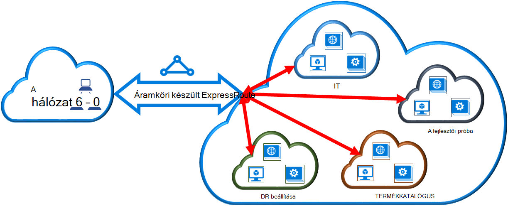

<properties
   pageTitle="A klasszikus telepítési modell és a PowerShell használatával virtuális hálózat csatolása az készült ExpressRoute áramkör |} Microsoft Azure"
   description="A dokumentum szolgáltatása megtudhatja, hogy miként csatolni virtuális hálózatok (VNets) készült ExpressRoute áramkörök a klasszikus telepítési modell és a PowerShell használatával."
   services="expressroute"
   documentationCenter="na"
   authors="ganesr"
   manager="carmonm"
   editor=""
   tags="azure-service-management"/>
<tags
   ms.service="expressroute"
   ms.devlang="na"
   ms.topic="article"
   ms.tgt_pltfrm="na"
   ms.workload="infrastructure-services"
   ms.date="10/10/2016"
   ms.author="ganesr" />

# Csatolni virtuális hálózat egy készült ExpressRoute áramkör

> [AZURE.SELECTOR]
- [Azure portál - erőforrás-kezelő](expressroute-howto-linkvnet-portal-resource-manager.md)
- [A PowerShell - erőforrás-kezelő](expressroute-howto-linkvnet-arm.md)
- [A PowerShell - klasszikus](expressroute-howto-linkvnet-classic.md)

Ez a cikk segít a virtuális hálózatok (VNets) csatolása a készült Azure ExpressRoute áramkörök a klasszikus telepítési modell és a PowerShell használatával. Virtuális hálózatok ugyanabban az előfizetésben lehet, vagy egy másik előfizetéshez tartozik.

**Azure környezetben modellek**

[AZURE.INCLUDE [vpn-gateway-clasic-rm](../../includes/vpn-gateway-classic-rm-include.md)]

## Konfigurációs vonatkozó követelmények

1. Az Azure PowerShell-modul legújabb verziójának szüksége. A legújabb PowerShell-modulok letöltheti a PowerShell szakaszából az [Azure letöltési lapját](https://azure.microsoft.com/downloads/). Kövesse a [telepítése és konfigurálása az Azure PowerShell](../powershell-install-configure.md) lépésenkénti útmutatót találhat az Azure PowerShell-modulok használni a számítógép beállításával.
2. A [Előfeltételek](expressroute-prerequisites.md) [útválasztási követelmények](expressroute-routing.md)és [munkafolyamatok](expressroute-workflows.md) konfigurációs előtt tanulmányozza át van szükség.
3. Az aktív készült ExpressRoute áramkör kell rendelkeznie.
    - Az utasításokat követve [Hozzon létre egy készült ExpressRoute áramkör](expressroute-howto-circuit-classic.md) , és engedélyezze a kapcsolat kapcsolódási szolgáltatójától van.
    - Gondoskodhat arról, hogy Ön Azure magánjellegű peering be van állítva a áramkör. A [Továbbítás konfigurálása](expressroute-howto-routing-classic.md) cikke útválasztási utasításokat.
    - Győződjön meg arról, hogy magánjellegű Azure peering konfigurációja és BGP peering között a hálózat és a Microsoft be, hogy a végpontok közötti kapcsolat engedélyezheti.
    - Virtuális hálózat és a virtuális hálózati átjáró létrehozott és teljesen kiépítéstől kell rendelkeznie. Kövesse az utasításokat [virtuális hálózat készült ExpressRoute beállítása](expressroute-howto-vnet-portal-classic.md).

Az készült ExpressRoute áramkör hozzákapcsolhatja legfeljebb 10 virtuális hálózatokat. Az összes virtuális hálózatok ugyanabban a geopolitikai régióban kell lennie. A készült ExpressRoute áramkör virtuális hálózatokat, vagy hivatkozás virtuális hálózatok, amelyek más geopolitikai régiókban, ha engedélyezte a készült ExpressRoute prémium bővítmény nagyobb számú csatolhat. Jelölje be a [Gyakori kérdések](expressroute-faqs.md) a prémium bővítmény rendszeren.

## Az azonos előfizetés virtuális hálózat csatlakoztatása a kapcsolat

Virtuális hálózat hozzákapcsolhatja egy készült ExpressRoute áramkör az alábbi parancsmag használatával. Győződjön meg arról, hogy a virtuális hálózati átjáró létrejön, és készen áll a csatolás parancsmag futtatása előtt.

    New-AzureDedicatedCircuitLink -ServiceKey "*****************************" -VNetName "MyVNet"
    Provisioned

## A kapcsolat egy másik előfizetést virtuális hálózat csatlakoztatása

Megoszthat egy készült ExpressRoute áramkör több előfizetésekben. Az alábbi ábrán látható egy egyszerű sematikus készült ExpressRoute áramkörök hogyan megosztási művek több előfizetésekben.

A kisebb felhőket belül a nagy felhő mindegyike jelző előfizetések különböző részlegek szerint a szervezeten belüli tartoznak. A szervezeten belül, a megyék mindegyike használható saját előfizetés, az üzembe helyezése a szolgáltatások – de a megyék megoszthatja a egyetlen készült ExpressRoute áramkört való csatlakozáshoz a helyszíni hálózaton. Egy részleghez (ebben a példában: informatikai) is saját a készült ExpressRoute áramkör. Más előfizetések a szervezeten belül, használhatja a készült ExpressRoute áramkör.

>[AZURE.NOTE] A kijelölt áramkör kapcsolódási és sávszélesség díjai a készült ExpressRoute áramkör tulajdonosának fog vonatkozni. Az összes virtuális hálózatok ugyanazt a sávszélesség megosztása.

### Felügyelete

*Áramköri tulajdonosa* a rendszergazda/coadministrator az előfizetés, amelyben a készült ExpressRoute áramkör jön létre. Áramköri tulajdonosa engedélyezheti a rendszergazdák/coadministrators más előfizetések néven *áramkör felhasználók*, a dedikált áramkör, amelyeknek tulajdonosa használni. Áramköri felhatalmazott felhasználók módosíthatják a szervezet készült ExpressRoute áramkör használata után, amelyeket hitelesítettek arra a virtuális network előfizetésének csatolhat a készült ExpressRoute áramkör.

A áramkör tulajdonosa a power módosítsa és engedélyek visszavonása bármikor. Az engedély visszavonása abból az előfizetésből, amelynek hozzáférését visszavont törléséről összes hivatkozást eredményez.

### Áramköri tulajdonosa műveletek

#### Az engedély létrehozása

Áramköri tulajdonosa engedélyezi a rendszergazdák más előfizetések a megadott áramkör használni. A következő példában a rendszergazda a áramkör (Contoso IT) lehetővé teszi, hogy egy másik előfizetést (fejlesztők-próba) egy vagy két virtuális hálózatok hivatkozni szeretne a áramkör rendszergazdája. A Contoso rendszergazdai lehetővé teszi, hogy ez megadásával a fejlesztők-próba a Microsoft-azonosítóját. A parancsmaggal nem e-mailt küldjenek a megadott Microsoft. Áramköri tulajdonosa kell, hogy helyesek-e az engedély kifejezetten értesíti az előfizetés tulajdonosa.

    New-AzureDedicatedCircuitLinkAuthorization -ServiceKey "**************************" -Description "Dev-Test Links" -Limit 2 -MicrosoftIds 'devtest@contoso.com'

    Description         : Dev-Test Links
    Limit               : 2
    LinkAuthorizationId : **********************************
    MicrosoftIds        : devtest@contoso.com
    Used                : 0

#### Engedélyek ellenőrzése

Áramköri tulajdonosa áttekintheti az összes az engedélyeket az alábbi parancsmag futtatásával kiadott egy adott áramkör:

    Get-AzureDedicatedCircuitLinkAuthorization -ServiceKey: "**************************"

    Description         : EngineeringTeam
    Limit               : 3
    LinkAuthorizationId : ####################################
    MicrosoftIds        : engadmin@contoso.com
    Used                : 1

    Description         : MarketingTeam
    Limit               : 1
    LinkAuthorizationId : @@@@@@@@@@@@@@@@@@@@@@@@@@@@@@@@@@@@
    MicrosoftIds        : marketingadmin@contoso.com
    Used                : 0

    Description         : Dev-Test Links
    Limit               : 2
    LinkAuthorizationId : &&&&&&&&&&&&&&&&&&&&&&&&&&&&&&&&&&&&
    MicrosoftIds        : salesadmin@contoso.com
    Used                : 2

#### Engedélyek módosítása

Áramköri tulajdonosa módosíthatja az engedélyeket az alábbi parancsmag használatával:

    Set-AzureDedicatedCircuitLinkAuthorization -ServiceKey "**************************" -AuthorizationId "&&&&&&&&&&&&&&&&&&&&&&&&&&&&"-Limit 5

    Description         : Dev-Test Links
    Limit               : 5
    LinkAuthorizationId : &&&&&&&&&&&&&&&&&&&&&&&&&&&&&&&&&&&&&&
    MicrosoftIds        : devtest@contoso.com
    Used                : 0

#### Engedélyek törlése

Áramköri tulajdonosa is revoke és törlése a felhasználónak az engedélyeket az alábbi parancsmag futtatásával:

    Remove-AzureDedicatedCircuitLinkAuthorization -ServiceKey "*****************************" -AuthorizationId "###############################"

### Áramköri felhasználói műveletek

#### Engedélyek ellenőrzése

A áramkör felhasználó áttekintheti az engedélyeket az alábbi parancsmag használatával:

    Get-AzureAuthorizedDedicatedCircuit

    Bandwidth                        : 200
    CircuitName                      : ContosoIT
    Location                         : Washington DC
    MaximumAllowedLinks              : 2
    ServiceKey                       : &&&&&&&&&&&&&&&&&&&&&&&&&&&&&&&&&&&&
    ServiceProviderName              : equinix
    ServiceProviderProvisioningState : Provisioned
    Status                           : Enabled
    UsedLinks                        : 0

#### Hivatkozás az engedélyeket beváltani

A áramkör felhasználó futtatását is lehetővé teszi, hogy egy hivatkozás engedélyezési beváltása a következő parancsmagot:

    New-AzureDedicatedCircuitLink –servicekey "&&&&&&&&&&&&&&&&&&&&&&&&&&" –VnetName 'SalesVNET1'

    State VnetName
    ----- --------
    Provisioned SalesVNET1

## Következő lépések

Készült ExpressRoute kapcsolatos további tudnivalókért olvassa el a [Készült ExpressRoute – gyakori kérdések](expressroute-faqs.md)című témakört.
