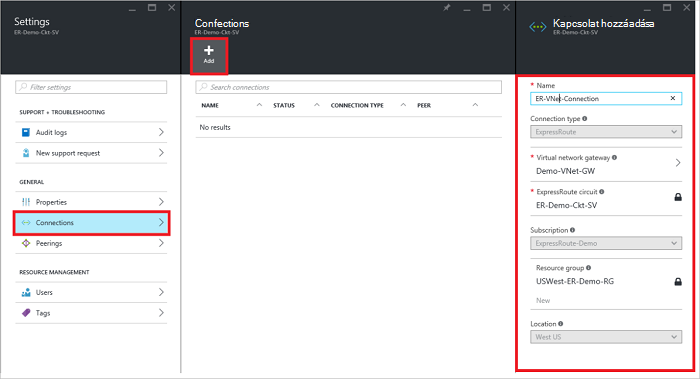
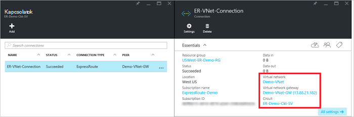

<properties
   pageTitle="Az erőforrás-kezelő telepítési modell és az Azure portal segítségével virtuális hálózat csatolása egy készült ExpressRoute áramkör |} Microsoft Azure"
   description="A dokumentum áttekintést nyújt arról, hogy hogyan készült ExpressRoute áramkörök csatolni virtuális hálózatok (VNets)."
   services="expressroute"
   documentationCenter="na"
   authors="cherylmc"
   manager="carmonm"
   editor=""
   tags="azure-resource-manager"/>
<tags
   ms.service="expressroute"
   ms.devlang="na"
   ms.topic="article"
   ms.tgt_pltfrm="na"
   ms.workload="infrastructure-services"
   ms.date="10/10/2016"
   ms.author="cherylmc" />

# Csatolni virtuális hálózat egy készült ExpressRoute áramkör

> [AZURE.SELECTOR]
- [Azure portál - erőforrás-kezelő](expressroute-howto-linkvnet-portal-resource-manager.md)
- [A PowerShell - erőforrás-kezelő](expressroute-howto-linkvnet-arm.md)
- [A PowerShell - klasszikus](expressroute-howto-linkvnet-classic.md)

Ez a cikk segít a készült Azure ExpressRoute áramkörök az erőforrás-kezelő telepítési modell és az Azure portal segítségével virtuális hálózatok (VNets) csatolása. Virtuális hálózatok lehet ugyanabban az előfizetésben, vagy egy másik előfizetéshez tartozó is lehetnek.

**Azure környezetben modellek**

[AZURE.INCLUDE [vpn-gateway-clasic-rm](../../includes/vpn-gateway-classic-rm-include.md)]

## Konfigurációs vonatkozó követelmények

- Győződjön meg arról, hogy ellenőrzését a [Előfeltételek](expressroute-prerequisites.md), a [követelmények routing](expressroute-routing.md)és a [munkafolyamatok](expressroute-workflows.md) konfigurációs megkezdése előtt.
- Az aktív készült ExpressRoute áramkör kell rendelkeznie.
    - Az utasításokat követve [Hozzon létre egy készült ExpressRoute áramkör](expressroute-howto-circuit-arm.md) , és a kapcsolat a kapcsolat szolgáltatója engedélyezve van.

    - Gondoskodhat arról, hogy Ön Azure magánjellegű peering be van állítva a áramkör. A [Továbbítás konfigurálása](expressroute-howto-routing-portal-resource-manager.md) cikke útválasztási utasításokat.

    - Győződjön meg arról, hogy magánjellegű Azure peering konfigurációja és BGP peering között a hálózat és a Microsoft be, hogy a végpontok közötti kapcsolat engedélyezheti.

    - Győződjön meg arról, hogy van-e egy virtuális hálózati és a virtuális hálózati átjáró létrehozott és teljesen kiépítéstől. Kövesse az utasításokat követve hozzon létre egy [virtuális Magánhálózati átjáró](../articles/vpn-gateway/vpn-gateway-howto-site-to-site-resource-manager-portal.md) (követés csak lépéseket 1-5).

A szokásos készült ExpressRoute áramkört legfeljebb 10 virtuális hálózatok hozzákapcsolhatja. A szokásos készült ExpressRoute áramkört használata esetén minden virtuális hálózatok ugyanabban a geopolitikai régióban kell lennie. Hivatkozás egy virtuális hálózatok kívül a készült ExpressRoute áramkör geopolitikai régiója, vagy nagyobb számot virtuális hálózatok csatlakoztatása a készült ExpressRoute áramkör, ha engedélyezte a készült ExpressRoute prémium bővítmény. Jelölje be a [Gyakori kérdések](expressroute-faqs.md) a prémium bővítmény rendszeren.

## Az azonos előfizetés virtuális hálózat csatlakoztatása a kapcsolat

### Kapcsolat létrehozása

1. Győződjön meg arról, hogy a készült ExpressRoute áramkör és a magánjellegű Azure peering van beállítva sikeresen. Kövesse a [egy készült ExpressRoute áramkör létrehozása](expressroute-howto-circuit-arm.md) és a [Továbbítás beállítása](expressroute-howto-routing-arm.md). A készült ExpressRoute áramkör az alábbi képen például kell kinéznie.

    

    >[AZURE.NOTE] BGP konfigurációs adatok nem jelennek meg ha a layer 3 szolgáltató konfigurálva a peerings. Ha a áramkör kiépített állapotban van, láthatja, hozhatnak létre kapcsolatot.

2. Megkezdheti a kiépítési csatolni virtuális hálózati kezdőlapja az készült ExpressRoute áramkör kapcsolat. Kattintson a **kapcsolat** > **hozzáadása** a **kapcsolat hozzáadása** lap megnyitásához, és adja meg az értékeket. Lásd az alábbi hivatkozás példát.

      

3. Miután a kapcsolat sikeresen van konfigurálva, a kapcsolati objektum a kapcsolat adatai jelennek meg.

    

### Kapcsolat törlése

Kapcsolat a kapcsolat a lap **törlése** ikonra kattintva törölheti.

## A kapcsolat egy másik előfizetést virtuális hálózat csatlakoztatása

Jelenleg nem tud kapcsolódni virtuális hálózatok előfizetésekben az Azure portálon. Azonban ehhez PowerShell is használhatja. [A PowerShell](expressroute-howto-linkvnet-arm.md) témakörben további információt.

## Következő lépések

Készült ExpressRoute kapcsolatos további tudnivalókért olvassa el a [Készült ExpressRoute – gyakori kérdések](expressroute-faqs.md)című témakört.
