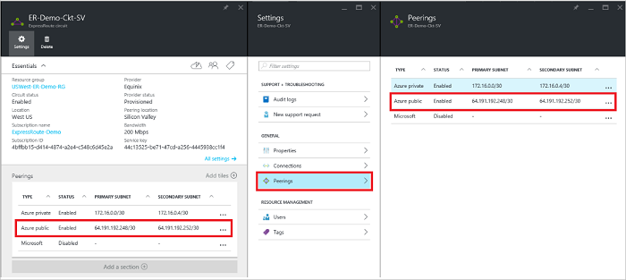

<properties
   pageTitle="Egy készült ExpressRoute áramkör az Azure-portálon továbbítás beállítása |} Microsoft Azure"
   description="Ez a cikk végigvezeti a létrehozásához, és a lehetőséget választva személyes, nyilvános és a Microsoft-készült ExpressRoute áramkör peering kiépítési. Ez a cikk is bemutatja, hogyan ellenőrizheti az állapotát, frissíthet és törölhet peerings a kapcsolat."
   documentationCenter="na"
   services="expressroute"
   authors="cherylmc"
   manager="carmonm"
   editor=""
   tags="azure-resource-manager"/>
<tags
   ms.service="expressroute"
   ms.devlang="na"
   ms.topic="hero-article" 
   ms.tgt_pltfrm="na"
   ms.workload="infrastructure-services"
   ms.date="10/10/2016"
   ms.author="cherylmc"/>

# Létrehozása és módosítása az készült ExpressRoute áramkör Útválasztás

> [AZURE.SELECTOR]
[Azure portál - erőforrás-kezelő](expressroute-howto-routing-portal-resource-manager.md)
[PowerShell - erőforrás-kezelő](expressroute-howto-routing-arm.md)
[PowerShell - klasszikus](expressroute-howto-routing-classic.md)

Az alábbiakban ismertetjük, létrehozása és kezelése egy készült ExpressRoute áramkör az Azure-portálra, és az erőforrás-kezelő telepítési modell útválasztás beállításának lépéseit.

**Azure környezetben modellek**

[AZURE.INCLUDE [vpn-gateway-clasic-rm](../../includes/vpn-gateway-classic-rm-include.md)] 

## Konfigurációs vonatkozó követelmények

- Győződjön meg arról, hogy ellenőrzését a [Előfeltételek](expressroute-prerequisites.md) lapon, a [útválasztási követelményeinek](expressroute-routing.md) lap és a [munkafolyamatok](expressroute-workflows.md) lap konfigurációs megkezdése előtt.
- Az aktív készült ExpressRoute áramkör kell rendelkeznie. Kövesse az utasításokat létrehozása [egy készült ExpressRoute áramkör](expressroute-howto-circuit-arm.md) , és a folytatás előtt engedélyezve van a kapcsolat szolgáltatója áramkör van. A készült ExpressRoute áramkör ki láthatja az alábbiakban ismertetett parancsmag kiépített és engedélyezett állapotban kell lennie.

Ezeket az utasításokat a létrehozott réteget 2 adatkapcsolat szolgáltatásokat kínáló szolgáltatókkal áramkörök csak vonatkoznak. Ha használja a szolgáltató kínáló felügyelt Layer 3 szolgáltatások (általában egy IPVPN, például MPLS), a kapcsolat szolgáltatója konfigurálása, és meg útválasztás kezelése. 

>[AZURE.IMPORTANT] Az adatkezelési portálon keresztül szolgáltatók állítható be peerings azt jelenleg nem helyüket. Ez a képesség hamarosan engedélyezéséről dolgozunk. Ellenőrizze a szolgáltatás szolgáltatónál BGP peerings konfigurálása előtt.

Beállíthatja, hogy egy, a két, vagy egy készült ExpressRoute áramköri az összes három peerings (Azure saját, Azure nyilvános és Microsoft). Peerings beállíthatja úgy dönt, tetszőleges sorrendben. Azonban gondoskodnia kell arról, hogy minden peering egyszerre csak egy konfigurációja befejezéséhez. 

## A magánjellegű Azure peering

Ez a szakasz ismertető hozhat létre, kérjen, frissítése és törlése az Azure-készült ExpressRoute áramkör személyes peering adatokat. 

### A magánjellegű Azure peering létrehozása

1. Állítsa be a készült ExpressRoute áramkör. Győződjön meg arról, hogy a áramkör már teljesen kiépítve a kapcsolat szolgáltatója a továbblépés előtt.

    

2. Állítsa be az Azure magánjellegű peering a kapcsolat. Győződjön meg arról, hogy az alábbi elemek előtt, folytassa a következő lépésekkel:

    - Egy /30 alhálózat az elsődleges hivatkozás. Ez nem lehet virtuális hálózatok fenntartott címterület részét.
    - Egy /30 alhálózat a másodlagos hivatkozás. Ez nem virtuális hálózatok fenntartott címterület részének kell lennie.
    - Egy érvényes virtuális ID peering a megállapításához. Biztosítani, hogy nincs más peering a a kapcsolat használja ugyanazt az virtuális azonosítót.
    - A peering SZÁMKÉNT. 2 bájtos és 4 bájtos SZÁMKÉNT is használhatja. Magánjellegű használható-e peering SZÁMKÉNT. Győződjön meg arról, hogy 65515 nem használ.
    - Egy MD5 kivonat, ha úgy dönt, hogy közül válasszon. **Ez a lépés nem kötelező**.

3. Jelölje ki a magánjellegű Azure peering, alább látható módon.
    
    
    

4. Konfigurálja a magánjellegű peering. Az alábbi képen egy konfigurációs példa látható.

    

    
5. Mentse a konfigurációt, miután megadta az összes paramétert. Miután sikeresen a konfigurációs elfogadta volna, látni fogja az alábbihoz hasonló.

    
    

### Azure magánjellegű peering részleteinek megtekintése

Azure magánjellegű peering a peering kiválasztásával tulajdonságainak megtekintése

### Azure személyes peering konfigurációs frissítése

Jelölje ki peering sorát, és a peering tulajdonságainak módosítása. 

### A magánjellegű Azure peering törlése

Eltávolíthatja a peering konfigurációs, kattintson a Törlés ikonra az alább látható módon.

## Azure nyilvános peering

Ez a szakasz ismertető hozhat létre, első, frissítése és törlése az Azure-készült ExpressRoute áramkör nyilvános peering adatokat. 

### Azure nyilvános peering létrehozása

1. Állítsa be a készült ExpressRoute áramkör. Győződjön meg arról, hogy a áramkör már teljesen kiépítve a kapcsolat szolgáltatója további a továbblépés előtt.

    

2. Állítsa be az Azure nyilvános peering a kapcsolat. Győződjön meg arról, hogy az alábbi elemek előtt, folytassa a következő lépésekkel:

    - Egy /30 alhálózat az elsődleges hivatkozás. 
    - Egy /30 alhálózat a másodlagos hivatkozás. 
    - Az összes IP-címek beállítása a peering használt érvényes nyilvános IPv4-címei kell lennie.
    - Egy érvényes virtuális ID peering a megállapításához. Biztosítani, hogy nincs más peering a a kapcsolat használja ugyanazt az virtuális azonosítót.
    - A peering SZÁMKÉNT. 2 bájtos és 4 bájtos SZÁMKÉNT is használhatja.
    - Ha úgy dönt, hogy közül válasszon egy MD5 kivonat. **Ez a lépés nem kötelező**.

3. Jelölje ki a Azure nyilvános peering, alább látható módon.
    
    
    

4. Nyilvános peering konfigurálása Az alábbi képen egy konfigurációs példa látható.

    

    
5. Mentse a konfigurációt, miután megadta az összes paramétert. Miután sikeresen a konfigurációs elfogadta volna, látni fogja az alábbihoz hasonló.

    
    

### Azure nyilvános peering részleteinek megtekintése

Azure nyilvános peering a peering kiválasztásával tulajdonságainak megtekintése

### Azure nyilvános peering konfigurációs frissítése

Jelölje ki peering sorát, és a peering tulajdonságainak módosítása. 

### Azure nyilvános peering törlése

Kattintson a Törlés ikonra az alább látható módon a peering konfigurációs eltávolíthatja.

## A Microsoft peering

Ez a szakasz ismertető hozhat létre, első, frissítése és törlése a Microsoft-készült ExpressRoute áramkör peering beállításokat. 

### A Microsoft peering létrehozása

1. Készült ExpressRoute áramkör konfigurálása. Győződjön meg arról, hogy a áramkör már teljesen kiépítve a kapcsolat szolgáltatója további a továbblépés előtt.

    

2. Állítsa be a áramkör peering Microsoft. Győződjön meg arról, hogy az alábbi információk folytatás előtt.

    - Egy /30 alhálózat az elsődleges hivatkozás. Ez lehet érvényes nyilvános IPv4 előtagot az Ön tulajdonában és regisztrált egy RIR / BMR.
    - Egy /30 alhálózat a másodlagos hivatkozás. Ez lehet érvényes nyilvános IPv4 előtagot az Ön tulajdonában és regisztrált egy RIR / BMR.
    - Egy érvényes virtuális ID peering a megállapításához. Biztosítani, hogy nincs más peering a a kapcsolat használja ugyanazt az virtuális azonosítót.
    - A peering SZÁMKÉNT. 2 bájtos és 4 bájtos SZÁMKÉNT is használhatja.
    - **Prefixumokban közzététel:** Meg kell adnia azt tervezi, hogy a BGP munkamenet fölé meghirdetése összes előtagot listáját. Csak nyilvános IP cím prefixumokban elfogadott. Ha szeretne küldeni egy sor olyan prefixumokban elküldheti vesszővel tagolt listáját. Ezek a prefixumokban regisztrálva kell lenniük, egy RIR / BMR.
    - **Ügyfél ASN:** Ha Ön nem regisztrált a SZÁMKÉNT peering hirdetési prefixumokban, megadhatja a regisztrált, amelyhez AS számot. **Ez a lépés nem kötelező**.
    - **Útválasztási rendszerleíró neve:** Megadhatja, hogy a RIR / BMR szemben, amely a szám és a prefixumokban regisztrált. **Ez a lépés nem kötelező.**
    - Egy MD5 kivonat, ha úgy dönt, hogy közül válasszon. **Ez a lépés nem kötelező.**
    
3. Az alább látható módon beállítani kívánt peering is választhat. Jelölje ki a Microsoft peering.
    
    
    

4.  Állítsa be a Microsoft peering. Az alábbi képen egy konfigurációs példa látható.

    

    
5. Mentse a konfigurációja, miután megadta az összes paramétert. 

    Ha esetekben a áramkör érvényesség szükséges állapota (mint alább), és meg kell nyitnia a támogatási jegyek megjelenítése a prefixumokban a támogatási csoportunk tulajdonjogának igazolása.  
    
    

    Megnyithatja a támogatási jegyek közvetlenül a portálon alább látható módon   
    
    

6. Miután sikeresen a konfigurációs elfogadta volna, látni fogja az alábbihoz hasonló.

    
    

### A Microsoft peering részleteinek megtekintése

Azure nyilvános peering a peering kiválasztásával tulajdonságainak megtekintése

### Microsoft peering-beállítások frissítése

Jelölje ki peering sorát, és a peering tulajdonságainak módosítása. 

### A Microsoft peering törlése

Eltávolíthatja a peering konfigurációs, kattintson a Törlés ikonra az alább látható módon.

## Következő lépések

A következő lépésben [egy VNet szeretne egy készült ExpressRoute áramkör hivatkozásra](expressroute-howto-linkvnet-arm.md).

-  Munkafolyamatok készült ExpressRoute kapcsolatos további tudnivalókért olvassa el a [készült ExpressRoute munkafolyamatok](expressroute-workflows.md)című témakört.

-  [További információt a peering áramkör készült ExpressRoute áramkörök és](expressroute-circuit-peerings.md)megtekintése útválasztási tartományok

-  Virtuális hálózatokkal való használatáról további információt a [virtuális hálózati áttekintése](../virtual-network/virtual-networks-overview.md)című témakörben találhat.

