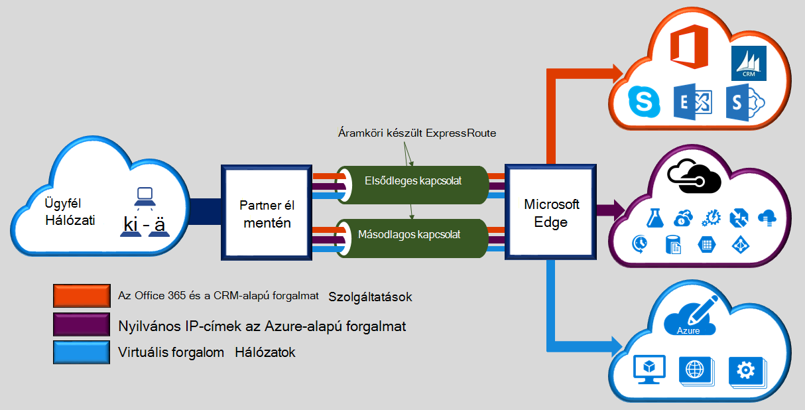
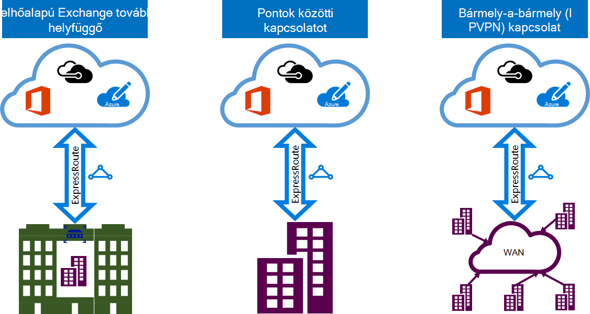

<properties 
   pageTitle="Bevezetés készült ExpressRoute |} Microsoft Azure"
   description="Ezen az oldalon áttekintést nyújt a készült ExpressRoute szolgáltatás, beleértve a készült ExpressRoute származó működése."
   documentationCenter="na"
   services="expressroute"
   authors="cherylmc"
   manager="carmonm"
   editor=""/>
<tags 
   ms.service="expressroute"
   ms.devlang="na"
   ms.topic="get-started-article" 
   ms.tgt_pltfrm="na"
   ms.workload="infrastructure-services" 
   ms.date="10/10/2016"
   ms.author="cherylmc"/>

# Technikai áttekintés készült ExpressRoute

Microsoft Azure készült ExpressRoute teszi lehetővé a helyszíni hálózatok kiterjeszti a Microsoft cloud könnyíteni a kapcsolat szolgáltatója saját személyes kapcsolaton keresztül. Készült ExpressRoute, a Microsoft felhőszolgáltatásokhoz, például a Microsoft Azure, Office 365-ben és CRM Online kapcsolatokat hozhat létre. Kapcsolat lehet egy bármely-a-bármely (IP-VPN) hálózat, egy Ethernet pontok közötti hálózati vagy egy kapcsolatot a helymegosztást létesítmény közvetítésével virtuális határokon-kapcsolatot. Készült ExpressRoute kapcsolatok megy nyilvános interneten keresztül. Ebben a csoportban adhatja készült ExpressRoute kapcsolatok további megbízhatósága, gyorsabb sebesség, alsó késések vagy magasabb szintű biztonságos, mint a szokásos kapcsolatok ajánlani az interneten keresztül.

**Többek között a fő előnyöket nyújtja:**

- Layer 3 összekapcsolását a helyszíni hálózaton és a Microsoft Cloud egy kapcsolatot szolgáltatón keresztül. Kapcsolat lehet egy hálózatból bármely-a-bármely (IPVPN), pontok közötti Ethernet kapcsolat, vagy az Ethernet exchange keresztül virtuális határokon-kapcsolaton keresztül.
- Kapcsolat a geopolitikai tartományban lévő összes területek között a Microsoft felhőszolgáltatásokhoz.
- Globális kiszolgálóhoz való csatlakozás Microsoft szolgáltatások készült ExpressRoute prémium bővítmény összes régiókat keresztül.
- Dinamikus fölé iparágban szabványos protokollok (BGP) között a hálózat és a Microsoft útválasztás.
- Beépített redundancia a nagyobb megbízhatóság minden peering helyen.
- Kapcsolat üzemidőt [SLA](https://azure.microsoft.com/support/legal/sla/).
- QoS és több osztályok speciális alkalmazások, például a Skype vállalati verzió szolgáltatás támogatása.

További információt a [Gyakori készült ExpressRoute](expressroute-faqs.md) témakörben olvashatók.

## Hogyan tudok csatlakozni a hálózatot használ készült ExpressRoute Microsoft?

Három különböző módon hozhat létre kapcsolatot a helyszíni hálózaton és a Microsoft cloud között:

### Dokumentumok közös található egy felhőalapú exchange

Az a felhő exchange létesítmény közös találhatók, virtuális határokon-kapcsolatot a Microsoft cloud keresztül a helymegosztást szolgáltató Ethernet exchange sorrendbe is. Helymegosztást szolgáltatók réteg 2 határokon-kapcsolatok vagy felügyelt Layer 3 határokon – közötti kapcsolatok az a helymegosztást intézményben infrastruktúra és a Microsoft cloud is kínálhatnak.

### Pontok közötti Ethernet-kapcsolatok 

A helyszíni adatközpontokkal/irodák pontok közötti Ethernet-kapcsolaton keresztül a Microsoft cloud csatlakozhat. Pontok közötti Ethernet szolgáltatók Layer 2 kapcsolatok is kínálhatnak, vagy a webhely és a Microsoft cloud között Layer 3 kapcsolatok kezelése.

### Bármely-a-bármely (IPVPN) hálózatok

A WAN integrálhatja a a Microsoft cloud. IPVPN szolgáltatók (általában MPLS VPN) a ág irodák és adatközpontokkal bármely-a-bármely összekapcsolását kínálnak. A Microsoft cloud is össze kell kötni a WAN, mint bármely más irodában külsőt. WAN általában szolgáltatók felügyelt Layer 3-kapcsolatot. Készült ExpressRoute funkciók és szolgáltatások megegyeznek az összes összes a fenti adatkapcsolati modellek. 

Csatlakozási szolgáltatók is kínálhatnak, egy vagy több adatkapcsolati modellek. A kapcsolat szolgáltatót válassza a modellt, amely a legjobban dolgozhat.

## A szolgáltatások készült ExpressRoute

Készült ExpressRoute szolgáltatásokat és funkciókat támogatja: 

### Layer 3 kapcsolat

A helyszíni hálózaton, a példányok Azure-ban és a Microsoft között irányítja Microsoft felhasználási szabványos dinamikus útválasztási protokollal (BGP) az exchange nyilvános címet.  Alakítsunk eltérő forgalmat profilok hálózati több BGP munkamenetet. További részletek [készült ExpressRoute áramkör és a továbbítás tartományok](expressroute-circuit-peerings.md) című témakörben találhatók.

### A redundancia

Minden készült ExpressRoute áramkör két kapcsolatot a két Microsoft Enterprise él útválasztó (MSEEs) áll a kapcsolatszolgáltatások-szolgáltatótól / a hálózati meg él. Kettős BGP kapcsolatot a kapcsolat szolgáltatója van szükség Microsoft és az oldal – egy a minden MSEE. Előfordulhat, hogy nem kívánja felesleges eszköz telepítése és a záró áramkörök Ethernet. Csatlakozási szolgáltatók azonban annak érdekében, hogy a kapcsolatok vannak beadását Microsoft felesleges módon használja az felesleges eszközök. A felesleges Layer 3 kapcsolódási konfigurációja legyenek érvényesek a [SLA](https://azure.microsoft.com/support/legal/sla/) felvétele szükséges. 

### A Microsoft felhőszolgáltatásokhoz kapcsolat

[AZURE.INCLUDE [expressroute-office365-include](../../includes/expressroute-office365-include.md)]

Készült ExpressRoute kapcsolatok a következő szolgáltatásokhoz való hozzáférés engedélyezése:

- Microsoft Azure-szolgáltatások
- A Microsoft Office 365-szolgáltatások
- A Microsoft CRM Online szolgáltatások 
 
Ellátogathat a [Készült ExpressRoute – gyakori kérdések](expressroute-faqs.md) lapját részletes fölé készült ExpressRoute támogatott szolgáltatások listáját.

### Minden egyes területeire egy geopolitikai régión belüli kapcsolat

Csatlakozás Microsoft saját [peering helyek](expressroute-locations.md) valamelyikén, és van hozzáférésük ahhoz a geopolitikai régión belüli összes régiók. 

Például ha Amsterdam készült ExpressRoute keresztül a Microsoft csatlakozva, hozzáférést kap Észak-Európa és a nyugati Európában tárolt összes Microsoft felhőszolgáltatásokhoz. A [készült ExpressRoute partnerek és peering helyek](expressroute-locations.md) a cikk bemutatja a geopolitikai régiók, a társított Microsoft cloud régiók és a megfelelő készült ExpressRoute peering helyek vonatkoznak.

### Globális kapcsolatokkal készült ExpressRoute prémium bővítmény

Ha ki szeretné terjeszteni a csatlakozási geopolitikai közötti együttműködést kívánja lehetővé készült ExpressRoute prémium bővítmény szolgáltatás is engedélyezése. Például a Microsoft Amsterdam készült ExpressRoute keresztül csatlakozik, ha fog hozzáférése van az összes Microsoft felhőszolgáltatásokhoz világszerte minden régióban is (national felhőket tartoznak). A Dél-Amerika és az Ausztrália rendszerbe, és elérheti a Észak és Európa nyugati régió ugyanúgy szolgáltatások érheti el.

### Rich kapcsolódási partner ökológiai

Készült ExpressRoute egy folyamatosan bővülő ökológiai kapcsolódási szolgáltatók és a partnerek SI tartalmaz. A legfrissebb információkat [készült ExpressRoute szolgáltatók és helyek](expressroute-locations.md) cikk is hivatkozhat.

### Nemzeti felhőket kapcsolat

A Microsoft speciális geopolitikai régiók és a felhasználói szegmens elszigetelt felhőalapú környezetben működik. Keresse meg a [készült ExpressRoute szolgáltatók és a helyek](expressroute-locations.md) lapon nemzeti felhőket és szolgáltatók listáját.

### Támogatott sávszélesség-beállítások

Készült ExpressRoute áramkörök széles sávszélessége is vásárolhat. A támogatott sávszélessége listáját táblázatban látható. Feltétlenül kérdezze meg a csatlakozási szolgáltató határozza meg a támogatott sávszélessége biztosítanak listáját.

- 50 MB
- 100 MB
- 200 MB
- 500 MB
- 1 GB/s
- 2 GB/s
- 5 GB/s
- 10 GB/s

### Dinamikus méretezését sávszélességre

Ha lehetővé teszi, hogy a készült ExpressRoute áramkör sávszélesség (az ajánlott munkamennyiség alapján) vághat lefelé a kapcsolat nélkül. 

### Rugalmas számlázási modellek

Számlázási modell, amely a legjobban is választhat. Válassza az alább felsorolt számlázási modelljei közötti. Olvassa el a további részleteket [Készült ExpressRoute – gyakori kérdések](expressroute-faqs.md) lapjára. 

- **Korlátlan adatokat**. A készült ExpressRoute áramkör terheli havi díjat alapján, és minden bejövő és kimenő adatátvitel ingyenes legyen. 
- **Forgalmi díjas adatokat**. A készült ExpressRoute áramkör terheli havi díjat alapján. Az összes bejövő adatátvitel történik ingyenesen. Kimenő adatátvitel adatátviteli GB / terheli. Adatátviteli régió változhat.
- **Készült ExpressRoute prémium bővítményt**. A készült ExpressRoute prémium az bővítménye az készült ExpressRoute áramkör fölé. A készült ExpressRoute prémium bővítményt az alábbi szolgáltatásokat nyújtja: 
    - Azure nyilvános és Azure magánjellegű peering 4000 útvonalak a 10 000 útvonalak nagyobb útvonal korlátozások.
    - Globális adatkapcsolat szolgáltatások. Az (national felhőket kivéve) bármely régióban létrehozott készült ExpressRoute áramkör érik el erőforrások a világ bármely más régió keresztül. Például egy virtuális hálózati nyugati Európában létrehozott érhetők el az szilícium völgyi rendszerbeli készült ExpressRoute áramkör.
    - VNet hivatkozások készült ExpressRoute áramkör nagyobb korlát, attól függően, hogy a sávszélesség a áramkör 10 dB / megnövelt száma.

## Következő lépések

- Tudjon meg többet a készült ExpressRoute kapcsolatok és útválasztási tartományok. Lásd: [készült ExpressRoute áramkörök és útválasztási tartományok](expressroute-circuit-peerings.md).
- A szolgáltató keresése. Lásd: [készült ExpressRoute partnerek és peering helyek](expressroute-locations.md).
- Győződjön meg arról, hogy a szükséges összes feltétel teljesül-e. Lásd: [készült ExpressRoute Előfeltételek](expressroute-prerequisites.md).
- [Útválasztás](expressroute-routing.md), [hálózati Címfordítást](expressroute-nat.md) és [QoS](expressroute-qos.md)vonatkozó követelmények vonatkoznak.
- Állítsa be a készült ExpressRoute kapcsolatot.
    - [Készült ExpressRoute áramkör létrehozása](expressroute-howto-circuit-classic.md)
    - [Útválasztás konfigurálása](expressroute-howto-routing-classic.md)
    - [Hivatkozás egy VNet egy készült ExpressRoute áramkör](expressroute-howto-linkvnet-classic.md)
