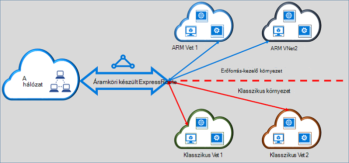

<properties
   pageTitle="Klasszikus készült ExpressRoute áramkörök áthelyezése erőforrás-kezelő |} Microsoft Azure"
   description="Ezen az oldalon, mit kell tudnom még az összekötő klasszikus és az erőforrás-kezelő telepítési modelljei áttekintést."
   documentationCenter="na"
   services="expressroute"
   authors="ganesr"
   manager="carmonm"
   editor=""/>
<tags
   ms.service="expressroute"
   ms.devlang="na"
   ms.topic="get-started-article"
   ms.tgt_pltfrm="na"
   ms.workload="infrastructure-services"
   ms.date="10/10/2016"
   ms.author="ganesr"/>

# A klasszikus készült ExpressRoute áramkörök áthelyezése az erőforrás-kezelő telepítési modell

Ez a cikk áttekintést nyújt a hibaüzenet jelentése: az Azure készült ExpressRoute áramkör az Azure erőforrás-kezelő telepítési modell klasszikus helyezhetők át.

[AZURE.INCLUDE [vpn-gateway-sm-rm](../../includes/vpn-gateway-classic-rm-include.md)]

Egy egyetlen készült ExpressRoute áramkör klasszikus és az erőforrás-kezelő telepítési modelljei egyaránt telepített virtuális hálózatokhoz is használhatja. Az készült ExpressRoute áramkör, függetlenül attól, hogy létrehozása, most csatolhat virtuális hálózatok mindkét telepítési modellek keresztül.

## A klasszikus telepítési modell létrehozott áramkörök készült ExpressRoute

A klasszikus telepítési modell létrehozott készült ExpressRoute áramkörök kell helyezhetők át az erőforrás-kezelő telepítési modell először lehetővé teszi való csatlakozást klasszikus és az erőforrás-kezelő telepítési modelljei is. Nincs kapcsolat elvesztése vagy zavarok kapcsolat áthelyezésekor. A klasszikus telepítési modell (belül azonos előfizetés és idegen-előfizetés) minden áramkör és – a virtuális hálózati kapcsolatok megőrződnek.

Miután az áthelyezés a sikeresen befejeződött, a készült ExpressRoute áramkör formátumban, hajt végre, és érzi, akárcsak egy készült ExpressRoute áramkör, az erőforrás-kezelő telepítési modell létrehozott. Most már létrehozhat kapcsolatokat a virtuális hálózatok az erőforrás-kezelő telepítési modell.

Egy készült ExpressRoute után áramkör van át lett helyezve az erőforrás-kezelő telepítési modell csak az erőforrás-kezelő telepítési modell használatával kezelheti a készült ExpressRoute áramkör az életciklusának. Ez azt jelenti, hogy műveleteket végezheti el peerings hozzáadása/módosítása és törlése hasonló frissítése a kapcsolatok tulajdonságai (például a sávszélesség Termékváltozat és számlázási típusa), és csak az erőforrás-kezelő telepítési modell áramkörök törlése. Keresse meg a csoportban a az erőforrás-kezelő telepítési modell további részleteket a hogyan kezelheti a két környezetben levő az access által létrehozott áramkörök alatt.

Nem rendelkezik, hogy bekapcsolják a kapcsolat szolgáltatója az áthelyezés elvégzéséhez.

## Az erőforrás-kezelő telepítési modell az létrehozott áramkörök készült ExpressRoute

Az erőforrás-kezelő telepítési modell mindkét telepítési modellekből hozzáférhető legyen az létrehozott készült ExpressRoute áramkörök engedélyezheti. Bármely készült ExpressRoute áramkör, az előfizetése engedélyezhető a két környezetben modellekből érhető el.

- Az erőforrás-kezelő telepítési modell létrehozott készült ExpressRoute áramkörök nincs hozzáférése a klasszikus telepítési modell alapértelmezés szerint.
- A klasszikus telepítési modellből az erőforrás manager telepítési modell áthelyezett készült ExpressRoute áramkörök alapértelmezés szerint a két környezetben modellekből érhetők el.
- Az készült ExpressRoute áramkör hozzáfér az erőforrás-kezelő telepítési modell, függetlenül attól, hogy az erőforrás-kezelő jött létre vagy klasszikus telepítési modell. Ez azt jelenti, hogy létrehozhat kapcsolatokat a virtuális hálózataihoz az erőforrás-kezelő telepítési modell című témakör lépéseit követve [csatolni virtuális hálózatok](expressroute-howto-linkvnet-arm.md)olvashat.
- A klasszikus telepítési modell a hozzáférést a **allowClassicOperations** paramétert a készült ExpressRoute áramkör szabályozza.

>[AZURE.IMPORTANT] A [szolgáltatás korlátozások](../azure-subscription-service-limits.md) lapon ismertetett összes kvóták vonatkoznak. Példaként a szabványos áramkört beállíthatja, hogy legfeljebb 10 virtuális hálózati hivatkozások/kapcsolatok végig a hagyományos és az erőforrás-kezelő telepítési modelljei is.

## A klasszikus telepítési modell való hozzáférés szabályozása

Lehetősége van engedélyezni a készült ExpressRoute áramkör **allowClassicOperations** paraméterének beállításával csatolni virtuális hálózatok mindkét telepítési modellekben egyetlen készült ExpressRoute áramkört ábrázoló.

Igaz értékre **allowClassicOperations** lehetővé teszi, hogy a készült ExpressRoute áramkör mindkét telepítési modellekből virtuális hálózatok hivatkozás. A klasszikus telepítési modell virtuális hálózatokhoz által követett találhat [csatolni virtuális hálózatok a klasszikus telepítési modell](expressroute-howto-linkvnet-classic.md)hivatkozás. Az erőforrás-kezelő telepítési modell virtuális hálózatokhoz által követett találhat [csatolni virtuális hálózatok az erőforrás-kezelő telepítési modell](expressroute-howto-linkvnet-arm.md)hivatkozás.

HAMIS blokkolja a hozzáférést a áramkör a klasszikus telepítési modellből **allowClassicOperations** beállítást. A klasszikus telepítési modell összes virtuális hálózati kapcsolat azonban megőrződnek. Ebben az esetben az a készült ExpressRoute áramkör nem láthatók a klasszikus telepítési modell.

## A klasszikus telepítési modell támogatott műveletek

A következő klasszikus műveleteket egy készült ExpressRoute áramkör támogatottak, amikor **allowClassicOperations** értéke igaz:

 - Készült ExpressRoute áramkör információk
 - Klasszikus virtuális hálózatok létrehozása és frissítése/get/törlése virtuális hálózati kapcsolat
 - Idegen-előfizetés kapcsolat létrehozása és frissítése/get/törlése virtuális hálózati hivatkozás engedélyek

A következő klasszikus műveletek nem tudja elvégezni, ha **allowClassicOperations** értéke igaz:

 - Hozzon létre és frissítés/get/törlése szegély átjáró Protocol (BGP) peerings Azure saját, Azure nyilvános, és a Microsoft peerings
 - Készült ExpressRoute kapcsolatok törlése

## A klasszikus és az erőforrás-kezelő telepítési modelljei közötti kommunikáció

A készült ExpressRoute áramkör úgy működik, mint a hagyományos és az erőforrás-kezelő telepítési modelljei közötti hidat. A klasszikus telepítési modell virtuális hálózatok virtual machines és a virtuális hálózatok az erőforrás-kezelő telepítési modell flow készült ExpressRoute, ha mindkét virtuális hálózathoz kapcsolódik az azonos készült ExpressRoute áramkör keresztül közötti forgalmat.

Összesítő átviteli korlátozza a virtuális hálózati átjáró átviteli kapacitása. Adatforgalom nem kell megadni a kapcsolat szolgáltatója hálózatok vagy a saját hálózatokhoz ebben az esetben. Kötelező haladási a virtuális hálózatok között teljesen szerepel a Microsoft-hálózaton belül.

## Hozzáférés nyilvános Azure és a Microsoft peering erőforrások

A szokásos kezelhető Azure nyilvános peering és a Microsoft peering bármely zavartalanul forrásokat is.  

## Támogatott

Ez a szakasz ismerteti, hogy mely szolgáltatások támogatottak, készült ExpressRoute kapcsolatok:

 - Egy egyetlen készült ExpressRoute áramkör virtuális hálózatok, a hagyományos és az erőforrás-kezelő telepítési modelljei telepített eléréséhez is használhatja.
 - Áthelyezheti az készült ExpressRoute áramkör a klasszikus az erőforrás-kezelő telepítési modell. Az áthelyezés után a készült ExpressRoute áramkör formátumban érzi és hajt végre, mint bármely más készült ExpressRoute áramkör, hogy az erőforrás-kezelő telepítési modell jön létre.
 - Csak a készült ExpressRoute áramkör léphet. Áramköri hivatkozások, a virtuális hálózatok és a virtuális Magánhálózati átjárók – Ez a művelet nem mozgathatók.
 - Egy készült ExpressRoute után áramkör van át lett helyezve az erőforrás-kezelő telepítési modell csak az erőforrás-kezelő telepítési modell használatával kezelheti a készült ExpressRoute áramkör az életciklusának. Ez azt jelenti, hogy műveleteket végezheti el peerings hozzáadása/módosítása és törlése hasonló frissítése a kapcsolatok tulajdonságai (például a sávszélesség Termékváltozat és számlázási típusa), és csak az erőforrás-kezelő telepítési modell áramkörök törlése.
 - A készült ExpressRoute áramkör úgy működik, mint a hagyományos és az erőforrás-kezelő telepítési modelljei közötti hidat. A klasszikus telepítési modell virtuális hálózatok virtual machines és a virtuális hálózatok az erőforrás-kezelő telepítési modell flow készült ExpressRoute, ha mindkét virtuális hálózathoz kapcsolódik az azonos készült ExpressRoute áramkör keresztül közötti forgalmat.
 - Idegen-előfizetés kapcsolódási támogatja a klasszikus és az erőforrás-kezelő telepítési modelljei is.

## Nem támogatott

Ez a szakasz ismerteti a nem támogatott készült ExpressRoute kapcsolatok:

 - Áttérés áramkör hivatkozások, átjárókat és virtuális hálózatok a klasszikus az erőforrás-kezelő telepítési modell.
 - A klasszikus telepítési modell egy készült ExpressRoute áramkör életciklusára kezelése
 - Szerepköralapú hozzáférés vezérlő (RBAC) támogatása a klasszikus telepítési modell. A klasszikus telepítési modell egy áramkör RBAC vezérlőelemek nem frissíthetők. Bármely rendszergazda/coadministrator az előfizetés is csatolása vagy leválasztása a áramkör virtuális hálózatokat.

## Konfiguráció

Kövesse az utasításokat a [áthelyezése egy készült ExpressRoute áramkör, az erőforrás-kezelő telepítési adatmodellhez klasszikus](expressroute-howto-move-arm.md)ismertetett.

## Következő lépések

- Munkafolyamat információt című témakörben talál [készült ExpressRoute áramkör kiépítési munkafolyamatok és áramkör állapotát](expressroute-workflows.md).
- A készült ExpressRoute kapcsolat beállítása:

    - [Készült ExpressRoute áramkör létrehozása](expressroute-howto-circuit-arm.md)
    - [Útválasztás konfigurálása](expressroute-howto-routing-arm.md)
    - [Csatolni virtuális hálózat egy készült ExpressRoute áramkör](expressroute-howto-linkvnet-arm.md)
