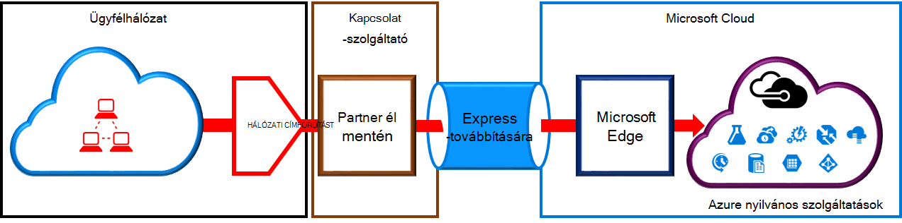
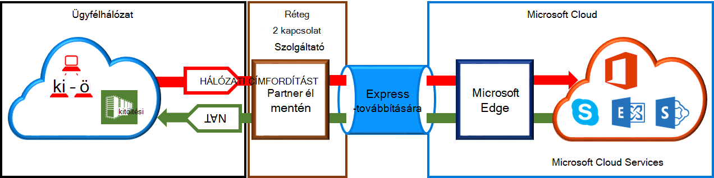

<properties
   pageTitle="Hálózati Címfordítást követelményei készült ExpressRoute áramkörök |} Microsoft Azure"
   description="Ez az oldal a részletes követelményeket beállításáról és kezeléséről a hálózati Címfordítást készült ExpressRoute áramkörök ismerteti."
   documentationCenter="na"
   services="expressroute"
   authors="cherylmc"
   manager="carmonm"
   editor=""/>
<tags
   ms.service="expressroute"
   ms.devlang="na"
   ms.topic="get-started-article"
   ms.tgt_pltfrm="na"
   ms.workload="infrastructure-services"
   ms.date="10/10/2016"
   ms.author="cherylmc"/>

# Készült ExpressRoute hálózati Címfordítást vonatkozó követelmények

A Microsoft-felhőszolgáltatások készült ExpressRoute használatával szeretne csatlakozni, kell beállítása és kezelése címfordító. Néhány kapcsolódási szolgáltatók beállítani és kezelni a hálózati Címfordítást felügyelt szolgáltatásként. Jelölje be a csatlakozási szolgáltatónál, ha ilyen szolgáltatás kínálnak megjelenítéséhez. Ha nem, akkor kell igazodjon az alábbiakban ismertetett követelményeknek. 

Tekintse át a áttekinti a különböző útválasztási tartományok [készült ExpressRoute áramkörök és útválasztási a tartományok](expressroute-circuit-peerings.md) lapon. Felel meg az Azure nyilvános és a Microsoft peering nyilvános IP cím követelményeknek, azt javasoljuk, hogy beállítása hálózati Címfordítást között a hálózat és a Microsoft. Ez a témakör részletes leírását a hálózati Címfordítást infrastruktúra, be kell állítania.

## Azure nyilvános peering hálózati Címfordítást követelményei

Azure nyilvános peering elérési lehetővé teszi, hogy csatlakozzon a nyilvános IP-címek fölé Azure-ban tárolt szolgáltatások. Ezek közé tartozik, [ExpessRoute – gyakori kérdések](expressroute-faqs.md) a listán szereplő szolgáltatások, és a Microsoft Azure ISV által üzemeltetett szolgáltatásokat. Microsoft Azure szolgáltatásaihoz nyilvános peering kapcsolódási mindig a Microsoft-hálózatba kezdeményezett a hálózatról. Nyilvános peering a Microsoft Azure szánt forgalom kell lennie SNATed érvényes nyilvános IPv4-címei, mielőtt belépnének a Microsoft network. Az alábbi ábrán biztosítja, hogy a hálózati Címfordítást sikerült beállítani legfeljebb magas szintű kép felel meg a fenti követelmény.

 

### Hálózati Címfordítást IP-készlet és az útvonal hirdetések

Győződjön meg arról, hogy a forgalom az Azure nyilvános peering elérési út érvényes nyilvános IPv4-címmel ír be. A Microsoft tudja a IPv4 hálózati Címfordítást cím készlet területi útválasztási Internet beállításjegyzék (RIR) vagy egy internetes útválasztási beállításjegyzék (a BMR) ellen tulajdonjogának ellenőrzése kell lennie. Ellenőrzés alatt álló peered az AS-számot és az IP-címek a címfordító használt alapján történik Keresse meg a [készült ExpressRoute útválasztási követelmények](expressroute-routing.md) lap útválasztási nyilvántartó olvashat.
 
Köre nincs korlátozva, kattintson a közzététel a peering keresztül hálózati Címfordítást IP előtag hosszát. Kell figyelni a hálózati Címfordítást készletre, és győződjön meg arról, hogy, nem a hálózati Címfordítást munkamenetek vannak függeszteni.

>[AZURE.IMPORTANT] A Microsoft Közzététel hálózati Címfordítást IP-készletre nincs kell közzététel az internethez. Ez más Microsoft-szolgáltatásokkal való kapcsolat megszakad.

## A Microsoft peering hálózati Címfordítást követelményei

A Microsoft peering path lehetővé teszi a Microsoft felhőszolgáltatásokhoz által nem támogatott a Azure nyilvános peering elérési útján csatlakozást. A szolgáltatások listáját az Office 365-szolgáltatásokkal, például az Exchange online-ban, a SharePoint online-ban, a Skype vállalati verzió és a CRM Online tartalmazza. A Microsoft várhatóan kétirányú kapcsolat támogatja a Microsoft peering. A Microsoft felhőszolgáltatásokhoz adatforgalmat kell lennie SNATed érvényes nyilvános IPv4-címei, mielőtt belépnének a Microsoft-hálózathoz. Megjelenik a hálózatomban adatforgalmat a hálózathoz a Microsoft cloud services SNATed kell lennie. Az alábbi ábrán a magas szintű képe hogyan a hálózati Címfordítást kell lennie, Microsoft peering beállítása biztosít.
 
 

#### A hálózat Microsoft szánt származó forgalom

- Győződjön meg arról, hogy forgalom ír be egy érvényes nyilvános IPv4-címmel Microsoft peering elérési. A Microsoft tudja érvényesíteni a tulajdonos, a területi útválasztási internet beállításjegyzék (RIR) vagy egy internetes útválasztási beállításjegyzék (a BMR) ellen IPv4 hálózati Címfordítást cím készlet kell lennie. Ellenőrzés alatt álló peered az AS-számot és az IP-címek a címfordító használt alapján történik Keresse meg a [készült ExpressRoute útválasztási követelmények](expressroute-routing.md) lap útválasztási nyilvántartó olvashat.

- Az Azure nyilvános peering telepítés és más készült ExpressRoute áramkörök használt IP-címek a BGP munkamenet keresztül nem kell a Microsoft Közzététel. Kattintson a közzététel a peering keresztül hálózati Címfordítást IP előtag hossza nincs korlátozás nem.

    >[AZURE.IMPORTANT] A Microsoft Közzététel hálózati Címfordítást IP-készletre nincs kell közzététel az internethez. Ez más Microsoft-szolgáltatásokkal való kapcsolat megszakad.

#### A hálózat szánt a Microsofttól származó forgalom

- Bizonyos esetekben a hálózaton belül is szolgáltatási végpontok kapcsolat kezdeményezése a Microsoft szükség. Egy tipikus példa az alkalmazási példát lenne a hálózaton, az Office 365-ben tárolt ADFS-kiszolgálók kapcsolatot. Ebben az esetben meg kell előfordulhat megfelelő prefixumokban a hálózatról a Microsoft peering be. 

- Meg kell SNAT adatforgalmat IP-címek a hálózaton belül a Microsoft. 

## Következő lépések

- [Útválasztás](expressroute-routing.md) és [QoS](expressroute-qos.md)vonatkozó követelmények vonatkoznak.
- Munkafolyamat információt című témakörben talál [készült ExpressRoute áramkör kiépítési munkafolyamatok és áramkör állapotát](expressroute-workflows.md).
- Állítsa be a készült ExpressRoute kapcsolatot.

    - [Készült ExpressRoute áramkör létrehozása](expressroute-howto-circuit-classic.md)
    - [Útválasztás konfigurálása](expressroute-howto-routing-classic.md)
    - [Hivatkozás egy VNet egy készült ExpressRoute áramkör](expressroute-howto-linkvnet-classic.md)

