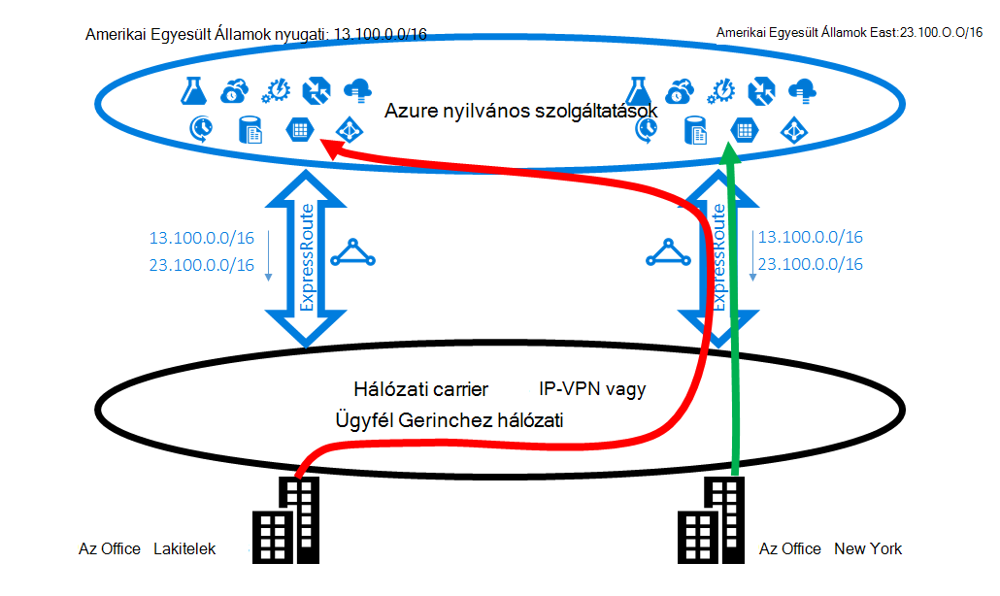
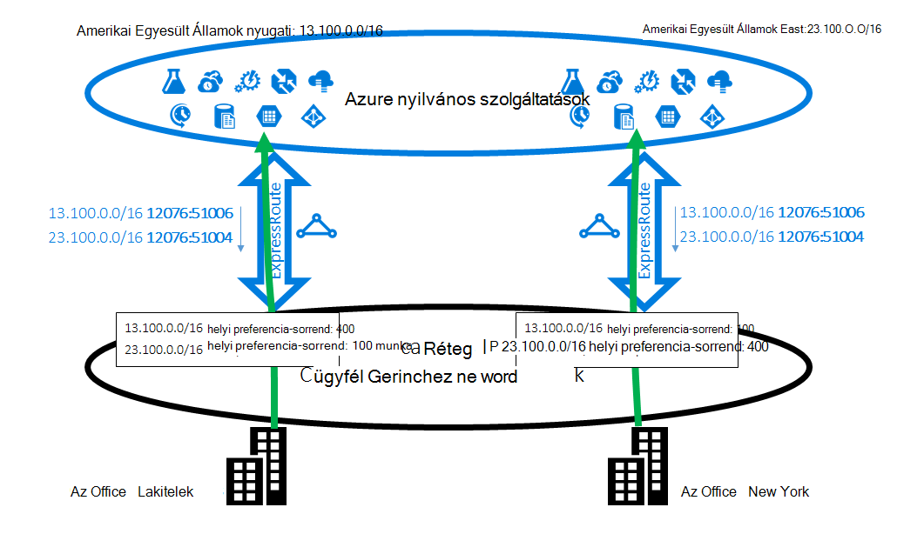
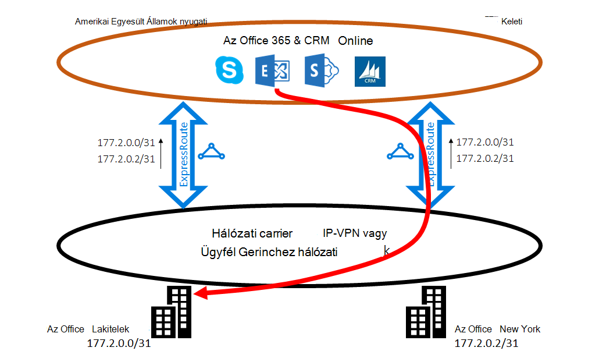
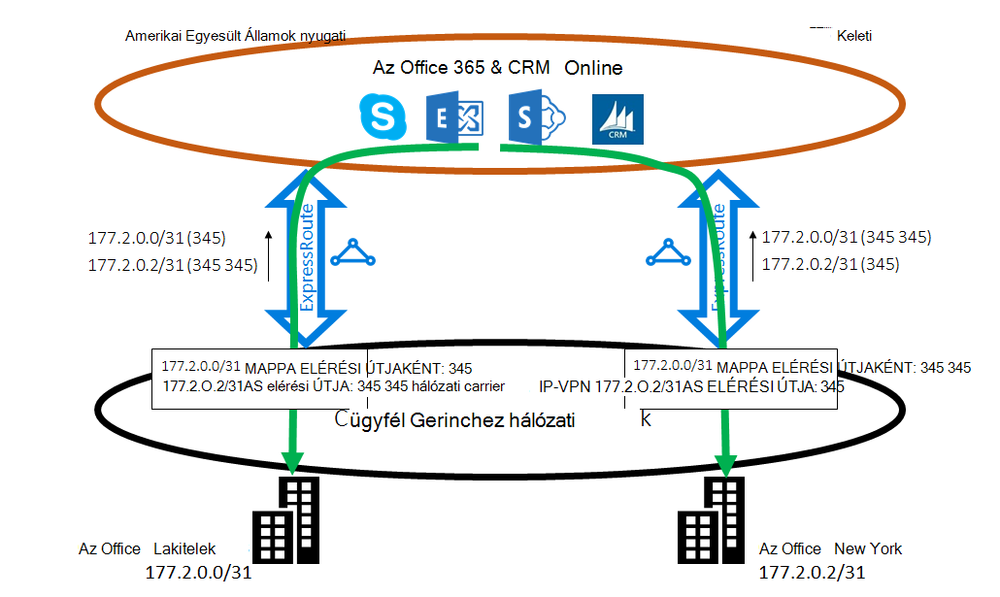

<properties
   pageTitle="Továbbítás készült ExpressRoute optimalizálhatja |} Microsoft Azure"
   description="Ezen az oldalon optimalizálásáról a továbbítás, amikor egy ügyfél több készült ExpressRoute áramkörök, amely a Microsoft és corp ügyfélhálózat közötti kapcsolat részletesen."
   documentationCenter="na"
   services="expressroute"
   authors="charwen"
   manager="carmonm"
   editor=""/>
<tags
   ms.service="expressroute"
   ms.devlang="na"
   ms.topic="get-started-article"
   ms.tgt_pltfrm="na"
   ms.workload="infrastructure-services"
   ms.date="10/10/2016"
   ms.author="charwen"/>

# Optimalizálás a továbbítás készült ExpressRoute
Ha több készült ExpressRoute áramkörök, ha egynél több elérési utat a Kapcsolódás a Microsoft. Eredményt adja optimálisnál továbbítása a következő esetekben fordulhat - ez azt jelenti, hogy a forgalmat is igénybe vehet egy hosszabb elérési elérje a Microsoft és a Microsoft a hálózathoz. Nagyobb a hálózati elérési utat, annál nagyobb késés. Késés közvetlen hatással van a teljesítmény és a felhasználói élmény alkalmazást. Ez a cikk bemutatják a probléma, és a bemutatják, hogy miként optimalizálhatja a továbbítás a szabványos útválasztási technológiákkal.

## Optimálisnál útválasztási esetben 1
Most tekintsünk át egy Bezárás útválasztási a probléma által egy példát. Tegyük fel, az Amerikai Egyesült Államokban, egy Lakitelek és egy, a New York két irodák van. A irodák össze, a egy nagytávolságú hálózati (WAN), amely a saját Gerinchez hálózati vagy a a szolgáltató IP VPN lehet. Ha két készült ExpressRoute áramkörök egy a Kapcsolatfelvételi nyugati és egy Kapcsolatfelvételi-Keleten, a WAN is csatlakoztatott. Természetesen van a Microsoft-hálózathoz való csatlakozáshoz két elérési útját. Most már Képzelje el, hogy az US nyugati és az US keleti Azure telepítési (például az Azure alkalmazás szolgáltatás). A szándékát is kapcsolhatja a felhasználókat a Lakitelek Azure US nyugati és a felhasználóknak az Azure US keleti New York, mert a szolgáltatás-rendszergazda meghirdetése, hogy a felhasználók az egyes office optimális élmény közeli Azure szolgáltatások elérése. Sajnos a terv működik jól a keleti coast felhasználónál, de nem a Dunántúl felhasználónál. A probléma oka a következők. Minden készült ExpressRoute áramkör azt helyüket Önnek az előtag az Azure US kelet (23.100.0.0/16) és az előtag az Azure US nyugati (13.100.0.0/16) is. Ha nem tudja, hogy melyik előtag van, melyik régióból, Ön nem tudja másképp kezeli. A WAN hálózat úgy a prefixumokban a közelebb az US nyugati US keleti, és ezért irányítja a mindkét office-felhasználóknak a készült ExpressRoute áramkör US-Keleten. A végén a Lakitelek office Szomorú sokan fog rendelkezni.

### Megoldás: használjon BGP Közösségek
-Történő optimalizálásához útválasztás mindkét office-felhasználóknak kell tudható, hogy melyik előtag az Azure US nyugati és amelyek az Azure US keleti. Ez az információ azt kódolása a [BGP közösségi](expressroute-routing.md)értékekkel. Azt a kiosztott BGP közösségi egyedi értéket minden Azure, például Kapcsolatfelvételi keleti "12076:51004", "12076:51006" US nyugati régió. Most, hogy tudja, hogy melyik előtag mely Azure régióból, állítsa be kell, hogy melyik készült ExpressRoute áramkör előnyben részesíteni. A BGP használatával exchange-útválasztási adatok, mert a BGP tartozó helyi preferencia befolyásoló útválasztás is használhatja. Ebben a példában rendelhet a Kapcsolatfelvételi nyugati mint US-Keleten 13.100.0.0/16 magasabb helyi preferencia értéket, és hasonlóan egy újabb helyi preferencia US-Keleten mint a Kapcsolatfelvételi nyugati 23.100.0.0/16. Ebben a konfigurációban fog győződjön meg arról, hogy mindkét javaslatot, és a Microsoft áll rendelkezésre, a felhasználóknak az Lakitelek megnyílik a készült ExpressRoute áramkör US nyugati Azure US nyugati csatlakozni, mivel a felhasználók a New York US keleti a készült ExpressRoute vennie Azure US keleti a. Továbbítás mindkét oldalon van optimalizálva. 

## Optimálisnál útválasztási eset 2
Íme egy másik példa, ahol a kapcsolatok, a Microsoft készítése hosszabb elérési útját a hálózat érhető el. Ebben az esetben használhatja a helyszíni Exchange-kiszolgálók és az Exchange Online [hibrid környezet](https://technet.microsoft.com/library/jj200581%28v=exchg.150%29.aspx). A irodák WAN kapcsolódik. A prefixumokban a helyszíni kiszolgálót, mind a két készült ExpressRoute áramkörök keresztül a Microsoftnak a irodák jelölik meg. Exchange online-ban kezdeményez kapcsolatok azokban az esetekben, például a postaládák áttelepítése a helyszíni kiszolgálókhoz. Sajnos a kapcsolatot a Lakitelek Office rendszer irányítja a készült ExpressRoute áramkör US-Keleten teljes ábrázoló hátulján bejárása a Dunántúl előtt. A probléma oka hasonlít az első egy. Anélkül, hogy minden olyan tipp a Microsoft network nem tudja megállapítani, melyik ügyfél előtag leginkább hasonlító US keleti és melyiket leginkább hasonlító US nyugati. Ez történik, válassza a nem megfelelő út a Lakitelek az Office.

### Megoldás: használja a prepending AS elérési út
Vannak a két megoldás a problémára. Az első szakasz, hogy a helyszíni előtag a Lakitelek Office, a 177.2.0.0/31 a készült ExpressRoute áramkör az US nyugati egyszerűen meghirdetése, és a helyszíni előtag a New York Office, a 177.2.0.2/31 a készült ExpressRoute áramkör US-Keleten. Emiatt nem csak egy elérési utat a Microsoft a irodák csatlakozhat. Nincs ellentmondás van, és a továbbítás optimalizálva. A tervezés, az kell figyelni a feladatátvevő vonatkozó stratégia. Abban az esetben, ha a Microsofttól készült ExpressRoute elérési útja hibás, győződjön meg arról, hogy az Exchange Online továbbra is csatlakozhat a helyszíni kiszolgálók szeretne. 

A második megoldás a így meghirdetése mindkettőt mindkét készült ExpressRoute áramkörök a előtagját továbbra is, és közölje velünk ezenkívül egy emlékeztetőt, mely az előtag a irodák melyikhez közelébe. Támogatjuk BGP AS elérési út prepending, mert az előtag AS elérési útját befolyásolhatja a továbbítás is beállíthatja. Ebben a példában az US keleti 172.2.0.0/31 AS elérési ÚTJÁT, hogy azt fogja inkább ezt az előtagot adatforgalmat (mint hálózatba fog gondolja, hogy az elérési útját ezt az előtagot a nyugati rövidebb) az US nyugati készült ExpressRoute áramkör növelheti meg. Hasonlóképpen meghosszabbíthatja a Kapcsolatfelvételi nyugati 172.2.0.2/31 AS elérési ÚTJÁT, hogy azt fogja inkább a készült ExpressRoute áramkör US-Keleten. Továbbítás mindkét irodák optimalizálva. A tervezés, az egyik készült ExpressRoute áramkör nem működik, ha az Exchange Online is elérhetik, egy másik készült ExpressRoute áramkör és a WAN. 

>[AZURE.IMPORTANT] Magánjellegű AS elérési ÚTJÁT a Microsoft Peering érkezett prefixumokban SZÁMKÉNT eltávolítása. Kell hozzáfűzése nyilvános AS ELÉRÉSI útját befolyásolhatja a Microsoft Peering útválasztás SZÁMKÉNT.

>[AZURE.IMPORTANT] Az itt megadott példák a Microsoft és nyilvános peerings, miközben a ugyanolyan lehetőségeket vonatkozó személyes peering támogatjuk. Az AS elérési prepending jól egy egyetlen készült ExpressRoute áramkör, befolyásolhatja a kijelölést ki az elsődleges és másodlagos elérési utak belül.
