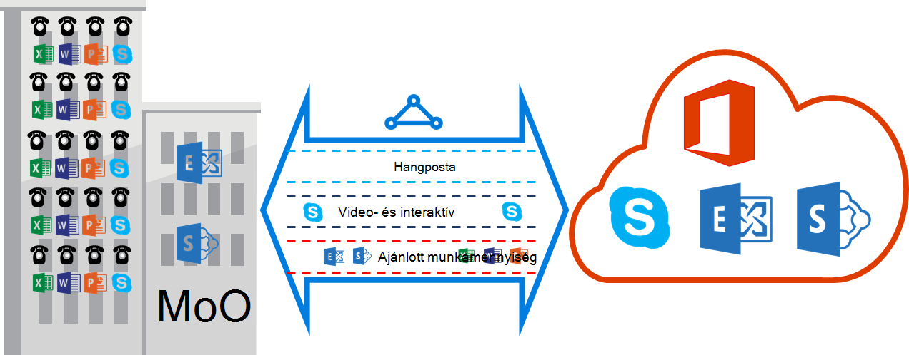

<properties
   pageTitle="Készült ExpressRoute QoS követelményei |} Microsoft Azure"
   description="Ez az oldal beállításáról és kezeléséről QoS készült ExpressRoute áramkörök részletes követelményeket ismerteti."
   documentationCenter="na"
   services="expressroute"
   authors="cherylmc"
   manager="carmonm"
   editor=""/>
<tags
   ms.service="expressroute"
   ms.devlang="na"
   ms.topic="get-started-article"
   ms.tgt_pltfrm="na"
   ms.workload="infrastructure-services"
   ms.date="10/10/2016"
   ms.author="cherylmc"/>

# Készült ExpressRoute QoS vonatkozó követelmények

A Skype vállalati verzió különböző munkaterhelésekből, hogy az eltérő QoS kezelés tartalmaz. Ha hangos szolgáltatásait készült ExpressRoute keresztül, a kell tartaniuk az alábbiakban ismertetett követelményeknek.

>[AZURE.NOTE] A Microsoft peering csak QoS követelmények vonatkoznak. A hálózati forgalmának engedélyezésére Azure nyilvános peering és magánjellegű Azure peering érkezett DSCP értékeit a program visszaállítja a 0. 

Az alábbi táblázat felsorolja DSCP jelölések használja a Skype vállalati verzió. Olvassa el [A Skype vállalati verzió minősége kezeléséről](https://technet.microsoft.com/library/gg405409.aspx) további információt.

| **Adatforgalom osztály** | **Kezelés (DSCP jelölés)** | **A Skype vállalati verzió Munkaterhelésekből** |
|---|---|---|
| **Hangposta** | EF (46) | A Skype / Lync-hanghívásaik |
| **Interaktív** | AF41 (34) | A videó |
|   | AF21 (A 18) | Alkalmazásmegosztás | 
| **Alapértelmezett** | AF11 (10) | Fájlátvitel|
|   | CS0 (0) | bármi egyéb| 

- Érdemes sorolják be a feladatok és a megfelelő DSCP értékeket megjelölni. Az útmutatást kövesse [az alábbi](https://technet.microsoft.com/library/gg405409.aspx) DSCP jelölések beállításáról a hálózaton.

- Állítsa be, és több QoS sorban várakozó támogatja a hálózaton belül. Hangposta kell egy önálló osztály és fogadása megadott RFC 3246 EF kezelése. 

- Eldöntheti, hogy a várólista mechanizmusa túlzsúfolt észlelési házirend és sávszélesség-terhelés per forgalom osztály. De a jelölése a Skype vállalati verzió munkaterhelésekből DSCP meg kell hagyni. A lista nem tartalmazza, DSCP jelölések használatakor pl. AF31 (26), akkor kell írniuk DSCP a 0 értéket a csomag elküldése a Microsoftnak előtt. A Microsoft csak elküldi a csomagokat, azokat a fenti táblázatban DSCP értékkel megjelölve. 

## Következő lépések

- [Útválasztás](expressroute-routing.md) és a [hálózati Címfordítást](expressroute-nat.md)vonatkozó követelmények vonatkoznak.
- A készült ExpressRoute kapcsolat konfigurálásához az alábbi helyeken találhat.

    - [Készült ExpressRoute áramkör létrehozása](expressroute-howto-circuit-classic.md)
    - [Útválasztás konfigurálása](expressroute-howto-routing-classic.md)
    - [Hivatkozás egy VNet egy készült ExpressRoute áramkör](expressroute-howto-linkvnet-classic.md)
