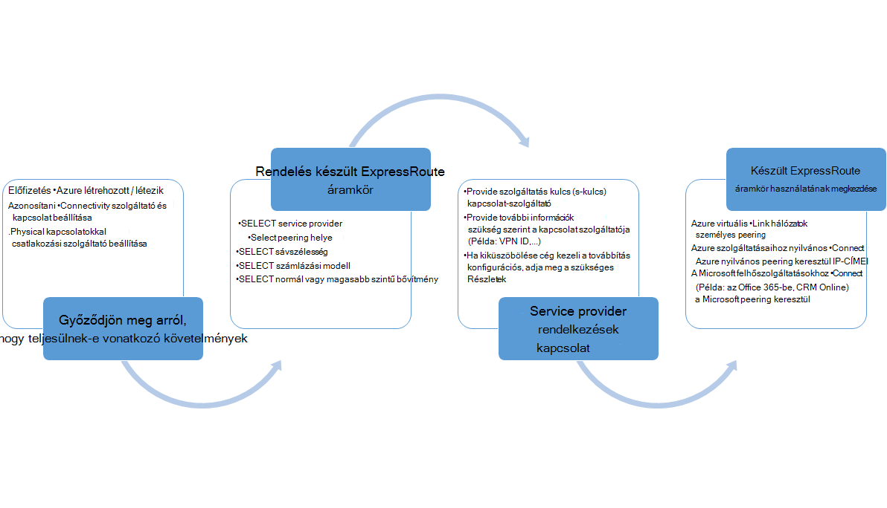
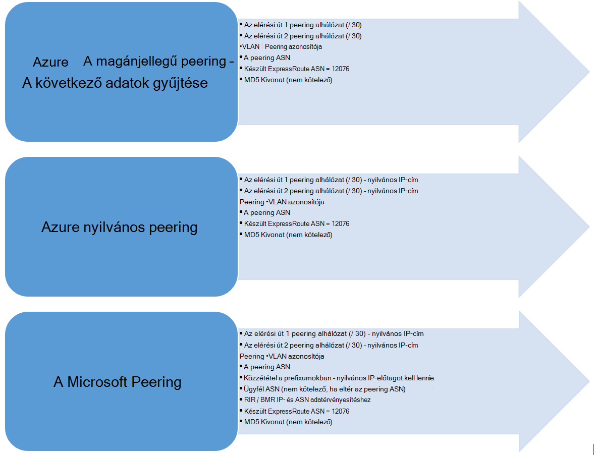

<properties
   pageTitle="Munkafolyamatok konfigurációs egy készült ExpressRoute áramkör |} Microsoft Azure"
   description="Ezen az oldalon végigvezeti a munkafolyamatok készült ExpressRoute áramkör és peerings konfigurálása"
   documentationCenter="na"
   services="expressroute"
   authors="cherylmc"
   manager="carmonm"
   editor="" />
<tags
   ms.service="expressroute"
   ms.devlang="na"
   ms.topic="article" 
   ms.tgt_pltfrm="na"
   ms.workload="infrastructure-services"
   ms.date="10/10/2016"
   ms.author="cherylmc"/>

# Kapcsolat létesítése és áramkör állapotát készült ExpressRoute munkafolyamatok

Ezen az oldalon végigvezeti a szolgáltatás kiépítési és a továbbítás munkafolyamatok konfigurációs magas szintű.

Az alábbi ábra és a megfelelő lépéseket a követniük kell ahhoz, hogy egy kiépítéstől készült ExpressRoute áramkör tevékenységek megjelenítése végpontok közötti. 

1. Állítsa be az készült ExpressRoute áramkör a PowerShell használatával. További információt a [létrehozása készült ExpressRoute áramkörök](expressroute-howto-circuit-classic.md) cikk útmutatását.

2. A szolgáltatót a kapcsolat sorrendben. Ez a folyamat változik. Lépjen kapcsolatba a kapcsolat szolgáltatója kapcsolódási rendezésének módját olvashat bővebben.

3. Győződjön meg arról, hogy a áramkör van kiépítve sikeresen tartománynál az állapot Powershellen keresztül kiépítési készült ExpressRoute áramkör szerint. 

4. Útválasztási tartományok beállítása. Ha a kapcsolat szolgáltatója kezeli Layer 3, azok fog útválasztás konfigurálása a kapcsolat. Ha a kapcsolat szolgáltatója kínál a réteg 2 szolgáltatások csak, meg kell adnia, használati irányelvek leírt [követelmények útválasztás](expressroute-routing.md) és [útválasztási beállításait](expressroute-howto-routing-classic.md) a oldalak útválasztás.

    -  A magánjellegű Azure peering engedélyezése – engedélyeznie kell a peering VMs kapcsolódni, és a felhőszolgáltatásokba virtuális hálózatok belül van telepítve.
    -  Azure nyilvános peering engedélyezése – engedélyeznie kell a Azure nyilvános peering Ha ki szeretne csatlakozni a nyilvános IP-címeket is Azure szolgáltatások. Ez az Azure erőforrások elérését, ha úgy döntött, ahhoz, hogy a magánjellegű Azure peering útválasztás alapértelmezett követelmény.
    -  Microsoft peering - engedélyezése, engedélyezze a hozzáférést Office 365-ben és a CRM online szolgáltatások. 
    
    >[AZURE.IMPORTANT] Győződjön meg arról, hogy külön proxykiszolgálót használ, és a Kapcsolódás a Microsoft mint meg él használata az internethez. Ugyanazon élére változatával készült ExpressRoute és az internetről is aszimmetrikus útválasztás okozhat, és a hálózati kapcsolat kimaradások okozó.

    

5. Virtuális hálózatok összekapcsolása készült ExpressRoute áramkörök – a virtuális hálózatok mutató hivatkozás a készült ExpressRoute áramkör. A kapcsolat kövesse utasításokat [VNets hivatkozni](expressroute-howto-linkvnet-arm.md) . Ezeket a VNets is lehetnek, mint a készült ExpressRoute áramkör ugyanabban az Azure előfizetésben, vagy egy másik előfizetést lehet.

## Készült ExpressRoute áramkör kiépítési államok

Minden készült ExpressRoute áramkör két állam foglalja magában:

- Service provider kiépítési állam
- Állapot

Állapota a Microsoft kiépítési állapotát jelöli. Ez a tulajdonság engedélyezve van állítva, egy készült Expressroute áramkör létrehozásakor

A kapcsolat szolgáltatója kiépítési állam a állapota a csatlakozási szolgáltató oldalán jelöli. *NotProvisioned*, *létesítése*vagy *Provisioned*kétféleképpen lehet. A készült ExpressRoute áramkör, hogy használni tudja Provisioned állapotban kell lennie.

### Egy készült ExpressRoute áramkör lehetséges állapotok

Ebben a szakaszban a lehetséges állapotok egy készült ExpressRoute áramkör, listája.

#### A létrehozás

A következő állapotú készült ExpressRoute áramkör, amint a PowerShell-parancsmag a készült ExpressRoute áramkör létrehozása futtatása jelenik meg.

    ServiceProviderProvisioningState : NotProvisioned
    Status                           : Enabled

#### A kapcsolat létesítése te000129565 kapcsolódási szolgáltató esetén

Ekkor megjelenik a készült ExpressRoute áramkör, a következő állapotban, amint a szolgáltatási kulcs átadni a kapcsolat szolgáltatója és a kiépítési folyamat kezdeni.

    ServiceProviderProvisioningState : Provisioning
    Status                           : Enabled

#### Ha a kapcsolat szolgáltatója befejeződött a kiépítési folyamat

A következő állapotú készült ExpressRoute áramkör, amint a kapcsolat szolgáltatója befejeződött a kiépítési folyamat jelenik meg.

    ServiceProviderProvisioningState : Provisioned
    Status                           : Enabled

Kiépítéstől és engedélyezve, hogy csak a kapcsolat állapotát szeretné használni, akkor lehet. Ha az egy réteg 2-szolgáltatóval használja, beállíthatja továbbítás a áramkör, csak akkor, amikor a állapotban van.

#### Ha a kapcsolat szolgáltatója van megszüntetés a áramkör

A szolgáltatót a készült ExpressRoute áramkör deprovision kérésére a áramkör, az alábbi állam állítsuk be a szolgáltató a deprovisioning folyamat befejezése után jelenik meg.

    ServiceProviderProvisioningState : NotProvisioned
    Status                           : Enabled

Megadhatja, hogy ismételt engedélyezése, ha szükséges, vagy futtassa a PowerShell-parancsmagok az áramkör törlése.  

>[AZURE.IMPORTANT] Ha a PowerShell-parancsmag a áramkör kiépítésekor a ServiceProviderProvisioningState van vagy a művelet sikertelen lesz Provisioned törlése. Kérje meg a csatlakozási szolgáltatójánál először deprovision a készült ExpressRoute áramkör, és törölje a a áramkör. A Microsoft továbbra is a számlázási a áramkör, amíg futtatja a PowerShell-parancsmag a kapcsolat törléséhez.

## Útválasztási munkamenet konfigurációs állapot

Az állapot kiépítési BGP lehetővé teszi, hogy ha a BGP munkamenet engedélyezve van a Microsoft edge. Az állapot szeretné használni, a peering engedélyezve kell lennie.

Fontos, különösen a Microsoft peering BGP munkamenet-állapot ellenőrzése. Mellett a kiépítési állam BGP nincs *nyilvános prefixumokban állam közzététel*nevű egy másik állam. A hirdetett nyilvános prefixumokban állam *konfigurált* állapotban is be kell a BGP munkamenet és a továbbítás végpontok közötti együttműködés kell lennie. 

Meghirdetett nyilvános előtag állam értéke *érvényességi szükséges* állapotát, a BGP munkamenet nincs engedélyezve, mint a hirdetett prefixumokban nem felelt meg a útválasztási nyilvántartó az AS-számot. 

>[AZURE.IMPORTANT] Ha hirdetett nyilvános prefixumokban állapotát a *kézi érvényességi* állapotban van, kell támogatási jegy nyissa meg [a Microsoft támogatási](https://portal.azure.com/?#blade/Microsoft_Azure_Support/HelpAndSupportBlade) és bizonyítsa, hogy Öné a IP-címek és a kapcsolódó önálló rendszer szám mentén közzététel.

## Következő lépések

- Állítsa be a készült ExpressRoute kapcsolatot.

    - [Készült ExpressRoute áramkör létrehozása](expressroute-howto-circuit-arm.md)
    - [Útválasztás konfigurálása](expressroute-howto-routing-arm.md)
    - [Hivatkozás egy VNet egy készült ExpressRoute áramkör](expressroute-howto-linkvnet-arm.md)
