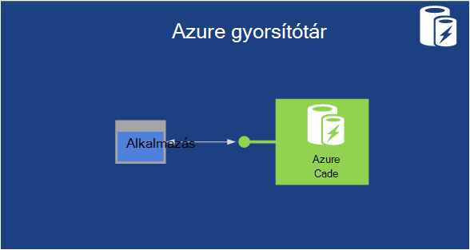

<properties
    pageTitle="Bevezetés a Microsoft Azure |} Microsoft Azure"
    description="Ismerkedés a Microsoft Azure? Egy egyszerű áttekintés a szolgáltatások is kínál, hogyan történik hasznos példákat."
    services=" "
    documentationCenter=".net"
    authors="rboucher"
    manager="carolz"
    editor=""/>

<tags
    ms.service="multiple"
    ms.workload="multiple"
    ms.tgt_pltfrm="na"
    ms.devlang="na"
    ms.topic="article"
    ms.date="06/30/2015"  
    ms.author="robb"/>

# Microsoft Azure bemutatása

Microsoft Azure szolgáltatás a Microsoft alkalmazás platform, a nyilvános felhő.  Ez a cikk az a célja, hogy ad a alap megértéséhez a kapcsolatos alapismeretekről: Azure, még akkor is, ha nem tudja, hogy semmit felhő számítások.

**Ez a cikk olvasása**

Azure mindig nő, egyszerűen első túlterhelt.  Indítsa el az egyszerű szolgáltatásaival, amely először a jelen cikkben felsorolt, és nyissa a további szolgáltatásokat. Ez nem jelenti azt, a további szolgáltatások önmagukban nem használható, de az Azure-ban futó alkalmazás alapszintű alkotó egyszerű szolgáltatások.

**Visszajelzés küldése**

Fontos a visszajelzését. Ez a cikk meg kell adnia Azure hatékony áttekintése. Ha nem, mondja el a Megjegyzések szakaszban az oldal alján. Adja meg a várt megjelenítéséhez, és hogyan javítható a cikk néhány részlet.  

## Azure összetevői

Azure szolgáltatások csoportosítja az adatkezelési portálon, majd a különböző Szemléltetőelemek, például a [Mire van Azure Infographic](https://azure.microsoft.com/documentation/infographics/azure/) kategóriákat. Az adatkezelési portál kezeléséhez használja a legtöbb (de nem az összes) szolgáltatások Azure-ban.

Ez a cikk használja egy **másik szervezet** beszélni hasonló függvényekkel szolgáltatások és fontos alszint szolgáltatások, melyeket nagyobb részét képező feliratozni.  

   
 *Ábra: Azure az Azure adatközpont esetén futó Internet elérhető alkalmazásszolgáltatások biztosít.*

## Adatkezelési portál
Azure nevű az [Adatkezelési portál](http://manage.windowsazure.com) eléréséhez és felügyeletéhez leggyakrabban a rendszergazdák, de nem az összes Azure szolgáltatások webes felületet tartalmaz.  A Microsoft általában elengedi az új felhasználói felület portált béta előtt használatból történő egy régebbi használ. Újabb azzal a ["Azure előzetes portál"](https://portal.azure.com/)nevezik.

A szokásos egy hosszú átfedés van aktív mindkét portálokról esetén. Core services a mindkét portálokról fog megjelenni, miközben nem minden funkció elérhető mind lehet. Újabb szolgáltatások jelenik meg az újabb portál első és a régebbi szolgáltatások és funkciók csak a régebbi egy előfordulhat, hogy megtalálható.  Az üzenet itt, ha nem talál valamit, amit a régebbi portálon, jelölje be az újabb egy és fordítva.

## Számítási

Az a felhő platform jelent legalapvetőbb dolgot egyik alkalmazások végrehajtása. Az Azure számítási modellek mindegyikének saját szerepkör lejátszása.

Ezek a technológiák külön-külön használhatja, de az alkalmazáshoz a megfelelő foundation létrehozásához szükség szerint összekapcsolásukkal. A kiválasztott függ, hogy milyen hibák megközelítés megkísérli megoldásában.

### Azure virtuális gépeken futó

   
*Ábra: Azure virtuális gépeken futó lehetővé teszi a felhőben virtuális gép példányok teljes hozzáféréssel.*

Az azt jelenti, hogy igény szerint, hozzon létre egy virtuális gép egy szokásos képet ábrázoló vagy egy ad meg, hogy nagyon hasznos lehet. Ezt a megközelítést nevükön infrastruktúra szolgáltatásként (IaaS), az Azure virtuális gépeken futó biztosít. Ábra 2 mutatja egy virtuális gép (virtuális) működésének kombinációi, és hogyan hozhat létre egy virtuális egyet.  

Hozzon létre egy virtuális, mely virtuális és a virtuális méret adja meg.  Kattintson a virtuális futtató alkalommal fizet. Fizet perc, és csak akkor futása közben, és bár a rendelkezésre álló virtuális megőrzési minimális tároló díjat. Azure kínál árfolyam VHD (más néven "képek") tartalmazó indítható operációs rendszerű kiinduláshoz gyűjteménye. Ezek közé tartozik a Microsoft és partner beállításokat, például a Windows Server és Linux, SQL Server, Oracle és sok egyebet. Szabadon VHD és a képek létrehozni, és töltse őket saját magának. Töltse fel a csak az adatokat tartalmazó, és ezután érhetők el a futó VMs VHD is.

A virtuális származik, ahol tárolhatja végrehajtott módosítások egy virtuális futása közben folyamatosan. A következő alkalommal, amikor egy virtuális hoz létre, hogy a virtuális dolog, amit elhozatala hol hagyta abba. A VHD, amely a virtuális gépeken futó biztonsági tároló Azure BLOB, amely megvitatjuk, később tárolja.  Ez azt jelenti, hogy annak érdekében, hogy a VMs hardver- és hibák miatt nem eltűnik a redundancia kap. Ajánlatos is másolja a módosított virtuális Azure ki, majd a helyben futtatni.

Az alkalmazás belül egy vagy több virtuális gépeken futó, attól függően, hogy hogyan előtt létrehozta, vagy úgy dönt, hogy létrehozza az alapoktól most fut.

Általános eljárás cloud számítások számos különböző problémák megoldására használható.

**Virtuális gép felhasználási területei**

1.  **A fejlesztői/próba** - használhatja őket hozzon létre egy olcsó fejlesztés és próba platform, amely után leállíthatja használat gombra. Előfordulhat, hogy hozzon létre, és bármilyen nyelvek és a tárak, amely tetszik használó alkalmazások futtatásához. Az alkalmazások Azure biztosít, és úgy is dönt, hogy az SQL Server vagy egy másik adatbázis-kezelő egy vagy több virtuális gépeken futó operációs rendszert futtató adatok adatkezelési beállítások bármelyikét használhatja.
2.  **Azure (felvonó-és-shift) áthelyezése alkalmazások** – "Felvonó-és-eltolási" hivatkozik sokkal áthelyezése az alkalmazást, például egy targonca használható egy nagy objektum áthelyezése  "Emelje fel a" a virtuális a helyi adatközponthoz a és a "váltás" azt Azure és ott indítsa el.  A szokásos néhány más rendszereken függések eltávolítása munkavégzés lesz. Ha túl sok, előfordulhat, hogy a beállítással 3 helyett.  
3.  **A adatközponthoz meghosszabbítása** - használata Azure VMs a helyszíni adatközponthoz meghosszabbítása SharePoint vagy a többi alkalmazást futtató. Támogatásához Windows tartományok létrehozása a felhőben Azure VMs Active Directory futtatásával. Azure virtuális hálózati (említett később) segítségével a helyi hálózat és a hálózat Azure-ban kötik össze.

### Web Apps alkalmazások

   
 *Ábra: Azure Web Apps alkalmazást futtat, a webhely a felhőben anélkül, hogy az érintett webkiszolgálóra kezelése.*

Webhelyek és webalkalmazások fut a leggyakoribb dolgot, végezze el a felhasználók a felhőben. Azure virtuális gépeken futó lehetővé teszi, de továbbra is hagyja meg egy vagy több VMs és az alapul szolgáló operációs rendszerek felügyelete a felelős. Felhőalapú szolgáltatások webes szerepkörök ehhez, de telepítésével és fenntartása őket továbbra is megnyitja a rendszergazdai feladatok.  Mi történik, ha csak kívánt webhelye Ha valaki másnak a felügyeleti munkát igényelnek Öntől gondoskodik?

Az pontosan Web Apps alkalmazások biztosít. A számítási modell kínál az Azure kezelőportálja, valamint a API-k használata a felügyelt webes környezetben is használhatók. Egy létező webhely alkalmazás áthelyezése Web Apps alkalmazások nem változik, vagy létrehozhat egy új közvetlenül a felhőben. Ha egy webhely fut, hozzáadása, vagy példányok dinamikusan, eltávolítása használna Azure Web Apps alkalmazások egyenleg kérések betöltése át őket. Azure alkalmazások egy megosztott lehetőséget, ha a webhely más webhelyek virtuális gépen fut, és a normál beállítás, amely lehetővé teszi, hogy a webhely saját virtuális futhat is kínál. A normál lehetőséget is lehetővé teszi a példányok (számítások a power) méretét növelheti, ha szükséges.

Fejlesztési Web Apps alkalmazások relációs tároló .NET, PHP, Node.js, Java és SQL-adatbázis és MySQL (a ClearDB, a Microsoft partner) Python támogatja. Beépített támogatás számos népszerű alkalmazások, például WordPress, Joomla és Drupal is tartalmaz. A cél, a Min költség méretezhető és szélesebb körben hasznos platformot biztosítanak webhelyekre és webalkalmazások létrehozása a nyilvános felhőben.

**Web Apps alkalmazások felhasználási területei**

Web Apps alkalmazások íródott vállalatok, a fejlesztők és a webes Tervező irodák hasznos lehet. Űrlapok megfeleljenek a vállalatok célszerű a jelenléti webhelyek futó egy könnyen kezelhető, méretezhető, nagyon biztonságos és könnyen hozzáférhető megoldás. Amikor, be kell állítania egy webhelyen, célszerű Azure Web Apps alkalmazások használata, és folytathatja a Felhőszolgáltatások, ha szüksége van egy funkció, amely nem érhető el. További hivatkozások, amelyek segíthetnek a válasszon a lehetőségek közül a "Számítási" szakasz végén megtekinthet.

### Cloud Services
   
*Ábra: Azure Cloud Services, a szolgáltatás (PaaS) környezet platformon erősen méretezhető egyéni kód futtatásához helyet biztosít*

Tegyük fel, hogy szeretne létrehozni a felhőben alkalmazások, amelyek támogatják a rengeteg egyidejű felhasználója, használatához nincs szükség, hogy mennyi felügyeleti, és soha nem megszakad. Előfordulhat, hogy egy elfogadott szoftverének a szállítójával, például, hogy úgy döntött, szoftver kibővül szolgáltatásként (szoftver) szerint épület-verziót egy, az alkalmazás a felhőben. Vagy lehet, hogy a várt fognak nőni gyors fogyasztóvédelmi-alkalmazás létrehozása egy indítási. Ha a Azure szeretne összeállítani, mely végrehajtási modellt, kell használniuk?

Vannak bizonyos korlátozások, azonban Azure Web Apps lehetővé teszi, hogy ez a fajta webalkalmazás létrehozása. Rendszergazdai hozzáférés, például, ami azt jelenti, hogy tetszőleges szoftver telepítése nem nincs. Azure virtuális gépeken futó lépve rugalmasság érdekében hozzáféréssel, köztük sok és bizonyára felhasználhatja azt egy nagyon méretezhető alkalmazás létrehozására, de megbízhatósága és felügyeleti számos tulajdonságát kezelheti saját maga is. Mit szeretne lehetőség, hogy a szabályozható kell, de is képes nagy része a megbízhatóság és felügyeleti szükséges munkamennyiség.

Az pontosan mi Azure Cloud Services által biztosított. Ezt a technológiát lett tervezve kifejezetten méretezhető, megbízható támogatja, és alacsony-admin alkalmazást, és milyen gyakran hívta Platform szolgáltatásként (PaaS) példa. Ahhoz, hogy használhassa, úgy dönt, például a C#, Java, PHP, Python, Node.js vagy mást technológiával alkalmazás létrehozása. A kód végrehajtja a virtuális gépeken futó (néven példányok) a Windows Server verziójában.

De ezek VMs eltérnek a hoz létre az Azure virtuális gépeken futó szerint a lehetőségekből. A egyvalamihez Azure maga kezeli a őket módon összetevőjét, például a operációs rendszer javítások telepítése, és automatikusan helyezése új javítással képek. Ez azt jelenti, hogy az alkalmazás kerülni a Webhelyfiókok állapotban az interneten vagy dolgozó szerepkör-példányok; Ehelyett őrizze az egyik az Azure adatok-kezelési funkcióiról, a következő szakaszban leírt módon. Azure is figyeli ezek VMs újraindítását minden adott fail. Beállíthatja, hogy automatikusan létrehozása több vagy kevesebb példányok igény szerinti válaszként felhőszolgáltatások. Lehetővé teszi, hogy nagyobb használatát kezelje, és kattintson a vissza, így Ön nem tart havi fizetési annyi kevesebb használatát esetén méretezze.

Két szerepkörök választhat, amikor hoz létre egy példánya van, mind a Windows Server alapján. Fő a kettő közötti különbség, hogy egy webes szerepkör egy példánya fut-e a IIS, miközben egy példányának dolgozó szerepkörbe nem. Mindkét megegyező módon kezelhetők és azonban gyakran is használja az alkalmazás. Például egy webes szerepkör-példány előfordulhat, hogy a felhasználó-összehívások, majd adja át őket egy feldolgozás dolgozó szerepkör-példányt. Ha az alkalmazás felfelé vagy lefelé, kérheti, hogy az Azure létrehozása vagy szerepkör további előfordulásait, vagy állítsa le a meglévő példányokat. És hasonló Azure virtuális gépeken futó, akkor esetén csak az előfizetést az idő, hogy fut-e az egyes webes vagy dolgozó szerepkör-példány.

**Cloud Services-esetek**

Cloud Services ideálisak a támogatási tömeges méreteket meg, ha kell több szabályozási lehetőséget biztosít a platform, mint az Azure Web Apps alkalmazások által biztosított, de nincs szükség az alapul szolgáló operációs rendszer szabályozható.

#### A számítási modell kiválasztása
Az oldal [Azure Web Apps alkalmazások, a Felhőszolgáltatások és a virtuális gépeken futó összehasonlító](./app-service-web/choose-web-site-cloud-service-vm.md) ez részletes tudnivalókat választhatja ki a számítási modell ismerteti.

## Adatok kezelése

Alkalmazások szükséges adatokat, és a különböző típusú alkalmazások szükséges különböző típusú. Emiatt Azure itt többféle módszert tárolhatják és kezelhetik az adatokat. Azure sok tárterület-lehetőségeket is biztosít, de nagyon tartós tároló készült összes.  Az alábbi lehetőségek bármelyikét állnak mindig az adatok szinkronizálja végig az Azure adatközponthoz Ha engedélyezi a redundancia geo segítségével biztonsági másolatot készíthet egy másik adatközponthoz legalább 300 mérföld nem vagyok a gépnél Azure 6 3 másolatát.     

### Virtuális gépeken futó
Az azt jelenti, hogy egy virtuális készült Azure virtuális gépeken futó SQL Server vagy egy másik adatbázis-kezelő futtatása már imént említett. Látja, hogy ez a beállítás nem korlátozódik relációs rendszerek; is szabadon NoSQL technológiák, például MongoDB és Cassandra futtatásához. A saját adatbázis rendszer fut nem túl bonyolult feladat informatikai ismétlések azt saját adatközpont esetén használt esetén – azonban is, hogy az adatbázis-kezelő felügyeleti kezelése.  A többi beállítással a Azure több vagy minden meg a felügyelet kezeli.

Ismét a virtuális gép és bármilyen további adatokat lemez hoz létre, vagy töltse fel állapotát is szeretne biztonsági másolatot blob-tárolóhoz (amely megvitatjuk, később) szerint.  

### Azure SQL-adatbázis
   

*Ábra: Azure SQL-adatbázis szolgáltatást biztosít, olyan felügyelt relációs adatbázisból a felhőben.*

Azure relációs tárolására, a szolgáltatás SQL-adatbázis biztosít. Ne legyen becsapni Önt elnevezési. Az ugyanaz, mint az SQL Server fölött a Windows Server operációs rendszert futtató által biztosított tipikus SQL-adatbázishoz.  

Korábbi néven SQL Azure, Azure SQL-adatbázis itt az összes egy relációs adatbázis-kezelő rendszer, atomi tranzakciók, például adatok integritását, ANSI SQL-lekérdezések és a már jól ismert programozási modell több felhasználó egyidejű adathozzáférés fontosabb funkciói. SQL Server, az SQL-adatbázis entitás keretrendszer használatával is elérhető, mint ADO.NET, JDBC és más már jól ismert adat-hozzáférési technológiákkal. A T-SQL nyelvben nyelvét, SQL Server-eszközök, például SQL Server Management Studio együtt a legtöbb is támogat. Bárki, az SQL Server (vagy más relációs adatbázisból) ismerős SQL-adatbázis használata nem túl bonyolult feladat.

SQL-adatbázis nem csak, de az a felhő informatikai egy adatbázis-kezelő adatait a PaaS szolgáltatás. Azt is szabályozhatja az adatok, és ki férhet, de a felügyeleti grunt munkát, például a hardver infrastruktúra kezelésével, és automatikusan az adatbázis és az operációs rendszer szoftver naprakészen tartása SQL-adatbázis gondoskodik. SQL-adatbázis magas színvonalú elérhetőséget is biztosít, automatikus biztonsági mentést, a pont és az idő funkciók visszaállítása, hogy bizonyos másolatok földrajzi régiók keresztül.  

**SQL-adatbázis felhasználási területei**

Ha az Azure alkalmazás (bármely számítási modellek) relációs tároló igénylő készít, az SQL-adatbázis lehet jó lehetőséget. Az a felhő kívüli futó alkalmazások is használhatja ezt a szolgáltatást, azonban így más esetben rengeteg. Ha például SQL-adatbázisban tárolt adatok webböngészőn keresztül elérhetők másik ügyfél rendszerek, többek között az asztali számítógépek, laptopra, táblagépen és telefonok. És replikációs beépített magas elérhetősége biztosít, mert az SQL-adatbázis használata csökkentheti a legrövidebb leállás.

### Táblák
  

*Ábra: Azure táblák biztosítja az egyszerű, strukturálatlan NoSQL adatok tárolására.*

Ez a funkció részeként vele egy nagyobb szolgáltatást, úgynevezett "Azure tároló" nevezik különféle feltételeit. Ha megjelenik a "Táblázatok", "Azure táblázatok" vagy "tároló", célszerű a célt szolgálja.  

Nem lehet zavarosnak tűnik a nevét, és: ezt a technológiát relációs tároló nem nyújt. Erre valójában azt képen egy kulcsot/érték store nevű NoSQL megközelítés. Azure táblák tárolni a különböző típusú, például a karakterláncok, egész számok és dátumok tulajdonságok alkalmazás segítségével. Az alkalmazások majd meghallgathatja csoport tulajdonságok csoporthoz tartozó egyedi kulcs megadásával. Összetett műveletek során illesztések nem támogatottak, például táblázatokat ajánlja fel a beírt adatok gyors hozzáférést. Is legyenek annyit, amennyit egy adjon az adatok tárolására képes egyetlen táblázattal nagyon méretezhető. És az egyszerűség kedvéért egyező, táblák általában kevésbé drága használni, mint az SQL-adatbázis relációs tároló.

**Táblák felhasználási területei**

Tegyük fel, hogy létre szeretne hozni egy Azure-alkalmazást, gyors hozzáférést igénylő esetleg beírt adatokat, hogy rengeteg, de nem kell végrehajtani összetett SQL lekérdezésekkel az adatok. Tegyük fel, hogy egy kell tárolni a felhasználói profil adatait minden felhasználó számára, hogy a fogyasztói alkalmazás készít. Az alkalmazás nagyon népszerű lesz, így akkor engedélyeznie kell az adatokat számos, de Ön nem nem sok túl tárolja, az adatokkal majd beolvasása közben egyszerű módszer. Ez a forgatókönyv, ahol Azure táblák értelemszerű pontosan milyen típusú.

### BLOB
    
*Ábra: A Azure BLOB strukturálatlan bináris adatokat tartalmaz.*  

Azure BLOB-(ismét a "Blob-tárolóhoz" és "Tároló BLOB" csak azok a célt szolgálja) strukturálatlan bináris adatok tárolására szolgál. Táblázatok, például BLOB olcsó tárolására szolgál, és lehet, hogy egyetlen blob akkora, mint 1TB (egy terabájt is lehet). Azure alkalmazások Azure meghajtók, amelyekkel állandó tároló nyújt a Windows fájlrendszerben Azure példány csatlakoztatott BLOB is használhatja. Az alkalmazás közönséges Windows fájlok látja, de tartalmát blob ténylegesen tárolja.

BLOB-tárolóhoz számos más Azure funkciók használják (például a virtuális gépeken futó), így akkor bizonyára kezelheti a munkaterhelésekből túl.

**BLOB-esetek**

Az alkalmazások videók, nagy fájlok és egyéb bináris adatokat tároló BLOB használható egyszerű, olcsó tároló. Például a tartalom kézbesítési hálózat, amely fog megvitatjuk, később más szolgáltatásokkal együtt is gyakran használt BLOB.  

### Importálás / exportálás
  

*Ábra: Azure Importálás / Exportálás lehetőséget nyújt az Azure gyorsabb és olcsóbb tömeges-adatok importálása vagy exportálása egy fizikai merevlemez-meghajtó szállítandó.*  

Előfordul, hogy áthelyezni kívánt az adatokat az Azure. Amely tenné sokáig tart, talán nap, majd a sávszélesség sok használ. Ezekben az esetekben Azure importálás/exportálás, amely lehetővé teszi, hogy kiszállítása Bitlocker titkosított 3.5-ös "SATA merevlemez-meghajtók közvetlenül az Azure adatközpontokban, ahol a Microsoft fogja át az adatokat blob-tárolóhoz meg is használhatja.  A feltöltés után a Microsoft alkalmazásban a meghajtók vissza szeretné.  Nagy mennyiségű adatot származó Blob-tárolóhoz alakzatot merevlemez-meghajtók exportált és vissza szeretné kapni mail keresztül is kérhet.

**Esetek az importálás / exportálás**

- **Nagy adatok áttelepítése** – bármikor nagy mennyiségű adatot (terabájt) Azure feltölteni kívánt van, az importálás/exportálás szolgáltatás nagyon gyakran gyorsabb és talán olcsóbbak átvitele az interneten keresztül. Miután az adatokat a BLOB, például táblatároló vagy SQL-adatbázis más űrlapba is feldolgozása.

- **Adatok helyreállítása archivált** – importálás/exportálás használhatja, hogy a Microsoft átadás nagy mennyiségű adatot tárolt Azure Blob-tárolóhoz tárolóeszközre küldött és majd van, hogy az eszköz sikeresen kézbesítve lett a kívánt helyre. Mivel ez némi időt vehet igénybe, még nem vészhelyreállítás jó lehetőséget. Célszerű az archivált adatok gyors eléréséhez nem szükséges.

### Fájl szolgáltatás
    
*Ábra: Azure fájl szolgáltatásokat nyújt a kis-és Középvállalatok \\ \\a felhőben futó alkalmazások server\share elérési útját.*

A helyszíni gyakori nagy mennyiségű fájlt tároló kiszolgáló üzenet letiltása (kis-és Középvállalatok) protokoll használatával keresztül érhető el kell egy \\ \\Server\share formátum. Azure ekkor megjelenik a szolgáltatás, amely lehetővé teszi a protokoll használatát a felhőben. Azure-ban futó alkalmazások felhasználhatja közötti VMs már jól ismert fájlrendszer például ReadFile és WriteFile API-k használata a fájlok megosztására. Ezenkívül a fájlokat is elérhető többi felhasználói felülete, amely lehetővé teszi a megosztás a helyszíni is beállításakor virtuális hálózaton keresztül egy időben. Azure fájlok épül a blob-szolgáltatás fölött, az azonos elérhetősége, tartóssági, méretezhetőség és Azure tároló épített geo redundancia örökli.

**Azure fájlok felhasználási területei**

- **Meglévő alkalmazások áttelepítése a felhőbe** – annak könnyebben áttelepítése a helyszíni a felhőbe, az alkalmazás részei között adatokat osszanak fájlmegosztások használó alkalmazások. Minden egyes virtuális csatlakozik a fájlmegosztás, és kattintson rá olvasása és írása fájlokat ugyanúgy, mint azt ellen egy helyszíni fájl megosztásához.

- **Megosztott alkalmazás beállítások** – gyakori mintájának elosztott alkalmazások, hogy konfigurációs fájl egy központi helyen, ahol azok webböngészőn keresztül elérhetők számos különböző virtuális gépeken futó. A konfigurációs fájlok egy Azure fájlmegosztás tárolja, és az összes szolgáltatásalkalmazás-példányok értelmezése. A beállítások is kezelhetők a többi felülettel, amely lehetővé teszi, hogy a konfigurációs fájl világszerte hozzáférést keresztül.

- **Diagnosztikai megosztása** - mentheti, például a naplókat, mértékek és összeomlik kiírása diagnosztikai fájlokat megosztani. Ezeket a fájlokat a kis-és Középvállalatok és a többi kapcsolaton keresztül érhető el lehetővé, hogy feldolgozása, és a diagnosztikai adatok elemzése elemzőeszközök számos használható alkalmazások.

- **Fejlesztői/próba/hibakeresési** – Ha fejlesztők és a rendszergazdák dolgoznak virtuális gépeken futó a felhőben, gyakran szükséges eszközök és segédprogramok csoportja. Telepítése és terjesztése e segédprogramok a virtuális gépeken sok időt vesz igénybe. Azure fájlokkal egy fejlesztő vagy a rendszergazda tárolhatja a kedvenc eszközök fájlmegosztáson vagy bármely virtuális gépről csatlakozhat hozzájuk.

## Hálózati

Azure fut ma húzza szét a világszerte sok adatközpontokkal. Alkalmazás futtatása és adatok tárolására, ezek adatközpontokkal használandó közül választhat. Az alábbi adatközpontokkal a az alábbi szolgáltatások használata többféle módon is lehet csatlakozni.

### Virtuális hálózati
   

*Ábra: Virtuális hálózatok tartalmaz, a felhőben magánhálózat így különböző szolgáltatásokat is beszélhet az egymással, vagy a helyszíni erőforrásokra mutató Ha úgy állítja be a VPN határokon helyszíni kapcsolat.*  

Egy hasznos használata nyilvános felhő módja tekinti meg a saját adatközponthoz kiterjesztését.

VMs igény hozhat létre, mert eltávolíthatja őket (és fizetésre leállítása) azokat a esetén már nincs rájuk szükség, csak akkor, ha azt szeretné, hogy számítások a power is. És Azure virtuális gépeken futó segítségével VMs SharePoint, az Active Directory és más már jól ismert helyszíni szoftver fut, mivel ez a módszer is dolgozhat az alkalmazásokat, akkor már van.

Ahhoz, hogy ez nagyon hasznos, azonban a felhasználók kellene engedélyezni szeretné kezelni ezeket az alkalmazásokat, mintha a saját adatközpontban futnak. Az pontosan mi az Azure virtuális hálózati lehetővé teszi. Virtuális Magánhálózati átjáró eszközt használ, a rendszergazda beállíthatja virtuális magánhálózat (VPN) a helyi hálózat és a VMs az Azure virtuális hálózathoz telepített között. Saját IP-4-es címek hozzárendelése az a felhő VMs, mert azok jelennek meg a saját hálózaton. A szervezet felhasználói hozzáférhetnek a az alkalmazások ezeket VMs tartalmaz, mintha a helyi meghajtóra voltak futnak.

Tervezése és létrehozása egy virtuális hálózati legmegfelelőbben kapcsolatos további tudnivalókért olvassa el a [Virtuális hálózati](./virtual-network/virtual-networks-overview.md)című témakört.

### Express-továbbítására

   

*Ábra: Készült ExpressRoute az Azure virtuális hálózatot használ, de keresztüli nyilvános internetkapcsolat helyett gyorsabb dedikált vonalak kapcsolatok irányítja.*  

Ha több sávszélesség vagy biztonságos, mint egy Azure virtuális hálózati kapcsolat tartalmaznak, megtekintheti, készült ExpressRoute be. Egyes esetekben készült ExpressRoute is mentheti, pénzt. Továbbra is szüksége lesz az Azure virtuális hálózatot, de az Azure és a webhely között a hivatkozást, amely nem megy nyilvános internetes dedikált kapcsolatot használ. Ez a szolgáltatás használatához, meg kell megállapodást a szolgáltató, vagy egy exchange-szolgáltatóval.

Beállítását egy készült ExpressRoute kapcsolatot igényel több időt és a tervezés, ezért érdemes lehet virtuális magánhálózattal webhelyre, majd egy készült ExpressRoute kapcsolat áttelepítése.

További információt a készült ExpressRoute [Készült ExpressRoute technikai áttekintése](./expressroute/expressroute-introduction.md)című témakörben találhat.

### Adatforgalom Manager

   

*Ábra: Azure forgalom Manager teszi lehetővé az intelligens szabályokon alapuló szolgáltatás globális forgalmat.*

Ha több adatközpont esetén az Azure alkalmazás fut, a Azure forgalom Manager és felhasználók érkező kérések ezután irányítja át az alkalmazás példányát is használhatja. Szolgáltatások nem fut Azure-ban, feltéve, hogy azok megjelennének az internetről is irányítja a forgalmat.  

Az Azure alkalmazások, csak egy részét a világ-felhasználókkal csak egy Azure adatközpontban működni. A világon szórt felhasználókkal céljával azonban nem szívesen a Futtatás több adatközpont esetén, esetleg akár az összeset. Ez a második helyzet, a probléma arcra: hogyan hajtsa végre, ezután helyével szolgáltatásalkalmazás-példányok? Legtöbbször, valószínűleg szeretné minden felhasználónak, hogy legközelebb a adatközponthoz eléréséhez, akkor valószínűleg ad hogy a legjobb válasz idő óta. De mi a teendő, ha az alkalmazás adott előfordulását túlterhelt vagy nem érhető el? Ebben az esetben célszerű irányítsa át a kérelmet automatikusan egy másik adatközponthoz. Az pontosan mi történik az Azure forgalom kezelő által.

Az alkalmazások tulajdonosának határozza meg, hogy adja meg, hogyan kell a felhasználók kérelmeket irányítani az adatközpontokkal szabályok, majd a forgalom Manager végezheti el ezeket a szabályokat támaszkodik. Ha például a felhasználók a szokásos módon lehet, hogy a legközelebbi Azure adatközponthoz irányítja, de sikerül elküldeni egy másikra, ha az alapértelmezett adatközponthoz a válaszidő meghaladja a többi adatközpontokkal válaszidő. Globálisan elosztott alkalmazások számos felhasználókkal egy beépített szolgáltatás kezelése a hasonló problémákat, akkor az hasznos.

Forgalom manager címtár Name Service (DNS) használ szolgáltatási végpontok felhasználók útvonal, de további forgalom nem megy forgalom Manager a kapcsolat létrehozása után. A forgalom Manager nem egy, a szolgáltatás kommunikáció lassíthatja szűk továbbra is.

## Fejlesztői szolgáltatások
Azure eszközök fejlesztők és az informatikai szakemberek létrehozása és kezelése a felhőben alkalmazások számos.  

### Azure SDK
Vissza az 2008 Azure első előzetes verziója támogatott csak .NET fejlesztését. Ma azonban hozhat létre Azure alkalmazások meglehetősen sok bármely nyelven. A Microsoft jelenleg biztosít nyelvspecifikus SDK .NET, Java, PHP, Node.js, fonetikus és Python. Van még egy általános Azure SDK csomagjában talál, amely bármely nyelvre, például C++ egyszerű támogatja.  

Ezek a SDK segítséget nyújt a létrehozásához, telepítéséhez és Azure alkalmazások kezelése. Elérhetők [www.microsoftazure.com](https://azure.microsoft.com/downloads/) vagy GitHub, és a Visual Studio és Holdas használható. Azure is kínál parancssori eszközöket, amelyekkel a fejlesztők bármely Szerkesztői vagy fejlesztési-környezettel rendelkező, beleértve a eszközök az Azure Linux és a Macintosh rendszerekből alkalmazások telepítése.

Együtt, ezzel megkönnyítve Azure alkalmazásait, ezek SDK is biztosít, amelyek segítségével ügyfél-tárak létrehozása szoftver, amely Azure szolgáltatásokat használ. Például akkor lehet, hogy, amely beolvassa, és Azure BLOB-alkalmazás létrehozása, vagy hozzon létre egy eszközt, amelyet a Azure kezelés felületen Azure alkalmazások üzembe helyezése.

### Visual Studio Team Services

Visual Studio Team Services értéke egy szám szolgáltatások, amelyek segítségével az Azure-ban alkalmazások fejlesztéséhez kiterjedő marketing nevű.

A elkerülhető - nem nyújtanak Visual Studio szolgáltatott vagy a webes verziója. Van szüksége a Visual Studio helyi futó példányát. De sok egyéb eszközök, amelyek rendkívül hasznos lehet.

Verziókövetés és munka elem nyomon követés kínál a Team Foundation szolgáltatás nevű szolgáltatott forrás ellenőrző rendszer tartalmaz.  Akkor is használhatja mely számjegy verziókövetés Ha inkább, amely. És a project által használt forrás vezérlő rendszer eltérő lehet. Hozhat létre korlátlan privát csoport projektek elérhető bárhol a világon.  

Visual Studio Team Services a betöltés tesztelés szolgáltatást biztosít. A felhőben VMs a Visual Studio létrehozott betöltés vizsgálatok hajthat végre. Megadhatja, hogy felirattal betölteni kívánt felhasználók száma, és a Visual Studio Team Services automatikusan meghatározza, hogy hány ügynökök van szükség, léptetőnyíl vezérlőelem a szükséges virtuális gépeken futó felfelé, és a betöltés tesztek végrehajtása. Ha az MSDN előfizetői, ingyenes felhasználói perc havonta tesztelése terhelés ezer kap.

Visual Studio Team Services is kínál funkciókat, mint a folyamatos integrációs hoz létre, Kanban falak és virtuális csapatokat helyiségek Agilis fejlesztési támogatási.

**Visual Studio Team Services-esetek**

Visual Studio Team Services cégek kell világszerte együttműködés és nem jó lehetőség már az infrastruktúra ehhez helyen. A telepítő első perc, válassza ki a forrás vezérlő rendszert, és kezdje el a kódírás és napos épület.  A csoportwebhely eszközök a hely effektusával szükséges, és együttműködési és a további eszközök adja meg az elemzés, tesztelése és az alkalmazás gyors finomhangolása szükséges.

De szervezeteknek szól, amelyek már van egy helyszíni rendszer új projektek Visual Studio Team Services tekintheti meg, ha még hatékonyabban tesztelheti.   

### Alkalmazás Hírcsatornájában

  

*Ábra: Alkalmazás háttérismeretek monitorok teljesítmény és az élő webes vagy eszköz alkalmazás használatát.*

Amikor az alkalmazás - közzétették, hogy fut, a mobileszközök, asztali gépre vagy böngészők - alkalmazás háttérismeretek ez hogyan elvégzéséhez, és mi felhasználók mivel foglalkoznak vele. Azt lévőket összeomlik, és a lassú válasz számának, értesítés, ha a számok fogadható el küszöbértékek cross, és segítenek diagnosztizálása esetleges problémákat.

Amikor egy új szolgáltatás fejlesztése, tervezze meg a sikeres mérésére felhasználókkal. Szokásai elemzésével ismerje meg, mi a legjobb működik a az ügyfelek számára, és javíthatja minőségét az alkalmazás minden fejlesztési ciklus.

Bár helyezkedik el Azure-ban, alkalmazás háttérismeretek is be- és kikapcsolása az Azure alkalmazások széles és növekvő tartomány működik. Alkalmazások tartoznak, J2EE és az ASP.NET webes, valamint iOS, Android, OSX és a Windows-alkalmazásokat. Telemetriai küldünk egy SDK beépített a alkalmazással elemezni, és megjelenik az alkalmazás az összefüggéseket szolgáltatás Azure-ban.

Speciális analytics tetszés szerint exportálja a telemetriai adatfolyam-adatbázishoz, illetve a Power BI vagy bármely más eszközöket.

**Az alkalmazások az összefüggéseket forgatókönyve**

Ha az alkalmazás fejlesztéséhez. Lehet, hogy a webalkalmazást vagy egy eszköz alkalmazást, vagy egy eszköz alkalmazást, és a webes vissza vége.

* Az alkalmazás teljesítményének finomhangolása a közzétételt követően, vagy a tesztelés betöltése.  Alkalmazás háttérismeretek telemetriai összesíti az összes telepített példányát, és megjeleníti a diagramok válaszidő, kérelem és a kivétel száma, függőség válaszidő és más teljesítménymutatók. Ezek segítenek az alkalmazás teljesítményének finomhangolása. Beszúrhat kódot több jelentést meghatározott adatokat, ha szüksége lenne rá.
* Észleli, és az élő alkalmazás problémáinak diagnosztizálása. E-mail értesítések elérheti, ha teljesítménymutatók cross elfogadható küszöbértékek. Érdemes megtudakolni az adott felhasználó esetében, például hogy a kérelem alóli kivételek okozott látható.
* Nyomon követheti a sikeres minden új funkció felmérése használatát. Új felhasználói írás tervezésekor tervezi, hogy mennyi használt, és hogy a felhasználók a várt célok elérése mérjük. Alkalmazás háttérismeretek lehetővé teszi például az weblapon nézetek egyszerű használati adatok, és nyomon követheti a felhasználói felület részletesebben kód beszúrhat.

### Automatizálási
Senki sem kell a válaszra időt ugyanazokat a kézi folyamatokat-módon tetszésnyilvánítások lehetőséggel. Azure automatizálási hozhat létre, figyelésére, kezelése és erőforrások az Azure környezetben üzembe módszert kínál.  

Automatizálási "runbooks", amely használja a Windows PowerShell munkafolyamatok (csak normál PowerShell) és összehasonlítása az magában foglalja a használ. Runbooks felhasználói beavatkozás nélküli végrehajtandó van kialakítva. PowerShell-munkafolyamatok lehetővé teszi, hogy menet pontokon menteni szeretné a parancsfájl állapotát. Ezután hiba történik, ha nincs parancsfájl indítása az elejétől. Azt is indítsa újra az utolsó ellenőrzés elemre. Ez takaríthat meg, hogy a parancsprogram minden lehetséges hiba kezelni kívánt munka sok.

**Automatizálást**

Azure automatizálási érdemes automatizálhatja a kézi, hosszabb ideig futó, hiba jobban és gyakran ismételt Azure-ban.

### API-kezelés

Létrehozásáról és közzétételéről alkalmazásprogramozói felületeken (API-k) az interneten módja a közös alkalmazások szolgáltatások. Ha azokat a szolgáltatásokat (például időjárás-adatok) resellable, egy szervezet engedélyezheti más külső felek díjköteles azonos szolgáltatások eléréséhez. Akkor további partnerek méretezéséhez általában kell optimalizálása és a hozzáférés vezérléséhez.  Egyes partnerek még akkor is szükség lehet formátuma eltér az adatokat.

Azure API-kezelés egyszerűen azoknak a szervezeteknek biztonságosan és skála partnerek, alkalmazottak és harmadik felek fejlesztők API-khoz közzététele. Itt egy másik API-végpontot, és azt működik-e a tényleges végpont hívás közben például a gyorsítótárazás, átalakítás, szabályozásának, hozzáférés-vezérlés és analytics összesítési szolgáltatásokat nyújtó proxy.

**API-kezelés felhasználási területei**

Tegyük fel, hogy a vállalat rendelkezik eszközöket, hogy az összes kell számon beolvasása – például egy központi szolgáltatásra, amelynek a eszközök minden gördülő utazás szállítási vállalata.  A vállalat fog biztosan állíthatja be a rendszer külön teherautók nyomon követéséhez, hogy is biztos, hogy előrejelzésére és kézbesítési időpontok módosítása. Azt, hogy hány teherautók van, és megtervezése megfelelően.  Minden egyes gördülő visszahívja központi helyen annak elhelyezése és sebességének az adatokat, és sok más talán eszközt lesz szüksége.

Egy ügyfél szállítási cég volna valószínűleg is élvezhetik első elhelyezési adat.  Mennyivel termékek utazási, ahol azok elakad, mennyi azok bizonyos útvonalon fizetésre (Ha kombinálni mi fizetett szállítandó) kell, hogy az ügyfél sikerült vele. Ha a szállítási vállalat már összesítésének ezeket az adatokat, vevőknek előfordulhat, hogy fizet azt.  De majd szállítási cég kell adnia az ügyfelek az adatokat ad lehetőséget. Vevőknek biztosítanak hozzáférést, miután vezérlőelem fölé, hogy milyen gyakran lekérdezett adatok nem lehetnek. Szabályokat hozzáférő adatok megadására rendelkeznek. Az összes szabályok kell a külső API beépíthető. Ez a hol API-kezelés segítséget.  

## Identitás- és hozzáférés

Identitás használata a legtöbb alkalmazással része. Arra a felhasználók, akik lehetővé teszi, hogy az alkalmazás döntse el, akkor érdemes és együttműködését felhasználó számára. Azure érdekében nyomon követésére, valamint integrálhatja a identitás tárolja, akkor már valószínűleg az identitás-szolgáltatásokat nyújt.

### Az Active Directory

A legtöbb címtárszolgáltatásaival, például az Azure Active Directory tudnivalók a felhasználók és a szervezetek tartoznak tárolja. Lehetővé teszi a felhasználóknak, jelentkezzen be, majd az alkalmazások, a személyazonosság jelentenek tokenek látott el. Azt is lehetővé teszi, hogy a felhasználói adatok szinkronizálása a Windows Server Active Directory futó helyszíni a helyi hálózaton. A mechanizmusok és Azure Active Directory által használt adatformátumok nem azonos a Windows Server Active Directory használtakkal, miközben a végrehajtott függvények hasonlítanak igazán.

Ha meg szeretné érteni, hogy Azure Active Directory készült elsősorban felhő alkalmazások által fontos. Azure, például, vagy más felhő platformokon futó alkalmazások használható. Azt is használják a Microsoft saját felhő alkalmazásokhoz, például az Office 365-ben azokat. Ha ki szeretné terjeszteni a adatközponthoz a felhőben, az Azure virtuális gépeken futó és Azure virtuális hálózati szeretne, azonban Azure Active Directory nem a megfelelő választás. Ehelyett érdemes virtuális gépeken futó Windows Server Active Directory futtatásához.

Ahhoz, hogy az alkalmazások elérése a benne lévő információkat, az Azure Active Directory Azure Active Directory Graph nevű RESTful API biztosít. Ez az API lehetővé teszi, hogy minden platform access címtárobjektumok és a kapcsolatok közöttük futó alkalmazást.  Például egy meghatalmazott alkalmazást, ez az API Ha többet szeretne tudni a felhasználók, a csoporthoz, ő tartozik és más információk használható. Alkalmazások is megjelenik a felhasználók a közösségi őket az emberek között kapcsolatok további ezután használata graph bérbeadására közötti kapcsolatokat.

Ez a szolgáltatás Azure Active Directory hozzáférés-vezérlés, egy másik videofunkcióinak megkönnyíti a kérelmet, fogadja el a Facebook, a Google, a Windows Live ID Azonosítóját és a más népszerű Identitásszolgáltatók identitás adatait. Ahelyett, hogy az alkalmazás megtudhatja, hogy a különböző adatformátumok és a fenti szolgáltatók által használt protokollok igénylő, hozzáférés-vezérlés átalakítja mindegyikük egyetlen közös formátumot. Azt is lehetővé teszi, hogy az alkalmazás, fogadja el az egy vagy több Active Directory – tartományok bejelentkezések. Ha például kezeléséről a szoftver alkalmazások szállító használhat Azure Active Directory hozzáférés-vezérlés, amelyből a felhasználók az egyes a felhasználók egyszeri bejelentkezés az alkalmazásba.

Címtárszolgáltatások olyan alapvető megerősítő a helyszíni számítások. Ne legyen meglepő, hogy legyenek is fontos a felhőben.

### Többtényezős hitelesítés
   

*Ábra: Többtényezős hitelesítés biztosít a funkciókat, az alkalmazás azonosítása egynél több űrlap ellenőrzése*

Biztonsági mindig fontos. Többtényezős hitelesítés (MFA) segítséget nyújt a biztosítása érdekében, hogy csak azok a felhasználók maguk hozzáférési fiókjukat. MFA (más néven kétfaktoros hitelesítés vagy "2FA") csak a felhasználók két felhasználói bejelentkezések, és a tranzakciók az identitás ellenőrzése a fenti három módszert nyújt.

- Valamit, amit tudni (általában jelszó)
- Valami van (megbízható eszközt nem egyszerűen készül, például a telefon)
- Valami Ön (biometria)

Igen, amikor a felhasználó bejelentkezik, kérheti őket a is ellenőrizheti a személyazonosságot a mobilalkalmazásban, a telefonhívás fogadása vagy a szöveges üzenet együtt a jelszavát. Alapértelmezés szerint a Azure Active Directory annak csak hitelesítési módszer a jelszavak használatát támogatja a felhasználó bejelentkezési bővítmények. MFA és Azure Active Directory és egyéni alkalmazásokat és könyvtárak a MFA SDK használatával is használhatja. Is vele együtt a helyszíni környezetbe applications többtényezős hitelesítést kiszolgálón keresztül.

**MFA-esetek**

Jelentkezzen be a védelem bizalmas fiókból, például a banki bejelentkezések és a forrás kódot hozzáférés jogosulatlan bejegyzés hol lehet költség magas pénzügyi vagy szellemi tulajdonságait.   

## Mobil

Ha az alkalmazás a mobileszközére hoz létre, Azure segítségével, hogy tárolja az adatokat a felhőben, hitelesíti a felhasználókat és küldje el a leküldéses értesítések nélkül egyéni kódot nagy mennyiségű írni.

A virtuális gépeken futó, a Cloud Services vagy a Web Apps alkalmazások használata mobilalkalmazásban az kódmentes bizonyára készíthet, miközben meg is kevesebb időt vesz sokkal írása a mögöttes szolgáltatás összetevőit Azure-féle services használatával.

### Mobilalkalmazások

*Ábra: Mobilalkalmazások biztosít a mobileszközökhöz kommunikáljanak alkalmazások által gyakran szükséges funkció.*

Azure Mobile-alkalmazások Itt számos hasznos függvényeket takaríthat meg időt egy kódmentes egy mobilalkalmazás készítésekor. Lehetővé teszi, egyszerű kiépítési és SQL-adatbázisban tárolt adatok kezelése. Kiszolgálóoldali kóddal könnyen használható például blob-tárolóhoz vagy MongoDB további adattárolási beállításainak. Mobile-alkalmazások támogatja az értesítéseket, abban az esetben, ha bizonyos esetekben használhatja értesítés hubok ismertetettek szerint.  A szolgáltatás a REST API-t, amely a mobilalkalmazás felhívhatja el munkájukat tartalmaz. Mobile-alkalmazások is lehetővé teszi a Microsoft és az Active Directory – a felhasználók és más jól ismert Identitásszolgáltatók, például a Facebookon, a Twitteren és a Google hitelesítést végezni.   

Más Azure-szolgáltatásokkal, például a szolgáltatás Bus és dolgozó szerepkörök használja, és a helyszíni rendszerekhez történő csatlakozáshoz. Akár nyújt további szolgáltatásokat foglalnak le 3 fél bővítmények az Azure áruházból (például az e-mailt SendGrid).

Natív ügyfele tárak az Android, az iOS, HTML és JavaScript, Windows Phone és a Windows áruházból megkönnyítik az fő mobil platformokon alkalmazások fejlesztése. A REST API lehetővé teszi a más platformokhoz készült alkalmazások Mobile szolgáltatások adatok és a hitelesítéshez funkcióit. Egyetlen mobilszolgáltatás több ügyfél-alkalmazások biztonsági úgy adhat egységes felhasználói élmény minden eszközön.

Azure már támogatja a tömeges méreteket, mert kezelhető a forgalmat, amint az alkalmazás további népszerű válik.  Figyelés és naplózás hibaelhárítási problémák, és kezelheti a teljesítmény támogatottak.

### Értesítés hubok

  

*Ábra: Értesítés hubok biztosít a mobileszközök kommunikáljanak alkalmazások által gyakran szükséges funkció.*

Közben is kódírás végezze el az Azure Mobile-alkalmazások értesítések, értesítés hubok percen belül erősen személyre szabott leküldéses értesítéseket milliós szórása van optimalizálva.  Nem kell aggódnia amiatt, hogy a részleteket, például a mobil carrier vagy számítógépgyártó. Megcélozhat egyedi vagy több millió a felhasználók a egyetlen API-hívást.

Értesítés hubok bármely kódmentes végezhető lett tervezve. Azure Mobile alkalmazások, a felhőben bármely futó egy egyéni kódmentes vagy egy helyszíni kódmentes is használhatja.

**Értesítés központi felhasználási területei** Ha egy mobil mérkőzés szavakat, ahol a játékosokat tartott kikapcsolja, előfordulhat player 2 értesíteni kell, hogy player 1 végzett saját bekapcsolása. Ha az összes kell tennie, Mobile-alkalmazások csak használhatja is. De, van-e 100 000 felhasználók játék a, és el szeretné küldeni a egyszerre mindenkinek, értesítés hubok bizalmas ingyenes ajánlatom a legjobb választás.

Legfrissebb hírek, események és a felhasználók millióit termék bejelentése értesítések sport alacsony válaszidejű küldhet. Nagyvállalatoknak szolgáltatás részét képező értesítést küldhet kapcsolatos új idő bizalmas kommunikáció, például az érdeklődők, a alkalmazottak, alkalmazottak ne kelljen folyamatosan jelölje be az e-mailhez vagy más alkalmazásokban, így mindig tájékozott lehet. Egy-egyszer jelszavak többtényezős hitelesítés szükséges is küldhet.

## Biztonsági mentése
Minden vállalati biztonsági mentési és visszaállítási adatokat kell. Azure biztonsági mentése és visszaállítása az alkalmazást a felhőalapú vagy a helyszíni is használhatja. Azure biztonsági másolat típusától függően különböző lehetőséget kínál.

### Webhely-helyreállítás

Azure webhely helyreállítási (korábbi nevén a Hyper-V helyreállítási kezelője) segítséget nyújtanak a fontos alkalmazások védelme a replikáció és helyreállítási összehangolása webhelyek útján. Webhely-helyreállítás lehetőséget, hogy saját másodlagos webhelyén, a szolgáltatási webhely vagy Azure a Hyper-v, VMWare vagy SAN alapján alkalmazások védelmét, és el kívánja kerülni a költségére és összetettsége létrehozása és kezelése a saját másodlagos helyet biztosít. Azure titkosítja az adatokat, és a kommunikáció, és azt a vezérlőt, az adatok a-többi titkosítás túl engedélyezése.

Folyamatosan figyeli a szolgáltatás állapotát jelző és segít a szolgáltatások egy webhely üzemszünetek, az elsődleges adatközponthoz megelőzve rendezett helyreállítás automatizálása. Virtuális gépeken futó is tudomására hozni orchestrated módon helyreállításának szolgáltatás gyorsan, akár az összetett több szálon munkaterhelésekből.

Webhely helyreállítási működik-e a meglévő technológiák, például a Hyper-V replika System Center és az SQL Server mindig a. További részletekért olvassa el [Azure webhely helyreállítási](site-recovery/site-recovery-overview.md) .

### Azure biztonsági mentése
  

*Ábra: Azure biztonsági másolatot készít adatok a Windows-kiszolgálókról a helyszíni az a felhő.*  

Adatok helyszíni kiszolgálókról a Windows Servert futtató az a felhő Azure biztonsági másolatot készít. A biztonsági mentés közvetlenül a biztonsági másolat eszközök a Windows Server 2012-ben, a Windows Server 2012 Essentials vagy System Center 2012 - adatok védelme Manager kezelheti. Másik lehetőségként a speciális biztonsági ügynök is használhatja.

Az adatokat biztonságosabb, mert a biztonsági mentés előtt továbbítása a titkosított és a titkosított Azure tárolt és védi az igazolás arról, hogy a feltöltött. A szolgáltatás használ, ugyanazt az Azure-tárolóban lévő található felesleges és könnyen hozzáférhető adatok védelmet.  Akkor biztonsági másolatot készíthet fájlok és mappák rendszeres időközönként vagy azonnal futó teljes vagy növekményes biztonsági másolatok. Miután a felhőbe adatok biztonsági másolat, jogosult felhasználók könnyen visszaállíthatja biztonsági mentést bármelyik kiszolgálóra. Is kínál, konfigurálható adatok adatmegőrzési házirendek, adatok a tömörítési és adatok átvitele szabályozásának így kezelhetők a költség tárolására és az adatok átvitele.

**Azure biztonsági másolatának felhasználási területei**

Ha már használja a Windows Server vagy System Center, Azure biztonsági másolat a fájlrendszerben kiszolgálók, virtuális gépeken futó és az SQL Server-adatbázis biztonsági másolatának a természetes megoldást.  Titkosított, a ritka és a tömörített fájlokkal működik. Vannak bizonyos korlátozások, ezért érdemes [Jelölje be az Azure biztonsági másolat előtti követelmény](http://technet.microsoft.com/library/dn296608.aspx) először.

## Csevegés és integrációja

Mindegy, hogy milyen műveletet kód gyakran kell más kód használata.  Bizonyos esetekben szükséges mindössze egyszerű várólistás üzenetküldés. Egyéb esetben összetettebb kapcsolati szükség. Azure itt többféleképpen problémák megoldásához. Ábra 5 a lehetőségeket mutatja be.

### Sorok

*Ábra: A sorok engedélyezése laza kapcsoló, az alkalmazás részei között, és megkönnyítése a méretezés.*  

Egyszerű ötlet Queuing: egy alkalmazás várólista üzenetet helyezi, és egy másik alkalmazás ahányat olvasni a megjelölt üzenetek. Ha az alkalmazás csak a közvetlen szolgáltatás, Azure sorban várakozó valószínűleg a legjobb választás.

Az Azure növekedett időbeli, módon miatt Azure tároló sorban várakozó és szolgáltatás Bus sorban várakozó hasonló várólista olyan szolgáltatásokat nyújthat. Miért szeretne használni kívánt egymás alatti okok [Azure sorban várakozó és szolgáltatás Bus sorban várakozó - összehasonlítás és Contrasted](http://msdn.microsoft.com/library/azure/hh767287.aspx)meglehetősen technikai könyvben tartoznak.  A sok esetben vagy működni fog.

**A várakozási felhasználási területei**

Egy közös sorban várakozó ma használata, hogy egy webes szerepkör-példány kommunikálni egy dolgozó szerepkör-példányt az azonos Cloud Services alkalmazásban.

Tegyük fel, hogy hoz létre az Azure-alkalmazások videó megosztása. Az alkalmazás, amely lehetővé teszi, hogy a felhasználók feltöltési és a Megtekintés videók együtt dolgozó szerepkörbe szerepelni fog C#, amely a feltöltött videó fordítja különféle webes szerepkörben futó PHP-kód áll.

Amikor egy webes szerepkör-példány egy felhasználó megkapja a új videó, azt a videó tárolását blob, és küldje el a üzenet jelzi, akkor ez a videó megtalálása várólista keresztül dolgozó szerepkörbe. Egy dolgozó szerepkör-it példány nem számít, mely egy lesz a sorból az üzenetek olvasása és, majd a végezheti el a szükséges videó fordítások a háttérben.

Az alkalmazások ily módon történő rendszerezésének lehetővé teszi a aszinkron feldolgozás, és azt is könnyebb az alkalmazás méretarányra, mivel webes szerepkör-példányok és dolgozó szerepkör-példányok száma változtatható egymástól függetlenül. Átméretezheti a fel és le dolgozó szerepkörök számát kiindulópontként várólista méretét is használhatja. Túl nagy, és további szerepkörök hozzáadhat. Alsó kap, amikor csökkentheti a pénzt mentése szerepkörök futó számát.  

Használhatja ezt a mintázatot az alkalmazás számos különböző részei között, még akkor is, ha az azok nem használja az webes és dolgozó szerepkörök.  Lehetővé teszi, hogy mindkét oldalán igény szerint a fel és le várakozási részek méretezése és feldolgozási időre van szükség.

### Szolgáltatás Bus
Futás a felhőben, az az Adatközpont mobileszközön használja, vagy máshol, hogy alkalmazásokat fogják használni. Azure Service Bus célja, hogy bárhonnan adatcsere futó meglehetősen sok alkalmazások.

A sorok (egy az egyhez) ismertetett, mellett szolgáltatás Bus is biztosít más kommunikációs módok.

#### Szolgáltatás Bus továbbító

*Ábra: A szolgáltatás Bus továbbítás lehetővé alkalmazások másik oldalon található, a tűzfal közötti kommunikációt.*

Szolgáltatás Bus lehetővé teszi, hogy a továbbítási szolgáltatáshoz – közvetlen kommunikációt biztonságos biztosítva ide az interaktív használathoz tűzfalon keresztül. Szolgáltatás Bus jelfogók tudják az alkalmazások által a felhőben, hanem helyben tárolt zárólap üzeneteinek cseréje kapcsolatba lépni.

**Szolgáltatás Bus továbbítási felhasználási területei**

Lehet, hogy a szolgáltatás Bus keresztüli kommunikáció alkalmazások Azure alkalmazások vagy néhány egyéb felhő platformon futó szoftver. Azok is alkalmazások operációs rendszert futtató kívül a felhőben, akkor jó helyen jár. Például érdemes egy légitársaság, amely foglalás szolgáltatások számítógépeken saját adatközponthoz belül. A légitársaságok jelenítik meg az alábbi szolgáltatások sok ügyfél, beleértve a beadás helyek airports foglalás ügynök terminálok, és talán még a vevők telefonok kell. Előfordulhat, hogy használjon szolgáltatás Bus ebben az esetben módszerektől összekapcsolt tevékenységek között az egyes alkalmazások létrehozásáról.

#### Szolgáltatás Bus témakörök és előfizetések
   
 *Ábra: Szolgáltatás Bus témakörök lehetővé teszi, hogy több alkalmazások feltételeknek megfelelő üzenetek fogadására üzeneteket és más alkalmazások előfizetéséhez.*

Bus szolgáltatás lehetővé teszi a közzététel és előfizetés úgynevezett témák és előfizetések. A publish-subscribe az alkalmazások tudna küldeni témakörben, míg más alkalmazásokat hozhat létre az előfizetéseket, ez a témakör. Ez lehetővé teszi, hogy egy-a-többhöz kommunikációs alkalmazásokat, hogy ugyanezt a hibaüzenetet több címzettnek olvasható között.

**Szolgáltatás Bus témakörök és -előfizetések esetek**

Bármikor beállításakor ahol sok üzenetet, az összes fontos, de különböző lefelé irányuló rendszerek csak kell azokat kommunikáció, szolgáltatás Bus témakör különböző részhalmazának meghallgatása és előfizetések jó lehetőséget.

### BizTalk szolgáltatások
   
 *Ábra: BizTalk szolgáltatás lehetővé teszi a átalakítása XML-üzenetek formátumaiban a felhőben.*

Időnként szükség kapcsolódni rendszerek, amely közli a különböző üzenetben formátumok használata. Érdemes a gyakori üzleti szeretné, hogy a sémák másik adatbázist, és az XML formátumú üzenetben, akkor is, ha egy gyakori szabvány érhető el. Helyett egyéni kódot sok írása, különböző rendszerek integrálása helyszíni BizTalk kiszolgálón is használhatja.  Azure BizTalk szolgáltatásokat biztosít az azonos típusú szolgálat, de a felhőben. Csak mit használható és nem aggódnia skála, például azt szeretné, hogy a helyszíni fizethet.

**BizTalk Services-esetek**

Vállalati verzió (B2B) kapcsolati gyakran szükség fordítási ilyen típusú.  Például olyan céget, repülőgépek épület kell vele a kijelzők különböző részei a szállítók rendelés. Sok kijelzők a szállítók lesz.  Ezeket a rendelések kell automatizálhatók a szállítók adatait együtt rendszerek be közvetlenül a repülőgép szerkesztők rendszerek válthat.  Sem üzleti nem felel meg a rendszerek alapvető és az üzenet formátumának módosítása, és ez nagyon valószínű, hogy az adott formátumú megegyeznek. BizTalk szolgáltatások a is készíthet üzeneteket, és az új formátumok mindkét lehetőséggel fordíthat. Vagy a repülőgép szállító teheti fordítása a munkát, vagy a különböző szállítók is, függően ki szeretné jobban kézben és fordítási szükséges mennyiségét.     

## Segítségnyújtás kiszámítása
Azure szolgáltatásokhoz, nem kell mindig futtatása támogatást nyújt.  

### A Feladatütemező

   
*Ábra: Azure ütemező tartalmaz a feladatok ütemezése egy megadott időtartam egy adott időpontban lehetőséget.*

Időnként alkalmazások csak szükség bizonyos egyszerre futtatható. Azure-pénzt mentheti az ilyen típusú app az alkalmazások, csak megtartása 7 rendszert futtató 24 x adatainak feldolgozása Várakozás engedélyezem helyett. Azure ütemező lehetővé teszi, hogy az alkalmazás működnie kell alapján a naptár-és időértékek időtartományt ütemezésének. Megbízható, és ellenőrzi, hogy egy folyamat futtatja, akkor is, ha vannak olyan hálózat, a gép és középre hibák. Az alábbi műveletek kezelése az ütemező REST API segítségével.

Egy ütemezett riasztás fordul elő, amikor ütemező HTTP vagy HTTPS üzeneteket küld egy adott végpontot, vagy üzenetet írható tároló várólista.  Úgy van szükség az alkalmazást, könnyen kezelhető zárólap van, vagy azt figyelése tárhelyet várólista. Kattintson az üzenetet kap, amikor azt bármilyen műveleteket végezhet, akkor állította be.

**A Feladatütemező felhasználási területei**

- Ismétlődő üzletialkalmazás-műveletek: példaként szolgáltatás előfordulhat, hogy rendszeresen adatok beolvasása a twitteren, és az adatok gyűjtése a normál hírcsatornában.
- Napi karbantartást: napló feldolgozása vagy metszési, mely biztonsági mentés és egyéb időnként feladatok ütemezése.
- Éjszakai futó feladatokat.
- Webes alkalmazások feladatokat, például a napi metszési naplók, a biztonsági mentés és egyéb karbantartási műveleteket hajt végre. Adatbázis biztonsági mentése saját 1 óra esetében a következő 9 hónap mindennap, például a rendszergazda dönthet.

Az ütemező API létrehozása, módosítása, törlése, megtekintése és feladat webhelycsoportok és ütemezett feladatok kezelése programozás útján teszi lehetővé.

## Teljesítmény

Az alkalmazások mindig fontos teljesítményét. Alkalmazások általában-egyező adatok eléréséhez. A teljesítmény javítása érdekében egy úgy, hogy közelebb, hogy az adatok megőrzi az alkalmazás minimalizálása vissza szükséges időt. Azure ezzel más szolgáltatásokat nyújt.

### Azure gyorsítótárazás

   
 **Ábra: Is az Azure alkalmazások gyorsítótár-adatok a memóriában, és még ossza számos dolgozó szerepkörök keresztül**

Azure-féle adatkezelés services-alapú SQL-adatbázisa, táblázatot vagy BLOB tárolt adatok elérésekor-igazán gyors. Még a memóriában tárolt adatok eléréséhez még gyorsabb. Emiatt egy gyakran használt adatokat a memóriában másolatot megőrzési javíthatja alkalmazás teljesítményét. Azure meg a memóriában gyorsítótárazás ehhez is használhatja.

A Cloud Services alkalmazás tárolja az adatokat a gyorsítótárban lévő, majd beolvasni a közvetlenül őt állandó tároló eléréséhez. A gyorsítótár belül az alkalmazás VMs karbantarthatók vagy VMs, amely kizárólag gyorsítótárazás szolgáltatja. Bármelyik lehetőséget választja a gyorsítótár terjeszthetők, adatokat tartalmazó tartalmaz várható az Azure adatközpontban több VMs keresztül.

Azure számos különböző gyorsítótár-technológia, amely az idő van eltolt tartalmaz. A sorrendben, azok bevezetett van egy megosztott a szerepkört, felügyelt és a gyorsítótár vgx.dll. A megosztott gyorsítótárazás régebbi technológia, és ne hozzon létre új megvalósítás vele. A felügyelt gyorsítótár ugyanazokat a szolgáltatásokat a szerepkör a gyorsítótár, de az Azure Kezelőportálja kívüli felügyelt szolgáltatást tartalmaz. A vgx.dll gyorsítótár van előzetes verzióban. A vgx.dll végrehajtása funkciók a legnagyobb szám van, és új gyorsítótár kód írásakor ajánlott.

**Azure gyorsítótár-esetek**

Olyan alkalmazás, amely egy termékkatalógus többször felolvassa előfordulhat, hogy ez a fajta gyorsítótár előnye, például az adatok óta kell elérhető legyen gyorsabban. A technológiát támogatja a is zárolni szeretné, hogy írható/olvasható, valamint a csak olvasható adatok használhatók. És ASP.NET-alkalmazások használhatja a szolgáltatás csak egy konfigurációs módosítást munkamenet adattárolásra.

### Tartalomkézbesítési hálózatai
   
 **Ábra: Egy blob példányainak gyorsítótárba helyezhető helyeken a világon.**

Tegyük fel, hogy a felhasználók világszerte elérhető blob-adatok tárolására van szüksége. Esetleg érdemes egy videót, amely a legújabb nemzetközi tölteni egyezést, például vagy illesztőprogram-frissítések, illetve a népszerű e könyv. Az adatok másolatának tárolása több Azure adatközpontokkal segítséget nyújt, de ha sok felhasználó, még valószínűleg nem elég. A még jobb teljesítmény elérése érdekében az Azure CDN is használhatja.

A CDN webhelyek tucatnyi tartalmaz, a világ mindegyike képes tárolásának Azure BLOB. Az első alkalommal a világ egy része a felhasználó hozzáfér egy adott blob benne lévő információkat másolja a program az Azure adatközponthoz az adott földrajzi hely a helyi CDN-tároló. Ezt követően, hogy a világ részéről bejáratok fogja használni a blob-példányt, gyorsítótárazott az a CDN-szükségük nem teljes mértékben a legközelebbi Azure adatközponthoz megnyitásához. A eredménye bárhol a világon a felhasználók által gyakran használt adatok gyorsabb elérését.

**CDN-esetek**

Gyakori Media Services használhat az előadáshoz videó világszerte CDN használatára. A videó általában nagy, és a szükséges sávszélességet sok.  Media Services van beszélgetett máshol ezen a lapon.

## Nagy adatok és a nagy számítási

### HDInsight (Hadoop)
   
 **Ábra: A HDInsight segít a nagyon nagy mennyiségű adatot tömeges feldolgozása**

Évek adatelemzés tömeges nem történt meg egy olyan relációs adatbázis-kezelő épülő adatraktár tárolt relációs adatok. Üzleti elemző ilyen típusú továbbra is fontos, és így hosszú ideig legyen. De mi a teendő, ha az adatokat meg szeretné tudni, hogy relációs adatbázisok csak nem tudják kezelni, nagy? És tegyük fel, hogy az adatok nem relációs? Annak valószínűleg a kiszolgáló naplók, például egy adatközponthoz vagy korábbi eseményadatok érzékelőktől vagy mást. Ilyen esetben van nagy adatok probléma úgynevezett. Szüksége van egy másik megközelítés.

A ma nagy adatok elemzéséhez meghatározó technológia Hadoop. Egy Apache nyissa meg a forrásprojektben, és a technológia tárolja az adatokat, használja a Hadoop elosztott fájl rendszer (hdfs) lehetőségre, és lehetővé teszi, hogy a fejlesztők MapReduce feladatok, hogy az adatok elemzéséhez hozzon létre. Fájlrendszerhez adatok több kiszolgálóin terjed ki, majd a MapReduce feladat nagy adatok engedélyezem mindegyikre fut mennyiségű párhuzamosan kell.

HDInsight pedig az Azure Apache Hadoop-alapú szolgáltatás neve. HDInsight lehetővé teszi, hogy a fürt tárolja az adatokat, és azt több VMs elosztása Fájlrendszerhez. Adott VMs végig a logika MapReduce feladat is oldalpárok. Ugyanúgy, mint a helyszíni Hadoop, az adatok feldolgozott helyileg a logika pedig az adatok működik a azonos virtuális- és a teljesítmény növelése érdekében párhuzamosan. HDInsight is tárolhatja az adatokat az Azure tároló tárolóból elemre (ASV), amely BLOB használja.  ASV használatával lehetővé teszi, hogy pénzt mentését, mert a HDInsight fürt használaton törlése, de továbbra is szeretné tartani az adatokat a felhőben.

HDinsight struktúra és malac Hadoop ökológiai, valamint egyéb elemeihez támogatja. A Microsoft is létrehozott, amelyek megkönnyítik az adatok HDInsight készített való használatra segítségével hagyományos Üzletiintelligencia-eszközeiről, például a HiveODBC kártya összetevők és használata az Excel adatok Explorer.

### Nagy teljesítményű számítások (nagy számítási)

Felhőalapú platformot használja a leggyakrabban vonzó módjai egyik nagy teljesítményű számítások (HPC) és az egyéb "Nagy kiszámítania" alkalmazások futtatásához. A szabványos üzenet továbbítása felület (MPI), valamint a úgynevezett embarrassingly párhuzamos alkalmazások, például pénzügyi kockázatkezelési modellek használatára épített speciális mérnöki alkalmazások többek között.

Nagy kiszámítania lényege végrehajtja kód sok számítógépre egy időben. A Azure Ez azt jelenti, futó számos virtuális gépek ablakokban, minden egyes probléma megoldására párhuzamosan dolgozik. Ezzel szükséges a források és alkalmazások, azaz ütemezése, a munkájához elosztása ezekben az esetekben valamilyen módon. A Microsoft ingyenes HPC csomag és más számítási fürt megoldások is működik jól Azure, kihasználva Azure számítási és infrastruktúra-szolgáltatások kapacitás igény szerinti hozzáadása egy helyszíni számítási fürthöz vagy futtatása nagy kiszámítania alkalmazások kizárólag a felhőben.

Azure tartalmaz egy virtuális gép példány méretű különböző konfigurációjának Processzor magmintákat, memóriát, kapacitásával és más jellemzők különböző alkalmazások követelményeknek. A legutóbb bevezetett A8 és A9 példányok munka tökéletesen, mert az több kiszámítására intenzív munkaterhelésének és a párhuzamos MPI alkalmazások különösen, mivel nagy sebességű, multicore processzorok és memória nagy mennyiségű. Egyes beállításoknál példányok kihasználhatja a kis-időtartama és nagy átviteli alkalmazás hálózati a felhőben, amely tartalmazza a távoli közvetlen memória access (RDMA) technológiákról párhuzamos MPI alkalmazások maximális hatékonyságát.

Azure is kínál alkalmazásfejlesztő nagy kiszámítása és a partnerek számítási funkciók, a szolgáltatások, a lehetőségeket architektúráját és a Fejlesztőeszközök teljes sorozatát. Azure támogatja az egyéni nagy kiszámítania munkafolyamatok magukban foglaló munkafolyamatok speciális adatokat, és feladatot, és a tevékenységek ütemezési ezer méretezheti mintákat kiszámítania magmintákat.

## Multimédia

   
 **Ábra: A Media Services szolgáltatás egy platform-alkalmazásokhoz, amelyek magyarázatot adnak a video- és más médiafájlokat a világ körül ügyfeleknek.**

Videó ma teszi az internetforgalom nagy része ki, és a százalékos érték holnap még nagyobb lesz. A még egyszerű videó kezeléséről a webes nem. Vannak olyan sok változó, például a kódolási algoritmus és a felhasználó képernyő a képernyőfelbontás. Videó általában is van-e felszakadásáig igény szerint, például a szombat éjszakai Nyárs, ha rengeteg emberrel dönt, hogy azok a Megtekintés online mozgóképet szeretné.

A Népszerűségi megadva, akkor tipp, hogy sok új alkalmazás létrejön a videokép használata a biztonságos. A még az összeset kell oldja meg a azonos problémák, valamint minden nyitna e problémamegoldó saját megkönnyíti a nem értelmezhető. Jobb megközelítés, ha egy platform, ahol számos alkalmazások használata az általános megoldásokkal. És a platform, a felhőben épület néhány egyértelmű előnye. Lehet befizetések alapon szélesebb körben elérhető, és azt is képes kezelni az adattartományról, amely gyakran arcra video applications igény.

Azure Media Services oldja meg a problémát. Felhőalapú összetevők, amelyek a leírási_idő személyek hozhat létre és -alkalmazások használata a video- és más médiafájlokat biztosít.

Az ábrán az látható, Media Services összetevők a videó- és más médiafájlokat használható alkalmazások biztosít. Például tartalmazza a médiafájlok szeretné feltölteni a videó (tárolására szolgáló az Azure BLOB) Media Services összetevő, egy kódolási összetevő, amely különböző hang- és videofájlok-formátumokat támogatja, a tartalom védelme összetevőt, amely digitális jogvédelmi funkciók, video-adatfolyam hirdetések beszúrásával kapcsolatos összetevő, adatfolyam-összetevők és az egyéb ingest. Microsoft-partnerek is is összetevők szükséges a platform, majd a Microsoft terjesztése azokat a elemeket és más nevében bill van.

Ez a platform használó alkalmazások futtatását is lehetővé teszi, a Azure vagy máshol. Például egy asztali alkalmazás számára egy videó gyártási ház, hogy a lehet a felhasználókat a videó feltöltése a Media Services, majd dolgozza fel különböző módokon. Azure futó felhőalapú Tartalomkezelés szolgáltatás azt is megteheti, folyamat és terjesztése videó Media Services előfordulhat, hogy támaszkodhat. Bárhol fut, és bármilyen jelent, mindegyik alkalmazásra úgy dönt, mely használatához szükséges összetevők RESTful felületeken keresztül elérése őket.

Terjesztheti, akkor hoz létre, az alkalmazások használata az Azure CDN, egy másik CDN-t, vagy csak bittel közvetlenül felhasználóknak elküldendő. Azonban nem kap, a videó a Media Services készült különböző ügyfél rendszerek, beleértve a Windows, Macintosh, HTML 5, iOS, Android, Windows Phone, Flash és a Silverlight által igénybe vehető. A cél, így könnyebben alkalmazásokat modern médiafájlok létrehozása.

**Hivatkozások**

Hogyan működik a Media Services több vizuális megjelenítése, töltse le az [Azure Media Services plakát][Azure Media Services Poster].

## Kereskedelmi

A szoftver szolgáltatásként okot van átalakítása hogyan hozzunk létre alkalmazásokat. Is átalakítása hogyan adunk el az alkalmazást. Mivel a szoftver alkalmazások él a felhőben, célszerű, amely az esetleges ügyfelei megoldások online kell kinéznie. És ez a változás az adatok, valamint hogy alkalmazások vonatkozik. Miért nem ajánlott személyek keresse meg a felhőbe kapható adatkészleteket? A Microsoft oldja meg a következő kérdéseket a [Microsoft Azure piactéren](https://azure.microsoft.com/marketplace/).

   
 **Ábra: Azure piactér és Azure áruházból lehetővé teszik megkeresése és megvásárlása Azure-alkalmazások és a kereskedelmi adatkészleteket, és segítségükkel az Azure-alkalmazások részét képező.**

A kettő közötti különbség, hogy piactér kívül az Azure adatkezelési portált, de a tár webböngészőn keresztül elérhetők a portálon belül. A lehetséges ügyfelek találhatja meg az igényeinek megfelelő Azure alkalmazásokat is kereshet. Ügyfelek is kereshet, valamint a kereskedelmi adatkészleteket demográfiai adatok, a pénzügyi adatok, földrajzi adatokat, és az egyéb együtt. Amikor valamit, például hogy találják, elérhetik azt vagy a szállítótól közvetlenül a piactér vagy a tár webes helyeken vagy egyes esetekben az adatkezelési portálról. Alkalmazások a piactérről hozzáférést biztosítva a őket a webes eredményeit keresztül is használhatja a Bing keresési API.

**Kereskedelmi felhasználási területei**

SendGrid egy olyan alkalmazás, az Azure-tárolóban, amely lehetővé teszi, hogy e-mailek küldése. További funkciókat, például a megbízható kézbesítési és statisztika is kínál.  Akkor is alkalmazás és a kapcsolódó szolgáltatások vásárlása, hanem építése ilyen infrastruktúrát saját magának.  

## Első lépések

Most, hogy a folyamat áttekintése látható, a következő lépésként írja be az első Azure-alkalmazásokat. Válassza ki a nyelvet, [a megfelelő SDK első](/downloads/), és nyissa meg a. Felhőalapú számítások az új alapértelmezett – első lépések.

[Azure Media Services Poster]: http://azure.microsoft.com/documentation/infographics/media-services/
