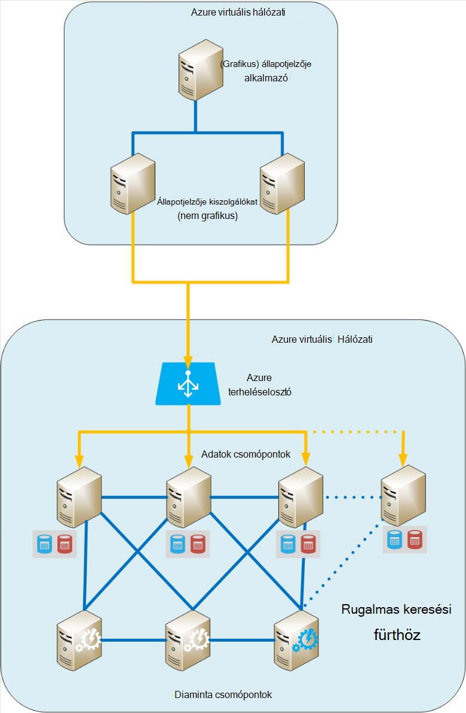
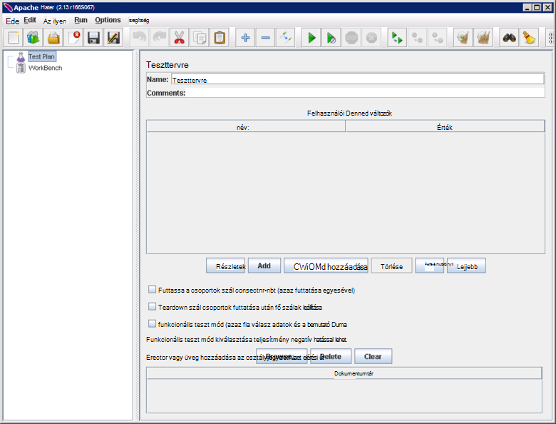
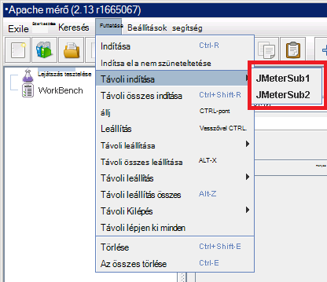
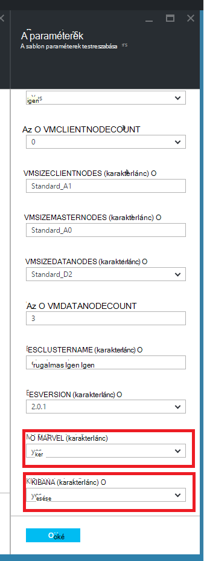
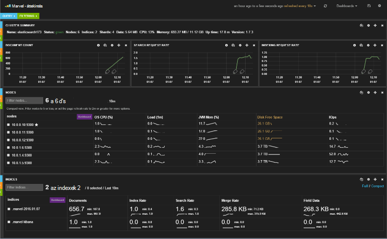
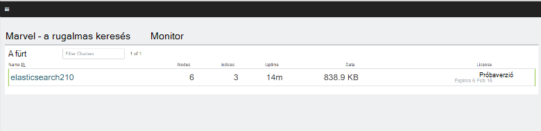
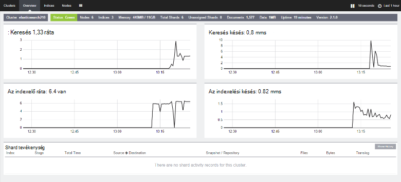

<properties
   pageTitle="A környezet vizsgálata Elasticsearch teljesítmény létrehozása |} Microsoft Azure"
   description="Hogyan lehet a teljesítmény Elasticsearch fürt teszteléshez-környezet beállítása."
   services=""
   documentationCenter="na"
   authors="dragon119"
   manager="bennage"
   editor=""
   tags=""/>

<tags
   ms.service="guidance"
   ms.devlang="na"
   ms.topic="article"
   ms.tgt_pltfrm="na"
   ms.workload="na"
   ms.date="09/22/2016"
   ms.author="masashin"/>
   
# <a name="creating-a-performance-testing-environment-for-elasticsearch-on-azure"></a>A környezet vizsgálata Elasticsearch Azure a teljesítmény létrehozása

[AZURE.INCLUDE [pnp-header](../../includes/guidance-pnp-header-include.md)]

Ez a cikk a [sorozat](guidance-elasticsearch.md)része. 

A dokumentum egy Elasticsearch fürthöz teljesítményének teszteléshez-környezet beállítása ismerteti. Ebben a konfigurációban használt adatok bevitel és a lekérdezés-munkaterhelésekből, teljesítményének tesztelése [Bevitel teljesítményadatok hangolása az Azure a Elasticsearch][]leírt módon.

A teljesítmény tesztelés folyamat [Apache JMeter](http://jmeter.apache.org/), használja a [szabványos beállítása](http://jmeter-plugins.org/wiki/StandardSet/) a bővítmények használatával egy dedikált VMs (nem a Elasticsearch fürt része) külön konfigurálva a célra fő/alárendelt konfigurációban telepítve. 

A [PerfMon Server Agent](http://jmeter-plugins.org/wiki/PerfMonAgent/) minden Elasticsearch csomóponton lett telepítve. Az alábbiakban útmutatást a tesztkörnyezetben kiindulópontként ahhoz, hogy a saját tesztelése JMeter a teljesítmény vezesse. Ezeket az utasításokat feltételezik, hogy már létrehozott egy Elasticsearch fürthöz csomópontokkal az Azure virtuális hálózaton keresztül csatlakozik. 

Figyelje meg, hogy a tesztkörnyezetben is fut Azure erőforráscsoport használatával felügyelt Azure VMs formájában.

[Marvel](https://www.elastic.co/products/marvel) is telepítve és beállítva ahhoz, hogy a Elasticsearch fürt figyelemmel kísérését és könnyebben elemezheti belső tulajdonságát. A JMeter statisztika mutatott a csúcs vagy tálba a teljesítményt, ha Marvel elérhető információk segítségével megállapítható, hogy a probléma okát ingadozásokat különösen lehet.

Az alábbi képen látható a teljes rendszerben szerkezete. 



Vegye figyelembe az alábbiakat:

- A JMeter fő virtuális futtatja a Windows Server, a grafikus környezet kialakítása a JMeter konzol. A diaminta JMeter virtuális biztosít a grafikus (az *jmeter* alkalmazás) ahhoz, hogy egy tesztelő vizsgálatok létrehozása, vizsgálatok futtatása és jelenítse meg az eredményeket. A virtuális koordinálja az jelent vizsgálat kéréseket ténylegesen küldött VMs JMeter kiszolgálóval.

- A JMeter alárendelt VMs Ubuntu Server (Linux) futtatását, az alábbi VMs nem grafikus követelmény. A JMeter kiszolgáló VMs futtassa a JMeter kiszolgálószoftver (a *jmeter-kiszolgáló* alkalmazás) kérést küld a Elasticsearch fürt.

- Kijelölt ügyfél csomópontok nem használták, bár dedikált fő csomópontok volt.

- A fürt adatok csomópontok számának az alkalmazási példát tesztelt függően változhat.

- A Elasticsearch fürt csomópontjait Marvel futásidőben teljesítmény megfigyelni és a JMeter Server Agent későbbi elemzési felügyeleti adatokat szeretne gyűjteni futtatni.

- Elasticsearch 2.0.0 tesztelésekor és újabb verzióiban az adatok csomópontok egyike is fut Kibana. Ez a Elasticsearch 2.0.0 futó Marvel verziója szükséges vagy újabb verzió.

## <a name="creating-an-azure-resource-group-for-the-virtual-machines"></a>A virtuális gépeken futó Azure erőforráscsoport létrehozása

A JMeter fő van szüksége, csatlakoztassa közvetlenül a teljesítményadatok gyűjtése a Elasticsearch fürt csomópontok mindegyike láthatja. Ha a JMeter VNet eltérnek a Elasticsearch fürt VNet a, majd a nagy vonalakban minden Elasticsearch csomópont beállítása egy nyilvános IP-címet. Ha a Elasticsearch konfigurációs probléma, akkor fontolja meg a JMeter VMs az azonos VNet a Elasticsearch fürt az ugyanazt a erőforráscsoport használatával, ebben az esetben kihagyhatja ezt az eljárást első.

Először [Hozzon létre egy erőforrás csoportot](../resource-group-template-deploy-portal.md). A dokumentum feltételezi, hogy az erőforráscsoport *JMeterPerformanceTest*neve. Ha szeretne futtatni a JMeter VMs az azonos VNet a Elasticsearch fürt, használja az ugyanazt a erőforráscsoport helyett egy új fürtre.

## <a name="creating-the-jmeter-master-virtual-machine"></a>A fő virtuális gép JMeter létrehozása

Következő [egy Windows virtuális létrehozása](../virtual-machines/virtual-machines-windows-hero-tutorial.md) a *Windows Server 2008 R2 SP1* kép felhasználásával.  Azt javasoljuk, hogy kijelöli a megfelelő magmintákat és a teljesítmény vizsgálatok futtatása memória virtuális méretével. Ideális esetben ez lesz egy számítógépre, és legalább 2 magmintákat 3,5 GB RAM (A2 normál vagy nagyobb).

<!-- TODO add info on why disabling diagnostics is positive --> 

Azt javasoljuk, hogy tiltsa le a diagnosztikai. A virtuális a portálon létrehozásakor ez történik, kattintson a *Beállítások* lap a *Diagnosztika* *Figyelés* szakaszában. Az alapértelmezett értékeket hagyja meg az egyéb beállításokat.

Győződjön meg arról, hogy a virtuális és a kapcsolódó erőforrásokat hozta sikeresen [vizsgálata az erőforráscsoport](../azure-portal/resource-group-portal.md#manage-resource-groups) a portálon. Az erőforrások szerepel egy virtuális, hálózati biztonsági csoport és az összes azonos nevű egy nyilvános IP-címet, és a hálózati felület és a tárhely fiók nevek alapján, a virtuális kell állnia.

## <a name="creating-the-jmeter-subordinate-virtual-machines"></a>A JMeter alárendelt virtuális gépeken futó létrehozása

[Hozzon létre egy Linux virtuális](../virtual-machines/virtual-machines-linux-quick-create-portal.md) a *Ubuntu kiszolgáló 14.04 LTS* kép felhasználásával.  A JMeter fő virtuális, és válassza ki a megfelelő magmintákat és a teljesítmény vizsgálatok futtatása memória virtuális. Ideális esetben ez lesz egy számítógépre, és legalább 2 magmintákat 3,5 GB RAM (normál A2 vagy nagyobb).

Ismét azt javasoljuk, hogy tiltsa le a diagnosztikai.

Minél több alárendelt VMs igény szerint hozhat létre. 

## <a name="installing-jmeter-server-on-the-jmeter-subordinate-vms"></a>A JMeter alárendelt VMs JMeter server telepítése

A JMeter alárendelt VMs Linux fut, és alapértelmezés szerint nem tud csatlakozni őket úgy, hogy megnyitja a távoli asztali kapcsolat (RDP). Ehelyett a [gitt megjelenítő parancssor ablak megnyitásához használja](../virtual-machines/virtual-machines-linux-mac-create-ssh-keys.md) az egyes virtuális.

Miután felvette a az alárendelt VMs közül, használjuk Bash JMeter beállítása.

Először telepítse a Java-futtatókörnyezet JMeter futtatására.

```bash
sudo add-apt-repository ppa:webupd8team/java
sudo apt-get update
sudo apt-get install oracle-java8-installer
```

Ezután a szoftverletöltés JMeter csomagolt zip-fájlként.

```bash
wget http://apache.mirror.anlx.net/jmeter/binaries/apache-jmeter-2.13.zip
```

Telepítse az unzip parancsot, majd a bontsa ki a JMeter szoftver használatával. A szoftver másolja egy **apache-jmeter-2.13**nevű mappát.

```bash
sudo apt-get install unzip
unzip apache-jmeter-2.13.zip
```

A a JMeter végrehajtható tároló *bin* könyvtár módosítása, és így a *jmeter-kiszolgáló* és *jmeter* programok végrehajtható.

```bash
cd apache-jmeter-2.13/bin
chmod u+x jmeter-server
chmod u+x jmeter
```

Most, a fájl szerkesztéséhez szükséges `jmeter.properties` (jártas leginkább, például *vi* vagy *vim*szövegszerkesztőben kell használni) az aktuális mappában található. Keresse meg az alábbiakkal:

```yaml
...
client.rmi.localport=0
...
server.rmi.localport=4000
...
```

Vegye ki a megjegyzésjeleket (távolítsa el a sortávolságot \## karakter), és módosíthatja ezeket a sorokat, alább látható módon, majd mentse a fájlt, és zárja be a szerkesztő:

```yaml
...
client.rmi.localport=4441
...
server.rmi.localport=4440
```

Ezután a következő parancsokat kattintva nyissa meg a bejövő TCP-forgalmat 4441 port (Ez a port *jmeter-kiszolgáló* hallgathatja meg az imént konfigurálta a):

```bash
sudo iptables -A INPUT -m state --state NEW -m tcp -p tcp --dport 4441 -j ACCEPT
```

Töltse le a bővítmények szabványos gyűjteménye JMeter (ezek a bővítmények nyújt teljesítményének nyomon számláló) tartalmazó zip-fájl, és ezután bontsa ki a **apache-jmeter-2.13** mappát a fájlt. A bővítmények kicsomagolás a fájlt erre a helyre helyezi el a megfelelő mappában.

Ha a program rákérdez, hogy felülírja a licenc-fájlt, írja be A (mind):

```bash
wget http://jmeter-plugins.org/downloads/file/JMeterPlugins-Standard-1.3.0.zip
unzip JMeterPlugins-Standard-1.3.0.zip
```

Használat `nohup` elindítani a JMeter kiszolgálót, a háttérben. Meg kell válaszolhat a folyamat azonosító, és egy üzenet jelzi, hogy azt egy távoli objektum hozott létre, és készen áll a kezdésre fogad parancsokat jeleníti meg.  A következő parancsot a ~/apache-jmeter-2.13/bin címtárban. 

```bash
nohup jmeter-server &
```

> [AZURE.NOTE]Ha a virtuális állítva a JMeter server program megszakad. A virtuális csatlakozzon, és indítsa újra a kézzel újra kell. Azt is megteheti, beállíthatja a rendszer parancsot a *jmeter-kiszolgáló* automatikusan indításkor a következő parancsok hozzáadásával a `/etc/rc.local` fájlt (a *0 Kilépés* parancs) előtt:

```bash
sudo -u <username> bash << eoc
cd /home/<username>/apache-jmeter-2.13/bin
nohup ./jmeter-server &
eoc
```

Csere `<username>` saját bejelentkezési nevét.

Akkor lehet hasznos nyitva hagyja a Terminálszolgáltatások ablakot, hogy figyelheti a JMeter kiszolgáló végrehajtásának, amíg vizsgálat van folyamatban.

Meg kell ismételje meg ezeket a lépéseket minden JMeter alárendelt virtuális.

## <a name="installing-the-jmeter-server-agent-on-the-elasticsearch-nodes"></a>A JMeter Server Agent telepít Elasticsearch csomópontok

Ez az eljárás feltételezi, hogy jelentkezzen be a hozzáférést a Elasticsearch csomópontok. Ha a fürt, az erőforrás-kezelő-sablon segítségével létrehozott, csatlakozhat minden csomópont keresztül az Ugrás párbeszédpanel virtuális, [Elasticsearch fut a Azure](guidance-elasticsearch-running-on-azure.md)Elasticsearch topológia részében bemutatott. Az Ugrás mezőbe gitt is csatlakozhat. 

Itt a *ssh* parancs segítségével jelentkezzen be az egyes a Elasticsearch fürt csomópontok.

Jelentkezzen be a Elasticsearch csomópontok egyike rendszergazdaként.  A Bash parancssorba írja be a következő parancsokat hozzon létre egy mappát a JMeter Server Agent tartó, és a mappa áthelyezése:

```bash
mkdir server-agent
cd server-agent
```

A következő parancsokat a *unzip* parancs telepítendő (Ha még nincs telepítve), a JMeter Server Agent Szoftverletöltés és csomagolja ki, hogy:

```bash
sudo apt-get install unzip
wget http://jmeter-plugins.org/downloads/file/ServerAgent-2.2.1.zip
unzip ServerAgent-2.2.1.zip
```
 
Futtassa a következő parancsot a (Ez a a JMeter Server Agent által használt port) konfigurálja a tűzfalat, és engedélyezze a TCP-forgalmat port 4444 át:

```bash
sudo iptables -A INPUT -m state --state NEW -m tcp -p tcp --dport 4444 -j ACCEPT
```

Futtassa a következő parancs, amellyel a JMeter Server Agent a háttérben:

```bash
nohup ./startAgent.sh &
```

A JMeter Server Agent megkezdődött, és figyeli a port 4444 jelző üzenetekkel kell válaszoljon.  Nyomja le az Enter billentyűt, és szerezze be a parancssor parancsot, majd futtassa a következő parancsot.

```bash
telnet <nodename> 4444
```

Csere `<nodename>` a csomópontra a nevet. (Talál a csomópont neve futtatásával a `hostname` parancs.) Ez a parancs a helyi számítógép zónában 4444 portjához telnet kapcsolat nyílik meg. A kapcsolat használatával győződjön meg róla, hogy a JMeter Server Agent megfelelően fut-e.

Ha a JMeter Server Agent nem fut, a válasz kap 

`*telnet: Unable to connect to remote host: Connection refused*.`

Ha a JMeter Server Agent fut, és port 4444 helyesen van beállítva, meg kell jelennie a következő válasz:


> [AZURE.NOTE] A telnet munkamenet nem nyújt kérdés rendezést, miután csatlakoztatva van.

A telnet-munkamenetet írja be a következő parancsot:

``` 
test
```

Ha a JMeter Server Agent be van állítva, és figyeli megfelelően, meg kell azt jelzik, hogy érkezett-e a parancs és válaszoljon rá *Yep*üzenettel.

> [AZURE.NOTE]Nyomon követési adatok teljesítmény elérése érdekében további parancsok is írhat. Ha például a parancs `metric-single:cpu:idle` képet ad az aktuális százalékos arányában, amely a Processzor üresjárati (Ez a pillanatkép). Látogasson el a [PerfMon Server Agent](http://jmeter-plugins.org/wiki/PerfMonAgent/) parancsok teljes listáját. : Vissza, a hívó, akkor ő Perfmon kiszolgáló ügynök. >>

Írja be a telnet-munkamenetet, zárja be a munkamenetet, és térjen vissza a Bash parancssorból a következő parancsot:

``` 
exit
```

> [AZURE.NOTE]A JMeter az alárendelt VMs, ha, kijelentkezés, vagy ha ezen a számítógépen állítva, és újraindul majd a JMeter Server Agent kell manuálisan újra kell indítani használatával, a `startAgent.sh` parancsot. Ha azt szeretné, hogy a JMeter Server Agent automatikusan elinduljon, adja hozzá a következő parancs végére a `/etc/rc.local` fájlt, mielőtt a *0 Kilépés* parancsot. 
> Csere `<username>` azonosítóját a login name együtt:

```bash
sudo -u <username> bash << eoc
cd /home/<username>/server-agent
nohup ./startAgent.sh &
eoc
```

Most már vagy megismételheti a teljes folyamat minden más csomópont a Elasticsearch fürt, vagy használhatja a `scp` paranccsal másolja a kiszolgáló-agent mappát és tartalmát minden más csomópontot, és a `ssh` parancsa a JMeter Server Agent alább látható módon. Csere e `<username>` a felhasználónevét, a és `<nodename>` a szeretné másolni, és futtassa a szoftvert (kérheti minden parancs futtatása a jelszó megadását) csomópontot a nevet:

```bash
scp -r \~/server-agent <username>@<nodename>:\~
ssh <nodename> sudo iptables -A INPUT -m state --state NEW -m tcp -p tcp --dport 4444 -j ACCEPT
ssh <nodename> -n -f 'nohup \~/server-agent/startAgent.sh'
```

## <a name="installing-and-configuring-jmeter-on-the-jmeter-master-vm"></a>Való telepítéséről és konfigurálásáról JMeter a JMeter fő virtuális a

Az Azure-portálon kattintson az **erőforrás-csoportokat**. Kattintson az **erőforrás csoportoknak** lap az erőforráscsoport JMeter diaminta és alárendelt VMs tartalmazó.  Az **erőforráscsoport** lap kattintson a **Diaminta virtuális JMeter**. A virtuális gép lap, az eszköztáron kattintson a **Csatlakozás**gombra. Nyissa meg az RDP-fájlt, amikor a böngésző kéri. A Windows hoz létre a virtuális távoli asztali kapcsolat.  Írja be a virtuális, amikor a rendszer kéri felhasználónevét és jelszavát.

A virtuális használ Internet Explorer ugorjon a [Java letöltése a Windows](http://www.java.com/en/download/ie_manual.jsp) lapon. Kövesse az utasításokat követve töltse le és futtassa az Java-telepítőt.

A böngészőben nyissa meg a [Apache JMeter töltse le a](http://jmeter.apache.org/download_jmeter.cgi) lapot, és töltse le a legújabb bináris tartalmazó zip. Mentse a zip a virtuális kényelmes pontjára.

Nyissa meg az [Egyéni JMeter bővítmények](http://jmeter-plugins.org/) webhelyet, és töltse le a bővítmények szabványos beállítása. Mentse a zip a JMeter letöltés ugyanabban a mappában, az előző lépésben.

A Windows Intézőben, nyissa meg a mappát, ahol az a apache-jmeter -*xxx* zip fájlba, ahol *xxx* JMeter aktuális verziójának. Bontsa ki a fájlokat az aktuális mappába.

Bontsa ki a fájlokat a a JMeterPlugins – Standard -*yyy*.zip fájlba, ahol *yyy* a bővítmények az apache az aktuális verziójának-jmeter*xxx* mappákra. Ezzel hozzáadja a bővítmények a megfelelő mappát a JMeter. Biztonságos tár mappák egyesítése, és írja felül a licenc és fontos fájl fájlokat, ha a rendszer kéri.

Nyissa meg a apache-jmeter -*xxx*szükséges mappát és szerkesztése a jmeter.properties fájl Jegyzettömbbel.  Az a `jmeter.properties` fájlt, keresse meg a *távoli hosts és a RMI konfigurációs*címkézni szakaszt.  Ebben a részben a fájl keresse meg a következő parancsot:

```yaml
remote_hosts=127.0.0.1
```

Módosítsa a sort, és írja felül az IP-cím 127.0.0.1 vesszővel elválasztott listát IP-címek vagy az egyes a JMeter alárendelt kiszolgálók állomásnevek. Példa:

```yaml
remote_hosts=JMeterSub1,JMeterSub2
```

Keresse meg a következő parancsot, majd távolítsa el a `#` a sor elején karakter, és módosítsa az értékét client.rmi.localport beállításai:

```yaml
#client.rmi.localport=0
```

a:

```yaml
client.rmi.localport=4440
```

Mentse a fájlt, és zárja be a Jegyzettömbbe. 

A Windows eszköztáron kattintson a **Start**gombra, kattintson a **Felügyeleti eszközök**, és válassza a **Fokozott biztonságú Windows tűzfal**.  A Windows tűzfal biztonsági speciális ablak, a bal oldali ablaktáblában kattintson a jobb gombbal a **Bejövő szabályok**pontra, és kattintson az **Új szabály**parancsra.

Az **Új bejövő szabály varázsló** **Szabálytípus** lapján jelölje be a **Port**, és kattintson a **Tovább gombra**.  A protokollok és portok lapon jelölje ki a **TCP**, jelölje be az **adott helyi portokat**és a szöveg mezőbe írja be `4440-4444`, majd kattintson a **Tovább**gombra.  A művelet lapon válassza az **Engedélyezés lehetőséget a kapcsolatot**, és kattintson a **Tovább gombra**. A profil lapon hagyja bejelölve összes beállítást, és kattintson a **Tovább**gombra.  Név lapon a **név** mezőbe írja be *JMeter*, és kattintson a **Befejezés gombra**.  Zárja be a Windows tűzfal biztonsági speciális ablakban.

A Windows Intézőben és a a apache-jmeter -*xx*szükséges mappát, a *jmeter* Windows köteg fájlra duplán kattintva indítsa el a grafikus. A felhasználói felület jelenjen meg:



A menüsor megjelenítése az kattintson a **Futtatás**parancsra, kattintson a **Start távoli**, és győződjön meg róla, hogy a két JMeter alárendelt gép megtalálhatók:



Most már készen áll a teljesítmény tesztelése a kezdéshez.

## <a name="installing-and-configuring-marvel"></a>Való telepítéséről és konfigurálásáról Marvel

Azure Elasticsearch quickstart útmutató sablonja telepítése és konfigurálása Marvel a megfelelő verziója automatikusan, ha igaz ("Igen") a fürt készítésekor a MARVEL és KIBANA paramétereket:



Ha egy meglévő fürthöz kell manuálisan elvégezni a telepítést Marvel hozzáadni, és a folyamat eltér attól függően, hogy Elasticsearch verzióját használja 1.7.x és 2.x, az alábbi eljárások leírt módon.

### <a name="installing-marvel-with-elasticsearch-173-or-earlier"></a>Marvel a Elasticsearch 1.73 vagy korábbi verzió telepítése

Ha Elasticsearch 1.7.3 használja, vagy korábbi verziójában, hajtsa végre az alábbi lépéseket *minden csomóponton* a fürt:

- Jelentkezzen be a csomópontra, és helyezze át a Elasticsearch otthoni címtárban.  A szokásos otthoni könyvtár van Linux, `/usr/share/elasticsearch`.

-  Futtassa a következő parancsot, töltse le és telepítse a beépülő modul Marvel Elasticsearch:

```bash
sudo bin/plugin -i elasticsearch/marvel/latest
```

- Leállíthatja, és indítsa újra a Elasticsearch a csomóponton:

```bash
sudo service elasticsearch restart
```

- Ha ellenőrizni szeretné, hogy megfelelően történt-e telepítve Marvel, nyisson meg egy webböngészőt, és nyissa meg az URL-cím `http://<server>:9200/_plugin/marvel`. Csere `<server>` névvel vagy a fürt bármely Elasticsearch kiszolgálójának IP-címét.  Ellenőrizze, hogy a hasonló alább látható módon, oldal jelenik meg:




### <a name="installing-marvel-with-elasticsearch-200-or-later"></a>Marvel telepítése az Elasticsearch 2.0.0 vagy újabb verzió

Ha Elasticsearch 2.0.0 használja, vagy újabb, hajtsa végre az alábbi feladatok *minden csomóponton* a fürt:

Jelentkezzen be a csomópontot, és helyezze át a Elasticsearch otthoni könyvtár (általában `/usr/share/elasticsearch`) a következő parancsokat, töltse le és telepítse a beépülő modul Marvel Elasticsearch:

```bash
sudo bin/plugin install license
sudo bin/plugin install marvel-agent
```

Leállíthatja, és indítsa újra a Elasticsearch a csomóponton:

```bash
sudo service elasticsearch restart
```

Az alábbi eljárás cseréje `<kibana-version>` az alkalmazás használatakor Elasticsearch 2.0.0 vagy Elasticsearch 2.0.1 4.2.2 vagy 4.3.1 Elasticsearch 2.1.0 használatakor az vagy újabb verziójában.  Csere `<marvel-version>` 2.0.0 Elasticsearch 2.0.0 vagy Elasticsearch 2.0.1 használata esetén, vagy 2.1.0 Elasticsearch 2.1.0 használatakor vagy újabb verziójában.  Végezze el az alábbi feladatok *egy csomóponton* a fürt:

Jelentkezzen be a csomópontot, majd töltse le a [webhely Letöltés Elasticsearch](https://www.elastic.co/downloads/past-releases)Kibana Elasticsearch verziójának megfelelő változatát csomag kibontása:

```bash
wget https://download.elastic.co/kibana/kibana/kibana-<kibana-version>-linux-x64.tar.gz
tar xvzf kibana-<kibana-version>-linux-x64.tar.gz
```

Nyissa meg a port fogadja el a bejövő felkérést 5601:

```bash
sudo iptables -A INPUT -m state --state NEW -m tcp -p tcp --dport 5601 -j ACCEPT
```

Helyezze át a Kibana config mappába (`kibana-<kibana-version>-linux-x64/config`), szerkesztheti a `kibana.yml` fájlt, és illessze be a következő sort. Csere `<server>` névvel vagy a fürt egy Elasticsearch kiszolgáló IP-címe:

```yaml
elasticsearch.url: "http://<server>:9200"
```

Ugrás a Kibana bin mappát (`kibana-<kibana-version>-linux-x64/bin`), és Kibana a Marvel beépülő modul integrálni szeretné a következő parancs futtatásával:

```bash
sudo ./kibana plugin --install elasticsearch/marvel/<marvel-version>
```

Indítsa el a Kibana:

```bash
sudo nohup ./kibana &
```

Ha ellenőrizni szeretné a Marvel telepítés, nyisson meg egy webböngészőt, és nyissa meg az URL-cím `http://<server>:5601/app/marvel`. Csere `<server>` névvel vagy Kibana rendszert futtató kiszolgáló IP-címet.

Ellenőrizze, hogy a hasonló alább látható módon, oldal jelenik (a fürt neve fog valószínűleg eltérőek, hogy a képen látható).



Kattintson a hivatkozásra, amely megfelel a fürt (a fenti képen elasticsearch210). Hasonló alább látható módon, oldal jelenjen meg:




[Adatok bevitel Elasticsearch Azure a teljesítmény javítása]: guidance-elasticsearch-tuning-data-ingestion-performance.md  