<properties
   pageTitle="Egy JMeter JUnit bemutató üzembe helyezése vizsgálat Elasticsearch teljesítmény |} Microsoft Azure"
   description="Hogyan használható a JUnit bemutató készítése és feltölteni az adatokat egy Elasticsearch fürthöz."
   services=""
   documentationCenter="na"
   authors="dragon119"
   manager="bennage"
   editor=""
   tags=""/>

<tags
   ms.service="guidance"
   ms.devlang="na"
   ms.topic="article"
   ms.tgt_pltfrm="na"
   ms.workload="na"
   ms.date="09/22/2016"
   ms.author="masashin"/>
   
# Üzembe helyezése a JMeter JUnit bemutató Elasticsearch teljesítmény tesztelése

[AZURE.INCLUDE [pnp-header](../../includes/guidance-pnp-header-include.md)]

Ez a cikk a [sorozat](guidance-elasticsearch.md)része. 

A dokumentum ismerteti, hogyan hozhat létre és használhat egy JUnit bemutató, amely készíthet, és feltölteni az adatokat egy Elasticsearch fürthöz egy JMeter teszttervre részeként. Ezt a megközelítést tartalmaz egy rugalmas megközelítés betöltése, tesztelés, amely a nagy mennyiségű tesztadatokat nélkül attól függően, hogy a külső adatok fájlokat hozhat létre.

> [AZURE.NOTE] A betöltés elvégzett [hangolása adatok bevitel teljesítményt Elasticsearch](guidance-elasticsearch-tuning-data-ingestion-performance.md) ismertetett adatok bevitel teljesítményének voltak összeállítás használja ezt a megközelítést. A részletek, a JUnit kód ismertetjük az adott dokumentumban.

A tesztelés adatok bevitel teljesítmény elérése érdekében a JUnit kód lett elkészítésének Holdas (Mars) használ, és függőségek megoldott maven tesztelése használatával. Az alábbi eljárások lépésenkénti folyamata Holdas telepítése, beállítása maven tesztelése, JUnit teszten létrehozása és üzembe helyezése a tesztet mint JMeter vizsgálat egy kérés JUnit bemutató ismertetik.

> [AZURE.NOTE] Részletes információt szerkezetére és a tesztkörnyezetben konfigurálása című témakörben talál [a teljesítmény Elasticsearch Azure a tesztelés környezet létrehozása][].

## Előfeltételek telepítése

A fejlesztői számítógépen szüksége lesz a [Java-futtatókörnyezet](http://www.java.com/en/download/ie_manual.jsp) .
Akkor is telepíteni kell az [Holdas IDE Java-fejlesztők számára](https://www.eclipse.org/downloads/index.php?show_instructions=TRUE).

> [AZURE.NOTE] A JMeter fő virtuális [létrehozása a teljesítmény Elasticsearch Azure a tesztelés környezet][] , a fejlesztői környezet ismertetett használatakor töltse le a Windows 32 bites az Holdas telepítőt.

## Tesztelés Elasticsearch terhelés JUnit vizsgálat projekt létrehozása

Indítsa el az Holdas IDE, ha nem fut, és zárja be az **Üdvözöljük** lapon.  A **fájl** menüben kattintson, és kattintson a **Projekt Java**.

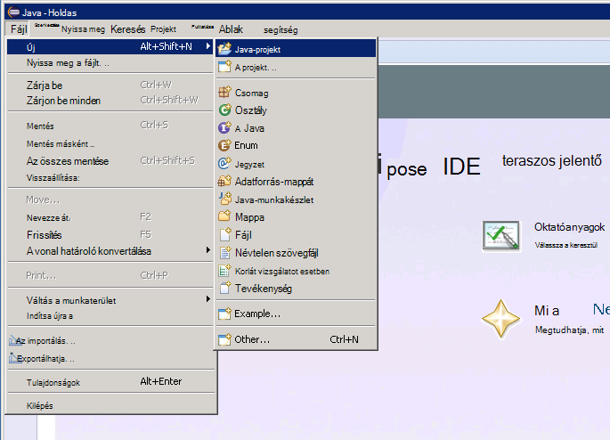

Az **Üres Java projekt** ablakban írja be a projektnév, jelölje ki az **alapértelmezés használata JRE**, és kattintson a **Befejezés gombra**.

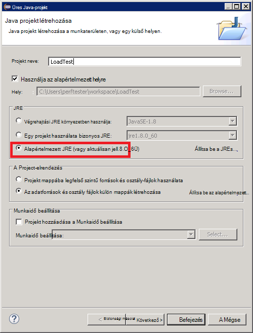

A **Csomag-kezelő** ablakban bontsa ki a után a projekt nevű csomópontot. Győződjön meg arról, hogy az tartalmazza-e egy **src** és a megadott JRE hivatkozás nevű mappát.

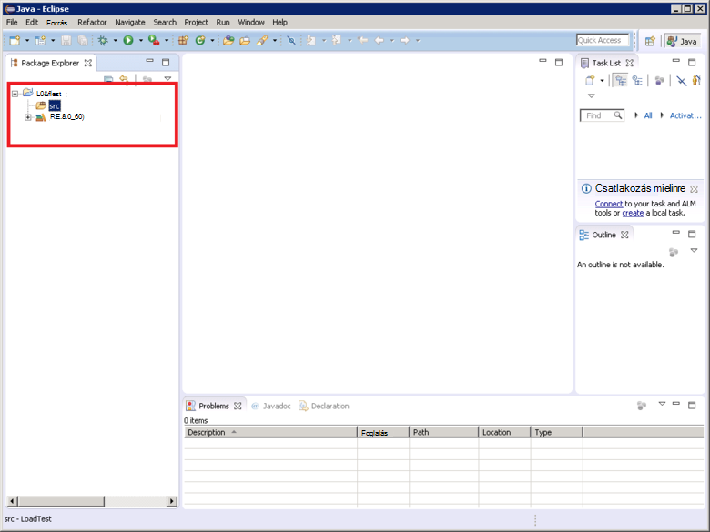

Kattintson a jobb gombbal a **src** mappát, kattintson az **Új**gombra, és kattintson arra az **esetre, JUnit próba**.

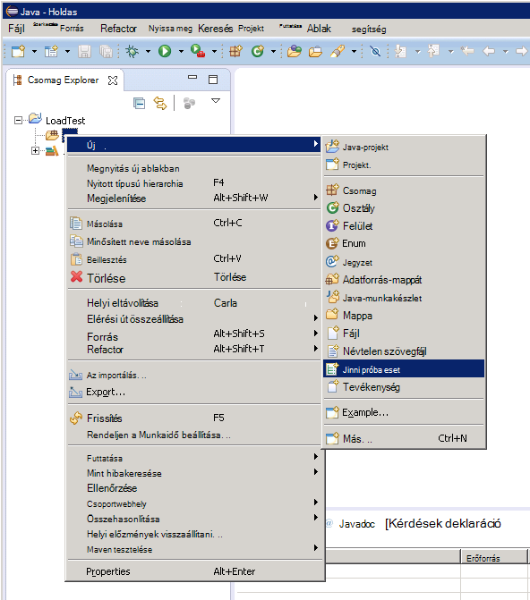

Az **Új JUnit próba eset** ablakában válassza **Új Junit 4 tesztelése**, adjon meg egy nevet a csomagnak (Ez lehet ugyanaz, mint a projekt neve bár által kiállítás kisbetű betűvel kell indíthat), a próba osztály, és válassza ki a beállításokat, amelyek a módszer rutinhelyőrzőkre a próba-höz szükséges készítése nevét. Hagyja üresen a **osztály vizsgált** mezőben, és kattintson a **Befejezés gombra**.

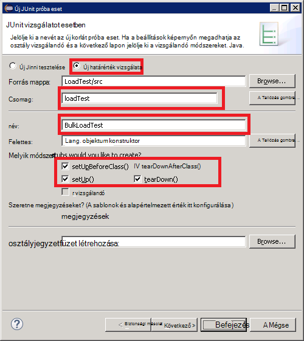

Ha a következő **Új JUnit próba eset** párbeszédpanel jelenik meg, a beállítással a JUnit 4 található összeállítás elérési vehet fel, és kattintson **az OK**gombra. 

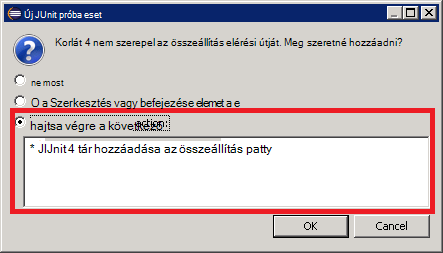

Ellenőrizze, hogy a skeleton kódját a JUnit vizsgálat van hozza létre a Java editor ablakban jelenik meg.

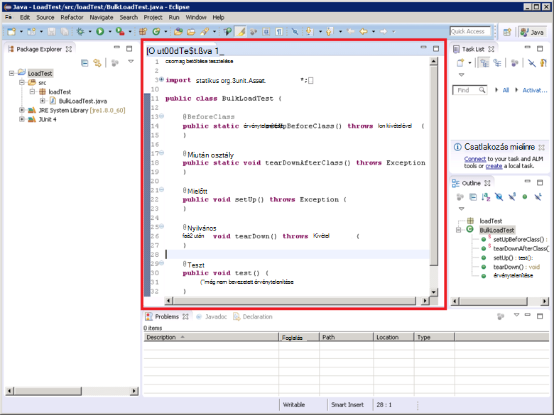

**Csomag Explorer**az kattintson a jobb gombbal a projekt csomópontját, kattintson a **Konfigurálás**gombra, és kattintson a **Konvertálás maven tesztelése projektté**.

> [AZURE.NOTE]Maven tesztelése lehetővé teszi, hogy több egyszerű kezelése (például az ügyfél Elasticsearch Java tárak) külső függőségeket használata egy függ.

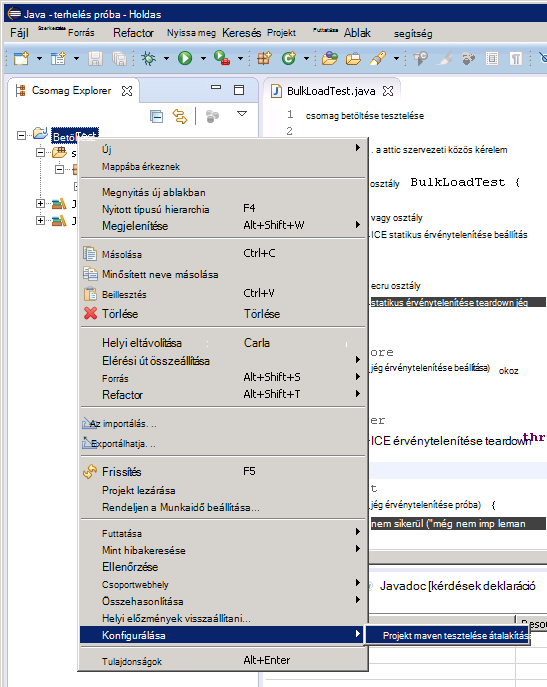

**Új POM létrehozása** párbeszédpanelen a **csomagolást** legördülő listában jelölje ki a **üveg**, és kattintson a **Befejezés gombra**.

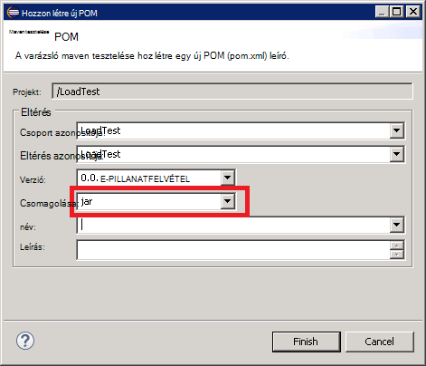

A projekt object model (POM) editor alatt megjelenő panelen jeleníthet meg a figyelmeztetés "Szerkesztés elérési út végrehajtási környezet J2SE-1,5 adja meg. Vannak telepítve a munkaterületi JREs, feltétlenül kompatibilis e-környezettel rendelkező", attól függően, hogy melyik Java verziója telepítve van a fejlesztés számítógépre. Ha későbbi, mint nyugodtan figyelmen kívül hagyhatja, ez a figyelmeztetés 1.5-ös verzió Java-verziót.

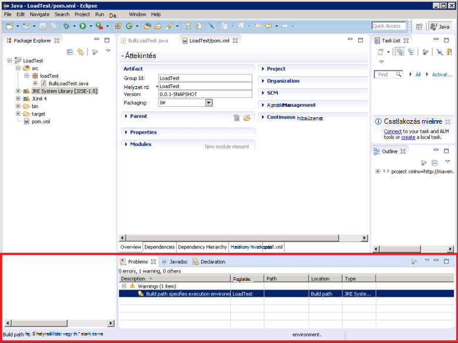

POM szerkesztőben bontsa ki a **Tulajdonságok parancsot** , és kattintson a **Létrehozás**gombra.

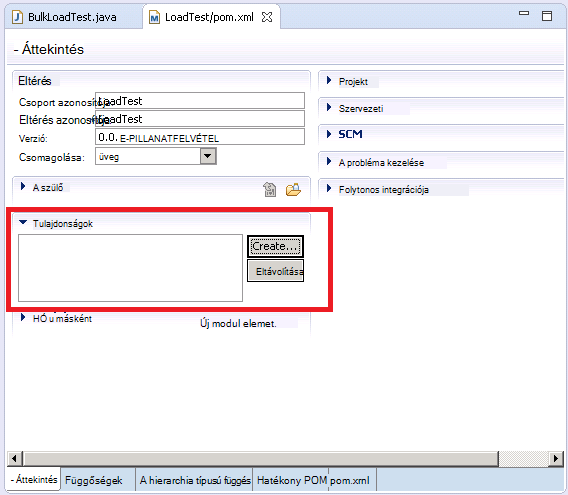

A **Tulajdonság hozzáadása** párbeszédpanel a **név** mezőbe írja be a *es.version*, az **érték** mezőbe írja be a *1.7.2*, és kattintson **az OK**gombra. A Elasticsearch Java ügyfél tár verziója (Előfordulhat, hogy a jövőben lecserélése verziójában, és a verzió definiáló POM tulajdonság, és ezt a tulajdonságot a projektben máshol hivatkozó lehetővé teszi, hogy gyorsan lehet módosítani a változat.)

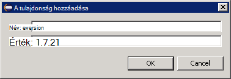

A **függőségek** lap alján a POM szerkesztő gombra, és kattintson a **függőségeket** lista mellett a **Hozzáadás** gombra.

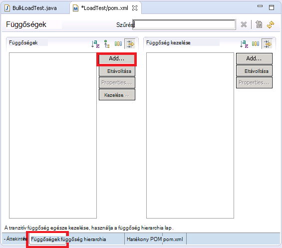

**Függőség kiválasztása** párbeszédpanelen a **Csoportazonosítót** mezőbe írja be a *org.elasticsearch*, az **Eltérés azonosító** mezőbe írja be a *elasticsearch*a **verziója** mezőbe írja be a * \${es.version}*, és kattintson **az OK**gombra. Az online maven tesztelése központi adattárban tartják információt a Java Elasticsearch ügyfél tárat, és ez a beállítás automatikusan letölti a tár és függőségét, amikor a projekt épül.

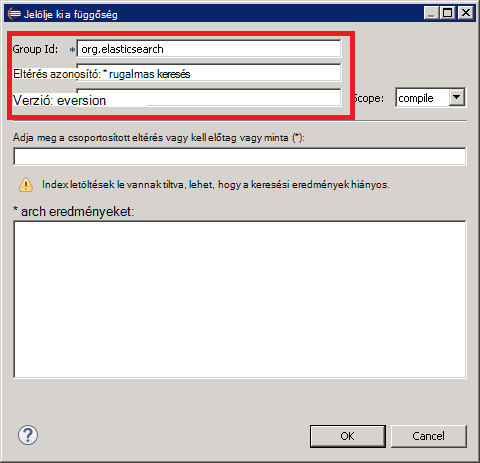

A **fájl** menüben az **Összes mentése**gombjára. Ez a művelet mentése és hozza létre a projekt, a függőségeket maven tesztelése által megadott letöltését. Ellenőrizze, hogy a maven tesztelése függőségek mappa csomag Explorer jelenik meg. Bontsa ki a mappát, üveg támogatja a Elasticsearch Java ügyfél tárat letöltött fájlok megtekintéséhez.

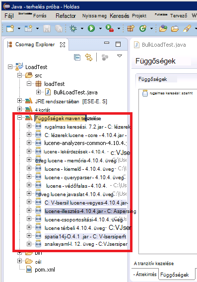

## Holdas JUnit próba projekt importálása

Ez az eljárás feltételezi, hogy letöltötte Holdas a korábban létrehozott maven tesztelése projekt.

Indítsa el a Holdas IDE. A **fájl** menüben kattintson az **Importálás**gombra.

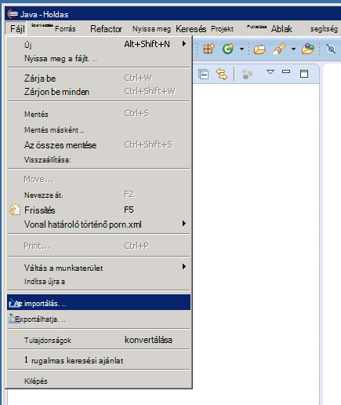

**Kiválasztása** ablakban bontsa ki a **maven tesztelése** mappát, kattintson a **Meglévő maven tesztelése projektek**elemre, és kattintson a **Tovább gombra**.

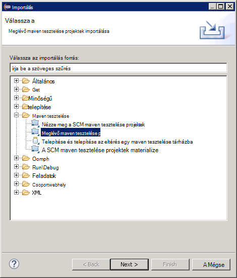

A **Projektek maven tesztelése** ablakban adja meg a mappát, eközben tartsa a projekt (a pom.xml fájlt tartalmazó mappa), kattintson az **Összes kijelölése**gombra, és kattintson a **Befejezés gombra**.

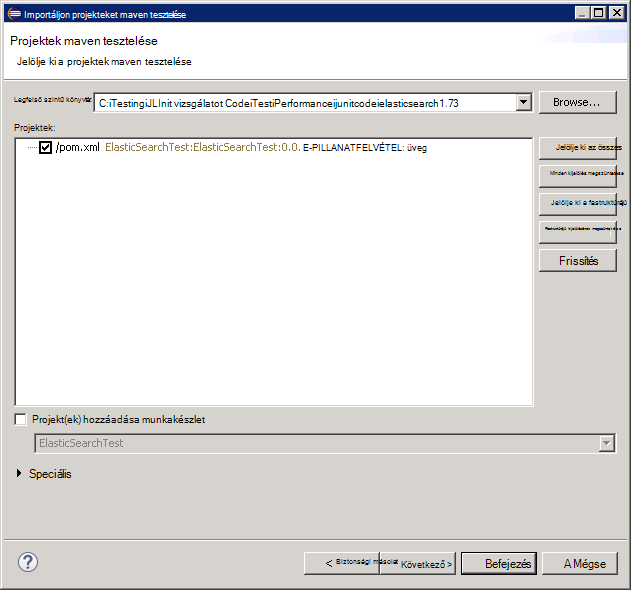

A **Csomag-kezelő** ablakban bontsa ki a projekt megfelelő csomópontot. Győződjön meg arról, hogy a projekt egy **src**nevű mappát. Ez a mappa a JUnit vizsgálathoz forráskódot tartalmazza. A projekt is össze, és az alábbi utasításokat követve rendszerbe.

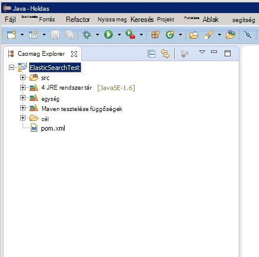

## Egy JUnit vizsgálat bevezetéshez JMeter

Ez az eljárás feltételezi, hogy egy projektet tartalmazó nevű JUnit próba osztály LoadTest nevű létrehozott `BulkLoadTest.java` , hogy elfogadja a konfigurációs átadott, az egyetlen karakterláncként (Ez az eljárás JMeter vár, a) konstruktorban.

A Holdas ide **Csomag Intéző**kattintson a jobb gombbal a projekt csomópontját, és kattintson az **Exportálás**parancsra.

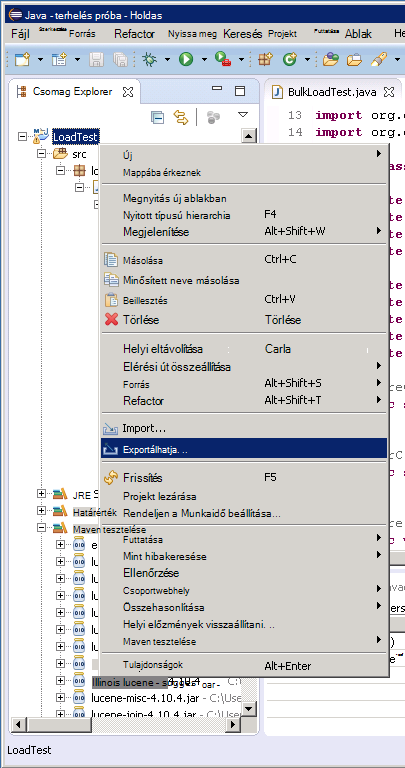

Az **Exportálás varázsló**a lapon **Válassza ki** bontsa ki a **Java** csomópontot, kattintson a **fájl JAR**, és kattintson a **Tovább gombra**.

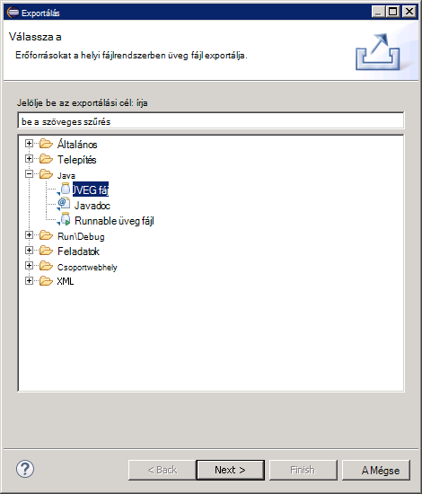

A **Fájl specifikációja JAR** lapon **Jelölje ki az exportálandó erőforrásokat** mezőbe bontsa ki a projektet **.project**kattintva szüntesse meg, és kapcsolja ki a **pom.xml**. A **fájl JAR** mezőben adja meg a fájl nevét és helyét a üveg (meg kell adni a .jar kiterjesztésű fájl), és kattintson a **Befejezés gombra**.

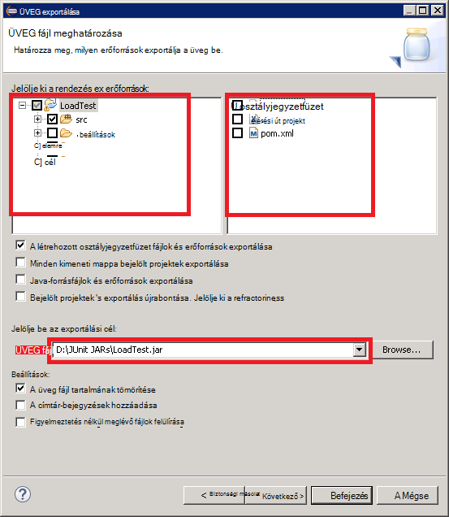

A Windows Intézőből másolhatja a üveg a JMeter fő JVM az imént létrehozott, és mentse a apache-jmeter-2.13\\tár\\junit mappa alatt a mappát, amelyen telepítve van a JMeter (lásd az eljárás "Létrehozása a JMeter fő virtuális gép" [a teljesítmény Elasticsearch Azure a tesztelés környezet](guidance-elasticsearch-creating-performance-testing-environment.md) létrehozása olvashat.)

Térjen vissza Holdas, bontsa ki a **Csomag** Intézőt, és jegyezze fel az összes üveg fájlt, és a helyekre szerepel a listában, a project a függőségek maven tesztelése mappában. Tartsa szem előtt, hogy az alábbi képen megjelenített fájlt eltérőek lehetnek, attól függően, hogy melyik Elasticsearch verzióját használja:

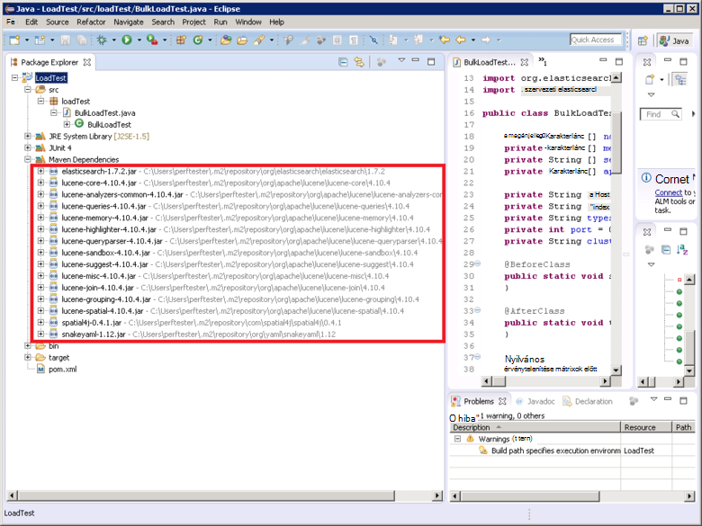

A Windows Intézőből másolhatja minden üveg apache-jmeter-2.13 a maven tesztelése függőségek mappában hivatkozott\\tár\\a JMeter fő virtuális junit mappájában.

Ha a tár\\junit mappa már üveg fájlok régebbi verziói tartalmaz, akkor eltávolíthatja őket. Ha a helyen maradjon majd a JUnit próba nem működnek, lehet, hogy megszűnt-e a megfelelő kancsó hivatkozások.

Virtuális JMeter megváltoztatnia leállítása JMeter, ha éppen zajló értekezletet.  Indítsa el a JMeter.  A JMeter kattintson a jobb gombbal a **Próba megtervezése**, kattintson a **Hozzáadás**gombra, **szálak (felhasználók)**, gombmenü **Szál csoport**.

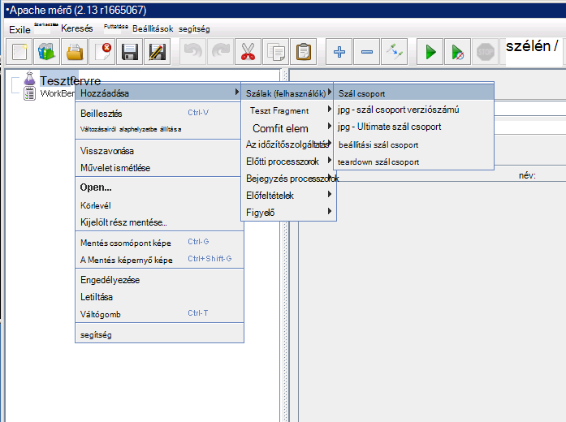

A **Próba megtervezése** csomópont alatt kattintson a jobb gombbal a **Szál csoport**, kattintson a **Hozzáadás**gombra, **bemutató**, gombmenü **JUnit kérelmet**.

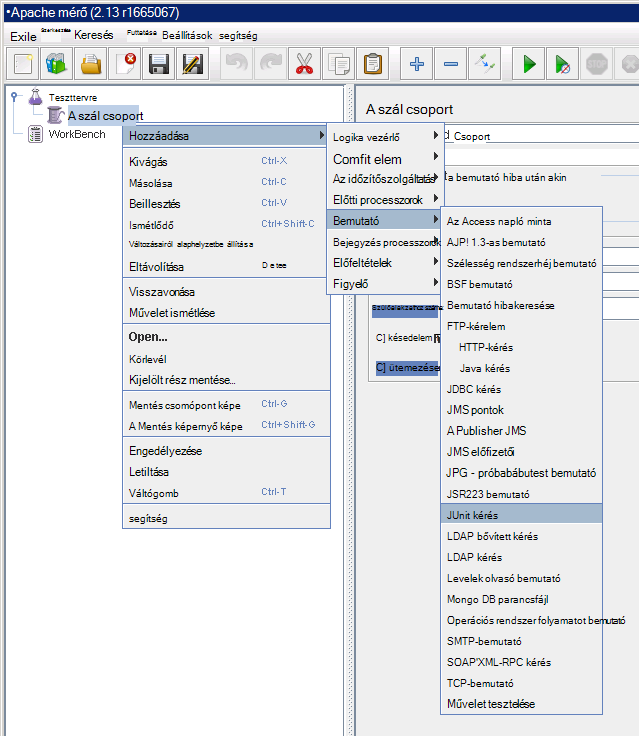

**JUnit kérelem** lapon jelölje be a **Keresés JUnit4 jegyzetek (helyett JUnit 3)**. A **osztálynév** legördülő listában jelölje ki a JUnit betöltés próba class (szerepelni fognak az űrlap * &lt;csomag&gt;.&lt; class&gt;*), a **Vizsgálati módszerrel** a legördülő listában válassza ki a JUnit vizsgálati módszer (Ez a módszer, hogy valóban végrehajtja a munkát a próbához tartozó és a megjelölt kell a *@test* széljegyzet a Holdas projekt), és adja meg a konstruktor a **Konstruktor karakterlánc címke** mezőben átadandó értéket. A részletek, az alábbi képen látható csak példák; **osztálynév** * *Módszer*, és * *Konstruktor karakterlánc címke** fog valószínűleg különböznek feltüntetett.

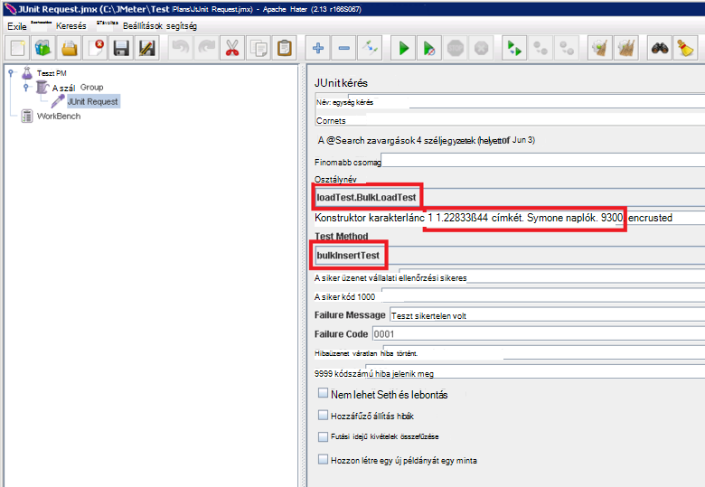

Az osztályához nem jelenik meg a **osztálynév** legördülő listában, akkor valószínűleg azt jelenti, hogy a üveg nem megfelelően történt exportált nem szerepel az a tár\\junit mappát, vagy egy részét a függő kancsó hiányoznak a tár\\junit mappát. Ez akkor fordulhat elő, ha a projekt exportálása Holdas újra, és győződjön meg arról, hogy választott **src** erőforrás, a tár másolása a üveg\\junit mappát, és győződjön meg arról, hogy másolta a függő kancsó maven tesztelése a tár mappába felsorolt összes.

Zárja be a JMeter. Nincs szükség a teszttervre mentésre nem.  A JUnit próba osztály a /home/ tartalmazó üveg fájl másolása&lt;felhasználónév&gt;/apache-jmeter-2.13/lib/junit mappát az egyes a JMeter alárendelt VMs (*&lt;felhasználónév&gt; * neve a felügyeleti felhasználó megadott a virtuális létrehozásakor, további információt talál az "Létrehozása a JMeter alárendelt virtuális gépeken futó" eljárás [a teljesítmény Elasticsearch Azure a tesztelés környezet](guidance-elasticsearch-creating-performance-testing-environment.md) létrehozása.)

A másolást függő üveg követel meg az JUnit próba osztály a /home/&lt;felhasználónév&gt;egyes a JMeter alárendelt VMs /apache-jmeter-2.13/lib/junit mappát. Ellenőrizze, hogy először minden olyan régebbi verziói üveg fájlok eltávolítása ezt a mappát.

Használhatja a `pscp` segédprogram fájlok másolása a Windows rendszerű számítógépen Linux rendszerhez.

[A környezet vizsgálata Elasticsearch Azure a teljesítmény létrehozása]: guidance-elasticsearch-creating-performance-testing-environment.md
