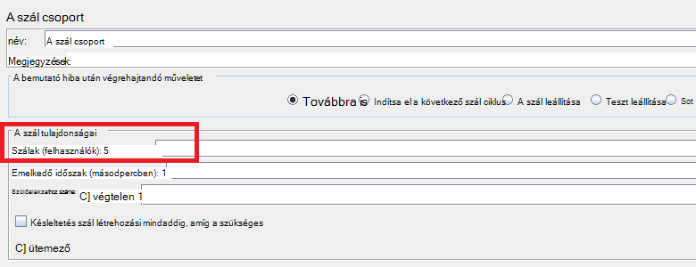
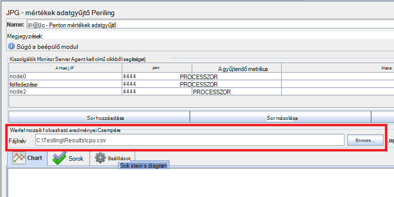
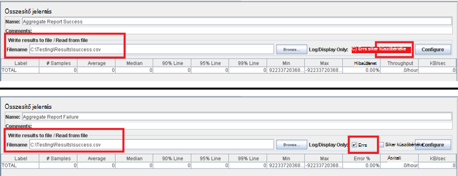
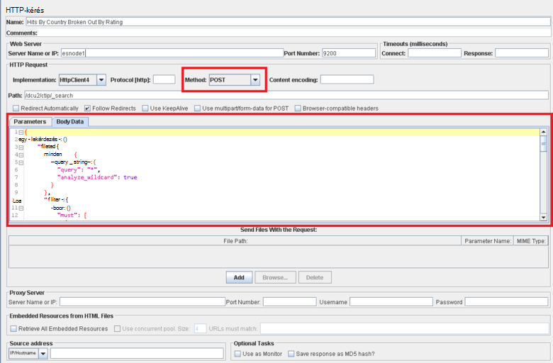

<properties
   pageTitle="Egy olyan JMeter teszttervre végrehajtása Elasticsearch |} Microsoft Azure"
   description="Hogyan kell futtatni a teljesítmény a JMeter Elasticsearch az tesztek indítása"
   services=""
   documentationCenter="na"
   authors="dragon119"
   manager="bennage"
   editor=""
   tags=""/>

<tags
   ms.service="guidance"
   ms.devlang="na"
   ms.topic="article"
   ms.tgt_pltfrm="na"
   ms.workload="na"
   ms.date="09/22/2016"
   ms.author="masashin" />
   
# <a name="implementing-a-jmeter-test-plan-for-elasticsearch"></a>Egy olyan JMeter teszttervre Elasticsearch végrehajtása

[AZURE.INCLUDE [pnp-header](../../includes/guidance-pnp-header-include.md)]

Ez a cikk a [sorozat](guidance-elasticsearch.md)része. 

Szemben Elasticsearch végzett teljesítmény tesztek kerültek végrehajtásra JMeter próba csomagok együtt mint például a fürt való adatfeltöltés feladatokat végző JUnit próba beépített Java-kód használatával. A próba-csomagokat és JUnit kód [hangolása adatok bevitel Elasticsearch Azure a teljesítményt][], és [hangolása adatok összesítése és Elasticsearch Azure a lekérdezési teljesítményt][]ismertetjük.

A dokumentum célja összefoglalva a főbb funkciói nyert megépítése, és ezek futó tesztelje a tervek. Az [Ajánlott eljárások a JMeter](http://jmeter.apache.org/usermanual/best-practices.html) Apache JMeter webhely lapjának több általános tanácsok a hatékony használatához JMeter tartalmazza.

## <a name="implementing-a-jmeter-test-plan"></a>Egy olyan JMeter teszttervre végrehajtása

Az alábbiakban összefoglaljuk az elemeket, fontolja meg egy olyan JMeter teszttervre létrehozása:

- Hozzon létre egy külön szál minden egyes vizsgálathoz kíván végrehajtani. A próba több lépést, többek között a logika vezérlők, időzítő előtti és utáni processzorok, vételezők és a hallgatók is tartalmazhat.

- Ne hozzon létre túl sok beszélgetésekben a szál csoportban. Túl sok a beszélgetésekben okoz a "Ki memória" meghiúsító JMeter kivételek. Szálak, mint egy JMeter kiszolgálón szálak nagyszámú futtatásához megpróbálja kisszámú futó JMeter további alárendelt kiszolgálók hozzáadása akkor célszerűbb.



- Mérje fel, hogy a fürt teljesítményének, részévé a teszttervre a [Perfmon mértékek adatgyűjtő](http://jmeter-plugins.org/wiki/PerfMon/) bővítményt. Az elérhető a normál JMeter bővítmények egyikeként JMeter figyelő. Mentse a nyers teljesítményadatokat vesszővel elválasztott értékek (CSV) formátumú fájlokat, és feldolgozni azokat a vizsgálat befejeződésekor. Hatékonyabb, és kevesebb mint feldolgozása az adatokat, mint a rögzítés közben JMeter a törzs ró. 



Segítségével eszköz ilyen Excel importálni az adatokat, és egy cellatartomány diagramok készítése analitikai céljából.

Vegye figyelembe az alábbi adatok:

- Processzor kihasználtsági minden csomópont a Elasticsearch fürt.

- Minden csomópont lemezről másodpercenként olvasott bájtok számát.

- Ha lehetséges a Processzor fordított idő százalékos aránya bemenet elvégzendő összes csomópont-várakozás. Ez nem mindig lehetséges Windows VMs, de Linux létrehozhat egy egyéni metrikus (-végrehajtási metrikus egységek), amely a következő rendszerhéj parancs *vmstat* csomóponton meghívásához fut:

```Shell
sh:-c:vmstat 1 5 | awk 'BEGIN { line=0;total=0;}{line=line+1;if(line&gt;1){total=total+\$16;}}END{print total/4}'
```

Mező 16 *vmstat* a kimeneti i/o-Várakozás töltött Processzor időpontját tartalmazza. Ez az utasítás működésével kapcsolatos további tudnivalókért lásd: a [vmstat parancsot](http://linuxcommand.org/man_pages/vmstat8.html).

- Bájtok számát küldött, és minden csomópontra a hálózaton keresztül érkezett.

- Külön összesítő jelentés hallgatók segítségével rögzítheti a teljesítmény és a gyakoriság sikeres és sikertelen műveletek. Más fájlokra mutató sikeres és sikertelen adatok rögzítése.



- Tartsa JMeter vizsgálat ügyekhez egyszerűen a lehető lehetővé teszi az adott vizsgálat műveletek teljesítményének közvetlenül összehangolására. A későbbi intézkedést igénylő komplex logikai vizsgálatot esetben fontolja meg, ez egy JUnit tesztcélú logikája encapsulating, és használja a JUnit kérelem bemutató JMeter futtatásához a vizsgálatot.

- HTTP-műveletek, például kérése, a bejegyzés, a helyezése vagy a törlés végrehajtásához használja a HTTP-kérés bemutató. Például Elasticsearch keresések futtatható a bejegyzés lekérdezésekkel, valamint képzések a lekérdezési részleteket a *Szervezet* mezőben:



- Ismételhetőségi és újrafelhasználása Kezeléstechnikai paraméterezni JMeter próba-előfizetések tesztelése. Majd használhatja a parancsfájlok automatizálhatja a próba-előfizetések működését.

## <a name="implementing-a-junit-test"></a>Végrehajtási JUnit vizsgálat

Összetett kódot be egy olyan JMeter teszttervre: hozzon létre egy vagy több JUnit vizsgálatok beépítése. Egy JUnit próba Java integrált fejlesztői környezet (IDE) például Holdas használatával is írhat. Hogyan kell egy megfelelő fejlesztői környezet beállítása [üzembe helyezése a JMeter JUnit bemutató Elasticsearch teljesítmény teszteléshez][] ismertetése.

Az alábbiakban összefoglaljuk JUnit vizsgálat a kód beírásakor célszerű követnie az ajánlott eljárásokat ismerteti:

- Teszt osztálykonstruktor segítségével inicializálni paraméterek átadásakor a tesztet. JMeter használhatja, amely argumentumként egyetlen konstruktorban. A konstruktorban értelmezhető ezt az argumentumot egyes elemei, ahogy az alábbi példa:

```Java
private String hostName = "";
private String indexName = "";
private String typeName = "";
private int port = 0;
private String clusterName = "";
private int itemsPerBatch = 0;

/\* JUnit test class constructor \*/
public ElasticsearchLoadTest2(String params) {
    /* params is a string containing a set of comma separated values for:
        hostName
        indexName
        typeName
        port
        clustername
        itemsPerBatch
    */

    /* Parse the parameter string into an array of string items */
    String delims = "\[ \]\*,\[ \]\*"; // comma surrounded by zero or more spaces
    String\[\] items = params.split(delims);

    /* Note: Parameter validation code omitted */

    /* Use the parameters to populate variables used by the test */
    hostName = items[0];
    indexName = items[1];
    typeName = items[2];
    port = Integer.parseInt(items[3]);
    clusterName = items[4];
    itemsPerBatch = Integer.parseInt(items[5]);

    if(itemsPerBatch == 0)
        itemsPerBatch = 1000;
}
```

- Elkerülése érdekében a bemeneti és kimeneti műveletet vagy más időigényes műveletek a konstruktorban vagy beállítása próba osztály, mert azok végrehajtása minden alkalommal, amikor a JUnit vizsgálat fut. (A azonos JUnit vizsgálatot minden egyes teljesítmény vizsgálathoz JMeter végrehajtott jelentésekkel időpontok sok ezer futtathatja.)

- Fontolja meg inkább egyszeri beállításához drága vizsgálatot eset inicializálni az.

- Ha a teszt bemeneti paramétereket sok van szüksége, próba konfigurációs adatok tárolására egy külön konfigurációs fájl, és konstruktorának adják át az e-fájl helyét.

- Kerülje a fájl elérési út a betöltés próba-kódot a merevlemez kódolás. Ezek okozhat, például a Windows operating systems és Linux közötti különbségek miatt.

- Előfeltételek segítségével jelezheti a JUnit hibáit vizsgálati módszerek, hogy a JMeter nyomon követni őket, és egy üzleti mértékek használni őket. A hiba okát vonatkozó adatokat, ha lehetséges, fázis, ahogy az alábbi példa a félkövér:

```Java
@Test
public void bulkInsertTest() throws IOException {
    ...
    BulkResponse bulkResponse = bulkRequest.execute().actionGet();
    assertFalse(
        bulkResponse.buildFailureMessage(), bulkResponse.hasFailures());
        ...
}
```


[Running Elasticsearch on Azure]: guidance-elasticsearch-running-on-azure.md
[Adatok bevitel Elasticsearch Azure a teljesítmény javítása]: guidance-elasticsearch-tuning-data-ingestion-performance.md
[Üzembe helyezése a JMeter JUnit bemutató Elasticsearch teljesítmény tesztelése]: guidance-elasticsearch-deploying-jmeter-junit-sampler.md
[Adatok összesítése és Elasticsearch Azure a lekérdezési teljesítmény javítása]: guidance-elasticsearch-tuning-data-aggregation-and-query-performance.md
