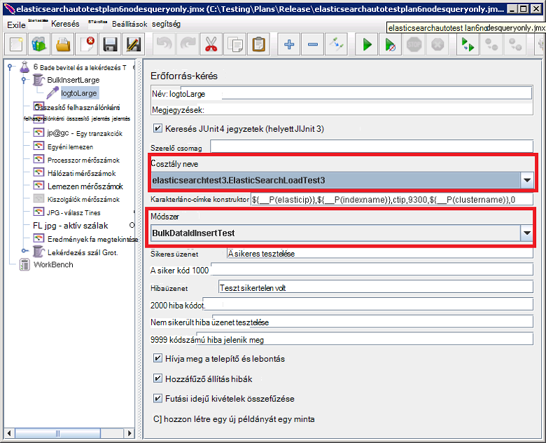

<properties
   pageTitle="Az automatikus Elasticsearch teljesítmény tesztek futó |} Microsoft Azure"
   description="A teljesítmény futásának leírása teszteli a saját környezetben."
   services=""
   documentationCenter="na"
   authors="dragon119"
   manager="bennage"
   editor=""
   tags=""/>

<tags
   ms.service="guidance"
   ms.devlang="na"
   ms.topic="article"
   ms.tgt_pltfrm="na"
   ms.workload="na"
   ms.date="09/22/2016"
   ms.author="masashin"/>
   
# <a name="running-the-automated-elasticsearch-performance-tests"></a>Az automatikus Elasticsearch teljesítmény tesztek fut

[AZURE.INCLUDE [pnp-header](../../includes/guidance-pnp-header-include.md)]

Ez a cikk a [sorozat](guidance-elasticsearch.md)része. 

A dokumentumok [hangolása adatok bevitel Elasticsearch Azure a teljesítmény] és [hangolása adatok összesítésére és a lekérdezési teljesítményt Elasticsearch Azure a] teljesítmény teszteket a minta Elasticsearch fürtre ellen futó számos ismertetik.

E vizsgálatok tudjanak automatizált módon futtatható parancsfájl voltak alapú. A dokumentum ismerteti, hogyan megismételheti tesztek a saját környezetben.

## <a name="prerequisites"></a>Előfeltételek

Az automatikus tesztek csak az alábbiakat:

-  Egy Elasticsearch fürthöz.

- Egy JMeter környezet beállításához, ahogy a dokumentum [létrehozása a teljesítmény Elasticsearch Azure a tesztelés környezet].

- [Python 3.5.1-es](https://www.python.org/downloads/release/python-351/) a JMeter fő virtuális telepítve.


## <a name="how-the-tests-work"></a>Hogyan működnek a tesztek
A vizsgálatok futtatása JMeter történik. A fő JMeter-kiszolgáló betölt egy olyan teszttervre, és átadja JMeter alárendelt kiszolgálók ténylegesen futtassa a teszteket csoportja. A JMeter fő kiszolgáló koordináták a JMeter alárendelt kiszolgálók, majd összegzi az eredményt.

A következő vizsgálat tervek találhatók:

* [elasticsearchautotestplan3nodes.jmx](https://github.com/mspnp/azure-guidance/blob/master/ingestion-and-query-tests/templates/elasticsearchautotestplan3nodes.jmx). A bevitel vizsgálat futtatja a 3-csomópont fürtre fölé.

* [elasticsearchautotestplan6nodes.jmx](https://github.com/mspnp/azure-guidance/blob/master/ingestion-and-query-tests/templates/elasticsearchautotestplan6nodes.jmx). A bevitel vizsgálat futtatja a 6-csomópont fürtre fölé.

* [elasticsearchautotestplan6qnodes.jmx](https://github.com/mspnp/azure-guidance/blob/master/ingestion-and-query-tests/templates/elasticsearchautotestplan6qnodes.jmx). A bevitel és a lekérdezés tesztelése futtatja a 6-csomópont fürtre fölé.

* [elasticsearchautotestplan6nodesqueryonly.jmx](https://github.com/mspnp/azure-guidance/blob/master/ingestion-and-query-tests/templates/elasticsearchautotestplan6nodesqueryonly.jmx). A csak a lekérdezés tesztelése futtatja a 6-csomópont fürtre fölé.


Használhatja az alábbi csomagok kevesebb vagy több csomópontok van szüksége a saját esetek alapjaként vizsgálata.

A próba-előfizetések készíthet, és töltse fel a tesztadatokat egy JUnit kérelem bemutató használatával. A JMeter teszttervre hoz létre futtatja a bemutató, és figyeli a teljesítményadatok Elasticsearch csomópontjait mindegyike.  

## <a name="building-and-deploying-the-junit-jar-and-dependencies"></a>Összeállítását, és üzembe helyezése a JUnit JAR és függőségek
Ajánlott letölteni teljesítmény tesztek futtatásához állíthat össze, és a teljesítmény/junitcode mappában található JUnit tesztek telepítése gombra. Ezek a vizsgálatok a JMeter teszttervre hivatkozik. További tudnivalókért lásd: a "JUnit próba projekt importálása a Holdas" eljárás a dokumentum [egy JMeter JUnit bemutató Elasticsearch teljesítményt teszteléshez üzembe helyezése].

Vannak JUnit tesztek két verziója: 

- [Elasticsearch1.73](https://github.com/mspnp/azure-guidance/tree/master/ingestion-and-query-tests/junitcode/elasticsearch1.73). Ez a kód használata bevitel tesztek végrehajtása. Ezek a vizsgálatok Elasticsearch 1.73 használja.

- [Elasticsearch2](https://github.com/mspnp/azure-guidance/tree/master/ingestion-and-query-tests/junitcode/elasticsearch2). Ez a kód használható lekérdezés tesztek végrehajtása. Ezek a vizsgálatok Elasticsearch 2.1-es és újabb használja.

Java-archív (üveg) fájlt a többi, függőségek, valamint a JMeter gépek másolja. A folyamat ismertetett [üzembe helyezése a JMeter JUnit bemutató Elasticsearch teljesítmény teszteléshez][]. 

> **Fontos** Miután üzembe JUnit teszten, betöltése, és állítsa be a próba-csomagok szintén JUnit próba hivatkozásra, és győződjön meg arról, hogy a BulkInsertLarge szál csoport hivatkozik, a megfelelő üveg fájlt, JUnit osztálynév JMeter eszközzel, és vizsgálati módszer:
> 
> 
> 
> Mentse a frissített vizsgálat tervek a vizsgálatok futtatása előtt.

## <a name="creating-the-test-indexes"></a>A próba indexek létrehozásáról
Minden vizsgálatot hajt végre bevitel, illetve a megadott egyetlen index létrehozása lekérdezéseket a vizsgálat futtatásakor. Kell hozni az indexet, a dokumentumok [hangolása adatok bevitel Elasticsearch Azure a teljesítmény] és [hangolása adatok összesítése és Elasticsearch Azure a lekérdezési teljesítményt] mellékletei ismertetett sémák használata és konfigurálása őket megfelelően a próba forgatókönyv (dokumentum érték engedélyezett/letiltott, több kópiák és stb.) Figyelje meg, hogy a próba-előfizetések feltételezik, hogy az index *ctip*nevű egyetlen típusú tartalmaz-e.

## <a name="configuring-the-test-script-parameters"></a>A próba parancsfájl-paraméterek beállítása
Másolja be az alábbi vizsgálat paraméter parancsfájlok JMeter kiszolgáló számítógépre:

* [run.properties](https://github.com/mspnp/azure-guidance/blob/master/ingestion-and-query-tests/run.properties). Ez a fájl határozza meg, a JMeter próba szálak száma szeretne használni, a vizsgálat (másodpercben), az időtartam csomópont (vagy egy terheléselosztó a Elasticsearch fürt) IP-címét és a csoport neve:

  ```ini
  nthreads=3
  duration=300
  elasticip=<IP Address or DNS Name Here>
  clustername=<Cluster Name Here>
  ```
  
  Szerkesztheti a fájlt, és adja meg a megfelelő értéket a vizsgált és fürt.

* [lekérdezés-konfiguráció – win.ini](https://github.com/mspnp/azure-guidance/blob/master/ingestion-and-query-tests/query-config-win.ini) és a [lekérdezés-config-nix.ini](https://github.com/mspnp/azure-guidance/blob/master/ingestion-and-query-tests/query-config-nix.ini). Két fájlt tartalmazza ugyanazokat az adatokat; a *win* fájl Windows fájlnevekben és a görbék van formázva, és a *nix* fájl formátuma Linux fájlnevekben és elérési út:

  ```ini
  [DEFAULT]
  debug=true #if true shows console logs.

  [RUN]
  pathreports=C:\Users\administrator1\jmeter\test-results\ #path where tests results are saved.
  jmx=C:\Users\administrator1\testplan.jmx #path to the JMeter test plan.
  machines=10.0.0.1,10.0.0.2,10.0.0.3 #IPs of the Elasticsearch data nodes separated by commas.
  reports=aggr,err,tps,waitio,cpu,network,disk,response,view #Name of the reports separated by commas.
  tests=idx1,idx2 #Elasticsearch index(es) name(s) to test, comma delimited if more than one.
  properties=run.properties #Name of the properties file.
  ```

  Ez a JMeter próba-előfizetésére szeretné futtatni, az IP-címek Elasticsearch adatok csomópontok gyűjtött, teljesítménymutatók jön létre, nyers teljesítmény adatokat tartalmazó jelentések és a nevet (vagy nevek pontosvesszővel elválasztott), a index(es) vizsgálandó, ha egynél több megadása a helyek a vizsgálati eredmények fájl szerkesztése , vizsgálatok egymás után futtathatók. Ha a run.properties fájlt egy másik mappába vagy könyvtár található, adja meg a fájl teljes elérési útját a.

## <a name="running-the-tests"></a>A vizsgálatok futtatása

* Másolja a fájl [lekérdezés-test.py](https://github.com/mspnp/azure-guidance/blob/master/ingestion-and-query-tests/query-test.py) JMeter kiszolgáló a számítógépen, a run.properties és a lekérdezés-konfiguráció – win.ini (lekérdezés config, nix.ini) fájlok ugyanabban a mappában.

* Győződjön meg arról, hogy jmeter.bat (Windows) vagy (Linux) jmeter.sh szerepelnek a végrehajtható fájl elérési környezetben.

* Lekérdezés-test.py futtatása a parancssorból a ellenőrzések végrehajtásához:

  ```cmd
  py query-test.py
  ```

* Amikor befejeződött a vizsgálat, az eredmények a készlete vesszővel tagolt értékek (CSV) fájlok lekérdezés-config-(lekérdezés config, nix.ini) máskülönben a megadott módon tárolja. Az Excel segítségével elemezheti és graph ezeket az adatokat.


[Adatok bevitel Elasticsearch Azure a teljesítmény javítása]: guidance-elasticsearch-tuning-data-ingestion-performance.md
[Adatok összesítése és Elasticsearch Azure a lekérdezési teljesítmény javítása]: guidance-elasticsearch-tuning-data-aggregation-and-query-performance.md
[A környezet vizsgálata Elasticsearch Azure a teljesítmény létrehozása]: guidance-elasticsearch-creating-performance-testing-environment.md
[Üzembe helyezése a JMeter JUnit bemutató Elasticsearch teljesítmény tesztelése]: guidance-elasticsearch-deploying-jmeter-junit-sampler.md
