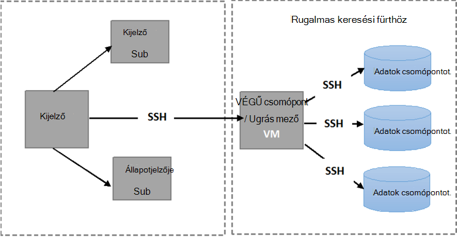

<properties
   pageTitle="Az automatikus Elasticsearch tűrőképessége vizsgálatok futtatása |} Microsoft Azure"
   description="A tűrőképessége futásának leírása teszteli a saját környezetben."
   services=""
   documentationCenter="na"
   authors="dragon119"
   manager="bennage"
   editor=""
   tags=""/>

<tags
   ms.service="guidance"
   ms.devlang="na"
   ms.topic="article"
   ms.tgt_pltfrm="na"
   ms.workload="na"
   ms.date="09/22/2016"
   ms.author="masashin"/>

# <a name="running-the-automated-elasticsearch-resiliency-tests"></a>Az automatikus Elasticsearch tűrőképessége vizsgálatok futtatása

[AZURE.INCLUDE [pnp-header](../../includes/guidance-pnp-header-include.md)]

Ez a cikk a [sorozat](guidance-elasticsearch.md)része.

[Konfigurálása címtárfrissítések]és Azure a Elasticsearch a helyreállítási[elasticsearch-resilience-recovery], azt leírt alapján megállapíthatja, a rendszer mennyire néhány gyakori űrlapok hiba válaszolt, és mennyire helyreállított minta Elasticsearch fürt végrehajtott vizsgálatok sorozata. Tesztek tudjanak automatizált módon futtatható parancsfájl voltak alapú. A dokumentum ismerteti, hogyan kell ismételnie tesztek a saját környezetben. 

Az alábbi esetekben ellenőrzött:

- **Csomópont hiba, és indítsa újra az adatok adatvesztés nélkül**. Adatok csomópont leállítása és újraindítása 5 perc után.
Elasticsearch lett beállítva, hogy ne hozzárendeli a megadott intervallum a hiányzó shards, nincs további I/O merül fel a beszúrási pont áthelyezése a shards. A csomópont újraindítását követően a helyreállítási folyamat felvette a shards a csomóponton vissza naprakész.

- **Katasztrofális adatvesztés csomópont kíséretében**. Adatok csomópont van állítva, és rendelkezik adatokat katasztrofális lemez meghibásodása hasonlóan törlődik. A csomópont majd újraindítása (után az 5 perc) hatékony az eredeti csomóponthoz helyettesítőként eljáró. A helyreállítási folyamat a hiányzó adatok a csomópont Újraépítés igényel, és áthelyezése más csomópontok tartott shards járhat.

- A **hiba csomópontot, és indítsa újra, adatok adatvesztés nélkül, de shard hozzárendelés**. Adatok csomópont leáll, és az azt tartalmazó shards vannak más csomópontok osztani. A csomópont majd újraindítása után, és további hozzárendelés jelentkezett, és a fürt visszaállás parancsot.

- A **folyamatos frissítések**. A fürt minden csomópontjának leállítása és újraindítása egy rövid időtartam hasonlóan gépek éppen újraindítása után a szoftver frissítése után. Egyszerre csak egy csomópont leállt.
Shards nem újra kioszthat, miközben a csomópont nem működik.

## <a name="prerequisites"></a>Előfeltételek

Az automatikus tesztek csak az alábbiakat:

- Egy Elasticsearch fürthöz.

- Egy JMeter környezet beállításához, ahogy a [Teljesítmény tesztelés útmutatást]. 

- Telepítve van a JMeter fő virtuális csak a következő kiegészítéseket.

    - Java futtatókörnyezet 7.

    - Nodejs 4.x.x vagy újabb verziójában.

    - A mely számjegy parancssori eszközök.

## <a name="how-the-scripts-work"></a>A parancsfájlok működése

A próba parancsfájlok célja, hogy a JMeter fő virtuális futtatni. Amikor kijelöl egy futtatásához vizsgálat, a parancsfájlok elvégzi az alábbi műveleteket:

1.  A paraméterek megadott átadása JMeter próba terv indítása.

2.  Másolja az olyan parancsfájlt, ami egy megadott virtuális a fürt teszt szükséges műveleteket hajtja végre. Bármely virtuális, amely tartalmaz egy nyilvános IP-cím vagy a *Jumpbox* virtuális Ez lehet, ha a fürt az [Azure Elasticsearch quickstart útmutató sablon](https://github.com/Azure/azure-quickstart-templates/tree/master/elasticsearch)létrehozása.

3.  Futtassa a parancsfájlt virtuális (vagy Jumpbox).

Az alábbi képen látható az tesztkörnyezetben és Elasticsearch fürt felépítésének. Figyelje meg, hogy a próba parancsfájlok használata biztonságos rendszerhéj (SSH) minden fürt csomópontjának a különböző Elasticsearch műveleteket például leállítása vagy újraindítása csomópontot.



## <a name="setting-up-the-jmeter-tests"></a>Azt vizsgálja, a JMeter beállítása

Azt vizsgálja, a címtárfrissítések futtatása előtt állíthat össze, és a tűrőképessége/jmeter/vizsgálatok mappában található JUnit tesztek üzembe. Ezek a vizsgálatok a JMeter teszttervre hivatkozik. További információ az eljárás "JUnit próba projekt importálása a Holdas" című [üzembe helyezése a JMeter JUnit bemutató Elasticsearch teljesítmény teszteléshez][].

A következő mappákban tárolt JUnit tesztek két verziója különböztethető meg:

- **Elasticsearch17.** A projekt ebbe a mappába a fájl Elasticsearch17.jar hoz létre. Használja a üveg Elasticsearch verziók teszteléshez 1.7.x

- **Elasticsearch20**. A projekt ebbe a mappába a fájlok Elasticsearch20.jar hoz létre. Használja a üveg Elasticsearch verzió 2.0.0 teszteléshez és újabb verziók

A megfelelő üveg fájlt, és a többi, függőségek, másolja a JMeter gépek. A folyamat "Üzembe helyezése JMeter JUnit vizsgálat" [üzembe helyezése a tesztelés Elasticsearch teljesítményt egy JMeter JUnit bemutató]eljárással leírása.

## <a name="configuring-vm-security-for-each-node"></a>Az egyes csomópontok virtuális biztonsági beállítása

A próba parancsfájlok szükség egy hitelesítési tanúsítványt a fürt minden Elasticsearch csomópontjának telepíthető. Ezzel a parancsfájlok futtatásának, hogy az automatikusan csatlakoznak az egyes VMs, a felhasználónév és jelszó rákérdezés nélkül.

Kezdje azzal, hogy az a Elasticsearch fürt (vagy a Jumpbox virtuális) csomópontját egyik bejelentkezés, és futtassa a következő parancsot a hitelesítési kulcs létrehozása:

```Shell
ssh-keygen -t rsa
```

Miközben Elasticsearch csomópont (vagy Jumpbox) kapcsolódik, a következő parancsokat minden csomópont az általa Elasticsearch fürt. Csere `<username>` neve és az egyes virtuális és a csere érvényes felhasználó `<nodename>` a tartománynév vagy a szolgáltatója a Elasticsearch csomópont virtuális IP-címét.
Figyelje meg, hogy kéri a jelszót a felhasználó ezek a parancsok futtatásakor.
További információ: [SSH login jelszó nélkül](http://www.linuxproblem.org/art_9.html):

```Shell
ssh <username>@<nodename> mkdir -p .ssh (
cat .ssh/id\_rsa.pub | ssh <username>*@<nodename> 'cat &gt;&gt; .ssh/authorized\_keys'
```

## <a name="downloading-and-configuring-the-test-scripts"></a>Le, és a vizsgálat parancsfájlok konfigurálása

A próba parancsfájlok egy mely számjegy tárban tárolnak találhatók. Az alábbi eljárással töltse le és állítsa be a parancsfájlok.

A számítógépen JMeter fő hol tesztek futtatható nyisson meg egy asztali ablakot mely számjegy (mely számjegy Bash), és a következőképpen, parancsfájlok tartalmazó tárházba klónozhatja:

```Shell
git clone https://github.com/mspnp/azure-guidance.git
```

Helyezze át a tűrőképessége-vizsgálatok mappába, és futtassa a következő parancsot a függőségeket tesztek futtatásához szükséges telepítése:

```Shell
npm install
```

Ha a JMeter fő a Windows rendszer fut, letöltése [Plink](http://www.chiark.greenend.org.uk/~sgtatham/putty/download.html), amely olyan, a parancssor az gitt Telnet ügyfél számára. Másolja a végrehajtható Plink a tűrőképessége-vizsgálatok/tár mappába.

Ha a JMeter fő Linux fut, nem kell Plink letöltése, de állítsa be a jelszó nélküli SSH a JMeter diaminta és Elasticsearch csomópont vagy az eljárás című témakörben ismertetett lépéseket követve használt Jumpbox között kell "konfigurálása virtuális csomópontok biztonsági." 

A következő konfigurációs paramétereinek módosítása a `config.js` fájl a tesztkörnyezetben és Elasticsearch fürt megfelelően. Ezek a paraméterek megegyeznek a összes vizsgálat:

| név | Leírás | Alapérték |
| ---- | ----------- | ------------- |
| `jmeterPath` | Helyi elérési útját JMeter. | `C:/apache-jmeter-2.13` |
| `resultsPath` | Relatív könyvtár, ahol az a parancsfájl kiírása eredménye. | `results` |
| `verbose` | Azt jelzi, hogy a parancsprogram kimenet részletes üzemmódban-e. | `true` |
| `remote` | Azt jelzi, hogy a JMeter vizsgálatok futtatása helyi vagy távoli kiszolgálókon. | `true` |
| `cluster.clusterName` | A Elasticsearch fürt neve. | `elasticsearch` |
| `cluster.jumpboxIp`         | A Jumpbox gép IP-címét.                 |-|
| `cluster.username`          | A felügyeleti felhasználó hozott létre a fürt telepítése során. |-|
| `cluster.password`          | A felügyeleti felhasználó jelszavát.                        |-|
| `cluster.loadBalancer.ip`   | A Elasticsearch terheléselosztó IP-címét.    |-|
| `cluster.loadBalancer.url`  | A terheléselosztó alap URL-címe                          |-|

## <a name="running-the-tests"></a>A vizsgálatok futtatása

Helyezze át a tűrőképessége-vizsgálatok mappába, és futtassa az alábbi parancsot:

```Shell
node app.js
```

A következő menü jelenjen meg:


Írja be a használni kívánt eset: `11`, `12`, `13` vagy `21`. 

Miután kiválasztotta a példa, a vizsgálat automatikusan fog futni. Az eredmények formájában vesszővel tagolt (CSV) fájlok az eredmények könyvtárában létrehozott mappában tárolódnak. Minden futtatásakor a saját eredmények mappája tartalmaz.
Az Excel segítségével elemezheti és graph ezeket az adatokat.

[Running Elasticsearch on Azure]: guidance-elasticsearch-running-on-azure.md
[Tuning Data Ingestion Performance for Elasticsearch on Azure]: guidance-elasticsearch-tuning-data-ingestion-performance.md
[tesztelés útmutatást teljesítmény]: guidance-elasticsearch-creating-performance-testing-environment.md
[JMeter guidance]: guidance-elasticsearch-implementing-jmeter.md
[Considerations for JMeter]: guidance-elasticsearch-deploying-jmeter-junit-sampler.md
[Query aggregation and performance]: guidance-elasticsearch-query-aggregation-performance.md
[elasticsearch-resilience-recovery]: guidance-elasticsearch-configuring-resilience-and-recovery.md
[Resilience and Recovery Testing]: guidance-elasticsearch-running-automated-resilience-tests.md
[Üzembe helyezése a JMeter JUnit bemutató Elasticsearch teljesítmény tesztelése]: guidance-elasticsearch-deploying-jmeter-junit-sampler.md
