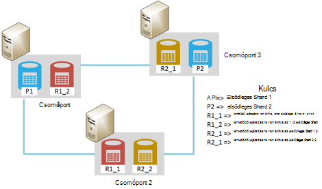
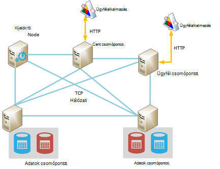
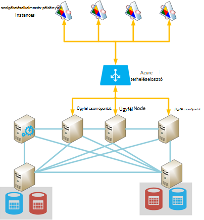
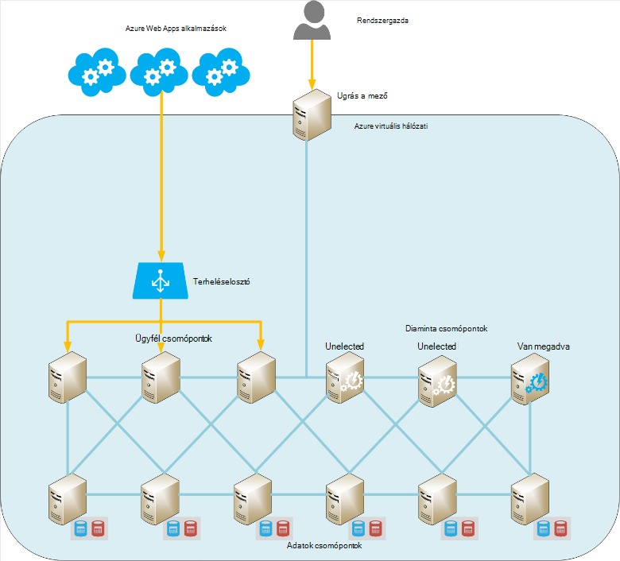

<properties
   pageTitle="Azure Elasticsearch futó |} Microsoft Azure"
   description="Hogyan lehet telepítése, beállítása és Azure Elasticsearch futtatni."
   services=""
   documentationCenter="na"
   authors="dragon119"
   manager="bennage"
   editor=""
   tags=""/>

<tags
   ms.service="guidance"
   ms.devlang="na"
   ms.topic="article"
   ms.tgt_pltfrm="na"
   ms.workload="na"
   ms.date="09/22/2016"
   ms.author="masashin"/>

# <a name="running-elasticsearch-on-azure"></a>Azure Elasticsearch fut

[AZURE.INCLUDE [pnp-header](../../includes/guidance-pnp-header-include.md)]

Ez a cikk a [sorozat](guidance-elasticsearch.md)része. 

## <a name="overview"></a>– Áttekintés

A dokumentum egy rövid bevezető Elasticsearch általános szerkezetét, majd ismerteti, hogyan alkalmazhat egy Elasticsearch fürthöz Azure használatával. Úgy, hogy elérje a gyakorlati tanácsok a egy Elasticsearch fürt, a különböző funkcionális teljesítmény és a rendszer, valamint figyelembe véve, hogyan kell meghajtó az igényeknek megfelelően alakíthatja a konfiguráció és a választott topológia követelményeknek összpontosítva telepítése.

> [AZURE.NOTE] Ez az útmutató azt feltételezi, hogy néhány egyszerű ismerős [Elasticsearch][].

## <a name="the-structure-of-elasticsearch"></a>Elasticsearch felépítése 

Elasticsearch nagymértékben optimalizált a használni kívánt keresőprogram dokumentum adatbázis. Dokumentumok JSON formátumban vannak szerializálásának. Adatok az indexek, bár a részletek vannak kivett nézetben, és nem teljesen megértéséhez Lucene Elasticsearch használatához szükséges [Apache Lucene][], használatával megvalósított kell tartani.

### <a name="clusters-nodes-indexes-and-shards"></a>Fürt, csomópontok, indexek és shards

Elasticsearch egy csoportosított architektúra adatok elosztása több csomópontot, és adja meg a magas elérhetősége való replikáció sharding használó hajtja végre. Indexek dokumentumot tárolja. A felhasználó megadhatja a mezőket a dokumentumban használt azonosításához index belül, vagy a rendszer hozhat létre egy kulcsmező és értékek automatikusan. Az index dokumentumok fizikailag rendezésére szolgálnak, és a tőketörlesztés mértékét azt jelenti, dokumentumok kereséséhez. 

Index shards készlete tartalmazza. Dokumentumok egyenletesen milyen mértékben térnek el egy index legfontosabb értékeit, és a tárgymutató shards száma alapján ujjlenyomat mechanizmusa használatával shards keresztül. 

Indexek replikálhatók. Ebben az esetben az index valamennyi shard másolja a program. Elasticsearch biztosítja, hogy minden eredeti shard az index (néven "elsődleges shard") és a replika mindig állnak csomópontjai. Amikor a dokumentum hozzáadása vagy módosítása, az összes írni az elsődleges shard, azután pedig a minden kópia a műveleteket. 

Az alábbi ábrán a egy három csomópontok tartalmazó Elasticsearch fürt alapvető szempontjait. Létrehozott index, amely az egyes shard (az összes hat shards) két kópiákkal két elsődleges shards áll.



*Egy egyszerű Elasticsearch fürt, amelyben két elsődleges csomópontok és kópiák két csoportja*

Ez a fürt elsődleges shard 1 és 2 elsődleges shard találhatók külön csomópontok segíti a betöltés egyenleg át őket. A replikák hasonló módon van meghatározva. Nem sikerül egy csomópontra, a hátralévő csomópontok esetén elegendő információt ahhoz, hogy a rendszer továbbra is a működését. Ha szükséges, Elasticsearch elősegíti egy replika shard egy elsődleges shard lesz, ha a megfelelő elsődleges shard nem érhető el.

### <a name="node-roles"></a>Csomópont szerepkörök

A csomópontok Elasticsearch fürt végezheti el a következő szerepkörök:

- **Adatok csomópontot** , amely egy vagy több shards index adatokat tartalmazó tárolható.

- Egy **ügyfél csomópont** adatait indexelni, de nem rendelkezik a megfelelő adatokat csomópontra ügyfélalkalmazásokban beérkező megkeresések kezeli.
 
- A **fő csomópontot** , amely nem tartsa lenyomva az ujját adatait indexelni, de, amely a fürt adatkezelési műveletek, például fenntartása hajt végre és terjesztése körül a fürt útválasztási adatok (a listában, amelyek csomópontjainak mely shards tartalmaznak) annak megállapítása, mely csomópontok érhetők el, áthelyezés shards, csomópontok jelennek meg, és eltűnik, és helyreállítási koordinálása csomópont hiba után. Több csomópontok konfigurálhatók mesteralakzatok, de csak az egyik ténylegesen választanak fő feladatait. Ha nem sikerül a csomópontot, egy másik election esedékes, és más jogosult fő csomópontok egyike választják és átvétele.

> [AZURE.NOTE]A kijelölt fő csomópontot a fürt szempontjából fontos. A többi csomópont pingelése, hogy rendszeresen győződjön meg arról, hogy az még elérhető. A kijelölt fő csomópont egyben adatok csomópontot, ha van egy esélye annak, hogy a csomópont előfordulhat, hogy elfoglalt és fail: ezek a ping válaszolni. Ebben az esetben a fő tekinteni nem sikerült, és egy másik fő csomópontok helyén van megadva. 

 Az alábbi ábrán a kijelölt mesteralakzat, az ügyfél és az adatok csomópontok Elasticsearch fürt leszűkíthetik topológiában.



*Egy csomópontok különböző típusú megjelenítő Elasticsearch fürthöz*

### <a name="costs-and-benefits-of-using-client-nodes"></a>A költségek, illetve az ügyfél csomópontok használatának előnyei

Ha egy alkalmazás elküld egy Elasticsearch fürthöz lekérdezés, a csomópontot, amelyhez az alkalmazás kapcsolódik a felelős a irányítja a lekérdezési folyamat. A csomópont továbbítja az értekezlet-összehívást minden adat csomópontot, és az eredmények az összesített adatok Visszatérés az alkalmazás összegyűjti. Lekérdezés összesítések és más számítások jár, ha a csomópontot, amelyhez az alkalmazás kapcsolódik után az adatok visszakeresése minden más csomópontok hajtja végre a szükséges műveleteket. A pont/összegyűjtése folyamat igénybe vehet, jelentős feldolgozás és a memória erőforrásait.

Ezeket a műveleteket a kijelölt ügyfél csomópontok használatával lehetővé teszi, hogy adatokat csomópontok kezelésére és adattárolás pontosításához. A eredménye, hogy hány használó összetett lekérdezéseket és összesítések forgatókönyvekben használatuk előnyeivel dedikált ügyfél csomópontot. A kijelölt ügyfél csomópontok használatával hatásait azonban valószínűleg változik attól függően, hogy a forgatókönyv, terhelést és fürt méretét. 

> [AZURE.NOTE] Olvassa el az [adatok összesítése beállítása és Elasticsearch Azure a lekérdezési teljesítményt][] további információt a beállítási folyamat.

### <a name="connecting-to-a-cluster"></a>Csatlakozás fürthöz

Elasticsearch az ügyfél-alkalmazások létrehozásába és kérelem küld fürt közzététele a REST API-khoz sorozata. Ha a .NET-keretrendszer használatával alkalmazások fejlesztéséhez, két magasabb szintű API-khoz is a rendelkezésére állnak – [Elasticsearch.Net és FÉSZEKBŐL][].

Ügyfélalkalmazások Java használatával hoz létre, ha a [Csomópont ügyfélprogram API][] segítségével létrehozhat ügyfél csomópontok dinamikusan és felveheti azokat a fürthöz. Ügyfél csomópontjainak létrehozásával dinamikusan akkor hasznos, ha a rendszer viszonylag kevés élettartamú kapcsolatokat használja. A csomópont API segítségével létrehozott ügyfél csomópontok találhatók, a fürthöz útválasztás leképezése (a részletek, amelyek csomópontjainak mely shards tartalmaznak) alapján a fő csomópontot. Ez az információ lehetővé teszi, hogy közvetlenül csatlakozhat az indexelés és a lekérdezés adatait, szükség lehet egyéb API-k használata esetén, mely számának csökkentése a megfelelő csomópontokat Java-alkalmazások.

Ezt a megközelítést költsége a terhelést a igénylése az ügyfél csomópontot a fürt be. Ha sok ügyfél csomópontok jelenik meg, és gyorsan eltűnik, milyen következményekkel járnak fenntartása, és a fürt útválasztási térkép terjesztése jelentős válhat.

Az alábbi ábrán a konfiguráció használó egy terheléselosztó és kéréseket irányítja meg ügyfél csomópontok, bár az azonos stratégia való csatlakozáshoz közvetlenül adatok csomópontok ha ügyfél csomópontok nem használják.



*Kapcsolódás egy Elasticsearch fürthöz keresztül az Azure terheléselosztó ügyfél szolgáltatásalkalmazás-példányok*

> [AZURE.NOTE]Nyilvános internetkapcsolat a fürt jelenítik meg az [Azure betöltése terheléselosztó][] is használhatja, vagy használhatja a [belső terheléselosztó][] , ha az ügyfél-alkalmazások és a fürt található teljes egészében virtuális magánhálózaton (VNet).

### <a name="node-discovery"></a>Csomópont feltárás

Elasticsearch alapul-társközi kommunikációt, így más fürt csomópontjai felfedezése a életciklusáról a fontos része csomópontot. Csomópont feltárás lehetővé teszi, hogy a fürtre, ami viszont lehetővé teszi a fürt, ha át kívánja méretezni átlátszó dinamikusan hozzáadott új adatok csomópontok. Ezenkívül adatok csomópont nem sikerül a többi csomópontot a kommunikáció kérelmekre válaszolni, ha fő csomópont eldöntheti, hogy nem sikerült az adatok csomópontot, és a szükséges lépéseket, hogy volt működési adatok csomóponton eközben tartsa a shards hozzárendeli.

A feltáráshoz használt modulról Elasticsearch csomópont feltárás kezeli. A feltáráshoz használt modul az beépülő modul, amely egy másik feltárás mechanizmusa használandó lehet másikra váltani. Az alapértelmezett feltárás modul ([Zen][]) hatására a ping kérések más csomópontok kereshetők ugyanabba a hálózatba kibocsátása csomópontot. Ha más csomópontok válaszol, azok pletykákat Exchange információkat. A fő csomópont terjesztése shards át az új csomópontra, (Ha egy adatok csomópont), majd a fürt visszaállás. A Zen feltárás modul is képes a fő election folyamat és a protokoll csomópont hiba észlelését szabályzó.

Ezenkívül rendszerben Elasticsearch csomópontok Azure virtuális gépeken futó (VMs), ha csoportos csevegés nem támogatott. A okokból konfigurálja a Zen felfedezése egyedi üzenetküldés és adja meg a elasticsearch.yml konfigurációs fájl érvényes kapcsolattartó csomópontok listáját.

Ha egy Elasticsearch fürthöz Azure virtuális hálózatból üzemeltet, akkor megadhatja, hogy a magánjellegű DHCP kiosztott IP-címzett minden megadott virtuális a fürt továbbra is lefoglalt (statikus). Beállíthatja, hogy Zen feltárás egyedi üzenetküldés ezek statikus IP-cím használatával. A dinamikus IP-címek VMs használja, ha ne feledje, hogy ha egy virtuális leáll, és újraindul azt rendelhető így feltárás nehézsége új IP-címet. Ebben az esetben kezelendő válthat a Zen feltárás modul az [Azure felhő beépülő modul][]. A beépülő modul Azure az előfizetés adatai alapján feltárás eljárást végrehajtásához az Azure API-t használja.

> [AZURE.NOTE]Az Azure felhő beépülő modul aktuális verziójának használatához a Java keystore Elasticsearch a csomóponton az Azure előfizetéshez tartozó adatkezelési tanúsítványának telepítése, és adja meg a helyet, és a hitelesítő adatok eléréséhez a keystore a elasticsearch.yml fájlban. Ez a fájl egyszerű szövegként kell tartani, így létfontosságú biztosítása csak érhető el a fájlt a fióknak a Elasticsearch szolgáltatást futtató. 
> 
> Ezenkívül ezt a megközelítést valószínűleg nem kompatibilis Azure erőforrás-kezelő telepítések. Az alábbi okai lehetnek javasoljuk, hogy statikus IP-címeket használja a fő csomópontok, és használja a csomópontok Zen feltárás egyedi végig a fürt üzenetküldés végrehajtásához. Az alábbi beállításokkal (írt egy minta adatok csomópont elasticsearch.yml fájlból), az a host IP-címek a fürt fő csomópontok hivatkozás:

```yaml
discovery.zen.ping.multicast.enabled: false  
discovery.zen.ping.unicast.hosts: ["10.0.0.10","10.0.0.11","10.0.0.12"]
```

## <a name="general-system-guidelines"></a>A rendszer általános útmutató

Elasticsearch futtatását is lehetővé teszi a különféle számítógépeknél fürthöz csúcsteljesítményű kiszolgálót egyetlen hordozható számítógépről alaptartományban. Azonban memóriát, számítások hatvány és gyors lemezek, amely a további erőforrások is elérhető annál hatékonyabb teljesítményét. Az alábbiakban összefoglaljuk az egyszerű hardver- és szoftverkövetelményei Elasticsearch futtatásához.

### <a name="memory-requirements"></a>A memória vonatkozó követelmények 

Tárolja az adatokat a memóriában sebesség Elasticsearch kísérel meg. Egy gyártási kiszolgálójához egy tipikus enterprise és az Azure a kereskedelmi telepítési mérsékelt méretű csomópont 14GB és 28GB RAM (D3 vagy D4 VMs) között kell rendelkeznie. **Húzza szét a betöltés további csomópontok, hanem a több memóriát létrehozása csomópontok keresztül** (Kísérletek van jelenik meg, hogy nagyobb csomópontok használata több memóriát okozhatják a hiba esetén kiterjesztett helyreállítás időpontok.) Jó helyen jár Bár nagyon sok kis csomópontok fürt létrehozása növelheti a rendelkezésre állásának és átviteli, azt is ügyfélszolgálatra kezelését és karbantartását ilyen rendszer részt munkamennyiség.

**A rendelkezésre álló memória a Elasticsearch halommemória egy kiszolgálón 50 % -os kiosztani**. Ha használja Linux beállítása a ES_HEAP_SIZE környezeti változó Elasticsearch futtatása előtt. Azt is megteheti, ha Windows vagy Linux rendszerhez használja, megadhatja a memóriaméret a `Xmx` és `Xms` paraméterek Elasticseach indításakor. Mindkét paraméter megadása elkerülése érdekében a Java virtuális gép (JVM) átméretezése a futásidőben halom azonos értékre. Azonban **nem 30 GB-nál több foglalni**. A hátralévő memória használata az operációs rendszer gyorsítótárban.

> [AZURE.NOTE]Elasticsearch a Lucene tár létrehozása és kezelése az indexek segítségével. Lucene struktúrák merevlemez-alapú formátum használata, és a gyorsítótárban lévő szerkezetek gyorsítótárazás nagyban kényelmesebb teljesítményét.

Ne feledje, hogy a legnagyobb optimális felhalmozódott Java egy 64 bites számítógépen feletti 30GB. A méret Java-bővített mechanizmusa használata a halom objektumokat hivatkozó vált, amely növeli az egyes objektumokra memória követelményei és csökkenti a teljesítmény. 

Az alapértelmezett Java szemétgyűjtő (egyidejű megjelölés és takarítás) is előfordulhat, hogy optimálisan alszint végrehajtani, ha a felhalmozódott 30 GB felett. Nem jelenleg ajánlott váltani szeretne egy másik szemétgyűjtő, mint Elasticsearch és Lucene csak teszteltük az alapértelmezett szemben.

Nem overcommit memóriahasználat, a csere fő memória lemezre szigorúan hatással a teljesítményre. Ha lehetséges, a csere teljesen letiltása (a részletek attól függenek, az operációs rendszer). Ha ez nem lehetséges majd engedélyezze a *mlockall* beállítást a Elasticsearch konfigurációs fájl (elasticsearch.yml) az alábbi képlettel történik:

```yaml
bootstrap.mlockall: true
```

Konfigurációs beállítás hatására a JVM zárolásához a memóriahasználat, és nem engedi, az operációs rendszer által éppen lapozó.

### <a name="disk-and-file-system-requirements"></a>Lemez- és rendszerkövetelmények

Biztonsági prémium tároló shards tárolására szolgáló adatok lemez használata. Lemezen kell méretezett a tartsa lenyomva az ujját a legnagyobb mennyiségű adat előtérbe a shards, bár később fel szeretné további lemez lehetséges. Egy shard bővítheti a csomóponton több lemezre.

> [AZURE.NOTE]Elasticsearch tárolt mezők adatainak tömöríti a LZ4 algoritmus használatával, és a-tól Elasticsearch 2.0-s igény szerint módosíthatja a tömörítési típus. A tömörítési algoritmus DEFLATE a *zip* - és *gzip* segédprogramok által használt válthat. Ez a módszer tömörítés további erőforrás-igényes folyamat, de vegye figyelembe az archivált naplóadatok használja. Ezt a megközelítést segíthet tárgymutató méretének csökkentése érdekében.

Nem fontos, hogy minden fürt csomópontjai van-e a lemez elrendezését és a kapacitás. Összehasonlítás más fürt csomópontjai nagyon nagy teljesítményű csomópont azonban több adatot fog vonzhat webhelyére, és megnövelt feldolgozás power adat kezelésére van szükség. Ezért a csomópont előfordulhat, hogy más csomópontok "meleg" képest, és ez hatással lehet a, a teljesítményére.

Ha lehetséges használja a RAID 0 (csíkozás). Más űrlapokat RAID eltérés áll fenn és tükrözési végrehajtása Elasticsearch saját magas availablility megoldás kópiák formájában biztosít szükségtelen.

> [AZURE.NOTE]Előtt Elasticsearch 2.0.0 sikerült is alkalmazhat a szoftver szintjén csíkozást több könyvtárak a *path.data* konfigurációs beállítások megadásával. Ezen az űrlapon csíkozást Elasticsearch 2.0.0, a nem támogatott. Ehelyett különböző shards különböző elérési utak lehet osztani, de az összes fájl a egy egyetlen shard írandó ugyanazt az elérési utat. Ha csíkozást van szüksége, meg kell paritásos adatok az operációs rendszer vagy a hardver szintjén. 

A teljes méretűre állíthatja a tárterület-átviteli minden **virtuális egy dedikált prémium tárterület-fiókkal kell rendelkeznie**.

A Lucene tár sok fájl segítségével index adatok tárolására, és Elasticsearch nagyszámú csomópontok között, és az ügyfelekkel kidolgozása sockets is megnyithatók. Győződjön meg arról, hogy az operációs rendszer támogatja a megfelelő számú fájl megnyitása leíró (legfeljebb 64000, ha nem áll rendelkezésre elegendő memória) van beállítva. Figyelje meg, hogy az alapértelmezett konfiguráció a sok Linux terjesztését az korlátozza a fájl megnyitása leíró 1024, hogy melyiket érdemes sokkal túl kicsi.

Elasticsearch történő optimalizálásához adatfájlok és az indexek egyidejű hozzáférést memória megfeleltetve (mmap) I/O és Java új I/O (NIO) kombinációját használja. Ha Linux használja, konfigurálja a győződjön meg arról, hogy van elegendő a virtuális memória rendelkezésre álló 256K memória térkép funkcióival kapcsolatos szóközzel az operációs rendszer.

> [AZURE.NOTE]Sok Linux terjesztését alapértelmezett használata az teljesen valós várólista (CFQ) ütemező rendezése adatok lemezre írni. Ez az ütemező nem SSD van optimalizálva. Fontolja meg az NOOP ütemező vagy a határidő ütemező, amelyek mindkettő SSD az még hatékonyabb használatához az operációs rendszer újbóli.

### <a name="cpu-requirements"></a>Processzor vonatkozó követelmények

Azure VMs érhetők el a Processzor konfigurációk esetén számos támogató 1 és 32 magmintákat között. Egy adatok csomópont jó kiindulási pont egy szabványos DS-sorozat virtuális, és jelölje ki bármelyik a DS3 (4 magmintákat) vagy D4 (8 magmintákat) termékváltozatok. A DS3 14GB RAM, is tartalmaz, miközben a DS4 28GB tartalmazza. 

A GS-sorozat (a tárhely prémium) és a G-sorozat (normál tároló) használja a Xeon E5 V3 processzorok, amelyek esetében, amelyek jelentősen számítási igénylő, például a nagyméretű összesítések munkaterhelésekből hasznosak lehetnek. Legfrissebb információkért keresse fel a [virtuális gépeken futó méretét][].

### <a name="network-requirements"></a>Hálózati vonatkozó követelmények

Elasticsearch 1 és 10Gbps, attól függően, hogy a méret és a fürt, alkalmazza a illékonyság között a hálózat sávszélessége szükséges. Elasticsearch áttelepíti a shards csomópontok között, további csomópontok fürthöz kerülnek. Elasticsearch feltételezi, hogy minden csomópontok közötti kommunikáció idő nagyjából egyenlő, és nem tartja meg azokat a csomópontokat tartott shards relatív helye. Emellett a replikáció is merülnek fel jelentős hálózati I/O shards között. Az alábbi okai lehetnek, **ne hozzon létre, amelyek különböző régiókban csomópontok fürt**.

### <a name="software-requirements"></a>Szoftverkövetelmények

Elasticsearch futtatását is lehetővé teszi, a Windows vagy Linux rendszerhez. A Elasticsearch szolgáltatás telepítve van, mint Java üveg tár, és a Elasticsearch csomag az szereplő Java tárakat a függőséget tartalmaz. Telepíteni kell a Java 7 (frissítés 55 vagy újabb) vagy a Java 8 (frissítés 20 vagy újabb verzió) JVM Elasticsearch futtatásához.

> [AZURE.NOTE]Eltérő *Xmx* és *Xms* memória paraméterek (a megadott parancssori kapcsolók a Elasticsearch motor – lásd: [memória követelmények][]) ne módosítsa az alapértelmezett JVM konfigurációs beállítások. Elasticsearch megtervezni a következő használja az alapértelmezett értékeket; őket okozhatják detuned válik, és végezze el a rosszul Elasticsearch.

### <a name="deploying-elasticsearch-on-azure"></a>A Azure Elasticsearch üzembe helyezése

Bár nem egy példányát Elasticsearch és üzembe nehezen csomópontok és való telepítéséről és konfigurálásáról Elasticsearch mindegyikre számos létrehozása lehet egy időigényes, és a hiba-támadásokkal folyamat. Tervezi Elasticsearch futó Azure VMs, esetén három lehetőség közül választhat, hogy csökkentheti az esetleges hibáit.

- Az erőforrás-kezelő Azure [sablon](https://azure.microsoft.com/marketplace/partners/elastic/elasticsearchelasticsearch/) használata Azure piactérről. Ezzel a sablonnal elasztikus hozza létre. Azt, hogy vehessen fel kereskedelmi kapcsolatos fejlesztések, például a védelem, Marvel, figyelő és így tovább.

- Az Azure quickstart útmutató [sablon](https://github.com/Azure/azure-quickstart-templates/tree/master/elasticsearch) használatával a fürt összeállítása. Ez a sablon alapján a Windows Server 2012 vagy Ubuntu Linux 14.0.4 fürt hozhat létre. Lehetővé teszi például az Azure fájltároló kísérleti szolgáltatások használata. Ez a sablon a kutatási és a tesztelés feladatok a dokumentumban használható.

- Automatikus, vagy futtassa a felügyelet nélküli parancsprogramok használatával. Létrehozhat és üzembe egy Elasticsearch fürthöz parancsprogramok érhetők el a [GitHub tárházba][elasticsearch-scripts]

## <a name="cluster-and-node-sizing-and-scalability"></a>Fürt és csomópont méretezése és méretezhetőség: 

Elasticsearch lehetővé teszi, hogy egy telepítési topológiák, eltérő követelményei és a szintek skála támogatására. Ez a szakasz ismerteti, hogy néhány gyakori topológiák, és ismerteti a szempontok alapján a következő topológiák fürt végrehajtásához.

### <a name="elasticsearch-topologies"></a>Elasticsearch topológiák

Az alábbi ábra bemutatja a kiindulási pont Azure-Elasticsearch topológia megtervezése:



*Javasolt a kiindulópont Azure-Elasticsearch fürtre készítéséhez*

Ez a topológia hat adatok csomópontokat tartalmazza együtt három ügyfél csomópontok és három fő csomópont (csak az egyik kijelölt fő csomópontot, a másik két érhetők el a választás a kijelölt mesteralakzat fejeződjön be.) Minden csomópont áll rendelkezésre, mint egy külön virtuális. Azure webalkalmazások ügyfél csomópontok keresztül egy terheléselosztó címzettet tartalmaznak. 

Ebben a példában a csomópontokat és a webalkalmazások tárolnak hatékony át a külső világ elkülöníti azonos virtuális hálózaton. Ha a fürt van szüksége lesz elérhető külső felhasználókkal (valószínűleg részeként a helyszíni ügyfelek magában foglaló hibrid megoldást), majd is használhatja az Azure terheléselosztó adja meg a nyilvános IP-cím, de ügyeljen elővigyázatosságból, további biztonsági ezzel az illetéktelen hozzáférést megakadályozására a fürt kell. 

Nem kötelező "Ugrás" jelölve egy virtuális, amely csak a rendszergazdák számára érhető el. A virtuális tartalmaz a virtuális hálózat, hanem egy szemben lévő lehetővé teszi a rendszergazda bejelentkezési egy külső hálózatot (Ez a bejelentkezési kell védett erős jelszavak vagy tanúsítvány használatával) a hálózati kapcsolat passzív hálózati kapcsolat. Rendszergazdaként jelentkezzen be az Ugrás párbeszédpanel, és csatlakoztassa a tárból közvetlenül a csomópontok a fürt. 

Alternatív módszer a webhely VPN egy szervezet és a virtuális hálózat között, vagy a [készült ExpressRoute][] áramkörök használata a virtuális hálózathoz való csatlakozáshoz tartalmazzák. Ezek a mechanizmusok a fürt rendszergazdai hozzáférése anélkül, hogy nyilvános internetkapcsolat a fürt teszi lehetővé.

Virtuális elérhetősége megtartásához az adatok csomópontok Azure elérhetősége mindazon vannak csoportosítva. Hasonlóképpen az ügyfél csomópontok tartják egy másik elérhetőségének beállítása, és egy harmadik elérhetőségének beállítása a fő csomópontok tárolja.

Ez a topológia viszonylag Gyerekjáték méretezése, egyszerűen vehet fel további csomópontok a megfelelő típusú, és győződjön meg arról, hogy vannak beállítva a elasticsearch.yml fájlban azonos fürt nevű. Ügyfél csomópontokat is szükséges az Azure terheléselosztó a kódmentes készletbe felvenni.

**Fürt GEO megkeresése**

**Különböző régiók fürt csomópontjai nem húzza szét, mint ez hatással lehet a teljesítmény csomópont közötti kommunikáció** (lásd: [hálózati követelmények][]). Adatok GEO megkeresése közelébe különböző régiókban felhasználók szükséges több fürtre létrehozása. Ebben az esetben a kell vennie hogyan (és még akkor is, hogy) fürt szinkronizálásához. Tartalmazza a lehetséges megoldásukat:

[Tribe csomópontok][] hasonlítanak ügyfél csomópontra, azzal a különbséggel, hogy több Elasticsearch fürtre részvétel és megtekintheti azokat az összes megjelölése egy nagy fürt. Adatok továbbra is kezeli helyileg minden fürt (frissítések nem vonatkoznak fürt közötti együttműködést kívánja lehetővé), de az összes adat látható. Egy tribe csomópontot a lekérdezés, létrehozása és dokumentumok bármely fürt kezelésére. 

Az elsődleges korlátozások vonatkoznak a tribe csomópont nem használhatók a új index létrehozása, és az index nevének egyedinek kell lennie minden fürt keresztül. Ezért fontos, hogyan indexek neve lesz tribe csomópontok webböngészőn keresztül elérhetők szánt fürt tervezésekor figyelembe.

Ez az eljárás használatával, minden fürt nagy valószínűséggel helyi ügyfélalkalmazásokban elérhető adatokat is tartalmazhat, de ezek az ügyfelek továbbra is érhetik el és távoli adatforrásból módosítása azonban csak lehetséges bővített késés. Az alábbi ábrán a topológia példát. A ki van emelve a tribe csomóponthoz fürt 1; a többi fürt is tribe csomópontok, de ezek nem jelennek meg a diagram:


*Több fürtre elérése révén tribe csomópontot ügyfélalkalmazás*

Ebben a példában az ügyfélalkalmazás csatlakozik a tribe fürt 1 (ugyanabban a régióban közös található) csomópontot, de a csomópont engedélyezni szeretné a hozzáférési fürt 2 és fürt 3, amely a különböző régiók található van beállítva. Az ügyfélalkalmazás elküldheti összehívások visszaszerzése, illetve módosíthatja a fürt az adatokat.

> [AZURE.NOTE]Tribe csomópontok szükség csoportos feltárás fürt, amelyek egy biztonsági problémát csatlakozni. Című [csomópont feltárás][] további információt.

- Végrehajtási geo replikációs fürt között. Ez a módszer a minden fürt végrehajtott módosítások terjeszthetők ebben a valós idejű, a többi adatközpontokban található fürt közelében. Külső bővítmények elérhetők, amelyek támogatják ezt a funkciót, például a [PubNub módosítások beépülő modul][]Elasticsearch.

- A [Elasticsearch pillanatkép és visszaállítás modulra][]. Ha az adatok nagyon lassan-áthelyezése és csak egyetlen fürt módosított, fontolja meg egy adott időpontban érvényes használatával az adatok rendszeres másolatot készíthet, és majd visszaállítása az alábbi pillanatképek más fürt (pillanatképek tárolható Azure Blob-tárolóhoz Ha a [Azure felhő beépülő modul][]telepítve van). A megoldás azonban nem működik tökéletesen, mert az gyorsan változó adatok, vagy ha egynél több fürt adatok módosítható.

**Kisüzemi topológiák**

Nagyméretű topológiák, amely magában foglalja a kijelölt mesteralakzat, az ügyfél és az adatok csomópontok fürt nem célszerű minden forgatókönyvet. Ha hoz létre egy kisüzemi termelési vagy a fejlesztői rendszer, fontolja meg a 3-csomópont fürt, az alábbi ábrán látható.

Ügyfélalkalmazások közvetlenül a fürt minden rendelkezésre álló adatokat csomópontjának csatlakoztatni. A fürt három shards címkézni P1-P3 (amely lehetővé teszi NÖV) és a felcímkézett R1-R3 kópiák tartalmazza. Három csomópontok használatával lehetővé teszi, hogy a Elasticsearch terjesztheti, a shards és kópiák, hogy ha csomópont sikertelen egyetlen tetszőleges nincsenek adatok, el fog veszni.


*A 3-csomópont fürtre 3 shards és kópiák*

Ha futtat egy fejlesztés telepítése egy különálló gépen a fürt egyetlen csomóponton, amely végpontként fő, az ügyfél és az adatok tárolására is beállíthatja. Másik lehetőségként futó ugyanazon a számítógépen több példányának Elasticsearch indításával több csomópontok elindíthatja. Az alábbi ábrán egy példát.


*A több Elasticsearch csomópontok futó ugyanarra a gépre fejlesztési konfiguráció*

Figyelje meg, hogy önálló őket egyike sem javasoltak üzemi környezetben, kivéve, ha a fejlesztés számítógépben memóriát, valamint több gyors lemezt jelentős mennyiségű kérelem okozhat. Bármely magas elérhetősége garantálja, továbbá nem biztosítanak. Ha nem sikerül a gép, csomópontjait elvesznek.

### <a name="scaling-a-cluster-and-data-nodes"></a>Egy fürt és az adatok csomópontok méretezése

Elasticsearch méretezheti két dimenzióban: függőlegesen (használatával nagyobb, több hatékony gépek) és vízszintesen (terjesztése a betöltés az gépek között).

**Elasticsearch adatok csomópontok függőlegesen méretezése**

Azure VMs használatával egy Elasticsearch fürthöz üzemeltet, ha minden csomópont egy virtuális is megfelelnek. A csomópont függőleges méretezhetőség határértékén nagymértékben tevékenységére a virtuális SKU, és az általános korlátozás alkalmazott egyéni tároló fiókok és Azure előfizetések. 

A lap [Azure előfizetést és a szolgáltatás korlátozások, a kvótákat, és a kényszerek](../azure-subscription-service-limits.md) ezek a korlátok részletesen ismerteti, de illeti egy Elasticsearch fürthöz épület van, az alábbi listában szereplő elemek a legtöbb lényegesek. 

- Minden tároló fiók 20 000 IOPS korlátozódik. A fürt minden virtuális külön kell kihasználhatja (lehetőleg premium) tárterület-fiókot.

- Virtuális hálózati adatok csomópontok számának. Ha nem használ az Azure erőforrás-kezelő, van-e 2048 legfeljebb virtuális hálózati virtuális példánya. Amíg ez bizonyul elegendő, ha sok esetben a csomópontok ezres nagyon nagy konfiguráció esetén ez lehet korlátozását.

- Régió száma előfizetésenként tároló fiókok száma. Azure előfizetésenként legfeljebb 100 tárterület-fiókokat az egyes régiókra is létrehozhat. Tárterület-fiókok segítségével virtuális lemez tartsa, és az egyes tárterület-fiók legfeljebb 500TB-nyi terület.

- Száma előfizetésenként magmintákat. Az alapértelmezett korlát előfizetésenként 20 magmintákat, de ez növelhető legfeljebb 10 000 magmintákat igénylésével egy korlát növelése egy támogatási jegyek keresztül. 

- A méret virtuális memória összege. Kisebb méretű VMs csak korlátozottan rendelkezésre álló memória összegek (D1 gépek 3,5 GB van, és D2 gépek 7 GB van). Előfordulhat, hogy a gép nem alkalmas esetek a későbbi intézkedést igénylő Elasticsearch gyorsítótárban jelentős mennyiségű adat eléréséhez a jó teljesítményt (adatok összesítése vagy dokumentumok nagyszámú elemzése során adatok bevitel, például).

- Egy virtuális méret lemezt maximális száma. Ezt a korlátozást korlátozhatja a méret és a teljesítmény fürt. Kevesebb lemezt azt jelenti, hogy kevesebb adatot megtartható, teljesítmény csökkenthető úgy, hogy kevesebb lemezt csíkozást érhető el.

- Hány tartományok frissítése / tartományok elérhetőségének beállítása egy hiba. Azure erőforrás-kezelővel VMs hoz létre, ha minden elérhetőségének beállítása kiosztható legfeljebb 3 hibafa tartományok és 20 frissítés tartományok. A korlátozás a címtárfrissítések, amely alá kell vetni a gyakori folyamatos frissítések nagy fürt hatással lehet.

Ezenkívül valószínűleg nem vegye figyelembe a legfeljebb 64GB memóriát VMs használja. A szakaszban leírtak [memóriát][], érdemes nem 30 GB-nál több lévő egyes virtuális memória hozzárendelni a JVM, és engedélyezze a csatlakozást a hátralévő memória I/O pufferelési operációs rendszer.

Ezek korlátozásokkal szem előtt meg kell mindig húzza szét a virtuális lemezt a VMs fürt az csökkentheti a csomagváltás I/O szabályozásának tároló fiókok között. A logikai infrastruktúra újratervezéséhez, és ossza külön funkcionális partíciót előfordulhat a nagyon nagy fürtre. Például szükség lehet a fürt felosztása előfizetésekben, bár ez a folyamat további komplikációk miatt szükséges a virtuális hálózatok csatlakoztatása vezethet.

**Egy Elasticsearch fürtre vízszintesen méretezése**

Belső belül Elasticsearch, vízszintes méretezhetőség határértékén határozza meg az egyes indexhez definiált shards számát. Kezdetben sok shards kiosztható fürt ugyanarra a csomópontra, de az adatok mennyisége további növekedésével csomópontok felvehetők és shards is elosztva a csomópontok. Elméletben csak akkor, ha a csomópontok számának eléri shards számát a rendszer megszűnik vízszintesen méretezni.

A függőleges beosztását, problémák lépnek fel néhány is érdemes figyelembe venni, amikor végrehajtási vízszintes beosztását, beleértve a teljes:

- VMs, amely lehet csatlakozni az Azure virtuális hálózat maximális száma. Ez a vízszintes méretezhetőség nagyon nagy fürt korlátozhatja. Az csomópontot, amely egy virtuális hálózati ezt a korlátot, de ezt a megközelítést megkerülése több forgó vezethet csökkentett teljesítmény minden csomópont településen hiánya miatt a partnerek fürt hozhat létre.

- Egy virtuális méret lemez száma. Különböző számozási és termékváltozatok támogatja a csatlakoztatott különböző számú.
Ezenkívül is megpróbálkozhat a virtuális részét képező rövid életű tárolására gyorsabb adattárolás korlátozott mennyiségű megadását is érdemes figyelembe venni tűrőképessége és helyreállítási következmények ugyan ( [konfigurálása címtárfrissítések] és Azure a Elasticsearch a helyreállítási[ elasticsearch-resilience-recovery] olvashat). A D sorozat DS adatsort, Dv2-sorozat és VMs GS sorozata segítségével SSD rövid életű tárolnak.

Akkor is fontolja meg inkább [Virtuális gép skála beállítása] [ vmss] indítása és leállítása, megkövetel megköveteli VMs. Azonban ezt a megközelítést nem lehet egy Elasticsearch fürt megfelelő az alábbi okok miatt:

- Ez a megközelítés, az állapot nélküli VMs a legmegfelelőbb. Minden alkalommal, amikor szeretne hozzáadni vagy eltávolítani a csomópont-Elasticsearch fürt shards vannak kiadandó terhelését, és ezt a folyamatot hálózati forgalmának engedélyezésére és lemeztevékenység jelentős mértékű hozhat létre és adatsebesség bevitel szigorúan hatással lehet. Meg kell mérje fel, hogy a terhelést a további feldolgozásra és további VMs dinamikusan indításával elérhetővé válnak memória-erőforrások előnyeit értékű-e.

- Nem kerül sor azonnal virtuális indítási, és eltarthat néhány percig, mielőtt további VMs elérhetővé válnak, vagy állítsa le. Méretezés ezzel a módszerrel csak használandó igény szerinti tartós változásai kezelheti.

- Méretezés meg, miután ténylegesen kell fontolja meg a méretezés vissza? A virtuális eltávolítása egy Elasticsearch fürthöz, lehet, hogy egy erőforrás intenzív folyamat megkövetelése, hogy Elasticsearch helyreállítása a shards és kópiák, hogy virtuális a található, és egy vagy több hátralévő csomópontok létrehozza őket. Több VMs eltávolítása egyszerre csökkentheti a fürt, így a helyreállítási nehézsége integritását. Ezenkívül sok Elasticsearch megvalósítás nőni az idők folyamán, de az adatok jellegét, hogy akkor általában nem kisebb, a mennyiségi. Lehetséges a dokumentumokat manuálisan törölni, és a dokumentumok úgy is beállítható a TTL (élettartam idő), amelyeket ők lejár, és törlést követően, de a legtöbb esetben valószínű, hogy korábban már kiosztott terület gyorsan felhasználja új vagy módosított dokumentumokat. Index töredék akkor fordulhat elő, ha a dokumentumok megszűnt és módosult, ebben az esetben használható API Elasticsearch HTTP [Optimize][] (Elasticsearch 2.0.0 és korábbi) vagy a [Kötelező egyesítése][] API (Elasticsearch 2.1.0 és újabb verzióiban) töredezettségmentesítését.

### <a name="determining-the-number-of-shards-for-an-index"></a>Az index shards számának meghatározása

Időbeli fürt csomópontok számának változhat, de az index shards számát megoldódott, az index létrehozása után. Hozzáadása és eltávolítása shards szükséges a naplózott adatok és a új index létrehozása a szükséges számú shards, és kattintson az adatok másolása a régi indexből az új (segítségével aliasok elleni védekezésben arra, hogy adatokat újra lett indexelni felhasználóit – további részleteket lásd: [hangolása adatok összesítése és Elasticsearch Azure a lekérdezési teljesítményt][] ) folyamata újraindexelés.
Ezért fontos shards, amelyek valószínűleg a fürt az első index létrehozása előtt kell számának meghatározása. Az alábbi lépéseket a szám létesíthet végezheti el:

- Az azonos szeretné telepíteni gyártási hardverkonfiguráció segítségével egyetlen csomópontot fürt létrehozása.

- A gyártási használni kívánt struktúra megfelelő index létrehozása. Ez az index adjon meg egy egyetlen shard és a nincs kópiák.

- Egy adott mennyiségű reálisan termelési adatok hozzáadása az index.

- Végezze el a szokásos lekérdezések összesítések és más munkaterhelésekből szemben az index, és a teljesítmény és a válasz időt mérjük.

- Ha a teljesítmény és a válasz időt elfogadható kereteken belül, majd meg kell ismételni a 3 (hozzáadása több adat).

- A shard (válaszidő és indítása valamit fogadható el az átviteli) kapacitása ért jelenjen meg, amikor jegyezze le a dokumentumok mennyiségű.

- A gyártási számítja ki a szükséges számú shards (kell szerepeltetni kívánt valamilyen hiba margó számítások, extrapoláció nem pontos tudomány) a dokumentumok várható száma extrapolálják a egy egyetlen shard kapacitása.

> [AZURE.NOTE]Ne feledje, hogy minden shard memóriahasználat, a Processzor teljesítmény és a fájlkezelő fogyasztása Lucene indexként alkalmazása. A további shards van, a további az alábbi források lesz szüksége.

Ezenkívül további shards létrehozása (attól függően, hogy a munkaterhelésének és forgatókönyv) méretezhetőség növelheti és növelheti a bevitel fájlmegosztásra, de csökkentheti a sok lekérdezések hatékonyságát. Alapértelmezés szerint a lekérdezés minden shard (segítségével [egyéni útválasztás][] módosítása a jelenség, ha tudja, hogy melyik van szüksége az adatok található shards) index által használt program interrogate. 

Ezt a folyamatot követve is csak becslés készítése shards számát, és nem lehet, hogy a várt módon gyártási dokumentumok mennyiségű ismert. Ebben az esetben meg kell határoznia a kezdeti mennyiségi (lásd fent) és a becsült növekedési. Hozzon létre, amely képes kezelni az időszak, amíg nem hajlandó újraindexelés az adatbázis adatainak értéknövekedésével shards megfelelő számú. 

Más stratégiák használható például esemény management esetek és naplózási olyan működés közben az indexek használatával.
Az adatok minden nap okozhatnak új index létrehozása, és a hozzáférési az index alias naponta másikra váltani, mutasson a legutóbbi index keresztül. Ezt a megközelítést (törölheti, amely már nem szükséges adatokat tartalmazó indexek) könnyebben kor ki régi adatokkal és a megtartja lehetővé teszi az adatok kezelhető mennyisége.

Ne feledje, hogy a csomópontok számának nem rendelkezik a megfelelő shards számát. Például 50 shards hoz létre, ha meg is kiterjed őket 10 csomópontok végig az eredetileg, és adja hozzá Ha át kívánja méretezni, a rendszer a mennyiségű munka növekszik, több csomópontok. Ne hozzon létre egy rendkívül nagyszámú shards kisszámú (1000 shards húzza szét a különböző 2 csomópontok, például) csomópontot. Ebben a konfigurációban 1000 csomópontok elméletileg méretezhető sikerült, a rendszer, bár 500 shards futó egy egyetlen csomópont kockázatok crippling a csomópont teljesítményét.

> [AZURE.NOTE]Az adatok-bevitel rendszerek vastag, akkor fontolja meg egy shards prime számát. Az alapértelmezett algoritmus Elasticsearch használó shards elő egy is kiterjed ebben az esetben a Dokumentumtovábbítási.

### <a name="security"></a>Biztonsági

Alapértelmezés szerint a Elasticsearch minimális biztonsági hajtja végre, és nem adja meg a hitelesítési és engedélyezési bármely eszközét. Ezeket a szempontokat szükséges, az alapul szolgáló operációs rendszer és a hálózat konfigurálása és beépülő modulok futtatása és a külső segédprogramok használatával. Többek között [védelem][]és a [Keresési Guard][].

> [AZURE.NOTE]Védelem a felhasználói hitelesítés, adatok titkosítása, szerepköralapú hozzáférés-vezérlés, IP-szűrés és naplózás elasztikus által biztosított beépülő modul. Az alapul szolgáló operációs rendszer megvalósítása további adatbiztonsági funkcióról, például a lemez titkosítás beállításához szükséges lehet.

Egy gyártási rendszerben is érdemes figyelembe venni Útmutató:

- Ezzel az illetéktelen hozzáférést megakadályozzák a fürthöz.
- Azonosítása és a felhasználók hitelesítést végezni.
- Engedélyezheti a műveleteket, amelyek a hitelesített felhasználók hajthatják végre.
- A fürt védelme engedélyezetlen vagy káros műveleteket.
- Az adatok védelme az illetéktelen hozzáférés.
- Követelményeknek szabályozó kereskedelmi adatok biztonsági (ha szükséges).

### <a name="securing-access-to-the-cluster"></a>A fürt való hozzáférés biztonságossá tétele

Elasticsearch olyan hálózati szolgáltatás. A csomópontok Elasticsearch fürt meghallgatása a bejövő ügyfél kérések HTTP használatával, és egymással TCP csatorna használatával. Megakadályozhatja, ezzel az illetéktelen ügyfelek vagy a szolgáltatások tudja kérések küldését a HTTP- és a TCP elérési utat a lépéseket kell tennie. Vegye figyelembe az alábbiakat. 

- A bejövő és kimenő hálózati forgalmának engedélyezésére egy virtuális hálózati vagy virtuális csak az adott portokra korlátozhatja a hálózati biztonsági csoportok megadása parancsra.

- Módosítsa az alapértelmezett portokat használt ügyfél web access (9200) és programozott hálózati access (9300). Tűzfalat használva minden csomópont megóvni a kártékony internetes forgalmat.

- Attól függően, hogy a helyét és az ügyfelek kapcsolódási helyezze a fürt magánjellegű alhálózat nincs közvetlen hozzáférés az internethez. A fürt kívül az alhálózathoz kell tartani, ha átirányítása összes kérelmet megerősített kiszolgáló vagy proxy elég megerősített védelme a fürt keresztül.

Ha meg kell adnia a csomópontok, használja az [nginx](http://nginx.org/en/) proxykiszolgáló beállítása és HTTPS-hitelesítés közvetlen hozzáférés.

> [AZURE.NOTE]Nginx például a proxykiszolgáló használata esetén is korlátozhatja az access funkció. Például beállíthatja nginx csak a felkéréseit szeretné engedélyezni a \_keresése végpontot, ha módosítani szeretné a megakadályozhatja, hogy az ügyfelek egyéb műveletek elvégzésére.

Ha átfogóbb hálózati az access biztonsági van szüksége, használja a védelem vagy a keresési Guard bővítmények.

### <a name="identifying-and-authenticating-users"></a>Azonosító és a felhasználók hitelesítő

Az összes kérések az ügyfelek a fürthöz kell-e hitelesíteni. Ezzel az illetéktelen csomópontok akadályozhatja emellett a fürt csatlakozását, ezek biztosíthat a "hátsó ajtó" figyelmen kívül hagyja a hitelesítési rendszerbe.

Elasticsearch bővítmények érhetők el, amely végrehajtható különböző típusú hitelesítés, például:

- **Alapszintű hitelesítés HTTP**. Minden egyes kérelem felhasználóneveket és jelszavakat szerepelnek. Az SSL/TLS vagy egy azonos szintű védelmet titkosítani kell összes kérelmet.

- **LDAP és az Active Directory-integráció**. Ez a módszer igényli, hogy az ügyfelek LDAP vagy az Active Directory-csoportok szerepkörei vannak rendelve.

- **Natív hitelesítési**. A Elasticsearch fürthöz belül definiált identitások használja.

- **TLS-hitelesítést**. Fürt belül TLS-hitelesítés használatával csomópontjait hitelesítést végezni.

- **IP-szűrést**. IP-szűrés jogosulatlan alhálózat ügyfélről megakadályozásához kapcsolódik, és is megakadályozza az ezek a fürthöz való csatlakozás alhálózat csomópontok használja.

### <a name="authorizing-client-requests"></a>Ügyfél kérések engedélyezése

Engedély attól függ, hogy a Elasticsearch beépülő modul segítségével adja meg ezt a szolgáltatást. Például a beépülő modul, amely általában biztosít alapszintű hitelesítés funkciók, mivel a beépülő modul, amelyek az LDAP vagy az Active Directory általában az ügyfelek társítása szerepkörök, és rendelje a hozzáférési jogosultsággal, és ezeket a szerepköröket hitelesítés szintjét meghatározó tartalmaz. Amikor bármely beépülő modul, vegye figyelembe az alábbiakat:

- Szükség van egy ügyfél végezhető műveletek korlátozása? Ha például egy ügyfél kell tudnia figyelemmel állapotát a fürt, vagy hozzon létre, és törölheti a indexek?

- Az ügyfél kell korlátozni egyedi indexeket? Ez akkor hasznos, a egy multitenant: nincs kötőjel per stílus útmutató. >> helyzet, ahol bérlők saját meghatározott indexek lehet kiosztani, és indexeknek elérhetetlenné válik az egyéb bérlők kell lennie.

- Az ügyfél által kell adatainak olvasása és írása indexet szeretne tudni? Egy ügyfél, az index használata adatok beolvasásához, de meg kell akadályozni adatok felvétele vagy törlése a tárgymutató, például keresés lehet.

Jelenleg a legtöbb biztonsági bővítmények hatókör műveletek fürt vagy index szintre, nem pedig részhalmazának indexek dokumentumaiban. Ez a hatékonyság okok miatt. Éppen ezért nem egyszerűen felkéréseit szeretné index létrehozása egyetlen konkrét dokumentumaiban. Ha ez az engedélyszint engedélyeknek van szüksége, külön indexek menteni a dokumentumokat, és aliasok adott csoport indexek együttes használata. 

Például személyzeti rendszerben, ha "a" felhasználó összes részleg X az alkalmazottak adatainak tartalmazó dokumentumok hozzáférésre van szüksége a, "B" felhasználó összes részleg Y az alkalmazottak adatainak tartalmazó dokumentumok hozzáférésre van szüksége a és C felhasználói mindkét részlegek az alkalmazottak adatainak tartalmazó összes dokumentumot hozzáférésre van szüksége, hozzon létre két indexeket (az részleg X és Y részleg) , és egy aliast, amely a két indexek hivatkozik. Felhasználói A olvasási engedélyt az első index, a "B" felhasználó olvasási hozzáférést biztosítani a második index és a felhasználói C olvasási hozzáférést mindkét indexek keresztül az alias. További tudnivalókért lásd: [Az aliasokat felhasználónként Faking Index][].

### <a name="protecting-the-cluster"></a>A fürt védelme

A fürt visszaélés kitéve válhat, ha nem védett gondosan. 

**Dinamikus lekérdezés scripting Elasticsearch letiltása** kérdezi le, ahogy azok a biztonságot vezethetnek. Natív parancsfájlok használata helyett a lekérdezés futtatása; a natív parancsfájl-Elasticsearch beépülő modul Java nyelven írt és üveg fájl lefordítva.

A lekérdezési Dynamic parancsfájlok most alapértelmezés szerint nincs engedélyezve; nem engedélyezheti, kivéve, ha mindenképpen meg egy nagyon erre.

**Lekérdezés-karakterlánc keresések felhasználók közzéteszi ne** típusú keresés lehetővé teszi a felhasználóknak lekérdezésére erőforrás-igényes akadálytalan. Ezen keresések szigorúan hatással lehetnek a fürt teljesítményének és is jeleníti meg a rendszer DOS támadásokkal megnyitása. Ezenkívül lekérdezés-karakterlánc keresése is jelenítik meg az esetleg személyes információkat.

Ezek **sok memória ügyfélszoftverek megakadályozása műveletek** okozhatják ki a memória kivételek Elasticsearch hibás csomóponton eredményezi. Hosszan futó erőforrás intenzív műveleteket is használható DOS támadások végrehajtásához. Példák:

Például: elkerülése érdekében a keresési összehívások nagyon nagy mezők betöltése memória (Ha a lekérdezés rendezi, parancsfájlok vagy ezeket a mezőket a metszettel), próbálja meg:

- Keresés a egyszerre több indexek lekérdezésére.

- Keresés a beolvasó nagyszámú mezőit. Ezen keresések is lefoglalhat memória által mező adatok gyorsítótárba helyezhető roppant mennyiségű okoz. Alapértelmezés szerint a mező adatgyorsítótár korlátlan méretű, de beállíthatja, hogy a [indices.fielddata.cache.*](https://www.elastic.co/guide/en/elasticsearch/reference/current/modules-fielddata.html) tulajdonságokat a elasticsearch.yml konfigurációs fájl korlátozhatja a rendelkezésre álló erőforrások. A gyorsítótárban tárolt adatokat lévő skálázását memória és a [kérelem megszakító][] le szeretné állítani a memória legaktívabbak egyes lekérdezések egyetlen mezőből megelőzése érdekében a [mező adatok megszakító][] is beállítható. A következő paraméterek beállítása költségét néhány adatkapcsolat lekérdezések vagy időtúllépés megnövelt valószínűsége.
 
> [AZURE.NOTE][Dokumentum][] értékeivel csökkentheti az indexek memória követelményeinek mezőadatok lemezre mentése a memóriában betöltéssel helyett. Ez segít csökkentheti az esélye memória kimerüléséről csomópontra, de sebesség csökkentése.

> Elasticsearch mindig feltételezi, hogy rendelkezik-e elegendő memória az aktuális terhelést végrehajtásához. Ha ez nem a Elasticsearch szolgáltatást is összeomlik. Elasticsearch bemutatja, hogy az Erőforrás kihasználtsága (a HTTP [macska API-k][]) kapcsolatos adatok visszaadására végpontok, és ezt az információt gondosan kell figyelni.

**Egy folyamatban lévő memória szakasz ürítése túl sokáig várakozik**. Ez a is lefoglalhat a memóriában puffer.
Ha szükséges, [állítsa be a translog][] csökkentheti a küszöbértékek mely adatmennyiség kiürül lemezre.

A **metaadat-alapú nagy mennyiségű az indexek létrehozásáról**. Tartalmazó dokumentumok egy nagy eltérése mezők neve az index igénybe vehet, a nagy memóriát. További tudnivalókért lásd: a [Hozzárendelés alábontási][].
  
Egy hosszabb ideig futó vagy lekérdezés időigényes művelet definícióját erősen forgatókönyv-specifikus. A terhelést a általában egy fürt várható esetleg a terhelést a teljesen új profil egy másikra. Annak megállapítása, hogy milyen műveleteket nem fogadhatók el a szükséges jelentős kutatási és az alkalmazás tesztelése.

Megelőző, észleli és előtt okoznak jelentős károk vagy az adatok elvesztését, állítsa le a kártékony tevékenységeket.
Fontolja meg inkább gyors észleli szokatlan mintázatok adatok eléréséhez, és értesítések emelni, ha, például felhasználónak bejelentkezés kérések sikertelenek lesznek, váratlan csomópontok csatlakozik, vagy hagyja a fürt vagy műveletek vártnál tovább tart a biztonsági figyelés és értesítés rendszert. Eszközök, amelyek az alábbi tevékenységeket hajthatják végre Elasticearch [figyelő][]tartalmazza.

### <a name="protecting-the-data"></a>Az adatok védelme

Adatok inflight megvédheti az SSL/TLS használatával, de Elasticsearch nem adja meg a lemezen tárolt adatok titkosítás beépített bármilyen. Ne feledje, hogy ezt az információt a szokásos lemez fájlok tartják, és minden olyan felhasználó, aki hozzáfér az ilyen fájlok előfordulhat, hogy tudja történő élvező őket, például saját fürthöz másolásával. Vegye figyelembe az alábbiakat:

- Az adatok tárolására Elasticsearch által használt fájlok védelme. Tetszőleges olvasási vagy írási azonosítási kívül a Elasticsearch szolgáltatás nem engedik.

- Titkosítsa az egy titkosító fájlrendszer használatával ezeket a fájlokat az tárolt adatokat.

> [AZURE.NOTE]Azure támogatja lemez titkosítási Linux és a Windows VMs. További tudnivalókért lásd: [Linux IaaS VMs Preview és a lemez titkosítás a Windows Azure][].

### <a name="meeting-regulatory-requirements"></a>Értekezlet szabályozói követelmények

Szabályozó elsősorban aggódnak a naplózás az események, előzmények karbantartása műveletek és biztosítása ezek közül az adatvédelmi műveletek segítségével megakadályozhatja, hogy éppen ellenőrizni (és újból) egy külső ügynökség. Mindenekelőtt figyelembe hogyan:

- Nyomon követheti összes kérelmet (sikeres vagy sem), és az összes kísérletek, a rendszer történő elérésére.

- A fürt, valamint a fürt által elvégzett csomópontok való kommunikáció ügyfelei által végzett kommunikáció titkosításához. Az összes fürt kommunikáció végre kell hajtania az SSL/TLS lehetőséget. Elasticsearch támogatja beépíthető titkosítási is, ha szervezete eltérnek a SSL/TLS érhető követelményeknek.

- Adattárolás összes naplózási. A naplózási információk mennyisége nagyon gyorsan lehet nagyobb, és módosításának elkerülése érdekében információk naplózása abroncsnyomásmérők erős fogja védeni.

- Biztonságos naplózási adatainak archiválása.

### <a name="monitoring"></a>Figyelése

Figyelés fontos az operációs rendszer szintjén, mind a Elasticsearch szintjén.

Az operációs rendszer szintjén az operációs rendszer adott eszközökkel figyelése végezheti el. Lista Windows csoportjában ide tartoznak a megfelelő teljesítmény számláló, például a teljesítmény Monitor elemek közben a Linux használható eszközök, például *vmstat*, *iostat*és a *felső*. A fő az operációs rendszer szintjén figyelése a következők Processzor kihasználtsági, lemez I/O kötet, lemeztevékenység várakozási idő és hálózati forgalmának engedélyezésére.
Egy jól beállított Elasticsearch fürt Processzor kihasználtsági a Elasticsearch folyamat magas legyen, és I/O várakozási idő lemez minimális kell lennie.

A szoftver szintjén kell figyelni a teljesítmény és a visszajelzések idő kérelmek együtt kérést, amely sikertelen részleteit. Elasticsearch többféle API-hoz használt a teljesítmény fürt különböző szempontok vizsgálja meg. A két legfontosabb API-k *_cluster/egészség* és *_nodes/stat*. *_Cluster/állapot* API használva adja meg az általános állapotát, a fürt, valamint az egyes az indexhez részletes adatainak a megadásával pillanatképét, az alábbi példában látható módon:

`GET _cluster/health?level=indices`

A példa eredménye alább látható módon jött létre, ez az API segítségével:

```json
{
    "cluster_name": "elasticsearch",
    "status": "green",
    "timed_out": false,
    "number_of_nodes": 6,
    "number_of_data_nodes": 3,
    "active_primary_shards": 10,
    "active_shards": 20,
    "relocating_shards": 0,
    "initializing_shards": 0,
    "unassigned_shards": 0,
    "delayed_unassigned_shards": 0,
    "number_of_pending_tasks": 0,
    "number_of_in_flight_fetch": 0,
    "indices": {
        "systwo": {
            "status": "green",
            "number_of_shards": 5,
            "number_of_replicas": 1,
            "active_primary_shards": 5,
            "active_shards": 10,
            "relocating_shards": 0,
            "initializing_shards": 0,
            "unassigned_shards": 0
        },
        "sysfour": {
            "status": "green",
            "number_of_shards": 5,
            "number_of_replicas": 1,
            "active_primary_shards": 5,
            "active_shards": 10,
            "relocating_shards": 0,
            "initializing_shards": 0,
            "unassigned_shards": 0
        }
    }
}
```

A fürt két indexek *systwo* és *sysfour*nevű fájlt tartalmazza. Kulcs az egyes indexhez Lync statisztikákat az állapot, active_shards és unassigned_shards. Kell, hogy legyen zöld active_shards számát tükrözze a number_of_shards és number_of_replicas és unassigned_shards nulla kell lennie. 

Ha az Állapot oszlop értéke piros, az index részét hiányzik, vagy megsérült. Ennek ellenőrzéséhez, ha a *active_shards* értéke kisebb, mint *number_of_shards* - (*number_of_replicas* + 1) és unassigned_shards nullától. Figyelje meg, hogy egy sárga állapotának azt jelzi, hogy index átmeneti állapotba kerül, az eredmény hozzáadása a több kópiák vagy shards, hogy más helyre vagy. Az állapot zöld kell váltson az áttérés után. 

Ha marad sárga hosszabb ideig vagy piros módosításait, a kell kinéznie kattintva megtekintheti, hogy minden olyan jelentős I/O események (például a lemez vagy hálózati hibát) merültek fel az operációs rendszer szintjén.

A \_csomópontok/stat API bocsát ki minden fürt csomópontjának a részletes tudnivalók:

`GET _nodes/stats`

A létrehozott kimenete részleteit, hogyan tárolja az indexek minden csomópont (beleértve a méretét és a dokumentumok számát), alkalommal használt végrehajtása indexelés, lekérdezés, keresés, egyesítése, gyorsítótárazás, operációs rendszer és folyamat információkat, a JVM (beleértve szemét webhelycsoport teljesítmény elérése érdekében) statisztikájának, és hozzászóláslánc készletek. További tudnivalókért lásd: az [Egyes csomópontok figyelése][].

Elasticsearch kérelmek jelentős hányadát *EsRejectedExecutionException* hibaüzenetek nem működnek, ha Elasticsearch nem naprakész maradhat a munka küldött vezető úton. Ebben az esetben az Önnek kell azonosítania alá Elasticsearch okozó szűk. Vegye figyelembe az alábbiakat:

- Szűk oka az, hogy az Erőforráskényszer, ha például a JVM rendelt elegendő memória szemét gyűjtemények, sok okozó követően fontolja meg további erőforrások hozzárendelése (ebben az esetben konfigurálása a JVM megnövelése című be a rendelkezésre álló tárhely a csomóponton – 50 %-os [memória követelmények][]).

- Ha a csoport nagy, jelenik I/O várakozási idő és a körlevél statisztika összegyűjtötte az index használatával a \_csomópont/stat API nagyobb értéket tartalmaz, akkor az index írási-nehéz. A címzett pontok hatványát az indexelési teljesítményének finomhangolása [optimalizálása forrásokat is tartalmaz az indexelési művelet](guidance-elasticsearch-tuning-data-ingestion-performance.md#optimizing-resources-for-indexing-operations) látogatnia.

- Adatok bevitel műveleteket hajt végre ügyfélalkalmazásokban szabályozása, és nézze meg az ennyi teljesítményre gyakorolt hatása. Ha ezt a megközelítést jelentős fokozása, követően fontolja meg, a szabályozási megőrzése, vagy ki a betöltés az indexek írási-nehéz több csomópontok át úgy méretezését.
További tudnivalókért lásd: [Bevitel teljesítményadatok hangolása az Azure a Elasticsearch][].

- Ha a keresési index statisztikai adja meg, hogy a lekérdezések hosszú időt vesz majd fontolja meg, hogyan a lekérdezések optimalizált. Figyelje meg, hogy is használhatja a keresési statisztika által jelzett *query_time_in_millis* és *query_total* értékeket egy lekérdezés hatékonyság; durva útmutató kiszámítása az egyenlet *query_time_in_millis* / *query_total* képet ad az egyes lekérdezések átlagos ideje.

### <a name="tools-for-monitoring-elasticsearch"></a>Ellenőrző eszközök Elasticsearch figyelése

Különféle eszközök állnak rendelkezésre felügyeletében mindennapos Elasticsearch gyártási. Ezeket az eszközöket az alapul szolgáló Elasticsearch API-k általában használata információk összegyűjtése, és ossza meg a részleteket oly módon, hogy könnyebben figyelemmel követi azt mint a nyers adatokból. Gyakori többek között [Elasticsearch-vezetője][], [Bigdesk][], [Kopf][]és [Marvel][].

Elasticsearch-vezetője, Bigdesk és Kopf futtatása a Elasticsearch szoftver bővítmények. Újabb verzióiban Marvel a egymástól függetlenül működik, de a megkövetelése [Kibana][] rögzítése és üzemeltetési környezet megadására. A Marvel használata Kibana előnye, hogy alkalmazhat a Elasticsearch fürt külön környezetben figyelése úgy Elasticsearch, amely nem is lehetséges, ha az ellenőrző eszközök futtatása a Elasticsearch szoftver részeként problémáinak feltárása. Például ha Elasticsearch többször meghiúsul, vagy nagyon lassan működik, eszközök, amelyek Elasticsearch beépülő modulok futtatása is érinti, így figyelés és diagnosztika nehézsége.

Az operációs rendszer szintjén eszközök, például a napló Analytics szolgáltatás [Azure műveletek Management programcsomag][] vagy a [Azure diagnosztika Azure Portal][] segítségével rögzítheti a teljesítményadatok VMs Elasticsearch csomópontok szolgáltatója a. Egy másik megközelítés, [Logstash][] kell használnia teljesítményét rögzíthet, és jelentkezzen be az adatokat, ez az információ tárolása külön Elasticsearch fürt (nem használja az azonos fürt használni kívánt vagy az alkalmazás), majd az adatok ábrázolása Kibana használatával. További tudnivalókért lásd: [Microsoft Azure diagnosztika ELK együtt][].

### <a name="tools-for-testing-elasticsearch-performance"></a>Ellenőrző eszközök Elasticsearch teljesítmény tesztelése

Egyéb eszközök állnak rendelkezésre, ha Elasticsearch mérés, vagy hogy teljesítmény tesztelése fürthöz. Ezek az eszközök fejlesztési fel, illetve gyártási, hanem környezet tesztelése szolgálnak.
A gyakran használt példája [Apache JMeter][].

JMeter használta az útmutató kapcsolódó dokumentumokat ismertetett összehasonlítási és egyéb betöltés ellenőrzések végrehajtásához. [A teljesítmény Elasticsearch Azure a tesztelés környezet létrehozása][] részletesen ismerteti, hogyan JMeter lett beállítva, és használ.

[Running Elasticsearch on Azure]: guidance-elasticsearch-running-on-azure.md
[Adatok bevitel Elasticsearch Azure a teljesítmény javítása]: guidance-elasticsearch-tuning-data-ingestion-performance.md
[A környezet vizsgálata Elasticsearch Azure a teljesítmény létrehozása]: guidance-elasticsearch-creating-performance-testing-environment.md
[Implementing a JMeter Test Plan for Elasticsearch]: guidance-elasticsearch-implementing-jmeter-test-plan.md
[Deploying a JMeter JUnit Sampler for Testing Elasticsearch Performance]: guidance-elasticsearch-deploying-jmeter-junit-sampler.md
[Adatok összesítése és Elasticsearch Azure a lekérdezési teljesítmény javítása]: guidance-elasticsearch-tuning-data-aggregation-and-query-performance.md
[Configuring Resilience and Recovery on Elasticsearch on Azure]: guidance-elasticsearch-configuring-resilience-and-recovery.md
[Running the Automated Elasticsearch Resiliency Tests]: guidance-elasticsearch-configuring-resilience-and-recovery

[Apache JMeter]: http://jmeter.apache.org/
[Apache Lucene]: https://lucene.apache.org/
[Linux IaaS VMs Preview és a Windows Azure lemez titkosítása]: ../azure-security-disk-encryption.md
[Azure terheléselosztó]: ../load-balancer/load-balancer-overview.md
[Készült ExpressRoute]: ../expressroute/expressroute-introduction.md
[belső terheléselosztó]:  ../load-balancer/load-balancer-internal-overview.md
[Virtuális gépeken futó méretben]: ../virtual-machines/virtual-machines-linux-sizes.md

[A memória vonatkozó követelmények]: #memory-requirements
[Hálózati vonatkozó követelmények]: #network-requirements
[Csomópont feltárás]: #node-discovery
[Query Tuning]: #query-tuning

[elasticsearch-scripts]: https://github.com/mspnp/azure-guidance/tree/master/scripts/ps
[A Highly Available Cloud Storage Service with Strong Consistency]: http://blogs.msdn.com/b/windowsazurestorage/archive/2011/11/20/windows-azure-storage-a-highly-available-cloud-storage-service-with-strong-consistency.aspx
[Azure felhő beépülő modul]: https://www.elastic.co/blog/azure-cloud-plugin-for-elasticsearch
[Azure diagnosztika az Azure portálján]: https://azure.microsoft.com/blog/windows-azure-virtual-machine-monitoring-with-wad-extension/
[Azure műveletek Management programcsomagban]: https://www.microsoft.com/server-cloud/operations-management-suite/overview.aspx
[Azure Quickstart Templates]: https://azure.microsoft.com/documentation/templates/
[Bigdesk]: http://bigdesk.org/
[Macska API-hoz]: https://www.elastic.co/guide/en/elasticsearch/reference/1.7/cat.html
[a translog konfigurálása]: https://www.elastic.co/guide/en/elasticsearch/reference/current/index-modules-translog.html
[egyéni továbbítása]: https://www.elastic.co/guide/en/elasticsearch/reference/current/mapping-routing-field.html
[Dokumentum értékek]: https://www.elastic.co/guide/en/elasticsearch/guide/current/doc-values.html
[Elasticsearch]: https://www.elastic.co/products/elasticsearch
[Elasticsearch-címsor]: https://mobz.github.io/elasticsearch-head/
[Elasticsearch.Net & FÉSZEKBŐL]: http://nest.azurewebsites.net/
[elasticsearch-resilience-recovery]: guidance-elasticsearch-configuring-resilience-and-recovery.md
[Elasticsearch pillanatkép és visszaállítás modul]: https://www.elastic.co/guide/en/elasticsearch/reference/current/modules-snapshots.html
[Az alias felhasználónként faking Index]: https://www.elastic.co/guide/en/elasticsearch/guide/current/faking-it.html
[a mező adatok megszakító]: https://www.elastic.co/guide/en/elasticsearch/reference/current/circuit-breaker.html#fielddata-circuit-breaker
[Egyesítés kikényszerítése]: https://www.elastic.co/guide/en/elasticsearch/reference/2.1/indices-forcemerge.html
[gossiping]: https://en.wikipedia.org/wiki/Gossip_protocol
[Kibana]: https://www.elastic.co/downloads/kibana
[Kopf]: https://github.com/lmenezes/elasticsearch-kopf
[Logstash]: https://www.elastic.co/products/logstash
[Megfeleltetés alábontási]: https://www.elastic.co/blog/found-crash-elasticsearch#mapping-explosion
[Marvel]: https://www.elastic.co/products/marvel
[Microsoft Azure diagnosztika ELK együtt]: http://aka.ms/AzureDiagnosticsElk
[Egyes csomópontok figyelése]: https://www.elastic.co/guide/en/elasticsearch/guide/current/_monitoring_individual_nodes.html#_monitoring_individual_nodes
[nginx]: http://nginx.org/en/
[Csomópont ügyfélprogram API]: https://www.elastic.co/guide/en/elasticsearch/client/java-api/current/client.html
[Optimalizálása]: https://www.elastic.co/guide/en/elasticsearch/reference/1.7/indices-optimize.html
[PubNub módosítások beépülő modul]: http://www.pubnub.com/blog/quick-start-realtime-geo-replication-for-elasticsearch/
[kérés megszakító]: https://www.elastic.co/guide/en/elasticsearch/reference/current/circuit-breaker.html#request-circuit-breaker
[Keresés őr]: https://github.com/floragunncom/search-guard
[Védelem]: https://www.elastic.co/products/shield
[Transport Client API]: https://www.elastic.co/guide/en/elasticsearch/client/java-api/current/transport-client.html
[tribe csomópontok]: https://www.elastic.co/blog/tribe-node
[vmss]: https://azure.microsoft.com/documentation/services/virtual-machine-scale-sets/
[Figyelő]: https://www.elastic.co/products/watcher
[Zen]: https://www.elastic.co/guide/en/elasticsearch/reference/current/modules-discovery-zen.html
