<properties
   pageTitle="Adatok összesítése és lekérdezési teljesítmény Elasticsearch Azure a beállítása |} Microsoft Azure"
   description="Lekérdezés és a keresés teljesítményt Elasticsearch optimalizálása szempontjai összefoglalását."
   services=""
   documentationCenter="na"
   authors="dragon119"
   manager="bennage"
   editor=""
   tags=""/>

<tags
   ms.service="guidance"
   ms.devlang="na"
   ms.topic="article"
   ms.tgt_pltfrm="na"
   ms.workload="na"
   ms.date="09/22/2016"
   ms.author="masashin"/>
   
# <a name="tuning-data-aggregation-and-query-performance-with-elasticsearch-on-azure"></a>Adatok összesítése és lekérdezési teljesítmény Elasticsearch Azure a finombeállítása

[AZURE.INCLUDE [pnp-header](../../includes/guidance-pnp-header-include.md)]

Ez a cikk a [sorozat](guidance-elasticsearch.md)része. 

Egy elsődleges Elasticsearch használatával oka a támogatási keresések adatai között. Felhasználók látnia kell gyorsan megtalálhatja őket a keresett információt. Emellett a rendszer kell engedélyezése a felhasználók kérdéseket az adatok, keresés összefüggések, és arról is meghajtó üzleti döntéseket jár. A feldolgozás az adatok kódjába származó információkat.

A dokumentum beállítások is figyelembe venni a legjobb módszer a rendszer a lekérdezést, és keressen teljesítményt optimalizálása meghatározásakor foglalja össze.

Az összes teljesítmény javaslatok nagymértékben függenek az jelenik meg, hogy a helyzet, alkalmazása a hangerőt, az adatok, akkor az indexelés és a ráta, amelynél alkalmazások és a felhasználók lekérdezése az adatok. Gondosan tesztelje az eredmények bármilyen módosítást a konfigurációs vagy az adatok és a feladatok használatával mérje fel, hogy a különböző forgatókönyvekben hasznát az indexelő struktúra. Ennek a jelen dokumentum is számos különböző konfigurációk használatával megvalósított egy adott forgatókönyvet végrehajtott mértékének ismerteti. Mérje fel, hogy a saját rendszerek teljesítményének a megközelítést módosíthatja. Az alábbi teszteket részleteit a [függelék](#appendix-the-query-and-aggregation-performance-test)témakörben olvashat.

## <a name="index-and-query-performance-considerations"></a>Index és a lekérdezés teljesítménnyel kapcsolatos szempontok

Ez a témakör néhány gyakori tényezőket kell figyelni a kapcsolatban, amikor a tervezése indexek, hogy szükség van gyors lekérdezése és a keresés.

### <a name="storing-multiple-types-in-an-index"></a>Többféle tárolása index

Elasticsearch index többféle is tartalmazhat. Lehet, hogy jobban ezt a megközelítést elkerüléséhez, és az egyes: külön index létrehozása. Vegye figyelembe az alábbiakat:

- Különböző típusú előfordulhat, hogy adja meg a másik gázelemzők, és nem mindig törlése mely analyzer Elasticsearch kell használni, ha a végrehajtott lekérdezéssel index szintre, hanem a típus szintjén. [Típus Meglátások elkerülése](https://www.elastic.co/guide/en/elasticsearch/guide/current/mapping.html#_avoiding_type_gotchas) talál részleteket.

- Az indexek többféle élvező shards valószínűleg nagyobb, mint az indexek, amelyeknél egyetlen típusú. A nagyobb shard, további munkamennyiség a szükséges Elasticsearch szűrheti az adatokat lekérdezések végrehajtásakor.

- Ha adaton típusok között jelentős eltérés, egy típusú információkat is válnak ritkán elosztva sok shards keresésekre, amelyek az adatok beolvasásához hatékonyságának csökkentése.

    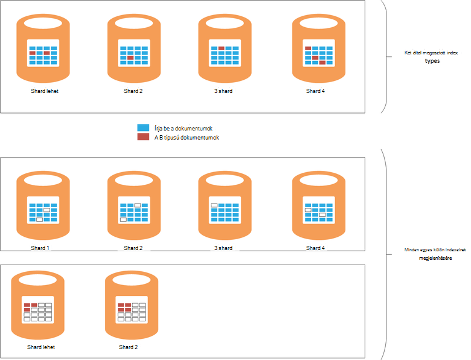

    ***Az effektusok típusa közötti index megosztása*** 

    A diagram felső részén ugyanazt az indexet meg van osztva, írja be A és b típusú dokumentumok Vannak számos további dokumentumok "a" típus mint b megkeresi a típus lesz szükség résztvevők minden négy shards lekérdezése típusát. A diagram alsó részén látható Ha külön indexek létrejönnek-e az egyes: az effektust. Ebben az esetben kereséshez típusú lesz csak kell két shards elérése.

- Lehet, hogy több mint nagy shards megkönnyíti a betöltés széttáró keresztül csomópontok Elasticsearch egyenletesen kis shards.

- Különböző típusú esetleg eltérő adatmegőrzési időszak. Ez lehet nehezen archiválni a régi adatok shards megosztó aktív adatokkal.


Azonban bizonyos körülmények között nem index megosztása a különböző típusú lehet hatékony ha:

- Keresések a ugyanazt az indexet tartott típusok rendszeresen időtartamát.

- A típusok csak van kis az egyes dokumentumokat. Az egyes: shards külön halmazának fenntartása előfordulhat, hogy egy jelentős terhelést ebben az esetben.


### <a name="optimizing-index-types"></a>Optimalizálás a tárgymutató-típusok

Elasticsearch index az eredeti JSON dokumentumok feltöltéséről használt egy példányát tartalmazza. Ez az információ tartani a [* \_forrás*](https://www.elastic.co/guide/en/elasticsearch/reference/current/mapping-source-field.html#mapping-source-field) mező egyes indexelt elemeket. Az adatok nem kereshető, de alapértelmezés szerint által visszaadott *beszerzése* és a *keresési* kérelem. Ez a mező azonban terhelést vonz, és tárolására, shards növelése és i/o-végrehajtani a hangerő növelése elfoglalt. Letilthatja a * \_forrás* per típus alapon mező:

```http
PUT my_index
{
  "mappings": {
    "my_type": {
      "_source": {
        "enabled": false
      }
    }
  }
}
```
Ez a mező letiltása is eltávolítja a az azt jelenti, hogy az alábbi műveletek elvégzését:

- Adatfrissítés a tárgymutató *frissítése* API segítségével.

- Végez keresést, amely a kijelölt adatok.

- Egy Elasticsearch indexből újraindexelés közvetlenül a másikra.

- Hozzárendelések vagy elemzés beállításainak módosítása

- Az eredeti dokumentum megtekintésével hibakeresési lekérdezések.


### <a name="reindexing-data"></a>Adatok újraindexelés

A rendelkezésre álló index shards számát végül határozza meg, az index kapacitása. Készíthet, hogy hány shards frissítenie kell, egy kezdeti (és tájékoztatni) becslés, de mindig fontolja meg a dokumentum újraindexelés stratégia látható. Sok esetben újraindexelés lehet egy olyan tevékenység adatok növekedésével. Előfordulhat, hogy nem shards indexhez nagyszámú kezdetben lefoglalhat az optimalizálás, de szeretné az adatok mennyisége kibővíti új shards lefoglalásához. Egyéb esetben újraindexelés lehetséges kell végezhető további alkalmi alapon, ha a becsült kapcsolatos adatok mennyiségi NÖV egyszerűen bizonyul téves.

> [AZURE.NOTE] Újraindexelés nincs szükség lehet, hogy gyorsan éves adatok. Ebben az esetben az alkalmazások előfordulhat, hogy új index létrehozása minden ideje. Példák teljesítménybeli napló tartalmazzák, de az adatokat, amelyek tárolhatók friss indexbe naponta naplózási.

<!-- -->

Hatékony újraindexelés csapattól kell beszerezni az új index létrehozása az adatokból egy régi, és ezután eltávolítása a régi index. Index túl nagy méretű, ha ezt a folyamatot időt is igénybe vehet, és előfordulhat, hogy annak érdekében, hogy az adatok megmaradnak kereshető a következő jelölőnégyzetet. Emiatt létre kell hoznia egy [aliast az egyes indexhez](https://www.elastic.co/guide/en/elasticsearch/reference/current/indices-aliases.html), és lekérdezések kell beolvasni a következő aliasok adatoknak. Újraindexelés, miközben az alias mutat, a régi index megőrzése, és ezután váltsa azt a új index hivatkozni elkészülte újraindexelés gombra. Ez a módszer akkor is hasznos, eléréséhez időalapú, amely a új index létrehozása minden nap. Az aktuális eléréséhez az adatokat, akkor jön létre a új index összesített alias használja.

### <a name="managing-mappings"></a>Megfeleltetéseinek kezelése

Elasticsearch hozzárendelések alapján határozza meg az adatokat, amely akkor következik be, a dokumentum minden mezője értelmezéséhez. Minden egyes saját hozzárendelése, amely hatékony meghatározza az egy adott típusú séma tartalmaz. Elasticsearch ezt az információt az egyes mezők fordított indexeket az típusú dokumentumokat szeretne használja. Minden olyan dokumentumot az egyes mezők adattípust (például a *karakterlánc*, *dátum*vagy *rövid*), és egy értéket tartalmaz. Megadhatja a tárgymutató-megfeleltetések, az index első létrehozásakor, vagy azok is lehet következtetett Elasticsearch szerint új dokumentumok felvétele után típusát. Jó helyen jár vegye figyelembe az alábbiakat:

- Dinamikusan generált hozzárendelések attól függően, hogy hogyan értelmezi mezők dokumentumok index hozzáadásakor hibák okozhatnak. Például számot tartalmazó mező A tartalmazó dokumentum 1 és okok Elasticsearch megfeleltetés, amely meghatározza, hogy ez a mező hozzáadása egy *hosszú*. Ha a későbbi dokumentum a program felveszi melyik mezőt egy numerikus adatokat tartalmaz, majd a sikertelen lesz. Ebben az esetben A mező kell valószínűleg van már értelmezett karakterlánc az első dokumentum hozzáadásakor. Ez a hozzárendelés megadása, ha az index létrehozása segítségével, hogy ilyen problémák megelőzése érdekében.

- Tervezze meg a dokumentumok túlzottan nagy hozzárendelések létrehozásának, ez hozzáadása jelentős felsőbb keresések végrehajtásakor, nagy mennyiségű memóriát igényelnek és lekérdezések adatkeresés meghiúsító is okozhatja elkerülése érdekében. Fogadja el a dokumentumok megosztása az azonos típusú mezők következetes elnevezési. Ha például nem használható mezők neve, például az "utónév", "Vezetéknév" és "utónév" különböző dokumentumot. Használja a ugyanarra a mezőnévre a minden szövegben. Ezenkívül ne kísérelje meg kulcsként értékek használata (a leggyakoribb megoldás az oszlop-család adatbázisokban, de eredményezheti hatékonyság hiánya és hibák Elasticsearch.) További tudnivalókért lásd: a [Hozzárendelés alábontási](https://www.elastic.co/blog/found-crash-elasticsearch#mapping-explosion).

- *Not_analyzed* segítségével elkerülheti a tokenization, ahol csak lehetséges. Például ha egy dokumentum egy karakterlánc mező értéke "ABC-definíciója" *adatok* nevű tartalmaz, előfordulhat, hogy próbálja keressen rá az összes dokumentumokat, amelyek megegyeznek a ezt az értéket az alábbi képlettel történik:

  ```http
  GET /myindex/mydata/_search
  {
    "query" : {
      "filtered" : {
        "filter" : {
          "term" : {
            "data" : "ABC-DEF"
          }
        }
      }
    }
  }
  ```

 A keresés azonban nem fog a várt eredményt, amelyben a karakterlánc ABC-definíciója van tokenekre bontott amikor indexelve van módja miatt. Akkor fogja kell hatékony felosztása két tokenek, ABC és definíciója, a kötőjel. Ez a szolgáltatás teljes szövegének keresésére szolgál, de ha azt szeretné, hogy a karakterláncot egyetlen atomi elem értelmezni tiltsa le tokenization az index való hozzáadásakor a dokumentumot. Például ez megfeleltetés használható:

  ```http
  PUT /myindex
  {
    "mappings" : {
      "mydata" : {
        "properties" : {
          "data" : {
            "type" : "string",
            "index" : "not_analyzed"
          }
        }
      }
    }
  }
  ```

  További tudnivalókért olvassa el a [Pontos értékek megkeresése](https://www.elastic.co/guide/en/elasticsearch/guide/current/_finding_exact_values.html#_term_filter_with_text)című témakört.


### <a name="using-doc-values"></a>Dokumentum értékeivel

Sok lekérdezések és összesítések szükség az, hogy a keresési művelet részeként rendezett adatok. Rendezés egy vagy több feltétel megfeleltetése dokumentumok listáját is szükséges. A folyamat segítésére Elasticsearch betöltheti összes memória rendezés kulcsként használt mező értékét. Ez az információ *fielddata*nevezik. A cél, hogy a memóriában fielddata gyorsítótárazás vonz kevesebb I/O és többször olvasási ugyanazzal az adattal lemezről gyorsabb lehet. Azonban van, ha egy mező magas hivatkozás, majd a fielddata tárolása memória igénybe vehet, sok halommemória szóközt, az azt jelenti, hogy más egyidejű műveletek hajthatók végre esetleg érintő, vagy akár csökkenti a rendelkezésre álló tárhely Elasticsearch lefagyását okozza.

Alternatív megközelítés, mint a Elasticsearch *dokumentum értékeket*is támogat. Egy dokumentum értéket hasonlít, ha a memóriában fielddata azzal a különbséggel, hogy lemezen tárolt és a jön létre, ha az adatok vannak tárolva index (fielddata összeállítás dinamikusan lekérdezés végrehajtásakor.) Dokumentum értékek fogyaszt halommemória helyet, és így hasznosak számára, hogy rendezés vagy keresztül összesített adatok mezőit, amely lekérdezések nagyon sok egyedi értékeket tartalmazhat. Emellett a csökkentett nyomása a halom a segít eltolás teljesítmény különbségeiről adatok visszakeresése lemezről memória olvasásakor. Szemétgyűjtő valószínű ritkán, és más egyidejű műveletek memória kihasználó kevésbé valószínű, hogy teljesíteni.

Engedélyezése vagy letiltása a dokumentum értékeket a *doc_values* attribútummal index tulajdonság alapon szerint az alábbi példában látható módon:

```http
PUT /myindex
{
  "mappings" : {
    "mydata" : {
      "properties" : {
        "data" : {
          ...
          "doc_values": true
        }
      }
    }
  }
}
```
> [AZURE.NOTE] Elasticsearch verzió 2.0.0-től alapértelmezés szerint engedélyezve vannak a dokumentum értékeket.

A dokumentum értékeivel pontos hatásait valószínű, hogy a saját adatok és a lekérdezés esetek erősen jellemző, ezért hajlandó használata a teljesítmény tesztelése a használhatóságát létrehozására. Is vegye figyelembe, hogy a dokumentum értékek elemzett karakterlánc mezők nem működnek. További tudnivalókért lásd: a [Dokumentum értékeket](https://www.elastic.co/guide/en/elasticsearch/guide/current/doc-values.html#doc-values).

### <a name="using-replicas-to-reduce-query-contention"></a>Csökkentheti a lekérdezés kérelem kópiák használatával

A teljesítmény lekérdezések közös stratégia is sok kópiák minden index létrehozása. Adatok beolvasása egy kópiából által lekérés adatműveleteket is teljesíteni. Azonban e stratégia szigorúan hatással lehet a bevitel adatműveleteket a teljesítménye, szüksége van a használó vegyes munkaterhelésekből forgatókönyvekben körültekintéssel használható. Emellett a stratégia esetén csak a kedvezménye kópiák csomópontok vannak elosztva és a nem ugyanazt az indexet részét képező elsődleges shards az erőforrásokhoz tartozó. Ne feledje, hogy az index kópiák számát dinamikusan csökkentéséhez vagy növeléséhez.

### <a name="using-the-shard-request-cache"></a>A shard kérelem gyorsítótár használata

Elasticsearch is gyorsítótár minden shard a memóriában lekérdezései által igényelt a helyi adatok. A lehetővé teszi, hogy keresésekhez gyorsabban futtatható ugyanazokat az adatokat beolvasó adatok lemez, hanem memória tárhelyről is olvashatók. Ezzel a módszerrel adatok gyorsítótárba is ezért javítja a néhány keresési művelet, de a másik tevékenységekhez egyidejűleg végrehajtását rendelkezésre álló memória csökkentése. Is van a kockázat, hogy az adatok a gyorsítótárból felszolgált elavult. A gyorsítótárban lévő adatok csak érvényét, amikor a shard frissítése és az adatok módosítását. A gyakoriság irányítása szabályozza az index a *frissítési_időköz* beállítás értékét.

A tárgymutató-gyorsítótárazás kérelem alapértelmezés szerint nincs engedélyezve, de engedélyezheti az alábbiak szerint:

```http
PUT /myindex/_settings
{
  "index.requests.cache.enable": true
}
```

A shard kérelem gyorsítótár leginkább alkalmas, amely általában viszonylag statikus, például a múltbeli vagy naplózás adatok marad.

### <a name="using-client-nodes"></a>Ügyfél csomópontok használatával

Az összes lekérdezés dolgozza fel először megkapja a kérelmet csomópont. A csomópont további kérést küld tartalmazó shards az indexek lekérdezett az összes többi csomópontra, és majd összegzi az eredmények visszaadása a kérdésre adott választ. Ha a lekérdezés csapattól kell beszerezni az adatok összesítése összetett számítások végzése, a kezdeti csomópontot a felelős a hajt végre a megfelelő feldolgozása. Ha a rendszerben a támogatási viszonylag kevés összetett lekérdezéseket, vegye figyelembe az ügyfél erőforráskészlethez tartozik a betöltés az adatok csomópontok enyhítése csomópontjainak létrehozásával. Viszont ha nagyszámú egyszerű lekérdezések kezelése a rendszerben, majd küldhet e kérelmek közvetlenül az adatok csomópontot, és egy terheléselosztó használatával kérelmek egyenletes elosztása.

### <a name="tuning-queries"></a>Lekérdezések beállítása

A következő pontok tippek Elasticsearch lekérdezéseit maximalizálása Összefoglalva:

- Kerülje a lekérdezést, amely magában foglalja a helyettesítő karakterek, amikor csak lehetséges.

- Ha ugyanaz a mező értéke teljes szöveges keresés és a pontos fizetnie egyező, majd fontolja meg a mező az adatok tárolása elemzése és nonanalyzed űrlapok. Hajtsa végre a teljes szöveges a elemzett mező végezhetnek keresést az, és a nonanalyzed mező ellen pontos egyezéseket.

- Csak adja vissza az adatokat szükséges. Ha nagyméretű dokumentumokat van, de az alkalmazás csak egy részét a mezőket az tárolt információk van szükség, térjen Ez az Alkészlet a teljes dokumentumok, hanem lekérdezések. Ez a stratégia csökkentheti a fürt hálózati sávszélességre vonatkozó követelmények.

- Amikor csak lehetséges, szűrők használata helyett lekérdezések adatok keresésekor. Szűrő egyszerűen határozza meg, hogy a dokumentum megfelel-e egy adott kritériumnak, mivel a lekérdezés is mennyire egyező dokumentum van (pontozási) számítja ki. Belső szűrő által generált értékeket jelző hol.van/nem egyező minden dokumentum bitképként vannak tárolva, és Elasticsearch gyorsítótárba helyezhető őket. Az azonos szűrőfeltétel azt követően fordul elő, ha a bitkép beolvasása gyorsítótárból, és a hozzá tartozó dokumentumok gyors lehívására használt. További tudnivalókért olvassa el a [Belső szűrőművelet](https://www.elastic.co/guide/en/elasticsearch/guide/current/_finding_exact_values.html#_internal_filter_operation)című témakört.

- *Logikai* szűrőkkel statikus összehasonlításokat elvégzésére vonatkozó, és csak *és*, *vagy*, és *nem* szűrők dinamikusan számított szűrők, például amelyeket járnak a parancsfájlok használatát vagy a *geo -\* * szűrőket.

- Lekérdezés egyesíti *logikai* szűrők *és*, *vagy*, ha- *e* a *geo -* * szűrők, helyezze a *és*/*vagy*/*geo-** szűrők utolsó, hogy a legkisebb adatkészlet lehetséges működésük.

    Hasonlóképpen használja a *post_filter* drága szűrési műveletek futtatásához. Ezek a szűrők utolsó fog történni.

- Összesítések metszettel helyett használja. Kerülje a összegzések elemzése van, vagy a felhasználó sok lehetséges értékek kiszámításakor.

    > **Megjegyzés**: metszettel el lett távolítva az Elasticsearch verzió 2.0.0.

- A *hivatkozás* összesítést az *value_count* összesítés helyett használja, kivéve ha az alkalmazás igényel egy pontosan egyező elemek számát. Pontos számláló előfordulhat, hogy gyorsan elavult, és sok alkalmazás csak a megfelelő közelítését.

- Kerülje a parancsfájlok használatát. Lekérdezések és a szűrők parancsfájlok költséges lehet, és az eredmények nem gyorsítótárban. A hosszú ideig futó parancsfájlok igénybe vehet, keresési szálak határozatlan ideig, későbbi kérelmek okoz. Ha a sor megtelik, további kérelmek elutasításra kerül.

## <a name="testing-and-analyzing-aggregation-and-search-performance"></a>Tesztelése és az összesítést, és keressen teljesítmény elemzése

Ez a szakasz ismerteti a változó fürt és index konfigurációk elleni végrehajtott vizsgálatok sorozata eredményét. Kétféle vizsgálatot végeztek, az alábbi képlettel történik:

- * *A *bevitel és a lekérdezés* tesztelése **. A tesztet lett töltve, mint a vizsgálat kezdett a (minden egyes művelet hozzáadott 1000-dokumentumok) tömeges beszúrás műveletek végrehajtásával üres tárgymutató lépések. Egy időben a tervezett összesítések készítése, és keresse meg az előző 15 perces időszakban felvett dokumentumok lekérdezések száma 5 második időközönként voltak ismételni. A tesztet a szokásos meg megismételni a nehéz terhelést alkotó adatok nagyméretű bevitel a valós idejű lekérdezések közelében hatásai 24 órát, futtatása volt engedélyezett.

- **A *lekérdezés csak* **tesztelése. A tesztet hasonlít a *bevitel és a lekérdezés* tesztelése, azzal a különbséggel, hogy a bevitel rész argumentumot, és az index valamennyi csomóponton van előre a 100 milliós dokumentumok. A módosított beállítása a lekérdezések történik; a dokumentumok azoknak a legutóbbi 15 perces hozzáadott korlátozása idő elemet el lett távolítva az adatok most statikus volt. A vizsgálatok futtatása 90 percig, és kevesebb miatt a rögzített mennyiségű adat a teljesítmény minta létrehozásához szükséges időt.

---

A tárgymutató minden dokumentum kellett ugyanarra a sémára. Az alábbi táblázat összefoglalja a mezőket a sémában.

név                          | Típus         | Jegyzetek |
  ----------------------------- | ------------ | -------------------------------------------------------- |
  Szervezeti                  | Karakterlánc      | A próba 200 egyedi szervezetek hoz létre. |
  CustomField1 - CustomField5   |Karakterlánc       |Ezek a öt karakterlánc mezőt, amely vannak beállítva, hogy az üres karakterlánc.|
  DateTimeRecievedUtc           |Időbélyeg    |Dátum és idő, amelyen a dokumentum hozzá lett adva.|
  A Host                          |Karakterlánc       |Ez a mező értéke az üres karakterlánc.|
  HttpMethod                    |Karakterlánc       |Ez a mező értéke az alábbi értékek közül: "Közzé", "Beolvasása", "HELYEZZE".|
  HttpReferrer                  |Karakterlánc       |Ez a mező értéke az üres karakterlánc.|
  HttpRequest                   |Karakterlánc       |Ez a mező 10 és 200 karakter hosszúságú közötti véletlen szöveg van feltöltve.|
  HttpUserAgent                 |Karakterlánc       |Ez a mező értéke az üres karakterlánc.|
  HttpVersion                   |Karakterlánc       |Ez a mező értéke az üres karakterlánc.|
  Cégnév              |Karakterlánc       |Ez a mező értéke megegyezik a szervezet mező értéke.|
  SourceIp                      |IP           |Ez a mező tartalmazza a "origin" az adatok jelző IP-címet. |
   SourceIpAreaCode              |Hosszú         |Ez a mező értéke 0.|
  SourceIpAsnNr                 |Karakterlánc       |Ez a mező értéke "AS\#\#\#\#\#".|
  SourceIpBase10                |Hosszú         |Ez a mező értéke 500.|
  SourceIpCountryCode           |Karakterlánc       |Ez a mező tartalmazza a 2-karakter országkódot. |
  SourceIpCity                  |Karakterlánc       |Ez a mező tartalmazza a város országban azonosító karakterláncot. |
  SourceIpLatitude              |Dupla       |Ez a mező tartalmazza a véletlen értéket.|
  SourceIpLongitude             |Dupla       |Ez a mező tartalmazza a véletlen értéket.|
  SourceIpMetroCode             |Hosszú         |Ez a mező értéke 0.|
  SourceIpPostalCode            |Karakterlánc       |Ez a mező értéke az üres karakterlánc.|
  SourceLatLong                 |GEO pont   |Ez a mező értéke véletlen geo pontra.|
  Forrásport                    |Karakterlánc       |Ez a mező a karakterlánc ábrázolt véletlen számot van feltöltve.|
  TargetIp                      |IP           |Ez a véletlen IP-címet a tartomány 0.0.100.100 való 255.9.100.100 kitölti.|
  SourcedFrom                   |Karakterlánc       |Ez a mező értéke "MonitoringCollector" karakterlánccal.|
  TargetPort                    |Karakterlánc       |Ez a mező a karakterlánc ábrázolt véletlen számot van feltöltve.|
  Minősítés                        |Karakterlánc       |Ez a mező kitölti véletlenszerűen kiválasztott 20 másik karakterlánc értékek közül.|
  UseHumanReadableDateTimes     |Logikai érték      |Ez a mező értéke hamis.|
 
A következő lekérdezések végeztek, egy köteg tesztek törzsének szerint. Dőlt névvel használják ezeket a lekérdezéseket, a dokumentum többi hivatkozni. Látható, hogy az idő kritérium (az utolsó 15 perces felvett dokumentumok) a hiányzik a *csak a lekérdezés* teszteket:

- Hány dokumentumok egyes *minősítés* értékkel lett megadva az utolsó 15 perces (*száma szerint minősítés*)? 

- Hány dokumentumok egyes 5 perc intervallum van hozzáadva során az utolsó 15 percet (*időbeli darab*)?

- Hány dokumentumok egyes *minősítés* érték van hozzáadva az egyes országok az utolsó 15 perces (*találatok ország*)?

- Melyik 15 szervezetek példányon az utolsó 15 perces (*felső 15 szervezetek*) hozzáadott a legtöbb gyakran a dokumentumok?

- Hány más szervezetek példányon az utolsó 15 perces (*egyedi darab szervezetek*) felvett dokumentumok?

- Hány dokumentumok van hozzáadva az utolsó 15 perces (*találatok száma*)?

- Hány különböző *SourceIp* értékek példányon az utolsó 15 perces (*egyedi IP száma*) felvett dokumentumok?


A definíció az index és a lekérdezések részleteit a [függelék](#appendix-the-query-and-aggregation-performance-test)mutatja.

A következő változók hatásai megértéséhez tesztek készültek:

- **Lemezen típusát**. Teszteket a 6-csomópont fürthöz D4 VMs szabványos tároló (HDDs) használatával az elvégzett és a 6-csomópont fürthöz DS4 VMs prémium tároló (SSD) használata az ismétlődő.

- **Gépi méret - méretezés**. Vizsgálatok volt a 6-csomópont (a *kis* fürt megjelölt) DS3 VMs alkotó fürthöz elvégzett, DS4 VMs (a *Közepes* fürt) a fürtre, és ismételni újra fürtre DS14 gépek ( *nagy* fürthöz). Az alábbi táblázat összefoglalja az egyes virtuális Termékváltozat fő jellemzői:

 Fürthöz | VIRTUÁLIS TERMÉKVÁLTOZAT        | Magmintákat száma | Adatok lemez száma | (GB) RAM |
---------|---------------|-----------------|----------------------|----------|
 Kis   | Szabványos DS3  | 4               | 8                    | 14       |
 Közepes  | Szabványos DS4  | 8               | 16                   | 28       |
 Nagy   | Szabványos DS14 | 16              | 32                   | 112      |

- **Fürt méret - méretezés kifelé**. Azt vizsgálja meg az 1, 3 és 6 csomópontok tartalmazó DS14 VMs fürt végeztek.

- **Index kópiák számát**. Annak vizsgálata végeztek, 1 és 2 kópiákkal konfigurálni az indexek használatával.

- **Dokumentum értékeket**. Az eredetileg tesztek az index beállítás értéke *Igaz* (az alapértelmezett érték) *doc_values* végeztek. Kijelölt teszt voltak ismételni *doc_values* *hamis*értékűre.

- **Gyorsítótár**. Teszteket a shard kérelem gyorsítótár engedélyezve van az index és azok vonatkozóan.

- **Shards számát**. Vizsgálatok voltak ismételni shards változó számú létrehozására, hogy lekérdezések hatékonyabban futtatta kevesebb, nagyobb shards vagy több, kisebb shards tartalmazó indexek keresztül.


## <a name="performance-results---disk-type"></a>Teljesítmény eredménye - lemez típusa

A 6-csomópont gombcsoport D4 VMs (HDDs használ), és a 6-csomópont (használatával SSD) DS4 VMs gombcsoport a *Bevitel és a lekérdezés* tesztelése futtatásával értékelése lemez teljesítménye. Mindkét fürt Elasticsearch konfigurációja azonos volt. Az adatok minden csomóponton 16 lemezre történt terjednek és az egyes csomópontok volna 14GB RAM rendelt Elasticsearch futó Java virtuális gép (JVM), a hátralévő memória (is 14GB) maradt operációs rendszer használata. Az egyes vizsgálatok futtatta 24 órát. Ez az időszak ahhoz, hogy az adatok látható lesz, és engedélyezze a rendszer stabilizálásához növekvő mennyisége hatásai kijelölve. Az alábbi táblázat összefoglalja az eredményeket a különböző műveletek, amelyek a vizsgálat válaszidő kiemelés.

 Fürthöz | A művelet vagy lekérdezés            | Átlagos válaszidő (ms) |
---------|----------------------------|----------------------------|
 D4      | Bevitel                  | 978                        |
         | Minősítés szerint száma            | 103                        |
         | Darab felett idő            | 134                        |
         | A találatok országonkénti            | 199                        |
         | Felső 15 szervezetekben       | 137                        |
         | A szervezet egyedi száma | 139                        |
         | Egyedi IP száma            | 510                        |
         | Találatok száma           | 89                         |
 DS4     | Bevitel                  | 511                        |
         | Minősítés szerint száma            | 187                        |
         | Darab felett idő            | 411                        |
         | A találatok országonkénti            | 402                        |
         | Felső 15 szervezetekben       | 307                        |
         | A szervezet egyedi száma | 320                        |
         | Egyedi IP száma            | 841                        |
         | Találatok száma           | 236.                        |

Első ránézésre úgy tűnik, hogy a DS4 fürt elvégzett lekérdezések kevésbé jól, mint a D4 fürt, időnként kétszerezési (vagy rosszabb) válaszidő. Ez nem megállapítani, hogy a teljes szövegegység bár. A következő táblázat mutatja minden fürt által elvégzett bevitel műveletek száma (ne feledje, hogy az egyes műveletek betölti 1000-dokumentumok):

 Fürthöz | Bevitel műveletek száma |
---------|---------------------------|
 D4      | 264769                    |
 DS4     | 503157                    |

A DS4 fürt volt képes közel kétszer annyi adat, mint a D4 fürt betöltése a vizsgálat alatt. Ennélfogva minden művelethez válaszidő elemzéséhez, is kell fontolja meg, hány, mindkét lekérdezés van szeretne képet beolvasni a dokumentumok, és a visszaadott hány dokumentumok. Ezek a dinamikus adatok a dokumentumokat a tárgymutató mennyiségű folyamatosan nő. Nem lehet egyszerűen osztása 503137 264769 (minden fürt bevitel műveleteinek száma), majd kattintson az átlagos válaszidő minden, a függvény figyelmen kívül hagyja az összeget i/o-egyidejűleg a bevitel művelet által végzett egy összehasonlító információt adhat a D4 fürt által elvégzett lekérdezés szorozza. Ehelyett kell mérni a fizikai mennyiségű adat írt, és olvassa el a lemezről, a teszt során. A JMeter teszttervre rögzíti ezt az információt az egyes csomópontot. Az összegzett eredményt adnak:

 Fürthöz | Átlagos bájt írt/olvasott minden egyes használata során |
---------|----------------------------------------------|
 D4      | 13471557                                     |
 DS4     | 24643470                                     |

Ezeket az adatokat jeleníti meg, hogy a DS4 fürt tudta fenntartása egy I/O ráta körülbelül 1,8 időpontok, amely a D4 fürt. Tekintve, hogy a lemez jellegét, kivéve összes erőforrás megegyeznek, a különbség a kell-e SSD használata miatt inkább HDDs.

Sorkizárás e elfogadásáról érdekében a következő grafikonok bemutatják, hogyan az I/O időbeli, minden egyes fürt által elvégzett:

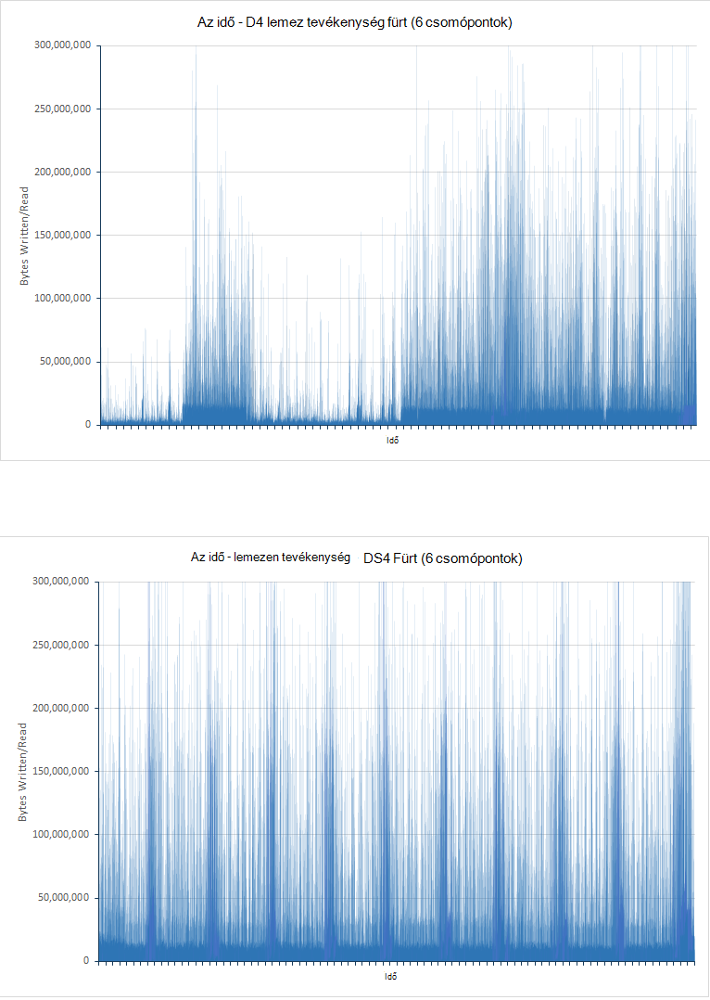

<!-- -->

***A D4 és DS4 fürt lemez tevékenység***

A a D4 fürt grafikonon jelentős változat, különösen az első alatt a tesztet a fele. Ez volt csökkentheti a I/O ráta szabályozásának miatt valószínűleg. A próba kezdeti fázisaiban a lekérdezések képesek gyors futtatásához, mint kis adatok elemzése céljából. A lemezt a D4 fürt valószínűleg így egy második (IOPS) beosztását, a bemeneti és kimeneti műveletek közelébe működnie Bár minden I/O művelet előfordulhat, hogy nem kell eredményül adása mennyi adatot. A DS4 fürt tudja újabb IOPS díjának támogatja, és nem érheti szabályozásának ugyanolyan fokú, a I/O díjak további normál. A elmélet támogatja, a következő pár grafikonok jelenjen meg hogyan a Processzor blokkolta lemeztevékenység időbeli (a lemez várakozási idő látható a grafikonok is, hogy a Processzor töltött i/o-várakozási időt arányát):

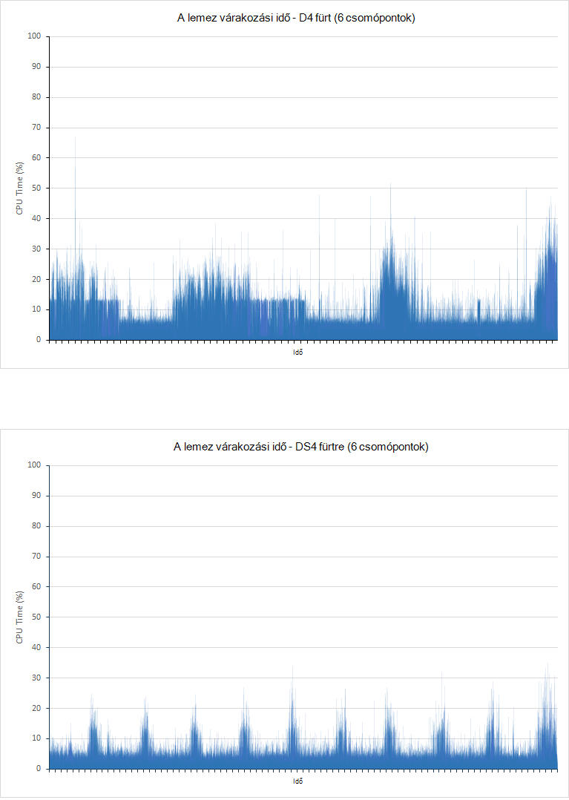

***Processzor lemeztevékenység várakozási idejének a D4 és DS4 fürt***

Fontos megértéséhez, hogy nincsenek-e a Processzor blokkolása bemeneti és kimeneti műveletet két meghatározó okai:

- A I/O alrendszer olvasási vagy adatok írása, illetve a lemez.

- A host környezet által sikerült kell szabályozott a I/O alrendszer. Azure lemez HDDs használatával megvalósított 500 IOPS maximálisan van, és SSD 5000 IOPS maximálisan.


A D4 fürt idő mennyiségét töltött várakozási i/o-próba-hibához első felében szorosan fordított módon a Graph a I/O díjak megjelenítő. Alacsony i/o-időszakok időszakok jelentős a Processzor tölt letiltott felelnek meg, az azt jelenti, hogy a I/O folyamatban van folyamatban. Több adat a fürt bekerül a helyzet módosításokat, és a vizsgálat csúcsok I/O második felében várakozási idő I/O átviteli csúcsok megfelelnek. Ezen a ponton a Processzor valós I/O videókereséskor le van tiltva. Ismét a DS4 fürt i/o-Várakozás töltött időt még sokkal több. Minden csúcsra megegyezik egy ezzel egyenértékű csúcs tálba, hanem I/O teljesítményt az, ez azt jelenti, hogy nincs vagy kis szabályozási fordul elő.

Van más tényező is célszerű figyelembe venni. Vizsgálat alatt a D4 fürt 10584 bevitel hibák és 21 lekérdezési hibák hoz létre. A tesztet a DS4 fürt hibátlan mutatni.

## <a name="performance-results---scaling-up"></a>Teljesítmény eredménye - méretezés

6-csomópont fürt DS3, DS4 és DS14 VMs ellen tesztek futtatásával skála telefonos tesztelése történt. Ezeket a Termékváltozatok van kijelölve, mert egy DS4 virtuális kétszer annyi Processzormagok és memóriát, mint egy DS3 biztosít, és egy DS14 számítógépre megduplázódik Processzor erőforrások ismét memória mennyiségét négyszer nyújtó közben. Az alábbi táblázat minden egyes Termékváltozat a főbb szempontjait hasonlítja össze:

 RAKTÁRI SZÁM  | \#Processzormagok | A memória (GB) | Max lemez IOPS | Max sávszélesség (MB/s)|
------|-------------|-------------|---------------|--------------|
 DS3  | 4           | 14          | 12,800| 128 |
 DS4  | 8           | 28          | 25,600| 256 |
 DS14 | 16          | 112         | 50 000| 512 |

Az alábbi táblázat összefoglalja a kis (DS3), a közepes (DS4) és a nagy (DS14) fürt tesztek futó eredményét. Minden egyes virtuális SSD az adatok tárolására szolgál. Az egyes vizsgálatok futtatta 24 órát.

A táblázat az egyes: lekérdezési sikeres kérelmeket, (hibák nem szerepelnek) számát jelenti. A lekérdezés hibatípusonként próbált kérések száma megegyezik a nagyjából a Futtatás a próba során. Ennek oka az, a JMeter teszttervre hajtja végre minden lekérdezés (száma szerint minősítés, darab felett idő, találatok szerinti ország, felső 15 szervezetek, egyedi darab szervezetek, egyedi IP a darab és a találatok darabszáma) egy előfordulását közös *tranzakció tesztelése* (Ez a tranzakció a független a feladat, amely a bevitel műveletben egy külön szál futtatni hajt végre) néven egyetlen egységet. A próba-előfizetésére törzsének egyetlen próba tranzakció hajt végre. A végrehajtott próba tranzakciók számát tehát azt méri, a tranzakciók legkisebb lekérdezés válaszidő.

| Fürthöz      | A művelet vagy lekérdezés            | Kérések száma | Átlagos válaszidő (ms) |
|--------------|----------------------------|--------------------|----------------------------|
| Kicsi (DS3)  | Bevitel                  | 207284             | 3328                       |
|              | Minősítés szerint száma            | 18444              | 268                        |
|              | Darab felett idő            | 18444              | 340                        |
|              | A találatok országonkénti            | 18445              | 404                        |
|              | Felső 15 szervezetekben       | 18439              | 323                        |
|              | A szervezet egyedi száma | 18437              | 338                        |
|              | Egyedi IP száma            | 18442              | 468                        |
|              | Találatok száma           | 18428              | 294   
|||||
| Közepes (DS4) | Bevitel                  | 503157             | 511                        |
|              | Minősítés szerint száma            | 6958               | 187                        |
|              | Darab felett idő            | 6958               | 411                        |
|              | A találatok országonkénti            | 6958               | 402                        |
|              | Felső 15 szervezetekben       | 6958               | 307                        |
|              | A szervezet egyedi száma | 6956               | 320                        |
|              | Egyedi IP száma            | 6955               | 841                        |
|              | Találatok száma           | 6958               | 236.                        |
|||||
| Nagy (DS14) | Bevitel                  | 502714             | 511                        |
|              | Minősítés szerint száma            | 7041               | 201                        |
|              | Darab felett idő            | 7040               | 298                        |
|              | A találatok országonkénti            | 7039               | 363                        |
|              | Felső 15 szervezetekben       | 7038               | 244                        |
|              | A szervezet egyedi száma | 7037               | 283                        |
|              | Egyedi IP száma            | 7037               | 681                        |
|              | Találatok száma           | 7038               | 200                        |

Ezeket az adatokat az Ez a teszt megjelenítése, amely a teljesítmény a DS4 és DS14 fürt voltak ésszerűen hasonló. Kezdetben favorably összehasonlítása is megjelennek a lekérdezési műveletek a DS3 fürt válaszidő, és lekérdezési műveletek a számát sokkal nagyobb a DS4 és DS14 fürt értékeket. Azonban egyik kell vennie a bevitel rátát és a keresés helyét jelentő karakterlánc dokumentumok csatlakozása száma erős értesítés. A DS3 fürt bevitel sokkal korlátozódik, és a vizsgálat végére az adatbázis csak tartalmazott körülbelül 40 %-a dokumentumok, a másik két fürt mindegyikének olvasható. Ez a feldolgozás erőforrások, a hálózati és a lemez sávszélesség egy DS3 virtuális DS4 vagy DS14 virtuális képest elérhető oka lehet. Tekintve, hogy egy DS4 virtuális kétszer annyi erőforrások egy DS3 virtuális, amelyekhez rendelkezik, és az egy DS14 kétszer (négyszer a memória) egy DS4 virtuális forrásai, marad, egy kérdés: Miért a különbség a bevitel díjak között a DS4 és DS14 fürt jelentősen kisebb, mint, amely akkor következik be, a DS3 és DS4 fürt között? Ez lehet a hálózati kihasználtsági és az Azure VMs sávszélesség korlátai miatt. Az alábbi diagramok jeleníthetők meg a minden három fürt:

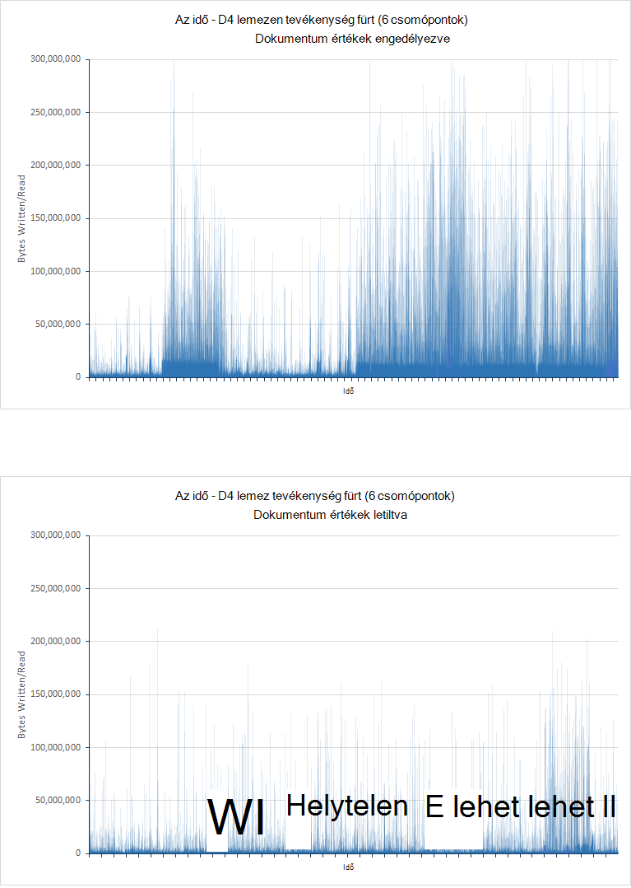

**Hálózati kihasználtság a bevitel és a lekérdezés tesztelése DS3 DS4 és DS14 fürtre vonatkozóan** 

<!-- -->

Rendelkezésre álló hálózati sávszélesség az Azure VMs határain nem közzétett változhat, de arra, hogy a tevékenység hálózati úgy tűnik, hogy rendelkezik megállapodott átlaga körül 2.75GBps, mind a DS4 a és a DS14 vizsgálatok javításukhoz javasolt, hogy ilyen korlátozott jött létre, és vált, az elsődleges tényező átviteli korlátozása. A DS3 fürt esetén a hálózati tevékenység jelentősen alacsonyabb volt alsó teljesítményét más erőforrások elérhetőségének korlátozások miatt valószínűleg így.

Az effektusok a bevitel műveletek azonosíthatók, és bemutatják, hogyan lekérdezési teljesítmény megegyezik csomópontok szerkezetének kialakítása, csak lekérdezés teszteket segítségével történt az azonos csomópontok. Az alábbi táblázat összefoglalja az egyes fürt elért eredményeket:

> [AZURE.NOTE] Nem kell összehasonlíthatja a teljesítmény és kérések hajtja végre a lekérdezések száma a *lekérdezés csak* azokat a *Bevitel és a lekérdezés* tesztelése futtasson felirattal. Ennek az oka, hogy módosultak-e a lekérdezések és dokumentumok érintett hangereje különböző.

| Fürthöz      | A művelet vagy lekérdezés            | Kérések száma | Átlagos válasz Ttme (ms) |
|--------------|----------------------------|--------------------|----------------------------|
| Kicsi (DS3)  | Minősítés szerint száma            | 464                | 11758                      |
|              | Darab felett idő            | 464                | 14699                      |
|              | A találatok országonkénti            | 463                | 14075                      |
|              | Felső 15 szervezetekben       | 464                | 11856                      |
|              | A szervezet egyedi száma | 462                | 12314                      |
|              | Egyedi IP száma            | 461                | 19898                      |
|              | Találatok száma           | 462                | 8882  
|||||
| Közepes (DS4) | Minősítés szerint száma            | 1045               | 4489                       |
|              | Darab felett idő            | 1045               | 7292                       |
|              | A találatok országonkénti            | 1053               | 7564                       |
|              | Felső 15 szervezetekben       | 1055               | 5066                       |
|              | A szervezet egyedi száma | 1051               | 5231                       |
|              | Egyedi IP száma            | 1051               | 9228                       |
|              | Találatok száma           | 1051               | 2180                       |
|||||
| Nagy (DS14) | Minősítés szerint száma            | 1842               | 1927                       |
|              | Darab felett idő            | 1839               | 4483                       |
|              | A találatok országonkénti            | 1838               | 4761                       |
|              | Felső 15 szervezetekben       | 1842               | 2117                       |
|              | A szervezet egyedi száma | 1837               | 2393                       |
|              | Egyedi IP száma            | 1837               | 7159                       |
|              | Találatok száma           | 1837               | 642                        |

Ebben az esetben a trendek át a másik fürt átlagos válaszidő világosabb is. Hálózati kihasználtsági nem jól éri el a 2.75GBps korábbi szükséges a DS4 és DS14 fürt (Ez az valószínűleg telített a hálózat a bevitel és a lekérdezés vizsgálatok), és a 1.5GBps a DS3 fürt. Erre valójában minden olyan esetben, ahogy az alábbi grafikon 200MBps közelebb azt:

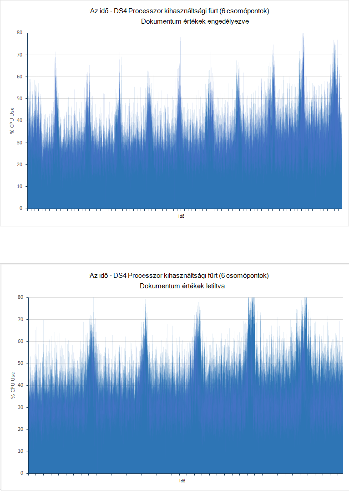

***Hálózati a DS3, a kihasználtság DS4 és DS14 fürt csak a lekérdezés tesztelése*** 

A korlátozás a DS3 és DS4 fürt most jelenjen meg Processzor kihasználtsági, amelyek leginkább hasonlító 100 %-os, a nagy, az idő. A DS14 a fürt a Processzor használatát átlagok csak feletti 80 %-át. Továbbra is nagy, de egyértelműen kiemeli a rendelkezésre álló további Processzormagok problémákat előnyei. Az alábbi képen a DS3 DS4 és DS14 fürtre vonatkozóan a Processzor használatát mintázatok ábrázolja.

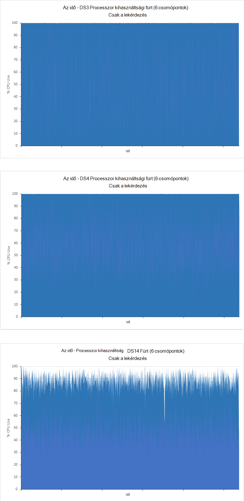

***A csak a lekérdezés tesztelése DS3 és DS14 fürtre vonatkozóan Processzor kihasználtság*** 

## <a name="performance-results---scaling-out"></a>Teljesítmény eredménye - méretezés kifelé

Bemutatják, hogy a rendszer méretezze át a csomópontok számának, hogy azok tesztek segítségével 1, 3 és 6 csomópontok tartalmazó DS14 fürt. Ebben az esetben csak a *csak a lekérdezés* tesztelése történt, használja a 100 milliós dokumentumok és 90 percig fut:

| Fürthöz | A művelet vagy lekérdezés            | Kérések száma | Átlagos válaszidő (ms) |
|---------|----------------------------|--------------------|----------------------------|
| 1 csomópontot.  | Minősítés szerint száma            | 288                | 6216                       |
|         | Darab felett idő            | 288                | 28933                      |
|         | A találatok országonkénti            | 288                | 29455                      |
|         | Felső 15 szervezetekben       | 288                | 9058                       |
|         | A szervezet egyedi száma | 287                | 19916                      |
|         | Egyedi IP száma            | 284                | 54203                      |
|         | Találatok száma           | 287                | 3333                       |
|||||
| 3 csomópontok | Minősítés szerint száma            | 1194               | 3427                       |
|         | Darab felett idő            | 1194               | 5381                       |
|         | A találatok országonkénti            | 1191               | 6840                       |
|         | Felső 15 szervezetekben       | 1196               | 3819                       |
|         | A szervezet egyedi száma | 1190               | 2938                       |
|         | Egyedi IP száma            | 1189               | 12516                      |
|         | Találatok száma           | 1191               | 1272                       |
|||||
| 6 csomópontok | Minősítés szerint száma            | 1842               | 1927                       |
|         | Darab felett idő            | 1839               | 4483                       |
|         | A találatok országonkénti            | 1838               | 4761                       |
|         | Felső 15 szervezetekben       | 1842               | 2117                       |
|         | A szervezet egyedi száma | 1837               | 2393                       |
|         | Egyedi IP száma            | 1837               | 7159                       |
|         | Találatok száma           | 1837               | 642                        |

Csomópontok számának számít jelentős a lekérdezési teljesítmény fürt, bár módon nemlineáris. A 3 csomópont fürt közben a 6 csomópont fürt kezeli 6 időpontok megjelölése számos végrehajtja a egyetlen csomópont fürt körülbelül 4 időpontok annyi lekérdezések. Szeretné a nonlinearity ismertetik, a következő grafikonok bemutatják, hogyan a Processzor lett által használt a három fürt:

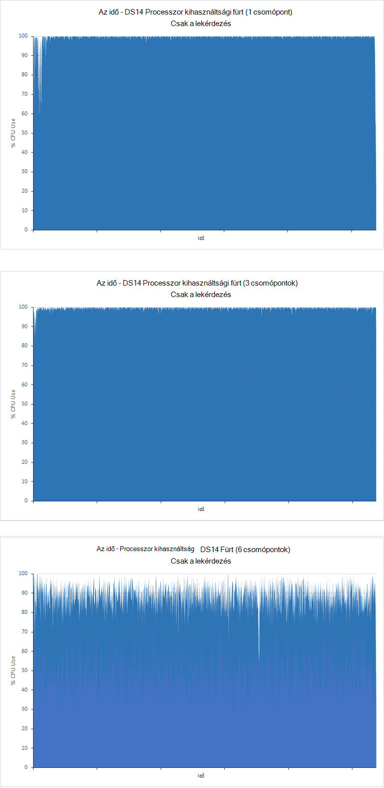

***Processzor-kihasználtság az 1, 3 és 6-csomópont fürt csak a lekérdezés tesztelése***

Az egyetlen csomópontot, és a 3-csomópont fürt Processzor kötött, amíg bár Processzor kihasználtsága túl nagy a 6-csomópont fürt van tartalék feldolgozási kapacitás. Egyéb tényezők ebben az esetben valószínűleg kell korlátozása a kapacitása. Ez lehet arról, ha teszteli a 9-es és 12 csomópontok, amely esetben valószínűleg további tartalék feldolgozás kapacitás megjelenítése.

A fenti táblázatban lévő adatok is látható, hogyan a lekérdezések átlagos válaszidő változnak. Ez a tesztelése, hogy hogyan méretezze át a rendszer az adott típusú lekérdezések esetén leginkább megfelelő elemet. Egyes keresések több, mint a többi csomópontok tartó esetén egyértelműen sokkal hatékonyabban. Ennek oka lehet csomópontok számának és a dokumentumok száma, a fürt növekvő hányadosa, minden fürt 100 milliós dokumentumokat tartalmazza. Keresést, amely magában foglalja az adatok összesítése végrehajtásakor Elasticsearch folyamat, és a memóriában minden csomóponton összesítési folyamatának részeként az adatforrásból puffer. Ha további csomópontok, nincs kevesebb adatok beolvasásához, pufferelési, és a folyamat minden csomóponton.

## <a name="performance-results---number-of-replicas"></a>Teljesítmény eredménye - kópiák száma

A *Bevitel és a lekérdezés* voltak tesztek egyetlen replikáról index szemben. Tesztek segítségével két kópia konfigurált index 6-csomópont DS4 és DS14 fürt volt ismételni. Az összes teszt futtatta 24 órát. Az alábbi táblázatban látható, az egy és két replikáinak összehasonlító eredményeket:

| Fürthöz | A művelet vagy lekérdezés            | Átlagos válaszidő (ms) - 1 replika | Átlagos válaszidő (ms) - 2 kópiák | százalékos eltérés válaszidő |
|---------|----------------------------|----------------------------------------|-----------------------------------------|-------------------------------|
| DS4     | Bevitel                  | 511                                    | 655                                     | + 28 %                          |
|         | Minősítés szerint száma            | 187                                    | 168                                     | – 10 %-os                          |
|         | Darab felett idő            | 411                                    | 309                                     | -25 %-kal                          |
|         | A találatok országonkénti            | 402                                    | 562                                     | + 40 %-kal                          |
|         | Felső 15 szervezetekben       | 307                                    | 366                                     | + 19 %                          |
|         | A szervezet egyedi száma | 320                                    | 378.                                     | + a 18 %                          |
|         | Egyedi IP száma            | 841                                    | 987                                     | + 17 %                          |
|         | Találatok száma           | 236.                                    | 236.                                     | + 0 %                           |
||||||
| DS14    | Bevitel                  | 511                                    | 618                                     | + 21 %                          |
|         | Minősítés szerint száma            | 201                                    | 275                                     | + 37 %-os                          |
|         | Darab felett idő            | 298                                    | 466                                     | + 56 %                          |
|         | A találatok országonkénti            | 363                                    | 529                                     | + 46 %                          |
|         | Felső 15 szervezetekben       | 244                                    | 407                                     | + 67 %                          |
|         | A szervezet egyedi száma | 283                                    | 403                                     | + 42 %                          |
|         | Egyedi IP száma            | 681                                    | 823                                     | + 21 %                          |
|         | Találatok száma           | 200                                    | 221                                     | + 11 %                          |

A bevitel ráta csökkent nagyobb kópiák számát. A várható szerint Elasticsearch ír minden dokumentum esetén több másolatot további lemez I/O generálni.  Ez tükröződik a DS14 fürt az indexek a grafikonok 1 és 2 kópiákkal, az alábbi képen látható. Az index 1 replikával, amíg az átlagos I/O arány volt 16896573 bájt/második. Az index 2 kópiákkal az átlag I/O ráta volt 33986843 bájt/második, csak kétszer, sok fölé.

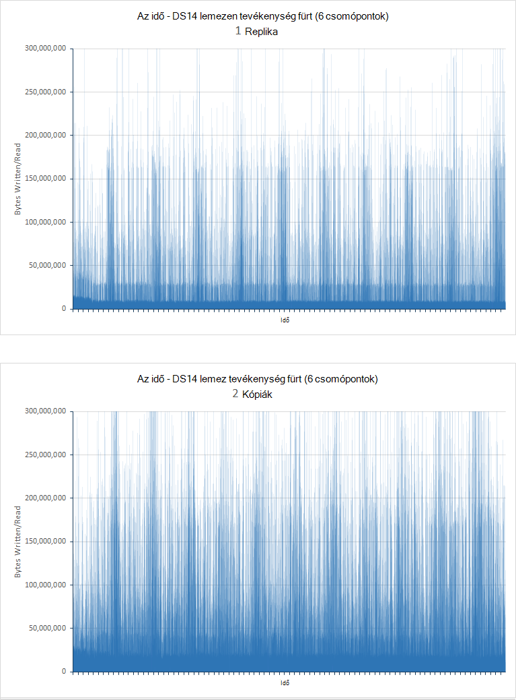

***Lemeztevékenység díjak csomópontok 1 és 2 kópiákkal bevitel és a lekérdezés tesztelése***

| Fürthöz | Lekérdezés                      | Átlagos válaszidő (ms) - 1 replika | Átlagos válaszidő (ms) - 2 kópiák |
|---------|----------------------------|----------------------------------------|-----------------------------------------|
| DS4     | Minősítés szerint száma            | 4489                                   | 4079                                    |
|         | Darab felett idő            | 7292                                   | 6697                                    |
|         | A találatok országonkénti            | 7564                                   | 7173                                    |
|         | Felső 15 szervezetekben       | 5066                                   | 4650                                    |
|         | A szervezet egyedi száma | 5231                                   | 4691                                    |
|         | Egyedi IP száma            | 9228                                   | 8752                                    |
|         | Találatok száma           | 2180                                   | 1909                                    |
|||||
| DS14    | Minősítés szerint száma            | 1927                                   | 2330                                    |
|         | Darab felett idő            | 4483                                   | 4381                                    |
|         | A találatok országonkénti            | 4761                                   | 5341                                    |
|         | Felső 15 szervezetekben       | 2117                                   | 2560                                    |
|         | A szervezet egyedi száma | 2393                                   | 2546                                    |
|         | Egyedi IP száma            | 7159                                   | 7048                                    |
|         | Találatok száma           | 642                                    | 708                                     |

Ezek az eredmények javítása a DS4 fürt átlagos válaszidő, de a DS14 fürt növekedését mutatják. Ezek az eredmények értelmezése érdekében is vegye figyelembe az egyes vizsgálatok által elvégzett lekérdezések száma:

| Fürthöz | Lekérdezés                      | Szám elvégzett - 1 replika | Szám elvégzett - 2 kópiák |
|---------|----------------------------|------------------------------|-------------------------------|
| DS4     | Minősítés szerint száma            | 1054                         | 1141                          |
|         | Darab felett idő            | 1054                         | 1139                          |
|         | A találatok országonkénti            | 1053                         | 1138                          |
|         | Felső 15 szervezetekben       | 1055                         | 1141                          |
|         | A szervezet egyedi száma | 1051                         | 1136                          |
|         | Egyedi IP száma            | 1051                         | 1135                          |
|         | Találatok száma           | 1051                         | 1136                          |
|||||
| DS14    | Minősítés szerint száma            | 1842                         | 1718                          |
|         | Darab felett idő            | 1839                         | 1716                          |
|         | A találatok országonkénti            | 1838                         | 1714                          |
|         | Felső 15 szervezetekben       | 1842                         | 1718                          |
|         | A szervezet egyedi száma | 1837                         | 1712                          |
|         | Egyedi IP száma            | 1837                         | 1712                          |
|         | Találatok száma           | 1837                         | 1712                          |

Ezeket az adatokat jeleníti meg, hogy a DS4 fürt által elvégzett lekérdezések száma növekszik átlagos válaszidő csökkenése sorba, de ismét a fordított teljesül a DS14 fürt. Egy jelentős tényező, hogy a DS4 Processzor felhasználása az 1-kópia és a 2-replika tesztek fürt lett rendszertelenül húzza szét. 100 %-os kihasználtsági közelébe egyes csomópontok jelölni, míg mások volna tartalék feldolgozási kapacitás. A teljesítmény javítása legtöbbször, a nagyobb azt jelenti, hogy a fürt csomópontjai feldolgozás elosztása miatt. Az alábbi képen látható az változat a Processzor feldolgozása a legtöbb enyhe és erősen használt VMs (csomópontok 4-es és 3) között:

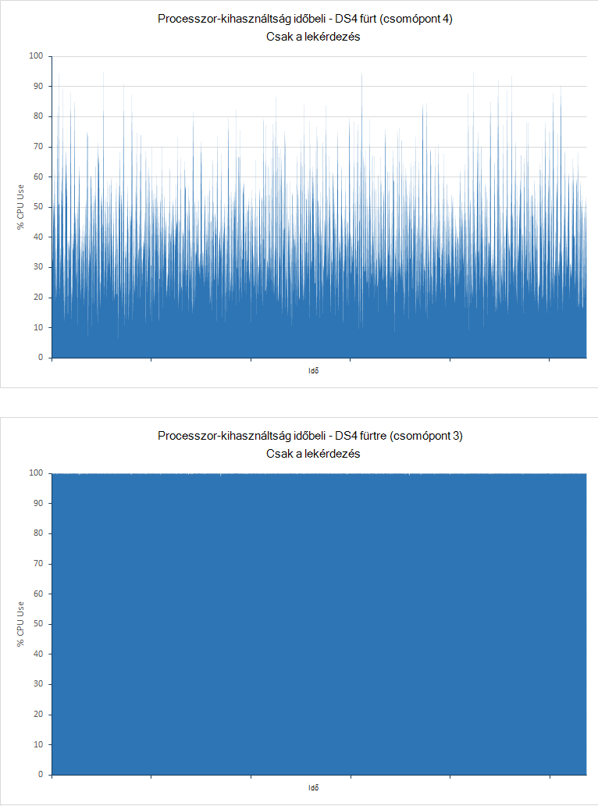

***A legkevésbé processzort használt, és a leggyakrabban használt csomópontok a DS4 fürt csak a lekérdezés tesztelése***

A DS14 fürt ez nem volt a helyzet. Processzor-kihasználtság mindkét vizsgálatok alsó minden csomópontra, és egy másik kópiába elérhetősége vált kisebb előny és további egy általános:

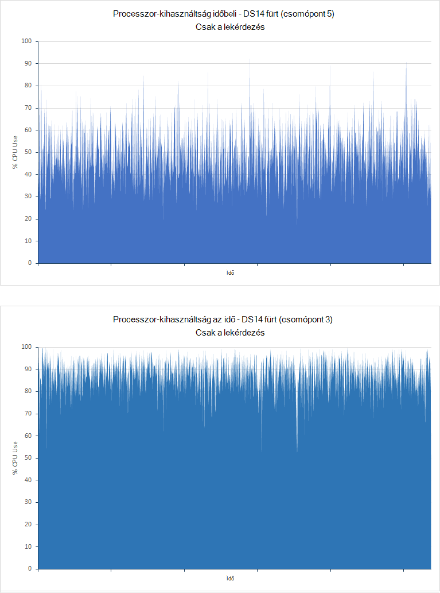

***A legkevésbé processzort használt, és a leggyakrabban használt csomópontok a DS14 fürt csak a lekérdezés tesztelése***

Ezek az eredmények megjelenítése a segítségre van szüksége, a rendszer gondosan összehasonlító a szeretné-e használni több kópiák kiválasztásakor. Mindig szerepelnie kell legalább egy replikája minden index (kivéve, ha hajlandó kockázat adatvesztést, ha nem sikerül egy csomópont), de további kópiák is bevezetése a rendszer a kis-kedvezményre, attól függően, hogy a munkaterhelésének és a rendelkezésre álló a fürthöz hardver-erőforrások terhet.

## <a name="performance-results---doc-values"></a>Teljesítmény eredménye - dokumentum értékek

A *Bevitel és a lekérdezés* teszteket értékű dokumentum engedélyezve, lemezen mezők rendezéséhez használt adatok tárolására Elasticsearch okozó voltak vonatkozóan. Tesztek le van tiltva, így Elasticsearch fielddata dinamikusan kialakítani, és a gyorsítótárban tárolt azt a dokumentumot értékű voltak ismételni. Az összes teszt futtatta 24 órát. Az alábbi táblázat vizsgálatok futtatása beépített D4, DS4 és DS14 VMs (a D4 fürt használja, normál merevlemez a DS4 és DS14 fürt SSD használata közben) 6 csomópontok fürt válaszidő hasonlítja össze.

| Fürthöz | A művelet vagy lekérdezés            | Átlagos válaszidő (ms) - dokumentum értékek engedélyezve | Átlagos válaszidő (ms) - dokumentum értékek letiltása | százalékos eltérés válaszidő |
|---------|----------------------------|-------------------------------------------------|--------------------------------------------------|-------------------------------|
| D4      | Bevitel                  | 978                                             | 835                                              | -15 %-kal                          |
|         | Minősítés szerint száma            | 103                                             | 132                                              | + 28 %                          |
|         | Darab felett idő            | 134                                             | 189                                              | + 41 %                          |
|         | A találatok országonkénti            | 199                                             | 259                                              | + 30 %                          |
|         | Felső 15 szervezetekben       | 137                                             | 184                                              | + 34 %-kal                          |
|         | A szervezet egyedi száma | 139                                             | 197                                              | + 42 %                          |
|         | Egyedi IP száma            | 510                                             | 604                                              | + a 18 %                          |
|         | Találatok száma           | 89                                              | 134                                              | + 51 %                          |
||||||
| DS4     | Bevitel                  | 511                                             | 581                                              | + 14 %                          |
|         | Minősítés szerint száma            | 187                                             | 190                                              | + 2 %                           |
|         | Darab felett idő            | 411                                             | 409                                              | -0,5 %                         |
|         | A találatok országonkénti            | 402                                             | 414                                              | + 3 %                           |
|         | Felső 15 szervezetekben       | 307                                             | 284                                              | – 7 %                           |
|         | A szervezet egyedi száma | 320                                             | 313                                              | -2 %                           |
|         | Egyedi IP száma            | 841                                             | 955                                              | + 14 %                          |
|         | Találatok száma           | 236.                                             | 281                                              | + 19 %                          |
||||||
| DS14    | Bevitel                  | 511                                             | 571                                              | + 12 %                          |
|         | Minősítés szerint száma            | 201                                             | 232                                              | + 15 %-kal                          |
|         | Darab felett idő            | 298                                             | 341                                              | + 14 %                          |
|         | A találatok országonkénti            | 363                                             | 457                                              | + 26 %-kal                          |
|         | Felső 15 szervezetekben       | 244                                             | 338                                              | + 39 %                          |
|         | A szervezet egyedi száma | 283                                             | 350                                              | + 24 %                          |
|         | Egyedi IP száma            | 681                                             | 909                                              | + 33 %-kal                          |
|         | Találatok száma           | 200                                             | 245                                              | + 23 %-kal                          |

A következő táblázat a bevitel műveletek tesztek által elvégzett száma hasonlítja össze:

| Fürthöz | Bevitel művelet száma - dokumentum értékek engedélyezve | Bevitel művelet száma - dokumentum értékek letiltva | a bevitel műveletek \number százalékos eltérés |
|---------|----------------------------------------------|-----------------------------------------------|-----------------------------------------|
| D4      | 264769                                       | 408690                                        | + 54 %                                    |
| DS4     | 503137                                       | 578237                                        | + 15 %-kal                                    |
| DS14    | 502714                                       | 586472                                        | + 17 %                                    |

A továbbfejlesztett bevitel kamatlábak szerint kevesebb adatot, a program beszúrja a dokumentumok lemezre írása letiltva dokumentum értékű fordul elő. A nagyobb teljesítmény különösen észrevehető lesz a D4 virtuális adattárolásra HDDs használatával. A válaszidő ebben az esetben is (lásd az ebben a szakaszban az első tábla) 15 %-kal csökkent bevitel műveletekhez. Ez lehet miatt a csökkentett nyomása a HDDs, amelyek valószínűleg a futnia közelébe azok a próba-IOPS korlátozások a dokumentum értékek engedélyezve, látható a lemez típusú vizsgálat további információt. A következő ábra Miben más a D4 VMs I/O teljesítményének dokumentum értékek engedélyezve van (a lemezen tárolt értékeket), és a dokumentum értékek letiltva (a memóriában tárolt értékeket):


***Lemezen tevékenységet a D4 fürt dokumentum értékű engedélyezése és letiltása***

Viszont a VMs SSD használata bevitel értékének egy kis növelése megjelenítése a dokumentumok, de a bevitel műveletek válaszidő emelése számát. Egy vagy két kis kivételekkel lekérdezés válaszidő is voltak rosszabb. A SSD valószínűleg kisebb futnia közelébe IOPS határai engedélyezve, a dokumentum értékű, a módosításokat a teljesítmény valószínűleg több oka az, hogy nőnek feldolgozási tevékenység és a terhelést a JVM halommemória kezelése. Ez a egyértelmű dokumentum értékek engedélyezése és letiltása a Processzor kihasználtsági összehasonlításával. A következő diagram kiemeli a DS4 fürt, ahol nagy része a Processzor kihasználtsági helyezi át a 30-40 % sávban a engedélyezve, a 40-50 % sáv letiltva dokumentum értékeket tartalmazó dokumentum értékű ezeket az adatokat (a DS14 fürt trendet egy hasonló):


***A DS4 fürt dokumentum értékű processzort engedélyezve van, és letiltása***

A dokumentum értékek hatása a lekérdezési teljesítmény származó adatok bevitel megkülönböztetni, csak lekérdezés vizsgálatok pár dokumentum értékű engedélyezése és letiltása végeztek a DS4 és DS14 fürtre vonatkozóan. Az alábbi táblázat összefoglalja a vizsgálat eredményét:

| Fürthöz | A művelet vagy lekérdezés            | Átlagos válaszidő (ms) - dokumentum értékek engedélyezve | Átlagos válaszidő (ms) - dokumentum értékek letiltása | százalékos eltérés válaszidő |
|---------|----------------------------|-------------------------------------------------|--------------------------------------------------|-------------------------------|
| DS4     | Minősítés szerint száma            | 4489                                            | 3736                                             | -16 %                          |
|         | Darab felett idő            | 7293                                            | 5459                                             | -25 %-kal                          |
|         | A találatok országonkénti            | 7564                                            | 5930                                             | -22-es %                          |
|         | Felső 15 szervezetekben       | 5066                                            | 3874                                             | – 14 %                          |
|         | A szervezet egyedi száma | 5231                                            | 4483                                             | -2 %                           |
|         | Egyedi IP száma            | 9228                                            | 9474                                             | + 3 %                           |
|         | Találatok száma           | 2180                                            | 1218                                             | -44 %                          |
||||||
| DS14    | Minősítés szerint száma            | 1927                                            | 2144                                             | + 11 %                          |
|         | Darab felett idő            | 4483                                            | 4337                                             | -3 %                           |
|         | A találatok országonkénti            | 4761                                            | 4840                                             | + 2 %                           |
|         | Felső 15 szervezetekben       | 2117                                            | 2302                                             | + 9 %                           |
|         | A szervezet egyedi száma | 2393                                            | 2497                                             | + 4 %                           |
|         | Egyedi IP száma            | 7159                                            | 7639                                             | + 7 %                           |
|         | Találatok száma           | 642                                             | 633                                              | -1 %-os                           |

Ne feledje, hogy Elasticsearch 2.0-s-től, a dokumentum értékek alapértelmezés szerint engedélyezve van. A DS4 fürt kiterjedő tesztek, a dokumentum értékek letiltása megjelenik pozitív hatást általános, mivel a fordított általában igaz, a DS14 fürt (a két esetekben, amikor teljesítmény jobb letiltva dokumentum értékű azok nagyon csekély).

A DS4 fürt Processzor kihasználtsági mindkét esetben pedig a 100 %-os közelébe mindkét vizsgálat, amely megmutatja, hogy a fürt volt kötött Processzor időtartamára. Jó helyen jár feldolgozott lekérdezések száma csökkent 7369 5894 (20 %). Ne feledje, hogy ha dokumentumot értékek ki vannak kapcsolva Elasticsearch dinamikusan készítése fielddata a memóriában, és ez fogyasztása Processzor power. Ez a beállítás van csökkentett lemeztevékenység, de már fut a maximális funkciók közelébe processzorok a nagyobb terhelési mértéke, így ebben az esetben lekérdezések gyorsabb letiltva dokumentum értékű vannak azonban kevesebb el őket.

Dokumentum értékek Processzor nélkül és DS14 tesztek tevékenység magas, de nem a 100 %-os volt. A elvégzett lekérdezések száma némileg magasabb volt (körülbelül 4 %) engedélyezett dokumentum értékű vizsgálatok:

| Fürthöz | Lekérdezés                      | Szám elvégzett - dokumentum értékek engedélyezve | Szám elvégzett - dokumentum értékek letiltva |
|---------|----------------------------|---------------------------------------|----------------------------------------|
| DS4     | Minősítés szerint száma            | 1054                                  | 845                                    |
|         | Darab felett idő            | 1054                                  | 844                                    |
|         | A találatok országonkénti            | 1053                                  | 842                                    |
|         | Felső 15 szervezetekben       | 1055                                  | 846                                    |
|         | A szervezet egyedi száma | 1051                                  | 839                                    |
|         | Egyedi IP száma            | 1051                                  | 839                                    |
|         | Találatok száma           | 1051                                  | 839  
|||||                                  |
| DS14    | Minősítés szerint száma            | 1772                                  | 1842                                   |
|         | Darab felett idő            | 1772                                  | 1839                                   |
|         | A találatok országonkénti            | 1770                                  | 1838                                   |
|         | Felső 15 szervezetekben       | 1773                                  | 1842                                   |
|         | A szervezet egyedi száma | 1769                                  | 1837                                   |
|         | Egyedi IP száma            | 1768                                  | 1837                                   |
|         | Találatok száma           | 1769                                  | 1837                                   |

## <a name="performance-results---shard-request-cache"></a>Teljesítmény eredménye - shard kérelem gyorsítótár

Bemutatják, hogyan befolyásolhatja a memória minden csomópont gyorsítótárazási index adatait a teljesítményt, hogy a *lekérdezés és a bevitel* vizsgálat egy DS4 lett vonatkozóan, és az index gyorsítótárazás DS14 6-csomópont fürt engedélyezett - tanulmányozza a további információt [a shard kérelem gyorsítótár használatával](#using-the-shard-request-cache) szakaszban. Az eredmények számára generált korábbi tesztek segítségével ugyanazt az indexet, de index gyorsítótárazás letiltva volt képest. Az alábbi táblázat összefoglalja az eredményeket. Ne feledje, hogy az adatok van már iránti, hogy pontosan illeszkedjen a csak az első 90 percben a próba, ezen a ponton a összehasonlító trend volt látható a tesztet a Folytatás volna valószínűleg van nem származó minden további Hírcsatornájában:

| Fürthöz | A művelet vagy lekérdezés            | Átlagos válaszidő (ms) - index gyorsítótár letiltva | Átlagos válaszidő (ms) - index gyorsítótár engedélyezve | százalékos eltérés válaszidő |
|---------|----------------------------|---------------------------------------------------|--------------------------------------------------|-------------------------------|
| DS4     | Bevitel                  | 504                                               | 3260                                             | + 547 %                         |
|         | Minősítés szerint száma            | 218                                               | 273                                              | + 25 %-kal                          |
|         | Darab felett idő            | 450                                               | 314                                              | – 30 %                          |
|         | A találatok országonkénti            | 447                                               | 397                                              | -11-es %                          |
|         | Felső 15 szervezetekben       | 342                                               | 317                                              | – 7 %                           |
|         | A szervezet egyedi száma | 370                                               | 324                                              | – 12 %%                         |
|         | Egyedi IP száma            | 760                                               | 355                                              | – 53 %                          |
|         | Találatok száma           | 258                                               | 291.                                              | + 12 %                          |
||||||
| DS14    | Bevitel                  | 503                                               | 3365                                             | + 569 %                         |
|         | Minősítés szerint száma            | 234                                               | 262                                              | + 12 %                          |
|         | Darab felett idő            | 357                                               | 298                                              | – 17 %                          |
|         | A találatok országonkénti            | 416                                               | 383                                              | -8 %-kal                           |
|         | Felső 15 szervezetekben       | 272                                               | 324                                              | – 7 %                           |
|         | A szervezet egyedi száma | 330                                               | 321                                              | -3 %                           |
|         | Egyedi IP száma            | 674                                               | 352                                              | – 48 %                          |
|         | Találatok száma           | 227                                               | 292                                              | + 29 %                          |

Az adatok két fontos pontjainak megjelölése jeleníti meg:

-  Bevitel adatsebesség nagyban kell szüntetni, mivel az index gyorsítótárazás jelennek meg.

-  Index gyorsítótárazás nem feltétlenül növelhető a lekérdezés minden típusú válaszidő, és beállíthatja, hogy bizonyos összesítő műveletekhez, például a darabszám szerint értékelése és a találatok darabszáma lekérdezések kísérletei ártalmas.
 

Ha meg szeretné érteni, hogy miért a rendszer tartalmazza-e ez a jelenség, figyelembe sikeresen elvégzett minden esetben a próba futása közben lekérdezések száma. Az alábbi táblázat összefoglalja az adatok:

| Fürthöz | A művelet vagy lekérdezés            | Műveletek/lekérdezések száma - index gyorsítótár letiltva | Műveletek/lekérdezések száma - index gyorsítótár engedélyezve |
|---------|----------------------------|-------------------------------------------------|------------------------------------------------|
| DS4     | Bevitel                  | 38611                                           | 13232                                          |
|         | Minősítés szerint száma            | 524                                             | 18704                                          |
|         | Darab felett idő            | 523                                             | 18703                                          |
|         | A találatok országonkénti            | 522                                             | 18702                                          |
|         | Felső 15 szervezetekben       | 521                                             | 18706                                          |
|         | A szervezet egyedi száma | 521                                             | 18700                                          |
|         | Egyedi IP száma            | 521                                             | 18699                                          |
|         | Találatok száma           | 521                                             | 18701                                          |
||||                                        |
| DS14    | Bevitel                  | 38769                                           | 12835                                          |
|         | Minősítés szerint száma            | 528                                             | 19239                                          |
|         | Darab felett idő            | 528                                             | 19239                                          |
|         | A találatok országonkénti            | 528                                             | 19238                                          |
|         | Felső 15 szervezetekben       | 527                                             | 19240                                          |
|         | A szervezet egyedi száma | 524                                             | 19234                                          |
|         | Egyedi IP száma            | 524                                             | 19234                                          |
|         | Találatok száma           | 527                                             | 19236                                          |

Láthatja, hogy a bevitel ráta, ha engedélyezve van a gyorsítótár-gyorsítótárazás le lett tiltva körülbelül 1/3 arra, hogy volt, bár elvégzett lekérdezések száma nagyobb 34 tényezővel. Lekérdezések nem annyi lemeztevékenység merülnek fel, és nem volt kapcsolatos lemez erőforrások. Ez az alábbi ábrán az I/O tevékenység négy minden esetben összehasonlítása sokféle tükröződik:

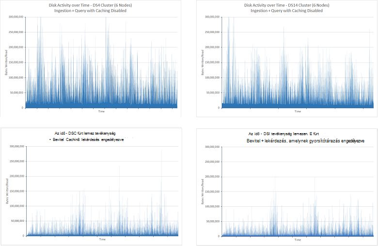

***A bevitel és a lekérdezés tesztelése az index gyorsítótárazás lemeztevékenység tevékenység letiltása és engedélyezett***

Lemeztevékenység csökkenése is jelenti, hogy a Processzor töltött kevesebb időt Várakozás a bemenet-befejezéséhez. Ez a következő ábrán szerint kiemelt:

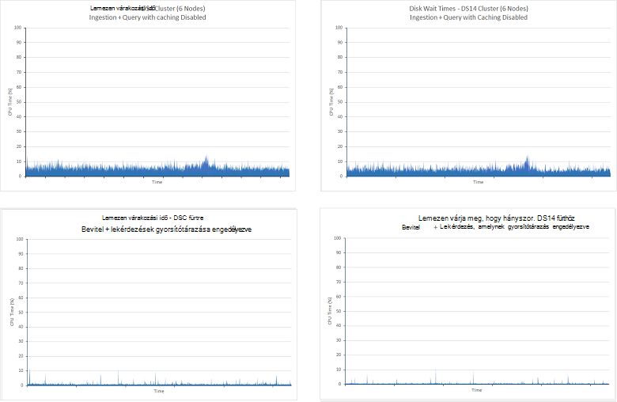

***Processzor időként befejezéséhez az index gyorsítótárazás engedélyezve, a bevitel és a lekérdezés vizsgálathoz lemeztevékenység Várakozás***

A lemez I/O, az azt jelenti, hogy Elasticsearch sikerült-e az időt, a lekérdezések adatokból egy sokkal nagyobb részét töltött csökkenése a memóriában tartani. A nagyobb Processzor kihasználtsági, amely kitűnik, ha megnézi az Processzor kihasználtsági négy minden esetben. A lenti grafikonok bemutatják, hogyan gyorsítótárazás engedélyezve van a fenntartható az Processzor használata több:

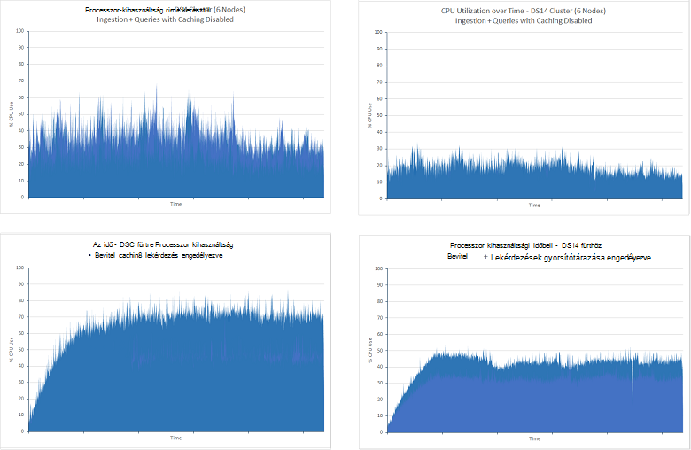

***Processzor-kihasználtság a bevitel és a lekérdezés tesztelése az index gyorsítótárazás engedélyezve***

A hálózati I/O mindkét esetben az időtartamra tesztek mennyiségű sokban volt. Anélkül, hogy gyorsítótárba tesztek mutatott egy fokozatos csökkenés során a próbaidőszak, de a hosszabb 24 órás fut, hogy a statisztikai megállapodott a körülbelül 2.75GBps mutatott tesztek. Az alábbi képen látható, ezeket az adatokat a DS4 fürtre (az adatokat a DS14 fürtre vonatkozóan volt nagyon hasonlít) vonatkozóan:

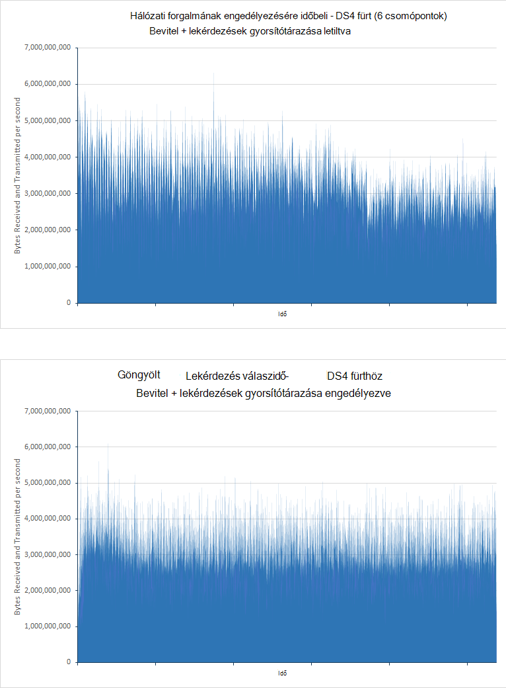

***Hálózati forgalmának engedélyezésére kötet a bevitel és a lekérdezés vizsgálathoz az index gyorsítótárazás engedélyezve***

A [Méretezés](#performance-results-scaling-up) vizsgálat leírtak a hálózati sávszélességet az Azure VMs korlátozások közzétéve, és eltérő lehet, de Processzor- és tevékenység mérsékelt szintjei javításukhoz javasolt, hogy a hálózati kihasználtsági ebben az esetben a korlátozó tényező lehet.

További természetesen illeszkednek az esetek, amikor adatokat ritkán változó gyorsítótárazás. Jelölje ki a milyen következményekkel járnak a gyorsítótár-ebben az esetben a *csak a lekérdezés* vizsgálatok végeztek a gyorsítótár-engedélyezve van. Az eredmények alább látható módon, hogy (ezek a vizsgálatok 90 percig, és a vizsgált az indexek tárolt dokumentumok a 100 milliós):

| Fürthöz | Lekérdezés                      | Átlagos válaszidő (ms) | Elvégzett lekérdezések száma |
|---------|----------------------------|----------------------------|-------------------------|
|         |                            | **Gyorsítótár letiltva**         | **Gyorsítótár engedélyezve**       |
| DS4     | Minősítés szerint száma            | 4489                       | 210                     |
|         | Darab felett idő            | 7292                       | 211                     |
|         | A találatok országonkénti            | 7564                       | 231                     |
|         | Felső 15 szervezetekben       | 5066                       | 211                     |
|         | A szervezet egyedi száma | 5231                       | 211                     |
|         | Egyedi IP száma            | 9228                       | 218                     |
|         | Találatok száma           | 2180                       | 210                     |
|         |                            |                            |                         |
| DS14    | Minősítés szerint száma            | 1927                       | 211                     |
|         | Darab felett idő            | 4483                       | 219                     |
|         | A találatok országonkénti            | 4761                       | 236.                     |
|         | Felső 15 szervezetekben       | 2117                       | 212                     |
|         | A szervezet egyedi száma | 2393                       | 212                     |
|         | Egyedi IP száma            | 7159                       | 220                     |
|         | Találatok száma           | 642                        | 211                     |

A teljesítmény olvasásának tesztek varianciáját oka az, hogy az erőforrás elérhető és közötti különbség a DS4 DS14 VMs. Mindkét esetben a gyorsítótárban tárolt próba adatként jelentősen csökkent átlagos válaszidő sikerült éppen beolvasni, közvetlenül a memória. Érdemes is megjegyezni, hogy válaszidő-a gyorsítótárban tárolt DS4 és DS14 fürt vizsgálatok nagyon hasonlít a különbség a olvasásának eredményekkel ellentétben. Szintén minden egyes próba belül lekérdezés válaszidő nagyon kevés különbségét, az összes veszik körülbelül 220ms. A lemezművelet mértékeket és a Processzor kihasználtsági mindkét fürtre vonatkozóan voltak nagyon kicsi egyszer mind a memóriában adatai kis I/O vagy feldolgozás szükség. A hálózati I/O ráta, amely nem gyorsítótárazott tesztek, amely megerősíti, hogy a hálózat sávszélessége lehetséges, hogy a tesztet a korlátozó tényező hasonló volt. A következő grafikonok megosztása: ezt az információt a DS4 fürt. A profilt a DS14 fürt volt nagyon hasonlít:

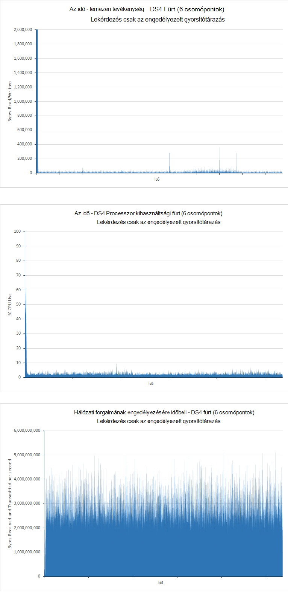

***Lemeztevékenység, Processzor kihasználtsági és a lekérdezés csak vizsgálathoz index gyorsítótárazás engedélyezve van a hálózati kihasználtság***

A fenti táblázatban az a oszlop értékeit ajánlja fel, hogy a DS14 architektúra használatával ábrázolja kis kedvezménye a DS4 használatával. Erre valójában a DS14 fürt által generált minták száma körülbelül 5 % alatt, amely a DS4 fürt, de ezt is okozhatja hálózati korlátozások, amely kissé időbeli változhat.

## <a name="performance-results---number-of-shards"></a>Teljesítmény eredménye - shards száma

A próba célja volt megállapítani, hogy van-e index által létrehozott shards számát bármely szem előtt, hogy az index a lekérdezés teljesítményét.

Végzett külön vizsgálatok korábban kiderült, hogy a tárgymutató shard konfigurációja hatással lehet a adatok bevitel mértékét. A teszteket vonatkozóan, a lekérdezési teljesítmény követni egy hasonló módszertan, de DS14 hardveren rendszerű 6-csomópont fürtre korlátozta határozza meg. Ezt a megközelítést segít a lehető legkevesebb változót, így a teljesítmény eltéréseket shards mennyisége miatt.

A *csak a lekérdezés* tesztelése ugyanazt az indexet, 7, 13-mal, 23, 37 és 61 elsődleges shards konfigurált példányainak lett vonatkozóan. Az index 100 milliós dokumentumokat tartalmazza, és replikát, shards számát cérnázó végig a fürt volt. Az egyes vizsgálatok 90 percig futtatta. Az alábbi táblázat összefoglalja az eredményeket. Látható, amely magában foglalja a lekérdezések teljes készlete JMeter próba tranzakció válaszidő végzi a próba törzsének átlagos válaszidő. Lásd: a [Teljesítmény eredménye - méretezés](#performance-results-scaling-up) szakaszban további információt a feljegyzés:

| Shards száma          | Shard elrendezés (egyes csomópontok, többek között a kópiák shards) | Elvégzett lekérdezések száma | AVG válaszidő (ms) |
|---------------------------|----------------------------------------------------|-----------------------------|------------------------|
| 7 (például kópiák 14) | 3-2-2-2-2-3                                        | 7461                        | 40524                  |
| a 13 (26)                   | 5-4-5-4-4-4                                        | 7369                        | 41055                  |
| 23 (46)                   | 7-8-8-7-8-8                                        | 14193                       | 21283                  |
| 37 (74)                   | 13-12-12-13-12-12                                  | 13399                       | 22506                  |
| 61 (122)                  | 20-21-20-20-21-20                                  | 14743                       | 20445                  |

Ezek az eredmények azt mutatják, hogy van egy jelentős teljesítménybeli és közötti különbség a 13(26) shard fürt a 23,(46) shard fürt, átviteli majdnem megduplázódik válaszidő felezéséhez. Ez a leggyakoribb okokat, a VMs és a keresési kérelem feldolgozása használó Elasticsearch konfigurációja miatt. Keresés kérései, és minden egyes keresési kérelem egyetlen keresési szál kezeli. A keresés szálak egy Elasticsearch csomópont által létrehozott egy függvény a szám elérhető a számítógépen a csomópont szolgáltatója processzort szeretne. Az eredmények ajánlja fel, hogy csak 4 vagy 5 shards csomópontot, a feldolgozás erőforrások nem készül teljesen használhatók. Ez megjeleníti a Processzor kihasználtsági kikeresésére futtatása közben támogatott. Az alábbi képen a 13(26) shard próba során Marvel vett pillanatkép:

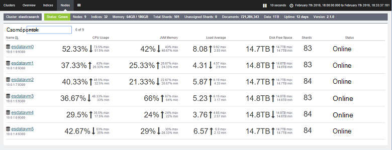

***A lekérdezés csak vizsgálathoz a 7(14) shard fürt Processzor kihasználtság***

Ezeket az adatokat a 23(46) shard próba azokkal összehasonlítása:

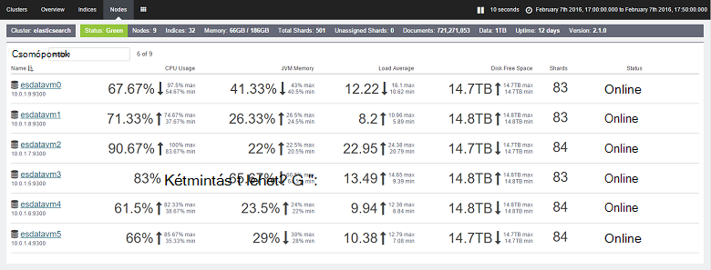

***A lekérdezés csak vizsgálathoz a 23(46) shard fürt Processzor kihasználtság***

A 23(46) shard próba Processzor kihasználtsági távol magasabb volt. Az egyes csomópontok 7 vagy 8 shards tartalmazza. A DS14 architektúra 16 processzorok, és Elasticsearch jobban kihasználni, a további shards magmintákat száma. A fenti táblázatban az a oszlop értékeit ajánlja fel, hogy túl az eddigi shards számának növelése javíthatja a teljesítményt kissé, de meg kell eltolás ezeket az adatokat a további terhelést shards nagy mennyiségű tartására szemben. Ezek a vizsgálatok szemléltetnek, hogy az optimális shards egyes csomópontok egy érhető el minden csomóponton Processzormagok fele számát. Ne feledje azonban, hogy ezek az eredmények voltak érhető el, amikor csak futó lekérdezések. Ha a rendszer az adatok importálása, is figyelembe hogyan sharding hatással lehet a bevitel adatműveleteket a teljesítménye. 

## <a name="summary"></a>Összefoglalás

Elasticsearch Itt számos indexek szerkezetének és optimalizálhatja a támogatja a nagyméretű lekérdezés műveleteket is használhatja. A dokumentum magában foglalja össze, néhány gyakori konfigurációk és technikákat optimalizálhatja az adatbázis lekérdezés célokra használható. Azonban felismeri, hogy van-e egy útján optimalizálása a támogatási gyors lekérés, nem pedig a nagy mennyiségű adat bevitel támogató adatbázis között. Előfordul, hogy mi az jó lekérdezésére befolyásolhatja a sértő beszúrást, és ez fordítva is igaz. Vegyes munkaterhelésekből van kitéve egy rendszerben kell mérje fel, hogy hol helyezkedik el a fennmaradó és a rendszer-paraméterek beállítása lehetőséget.

Emellett az alkalmazási terület különböző beállításokat és technikák eltérőek lehetnek attól függően, az adatok és korlátozások felépítésének (vagy más módon) a hardver a rendszer a összeállítás. Sok dokumentum látható tesztek mutatják be, milyen hatással van a kijelölést a hardver platformot is átviteli, valamint hogyan néhány stratégiák előnyös bizonyos esetekben, de más sértő lehet. A fontos pont rendelkezésre álló lehetőségekről, és hajtsa végre a szigorú mérés saját adatok használata a legtöbb optimális kombinációja határozza meg.

Végezetül ne felejtse, hogy egy Elasticsearch adatbázisa nem feltétlenül egy statikus elemre. Adott idő alatt a program valószínűleg nagyobb, és a az adatok strukturálása használt stratégiák szükséges rendszeresen jelez. Például azt is, hogy méretezni, méretezése, vagy újraindexelés további shards adataival. A rendszer méretétől és összetettségétől növekszik, mint készüljön folyamatosan tesztelje a teljesítmény annak érdekében, hogy továbbra is vannak értekezlet bármely SLA garantált oda az ügyfelekre.

## <a name="appendix-the-query-and-aggregation-performance-test"></a>. Melléklet: a lekérdezési és összesítési vizsgálat

E melléklet írja le a címtáron a Elasticsearch fürt vizsgálat. A tesztek voltak VMs külön halmazának futó JMeter használatával. Részletek a próba-környezet konfigurációja az [Azure a Elasticsearch környezet tesztelése előadás létrehozása](guidance-elasticsearch-creating-performance-testing-environment.md). Teszteléssel saját, létrehozhat saját JMeter teszttervre manuálisan követően az útmutató licencelik, vagy használhatja a rendelkezésre álló automatizált próba parancsfájlok külön-külön. További tudnivalókért olvassa el a [automatizált Elasticsearch teljesítmény vizsgálatok futtatása](guidance-elasticsearch-running-automated-performance-tests.md)című témakört.

Az adatok lekérdezés terhelést végrehajtani, egyszerre egy nagyméretű feltöltése a dokumentumok végrehajtása során az alábbiakban ismertetett lekérdezések csoportja. Ez a terhelést célja volt hasonlóan egy üzemi környezetben, ahol új adatok folyamatosan bővülő közben módon végzi a keresést. A lekérdezések voltak strukturált a legfrissebb adatok lekérése az utolsó 15 perces felvett dokumentumok.

Minden dokumentum *idx*nevű egyetlen indexbe van tárolva, és a típus *dokumentum*volt. A következő HTTP-kérés létre szeretné hozni az indexet is használhatja. A sok tesztek alább értékekből változatos *number_of_replicas* és *number_of_shards* beállításai. Emellett a vizsgálatok fielddata, hanem a dokumentum értékek, az egyes tulajdonság használt lett vezetni a attribútum *"doc_values": hamis*.

**Fontos**: az index kihagyott és a ismét létrehozza az egyes vizsgálatok futtatása előtt. 

``` http
PUT /idx
{  
    "settings" : {
        "number_of_replicas": 1,
        "refresh_interval": "30s",
        "number_of_shards": "5",
        "index.translog.durability": "async"    
    },
    "doc": {
        "mappings": {
            "event": {
                "_all": {
                    "enabled": false
                },
                "_timestamp": {
                    "enabled": true,
                    "store": true,
                    "format": "date_time"
                },
                "properties": {
                    "Organization": {
                        "type": "string",
                        "index": "not_analyzed"
                    },
                    "CustomField1": {
                        "type": "string",
                        "index": "not_analyzed"
                    },
                    "CustomField2": {
                        "type": "string",
                        "index": "not_analyzed"
                    },
                    "CustomField3": {
                        "type": "string",
                        "index": "not_analyzed"
                    },
                    "CustomField4": {
                        "type": "string",
                        "index": "not_analyzed"
                    },
                    "CustomField5": {
                        "type": "string",
                        "index": "not_analyzed"
                    },
                    "DateTimeReceivedUtc": {
                        "type": "date",
                        "format": "dateOptionalTime"
                    },
                    "Host": {
                        "type": "string",
                        "index": "not_analyzed"
                    },
                    "HttpMethod": {
                        "type": "string",
                        "index": "not_analyzed"
                    },
                    "HttpReferrer": {
                        "type": "string",
                        "index": "not_analyzed"
                    },
                    "HttpRequest": {
                        "type": "string",
                        "index": "not_analyzed"
                    },
                    "HttpUserAgent": {
                        "type": "string",
                        "index": "not_analyzed"
                    },
                    "HttpVersion": {
                        "type": "string",
                        "index": "not_analyzed"
                    },
                    "OrganizationName": {
                        "type": "string",
                        "index": "not_analyzed"
                    },
                    "SourceIp": {
                        "type": "ip"
                    },
                    "SourceIpAreaCode": {
                        "type": "long"
                    },
                    "SourceIpAsnNr": {
                        "type": "string",
                        "index": "not_analyzed"
                    },
                    "SourceIpBase10": {
                        "type": "long"
                    },
                    "SourceIpCity": {
                        "type": "string",
                        "index": "not_analyzed"
                    },
                    "SourceIpCountryCode": {
                        "type": "string",
                        "index": "not_analyzed"
                    },
                    "SourceIpLatitude": {
                        "type": "double"
                    },
                    "SourceIpLongitude": {
                        "type": "double"
                    },
                    "SourceIpMetroCode": {
                        "type": "long"
                    },
                    "SourceIpPostalCode": {
                        "type": "string",
                        "index": "not_analyzed"
                    },
                    "SourceIpRegion": {
                        "type": "string",
                        "index": "not_analyzed"
                    },
                    "SourceLatLong": {
                        "type": "geo_point",
                        "doc_values": true,
                        "lat_lon": true,
                        "geohash": true
                    },
                    "SourcePort": {
                        "type": "string",
                        "index": "not_analyzed"
                    },
                    "SourcedFrom": {
                        "type": "string",
                        "index": "not_analyzed"
                    },
                    "TargetIp": {
                        "type": "ip"
                    },
                    "TargetPort": {
                        "type": "string",
                        "index": "not_analyzed"
                    },
                    "Rating": {
                        "type": "string",
                        "index": "not_analyzed"
                    },
                    "UseHumanReadableDateTimes": {
                        "type": "boolean"
                    }
                }
            }
        }
    }
}
```

A következő lekérdezések végeztek vizsgálat:
* Hány dokumentumok, az egyes minősítési érték van megadva, az utolsó 15 perces?

  ```http
  GET /idx/doc/_search
  {
    "query": {
      "bool": {
        "must": [
          {
            "range": {
              "DateTimeReceivedUtc": {
                "gte": "now-15m",
                "lte": "now"
              }
            }
          }
        ],
        "must_not": [],
        "should": []
      }
    },
    "from": 0,
    "size": 0,
    "aggs": {
      "2": {
        "terms": {
          "field": "Rating",
          "size": 5,
          "order": {
            "_count": "desc"
          }
        }
      }
    }
  }
  ```

* Hány dokumentumok egyes 5 perc intervallum van hozzáadva az utolsó 15 percet során?

  ```http
  GET /idx/doc/_search
  {
    "query": {
      "bool": {
        "must": [
          {
            "range": {
              "DateTimeReceivedUtc": {
                "gte": "now-15m",
                "lte": "now"
              }
            }
          }
        ],
        "must_not": [],
        "should": []
      }
    },
    "from": 0,
    "size": 0,
    "sort": [],
    "aggs": {
      "2": {
        "date_histogram": {
          "field": "DateTimeReceivedUtc",
          "interval": "5m",
          "time_zone": "America/Los_Angeles",
          "min_doc_count": 1,
          "extended_bounds": {
            "min": "now-15m",
            "max": "now"
          }
        }
      }
    }
  }
  ```

* Az utolsó 15 perces hány dokumentumok egyes értékelése az értékek felvétele az egyes országok?

  ```HTTP
  GET /idx/doc/_search
  {
    "query": {
      "filtered": {
        "query": {
          "query_string": {
            "query": "*",
            "analyze_wildcard": true
          }
        },
        "filter": {
          "bool": {
            "must": [
              {
                "query": {
                  "query_string": {
                    "query": "*",
                    "analyze_wildcard": true
                  }
                }
              },
              {
                "range": {
                  "DateTimeReceivedUtc": {
                    "gte": "now-15m",
                    "lte": "now"
                  }
                }
              }
            ],
            "must_not": []
          }
        }
      }
    },
    "size": 0,
    "aggs": {
      "2": {
        "terms": {
          "field": "Rating",
          "size": 5,
          "order": {
            "_count": "desc"
          }
        },
        "aggs": {
          "3": {
            "terms": {
              "field": "SourceIpCountryCode",
              "size": 15,
              "order": {
                "_count": "desc"
              }
            }
          }
        }
      }
    }
  }
  ```

* Melyik 15 szervezetek leggyakrabban előforduló az utolsó 15 perces felvett dokumentumok?

  ```http
  GET /idx/doc/_search
  {
    "query": {
      "filtered": {
        "query": {
          "query_string": {
            "query": "*",
            "analyze_wildcard": true
          }
        },
        "filter": {
          "bool": {
            "must": [
              {
                "query": {
                  "query_string": {
                    "query": "*",
                    "analyze_wildcard": true
                  }
                }
              },
              {
                "range": {
                  "DateTimeReceivedUtc": {
                    "gte": "now-15m",
                    "lte": "now"
                  }
                }
              }
            ],
            "must_not": []
          }
        }
      }
    },
    "size": 0,
    "aggs": {
      "2": {
        "terms": {
          "field": "Organization",
          "size": 15,
          "order": {
            "_count": "desc"
          }
        }
      }
    }
  }
  ```

* Az utolsó 15 perces felvett dokumentumok hány más szervezetek fordul elő?

  ```http
  GET /idx/doc/_search
  {
    "query": {
      "filtered": {
        "query": {
          "query_string": {
            "query": "*",
            "analyze_wildcard": true
          }
        },
        "filter": {
          "bool": {
            "must": [
              {
                "query": {
                  "query_string": {
                    "query": "*",
                    "analyze_wildcard": true
                  }
                }
              },
              {
                "range": {
                  "DateTimeReceivedUtc": {
                    "gte": "now-15m",
                    "lte": "now"
                  }
                }
              }
            ],
            "must_not": []
          }
        }
      }
    },
    "size": 0,
    "aggs": {
      "2": {
        "cardinality": {
          "field": "Organization"
        }
      }
    }
  }
  ```

* Hány dokumentumok van hozzáadva az utolsó 15 perces?

  ```http
  GET /idx/doc/_search
  {
    "query": {
      "filtered": {
        "query": {
          "query_string": {
            "query": "*",
            "analyze_wildcard": true
          }
        },
        "filter": {
          "bool": {
            "must": [
              {
                "query": {
                  "query_string": {
                    "analyze_wildcard": true,
                    "query": "*"
                  }
                }
              },
              {
                "range": {
                  "DateTimeReceivedUtc": {
                    "gte": "now-15m",
                    "lte": "now"
                  }
                }
              }
            ],
            "must_not": []
          }
        }
      }
    },
    "size": 0,
    "aggs": {}
  }
  ```

* Az utolsó 15 perces felvett dokumentumok hány különböző SourceIp értékek fordul elő?

  ```http
  GET /idx/doc/_search
  {
    "query": {
      "filtered": {
        "query": {
          "query_string": {
            "query": "*",
            "analyze_wildcard": true
          }
        },
        "filter": {
          "bool": {
            "must": [
              {
                "query": {
                  "query_string": {
                    "query": "*",
                    "analyze_wildcard": true
                  }
                }
              },
              {
                "range": {
                  "DateTimeReceivedUtc": {
                    "gte": "now-15m",
                    "lte": "now"
                  }
                }
              }
            ],
            "must_not": []
          }
        }
      }
    },
    "size": 0,
    "aggs": {
      "2": {
        "cardinality": {
          "field": "SourceIp"
        }
      }
    }
  }
  ```
