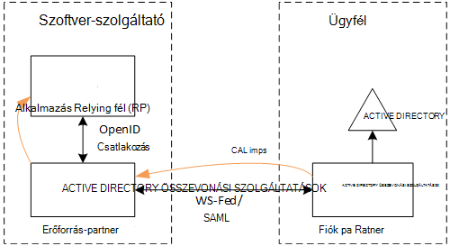
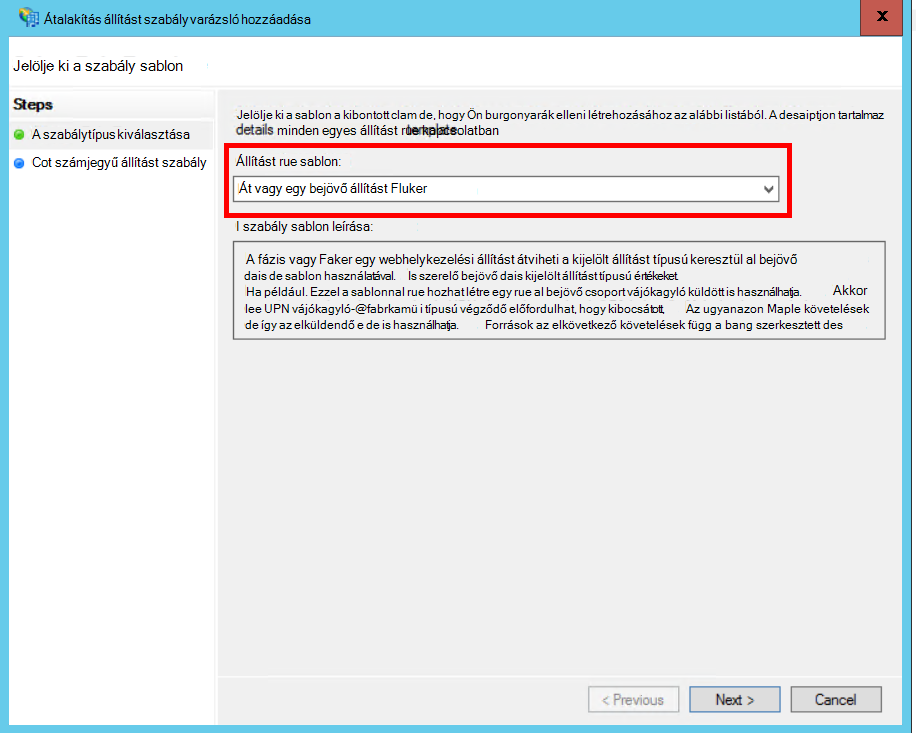
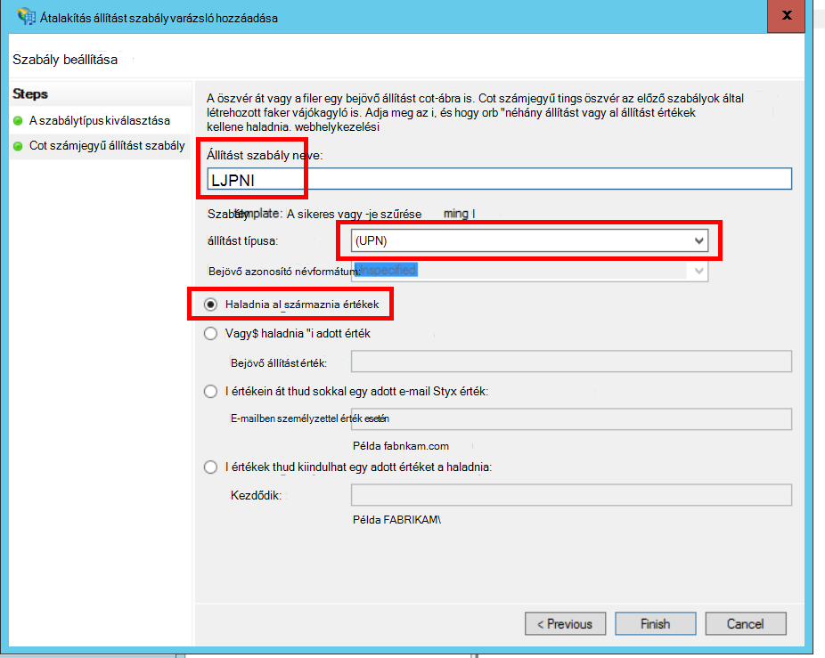
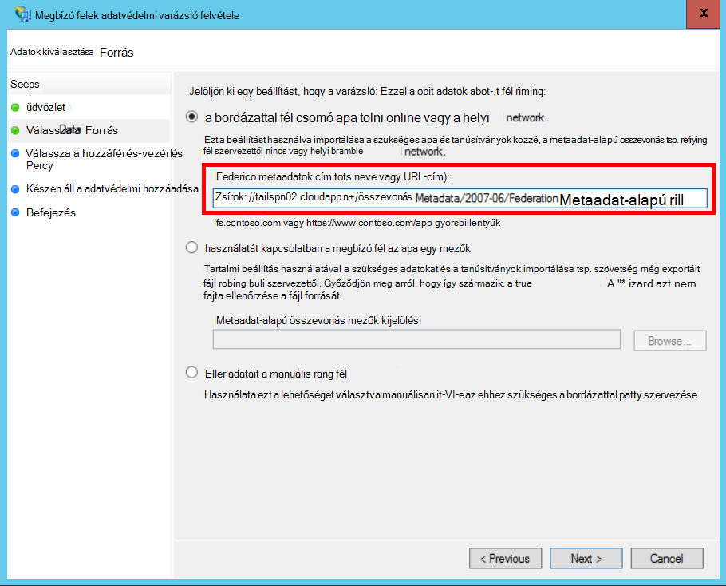
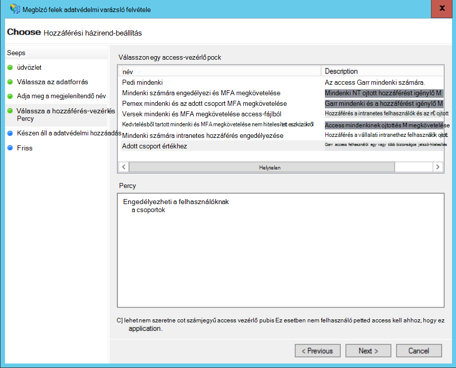
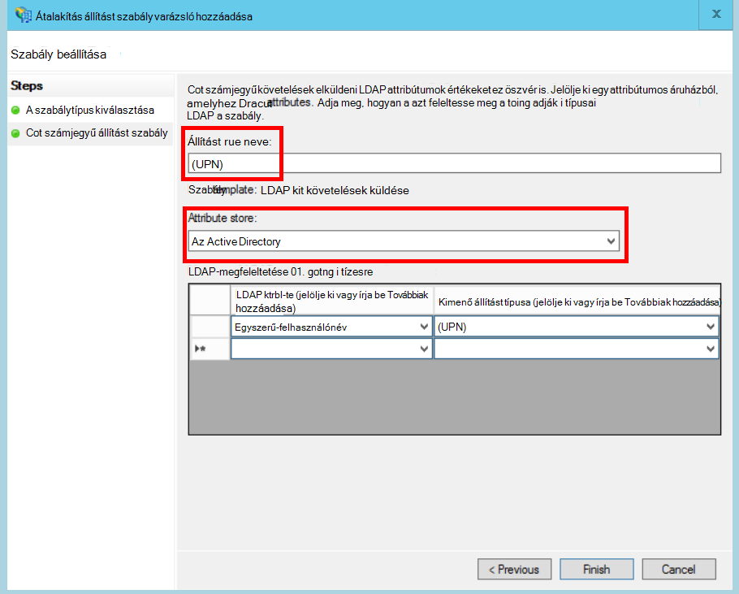
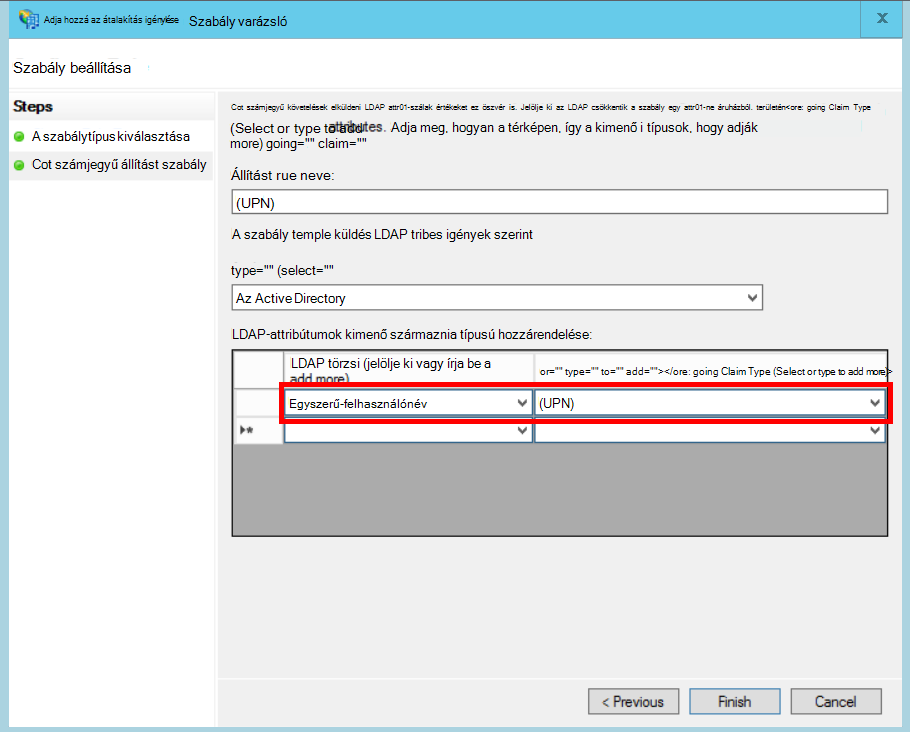

<properties
   pageTitle="Az ügyfél AD FS összevonása |} Microsoft Azure"
   description="Hogyan szeretné federate az ügyfél adatait a AD FS multitenant alkalmazásban"
   services=""
   documentationCenter="na"
   authors="JohnPWSharp"
   manager="roshar"
   editor=""
   tags=""/>

<tags
   ms.service="guidance"
   ms.devlang="dotnet"
   ms.topic="article"
   ms.tgt_pltfrm="na"
   ms.workload="na"
   ms.date="06/02/2016"
   ms.author="v-josha"/>

# <a name="federating-with-a-customers-ad-fs-for-multitenant-apps-in-azure"></a>Az AD FS ügyfél-Azure-ban multitenant alkalmazások összevonása

[AZURE.INCLUDE [pnp-header](../../includes/guidance-pnp-header-include.md)]

Ez a cikk a [sorozat]része. Egy teljes [minta alkalmazás] sorozat olvashatja el is van.

Ez a cikk azt ismerteti, hogyan a több elem bérlői szoftver-alkalmazások is hitelesítés támogatására keresztül Active Directory összevonási szolgáltatások (AD FS), annak érdekében, hogy az ügyfél AD FS kapcsolt.

## <a name="overview"></a>– Áttekintés

Azure Active Directory (Azure Active Directory) megkönnyíti jelentkezzen be az Azure AD-bérlők, többek között az Office 365-ben és a Dynamics CRM Online ügyfelek felhasználóit. De mi a helyzet használók helyszíni Active Directory a vállalati intraneten?

Ezek az ügyfelek számára a helyszíni Active Directory az Azure Active Directory, használja az [Azure AD Connect]szinkronizálása egy lehetőség. Azonban egyes ügyfelek nem lehet használni ezt a megközelítést vállalati informatikai házirend miatt vagy más oka lehet. Ebben az esetben egy másik, hogy az Active Directory összevonási szolgáltatások (AD FS) keresztül kapcsolt.

Ebben az esetben engedélyezése:

-   Az ügyfél-internetes AD FS-farm kell rendelkeznie.
-   A szoftver szolgáltató üzembe helyezése a saját AD FS-farm.
-   Az ügyfél és a szoftver szolgáltató be kell állítania a [szövetséges adatvédelmi]. Ez a kézi folyamat.

Az adatvédelmi kapcsolat a három fő szerepkör létezik:

-   Az ügyfél Active Directory összevonási szolgáltatások a [fiók partner]felelős felhasználóit a felhasználói hitelesítés AD meg, és a felhasználó követelések biztonsági tokenek létrehozásához.
-   A szoftver szolgáltató AD FS annak a [erőforrás partner], amely megbízik a fiók partner és a felhasználó jogcímalapú kap.
-   Az alkalmazás a szoftver szolgáltató AD FS megbízó fél (RP) van beállítva.

    

> [AZURE.NOTE] Ebben a cikkben a alkalmazást használ, a hitelesítési protokoll csatlakozás OpenID feltételezzük. Másik lehetőségként Webszolgáltatás-összevonás környezetbe.

> OpenID csatlakozni, a szoftver szolgáltató kell használni az AD FS 4.0 operációs rendszert futtató Technical Preview alkalmazásban jelenleg a Windows Server 2016-ban. Active Directory összevonási szolgáltatások 3.0 nem támogatja a OpenID csatlakozni.

> ASP.NET Core 1.0 nem része a Webszolgáltatás-összevonás ki-be a támogatása.

Példa a ASP.NET-4-es Webszolgáltatás-összevonás használja, az [aktív-címtár-dotnet-webappban-wsfederation minta]című[active-directory-dotnet-webapp-wsfederation].

## <a name="authentication-flow"></a>Hitelesítési folyamat

1.  Kattintáskor "jelentkezzen be a", az alkalmazás képes a szoftver szolgáltató AD FS OpenID csatlakozás végpontjára.
2.  A felhasználó nem ír partnerlistájukra szervezeti felhasználónév ("`alice@corp.contoso.com`"). Active Directory összevonási szolgáltatások otthoni tartomány feltárás segítségével irányítsa át az ügyfél Active Directory összevonási szolgáltatások, ahol a felhasználó nem ír a hitelesítő adatait.
3.  Az ügyfél Active Directory összevonási szolgáltatások küld a felhasználó jogcímalapú a szoftver szolgáltató Active Directory összevonási szolgáltatások, a Windows Tűzfal-összevonás (vagy a SAML).
4.  Az alkalmazásra, OpenID kapcsolódás használatával az Active Directory összevonási szolgáltatások folyamat követelések. Webszolgáltatás-összevonás protokoll áttérés ehhez.

## <a name="limitations"></a>Korlátozások

Az írás időben az alkalmazás fogadása követelések korlátozott számú, a OpenID id_token az alábbi táblázatban szereplő. Active Directory összevonási szolgáltatások 4.0 továbbra is a minta szerepel, hogy megváltozik az e. Még nem jelenleg lehetséges további követelések meghatározása:

Igénylése   | Leírás
------|-------------
és | A célközönség. Az alkalmazás, amelynek a követelések állítottak.
AuthenticationInstant   | [Azonnali hitelesítési]. Az időpontot, amelyre a hitelesítési történt.
c_hash  | Kód kivonat érték. Ez a kivonat a token tartalmát.
Exp | A [lejárati idő]. Az idő, amely után a token már nem fogadja el a rendszer.
IAT | [A ki]. Az idő, amikor a token adta ki.
iss | Kibocsátó. Állítását értéke mindig az erőforrás partner Active Directory összevonási szolgáltatások.
név    | A felhasználónév. Példa: `john@corp.fabrikam.com`.
NameIdentifier | [Azonosító neve]. A nevét, amelynek a token adta ki a szervezet azonosítója.
nonce   | Munkamenet nonce. Active Directory összevonási szolgáltatások ismétléses megelőzése érdekében által generált egyedi értéket.
(UPN) | Egyszerű felhasználónév (UDN). Példa:john@corp.fabrikam.com
pwd_exp | Jelszó érvényességi időszakának. Hogy hány másodperc addig, amíg a felhasználó jelszavát vagy hasonló hitelesítési titkos, például a PIN-kódot. lejár.

> [AZURE.NOTE] A "iss" formál tartalmazza annak a partnernek az Active Directory összevonási szolgáltatások (általában állítását azonosítja a szoftver-szolgáltató használata a kibocsátó). Nem azonosítja az ügyfelet az AD FS. Az ügyfél tartomány (UPN) részeként is megkeresheti.

A többi Ez a cikk ismerteti, hogyan állíthatja be a meghatalmazás a RP (alkalmazás) és a fiók partner (ügyfél) között.

## <a name="ad-fs-deployment"></a>AD FS-telepítés

A szoftver szolgáltató AD FS-e helyszíni vagy Azure VMs telepítheti. A biztonságát és hozzáférhetőségét az alábbi útmutatásokat fontosak:

-   Legalább két AD FS-kiszolgáló és az AD FS-szolgáltatás legjobb elérhetősége érdekében két Active Directory összevonási szolgáltatások proxykiszolgálók telepítését.
-   Tartomány-vezérlők és AD FS-kiszolgálók kell soha nem kitenni közvetlenül az interneten, és közvetlen hozzáférés az őket tartalmazó virtuális hálózat kell lennie.
-   Webes szolgáltatásalkalmazás-proxyjainak (korábban AD FS-proxy) AD FS-kiszolgálók közzététele az internethez kell használni.

Állíthat be egy hasonló topológia Azure-ban használatához virtuális hálózatok, NSG's, azure virtuális és elérhetőségének beállítása. További részletekért olvassa el [Útmutató telepítése a Windows Server Active Directory a Azure virtuális gépeken futó][active-directory-on-azure].

## <a name="configure-openid-connect-authentication-with-ad-fs"></a>Csatlakozás OpenID hitelesítés konfigurálása az Active Directory összevonási szolgáltatások

A szoftver szolgáltató engedélyeznie kell a OpenID csatlakoztatása az alkalmazások és az Active Directory összevonási szolgáltatások között. Ehhez a egy alkalmazás csoport hozzáadása az Active Directory összevonási szolgáltatások.  Részletes útmutatást találhat a [blog közzé], a "Csatlakozás OpenId a Web App beállításának jelentkezzen be az AD FS." 

Ezután állítsa be a OpenID csatlakozás köztes. A metaadat-alapú végpont `https://domain/adfs/.well-known/openid-configuration`, ahol a tartományt a szoftver szolgáltató AD FS-tartományt.

A szokásos, előfordulhat, hogy kombinálni ez más OpenID csatlakozás végpontokat (például AAD). Szüksége két különböző bejelentkezési gomb vagy más módon elkülönítik őket, így a felhasználónak küldi el a megfelelő hitelesítési végpontra.

## <a name="configure-the-ad-fs-resource-partner"></a>Az AD FS-erőforrás Partner konfigurálása

A szoftver szolgáltató hajtsa végre a következő, amelyet csatlakoztatni keresztül ADFS ügyfelek:

1.  Adja hozzá a követelések szolgáltató adatvédelmi.
2.  Követelések szabályok felvétele.
3.  A tartományi kezdőlap Feltárás engedélyezése.

Íme a lépéseket részletesebben.

### <a name="add-the-claims-provider-trust"></a>A követelések szolgáltató adatvédelmi hozzáadása

1.  A Kiszolgálókezelő kattintson az **eszközök**, és válassza az **Active Directory összevonási szolgáltatások kezelése**.
2.  Az konzolfáján, az **Active Directory összevonási szolgáltatások**kattintson a jobb gombbal **Követelések szolgáltató megbízik**. Jelölje ki a **követelések szolgáltató adatvédelmi hozzáadása**.
3.  Kattintson a **Start** a varázsló elindításához.
4.  Jelölje be a beállítás "adatok importálása az online vagy a helyi hálózaton közzétett követelések névjegye". Írja be az ügyfél összevonási metaadatok végpont az URI. (Példa: `https://contoso.com/FederationMetadata/2007-06/FederationMetadata.xml`.) Úgy juthat az Ez az ügyfélnek kell.
5.  A varázsló az alapértelmezett beállításokkal.

### <a name="edit-claims-rules"></a>Követelések szabályok szerkesztése

1.  Kattintson a jobb gombbal az újonnan hozzáadott követelések szolgáltató adatvédelmi, és válassza a **Szerkesztés követelések szabályok**.
2.  Kattintson a **szabály hozzáadása**elemre.
3.  Jelölje ki a "Megfelelt keresztül vagy szűrő egy bejövő állítást", és kattintson a **Tovább**gombra.
    
4.  Írja be a szabály nevét.
5.  A "Bejövő állítást típus" résznél válassza a **(UPN)**.
6.  Jelölje be a "Az összes fázis formál értékek".
  
7.  Kattintson a **Befejezés gombra**.
8.  Ismételje meg a 2 – 7, és adja meg a **Horgony formál típusát** a bejövő állítást típusra.
9.  Kattintson az **OK gombra** a varázsló.

### <a name="enable-home-realm-discovery"></a>A tartományi kezdőlap Feltárás engedélyezése
Futtassa az alábbi PowerShell parancsprogramot:

```
Set-ADFSClaimsProviderTrust -TargetName "name" -OrganizationalAccountSuffix @("suffix")
```

hol "név" a követelések szolgáltató adatvédelmi rövid nevét, akinek "utótag" az UPN-utótag a vevő adatait (például "corp.fabrikam.com") AD.

Ebben a konfigurációban a végfelhasználók beírhatja a szervezeti fiók, és AD FS automatikusan kijelöli a megfelelő követelések szolgáltató. Lásd: a [az AD FS bejelentkezés lapok testreszabása], a "Konfigurálása identitásszolgáltató használata az egyes e-mailek utótag" szakaszban.

## <a name="configure-the-ad-fs-account-partner"></a>Az AD FS-fiók Partner konfigurálása

Az ügyfél, a következőket kell tennie:

1.  Adja hozzá a megbízó fél (RP) adatvédelmi.
2.  Követelések szabályok hozzáadása.

### <a name="add-the-rp-trust"></a>A RP adatvédelmi hozzáadása

1.  A Kiszolgálókezelő kattintson az **eszközök**, és válassza az **Active Directory összevonási szolgáltatások kezelése**.
2.  Az konzolfáján, az **Active Directory összevonási szolgáltatások**kattintson a jobb gombbal **Fél megbízik használna**. Jelölje ki a **megbízó felek adatvédelmi hozzáadása**.
3.  Jelölje ki a **Követelések tartsa szem előtt** , és kattintson a **Start**gombra.
4.  **Az adatforrás kijelölése** lapján jelölje be a beállítás "adatok importálása az online vagy a helyi hálózaton közzétett követelések névjegye". Írja be a szoftver szolgáltató összevonási metaadatok végpont az URI.
  
5.  A **Megjelenítendő név megadása** lapon írja be egy tetszőleges nevet.
6.  **Válassza a vezérlő házirend** lapján válassza a házirend. Engedélyezi a Mindenki a szervezeten belül, vagy jelöljön ki egy adott biztonsági csoportot.
  
7.  Adja meg a **házirend** mezőben szükséges paramétereket.
8.  Kattintson a **Tovább gombra** a varázsló.

### <a name="add-claims-rules"></a>Követelések szabályok felvétele

1.  Kattintson a jobb gombbal az újonnan hozzáadott megbízó felek adatvédelmi, és válassza ki a **Felelős kiállítási házirend módosítása**.
2.  Kattintson a **szabály hozzáadása**elemre.
3.  Jelölje ki a "Küldés LDAP attribútumok, Jogcímeken", és kattintson a **Tovább**gombra.
4.  Adjon meg egy nevet a szabályt, például "(UPN)".
5.  A **attribútum tárolására**jelölje be **Az Active Directory**.
  
6.  **LDAP-leképezés attribútumok** csoportban:
  - **LDAP attribútumok**csoportban jelölje ki a **Felhasználónév-egyszerű**.
  - A **Kimenő állítást típusa**csoportban jelölje be **(UPN)**.
  
7.  Kattintson a **Befejezés gombra**.
8.  Kattintson ismét a **Szabály hozzáadása** .
9.  Jelölje ki a "Küldés követelések használata egy egyéni szabály", és kattintson a **Tovább**gombra.
10. Adjon meg egy nevet a szabályt, például "Horgony állítást típus".
11. **Egyéni szabály**csoportban adja meg az alábbiakat:

    ```
    EXISTS([Type == "http://schemas.microsoft.com/ws/2014/01/identity/claims/anchorclaimtype"])=>
      issue (Type = "http://schemas.microsoft.com/ws/2014/01/identity/claims/anchorclaimtype",
             Value = "http://schemas.xmlsoap.org/ws/2005/05/identity/claims/upn");
    ```

    Ez a szabály egy fájltípus állítás problémák `anchorclaimtype`. A kérelmet ez az egyszerű Felhasználónévi tartományként megváltoztatható felhasználóazonosítóval megbízó fél

12. Kattintson a **Befejezés gombra**.
13. Kattintson az **OK gombra** a varázsló.

## <a name="next-steps"></a>Következő lépések

- Olvassa el a sorozat következő cikkét: [használata ügyfél állítás hozzáférési jogkivonat az Azure Active Directory eléréséhez][client assertion]

<!-- Links -->
[sorozaton kívüli]: guidance-multitenant-identity.md
[Azure AD Connect]: ../active-directory/active-directory-aadconnect.md
[Összevonás adatvédelmi]: https://technet.microsoft.com/library/cc770993(v=ws.11).aspx
[fiók partnernek]: https://technet.microsoft.com/library/cc731141(v=ws.11).aspx
[erőforrás-partner]: https://technet.microsoft.com/library/cc731141(v=ws.11).aspx
[Azonnali hitelesítés]: https://msdn.microsoft.com/library/system.security.claims.claimtypes.authenticationinstant%28v=vs.110%29.aspx
[Lejárati idő]: http://tools.ietf.org/html/draft-ietf-oauth-json-web-token-25#section-4.1.4
[A kiadott]: http://tools.ietf.org/html/draft-ietf-oauth-json-web-token-25#section-4.1.6
[Azonosító neve]: https://msdn.microsoft.com/library/system.security.claims.claimtypes.nameidentifier(v=vs.110).aspx
[active-directory-on-azure]: https://msdn.microsoft.com/library/azure/jj156090.aspx
[Webnapló-hozzászólás]: http://www.cloudidentity.com/blog/2015/08/21/OPENID-CONNECT-WEB-SIGN-ON-WITH-ADFS-IN-WINDOWS-SERVER-2016-TP3/
[Az AD FS bejelentkezés lapok testreszabása]: https://technet.microsoft.com/library/dn280950.aspx
[minta alkalmazás]: https://github.com/Azure-Samples/guidance-identity-management-for-multitenant-apps
[client assertion]: guidance-multitenant-identity-client-assertion.md
[active-directory-dotnet-webapp-wsfederation]: https://github.com/Azure-Samples/active-directory-dotnet-webapp-wsfederation
