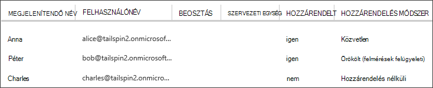

<properties
   pageTitle="Alkalmazás szerepkörök |} Microsoft Azure"
   description="Hogyan végezhetők el engedélyezési szerepkörök alkalmazás használata"
   services=""
   documentationCenter="na"
   authors="MikeWasson"
   manager="roshar"
   editor=""
   tags=""/>

<tags
   ms.service="guidance"
   ms.devlang="dotnet"
   ms.topic="article"
   ms.tgt_pltfrm="na"
   ms.workload="na"
   ms.date="02/16/2016"
   ms.author="mwasson"/>

#  <a name="application-roles-in-multitenant-applications"></a>Alkalmazás szerepkörök multitenant alkalmazásokban

[AZURE.INCLUDE [pnp-header](../../includes/guidance-pnp-header-include.md)]

Ez a cikk a [sorozat]része. Egy teljes [minta alkalmazás] sorozat olvashatja el is van.

Alkalmazás szerepkörök használt engedélyek hozzárendelése a felhasználókhoz. Például a [Dejójáték Kft felmérések] [ Tailspin] alkalmazás a következő szerepkörök határozza meg:

- Rendszergazdaként. Az összes CRUD műveletek végezhetők a minden olyan felmérést, amelyhez az adott bérlői tartozik.
- Készítő. Új felmérések hozhat létre.
- Olvasó. Erről bármilyen felmérések által tartoznak.

Láthatja, hogy szerepkörök végül első fordítani engedélyek [Engedélyezés]során. De az első kérdéshez hozzárendelésével és szerepkörök kezeléséhez. Azt azonosítja három fő lehetőség közül választhat:

-   [Azure Active Directory-alkalmazás szerepkörök](#roles-using-azure-ad-app-roles)
-   [Azure Active Directory biztonsági csoportok](#roles-using-azure-ad-security-groups)
-   [Szerepkör alkalmazáskezelő](#roles-using-an-application-role-manager).

## <a name="roles-using-azure-ad-app-roles"></a>Azure Active Directory alkalmazás szerepkörök használata szerepkörök

Ez az a Dejójáték Kft felmérések alkalmazásban használt megközelítés.

Ez a módszer a szoftver szolgáltató határozza meg a szerepkörökhöz fel azokat az alkalmazás jegyzék. Miután egy ügyfél feliratkozik, az ügyfél által az Active directory-rendszergazda rendeli hozzá a felhasználókat a szerepkörökhöz. A felhasználó bejelentkezik, amikor a felhasználó hozzárendelt szerepkörök követelések szövegként kapja meg.

> [AZURE.NOTE] Ha az ügyfélnek Azure Active Directory Premium tartalmaz, a rendszergazdai szerepkör oszthatnak ki egy olyan biztonsági csoportot, és a csoport tagjainak öröklik az alkalmazás szerepkör. Ennek oka az, szerepkörök kezeléséhez kényelmesen a csoport tulajdonosának nem kell lennie, az Active Directory-rendszergazda

Az eljárás előnye:

-   Egyszerű programozási modell.
-   Az alkalmazás szerepkörök vonatkoznak. A szerepkör jogcímeken egy alkalmazás nem kapnak egy másik alkalmazásban.
-   Ha az ügyfélnek az alkalmazás eltávolítja az AD-bérlő, nem vagyok a gépnél lépjen a szerepköröket.
-   Az alkalmazás bármely plusz az Active Directory engedélyek kívül a felhasználói profil olvasási nem szükséges.

Hátrányai:

- Azure Active Directory prémium nélkül ügyfelek nem rendelhet felhasználókhoz biztonsági csoportok szerepkörök. Ezek a felhasználók az összes felhasználó hozzárendelés Active Directory-rendszergazdának kell elvégezni.
- Kódmentes webes API-val, amely a web app elkülönülnek, ha a web app szerepkör-hozzárendelések a webes API nem vonatkoznak. További vitafórum a pont olvassa el a [biztonságossá tétele egy kódmentes webes API]című témakört.

### <a name="implementation"></a>Végrehajtása

**Adja meg a szerepköröket.** A szoftver szolgáltató deklarálása az alkalmazás szerepkörök [cikkét alkalmazást]. Ha például az alábbiakban a nyilvánvalóan bejegyzés felmérések alkalmazás:

```
"appRoles": [
  {
    "allowedMemberTypes": [
      "User"
    ],
    "description": "Creators can create Surveys",
    "displayName": "SurveyCreator",
    "id": "1b4f816e-5eaf-48b9-8613-7923830595ad",
    "isEnabled": true,
    "value": "SurveyCreator"
  },
  {
    "allowedMemberTypes": [
      "User"
    ],
    "description": "Administrators can manage the Surveys in their tenant",
    "displayName": "SurveyAdmin",
    "id": "c20e145e-5459-4a6c-a074-b942bbd4cfe1",
    "isEnabled": true,
    "value": "SurveyAdmin"
  }
],
```

A `value` tulajdonság a szerepkör kárigény jelenik meg. A `id` tulajdonság értéke a definiált szerep egyedi azonosítója. Új globálisan egyedi azonosítója értéket mindig készítése `id`.

**Adhatnak a felhasználóknak**. Új ügyfél feliratkozik, amikor az alkalmazás regisztrálva van a bérlői AD. Ezen a ponton AD meg, hogy a bérlői rendszergazda is rendelhet hozzá felhasználói szerepkörök.

> [AZURE.NOTE] Korábbi amint az Azure Active Directory prémium verzióval ügyfelek is rendelhet a biztonsági csoportok szerepkörök.

Az Azure portálról az alábbi képernyőképen látható három felhasználók. Anna közvetlenül egy szerepkört van beállítva. Péter "Felmérések felügyeleti", szerepkörbe van hozzárendelve nevű biztonsági csoport tagjának szerepkörbe örökli. Charles nem minden szerepkör van rendelve.



> [AZURE.NOTE] Másik lehetőségként az alkalmazás kioszthatja a szerepköröket programozás útján, az Azure Active Directory Graph API segítségével.  Azonban ehhez az alkalmazás az ügyfél által az Active directory írási engedélye juthat. Ezeket az engedélyeket az alkalmazás érheti el kárt sok &mdash; az ügyfél van megbízhatóvá az alkalmazás nem a könyvtár mess. Előfordulhat, hogy a hozzáférési szintet adja meg az nem hajlandó vevőknek.

**Első szerepkör követelések**. Amikor a felhasználó bejelentkezik, az alkalmazás lévő igényt típusú hozzárendelt szerepkör(ök) a felhasználó megkapja `http://schemas.microsoft.com/ws/2008/06/identity/claims/role`.  

A felhasználók olyan több szerepkörök, vagy nincs szerepkör. A engedélyezési kód nem feltételezzük formál pontosan egy szerepkört a felhasználónak. Ehelyett kódírás, amely ellenőrzi, hogy egy adott állítás érték szerepel-e:

```csharp
if (context.User.HasClaim(ClaimTypes.Role, "Admin")) { ... }
```

## <a name="roles-using-azure-ad-security-groups"></a>Szerepkörök Azure Active Directory biztonsági csoportok használata

Ezt a megközelítést szerepkörök AD a biztonsági csoportok van ábrázolva. Az alkalmazás engedélyeket azok biztonsági csoport tagságát alapján felhasználók rendeli.

Előnyei:

-   Az ügyfelek, akik nem rendelkeznek az Azure Active Directory prémium verzió esetében ezt a megközelítést lehetővé teszi, hogy az ügyfél számára szerepkör-hozzárendelések kezelése a biztonsági csoportok használatával.

Hátránya:

- Összetettsége. Mivel minden bérlői küldi a különböző csoport követelések, az alkalmazás kell nyomon követheti a biztonsági csoportok megfelelő mely alkalmazások szerepkörök minden bérlői webhelyen.
- Ha az ügyfélnek az alkalmazás eltávolítja az AD-bérlő, a biztonsági csoportok azok az Active directory maradnak.

### <a name="implementation"></a>Végrehajtása

Az alkalmazás jegyzék állítsa be a `groupMembershipClaims` "SecurityGroup" tulajdonságot. Úgy juthat az csoport tagsági követelések AAD ez van szükség.

```
{
   // ...
   "groupMembershipClaims": "SecurityGroup",
}
```

Új ügyfél feliratkozik, amikor az alkalmazás utasítja, hogy az ügyfél, a szerepkörök, szükség szerint az alkalmazás a biztonsági csoportokat hozhat létre. Az ügyfél majd be kell írnia a csoport objektumának azonosítók az alkalmazásba. Az alkalmazás tárolja az alkalmazás szerepkörök bérlőnként csoport azonosítók megfelelteti táblákhoz.

> [AZURE.NOTE] Másik lehetőségként az alkalmazás lehetett létrehozni, a csoportok programozás útján, az Azure Active Directory Graph API segítségével.  Ez lehet kisebb, jobban hiba. Az alkalmazás beszerzése "olvasása és írása az összes csoport" igényel, az ügyfél által az Active directory engedélyeit. Előfordulhat, hogy vevőknek hajlandó adja meg a hozzáférési szintet.

Amikor a felhasználó bejelentkezik:

1.  Az alkalmazás kapja meg a felhasználói csoportok igények szerint. Minden kérelem értéke csoport objektum azonosítója.
2.  Az Azure Active Directory-csoportok a token küldött korlátozza. Csoportok száma meghaladja a ezt a korlátot, ha az Azure Active Directory küld egy speciális "többlet" felelős. Az igény esetén az alkalmazás az Azure Active Directory Graph API szeretne felvenni az összes felhasználó számára csoportjának lekérdezést. A részletekért olvassa [engedélyezési az Active Directory-csoportok használatával felhő alkalmazásaiban], a "Csoportokhoz a hozzárendelések formál" című szakaszt.
3.  Az alkalmazás keres az objektum azonosítók adatbázisban saját, keresse meg a megfelelő alkalmazás szerepkörök hozzárendelése a felhasználóhoz.
4.  Az alkalmazás hozzáadása a felhasználó egyszerű, amely kifejezi, az alkalmazás szerepkör igénylése egyéni érték. Példa: `survey_role` = "SurveyAdmin".

Engedélyezési házirendek kell használni az egyéni szerepkör állítást formál nem a csoportnak.

## <a name="roles-using-an-application-role-manager"></a>Az alkalmazás szerepkör-kezelővel szerepkörök

Ezt a megközelítést az alkalmazás szerepkörök nem tárolja az Azure Active Directory egyáltalán. Ehelyett az alkalmazás minden olyan felhasználóhoz szerepkör-hozzárendelések tárolja a saját DB &mdash; például, használja a **RoleManager** osztály ASP.NET identitást.

Előnyei:

-   Az alkalmazás a szerepkörök és a felhasználó hozzárendelések teljes hozzáféréssel rendelkezik.

Hátrányai:

- Összetettebb, nehezebb megőrzéséhez.
- Nem használható AD a biztonsági csoportok kezelése a szerepkör-hozzárendelés.
- Az alkalmazás adatbázisának, ahol azt is használható lesz a nincs szinkronban a bérlő az Active directory, a felhasználók hozzáadása vagy eltávolítása, a felhasználói adatokat tartalmazza.   

Vannak olyan sok meglévő példákat is tartalmaz ezt a megközelítést. Például lásd: az [ASP.NET MVC alkalmazás auth és SQL-adatbázis létrehozása és Azure alkalmazás szolgáltatás telepítése].

## <a name="next-steps"></a>Következő lépések

- Olvassa el a sorozat következő cikkét: [multitenant alkalmazásokban szerepkör - és erőforrás-alapú hitelesítés][engedélyezése]

<!-- Links -->
[Tailspin]: guidance-multitenant-identity-tailspin.md
[sorozaton kívüli]: guidance-multitenant-identity.md
[engedély]: guidance-multitenant-identity-authorize.md
[Kódmentes webes API biztonságossá tétele]: guidance-multitenant-identity-web-api.md
[ASP.NET MVC alkalmazás auth és SQL-adatbázis létrehozása, és telepítse az Azure alkalmazás szolgáltatás]: ../app-service-web/web-sites-dotnet-deploy-aspnet-mvc-app-membership-oauth-sql-database.md
[alkalmazás jegyzék]: ../active-directory/active-directory-application-manifest.md
[minta alkalmazás]: https://github.com/Azure-Samples/guidance-identity-management-for-multitenant-apps
