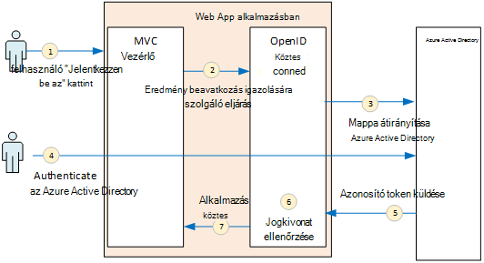
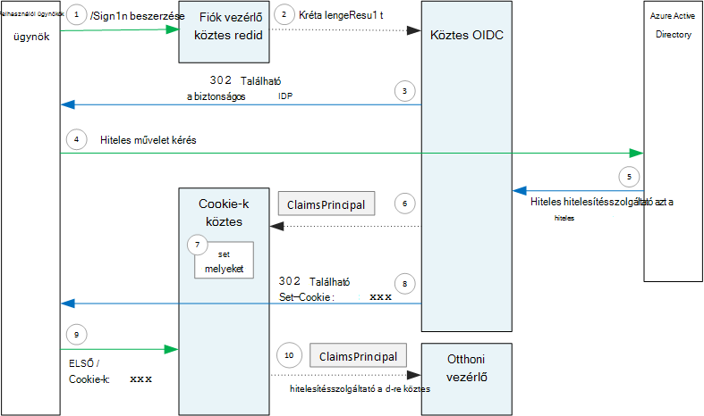

<properties
   pageTitle="Hitelesítés multitenant alkalmazásokban |} Microsoft Azure"
   description="Hogyan egy multitenant alkalmazást az Azure Active Directory felhasználóit hitelesíthet"
   services=""
   documentationCenter="na"
   authors="MikeWasson"
   manager="roshar"
   editor=""
   tags=""/>

<tags
   ms.service="guidance"
   ms.devlang="dotnet"
   ms.topic="article"
   ms.tgt_pltfrm="na"
   ms.workload="na"
   ms.date="05/23/2016"
   ms.author="mwasson"/>

# <a name="authentication-in-multitenant-apps-using-azure-ad-and-openid-connect"></a>Az multitenant-alkalmazások használata az Azure Active Directory Authentication és OpenID csatlakoztatása

[AZURE.INCLUDE [pnp-header](../../includes/guidance-pnp-header-include.md)]

Ez a cikk a [sorozat](guidance-multitenant-identity.md)része. Egy teljes [minta alkalmazás] sorozat olvashatja el is van.

Ez a cikk azt ismerteti, hogyan hitelesíthet egy multitenant alkalmazás az Azure Active Directory (Azure Active Directory), a felhasználók OpenID csatlakoztatása (OIDC) használatával hitelesítést végezni.

## <a name="overview"></a>– Áttekintés

A [hivatkozás végrehajtása](guidance-multitenant-identity-tailspin.md) ASP.NET Core 1.0 alkalmazásként jelenik meg. Az alkalmazás a OIDC hitelesítési folyamat végrehajtásához használja a beépített OpenID csatlakozás köztes. Az alábbi ábra mutatja, hogy mi történik, amikor a felhasználó bejelentkezik, magas szintű.



1.  A felhasználó az alkalmazásban a "jelentkezzen be a" gombra kattint. Ez a művelet egy MVC vezérlő kezeli.
2.  A MVC vezérlő egy **ChallengeResult** műveletet adja eredményül.
3.  A köztes a **ChallengeResult** elfogja, és létrehoz 302 választ, és a felhasználó átirányítja az Azure Active Directory bejelentkezési lapra.
4.  A felhasználó hitelesíti Azure AD.
5.  Azure AD-azonosító token küld az alkalmazást.
6.  A köztes ellenőrzi az azonosító jogkivonathoz. A felhasználó ezen a ponton most hitelesített belül az alkalmazást.
7.  A köztes átirányítja a felhasználó alkalmazást.

## <a name="register-the-app-with-azure-ad"></a>Az alkalmazás regisztrálása az Azure Active Directory

Ahhoz, hogy OpenID csatlakozni, a szoftver szolgáltató regisztrál az alkalmazás saját Azure AD-bérlő belül.

Az alkalmazás rögzítéséhez kövesse a [Alkalmazások integrálása az Azure Active Directory címtárral](../active-directory/active-directory-integrating-applications.md) [felvétele az alkalmazások](../active-directory/active-directory-integrating-applications.md#adding-an-application)szakaszában.

A **beállítás** lapon:

-   Megjegyzés: az ügyfél-azonosítóval.
-   A **alkalmazása több bérlői**válassza az **Igen gombra**.
-   **Válasz URL-címe** egy URL-címe értékűre hol Azure Active Directory authentication visszajelzés küldése. Az alkalmazás alap URL-CÍMÉT is használhatja.
  - Megjegyzés: Az URL-címe lehet valamit, mindaddig, amíg a szolgáltató neve megegyezik a telepített alkalmazás.
  - Beállíthatja, hogy több válasz URL-cím. Fejlesztési közben használható egy `localhost` címét, helyben fut az alkalmazást.
-   Egy ügyfél titkos készítése: A **billentyűk**résznél kattintson a legördülő lista, amely arról tájékoztat, **Jelölje be az időtartamot** , és válassza ki az 1 vagy 2 évek. A kulcs látható lesz, amikor, kattintson a **Mentés**gombra. Feltétlenül másolja a vágólapra az értéket, mivel ez nem látható ismét az beállítása lapon betöltéskor.

## <a name="configure-the-auth-middleware"></a>A auth köztes konfigurálása

Ez a szakasz ismerteti a hitelesítési köztes ASP.NET Core 1.0 való csatlakozás OpenID multitenant hitelesítéshez beállításáról.

Az indítási osztályához adja hozzá a OpenID csatlakozás köztes:

```csharp
app.UseOpenIdConnectAuthentication(options =>
{
    options.AutomaticAuthenticate = true;
    options.AutomaticChallenge = true;
    options.ClientId = [client ID];
    options.Authority = "https://login.microsoftonline.com/common/";
    options.CallbackPath = [callback path];
    options.PostLogoutRedirectUri = [application URI];
    options.SignInScheme = CookieAuthenticationDefaults.AuthenticationScheme;
    options.TokenValidationParameters = new TokenValidationParameters
    {
        ValidateIssuer = false
    };
    options.Events = [event callbacks];
});
```

> [AZURE.NOTE] Lásd: [Startup.cs](https://github.com/Azure-Samples/guidance-identity-management-for-multitenant-apps/blob/master/src/Tailspin.Surveys.Web/Startup.cs).

Az indítási osztály olvashat lásd: [Alkalmazás indításakor](https://docs.asp.net/en/latest/fundamentals/startup.html) ASP.NET Core 1.0 dokumentációjában.

Az alábbi köztes beállítások:

- **ClientId**. Az alkalmazás ügyfél-azonosító szerezte be az alkalmazás az Azure Active Directory regisztrálásakor.
- A **szervezet**. Multitenant alkalmazáshoz, ezeket a beállításokat `https://login.microsoftonline.com/common/`. Ez az URL-CÍMÉT az Azure Active Directory közös végpontot, amely lehetővé teszi a felhasználóknak az bármely Azure AD-bérlőből bejelentkezni. A közös végpont kapcsolatos további tudnivalókért olvassa el a [blogbejegyzésben](http://www.cloudidentity.com/blog/2014/08/26/the-common-endpoint-walks-like-a-tenant-talks-like-a-tenant-but-is-not-a-tenant/)című témakört.
- Állítsa be **ValidateIssuer** **TokenValidationParameters**, hamis. Ez azt jelenti, hogy az alkalmazás felelős érvényesítése az azonosító jogkivonathoz kibocsátó értéke lesz. (A köztes továbbra is ellenőrzi a token magát.) A kibocsátó hitelesítésével kapcsolatos további tudnivalókért olvassa el a [kibocsátó érvényességi](guidance-multitenant-identity-claims.md#issuer-validation)című témakört.
- **CallbackPath**. Ezeket a beállításokat az elérési út egyenlő az Azure Active Directory regisztrálta válasz URL-címét. Ha például a válasz URL-cím `http://contoso.com/aadsignin`, **CallbackPath** kell `aadsignin`. Ha ez a beállítás nem állította, az alapértelmezett értéke `signin-oidc`.
- **PostLogoutRedirectUri**. Adja meg, hogy irányítsa át a felhasználókat a kijelentkezés után egy URL-CÍMÉT. Meg kell lennie, amely lehetővé teszi a névtelen kérések lap &mdash; általában a Kezdőlap lapon.
- **SignInScheme**. Állítsa a `CookieAuthenticationDefaults.AuthenticationScheme`. Ez a beállítás azt jelenti, hogy a felhasználó hitelesítése után a felhasználó jogcímalapú tárolása helyileg a cookie-k. A cookie-k található, hogyan a felhasználó bejelentkezett, az maradjon a böngészési munkamenet közben.
- **Események.** Esemény visszahívást; Lásd: a [hitelesítési események](#authentication-events).

A cookie-hitelesítés köztes is adhat hozzá a folyamat. A köztes a felelős a cookie-k felhasználói jogcímalapú írása és majd olvasása a cookie-k későbbi betöltését során.

```csharp
app.UseCookieAuthentication(options =>
{
    options.AutomaticAuthenticate = true;
    options.AutomaticChallenge = true;
    options.AccessDeniedPath = "/Home/Forbidden";
});
```

## <a name="initiate-the-authentication-flow"></a>A hitelesítési folyamat indítása

ASP.NET MVC a hitelesítési folyamat elindításához a contoller egy **ChallengeResult** eredményül:

```csharp
[AllowAnonymous]
public IActionResult SignIn()
{
    return new ChallengeResult(
        OpenIdConnectDefaults.AuthenticationScheme,
        new AuthenticationProperties
        {
            IsPersistent = true,
            RedirectUri = Url.Action("SignInCallback", "Account")
        });
}
```

Ennek hatására a köztes való visszatéréshez 302 (találat) választ, amely a hitelesítési végpont irányítja át.

## <a name="user-login-sessions"></a>Felhasználói munkamenetek

Említett, amikor a felhasználó első bejelentkezik a, akkor a cookie-hitelesítés köztes a felhasználó jogcímalapú a cookie-k ír. Ezt követően a HTTP-kérések hitelesítése olvasása a cookie-k.

Alapértelmezés szerint a cookie-k köztes ír [munkamenet cookie-k][session-cookie], mely keresése törölt egyszer a felhasználó bezárja a böngészőt. A következő alkalommal, amikor a felhasználó következő felülvizsgálatokra a webhelyet, hogy kell jelentkezzen be újra. Azonban **IsPersistent** állítja be a **ChallengeResult**az IGAZ, ha a köztes ír állandó cookie-k, így a felhasználó bejelentkezett, az maradjon a böngésző bezárása után. Beállíthatja, hogy a cookie-k lejárati; [szabályozása cookie-k]beállítási lehetőségeket[cookie-options]. Állandó cookie-k kényelmesebb, a felhasználó számára, de lehetséges, hogy bizonyos alkalmazásokban (mondjuk ki, a banki alkalmazások) nem megfelelő a felhasználót, hogy jelentkezzen be a mindig a kívánt helyre.

## <a name="about-the-openid-connect-middleware"></a>A csatlakozás OpenID köztes kapcsolatban

ASP.NET OpenID csatlakozás köztes elrejti a protokoll adatai a legtöbb. Ebben a részben néhány végrehajtására, amely a protokoll folyamat megértéséhez hasznos lehet megjegyzéseket tartalmazza.

Első lépésként érdemes megvizsgálni a hitelesítési folyamat értelmez ASP.NET (figyelmen kívül hagyja a részletek, a OIDC protokoll végett az alkalmazás és Azure Active Directory között). Az alábbi ábrán a folyamat.



Ez az ábra vannak két MVC vezérlő. A fiók vezérlő bejelentkezési kéréseket kezeli, és a Kezdőlap lapon a kezdőlap vezérlő kiszolgáló.

Az alábbiakban a hitelesítési folyamat:

1. A felhasználó a "Bejelentkezés" gombra kattint, és a böngésző GET kérésekben küldi. Példa: `GET /Account/SignIn/`.
2. A fiók vezérlő ismét a `ChallengeResult`.
3. A OIDC köztes HTTP 302 választ, átirányítása az Azure Active Directory adja eredményül.
4. A böngészőben a hitelesítési kérelem küld az Azure Active Directory
5. A felhasználó bejelentkezik Azure Active Directory, és Azure Active Directory visszaküldi hitelesítési választ.
6. A OIDC köztes hoz létre a követelések rendszerbiztonsági tag, és átadja a cookie-hitelesítés köztes.
7. A cookie-k köztes a követelések tőketörlesztés serializes és állítja be a cookie-k.
8. A OIDC köztes átirányítja az alkalmazás a visszahívás URL-CÍMÉT.
10. A böngésző követi az átirányítást elküldése a cookie-k a kérést.
11. A cookie-k köztes deserializes egy egyszerű követelések a cookie-k és beállítja a `HttpContext.User` a követelések tőketörlesztés egyenlő. A kérés továbbítás MVC-vezérlő.

### <a name="authentication-ticket"></a>Hitelesítési jegy

Ha sikerült a hitelesítés, a a OIDC köztes-hitelesítési jegy, mely tartalmazza a követelések rendszerbiztonsági tag, amely a felhasználó követelések hoz létre. A jegy belül az **AuthenticationValidated** vagy **TicketReceived** esemény érheti el.

> [AZURE.NOTE] A teljes hitelesítési folyamat befejeztéig `HttpContext.User` egy névtelen egyszerű, _nem_ a hitelesített felhasználó továbbra is rendelkezik. A névtelen tőketörlesztés az üres követelések gyűjteményt tartalmaz. Hitelesítés befejezése és az alkalmazás átirányítja a cookie-k köztes deserializes után a hitelesítési cookie-k és a kifejezéskészletek `HttpContext.User` szeretne a követelések rendszerbiztonsági tag, amely a hitelesített felhasználó.

### <a name="authentication-events"></a>Hitelesítési események

A hitelesítési folyamat során a OpenID csatlakozás köztes hatványra a teljes sorozatának:

- **RedirectToAuthenticationEndpoint**. A neve jobbra, mielőtt a köztes irányítja át a hitelesítési végpont. Az esemény segítségével módosíthatja az átirányítási URL-cím; Ha például kérelem paramétert szeretne adni. Példa [a felügyeleti hozzájárulása kérdés felvétele](guidance-multitenant-identity-signup.md#adding-the-admin-consent-prompt) című témakör tartalmaz.

- **AuthorizationResponseReceived**. A neve a köztes a hitelesítési választ kap a identitásszolgáltató (IDP), de mielőtt a köztes ellenőrzi a kérdésre adott választ.  

- **AuthorizationCodeReceived**. A neve az engedélyezés kóddal.

- **TokenResponseReceived**. Miután a köztes megszerzi hozzáférési jogkivonat a IDP neve. Csak engedélyezési kód folyamat vonatkozik.

- **AuthenticationValidated**. Miután a köztes ellenőrzi az azonosító jogkivonathoz neve. Ezen a ponton az alkalmazás tartozik egy érvényesített követelések felhasználóra vonatkozó. Ebben az esetben is használhatja, további érvényesíteni az követelések, illetve átalakítása követelések. Lásd: [követelések használata](guidance-multitenant-identity-claims.md).

- **UserInformationReceived**. Ha a köztes a felhasználói profil megszerzi a felhasználói adatok végpontjának neve. Csak az engedélyezés kód folyamat, és csak ha `GetClaimsFromUserInfoEndpoint = true` köztes beállításait.

- **TicketReceived**. Amikor befejeződött a hitelesítési neve. Ez a az utolsó esemény, feltéve, hogy a hitelesítés sikerül. Után az esemény kezeli, a felhasználó jelentkezett be az alkalmazásba.

- **AuthenticationFailed**. Ha nem sikerül egy hitelesítési neve. Az esemény használatával kezelheti a hitelesítési hibák &mdash; például úgy, hogy hibalap átirányítása.

Az események a visszahívás szükséges, állítsa a köztes **események** parancsa. Kétféleképpen különböző deklarálása a eseménykezelők: beágyazott lambdas, illetve olyan osztályban **OpenIdConnectEvents**származik.

A képpel egy sorban lambdas:

```csharp
app.UseOpenIdConnectAuthentication(options =>
{
    // Other options not shown.

    options.Events = new OpenIdConnectEvents
    {
        OnTicketReceived = (context) =>
        {
             // Handle event
             return Task.FromResult(0);
        },
        // other events
    }
});
```

**OpenIdConnectEvents**eredő:

```csharp
public class SurveyAuthenticationEvents : OpenIdConnectEvents
{
    public override Task TicketReceived(TicketReceivedContext context)
    {
        // Handle event
        return base.TicketReceived(context);
    }
    // other events
}

// In Startup.cs:
app.UseOpenIdConnectAuthentication(options =>
{
    // Other options not shown.

    options.Events = new SurveyAuthenticationEvents();
});
```

A második megközelítés ajánlott, ha az esemény visszahívást bármely jelentős összefüggés van, így azok nem átnézendők az indítási osztályához. A hivatkozás végrehajtása használja ezt a megközelítést; Lásd: [SurveyAuthenticationEvents.cs](https://github.com/Azure-Samples/guidance-identity-management-for-multitenant-apps/blob/master/src/Tailspin.Surveys.Web/Security/SurveyAuthenticationEvents.cs).

### <a name="openid-connect-endpoints"></a>OpenID csatlakozás végpontok

Azure Active Directory [OpenID csatlakozás feltárás](https://openid.net/specs/openid-connect-discovery-1_0.html), itt megadhatja az identitásszolgáltató (IDP) ad vissza egy JSON metaadat-dokumentum egy [jól ismert végpont](https://openid.net/specs/openid-connect-discovery-1_0.html#ProviderConfig)támogatja. A metaadat-alapú dokumentum információt tartalmaz, például:

-   Az engedély végpontot URL-CÍMÉT. Az amikor az alkalmazás átirányítja csatlakozó felhasználók hitelesítését.
-   Az "a munkamenet befejezése" végpontot, ahol az alkalmazás a felhasználó kijelentkezni ugrik URL-CÍMÉT.
-   Az aláírási kulcsok, és az ügyfél használja, amely azt az IDP megszerzi a OIDC tokenek érvényesítéséhez első az URL-címet.

Alapértelmezés szerint a OIDC köztes tudja, hogyan-ból a metaadatok. A köztes beállítása a **szervezet** lehetőséget, és a köztes szerkezetek a metaadatok URL-CÍMÉT. (Felülbírálhatja a metaadat-alapú URL-CÍMÉT a **MetadataAddress** beállítás megadásával.)

### <a name="openid-connect-flows"></a>OpenID flow csatlakoztatása

Alapértelmezés szerint a OIDC köztes hibrid folyamat használja az űrlap bejegyzés válasz módja.

-   _Hibrid folyamat_ azt jelenti, hogy az ügyfél csatlakozhat egy azonosító jogkivonat, és egy engedélyezési kódot az azonos round-trip a engedélyezési kiszolgáló.
-   _Űrlap közzé válasz mód_ azt jelenti, hogy a engedélyezési kiszolgáló HTTP-közzététel felkérés használja a token és engedélyezési azonosítóját küldje el az alkalmazást. Űrlap-urlencoded értékek (tartalomtípus = "alkalmazás/x-www-form-urlencoded").

Ha a OIDC köztes átirányítja az engedélyezés végpontot, az átirányítási URL-cím összes szükség szerint OIDC lekérdezési karakterlánc paraméterének tartalmazza. Hibrid továbbításhoz:

-   client_id. Ezt az értéket a **ClientId** beállítás értéke
-   hatókör = "openid profil", ami azt jelenti, egy OIDC felkérés, és azt szeretné, hogy a felhasználói profil.
-   response_type = "kód id_token". Ez a folyamat hibrid adja meg.
-   response_mode = "form_post". Ez a bejegyzés-válasz űrlap adja meg.

Adjon meg egy másik folyamat, hogy a **ResponseType** tulajdonsága az beállításai. Példa:

```csharp
app.UseOpenIdConnectAuthentication(options =>
{
    options.ResponseType = "code"; // Authorization code flow

    // Other options
}
```

## <a name="next-steps"></a>Következő lépések

- Olvassa el a sorozat következő cikkét: [jogcímalapú identitások multitenant alkalmazások használata][claims]


[claims]: guidance-multitenant-identity-claims.md
[cookie-options]: https://docs.asp.net/en/latest/security/authentication/cookie.html#controlling-cookie-options
[session-cookie]: https://en.wikipedia.org/wiki/HTTP_cookie#Session_cookie
[minta alkalmazás]: https://github.com/Azure-Samples/guidance-identity-management-for-multitenant-apps
