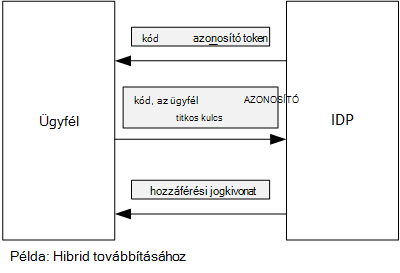

<properties
   pageTitle="Ügyfél állítás használatával hozzáférési jogkivonat lekérése az Azure Active Directory |} Microsoft Azure"
   description="Hogyan lehet hozzáférési jogkivonat lekérése az Azure Active Directory ügyfél állítás használatával."
   services=""
   documentationCenter="na"
   authors="MikeWasson"
   manager="roshar"
   editor=""
   tags=""/>

<tags
   ms.service="guidance"
   ms.devlang="dotnet"
   ms.topic="article"
   ms.tgt_pltfrm="na"
   ms.workload="na"
   ms.date="05/23/2016"
   ms.author="mwasson"/>

# <a name="using-client-assertion-to-get-access-tokens-from-azure-ad"></a>Hozzáférési jogkivonat lekérése az Azure Active Directory ügyfél állítás használatával

[AZURE.INCLUDE [pnp-header](../../includes/guidance-pnp-header-include.md)]

Ez a cikk a [sorozat]része. Egy teljes [minta alkalmazás] sorozat olvashatja el is van.

## <a name="background"></a>Háttér

Amikor engedélyezési kód folyamat vagy hibrid folyamat OpenID csatlakozni, az ügyfél cseréje a egy-egy hozzáférési jogkivonat engedélyezési kódot. Ebben a lépésben során az ügyfél rendelkezik, és hitelesítse magát a kiszolgálóra.



Az ügyfél hitelesítést végezni egy úgy, hogy egy ügyfél titkos használatával. Ennek már jó hogyan [Dejójáték Kft felmérések] [ Surveys] alkalmazás alapértelmezés szerint be van állítva.

Íme egy példa az ügyféltől a IDP egy hozzáférési jogkivonat kérő felkérésre. Megjegyzés: a `client_secret` paraméter.

```
POST https://login.microsoftonline.com/b9bd2162xxx/oauth2/token HTTP/1.1
Content-Type: application/x-www-form-urlencoded

resource=https://tailspin.onmicrosoft.com/surveys.webapi
  &client_id=87df91dc-63de-4765-8701-b59cc8bd9e11
  &client_secret=i3Bf12Dn...
  &grant_type=authorization_code
  &code=PG8wJG6Y...
```

A titkos kulcs csak egy karakterlánc, így ügyeljen arra, hogy nem előfordulhat az értéket kell. Célszerű, az ügyfél titkos adatforrás-vezérlő kívül tartani. Amikor rendszerbe állítják Azure, a titkos tárolását- [app beállítása][configure-web-app].

Azonban az Azure előfizetés hozzáféréssel rendelkező bárki megtekintheti az alkalmazás beállításai. További mindig legyen a még titkos kulcsok ellenőrizze az adatforrás-vezérlő (például a telepítési írásjel), megoszthatja őket e-mailben, és így tovább lehetőséget sem ad.

Biztonság fokozása végett [ügyfelet állítás] helyett egy ügyfél titkos is használhatja. Az ügyfél állítás az ügyfélgép X.509 tanúsítvány, amellyel igazolhatja, az ügyfél érkezett a token kérés. Az ügyfél-tanúsítvány telepítve van az érintett webkiszolgálóra. Általánosságban elmondható, akkor egyszerűbben való hozzáférés korlátozása a tanúsítvány, mint a ahhoz, hogy senki se véletlenül tár egy ügyfél titkos. Tanúsítványok beállítása a webalkalmazást kapcsolatos további tudnivalókért olvassa el a [Tanúsítványok használatával Azure webhelyek alkalmazásokban] című témakört.[using-certs-in-websites]

Íme egy ügyfél állítás használatával jogkivonat kérelmet:

```
POST https://login.microsoftonline.com/b9bd2162xxx/oauth2/token HTTP/1.1
Content-Type: application/x-www-form-urlencoded

resource=https://tailspin.onmicrosoft.com/surveys.webapi
  &client_id=87df91dc-63de-4765-8701-b59cc8bd9e11
  &client_assertion_type=urn:ietf:params:oauth:client-assertion-type:jwt-bearer
  &client_assertion=eyJhbGci...
  &grant_type=authorization_code
  &code= PG8wJG6Y...
```

Figyelje meg, hogy a `client_secret` paraméter már nem használja. Ehelyett a `client_assertion` paraméter egy ügyfél tanúsítvány használatával aláírt JWT token tartalmazza. A `client_assertion_type` paraméterrel állítás típusú &mdash; ebben az esetben JWT jogkivonat a. A kiszolgáló a JWT jogkivonat ellenőrzi. Ha a JWT jogkivonat érvénytelen, a token kérelem hibát jelez.

> [AZURE.NOTE] X.509 tanúsítványok nincsenek ügyfél állítás; csak formájában azt koncentráljon meg itt, mert az Azure Active Directory támogatja.

## <a name="using-client-assertion-in-the-surveys-application"></a>Ügyfél állítás használatával felmérések alkalmazásban

Ez a szakasz megtudhatja, hogy miként konfigurálja az ügyfél állítás használata Dejójáték Kft felmérések alkalmazást. Ezeket a lépéseket a fejlesztés, alkalmas önaláírt tanúsítvány hoz létre, de nem használható.

1. Futtassa a PowerShell parancsprogramot [/Scripts/Setup-KeyVault.ps1] [ Setup-KeyVault] az alábbi képlettel történik:

    ```
    .\Setup-KeyVault.ps -Subject [subject]
    ```

    Az a `Subject` paraméter, írja be a bármely neve, például "surveysapp". A parancsprogram önaláírt tanúsítvány hoz létre, és a "aktuális felhasználó vagy személyes" tárolóban található tárolja.

2. A kimenet a forgatókönyv egy JSON fragment. Adja hozzá az alkalmazás jegyzék a webes alkalmazást, az alábbi képlettel történik:

    1. Jelentkezzen be az [Azure kezelőportálja] [ azure-management-portal] , és keresse meg az Azure Active directory.

    2. Kattintson az **alkalmazások**elemre.

    3. Jelölje ki a felmérés alkalmazást.

    4.  **Cikkét kezelése** gombra, és válassza a **Letöltés cikkét**.

    5.  Nyissa meg a nyilvánvalóan JSON-fájlt egy szövegszerkesztőben. Illessze be a parancsfájl be kimenetét a `keyCredentials` tulajdonság. A következőhöz hasonlóan kell kinéznie:

        ```    
        "keyCredentials": [
            {
              "type": "AsymmetricX509Cert",
              "usage": "Verify",
              "keyId": "29d4f7db-0539-455e-b708-....",
              "customKeyIdentifier": "ZEPpP/+KJe2fVDBNaPNOTDoJMac=",
              "value": "MIIDAjCCAeqgAwIBAgIQFxeRiU59eL.....
            }
          ],
         ```

    6.  Mentse a módosításokat a JSON-fájlt.

    7.  Térjen vissza a portálra. Kattintson a **Cikkét kezelése** > **Cikkét feltöltése** és a JSON-fájl feltöltése.

3. A következő parancsot a ujjlenyomat a tanúsítvány beszerzése.

    ```
    certutil -store -user my [subject]
    ```

    Ha `[subject]` az érték, amely a PowerShell-parancsprogramot téma megadott. Az ujjlenyomatot "Tanúsítvány Hash(sha1)" fog megjelenni. A hexadecimális szám közötti térközök eltávolítása.

4. Frissítse az alkalmazás titkos kulcsok. A megoldás Intézőben kattintson a jobb gombbal a Tailspin.Surveys.Web projekt, és válassza a **Kezelése felhasználói titkos kulcsok**. Vegyen fel egy "Asymmetric" a "AzureAd", az alább látható módon:

    ```
    {
      "AzureAd": {
        "ClientId": "[Surveys application client ID]",
        // "ClientSecret": "[client secret]",  << Delete this entry
        "PostLogoutRedirectUri": "https://localhost:44300/",
        "WebApiResourceId": "[App ID URI of your Survey.WebAPI application]",
        // new:
        "Asymmetric": {
          "CertificateThumbprint": "[certificate thumbprint]",  // Example: "105b2ff3bc842c53582661716db1b7cdc6b43ec9"
          "StoreName": "My",
          "StoreLocation": "CurrentUser",
          "ValidationRequired": "false"
        }
      },
      "Redis": {
        "Configuration": "[Redis connection string]"
      }
    }
    ```

    Meg kell `ValidationRequired` való értéke HAMIS, mert a tanúsítvány nem volt bejelentkezve egy legfelső szintű hitelesítésszolgáltató. A gyártási, használjon egy hitelesítésszolgáltató alá, és állítsa `ValidationRequired` igaz.

    Is törölheti a bejegyzés `ClientSecret`, mert nincs rá szükség ügyfél állítás együtt.

5. Startup.cs, keresse meg a kódot, amely regisztrálja a `ICredentialService`. Vegye ki a megjegyzésjeleket a sor használó `CertificateCredentialService`, és ki a vonal használó Megjegyzés `ClientCredentialService`:

    ```csharp
    // Uncomment this:
    services.AddSingleton<ICredentialService, CertificateCredentialService>();
    // Comment out this:
    //services.AddSingleton<ICredentialService, ClientCredentialService>();
    ```

Futásidőben a webalkalmazás beolvassa a tanúsítvány a tanúsítvány áruházból. A tanúsítvány telepítenie kell a web app ugyanazon a gépen.

## <a name="next-steps"></a>Következő lépések

- Olvassa el a sorozat következő cikkét: [Azure kulcs tárolóra használatával alkalmazás titkos kulcsok védelme][key vault]


<!-- Links -->
[configure-web-app]: ../app-service-web/web-sites-configure.md
[azure-management-portal]: https://manage.windowsazure.com
[ügyfél állítás]: https://tools.ietf.org/html/rfc7521
[key vault]: guidance-multitenant-identity-keyvault.md
[Setup-KeyVault]: https://github.com/Azure-Samples/guidance-identity-management-for-multitenant-apps/blob/master/scripts/Setup-KeyVault.ps1
[Surveys]: guidance-multitenant-identity-tailspin.md
[using-certs-in-websites]: https://azure.microsoft.com/blog/using-certificates-in-azure-websites-applications/
[sorozaton kívüli]: guidance-multitenant-identity.md
[minta alkalmazás]: https://github.com/Azure-Samples/guidance-identity-management-for-multitenant-apps
