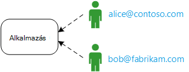
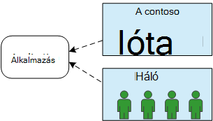
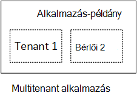
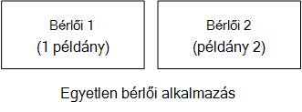
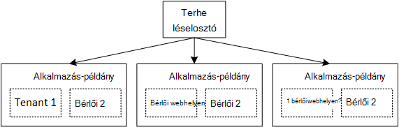

<properties
   pageTitle="Az Identitáskezelés multitenant alkalmazások |} Microsoft Azure"
   description="Az Identitáskezelés multitenant alkalmazásban – bevezetés"
   services=""
   documentationCenter="na"
   authors="MikeWasson"
   manager="roshar"
   editor=""
   tags=""/>

<tags
   ms.service="guidance"
   ms.devlang="dotnet"
   ms.topic="article"
   ms.tgt_pltfrm="na"
   ms.workload="na"
   ms.date="06/02/2016"
   ms.author="mwasson"/>

# A Microsoft Azure multitenant alkalmazások Identitáskezelés – bevezetés

[AZURE.INCLUDE [pnp-header](../../includes/guidance-pnp-header-include.md)]

Ez a cikk a [sorozat]része. Egy teljes [minta alkalmazás] sorozat olvashatja el is van.

Tegyük fel, amit éppen ír egy vállalati szoftver alkalmazás tárolni a felhőben. Az alkalmazás természetesen egyes felhasználók:

De azoknak a felhasználóknak a szervezet számára tartoznak:

Példa: A eladja a szoftver alkalmazáshoz előfizetések Dejójáték Kft. A Contoso és Fabrikam regisztrál az alkalmazást. Ha Anna (`alice@contoso`) jelre, az alkalmazás kell figyelembe venni, hogy Anna Contoso része-e.

- Anna _kell_ rendelkeznie a Contoso adatokhoz való hozzáférés.
- Anna, _nem kell_ rendelkeznie a Fabrikam adatokhoz való hozzáférés.

Ez az útmutató bemutatja, hogyan kezelheti a felhasználói identitások multitenant alkalmazásban, használja az [Azure Active Directory] [ AzureAD] kezelje a bejelentkezési és a hitelesítéshez (Azure AD).

## Mit nevezünk multitenancy?

_Bérlői_ felhasználók egy csoportja. A szoftver alkalmazásban bérlői webhelye fel egy előfizető vagy az alkalmazás az ügyfél. _Multitenancy_ egy architektúrája, ahol a több bérlők megosztása a fizikai példányt az alkalmazás. Habár a bérlők (például VMs vagy tároló) fizikai erőforrások megosztása, minden bérlői kapja meg az alkalmazás saját logikai példányát.

Alkalmazás adatok általában a felhasználók belül bérlői webhelyre, de nem más bérlők közötti megosztott.

Ez egy egyetlen-bérlői architektúra, ahol minden bérlői van-e egy kijelölt fizikai példány architektúra összehasonlítása. Egy egyetlen-bérlői webhely-architektúrában bérlők be az alkalmazás új példányát frissítésjelző hozzáadhat.

### Multitenancy vízszintes és függőleges méretezése

Elérése a felhőben skála, gyakori hozzáadása több fizikai példányok. Ez az úgynevezett _Vízszintes méretezés_ vagy a _Méretezés meg_. Fontolja meg a megfelelő web App alkalmazásban. További forgalom kezelésére, további kiszolgáló VMs hozzáadása, és helyezze át őket egy terheléselosztó mögött. Minden egyes virtuális futtatja a web app külön fizikai példányát.

Kérésének példányokban lehet továbbítani. Közös a rendszer úgy működik, mint egy logikai példányát. A virtuális lebontására, vagy be egy új virtuális felhasználók megtartásával léptetőnyíl vezérlőelem. Ez a felépítés minden fizikai példány több bérlői, és további előfordulásait hozzáadásával, méretezheti. Ha egy példány megszakad, nem érintheti bármely bérlői.

## Identitás egy multitenant alkalmazásban

Multitenant alkalmazásban figyelembe kell vennie a felhasználók a bérlők környezetében.

**Hitelesítés**

- Felhasználók jelentkezzen be az alkalmazásba, a szervezeti hitelesítő adatokkal. Ne hozzon létre új felhasználói profilok alkalmazás rendelkeznek.
- A szervezeten belül a felhasználó ugyanahhoz a bérlőhöz részét képezik.
- Amikor a felhasználó bejelentkezik, az alkalmazás tudja, melyik bérlői a felhasználó tagja.

**Engedély**

- Amikor a felhasználó műveleteket (például, egy erőforrás megtekintése) engedélyezése, az alkalmazás figyelembe kell vennie a felhasználó bérlői.
- Felhasználók az alkalmazást, például a "Rendszergazdai" vagy "normál" szerepkörében lehet kiosztani. Szerepkör-hozzárendelések az ügyfél, a szoftver szolgáltató által nem kell kezelniük.

**Példa.** Anna, a Contoso, egy alkalmazott navigál az alkalmazást a böngészőben, és a "Bejelentkezés" gombra kattint. Noémi a rendszerünk átirányítja a bejelentkezési képernyője, ahol ő belép a vállalati hitelesítő adatok (felhasználónév és jelszó). Ezen a ponton kikkel be van jelentkezve, alkalmazásba `alice@contoso.com`. Az alkalmazás is tudja, hogy Anna-e egy rendszergazdai felhasználói ehhez az alkalmazáshoz. Mivel Noémi a rendszergazda, ő láthatja a Contoso tartozó erőforrások listája. Jó helyen jár ugyanakkor nem láthatók a Fabrikam erőforrások, mivel Noémi rendszergazda csak a saját bérlői belül.

Ez az útmutató áttekintjük kifejezetten Azure Active Directory használatának Identitáskezelés.

- Feltételezzük, hogy az ügyfél tárolja a felhasználói profilok Azure AD (beleértve az Office 365-ben és a Dynamics CRM bérlők)
- A felhasználók a helyszíni Active Directory (AD) használhatják az [Azure AD Connect] [ ADConnect] szinkronizálni a helyszíni Active Directory az Azure Active Directory.

A helyszíni Active Directory ügyfél Azure AD Connect (vállalati informatikai házirend vagy más oka lehet) miatt nem használható, ha a szolgáltató az ügyféllel is kapcsolt szoftver adatait a AD az Active Directory összevonási szolgáltatások (AD FS) keresztül. Ez a beállítás [az ügyfél AD FS Federating]ismerteti.

Ez az útmutató nem veszi figyelembe a más szempontból multitenancy, például az adatok szétválasztás, konfigurációs bérlői – és így tovább.

## Következő lépések

- Olvassa el a sorozat következő cikkét: [a Dejójáték Kft felmérések kapcsolatos alkalmazás][tailpin]

<!-- Links -->
[ADConnect]: ../active-directory/active-directory-aadconnect.md
[AzureAD]: https://azure.microsoft.com/documentation/services/active-directory/
[sorozaton kívüli]: guidance-multitenant-identity.md
[Az ügyfél AD FS összevonása]: guidance-multitenant-identity-adfs.md
[minta alkalmazás]: https://github.com/Azure-Samples/guidance-identity-management-for-multitenant-apps
[tailpin]: guidance-multitenant-identity-tailspin.md
