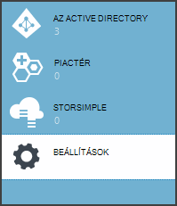
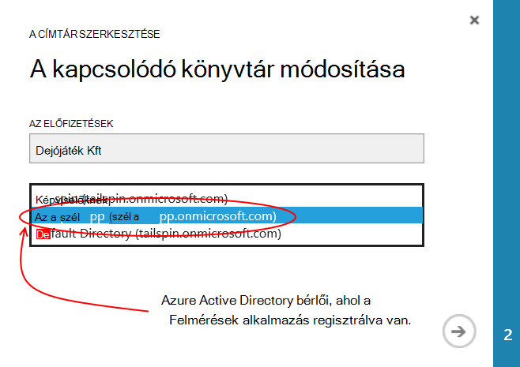
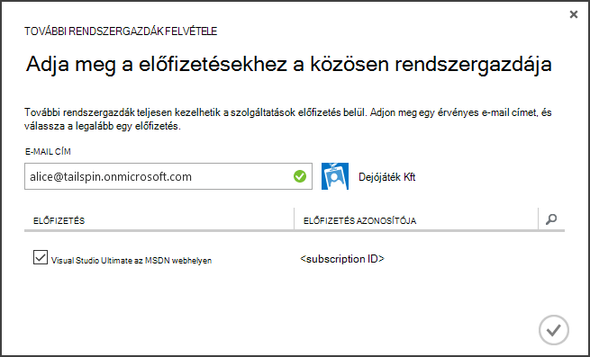
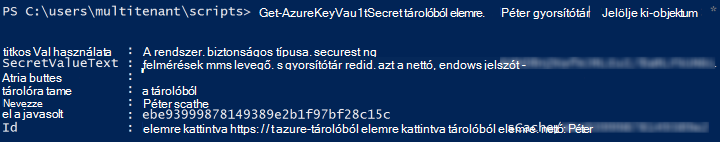

<properties
   pageTitle="Kulcs tárolóra használatával alkalmazás titkos kulcsok védelme |} Microsoft Azure"
   description="Hogyan egy használatának tárolására alkalmazás titkos kulcsok a kulcs tárolóból elemre szolgáltatás"
   services=""
   documentationCenter="na"
   authors="MikeWasson"
   manager="roshar"
   editor=""
   tags=""/>

<tags
   ms.service="guidance"
   ms.devlang="dotnet"
   ms.topic="article"
   ms.tgt_pltfrm="na"
   ms.workload="na"
   ms.date="02/16/2016"
   ms.author="mwasson"/>

# <a name="using-azure-key-vault-to-protect-application-secrets"></a>Azure kulcs tárolóra használatával alkalmazás titkos kulcsok védelme

[AZURE.INCLUDE [pnp-header](../../includes/guidance-pnp-header-include.md)]

Ez a cikk a [sorozat]része. Egy teljes [minta alkalmazás] sorozat olvashatja el is van.

## <a name="overview"></a>– Áttekintés

Érdemes átgondolnia, hogy az alkalmazás beállításait, amelyek a bizalmas, így kell védeni, például: gyakori:

- Adatbázis-kapcsolatot karakterláncok
- Jelszavak
- Cryptographic billentyűkkel

Biztonsági legjobb módszer a verziókövetés soha nem kell tárolni titkos adatok. Előfordulhat, hogy túl egyszerűen &mdash; még akkor is, ha a forrás kód tárházba privát. És ez van nem szinte tartásával titkos kulcsok az általános nyilvános. Nagyobb projektek érdemes lehet szeretné korlátozni, melyet a fejlesztők és operátorok férhet hozzá a termelési titkos kulcsok. (Beállítások tesztelése vagy fejlesztési környezetben eltérőek.)

Egy biztosítani, hogy titkos adatok tárolása az [Azure kulcs tárolóra][KeyVault]. Kulcs tárolóból elemre egy olyan felhőben tárolt szolgáltatás, cryptographic billentyűkkel és más titkos kulcsok kezelését. Ez a cikk bemutatja, hogyan kulcs tárolóra használva, alkalmazás beállításait.

[Dejójáték Kft felmérések] [ Surveys] alkalmazást, az alábbi beállítások esetén titkos:

- Az adatbázis-kapcsolati karakterláncot.
- A vgx.dll kapcsolati karakterláncot.
- Titkos kulcs a webalkalmazás az ügyfélnek.

Konfigurációs titkos kulcsok tárolni kulcs tárolóból elemre, felmérések alkalmazása egy egyéni konfigurációs-szolgáltatót, amely a ASP.NET Core 1.0 [Rendszerkonfiguráció]csatlakozik hajtja végre[configuration]. Az egyéni szolgáltató indításkor konfigurációs beállítások beolvassa a kulcs tárolóból elemre.

A felmérés alkalmazás a következő helyről betölti a konfigurációs beállítások:

- A appsettings.json fájl
- A [felhasználó titkos kulcsok tárolása] [ user-secrets] (fejlesztői környezet csak; tesztelésre)
- Az üzemeltetési környezet (alkalmazás beállításainak az Azure-webalkalmazásokban)
- Fő tárolóból elemre

Minden egyes e felülbírálja az előzőt, így kulcs tárolóra tárolt beállításaitól elsőbbséget élveznek.

> [AZURE.NOTE] A kulcs tárolóra konfigurációs szolgáltató alapértelmezés szerint le van tiltva. Nincs szükség van az alkalmazást futtató helyi meghajtóra. Volna engedélyezné gyártási környezetben.

> A kulcs tárolóra szolgáltató jelenleg nem támogatja a .NET Core, mert azt tömbképletként a [Microsoft.Azure.KeyVault] [ Microsoft.Azure.KeyVault] csomagot.

Indításkor az alkalmazás minden regisztrált konfigurációs szolgáltatója beállítások beolvassa, és egy kifejezetten beírt beállítások objektum kitöltéséhez használja ezeket. (További tudnivalókért lásd: a [lehetőségek használata és konfigurációs objektumok][options].)

## <a name="implementation"></a>Végrehajtása

A [KeyVaultConfigurationProvider] [ KeyVaultConfigurationProvider] osztály, melyet a ASP.NET Core 1.0 [Rendszerkonfiguráció]konfigurációs szolgáltató[configuration].

Használni a `KeyVaultConfigurationProvider`, hívja fel a `AddKeyVaultSecrets` kiterjesztése mód az indítási osztály:

```csharp
    var builder = new ConfigurationBuilder()
        .SetBasePath(appEnv.ApplicationBasePath)
        .AddJsonFile("appsettings.json");

    if (env.IsDevelopment())
    {
        builder.AddUserSecrets();
    }
    builder.AddEnvironmentVariables();
    var config = builder.Build();

    // Add key vault configuration:
    builder.AddKeyVaultSecrets(config["AzureAd:ClientId"],
        config["KeyVault:Name"],
        config["AzureAd:Asymmetric:CertificateThumbprint"],
        Convert.ToBoolean(config["AzureAd:Asymmetric:ValidationRequired"]),
        loggerFactory);
```

Figyelje meg, hogy `KeyVaultConfigurationProvider` egyes beállításokat, amelyek kell tárolni a más forrásokból konfiguráció szükséges.

Az alkalmazás indításakor `KeyVaultConfigurationProvider` számba a titkos kulcsok, az a fő tárolóból elemre. Az egyes titkos Ez úgy néz ki egy "ConfigKey" nevű címke. A címke értéke a konfigurációs beállítások neve.

> [AZURE.NOTE] [Címkék] [ key-tags] választható metaadatok használatával tárolt. Címkék itt szolgálnak, mert kulcs neve nem tartalmazhat kettőspontot (:).

```csharp
var kvClient = new KeyVaultClient(GetTokenAsync);
var secretsResponseList = await kvClient.GetSecretsAsync(_vault, MaxSecrets, token);
foreach (var secretItem in secretsResponseList.Value)
{
    //The actual config key is stored in a tag with the Key "ConfigKey"
    // because ':' is not supported in a shared secret name by Key Vault.
    if (secretItem.Tags != null && secretItem.Tags.ContainsKey(ConfigKey))
    {
        var secret = await kvClient.GetSecretAsync(secretItem.Id, token);
        Data.Add(secret.Tags[ConfigKey], secret.Value);
    }
}
```

> [AZURE.NOTE] Lásd: [KeyVaultConfigurationProvider.cs].

## <a name="setting-up-key-vault-in-the-surveys-app"></a>A felmérés alkalmazásban kulcs tárolóból elemre beállítása

Előfeltételek:

- Telepítse az [Azure erőforrás-kezelő parancsmagok][azure-rm-cmdlets].
- Konfigurálja a felmérések alkalmazást, [az felmérések alkalmazást futtató]ismertetett módon[readme].

Magas szintű lépéseket:

1. Állítsa be egy rendszergazdai felhasználói bérlőhöz.
2. Ügyfél-tanúsítvány beállítása.
3. Hozzon létre egy fő tárolóból elemre.
4. Konfigurációs beállítások hozzáadása a fő tárolóból elemre.
5. Vegye ki a megjegyzésjeleket a kódot, amely lehetővé teszi, hogy a kulcsfontosságú tárolóból elemre.
6. Frissítse az alkalmazás felhasználói titkos kulcsok.

### <a name="set-up-an-admin-user"></a>Egy rendszergazda felhasználó beállítása

> [AZURE.NOTE] Hozzon létre egy fő tárolóból elemre, egy fiókot, amely kezelheti az Azure előfizetés kell használnia. Bármely alkalmazásban, amely is engedélyezni szeretné a fő tárolóra olvasásakor is, ugyanahhoz a bérlőhöz, mint ez a fiók rendelkeznie kell regisztrált.

Ebben a lépésben fog biztos, hogy egy fő tárolóból elemre, miközben a bérlőjének felhasználóként bejelentkezve hozhat létre hol van regisztrálva a a felmérések alkalmazást.

Első lépésként módosítása a címtárban az Azure-előfizetéséhez társított.

1. Jelentkezzen be az [Azure kezelőportálja segítségével][azure-management-portal]

2. Kattintson a **Beállítások**gombra.

    

3. Jelölje ki az Azure előfizetés.

4. Kattintson a **Szerkesztés címtár** a portálon alján.

    

5. A "a társított könyvtár" módosításához jelölje ki a Azure AD-bérlő felmérések alkalmazása hol van regisztrálva,

    

6. Kattintson a nyílra, és fejezze be a párbeszédpanelt.

Hozzon létre egy rendszergazda felhasználót a hol van regisztrálva a felmérések alkalmazása Azure AD-bérlő belül.

1. Jelentkezzen be az [Azure kezelőportálja][azure-management-portal].

2. Jelölje ki a Azure AD-bérlő hol van regisztrálva a levelezőprogramból.

3. Kattintson a **felhasználók** > **felhasználó hozzáadása**.

4. A **Felhasználó hozzáadása** párbeszédpanelen rendelje hozzá a felhasználót a globális rendszergazdai szerep.

Vegye fel a rendszergazda a közös közé Azure-előfizetéséhez.

1. Jelentkezzen be az [Azure kezelőportálja][azure-management-portal].

2. Kattintson a **Beállítások** gombra, és válassza az Azure előfizetés.

3. Kattintson a **rendszergazdák**

4. Kattintson a **Hozzáadás** a portálon alján.

5. Adja meg az imént létrehozott felügyeleti felhasználó az e-mailt.

6. Az előfizetéshez tartozó jelölőnégyzetet.

7. A pipajeles gombra kattintva fejezze be a párbeszédpanelt.




### <a name="set-up-a-client-certificate"></a>Ügyfél-tanúsítvány beállítása

1. Futtassa a PowerShell parancsprogramot [/Scripts/Setup-KeyVault.ps1] [ Setup-KeyVault] az alábbi képlettel történik:
    ```
    .\Setup-KeyVault.ps1 -Subject <<subject>>
    ```
    Az a `Subject` paraméter, írja be a bármely neve, például "surveysapp". A parancsprogram önaláírt tanúsítvány hoz létre, és a "aktuális felhasználó/személyes" tárolóban található tárolja.

2. A kimenet a forgatókönyv egy JSON fragment. Adja hozzá az alkalmazás jegyzék a webes alkalmazást, az alábbi képlettel történik:

    1. Jelentkezzen be az [Azure kezelőportálja] [ azure-management-portal] , és keresse meg az Azure Active directory.

    2. Kattintson az **alkalmazások**elemre.

    3. Jelölje ki a felmérés alkalmazást.

    4.  **Cikkét kezelése** gombra, és válassza a **Letöltés cikkét**.

    5.  Nyissa meg a nyilvánvalóan JSON-fájlt egy szövegszerkesztőben. Illessze be a parancsfájl be kimenetét a `keyCredentials` tulajdonság. A következőhöz hasonlóan kell kinéznie:
    ```
            "keyCredentials": [
                {
                  "type": "AsymmetricX509Cert",
                  "usage": "Verify",
                  "keyId": "29d4f7db-0539-455e-b708-....",
                  "customKeyIdentifier": "ZEPpP/+KJe2fVDBNaPNOTDoJMac=",
                  "value": "MIIDAjCCAeqgAwIBAgIQFxeRiU59eL.....
                }
              ],
    ```          
    6.  Mentse a módosításokat a JSON-fájlt.

    7.  Térjen vissza a portálra. Kattintson a **Cikkét kezelése** > **Cikkét feltöltése** és a JSON-fájl feltöltése.

3. Adja hozzá a azonos JSON részlet az alkalmazás jegyzék a webes API-val (Surveys.WebAPI).

4. A következő parancsot a ujjlenyomat a tanúsítvány beszerzése.
    ```
    certutil -store -user my [subject]
    ```
    Ha `[subject]` az érték, amely a PowerShell-parancsprogramot téma megadott. Az ujjlenyomatot "Tanúsítvány Hash(sha1)" fog megjelenni. A hexadecimális szám közötti térközök eltávolítása.

Az ujjlenyomatot később fogja használni.

### <a name="create-a-key-vault"></a>Hozzon létre egy fő tárolóból elemre

1. Futtassa a PowerShell parancsprogramot [/Scripts/Setup-KeyVault.ps1] [ Setup-KeyVault] az alábbi képlettel történik:

    ```
    .\Setup-KeyVault.ps1 -KeyVaultName <<key vault name>> -ResourceGroupName <<resource group name>> -Location <<location>>
    ```

    Amikor a hitelesítő adatokat kér, jelentkezzen be az Azure Active Directory-felhasználóként korábban létrehozott. A parancsfájl hoz létre új erőforráscsoport, és egy új kulcs tárolóból elemre, hogy az erőforrás csoporton belül.

    Megjegyzés: a paraméterhez - helyet az alábbi PowerShell-parancs használatával érvényes régiók listájának:

    ```
    Get-AzureRmResourceProvider -ProviderNamespace "microsoft.keyvault" | Where-Object { $_.ResourceTypes.ResourceTypeName -eq "vaults" } | Select-Object -ExpandProperty Locations
    ```

2. SetupKeyVault.ps futtassa ismét az alábbi paramétereknek:

    ```
    .\Setup-KeyVault.ps1 -KeyVaultName <<key vault name>> -ApplicationIds @("<<web app client ID>>", "<<web API client ID>>")
    ```

    Ha

    - fő tárolóra nevét, hogy a kulcsfontosságú tárolóból elemre az előző lépésben megadott névnek =.
    - a Web app ügyfél-azonosító = az ügyfél-azonosító a felmérések webalkalmazáshoz.
    - a webes api-ügyfél-azonosító = az ügyfél-azonosító Surveys.WebAPI alkalmazásához.

    Példa:
    ```
    .\Setup-KeyVault.ps1 -KeyVaultName tailspinkv -ApplicationIds @("f84df9d1-91cc-4603-b662-302db51f1031", "8871a4c2-2a23-4650-8b46-0625ff3928a6")
    ```

    > [AZURE.NOTE] Kaphat az ügyfél azonosítók az [Azure kezelőportálja][azure-management-portal]. Jelölje ki a Azure AD-bérlő, jelölje ki azt az alkalmazást, és kattintson a **Konfigurálás**gombra.

    Ez a parancsfájl engedélyezi a web app és a webes API titkos kulcsok beolvasni a fő tárolóból elemre. Lásd: az [első lépések az Azure kulcs tárolóra] [ authorize-app] további információt.

### <a name="add-configuration-settings-to-your-key-vault"></a>Konfigurációs beállítások hozzáadása a fő tárolóból elemre

1. Futtassa a SetupKeyVault.ps az alábbi képlettel történik:

    ```
    .\Setup-KeyVault.ps1 -KeyVaultName <<key vault name> -KeyName RedisCache -KeyValue "<<Redis DNS name>>.redis.cache.windows.net,password=<<Redis access key>>,ssl=true" -ConfigName "Redis:Configuration"
    ```
    Ha

    - fő tárolóra nevét, hogy a kulcsfontosságú tárolóból elemre az előző lépésben megadott névnek =.
    - DNS-név vgx.dll a vgx.dll gyorsítótár-példány nevét a DNS =.
    - Hívóbetű vgx.dll = a hívóbetű a gyorsítótár vgx.dll előfordulásra vonatkozóan.

    Ez a parancs a titkos hozzáadása a fő tárolóból elemre. A titkos kulcs név/érték pár plusz címke:

    -   A kulcs nevét az alkalmazás nem használja, de a kulcs tárolóra belül egyedinek kell lennie.
    -   Az érték a beállítás, ebben az esetben a vgx.dll kapcsolati karakterláncot.
    -   a "ConfigKey" címke a konfigurációs kulcs nevét tartalmazza.

2. Ezen a ponton akkor jó ötlet és ellenőrizze, hogy sikeresen tárolja a módszerei kulcs tárolóból elemre. Futtassa az alábbi PowerShell-parancsot:

    ```
    Get-AzureKeyVaultSecret <<key vault name>> RedisCache | Select-Object *
    ```
    A kimenet meg kell jelennie a titkos értéket plusz néhányuk:

    

3. Futtassa ismét az adatbázis-kapcsolati karakterlánc hozzáadni SetupKeyVault.ps:

    ```
    .\Setup-KeyVault.ps1 -KeyVaultName <<key vault name> -KeyName ConnectionString -KeyValue <<DB connection string>> -ConfigName "Data:SurveysConnectionString"
    ```

    Ha `<<DB connection string>>` az adatbázis-kapcsolati karakterláncot az érték.

    Helyi adatbázis-kezelő teszteléshez másolja a kapcsolati karakterlánc a Tailspin.Surveys.Web/appsettings.json fájlt. Ha az ehhez szükséges lépéseket, ellenőrizze, hogy a dupla fordított perjel módosítása ("\\\\") az egyetlen fordított perjelet szeretne. A dupla fióknévben escape-karakterre, a JSON-fájlban.

    Példa:

    ```
    .\Setup-KeyVault.ps1 -KeyVaultName mykeyvault -KeyName ConnectionString -KeyValue "Server=(localdb)\MSSQLLocalDB;Database=Tailspin.SurveysDB;Trusted_Connection=True;MultipleActiveResultSets=true" -ConfigName "Data:SurveysConnectionString"
    ```

### <a name="uncomment-the-code-that-enables-key-vault"></a>Vegye ki a megjegyzésjeleket a kódot, amely lehetővé teszi, hogy a kulcs tárolóból elemre.

1. Nyissa meg a Tailspin.Surveys megoldás.

2. A [Tailspin.Surveys.Web/Startup.cs][web-startup], keresse meg a következő kódot blokk, és vegye ki a megjegyzésjeleket azt.

    ```csharp
    //#if DNX451
    //            _configuration = builder.Build();
    //            builder.AddKeyVaultSecrets(_configuration["AzureAd:ClientId"],
    //                _configuration["KeyVault:Name"],
    //                _configuration["AzureAd:Asymmetric:CertificateThumbprint"],
    //                Convert.ToBoolean(_configuration["AzureAd:Asymmetric:ValidationRequired"]),
    //                loggerFactory);
    //#endif
    ```

3. A [Tailspin.Surveys.WebAPI/Startup.cs][web-api-startup], keresse meg a következő kódot blokk, és vegye ki a megjegyzésjeleket azt.

    ```csharp
    //#if DNX451
    //            var config = builder.Build();
    //            builder.AddKeyVaultSecrets(config["AzureAd:ClientId"],
    //                config["KeyVault:Name"],
    //                config["AzureAd:Asymmetric:CertificateThumbprint"],
    //                Convert.ToBoolean(config["AzureAd:Asymmetric:ValidationRequired"]),
    //                loggerFactory);
    //#endif
    ```

4. A [Tailspin.Surveys.Web/Startup.cs][web-startup], keresse meg a kódot, amely regisztrálja a `ICredentialService`. Vegye ki a megjegyzésjeleket a sor használó `CertificateCredentialService`, és ki a vonal használó Megjegyzés `ClientCredentialService`:

    ```csharp
    // Uncomment this:
    services.AddSingleton<ICredentialService, CertificateCredentialService>();
    // Comment out this:
    //services.AddSingleton<ICredentialService, ClientCredentialService>();
    ```

    Ez a változás lehetővé teszi, hogy a web app használata [ügyfél állítás] [ client-assertion] OAuth hozzáférési jogkivonat eléréséhez. Az ügyfél állítás akkor nem szükséges egy OAuth ügyfél titkos. Azt is megteheti sikerült tárolja az ügyfél titkos kulcs tárolóból elemre. Azonban kulcs tárolóból elemre, és ügyfél állítás egy ügyfelet használ, mind a tanúsítvány, ha engedélyezi a fő tárolóból elemre, tanácsos egy ügyfél állítás mellé engedélyezéséhez.

### <a name="update-the-user-secrets"></a>A felhasználó titkos kulcsok frissítése

A megoldás Intézőben kattintson a jobb gombbal a Tailspin.Surveys.Web projekt, és válassza a **Kezelése felhasználói titkos kulcsok**. A secrets.json fájl törlése a meglévő JSON, és illessze be a következőt:

    ```
    {
      "AzureAd": {
        "ClientId": "[Surveys web app client ID]",
        "PostLogoutRedirectUri": "https://localhost:44300/",
        "WebApiResourceId": "[App ID URI of your Surveys.WebAPI application]",
        "Asymmetric": {
          "CertificateThumbprint": "[certificate thumbprint. Example: 105b2ff3bc842c53582661716db1b7cdc6b43ec9]",
          "StoreName": "My",
          "StoreLocation": "CurrentUser",
          "ValidationRequired": "false"
        }
      },
      "KeyVault": {
        "Name": "[key vault name]"
      }
    }
    ```

[Szögletes zárójelek] elemeit helyére a megfelelő értékekkel.

- `AzureAd:ClientId`: Az ügyfél-azonosító felmérések alkalmazásra.
- `AzureAd:WebApiResourceId`: Az alkalmazás azonosítója URI létrehozásakor a Surveys.WebAPI alkalmazás Azure AD meg.
- `Asymmetric:CertificateThumbprint`: A tanúsítvány ujjlenyomat, amely a korábban kapott az ügyfél-tanúsítvány létrehozása után.
- `KeyVault:Name`: Neve a fontos tárolóból elemre.

> [AZURE.NOTE] `Asymmetric:ValidationRequired`hamis, mert a korábban létrehozott tanúsítvány nem volt aláírta a legfelső szintű hitelesítésszolgáltató (). A gyártási, használjon a legfelső szintű hitelesítésszolgáltató alá, és állítsa `ValidationRequired` igaz.

Mentse a frissített secrets.json fájlt.

Ezután megoldás Explorerben kattintson a jobb gombbal a Tailspin.Surveys.WebApi projekt és jelölje ki **Kezelése felhasználói titkos kulcsok**. Törölje a meglévő JSON, és illessze be a következőt:

```
{
  "AzureAd": {
    "ClientId": "[Surveys.WebAPI client ID]",
    "WebApiResourceId": "https://tailspin5.onmicrosoft.com/surveys.webapi",
    "Asymmetric": {
      "CertificateThumbprint": "[certificate thumbprint]",
      "StoreName": "My",
      "StoreLocation": "CurrentUser",
      "ValidationRequired": "false"
    }
  },
  "KeyVault": {
    "Name": "[key vault name]"
  }
}
```

Cserélje le a [szögletes zárójelek] elemeit, és mentse a secrets.json fájlt.

> [AZURE.NOTE] A webes API-val ellenőrizze az Surveys.WebAPI alkalmazáshoz, nem pedig a felmérések alkalmazás az ügyfél-azonosító használt.


<!-- Links -->
[authorize-app]: ../key-vault/key-vault-get-started.md/#authorize
[azure-management-portal]: https://manage.windowsazure.com/
[azure-rm-cmdlets]: https://msdn.microsoft.com/library/mt125356.aspx
[client-assertion]: guidance-multitenant-identity-client-assertion.md
[configuration]: https://docs.asp.net/en/latest/fundamentals/configuration.html
[KeyVault]: https://azure.microsoft.com/services/key-vault/
[KeyVaultConfigurationProvider]: https://github.com/Azure-Samples/guidance-identity-management-for-multitenant-apps/blob/master/src/Tailspin.Surveys.Configuration.KeyVault/KeyVaultConfigurationProvider.cs
[key-tags]: https://msdn.microsoft.com/library/azure/dn903623.aspx#BKMK_Keytags
[Microsoft.Azure.KeyVault]: https://www.nuget.org/packages/Microsoft.Azure.KeyVault/
[options]: https://docs.asp.net/en/latest/fundamentals/configuration.html#using-options-and-configuration-objects
[readme]: https://github.com/Azure-Samples/guidance-identity-management-for-multitenant-apps/blob/master/docs/running-the-app.md
[Setup-KeyVault]: https://github.com/Azure-Samples/guidance-identity-management-for-multitenant-apps/blob/master/scripts/Setup-KeyVault.ps1
[Surveys]: guidance-multitenant-identity-tailspin.md
[user-secrets]: http://go.microsoft.com/fwlink/?LinkID=532709
[web-startup]: https://github.com/Azure-Samples/guidance-identity-management-for-multitenant-apps/blob/master/src/Tailspin.Surveys.Web/Startup.cs
[web-api-startup]: https://github.com/Azure-Samples/guidance-identity-management-for-multitenant-apps/blob/master/src/Tailspin.Surveys.WebAPI/Startup.cs
[sorozaton kívüli]: guidance-multitenant-identity.md
[KeyVaultConfigurationProvider.cs]: https://github.com/Azure-Samples/guidance-identity-management-for-multitenant-apps/blob/master/src/Tailspin.Surveys.Configuration.KeyVault/KeyVaultConfigurationProvider.cs
[minta alkalmazás]: https://github.com/Azure-Samples/guidance-identity-management-for-multitenant-apps
