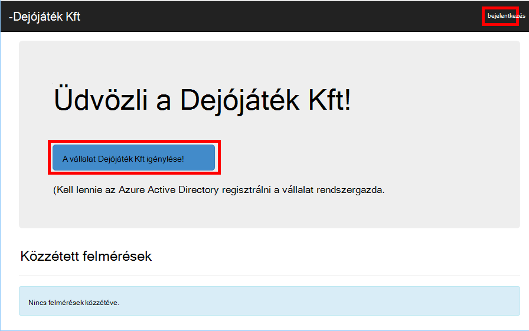

<properties
   pageTitle="Előfizetési és bevezetési multitenant alkalmazásokat a bérlői |} Microsoft Azure"
   description="Hogyan beépített bérlők multitenant alkalmazásban"
   services=""
   documentationCenter="na"
   authors="MikeWasson"
   manager="roshar"
   editor=""
   tags=""/>

<tags
   ms.service="guidance"
   ms.devlang="dotnet"
   ms.topic="article"
   ms.tgt_pltfrm="na"
   ms.workload="na"
   ms.date="05/23/2016"
   ms.author="mwasson"/>

# <a name="sign-up-and-tenant-onboarding-in-a-multitenant-application"></a>Előfizetési és bérlői bevezetési multitenant alkalmazásban

[AZURE.INCLUDE [pnp-header](../../includes/guidance-pnp-header-include.md)]

Ez a cikk a [sorozat]része. Egy teljes [minta alkalmazás] sorozat olvashatja el is van.

Ez a cikk ismerteti, hogyan tudnak megvalósítani a _regisztrációs_ folyamat, amely lehetővé teszi, hogy az alkalmazás szervezetük regisztrálni szeretne egy ügyfél több bérlői alkalmazásban.
A regisztrációs folyamat megvalósítása több oka lehet:

-   Beleegyezés az ügyfél egész szervezet számára az alkalmazás használatát az Active Directory rendszergazda engedélyezi.
-   Hitelkártyás fizetési vagy más felhasználói információk összegyűjtése
-   Minden olyan egyszeri per-bérlői telepítést, szükség szerint az alkalmazás végre.

## <a name="admin-consent-and-azure-ad-permissions"></a>Rendszergazdai hozzájárulása és Azure Active Directory-engedélyek

Annak érdekében, hogy az Azure Active Directory hitelesítő, az alkalmazás a felhasználó a címtárban hozzáférésre van szüksége. Legalább az alkalmazás szükséges engedéllyel a felhasználói profil olvasható. A felhasználó bejelentkezik, először Azure AD egy jóváhagyási űrlapon, amely megjeleníti az engedélyeket a kért jeleníti meg. Kattintson az **Elfogadás**, a felhasználó engedélyt az alkalmazást.

Alapértelmezés szerint engedély felhasználónkénti alapon. Minden felhasználó bejelentkezik a jóváhagyási űrlapon látja. Azure Active Directory is _felügyeleti jóváhagyását adja_, amely lehetővé teszi, hogy az Active Directory a rendszergazda beleegyezés az egész szervezet támogatja.

Ha a rendszergazda jóváhagyási folyamat használják, a jóváhagyási űrlapon kimondja, hogy az Active Directory-rendszergazdai engedélyt a teljes bérlői webhelyen nevében:


A rendszergazdák az **Elfogadás**gombra kattint, más felhasználók ugyanahhoz a bérlőhöz belül jelentkezhetnek be, és Azure Active Directory kihagyja a felhasználó hozzájárul ahhoz képernyő.

Csak AD a rendszergazda rendszergazdai engedély is megjelenhetnek, mert az egész szervezet nevében engedélyt. Ha nem rendszergazda kísérel meg a rendszergazda jóváhagyási folyamat hitelesíteni, az Azure Active Directory hibaüzenetet jelenít meg:


Ha az alkalmazás egy későbbi időpontban további engedélyeket, az ügyfélnek kell jelentkezzen újra, és a frissített engedélyeinek beleegyezés.  

## <a name="implementing-tenant-sign-up"></a>Regisztráció bérlői végrehajtása

A [Dejójáték Kft felmérések] [ Tailspin] alkalmazás, a regisztrációs folyamat több követelményei definiált:

-   Egy bérlői regisztráció kell ahhoz a felhasználók jelentkezhetnek be.
-   Regisztráció a felügyeleti jóváhagyási folyamat használja.
-   Az alkalmazás adatbázisának előfizetési hozzáadja a felhasználó bérlői.
-   Után egy bérlői feliratkozik, az alkalmazás megjelenít egy bevezetési.

Ebben a részben módszeren végigvezetjük a regisztrációs folyamat a végrehajtását.
Fontos, ha meg szeretné érteni, hogy "feliratkozás" és "bejelentkezés"-alkalmazás fogalma van. A hitelesítési folyamat során Azure Active Directory nem eleve tudja hogy a felhasználó éppen feliratkozna. Érdemes az alkalmazás nyomon követheti a a környezetben.

Névtelen felhasználó felülvizsgálatokra a felmérések alkalmazás, a felhasználó esetén megjelenő két gomb, egy bejelentkezni, és egy "regisztrálni a vállalat" (regisztráció).



Következő gombok meghívása a [AccountController] osztály műveletek.

A `SignIn` művelet eredménye egy **ChallegeResult**, amely irányítja a hitelesítési végpont OpenID csatlakoztatása köztes okoz. Az eseményindító hitelesítési ASP.NET Core 1.0 a alapértelmezett módszer.  

```csharp
[AllowAnonymous]
public IActionResult SignIn()
{
    return new ChallengeResult(
        OpenIdConnectDefaults.AuthenticationScheme,
        new AuthenticationProperties
        {
            IsPersistent = true,
            RedirectUri = Url.Action("SignInCallback", "Account")
        });
}
```

Most már összehasonlítása a `SignUp` művelet:

```csharp
[AllowAnonymous]
public IActionResult SignUp()
{
    // Workaround for https://github.com/aspnet/Security/issues/546
    HttpContext.Items.Add("signup", "true");

    var state = new Dictionary<string, string> { { "signup", "true" }};
    return new ChallengeResult(
        OpenIdConnectDefaults.AuthenticationScheme,
        new AuthenticationProperties(state)
        {
            RedirectUri = Url.Action(nameof(SignUpCallback), "Account")
        });
}
```

Például `SignIn`, a `SignUp` művelet is ad vissza egy `ChallengeResult`. Ebben az esetben az állapotinformációkat valamilyen hozzáadunk, de a `AuthenticationProperties` a a `ChallengeResult`:

-   regisztrációs: egy logikai jelző, amely jelzi, hogy a felhasználó elindult a regisztrációs folyamat.

Az állapot adatait az `AuthenticationProperties` rendszer hozzáadja a csatlakozás OpenID [állapot] paramétert, amely utakat kerekíteni a hitelesítési folyamat során.


Után a felhasználó az Azure Active Directory hitelesíti, és visszatér az alkalmazás átirányítását a hitelesítési jegy a állapotát tartalmazza. A FAKT azt szolgáltatást használ, győződjön meg arról, hogy az "előfizetés" érték továbbra is fennáll, a teljes hitelesítési folyamat keresztül.

## <a name="adding-the-admin-consent-prompt"></a>A felügyeleti hozzájárulása kérdés hozzáadása

A felügyeleti jóváhagyási folyamat az Azure Active Directory, a "kérdés" paramétert a hitelesítési kérelmet a lekérdezés karakterlánccal hozzáadásával induljanak:

```
/authorize?prompt=admin_consent&...
```

A felmérés alkalmazás hozzáadása a kérdés alatt a `RedirectToAuthenticationEndpoint` esemény. Ez az esemény előtt a köztes irányítja át a hitelesítési végpont jobbra neve.

```csharp
public override Task RedirectToAuthenticationEndpoint(RedirectContext context)
{
    if (context.IsSigningUp())
    {
        context.ProtocolMessage.Prompt = "admin_consent";
    }

    _logger.RedirectToIdentityProvider();
    return Task.FromResult(0);
}
```

> [AZURE.NOTE] Lásd: [SurveyAuthenticationEvents.cs].

Beállítás` ProtocolMessage.Prompt` a paramétert hozzá szeretné adni a "kérdés" a hitelesítési kérésre köztes alapján.

Figyelje meg, hogy az üzenet csak akkor van szükség előfizetési során. Normál bejelentkezés nem foglalja azt. Megkülönböztetni őket, hogy ellenőrzése a `signup` értéket a hitelesítés állapotú. Ez a feltétel ellenőrzi a következő bővítmény módszer:

```csharp
internal static bool IsSigningUp(this BaseControlContext context)
{
    Guard.ArgumentNotNull(context, nameof(context));

    string signupValue;
    object obj;
    // Check the HTTP context and convert to string
    if (context.HttpContext.Items.TryGetValue("signup", out obj))
    {
        signupValue = (string)obj;
    }
    else
    {
        // It's not in the HTTP context, so check the authentication ticket.  If it's not there, we aren't signing up.
        if ((context.AuthenticationTicket == null) ||
            (!context.AuthenticationTicket.Properties.Items.TryGetValue("signup", out signupValue)))
        {
            return false;
        }
    }

    // We have found the value, so see if it's valid
    bool isSigningUp;
    if (!bool.TryParse(signupValue, out isSigningUp))
    {
        // The value for signup is not a valid boolean, throw                
        throw new InvalidOperationException($"'{signupValue}' is an invalid boolean value");
    }

    return isSigningUp;
}
```

> [AZURE.NOTE] Lásd: [BaseControlContextExtensions.cs].

> [AZURE.NOTE] Megjegyzés: Ez a kód szerepel egy ismert hiba megoldása ASP.NET Core 1.0 RC1. Az a `RedirectToAuthenticationEndpoint` esemény, nincs mód, amely tartalmazza az "előfizetés" állapot hitelesítési tulajdonságait. Megoldás a `AccountController.SignUp` módszer is helyezi az "előfizetés" állapot be a `HttpContext`. Működik, mert `RedirectToAuthenticationEndpoint` történik a átirányítás előtt, hogy továbbra is fennáll, azonos `HttpContext`.

## <a name="registering-a-tenant"></a>A bérlő regisztrálása

A felmérés alkalmazás adatbázis-alkalmazás egyes bérlői információkat és a felhasználónevemet tárol.


A bérlői táblázatban IssuerValue az érték a kibocsátó kárigény a bérlői webhelyen. Ez az Azure Active Directory, a `https://sts.windows.net/<tentantID>` és bérlőnként egy egyedi érték, annál.

Amikor új bérlő feliratkozik, az felmérések alkalmazás bérlői rekordot ír az adatbázist. Ez történik belül a `AuthenticationValidated` esemény. (Nem teheti meg ez az esemény előtt, mert az azonosító jogkivonathoz nem érvényesíthetők még, így nem megbízható állítást értékeket. [Hitelesítés]témakörben talál.

Az alábbiakban az felmérések alkalmazásból a megfelelő kódot:

```csharp
public override async Task AuthenticationValidated(AuthenticationValidatedContext context)
{
    var principal = context.AuthenticationTicket.Principal;
    var userId = principal.GetObjectIdentifierValue();
    var tenantManager = context.HttpContext.RequestServices.GetService<TenantManager>();
    var userManager = context.HttpContext.RequestServices.GetService<UserManager>();
    var issuerValue = principal.GetIssuerValue();
    _logger.AuthenticationValidated(userId, issuerValue);

    // Normalize the claims first.
    NormalizeClaims(principal);
    var tenant = await tenantManager.FindByIssuerValueAsync(issuerValue)
        .ConfigureAwait(false);

    if (context.IsSigningUp())
    {
        // Originally, we were checking to see if the tenant was non-null, however, this would not allow
        // permission changes to the application in AAD since a re-consent may be required.  Now we just don't
        // try to recreate the tenant.
        if (tenant == null)
        {
            tenant = await SignUpTenantAsync(context, tenantManager)
                .ConfigureAwait(false);
        }

        // In this case, we need to go ahead and set up the user signing us up.
        await CreateOrUpdateUserAsync(context.AuthenticationTicket, userManager, tenant)
            .ConfigureAwait(false);
    }
    else
    {
        if (tenant == null)
        {
            _logger.UnregisteredUserSignInAttempted(userId, issuerValue);
            throw new SecurityTokenValidationException($"Tenant {issuerValue} is not registered");
        }

        await CreateOrUpdateUserAsync(context.AuthenticationTicket, userManager, tenant)
            .ConfigureAwait(false);
    }
}
```

> [AZURE.NOTE] Lásd: [SurveyAuthenticationEvents.cs].

Ez a kód az alábbi műveleteket végzi el:

1.  Ellenőrizze, hogy a bérlő kibocsátó érték még az adatbázisban. Ha a bérlő nem regisztrált, `FindByIssuerValueAsync` eredménye üres.
2.  Ha a felhasználónak van fizet elő:
  1.    A bérlő hozzáadása az adatbázishoz (`SignUpTenantAsync`).
  2.    A hitelesített felhasználó hozzáadása az adatbázishoz (`CreateOrUpdateUserAsync`).
3.  Egyéb esetben végezze el a szokásos bejelentkezési folyamat:
  1.    Ha a bérlő kibocsátó nem található meg az adatbázist, akkor a bérlő nem regisztrált, és az ügyfél számára a regisztrálás van szüksége. Ebben az esetben kivételhibát okozhat a hitelesítés sikertelen lesz.
  2.    Ellenkező esetben hozzon létre egy adatbázis-rekordot, ennek a felhasználónak, ha nem egy már (`CreateOrUpdateUserAsync`).

Az alábbiakban a [SignUpTenantAsync] módszert, amelyet a bérlő hozzáadja az adatbázist.

```csharp
private async Task<Tenant> SignUpTenantAsync(BaseControlContext context, TenantManager tenantManager)
{
    Guard.ArgumentNotNull(context, nameof(context));
    Guard.ArgumentNotNull(tenantManager, nameof(tenantManager));

    var principal = context.AuthenticationTicket.Principal;
    var issuerValue = principal.GetIssuerValue();
    var tenant = new Tenant
    {
        IssuerValue = issuerValue,
        Created = DateTimeOffset.UtcNow
    };

    try
    {
        await tenantManager.CreateAsync(tenant)
            .ConfigureAwait(false);
    }
    catch(Exception ex)
    {
        _logger.SignUpTenantFailed(principal.GetObjectIdentifierValue(), issuerValue, ex);
        throw;
    }

    return tenant;
}
```

Az alábbiakban összefoglaljuk, a teljes regisztrációs folyamat felmérések alkalmazásban:

1.  A felhasználó a **Feliratkozás** gombra kattint.
2.  A `AccountController.SignUp` művelet challege értéket ad eredményül.  A hitelesítési állapot "előfizetés" értéket tartalmaz.
3.  Az a `RedirectToAuthenticationEndpoint` esemény hozzáadása a `admin_consent` kérdés.
4.  Azure Active Directory irányítja át a csatlakozás OpenID köztes, és a felhasználó hitelesíti.
5.  Az a `AuthenticationValidated` esemény, keresse meg a "előfizetés" állapotát.
6.  A bérlő hozzáadása az adatbázishoz.

## <a name="next-steps"></a>Következő lépések

- Olvassa el a sorozat következő cikkét: [multitenant alkalmazásokban alkalmazás szerepkörök][app roles]


<!-- Links -->
[app roles]: guidance-multitenant-identity-app-roles.md
[Tailspin]: guidance-multitenant-identity-tailspin.md
[sorozaton kívüli]: guidance-multitenant-identity.md
[AccountController]: https://github.com/Azure-Samples/guidance-identity-management-for-multitenant-apps/blob/master/src/Tailspin.Surveys.Web/Controllers/AccountController.cs
[állam]: http://openid.net/specs/openid-connect-core-1_0.html#AuthRequest
[SurveyAuthenticationEvents.cs]: https://github.com/Azure-Samples/guidance-identity-management-for-multitenant-apps/blob/master/src/Tailspin.Surveys.Web/Security/SurveyAuthenticationEvents.cs
[BaseControlContextExtensions.cs]: https://github.com/Azure-Samples/guidance-identity-management-for-multitenant-apps/blob/master/src/Tailspin.Surveys.Web/Security/BaseControlContextExtensions.cs
[Hitelesítés]: guidance-multitenant-identity-authenticate.md
[SignUpTenantAsync]: https://github.com/Azure-Samples/guidance-identity-management-for-multitenant-apps/blob/master/src/Tailspin.Surveys.Web/Security/SurveyAuthenticationEvents.cs
[minta alkalmazás]: https://github.com/Azure-Samples/guidance-identity-management-for-multitenant-apps
