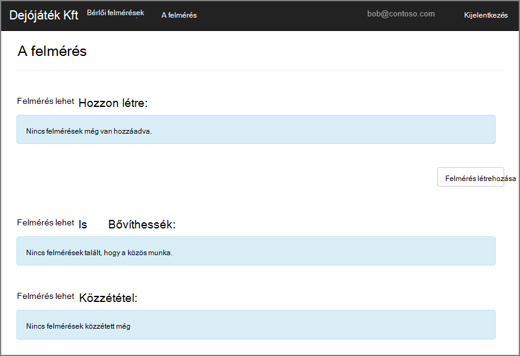
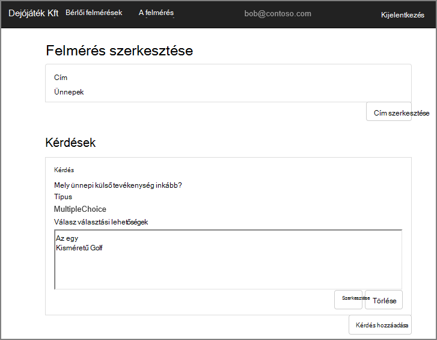
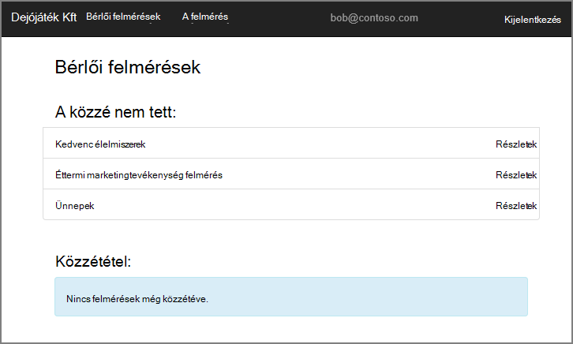
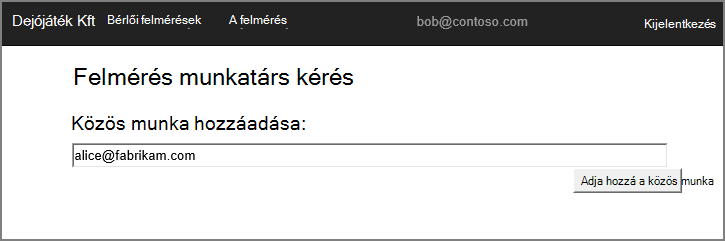
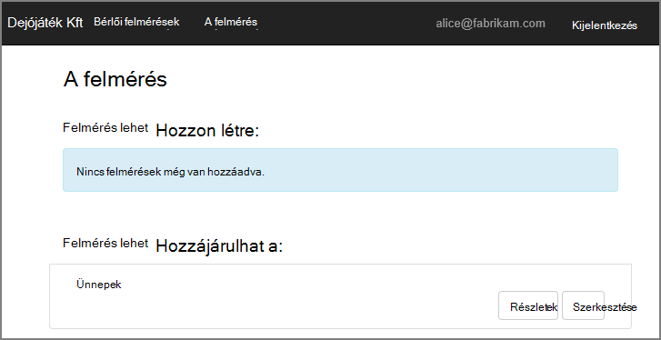
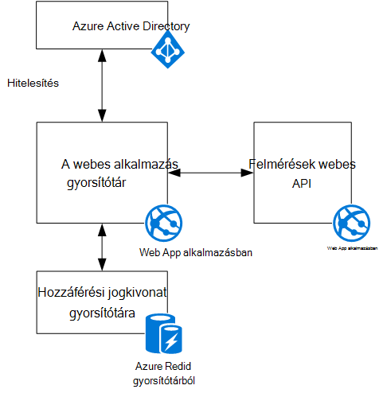

<properties
   pageTitle="Dejójáték Kft felmérések alkalmazással kapcsolatos |} Microsoft Azure"
   description="Dejójáték Kft felmérések alkalmazásban – áttekintés"
   services=""
   documentationCenter="na"
   authors="MikeWasson"
   manager="roshar"
   editor=""
   tags=""/>

<tags
   ms.service="guidance"
   ms.devlang="dotnet"
   ms.topic="article"
   ms.tgt_pltfrm="na"
   ms.workload="na"
   ms.date="05/23/2016"
   ms.author="mwasson"/>

# Dejójáték Kft felmérések alkalmazással kapcsolatos

[AZURE.INCLUDE [pnp-header](../../includes/guidance-pnp-header-include.md)]

Ez a cikk a [sorozat]része. Egy teljes [minta alkalmazás] sorozat olvashatja el is van.

Dejójáték Kft, amely egy felmérések nevű szoftver alkalmazásra van elkészítésének a vállalatnak. Ez az alkalmazás lehetővé teszi, hogy a szervezet létrehozásához és közzétételéhez online felmérések.

- Egy szervezet az alkalmazás regisztrálhat.
- Miután a szervezet regisztrált, a felhasználók a szervezeti hitelesítő adatokkal alkalmazásba jelentkezhetnek.
- Felhasználók létrehozása, szerkesztése és közzététele a felmérést.

> [AZURE.NOTE] Első lépések az alkalmazást, olvassa el [a felmérések alkalmazást futtató].

## Felhasználók létrehozása, szerkesztése és felmérések megtekintése

Egy hitelesített felhasználó megtekintheti az illető kikkel hozott létre, vagy a közös munka jogosultsága van felmérések, és hozzon létre új felmérések. Figyelje meg, hogy a felhasználó jelentkezett-e be a szervezeti azonosítójával `bob@contoso.com`.

A képernyőképen a felmérés szerkesztése lapon:

Felhasználók is megtekintheti, hogy minden ugyanahhoz a bérlőhöz belül más felhasználók által létrehozott felmérések.

## Felmérés tulajdonosok meghívhatnak a munkatársak

Ha egy felhasználó a felmérés hoz létre, meghívhatnak a felmérés a munkatársként felvenni másoknak. Munkatársak a felmérést, szerkesztheti, de nem törölhetők, illetve a projekt közzététele.  

A felhasználó vehet fel munkatársak más bérlők, amely lehetővé teszi, hogy az erőforrások megosztása határokon-bérlői. A képernyőképen, Péter (`bob@contoso.com`) veheti fel, Anna (`alice@fabrikam.com`) Péter létrehozott felmérésre munkatársként.

Anna jelentkezik be, amikor azt látja, a felmérés "Felmérések tud járulni" alatt.

Látható, hogy Anna bejelentkezik az saját bérlői, nem a a Contoso bérlő vendégként. Anna munkatársi engedéllyel rendelkezik csak vonatkozóan, hogy a felmérés &mdash; éppen nem lehet megtekinteni a Contoso bérlőjének egyéb felmérések.

## Architektúra

A felmérés alkalmazás egy előtér és a webes API kódmentes áll. [ASP.NET Core 1.0]segítségével is lehet létrehozni.

A webalkalmazás felhasználói hitelesítő Azure Active Directory (Azure Active Directory) használja. A webalkalmazás az OAuth 2 hozzáférési jogkivonat beszerzése a webes API Azure Active Directory is hívások. Azure vgx.dll gyorsítótárban gyorsítótárazott hozzáférési jogkivonat A gyorsítótár lehetővé teszi, hogy az azonos jogkivonat-gyorsítótár (például kiszolgálófarm) megosztására több példányon.

## Következő lépések

- Olvassa el a sorozat következő cikkét: [multitenant alkalmazásokat, az Azure Active Directory és a csatlakozás OpenID-hitelesítés][authentication]

<!-- Links -->

[authentication]: guidance-multitenant-identity-authenticate.md
[sorozaton kívüli]: guidance-multitenant-identity.md
[A felmérés alkalmazást futtató]: https://github.com/Azure-Samples/guidance-identity-management-for-multitenant-apps/blob/master/docs/running-the-app.md
[ASP.NET Core 1.0]: https://docs.asp.net/en/latest/
[minta alkalmazás]: https://github.com/Azure-Samples/guidance-identity-management-for-multitenant-apps
