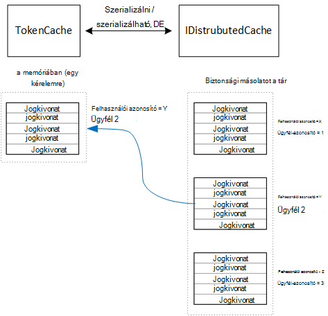

<properties
   pageTitle="A multitenant alkalmazások számára a hozzáférést tokenek gyorsítótárazás |} Microsoft Azure"
   description="A webes API kódmentes meghívása használt gyorsítótár hozzáférési jogkivonat"
   services=""
   documentationCenter="na"
   authors="MikeWasson"
   manager="roshar"
   editor=""
   tags=""/>

<tags
   ms.service="guidance"
   ms.devlang="dotnet"
   ms.topic="article"
   ms.tgt_pltfrm="na"
   ms.workload="na"
   ms.date="02/16/2016"
   ms.author="mwasson"/>


# <a name="caching-access-tokens-in-a-multitenant-application"></a>Gyorsítótár-hozzáférési jogkivonat multitenant alkalmazásban

[AZURE.INCLUDE [pnp-header](../../includes/guidance-pnp-header-include.md)]

Ez a cikk a [sorozat]része. Egy teljes [minta alkalmazás] sorozat olvashatja el is van.

Érdemes viszonylag költséges hozzáférhet az OAuth jogkivonat, mert a token végpont HTTP-kérelem igényel. Ezért célszerű a gyorsítótár tokenek, amikor csak lehetséges. Az [Azure Active Directory Authentication Library] [ ADAL] automatikusan a gyorsítótárban Azure Active Directory, beleértve a frissítés tokenek nyert tokenek (ADAL).

ADAL tartalmaz egy alapértelmezett jogkivonat gyorsítótár végrehajtása. Azonban a token gyorsítótár alkalmazások natív ügyfele számára, és _nem_ megfelelő web Apps alkalmazások:

-   Egy statikus példány, de nem biztonságos szál.
-   Azt nem méretezhető nagyszámú felhasználója, mert az összes felhasználó tokenek mappába érkeznek ugyanazt a szótár.
-   Webes farm kiszolgálóin található egy nem lehet megosztani.

Ehelyett, végre kell hajtania a ADAL származik egyéni jogkivonat gyorsítótárat `TokenCache` osztály de megfelelő kiszolgálói környezetben bejegyzései, és a célszerű szintet elkülönítési fokát tokenek más felhasználók számára.

A `TokenCache` osztály tokenek, kibocsátó, az erőforrás, az ügyfél-azonosító és a felhasználó által indexelt szótár tárolja. Egyéni token-gyorsítótár egy biztonsági mentése, például egy vgx.dll gyorsítótárat a szótár kell írni.

Dejójáték Kft felmérések alkalmazásban a `DistributedTokenCache` osztály a token gyorsítótár hajtja végre. Ez a megvalósítás használja a [IDistributedCache] [ distributed-cache] hardverabsztrakciós ASP.NET Core 1.0-ról. Úgy, hogy minden olyan `IDistributedCache` végrehajtása is alkalmazható a mögöttes áruházból.

-   Alapértelmezés szerint a felmérések alkalmazás használja vgx.dll gyorsítótárat.
-   Az egyetlen-példány webkiszolgálóra, használhatja a ASP.NET Core 1.0 [a memóriában gyorsítótár][in-memory-cache]. (Ez a még az alkalmazás helyileg futó fejlesztés során jó lehetőséget.)

> [AZURE.NOTE] A vgx.dll gyorsítótárat a .NET Core jelenleg nem támogatott.

`DistributedTokenCache`a biztonsági áruházban kulcs/érték párokká gyorsítótár adatokat tárolja. A kulcs is a felhasználói azonosító, valamint az ügyfél-azonosító, ezért a mögöttes tároló minden felhasználó/ügyfél egyedi kombinációja külön gyorsítótár adatokat tároló.



Felhasználó által a mögöttes tároló particionált. Az egyes HTTP-kérés a felhasználó számára tokenek olvassa el a mögöttes áruházból, és betölti a a `TokenCache` szótár. Ha vgx.dll szolgál a biztonsági mentése, olvasása minden kiszolgálói példány egy kiszolgálófarm írása a azonos gyorsítótárba, és ezt a megközelítést méretezze át a sok felhasználónak.

## <a name="encrypting-cached-tokens"></a>Gyorsítótárazott tokenek titkosítása

Tokenek a kényes adatok, mert azok hozzáférést biztosítani a felhasználó erőforrások. (Ezenkívül eltérően a jelszavát, nem csak tárolhatja a jogkivonat kivonat.) Ezért fontos tokenek védelme illetéktelen kezekbe. A biztonsági vgx.dll gyorsítótár jelszóval védett, de ha valaki megkapja a jelszót, azok lehet felvenni az összes a gyorsítótárban tárolt hozzáférési jogkivonat. Emiatt a `DistributedTokenCache` titkosítja, amit ír a mögöttes áruházból. Titkosítási befejeződött a ASP.NET Core 1.0 [Adatvédelem] [ data-protection] API-khoz.

> [AZURE.NOTE] Ha telepíti az Azure-webhelyek, a titkosítási kulcs hálózati tárolóhoz a biztonsági mentésben és szinkronizálja az összes gépek (lásd: [Kulcskezelő][key-management]). Alapértelmezés szerint billentyűk nem titkosított Azure webhelyek fut, de is [engedélyezhető a titkosítási X.509 tanúsítvány használatával][x509-cert-encryption].


## <a name="distributedtokencache-implementation"></a>DistributedTokenCache végrehajtása

A [DistributedTokenCache] [ DistributedTokenCache] osztály származik, az ADAL [TokenCache] [ tokencache-class] osztály.

A konstruktorban a `DistributedTokenCache` osztály létrehoz egy kulcsot, az aktuális felhasználó számára, és a gyorsítótár betölti a mögöttes áruházból:

```csharp
public DistributedTokenCache(
    ClaimsPrincipal claimsPrincipal,
    IDistributedCache distributedCache,
    ILoggerFactory loggerFactory,
    IDataProtectionProvider dataProtectionProvider)
    : base()
{
    _claimsPrincipal = claimsPrincipal;
    _cacheKey = BuildCacheKey(_claimsPrincipal);
    _distributedCache = distributedCache;
    _logger = loggerFactory.CreateLogger<DistributedTokenCache>();
    _protector = dataProtectionProvider.CreateProtector(typeof(DistributedTokenCache).FullName);
    AfterAccess = AfterAccessNotification;
    LoadFromCache();
}
```

A kulcs létrejön a felhasználói azonosító, és az ügyfél-azonosító összefűzésével Mindkét kell venni a felhasználó található követelések `ClaimsPrincipal`:

```csharp
private static string BuildCacheKey(ClaimsPrincipal claimsPrincipal)
{
    string clientId = claimsPrincipal.FindFirstValue("aud", true);
    return string.Format(
        "UserId:{0}::ClientId:{1}",
        claimsPrincipal.GetObjectIdentifierValue(),
        clientId);
}
```

A gyorsítótár adat betöltése, olvassa el a szerializált blob a mögöttes áruházból, és a hívás `TokenCache.Deserialize` a blob alakítani gyorsítótárban adatokat.

```csharp
private void LoadFromCache()
{
    byte[] cacheData = _distributedCache.Get(_cacheKey);
    if (cacheData != null)
    {
        this.Deserialize(_protector.Unprotect(cacheData));
    }
}
```

Amikor ADAL a gyorsítótár használatához, akkor indul el egy `AfterAccess` esemény. Ha a gyorsítótár adatai megváltoztak, a `HasStateChanged` tulajdonság értéke igaz. Ebben az esetben frissítése megjelennek a változások a mögöttes áruházból, és állítsa `HasStateChanged` false.

```csharp
public void AfterAccessNotification(TokenCacheNotificationArgs args)
{
    if (this.HasStateChanged)
    {
        try
        {
            if (this.Count > 0)
            {
                _distributedCache.Set(_cacheKey, _protector.Protect(this.Serialize()));
            }
            else
            {
                // There are no tokens for this user/client, so remove the item from the cache.
                _distributedCache.Remove(_cacheKey);
            }
            this.HasStateChanged = false;
        }
        catch (Exception exp)
        {
            _logger.WriteToCacheFailed(exp);
            throw;
        }
    }
}
```

TokenCache küld két esemény:

- `BeforeWrite`. Közvetlenül az ADAL ír a gyorsítótár előtt neve. Használhatja ezt a feldolgozási stratégia végrehajtása
- `BeforeAccess`. Közvetlenül a ADAL beolvassa a gyorsítótár előtt neve. Itt is ismételt betöltése a gyorsítótár legújabb verziójának beszerzése.

Ebben az esetben azt úgy döntött, nem kezelje a következő két esemény.

- Feldolgozási, az utolsó wins írni. Ennek oka az OK gombra, tokenek tárolják egymástól függetlenül minden felhasználó + ügyfélprogram, így szeretné az ütközés csak fordulhat elő, ha az adott felhasználó volna két egyidejű bejelentkezési munkamenetek.
- Az olvasóablakban, azt betöltése a gyorsítótár minden kérésének megfelelően. Kérés rövid élettartamú kerül. Módosításakor a gyorsítótár kap abban az időpontban, a következő kérés felveszi az új érték lesz.

## <a name="next-steps"></a>Következő lépések

- Olvassa el a sorozat következő cikkét: [Federating az AD FS ügyfél-multitenant alkalmazások Azure-ban][adfs]

<!-- links -->
[ADAL]: https://msdn.microsoft.com/library/azure/jj573266.aspx
[adfs]: guidance-multitenant-identity-adfs.md
[data-protection]: https://docs.asp.net/en/latest/security/data-protection/index.html
[distributed-cache]: https://docs.asp.net/en/latest/fundamentals/distributed-cache.html
[DistributedTokenCache]: https://github.com/Azure-Samples/guidance-identity-management-for-multitenant-apps/blob/master/src/Tailspin.Surveys.TokenStorage/DistributedTokenCache.cs
[key-management]: https://docs.asp.net/en/latest/security/data-protection/configuration/default-settings.html
[in-memory-cache]: https://docs.asp.net/en/latest/fundamentals/caching.html
[tokencache-class]: https://msdn.microsoft.com/library/azure/microsoft.identitymodel.clients.activedirectory.tokencache.aspx
[x509-cert-encryption]: https://docs.asp.net/en/latest/security/data-protection/implementation/key-encryption-at-rest.html#x-509-certificate
[sorozaton kívüli]: guidance-multitenant-identity.md
[minta alkalmazás]: https://github.com/Azure-Samples/guidance-identity-management-for-multitenant-apps
