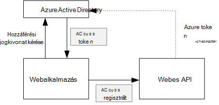
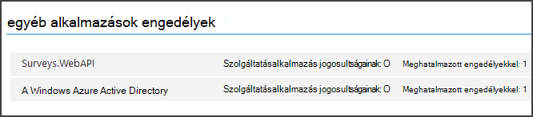

<properties
   pageTitle="Biztonságossá tétele multitenant alkalmazásban kódmentes webes API |} Microsoft Azure"
   description="Hogyan kódmentes webes API biztonságossá tétele"
   services=""
   documentationCenter="na"
   authors="MikeWasson"
   manager="roshar"
   editor=""
   tags=""/>

<tags
   ms.service="guidance"
   ms.devlang="dotnet"
   ms.topic="article"
   ms.tgt_pltfrm="na"
   ms.workload="na"
   ms.date="06/02/2016"
   ms.author="mwasson"/>

# <a name="securing-a-backend-web-api-in-a-multitenant-application"></a>Egy multitenant alkalmazásra kódmentes webes API biztonságossá tétele

[AZURE.INCLUDE [pnp-header](../../includes/guidance-pnp-header-include.md)]

Ez a cikk a [sorozat]része. Egy teljes [minta alkalmazás] sorozat olvashatja el is van.

[Dejójáték Kft felmérések] alkalmazása kódmentes webes API használja felmérések CRUD műveletek kezelésére. Például "Saját felmérések" felhasználó kattintáskor a webalkalmazás-HTTP kérést küld a webes API:

```
GET /users/{userId}/surveys
```

A webes API egy JSON-objektum adja eredményül:

```
{
  "Published":[],
  "Own":[
    {"Id":1,"Title":"Survey 1"},
    {"Id":3,"Title":"Survey 3"},
    ],
  "Contribute": [{"Id":8,"Title":"My survey"}]
}
```

A webes API nem engedélyezi a névtelen kérések, így a web app kell hitelesítse magát OAuth 2 bearer tokenek használata.

> [AZURE.NOTE] Ez a példa kiszolgálók között. Az alkalmazás nem hívásokat bármely AJAX az API-nak a böngésző ügyfélprogramból.

Kétféleképpen fő elvégezhető:

- A meghatalmazott felhasználói azonosítót. A felhasználói azonosító hitelesíti a webalkalmazást.
- Alkalmazás azonosítója. A webes alkalmazás hitelesíti az ügyfél-azonosító, oauth2 hitelesítési mód ügyfél hitelesítőadat-adatfolyam használatával.

Dejójáték Kft alkalmazása delegált felhasználóazonosító hajtja végre. Az alábbiakban a főbb különbségek:

**Delegált felhasználóazonosító**

- Az a webes API küldött bearer jogkivonathoz a felhasználóazonosító tartalmazza.
- A webes API döntéseket engedélyt a felhasználói azonosító alapján.
- A webes alkalmazás kell kezelni a 403 (tiltott) hiba az internetről API, ha a felhasználónak nincs engedélye végrehajtson egy műveletet.
- Általában a webes alkalmazás továbbra is döntéseket bizonyos engedély, amelyek befolyásolják UI, például megjelenítése és elrejtése a felhasználói felület elemei).
- A webes API esetleg nem megbízható ügyfélalkalmazások, például a JavaScript-alkalmazások vagy egy belső ügyfélalkalmazás használható.

**Alkalmazás azonosítója**

- A webes API nem kap a felhasználó adatai.
- A webes API nem tudja végrehajtani a felhasználói azonosító alapján engedély. Az összes engedély döntéseket a webes alkalmazás.  
- A webes API-nem megbízható ügyfél (a JavaScript vagy natív ügyfélalkalmazás) nem használhatók.
- Ezt a megközelítést némileg egyszerűbbé végrehajtásához, lehet, mert nincs engedélyezési logika a webes API.

Bármelyik megközelítésben a webalkalmazás be kell szereznie egy jogkivonat, amely a hitelesítő adatokat, hívja fel a webes API szükséges.

- A meghatalmazott felhasználói azonosítót a token származhat a IDP, amely a felhasználó nevében jogkivonat állíthatnak rendelkezik.

- Az ügyfél hitelesítő adatait az alkalmazások előfordulhat, hogy a token kinyerése a IDP vagy saját jogkivonat kiszolgáló. (De ne írja be a token kiszolgáló nulláról; például [IdentityServer3]tesztelt keretet használata.) Ha az Azure Active Directory hitelesítést végezni, erősen ajánlott az jogkivonat kérjen az Azure Active Directory, akár az ügyfél hitelesítőadat-adatfolyam.

Ez a cikk a többi feltételezi, hogy az alkalmazás az Azure Active Directory hitelesíti.



## <a name="register-the-web-api-in-azure-ad"></a>A webes API regisztrálása az Azure Active Directory

Az Azure Active Directory, a webes API egy bearer jogkivonat kibocsátása sorrendben kell néhány dolog, amit az Azure Active Directory konfigurálása.

1. [A webes API az Azure Active Directory regisztrálni].

2. A webes API-alkalmazás jegyzék a webes alkalmazás az ügyfél-azonosító hozzáadása a `knownClientApplications` tulajdonság. Lásd: [az alkalmazás-jegyzékfájlok frissítése].

3. [Engedély megadása a webes alkalmazás hívja fel a webes API-val].

  Az Azure adatkezelési portálon beállíthatja, hogy kétféle típusú engedélyek: az alkalmazás azonosítója (ügyfél hitelesítő adatok áramlás) vagy "Meghatalmazott engedélyeit" delegált felhasználói azonosító "Alkalmazásengedélyek".

  

## <a name="getting-an-access-token"></a>Az első egy hozzáférési jogkivonat

Hívja fel a webes API-val, mielőtt a webes alkalmazás lekérése access jogkivonat Azure AD. A .NET-alkalmazást, használja az [Azure Active Directory Authentication Library (ADAL) a .NET rendszerhez][ADAL].

Az OAuth 2 engedélyezési kód forgalom az alkalmazás üzenetváltásokat egy-egy hozzáférési jogkivonat engedélyezési kódot. A következő kód beolvasása a hozzáférési jogkivonat ADAL használja. Ez a kód neve alatt a `AuthorizationCodeReceived` esemény.

```csharp
// The OpenID Connect middleware sends this event when it gets the authorization code.   
public override async Task AuthorizationCodeReceived(AuthorizationCodeReceivedContext context)
{
    string authorizationCode = context.ProtocolMessage.Code;
    string authority = "https://login.microsoftonline.com/" + tenantID
    string resourceID = "https://tailspin.onmicrosoft.com/surveys.webapi" // App ID URI
    ClientCredential credential = new ClientCredential(clientId, clientSecret);

    AuthenticationContext authContext = new AuthenticationContext(authority, tokenCache);
    AuthenticationResult authResult = await authContext.AcquireTokenByAuthorizationCodeAsync(
        authorizationCode, new Uri(redirectUri), credential, resourceID);

    // If successful, the token is in authResult.AccessToken
}
```

Az alábbiakban a különböző paraméterek szükséges:

- `authority`. A bérlői Azonosítójával bejelentkezve származik. (Nem a bérlői Azonosítóját a szoftver szolgáltató)  
- `authorizationCode`. a kapott vissza az IDP auth kódot.
- `clientId`. A webes alkalmazás ügyfél-azonosítóval.
- `clientSecret`. A webes alkalmazás ügyfél titkos.
- `redirectUri`. Az átirányítás OpenID beállított URI a Csatlakozás gombra. Ez a hol a IDP visszahívja a token együtt.
- `resourceID`. Az alkalmazás azonosítója URI a webes API-t, a webes API az Azure Active Directory regisztrálásakor létrehozó
- `tokenCache`. A hozzáférési jogkivonat gyorsítótárát objektum. Lásd: a [gyorsítótár Token].

Ha `AcquireTokenByAuthorizationCodeAsync` létrejött, ADAL a token gyorsítótárát. Újabb verzióiban, amely letölthető a token a gyorsítótár AcquireTokenSilentAsync hívásával:

```csharp
AuthenticationContext authContext = new AuthenticationContext(authority, tokenCache);
var result = await authContext.AcquireTokenSilentAsync(resourceID, credential, new UserIdentifier(userId, UserIdentifierType.UniqueId));
```

Ha `userId` van a felhasználó Objektumazonosító, amely megtalálható a `http://schemas.microsoft.com/identity/claims/objectidentifier` formál.

## <a name="using-the-access-token-to-call-the-web-api"></a>A hozzáférési jogkivonat használata a webes API felhívására

Ha befejezte a jogkivonat, küldje el a HTTP-kérések engedélyezése fejlécében a webes API-val.

```
Authorization: Bearer xxxxxxxxxx
```

A következő bővítmény módszer az felmérések alkalmazásból a HTTP-kérelem, a **HttpClient** osztály használatával állítja be a engedélyezési fejléc.

```csharp
public static async Task<HttpResponseMessage> SendRequestWithBearerTokenAsync(this HttpClient httpClient, HttpMethod method, string path, object requestBody, string accessToken, CancellationToken ct)
{
    var request = new HttpRequestMessage(method, path);
    if (requestBody != null)
    {
        var json = JsonConvert.SerializeObject(requestBody, Formatting.None);
        var content = new StringContent(json, Encoding.UTF8, "application/json");
        request.Content = content;
    }

    request.Headers.Authorization = new AuthenticationHeaderValue("Bearer", accessToken);
    request.Headers.Accept.Add(new MediaTypeWithQualityHeaderValue("application/json"));

    var response = await httpClient.SendAsync(request, ct);
    return response;
}
```

> [AZURE.NOTE] Lásd: [HttpClientExtensions.cs].

## <a name="authenticating-in-the-web-api"></a>A webes API a hitelesítés

A webes API hitelesítést végezni az bearer jogkivonathoz tartalmaz. ASP.NET Core 1.0, használhatja a [Microsoft.AspNet.Authentication.JwtBearer] [ JwtBearer] csomagot. Ebben a csomagban, amely lehetővé teszi, hogy az alkalmazás OpenID csatlakozás bearer tokenek fogadásához köztes biztosít.

A webes API regisztrálása a köztes `Startup` osztály.

```csharp
app.UseJwtBearerAuthentication(options =>
{
    options.Audience = "[app ID URI]";
    options.Authority = "https://login.microsoftonline.com/common/";
    options.TokenValidationParameters = new TokenValidationParameters
    {
        //Instead of validating against a fixed set of known issuers, we perform custom multi-tenant validation logic
        ValidateIssuer = false,
    };
    options.Events = new SurveysJwtBearerEvents();
});
```

> [AZURE.NOTE] Lásd: [Startup.cs].

- **A célközönség**. Ezeket a beállításokat az alkalmazás azonosítója URL-címet a webes API-val, amely a webes API az Azure Active Directory regisztrálásakor létrehozott.
- A **szervezet**. Multitenant alkalmazáshoz, ezeket a beállításokat `https://login.microsoftonline.com/common/`.
- **TokenValidationParameters**. Multitenant alkalmazáshoz állítsa **ValidateIssuer** hamis. Ez azt jelenti, hogy az alkalmazás ellenőrzi a kibocsátó.
- **Események** eredetű **JwtBearerEvents**származik.

### <a name="issuer-validation"></a>Kibocsátó érvényesítése

A token kibocsátó **JwtBearerEvents.ValidatedToken** esemény ellenőrzése. A kibocsátó küldi el a "iss" kárigény.

A felmérés alkalmazásban a webes API [-előfizetési bérlői]nem kezelni. Ezért csak ellenőrzi a kibocsátó már az alkalmazás-adatbázisban. Ha nem, akkor a kivételt, hitelesítést okozó okoz.

```csharp
public override async Task ValidatedToken(ValidatedTokenContext context)
{
    var principal = context.AuthenticationTicket.Principal;
    var tenantManager = context.HttpContext.RequestServices.GetService<TenantManager>();
    var userManager = context.HttpContext.RequestServices.GetService<UserManager>();
    var issuerValue = principal.GetIssuerValue();
    var tenant = await tenantManager.FindByIssuerValueAsync(issuerValue);

    if (tenant == null)
    {
        // the caller was not from a trusted issuer - throw to block the authentication flow
        throw new SecurityTokenValidationException();
    }
}
```

> [AZURE.NOTE] Lásd: [SurveysJwtBearerEvents.cs].

A **ValidatedToken** esemény [követelések átalakítása]elvégzendő is használhatja. Ne feledje, hogy követelések beépített részei, és közvetlenül az Azure Active Directory, így a webes alkalmazás nem vette fel követelések átalakításokat, ha azokat, nem jelennek meg az bearer jogkivonathoz, hogy a webes API kapja.

## <a name="authorization"></a>Engedély

Az Általános vitafórum engedély, lásd: a [szerepkör - és erőforrás-alapú hitelesítés][Authorization]. 

A JwtBearer köztes kezeli a engedélyezési válaszokat. Például korlátozza a vezérlő művelet hitelesített felhasználóknak, használja a **[engedélyezése]** atrribute, és adja meg a hitelesítési mód **JwtBearerDefaults.AuthenticationScheme** :

```csharp
[Authorize(ActiveAuthenticationSchemes = JwtBearerDefaults.AuthenticationScheme)]
```

Egy 401 állapotkódot ez adja eredményül, ha a felhasználó nem hitelesítése.

Korlátozza a vezérlő művelet authorizaton házirend, adja meg a házirend nevére a **[engedélyezése]** attribútum:

```csharp
[Authorize(Policy = PolicyNames.RequireSurveyCreator)]
```

Ez ad vissza egy 401 állapotkódot, ha a felhasználó nem hitelesítése és 403, ha a felhasználó hitelesített, de még nem engedélyezett. A házirend indításkor rögzítése:

```csharp
public void ConfigureServices(IServiceCollection services)
{
    services.AddAuthorization(options =>
    {
        options.AddPolicy(PolicyNames.RequireSurveyCreator,
            policy =>
            {
                policy.AddRequirements(new SurveyCreatorRequirement());
                policy.AddAuthenticationSchemes(JwtBearerDefaults.AuthenticationScheme);
            });
    });
}
```

## <a name="next-steps"></a>Következő lépések

- Olvassa el a sorozat következő cikkét: [gyorsítótárazás hozzáférési jogkivonat multitenant alkalmazásban][token cache]

<!-- links -->
[ADAL]: https://msdn.microsoft.com/library/azure/jj573266.aspx
[JwtBearer]: https://www.nuget.org/packages/Microsoft.AspNet.Authentication.JwtBearer
[sorozaton kívüli]: guidance-multitenant-identity.md
[Dejójáték Kft felmérések]: guidance-multitenant-identity-tailspin.md
[IdentityServer3]: https://github.com/IdentityServer/IdentityServer3
[A webes API regisztrálása az Azure Active Directory]: https://github.com/Azure-Samples/guidance-identity-management-for-multitenant-apps/blob/master/docs/running-the-app.md#register-the-surveys-web-api
[Az alkalmazás-jegyzékfájlok frissítése]: https://github.com/Azure-Samples/guidance-identity-management-for-multitenant-apps/blob/master/docs/running-the-app.md#update-the-application-manifests
[Engedély megadása a webes alkalmazás hívja fel a webes API]: https://github.com/Azure-Samples/guidance-identity-management-for-multitenant-apps/blob/master/docs/running-the-app.md#give-the-web-app-permissions-to-call-the-web-api
[Jogkivonat gyorsítótárazás]: guidance-multitenant-identity-token-cache.md
[HttpClientExtensions.cs]: https://github.com/Azure-Samples/guidance-identity-management-for-multitenant-apps/blob/master/src/Tailspin.Surveys.Common/HttpClientExtensions.cs
[Startup.cs]: https://github.com/Azure-Samples/guidance-identity-management-for-multitenant-apps/blob/master/src/Tailspin.Surveys.WebAPI/Startup.cs
[regisztráció bérlői]: guidance-multitenant-identity-signup.md
[SurveysJwtBearerEvents.cs]: https://github.com/Azure-Samples/guidance-identity-management-for-multitenant-apps/blob/master/src/Tailspin.Surveys.WebAPI/SurveyJwtBearerEvents.cs
[követelések transzformációt hajt végre.]: guidance-multitenant-identity-claims.md#claims-transformations
[Authorization]: guidance-multitenant-identity-authorize.md
[minta alkalmazás]: https://github.com/Azure-Samples/guidance-identity-management-for-multitenant-apps
[token cache]: guidance-multitenant-identity-token-cache.md
