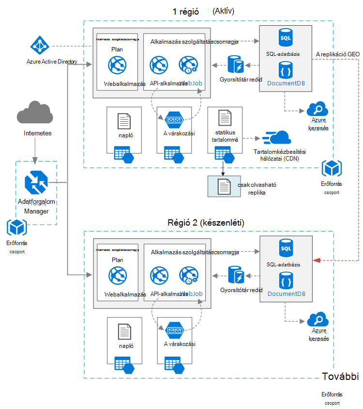

<properties
   pageTitle="A magas rendelkezésre webalkalmazás |} Azure hivatkozás architektúra |} Microsoft Azure"
   description="Webalkalmazás architektúra ajánlott a magas, a Microsoft Azure-ban futó rendelkezésre."
   services="app-service,app-service\web,sql-database" 
   documentationCenter="na"
   authors="MikeWasson"
   manager="roshar"
   editor=""
   tags=""/>

<tags
   ms.service="guidance"
   ms.devlang="na"
   ms.topic="article"
   ms.tgt_pltfrm="na"
   ms.workload="na"
   ms.date="06/27/2016"
   ms.author="mwasson"/>

# <a name="azure-reference-architecture-web-application-with-high-availability"></a>Azure hivatkozás architektúra: a magas rendelkezésre webalkalmazás

[AZURE.INCLUDE [pnp-RA-branding](../../includes/guidance-pnp-header-include.md)]

Ez a cikk bemutatja a webalkalmazások egy javasolt architektúra a magas, a Microsoft Azure futó rendelkezésre. A architektúrára épül [Azure hivatkozás architektúra: a webes alkalmazásokban méretezhetőség javításához][guidance-web-apps-scalability].

## <a name="architecture-diagram"></a>Architektúra diagramja



A architektúra épül a [webalkalmazás javítása méretezhetősége]látható egy[guidance-web-apps-scalability]. A főbb különbségek a következők:

- **Az elsődleges és másodlagos régiók**. Ez a felépítés használja a két régió magasabb rendelkezésre állás érdekében. Az alkalmazás minden egyes területeire telepítve van. Normál működés közben az elsődleges régióra továbbítás hálózati forgalmának engedélyezésére. De, amely nem érhető el, ha forgalom van-e irányítva a másodlagos területére. Feladatátvevő kapcsolatos részletekért olvassa el a [kezelése feladatátvevő](#managing-failover-and-failback)című témakört.

- **Azure forgalom Manager**. [Adatforgalom Manager] [ traffic-manager] továbbítja az elsődleges régió bejövő felkérést. Az adott régióban futó alkalmazás nem érhető el, ha forgalom Manager átadja a másodlagos területére. 

- **A replikáció Geo** SQL-adatbázis és DocumentDB.

## <a name="recommendations"></a>Javaslatok

### <a name="regional-pairing"></a>Területi párosítása

Azure területenként ugyanazt a geography egy másik területéhez van megfeleltetni. Az általános válasszon régiók ugyanarra területi a két (például kelet-amerikai 2 és központi Egyesült Államokbeli). Ha így előnyei többek között:

- Egy széles üzemszünetek esetén minden pár ki legalább egy régió helyreállítási prioritása van.
- Azure rendszer tervezett frissítések történő közzétételének párosított régiók egymás után, lekicsinyítheti a lehető legrövidebb leállás.
- A legtöbb esetben párban belül az azonos földrajzi adatokat illetőségére követelményeknek találhatók.

Győződjön meg arról, hogy a két régió támogatja az összes szükséges, az alkalmazás Azure szolgáltatásokat. [Régió szerint]című témakör tartalmaz[services-by-region]. Területi pár további információkért lásd [üzleti folytonosságot és katasztrófa helyreállítási (BCDR): Azure párosított régiók][regional-pairs].

### <a name="resource-groups"></a>Erőforrás-csoportok

Fontolja meg, az elsődleges régió, a másodlagos régió és a forgalom kezelő elhelyezése külön [erőforráscsoport][resource groups]. Csak az egyes régiókra egyetlen gyűjteménye, a források kezelése &mdash; külön-külön telepítse őket, törölheti a telepítési és így tovább. 

### <a name="traffic-manager"></a>Adatforgalom Manager

**Továbbítás.** Adatforgalom Manager támogatja több [útválasztási algoritmusok][tm-routing]. A jelen cikkben ismertetett eset használja a _Prioritás_ routing (korábbi nevén _feladatátvevő_ Útválasztás). Ezzel a beállítással forgalom Manager összes kérést küld az elsődleges terület, kivéve ha az adott régióban tartozó végpontot válik nem érhető el. Ezen a ponton automatikusan sikertelen fölé a másodlagos területére. Lásd: [konfigurálása feladatátvevő útválasztási módszer][tm-configure-failover].

**Állapot vizsgálati.** Forgalom Manager egy HTTP (vagy HTTPS) vizsgálati használja a Lync-az egyes végpont elérhető. A vizsgálati forgalom Manager hibás keresztül, a másodlagos régió fázis/fail próba adja vissza. Egy kérést küld a megadott URL-címe működik. Ha egy időtúllépési időszakban nem 200 választ kap, a vizsgálati sikertelen lesz. Után négy sikertelen kérelmek a forgalom Manager megjelöli a végpontot, teljesítménye csökkent, és átadja a másik végpontot. A részletekért olvassa [forgalom Manager végpont figyelése és feladatátvételi][tm-monitoring].

Legjobb módszer, hogy az alkalmazás általános állapotának jelentések állapot vizsgálati végpont létrehozásához, és az állapot vizsgálati a végpont használni. Ellenőrizze, hogy a végpont kritikus függőségek, például az alkalmazás szolgáltatás alkalmazások, tároló várólista és SQL-adatbázishoz. Ellenkező esetben a vizsgálati jelenthet egy "megfelelő" végpontot, amikor az alkalmazás részei kritikus valójában nem működnek. 

Kézzel nem használja az állapot vizsgálati kisebb prioritás szolgáltatások ellenőrzése. Például az e-mailek szolgáltatásainak megszakad, ha az alkalmazás is átválthat egy második szolgáltató vagy csak később az e-mailek küldése. Az alkalmazás valószínűleg kerülni a Webhelyfiókok átveszi az adott helyzetben. További tudnivalókért lásd: [Állapot végpont figyelése mintát][health-endpoint-monitoring-pattern].
  
### <a name="sql-database"></a>SQL-adatbázis

[Aktív Geo-replikáció] használata[ sql-replication] egy másik régióbeli olvasható másodlagos létrehozásához. Beállíthatja, hogy négy olvasható formátumú másodlagos zónák. Ha nem sikerül az elsődleges adatbázist, vagy egyszerűen csak meg kell tenni kapcsolat nélkül, feladatátvevő valamelyik, a másodlagos adatbázisokat is. Aktív Geo replikációs bármilyen adatbázis bármelyik rugalmas adatbázis készletben beállíthatók.

### <a name="documentdb"></a>DocumentDB

DocumentDB geo replikációs támogatja a területek között. Egy régió szerint írható van kijelölve, és a többi csak olvasható kópiák. 

Ha egy területi üzemszünetek, a is sikertelen át egy másik terület az írási terület kijelölése. Az automatikusan elküldi SDK DocumentDB ügyfél írási kérések az aktuális írási terület, így nem kell frissíteni az ügyfél beállításának feladatátvevő után. További tudnivalókért lásd: az [adatok elosztás globálisan DocumentDB][docdb-geo]. 

> [AZURE.NOTE] Az azonos erőforráscsoport összes replikán tartozik.

### <a name="storage"></a>Tárhely

Azure tárolására, használja a [olvasásra geo felesleges tároló] [ ra-grs] (TS-GRS). TS-GRS adathordozós az adatokat az replikált másodlagos területére. Az adatok a csak olvasható hozzáférése van a másodlagos régióban keresztül egy külön végpontot. Ha egy területi üzemszünetek vagy katasztrófa, az Azure tároló csoport előfordulhat, hogy megállapításához, hogy végezze el a másodlagos területhez tartozik egy geo-áttérni. Felhasználói beavatkozás nélkül a feladatátvételi nem.

A várakozási tárolására biztonsági várólista létrehozása a másodlagos régióban. Feladatátvételkor az alkalmazás használhatja a biztonsági másolat várólista mindaddig, amíg az elsődleges régió újra lesz elérhető. Úgy, hogy az alkalmazás továbbra is az új kérések is feldolgozása. 

## <a name="availability-considerations"></a>Elérhetőség kapcsolatos szempontok

A több elem régió architektúra megadhatja az egyetlen régióhoz telepítése, mint magasabb rendelkezésre állás. Ha egy területi üzemszünetek hatással van az elsődleges régió, akkor is átadni a másodlagos régió. A architektúra is segíthetnek, ha egy adott alrendszer az alkalmazás nem sikerül.  
     
Íme néhány magas elérhetősége különböző adatközpontokban eléréséhez több általános módszer:      
- Aktív/passzív meleg készenléti együtt. Egy adott területre, miközben a többi vár készenléti forgalom ugrik. Az alkalmazás telepítve és futtatása a másodlagos régióban. Előfordulhat, hogy egy kisebb példányok száma az másodlagos adatközpontban kezdődik, és szükség szerint majd méretezze. 

- Aktív/passzív hideg készenléti együtt. A ugyanaz, de az alkalmazás nincs telepítve az mindaddig, amíg a feladatátvételi szükséges. Ezt a megközelítést költségek kisebb szeretné futtatni, de általában lesz már során hiba lefelé. 

- Aktív. A két régió aktív, és kérés kerül közöttük. Ha egy adatközpont elérhetetlenné válik, ki a Forgatás származik. 

Ez a cikk az [Azure] -forgalmat kezelővel meleg készenléti: aktív/passzív koncentrál[ traffic-manager] régió útvonal forgalmat. 

### <a name="traffic-manager"></a>Adatforgalom Manager

Forgalom Manager automatikusan sikertelen fölé, ha az elsődleges régió elérhetetlenné válik. Ha forgalom Manager nem sikerül fölé, nincs ügyfelek esetén nem tudják elérni az alkalmazás, amely lehet néhány percig, amíg ideje. Két tényező befolyásolja a teljes időtartama:

- Az állapot vizsgálati kell észleli, hogy az elsődleges adatközpont vált, nem érhető el.

- A DNS-kiszolgálók frissítenie kell az IP-címet, amely függ, hogy a DNS time-to-live (TTL) gyorsítótárazott DNS-rekordjait. Az alapértelmezett TTL (élettartam) 300 másodperc (5 perc), de ezt az értéket a forgalom Manager profil létrehozásakor beállíthatja.

A részletekért lásd: a [Kapcsolatos forgalom Manager figyelése][tm-monitoring]. 

Adatforgalom kezelő egy esetleg nem sikerül a rendszer található. Ha nem sikerül a szolgáltatást, az ügyfelek nem tudnak hozzáférni az alkalmazás az állásidőt során. Tekintse át a [Forgalom Manager SLA][tm-sla], és meghatározzák, hogy e-kezelővel forgalom egyedül megfelel-e a vállalati magas elérhetőségét. Ha nem, akkor fontolja meg egy másik forgalom-kezelési megoldás, egy visszaállás. Ha nem sikerül az Azure-forgalmat kezelő szolgáltatás, módosítsa a CNAME rekordokat a DNS-ben, mutasson a többi forgalom alkalmazáskezelési szolgáltatás. (Ezt a lépést kell manuálisan elvégezni, és az alkalmazás nem lesz elérhető mindaddig, amíg a DNS-módosításokat vannak propagált.) 

### <a name="sql-database"></a>SQL-adatbázis

A helyreállítási pont cél (Készletben) és a becsült helyreállítási idő (Beszúrása) SQL-adatbázis leírását megtalálja [az alábbi][sql-rpo]. 

### <a name="storage"></a>Tárhely

TS-GRS tároló tartós tárolására szolgál, de a fontos, hogy mi akkor fordulhat elő, egy üzemszünetek során ismertetése: 

- A tároló üzemszünetek fordul elő, ha mikor nincs írási az adatok időbeli lesz. Továbbra is erről a másodlagos végpont az alatt a üzemszünetek.

- Ha egy területi üzemszünetek vagy katasztrófa alkalmazásával miként változna meg a fő tartózkodási helyén, és ott az adatokat nem lehet visszaállítani, az Azure tároló csoport meghatározhatják, a másodlagos területhez tartozik egy geo-áttérni végrehajtásához. 

- A másodlagos régió adatok replikációs aszinkron történik. Geo átváltó történik, ha adatvesztést ezért lehetséges, ha az adatokat nem lehet visszaállítani, az elsődleges területről.

- Ideiglenes (tranziens) hibák, például egy hálózati üzemszünetek nem indítja tároló feladatátvevő. Tervezze meg az alkalmazás rugalmassá tranziens hibákra lesz. Lehetséges megoldásokkal kapcsolatban:

    - A másodlagos olvasni.

    - Ideiglenes váltson másik tárterület-fiókba új írási műveletek (például az üzenetek). 

    - A másodlagos adatok másolása egy másik tárterület-fiókjába.

    - Adja meg a csökkentett szolgáltatáskészletű üzemmód, amíg vissza nem sikerül a rendszer.

További tudnivalókért olvassa el a [Mi a teendő, ha egy Azure tároló üzemszünetek fordul elő][storage-outage].

## <a name="managing-failover-and-failback"></a>Feladatátvétel és visszaállás kezelése

### <a name="traffic-manager"></a>Adatforgalom Manager

Forgalom Manager automatikusan sikertelen fölé, ha az elsődleges régió elérhetetlenné válik. Alapértelmezés szerint is automatikusan meghiúsul vissza, ha az elsődleges régió elérhetővé újra.

Jó helyen jár azt javasoljuk, kézi visszaállás elvégzéséhez helyett automatikusan adatkapcsolat vissza. Vissza nem működnek, előtt győződjön meg róla, hogy az összes alkalmazás alrendszerek megfelelő. Egyéb esetben hozhat létre olyan helyzet, ha az alkalmazás tükrözésekor másikba adatközpontokban között. 

Automatikus visszaállás elkerülése érdekében manuálisan alsó az elsődleges régió prioritás egy feladatátvevő esemény után. Tegyük fel például, hogy az elsődleges régió 1-es prioritás, és a másodlagos prioritás 2. Után feladatátvevő állítsa az elsődleges régió prioritás 3, hogy az automatikus visszaállás. Ha szeretne visszaváltani készen áll, 1-gyel prioritás vissza.

Az alábbi parancsok frissítse a prioritás.

**A PowerShell** 

```bat
$endpoint = Get-AzureRmTrafficManagerEndpoint -Name <endpoint> -ProfileName <profile> -ResourceGroupName <resource-group> -Type AzureEndpoints
$endpoint.Priority = 3
Set-AzureRmTrafficManagerEndpoint -TrafficManagerEndpoint $endpoint
```

További tudnivalókért olvassa el a [Azure forgalom kezelő parancsmagok][tm-ps].

**Azure CLI**

```bat
azure network traffic-manager endpoint set --name <endpoint> --profile-name <profile> --resource-group <resource-group> --type AzureEndpoints --priority 3
```    

### <a name="sql-database"></a>SQL-adatbázis

Ha nem sikerül az elsődleges adatbázist, hajtsa végre a kézi áttérni a másodlagos adatbázis. Lásd [az Azure SQL-adatbázis vagy egy másodlagos áttérni visszaállítása][sql-failover]. Nem sikerül fölé, amíg a másodlagos adatbázis marad, csak olvasható. 


<!-- links -->

[azure-sql-db]: https://azure.microsoft.com/en-us/documentation/services/sql-database/
[docdb-geo]: ../documentdb/documentdb-distribute-data-globally.md
[guidance-web-apps-scalability]: guidance-web-apps-scalability.md
[health-endpoint-monitoring-pattern]: https://msdn.microsoft.com/library/dn589789.aspx
[ra-grs]: ../storage/storage-redundancy.md#read-access-geo-redundant-storage
[regional-pairs]: ../best-practices-availability-paired-regions.md
[resource groups]: ../resource-group-overview.md
[services-by-region]: https://azure.microsoft.com/en-us/regions/#services
[sql-failover]: ../sql-database/sql-database-disaster-recovery.md
[sql-replication]: ../sql-database/sql-database-geo-replication-overview.md
[sql-rpo]: ../sql-database/sql-database-business-continuity.md#sql-database-business-continuity-features
[storage-outage]: ../storage/storage-disaster-recovery-guidance.md
[tm-configure-failover]: ../traffic-manager/traffic-manager-configure-failover-routing-method.md
[tm-monitoring]: ../traffic-manager/traffic-manager-monitoring.md
[tm-ps]: https://msdn.microsoft.com/en-us/library/mt125941.aspx
[tm-routing]: ../traffic-manager/traffic-manager-routing-methods.md
[tm-sla]: https://azure.microsoft.com/en-us/support/legal/sla/traffic-manager/v1_0/
[traffic-manager]: https://azure.microsoft.com/en-us/services/traffic-manager/
