<properties
    pageTitle="Kezelése a Hadoop fürt a HDInsight az Azure portálon |} Microsoft Azure"
    description="Megtudhatja, hogy miként HDInsight szolgáltatásának. Hozzon létre egy HDInsight fürthöz, nyissa meg az interaktív JavaScript konzolt, és nyissa meg a Hadoop parancs konzolt."
    services="hdinsight"
    documentationCenter=""
    tags="azure-portal"
    authors="mumian"
    manager="jhubbard"
    editor="cgronlun"/>

<tags
    ms.service="hdinsight"
    ms.workload="big-data"
    ms.tgt_pltfrm="na"
    ms.devlang="na"
    ms.topic="article"
    ms.date="09/14/2016"
    ms.author="jgao"/>

# A HDInsight Hadoop fürt kezelése az Azure portál használatával

[AZURE.INCLUDE [selector](../../includes/hdinsight-portal-management-selector.md)]

Az [Azure portál][azure-portal], Hadoop fürt létrehozása az Azure hdinsight szolgáltatáshoz, Hadoop-felhasználó jelszavának módosítása, és elérheti a Hadoop parancs konzol a fürt engedélyezése a távoli asztali Protocol (RDP).

A cikkben szereplő információk csak ablak alapú HDInsight fürt vonatkozik. Kezelésével kapcsolatos tudnivalók Linux-alapú fürt és kattintson a lapon a fenti.

Kattintson a további információkat az egyéb eszközök segítségével HDInsight Hadoop fürt tabulátorválasztó gombra. 

**Előfeltételek**

Ez a cikk megkezdése előtt a következőket kell rendelkeznie:

- **Az Azure-előfizetés**. Lásd: [Ismerkedés az Azure ingyenes próbaverziót](https://azure.microsoft.com/documentation/videos/get-azure-free-trial-for-testing-hadoop-in-hdinsight/).
- **Azure tárterület-fiókot** – egy HDInsight fürt egy Azure Blob-tároló tároló használja, mint az alapértelmezett fájlrendszer. Hogyan Azure Blob-tárolóhoz a HDInsight fürt zökkenőmentes felületet nyújt további információkért olvassa el a [Használata Azure Blob-tárolóhoz a HDInsight](hdinsight-hadoop-use-blob-storage.md)című témakört. További információ a tárhely Azure-fiók létrehozása megtudhatja, [hogy miként tárterület-fiók létrehozása](../storage/storage-create-storage-account.md).

##Nyissa meg a portálon

1. Jelentkezzen be a [https://portal.azure.com](https://portal.azure.com).
2. Miután megnyitotta a portálon, a következőkre van lehetősége:

    - Kattintson az **Új** elemre a bal oldali menüben egy új csoport létrehozása:
    
        
    - Kattintson a **HDInsight fürt** a bal oldali menüben.
    
        

    Ha **HDInsight** nem jelenik meg, a bal oldali menüben, kattintson a **Tallózás gombra**. 

    

##Fürt létrehozása

A létrehozás a portálon című cikkben olvashat [létrehozása HDInsight fürt](hdinsight-provision-clusters.md#create-using-the-preview-portal).

Egy széles Hadoop tartomány összetevők HDInsight működik. A listáját, amely ellenőrzi, és támogatott összetevő című [Hadoop melyik verziója van Azure hdinsight szolgáltatáshoz](hdinsight-component-versioning.md). Testre szabhatja a HDInsight használatával az alábbi lehetőségek közül:

- Parancsfájl művelettel futtatása egyéni parancsfájlok, testre szabhat egy fürt fürt beállításainak módosítása, illetve például Giraph vagy Solr egyéni összetevők telepítése. További tudnivalókért lásd: [testreszabása HDInsight fürt parancsfájl művelettel](hdinsight-hadoop-customize-cluster.md).
- A HDInsight .NET SDK vagy Azure PowerShell a fürt testreszabási paraméterek használata fürt létrehozása során. Konfigurációs módosítások majd megmaradnak a fürt élettartama keresztül, és nem érinti a fürt csomópont reimages, amely Azure platform rendszeres karbantartási hajt végre. A fürt testreszabási paramétereket alkalmaz a további tudnivalókért lásd: [Hozzon létre HDInsight fürt](hdinsight-provision-clusters.md).
- Néhány natív Java-összetevő, például Mahout és kaszkádolás, üveg fájlként a fürt a futtathatók. Ezeket a fájlokat üveg Azure Blob-tárolóhoz meghatározva, és elküldeni Hadoop feladat Beküldési mechanizmusok HDInsight fürt. További tudnivalókért olvassa el a [Hadoop elküldése feladatok programozás útján](hdinsight-submit-hadoop-jobs-programmatically.md)című témakört.

    >[AZURE.NOTE] Ha problémák üveg fájlok bevezetéshez HDInsight fürt vagy hívása HDInsight fürt üveg fájlokat, lépjen kapcsolatba a [Microsoft-támogatást](https://azure.microsoft.com/support/options/).

    > Kaszkádolt nem támogatott a hdinsight szolgáltatásból lehetőségre, és nem jogosult a Microsoft Support. Lásd: támogatott összetevők álló listákban [HDInsight által biztosított fürt verziók újdonságai?](hdinsight-component-versioning.md).

A távoli asztali kapcsolat használatával fürt egyéni szoftver telepítése nem támogatott. Kerülje a központi csomópont a meghajtókon lévő fájlok tárolása, ezért elvesznek Ha hozza létre újból a fürt kell. Azt javasoljuk, hogy a Azure Blob-tárolóhoz fájlok tárolása. BLOB-tárolóhoz állandó.

##Lista és a Megjelenítés fürt

1. Jelentkezzen be a [https://portal.azure.com](https://portal.azure.com).
2. Kattintson a **HDInsight fürt** a bal oldali menüben.
3. Kattintson a csoport nevére. Ha a fürt lista hosszú, a lap tetején lévő szűrő is használhatja.
4. Kattintson duplán a listában, és a részletek megjelenítése fürt.

    A **menü- és essentials**:

    
    
    - A menü testreszabásához kattintson a jobb gombbal a lapon bárhová, és kattintson a **Testreszabás**gombra.
    - **Az összes**és **Beállítások** : jeleníti meg a **Beállítások** lap a fürt, amely lehetővé teszi a fürt részletes konfigurációs adatok eléréséhez.
    - **Irányítópult**, **Fürt irányítópult** és **URL-címe: ezek a fürt irányítópult, amely Ambari webes fürt Linux-alapú elérésének összes módjai. - **Biztonságos rendszerhéj **: jeleníti meg az utasításokat követve csatlakoztassa a fürthöz biztonságos rendszerhéj (SSH) kapcsolaton keresztül.
    - **Méretezés fürt**: lehetővé teszi, hogy a fürt dolgozó csomópontok számának módosítása.
    - **Törlése**: törli a fürt.
    - **Quickstart útmutató ()**: jelenít meg információt, amely segít a HDInsight használatának megkezdéséhez.
    - **Felhasználók ()**: lehetővé teszi, hogy az engedélyeket az _adatkezelési portál_ a fürt más felhasználók számára az Azure-előfizetésben.
    
        > [AZURE.IMPORTANT] Ez _csak_ hatással van a fürt az Azure-portálon szükséges engedélyek és hozzáférés, és ki csatlakozhat, vagy a HDInsight fürt feladatok kezdeményezése nem befolyásolja.
    - **Címkék ()**: címkék csoportban adhatja meg egy egyéni besorolás a felhőalapú szolgáltatások meghatározása kulcs/érték párokká. Például, előfordulhat, hogy hozzon létre egy __Projekt__nevű kulcsot, és kattintson egy adott projekttel kapcsolatos szolgáltatások használata a közös értéket.
    - **Nézetek Ambari**: Ambari webes mutató hivatkozásokat.
    
    > [AZURE.IMPORTANT] A HDInsight fürt által biztosított szolgáltatások kezelése, Ambari webhelyén vagy a Ambari REST API kell használnia. Ambari használatával kapcsolatos további tudnivalókért olvassa el a [HDInsight kezelése fürt Ambari használatával](hdinsight-hadoop-manage-ambari.md)című témakört.

    **Szintaxis**:
    
    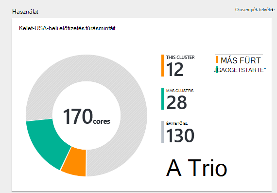
    
5. Kattintson a **Beállítások**gombra.

    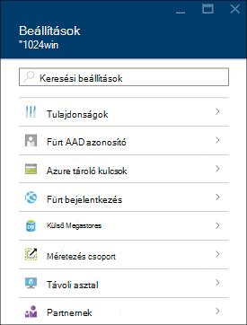

    - **Tulajdonságok**: fürt tulajdonságainak megtekintése.
    - **Fürt AAD azonosító**: 
    - **Azure tároló kulcsok**: az alapértelmezett tárterület-fiók és a kulcs megtekintése. A beállítás a tárterület-fiókot a fürt létrehozási folyamat során.
    - **Fürt bejelentkezési**: módosítsa a HTTP fürt felhasználó nevét és jelszavát.
    - **Külső Metastores**: a struktúra, és Oozie metastores megtekintése. A metastores csak beállíthatók úgy, hogy a csoport létrehozása során.
    - **Méretezés fürt**: növelése és csökkentése fürt dolgozó csomópontok számának.
    - **Távoli asztali**: engedélyezése és letiltása az access távoli asztali (RDP) és RDP felhasználónév beállítása.  A RDP felhasználó neve eltér a HTTP-felhasználó nevét kell lennie.
    - **Partner rekord**:
    
    > [AZURE.NOTE] Ez a rendelkezésre álló beállítások; általános listája nem az összes diagramtípusokat fürt jelen lesz.

6. Kattintson a **Tulajdonságok**gombra:

    A Tulajdonságok listákat a következőket:
    
    - **Hostname (állomásnév)**: fürt nevét.
    - **Fürt URL-CÍMÉT**.
    - **Állapot**: olyan megszakadt, fogadja el, ClusterStorageProvisioned, AzureVMConfiguration, HDInsightConfiguration, működési, fut, a hiba, törlése, töröl, időtúllépése, DeleteQueued, DeleteTimedout, DeleteError, PatchQueued, CertRolloverQueued, ResizeQueued, ClusterCustomization
    - **Régió**: Azure helyét. Támogatott Azure helyek listáját a **régió** legördülő lista lássanak [árak hdinsight szolgáltatásból lehetőségre](https://azure.microsoft.com/pricing/details/hdinsight/).
    - Az **adatok létre**.
    - **Operációs rendszer**: **a Windows** vagy **Linux rendszerhez**.
    - **Írja be**: Hadoop, HBase, vihar, dokumentuma. 
    - **Verzió**. Lásd: [HDInsight-verziók](hdinsight-component-versioning.md)
    - **Előfizetés**: előfizetés nevére.
    - **Előfizetés azonosítója**.
    - **Elsődleges adatforráshoz**. Az Azure Blob-tároló fiók Hadoop fájlrendszer használja az alapértelmezett érték.
    - **Réteg árak dolgozó csomópontot**.
    - **Címsor csomópont árak réteg**.

##Fürt törlése

Törlés fürt nem törli az alapértelmezett tárterület-fiók vagy a minden csatolt tárterület-fiókból. A fürt ugyanazokat a tárterület-fiókokat és a azonos metastores hozza létre.

1. Jelentkezzen be a [portálon][azure-portal].
2. A bal oldali menüben válassza az **Összes böngészése** , kattintson a **HDInsight fürt**, kattintson a csoport nevére.
3. A felső menüben kattintson a **Törlés** gombra, és kövesse az utasításokat.

Lásd még: [fürt szünet/leállítás](#pauseshut-down-clusters).

##Méretezés fürt
A méretezés szolgáltatás fürt lehetővé teszi az Azure hdinsight szolgáltatáshoz a anélkül, hogy hozza létre újból a fürt futtató fürt által használt dolgozó csomópontok számának módosítása.

>[AZURE.NOTE] Csak a HDInsight verzió 3.1.3 fürtök vagy magasabb támogatottak. Ha biztos benne, hogy a fürt verzióját, érdemes tulajdonságok lapon.  Lásd: a [listában, és a Megjelenítés fürt](#list-and-show-clusters).

A HDInsight által támogatott fürt minden típusú adat csomópontok számának módosításának hatása:

- Hadoop

    Zökkenőmentes növelésével futtató érintő bármely várakozó vagy futó feladatok nélkül Hadoop fürt dolgozó csomópontok számának. Új feladat is benyújtandó, miközben folyamatban van a műveletet. Méretezési művelet sikertelen biztonságosan kezelése, hogy a fürt mindig marad funkcionális állapotba kerül.

    Amikor a Hadoop fürtre adatok csomópontok számának csökkentésével átméretezi, egyes szolgáltatások a fürt újraindítja. Hatására minden futó és a feladatok függőben befejezésekor a méretezési művelet sikertelen lesz. Akkor is, azonban küldje el újra a feladatokat a művelet befejezése után.

- HBase

    Zökkenőmentes felvehet, és távolítsa el a HBase fürt csomópontok futása közben is. A területi kiszolgálók is automatikusan meghatározni a méretezési művelet befejezése néhány percen belül. Azonban Ön is manuálisan is egyenleg a területi kiszolgálók a headnode fürt bejelentkezés, és futtatása a következő parancsok végrehajtása egy parancssorablakot:

        >pushd %HBASE_HOME%\bin
        >hbase shell
        >balancer

    A HBase rendszerhéj használatával kapcsolatos további tudnivalókért lásd:]
- Vihar

    Zökkenőmentes felvehet, és távolítsa el a vihar fürt adatok csomópontok futása közben is. De a méretezési művelet sikeres befejezését követően a topológia visszaállás kell.

    Szakismeretekre kétféle módon lehet elvégezni:

    * Vihar webes felhasználói felület
    * Parancssori kezelőfelületről eszköz

    Olvassa el a [Apache vihar dokumentáció](http://storm.apache.org/documentation/Understanding-the-parallelism-of-a-Storm-topology.html) további információt.

    A HDInsight fürt vihar webes felhasználói felület érhető el:

    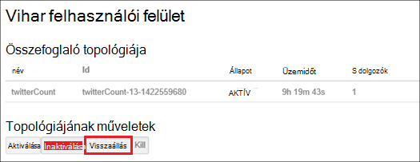

    Íme egy példa a vihar topológia visszaállás a CLI parancs használatával hogyan:

        ## Reconfigure the topology "mytopology" to use 5 worker processes,
        ## the spout "blue-spout" to use 3 executors, and
        ## the bolt "yellow-bolt" to use 10 executors

        $ storm rebalance mytopology -n 5 -e blue-spout=3 -e yellow-bolt=10

**Ha át kívánja méretezni fürt**

1. Jelentkezzen be a [portálon][azure-portal].
2. A bal oldali menüben válassza az **Összes böngészése** , kattintson a **HDInsight fürt**, kattintson a csoport nevére.
3. A felső menüben kattintson a **Beállítások** gombra, és kattintson a **Méretezés csoport**.
4. Adja meg a **számot a dolgozó csomópontok**. A csomópont fürt korlát változó Azure előfizetések között. Számlázási támogatás növelheti a korlátot is fordulhat.  A költségadatokat tükrözni fogja a módosítások csomópontok számának.

    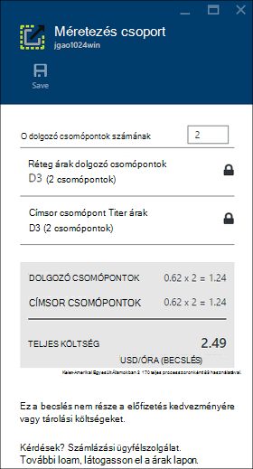

##Szünet vagy fürt leállítása

Hadoop feladatok táblázatparancsok nagy része, amelyek csak köteg feladatok alkalmanként futtatta. A legtöbb Hadoop-fürtre vonatkozóan, hogy nem használják a fürt feldolgozás nagy időszakból áll. HDInsight az adatok Azure-tárolóban lévő tárolja, törölheti a fürtre biztonságosan, ha még nem használja.
Is az előfizetést terhelő egy HDInsight fürthöz, akkor is, ha még nem használja. Mivel a fürt díjai sokszor több, mint a költségek tárolására, célszerű economic fürt törlése, ha nem használja.

Számos módon meg a program a folyamat:

- Felhasználói adatok Azure gyári. Lásd: [Azure hdinsight szolgáltatáshoz csatolt szolgáltatás](../data-factory/data-factory-compute-linked-services.md) és az [átalakítás és Azure Data Factory segítségével elemezheti](../data-factory/data-factory-data-transformation-activities.md) az igény szerinti és a önálló definiált csatolt HDInsight-szolgáltatásokhoz.
- Azure PowerShell-lel.  Lásd: az [elemzés nézetbeli késési adataival](hdinsight-analyze-flight-delay-data.md).
- Azure CLI használja. Lásd: [segítségével Azure CLI HDInsight kezelése fürt](hdinsight-administer-use-command-line.md).
- Használja a .NET-SDK hdinsight szolgáltatásból lehetőségre. Lásd: [elküldése Hadoop feladatok](hdinsight-submit-hadoop-jobs-programmatically.md).

Árak tudnivalókért olvassa el a [HDInsight árak](https://azure.microsoft.com/pricing/details/hdinsight/)című témakört. A portál fürt törléséhez lásd: a [fürt törlése](#delete-clusters)

##Módosítás fürt felhasználónév

Egy HDInsight fürthöz beállíthatja, hogy két felhasználói fiókok. A HDInsight fürt felhasználó fiók a létrehozási folyamat során létre. Létrehozhat egy a via RDP fürthöz hozzáférő RDP felhasználói fiókot is. Lásd: [engedélyezése a távoli asztal](#connect-to-hdinsight-clusters-by-using-rdp).

**A HDInsight fürt felhasználó neve és a jelszó módosítása**

1. Jelentkezzen be a [portálon][azure-portal].
2. A bal oldali menüben válassza az **Összes böngészése** , kattintson a **HDInsight fürt**, kattintson a csoport nevére.
3. A felső menüben kattintson a **Beállítások** gombra, és kattintson a **Login fürt**.
4. Ha **fürt bejelentkezési** engedélyezve van, kattintson a **Letiltás**lehetőségre, és az jelölje be a **engedélyezése** a felhasználónév és jelszó módosítása előtt.
4. Módosítsa a **Fürt bejelentkezési neve** és/vagy a **Fürt Adatbázisjelszó**, és kattintson a **Mentés**gombra.

    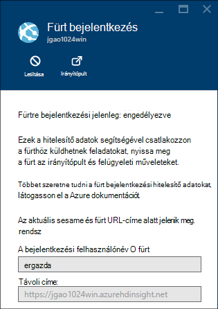

##Hozzáférés biztosítása/visszavonása

HDInsight fürt rendelkezik az alábbi HTTP webszolgáltatásokhoz (az összes az alábbi szolgáltatások vannak RESTful végpontok):

- ODBC
- JDBC
- Ambari
- Oozie
- Templeton

Az access alapértelmezés szerint az alábbi szolgáltatások vannak nyújtani. Akkor is revoke/támogatás az access az Azure portálról.

>[AZURE.NOTE] A hozzáférés megadását és visszavonása, visszaállítja, a fürt felhasználó nevét és jelszavát.

**Az access services támogatás/revoke HTTP webszolgáltatás**

1. Jelentkezzen be a [portálon][azure-portal].
2. A bal oldali menüben válassza az **Összes böngészése** , kattintson a **HDInsight fürt**, kattintson a csoport nevére.
3. A felső menüben kattintson a **Beállítások** gombra, és kattintson a **Login fürt**.
4. Ha **fürt bejelentkezési** engedélyezve van, kattintson a **Letiltás**lehetőségre, és az jelölje be a **engedélyezése** a felhasználónév és jelszó módosítása előtt.
6. A **Fürt bejelentkezési felhasználónév** és **Fürt Adatbázisjelszó**adja meg az új felhasználónév és jelszó (a kurzor) a fürt.
7. Kattintson a **MENTÉS**gombra.

    

##Keresse meg az alapértelmezett tárterület-fiók

Minden HDInsight fürt alapértelmezett tárterület-fiókja van. **A beállítások**csoportban jelenik meg az alapértelmezett tárterület-fiók és a billentyűk fürt/**Tulajdonságok**/**Azure tároló kulcsok**. Lásd: a [listában, és a Megjelenítés fürt](#list-and-show-clusters).

    
##Az erőforráscsoport megkeresése 

Az erőforrás-kezelő Azure módban minden HDInsight fürt az Azure erőforráscsoport jön létre. Az Azure erőforráscsoport, amelyhez tartozik egy fürt jelenik meg:

- A fürt lista **Erőforráscsoport** oszlopot tartalmaz.
- Fürt **alapvető** csempére.  

Lásd: a [listában, és a Megjelenítés fürt](#list-and-show-clusters).
   
##Megnyitott HDInsight lekérdezés konzolban

A HDInsight lekérdezés konzol tartalmazza a következő funkciók:

- **Gyűjteményben az első lépések**: a gyűjtemény használatához olvassa el a [További Hadoop az Azure hdinsight szolgáltatáshoz első lépések gyűjtemény használatával](hdinsight-learn-hadoop-use-sample-gallery.md).
- **A struktúra szerkesztő**: A grafikus webes felület struktúra feladatok elküldéséhez.  [A lekérdezés konzolon futtatása struktúra lekérdezések](hdinsight-hadoop-use-hive-query-console.md)témakörben talál.

    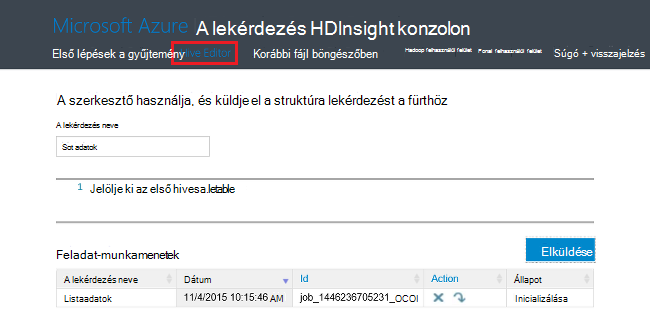

- **Korábbi**: Monitor Hadoop feladatokat.  

    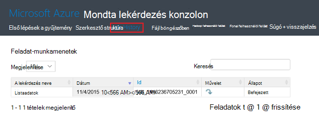

    Kattintson a feladat tulajdonságai, **Feladat lekérdezés**, beleértve a részletek megjelenítése **a lekérdezés neve** és ** feladat kimeneti. Is letöltheti a lekérdezés és a kimeneti is munkaállomástól.

- **Fájl böngészőben**: keresse meg az alapértelmezett tárterület-fiók és a csatolt tároló fiókokat.

    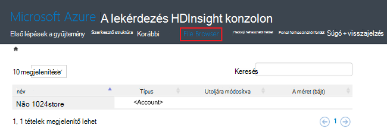

    Kattintson a képernyőképet a **<Account>** típus jelzi, hogy az elemet egy Azure tároló fiók.  Kattintson a fiók nevére kattintva keresse meg a fájlokat.
    
- A **Hadoop felhasználói felület**.

    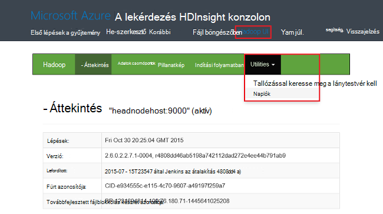
    
    A **Hadoop felhasználói felület*, tallózással keresse meg a fájlt, és jelölje be a naplókat. 

- A **felhasználói felület fonal**.

    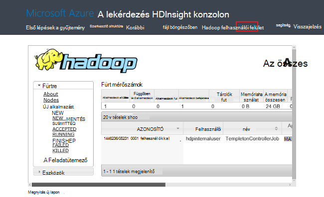

##Struktúra lekérdezések futtatása

Struktúra feladatok adódott a portálról, kattintson a lekérdezés HDInsight konzolban **Szerkesztő struktúra** . Lásd: a [Nyitott HDInsight-lekérdezés konzolt](#open-hdinsight-query-console).

##Képernyő-feladatok

Lync-feladatok a portálról, kattintson a HDInsight lekérdezés konzolban **Korábbi** . Lásd: a [Nyitott HDInsight-lekérdezés konzolt](#open-hdinsight-query-console).

##Fájlok keresése

Tallózással keresse meg az alapértelmezett tárterület-fiók és a csatolt tároló fiókok tárolt fájlok, kattintson a lekérdezés HDInsight konzolban **Fájl böngészőben** . Lásd: a [Nyitott HDInsight-lekérdezés konzolt](#open-hdinsight-query-console).

A **Hadoop felhasználói felület** a **Keresse meg a fájlrendszerben** segédprogram a HDInsight konzolban is használhatja.  Lásd: a [Nyitott HDInsight-lekérdezés konzolt](#open-hdinsight-query-console).

##Használat figyelése fürthöz

A HDInsight fürt lap __használatát__ szakasza elérhető magmintákat számával kapcsolatos információk való használatának HDInsight, valamint a fürt, és hogyan azokat a fürt csomópontjainak kiosztott vannak kiosztva magmintákat számát az előfizetéshez jeleníti meg. Lásd: a [listában, és a Megjelenítés fürt](#list-and-show-clusters).

> [AZURE.IMPORTANT] A HDInsight fürt által biztosított szolgáltatások követésére Ambari webhelyén vagy a Ambari REST API kell használnia. Ambari használatával kapcsolatos további tudnivalókért olvassa el a [HDInsight kezelése fürt Ambari használatával](hdinsight-hadoop-manage-ambari.md) című témakört.

##Nyissa meg a Hadoop felhasználói felület

Figyelheti a fürt, keresse meg a fájlrendszerben, és jelölje be a naplókat, kattintson a lekérdezés HDInsight konzolban **Hadoop felhasználói felület** . Lásd: a [Nyitott HDInsight-lekérdezés konzolt](#open-hdinsight-query-console).

##Nyissa meg a felhasználói felület fonal

Fonal felhasználói felület használatához kattintson a lekérdezés HDInsight konzolban **Fonal felhasználói felület** . Lásd: a [Nyitott HDInsight-lekérdezés konzolt](#open-hdinsight-query-console).

##Csatlakozás fürt RDP segítségével

A fürt a létrehozása a megadott hitelesítő adatait a hozzáférést biztosít a fürt szolgáltatást, de nem a fürthöz távoli asztali keresztül. Távoli asztali access bekapcsolhatja, ha Ön kiépítése fürt vagy fürt már kiépítve. A létrehozási engedélyezése a távoli asztali – áttekintés című témakör nyújt tájékoztatást [létrehozása HDInsight fürt](hdinsight-provision-clusters.md).

**Ahhoz, hogy a távoli asztal**

1. Jelentkezzen be a [portálon][azure-portal].
2. A bal oldali menüben válassza az **Összes böngészése** , kattintson a **HDInsight fürt**, kattintson a csoport nevére.
3. A felső menüben kattintson a **Beállítások** gombra, és válassza a **Távoli asztal**.
4. Írja be az **Lejár**, **Távoli asztali felhasználónév** és **Távoli asztali jelszót**, és kattintson a **engedélyezése**gombra.

    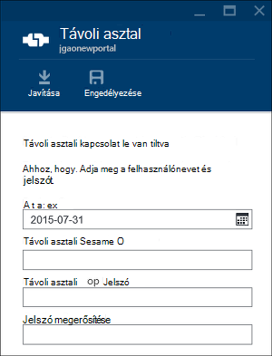

    Az alapértelmezett értékének lejár a heti.
> [AZURE.NOTE] A HDInsight .NET SDK engedélyezése a távoli asztali fürtre is használhatja. Használja a **EnableRdp** módszert a HDInsight ügyfél-objektum, a következő módon: **ügyfél. EnableRdp (clustername, hely, a "rdpuser", "rdppassword" DateTime.Now.AddDays(6))**. Hasonlóképpen a fürt távoli asztali letiltásához használható **ügyfél. DisableRdp (clustername, hely)**. Ezeket a módszereket a további tudnivalókért lásd [HDInsight .NET SDK csomagjában talál](http://go.microsoft.com/fwlink/?LinkId=529017). Ez a csak a Windows rendszeren futó HDInsight fürt alkalmazható.

**Csatlakozás a fürtre RDP használatával**

1. Jelentkezzen be a [portálon][azure-portal].
2. A bal oldali menüben válassza az **Összes böngészése** , kattintson a **HDInsight fürt**, kattintson a csoport nevére.
3. A felső menüben kattintson a **Beállítások** gombra, és válassza a **Távoli asztal**.
4. Kattintson a **Csatlakozás** gombra, és kövesse a képernyőn megjelenő utasításokat. Ha a Csatlakozás letiltása, engedélyeznie kell azt először. Győződjön meg arról, hogy a távoli asztali felhasználói felhasználónév és jelszó használatával.  Nem használhatja a fürt felhasználó hitelesítő adatait.

##Nyissa meg a Hadoop parancssor

Csatlakozás távoli asztali használatával a fürt, és a Hadoop parancsot használja, kell először engedélyezte a távoli asztali hozzáférést a fürthöz az előző szakaszban leírtak szerint.

**A Hadoop parancssor megnyitása**

1. Csatlakozás a fürt távoli asztali változatában.
8. Kattintson duplán a **Hadoop parancssori**az asztalról.

    ![HDI. HadoopCommandLine][image-hadoopcommandline]

    Hadoop-parancsokkal kapcsolatos további tudnivalókért lásd: [Hadoop-parancsok hivatkozást](http://hadoop.apache.org/docs/current/hadoop-project-dist/hadoop-common/CommandsManual.html).

Az előző képernyőképe a mappa nevét a beágyazott Hadoop verziószám tartalmaz. Módosíthatja, hogy a verziószám a verziója telepítve van a fürt a Hadoop összetevő alapján. Ha nézni szeretné azokat a mappákat Hadoop környezeti változók is használhatja. Példa:

    cd %hadoop_home%
    cd %hive_home%
    cd %hbase_home%
    cd %pig_home%
    cd %sqoop_home%
    cd %hcatalog_home%
    
##Következő lépések
Ebben a cikkben egy HDInsight fürthöz létrehozása a portál használatával, és hogy miként nyithatja meg a Hadoop parancssori eszköz megtanulta. További tudnivalókért lásd: az alábbi cikkekben:

* [Azure PowerShell használatával HDInsight felügyelete](hdinsight-administer-use-powershell.md)
* [Felügyelete használatával Azure CLI hdinsight szolgáltatáshoz](hdinsight-administer-use-command-line.md)
* [HDInsight fürt létrehozása](hdinsight-provision-clusters.md)
* [Hadoop feladatok programozás útján elküldése](hdinsight-submit-hadoop-jobs-programmatically.md)
* [Első lépések az Azure hdinsight szolgáltatáshoz](hdinsight-hadoop-linux-tutorial-get-started.md)
* [Melyik verzióját Hadoop Azure hdinsight szolgáltatáshoz tartalmaz?](hdinsight-component-versioning.md)

[azure-portal]: https://portal.azure.com
[image-hadoopcommandline]: ./media/hdinsight-administer-use-management-portal/hdinsight-hadoop-command-line.png "Hadoop parancssor"
