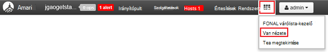

<properties
    pageTitle="Kezelése a Hadoop Linux-alapú fürt a portálon Azure HDInsight |} Microsoft Azure"
    description="Megtudhatja, hogy miként hozhat létre és kezelhet Linux-alapú HDInsight fürt az Azure portálon."
    services="hdinsight"
    documentationCenter=""
    authors="mumian"
    manager="jhubbard"
    editor="cgronlun"
    tags="azure-portal"/>

<tags
    ms.service="hdinsight"
    ms.workload="big-data"
    ms.tgt_pltfrm="na"
    ms.devlang="na"
    ms.topic="article"
    ms.date="08/10/2016"
    ms.author="jgao"/>

#A HDInsight Hadoop fürt kezelése az Azure portál használatával

[AZURE.INCLUDE [selector](../../includes/hdinsight-portal-management-selector.md)]

Az [Azure portál][azure-portal], kezelheti az Azure hdinsight szolgáltatáshoz Linux-alapú fürt. További információkat az egyéb eszközök segítségével HDInsight Hadoop fürt tabulátorválasztó használata 

**Előfeltételek**

Ez a cikk megkezdése előtt a következőket kell rendelkeznie:

- **Az Azure-előfizetés**. Lásd: [Ismerkedés az Azure ingyenes próbaverziót](https://azure.microsoft.com/documentation/videos/get-azure-free-trial-for-testing-hadoop-in-hdinsight/).

##Nyissa meg a portálon

1. Jelentkezzen be a [https://portal.azure.com](https://portal.azure.com).
2. Miután megnyitotta a portálon, a következőkre van lehetősége:

    - Kattintson az **Új** elemre a bal oldali menüben egy új csoport létrehozása:
    
        
    - Kattintson a **HDInsight fürt** parancsot a bal oldali listában a meglévő fürt
    
        

        Ha **HDInsight** nem jelenik meg, a bal oldali menüben, kattintson a **Tallózás gombra**, és válassza a **HDInsight fürt**.

        

##Fürt létrehozása

[AZURE.INCLUDE [delete-cluster-warning](../../includes/hdinsight-delete-cluster-warning.md)]

Egy széles Hadoop tartomány összetevők HDInsight működik. A listáját, amely ellenőrzi, és támogatott összetevő című [Hadoop melyik verziója van Azure hdinsight szolgáltatáshoz](hdinsight-component-versioning.md). Az általános fürt létrehozási információt című témakörben talál [létrehozása Hadoop fürt a hdinsight szolgáltatásból lehetőségre](hdinsight-hadoop-provision-linux-clusters.md). 

##Lista és a Megjelenítés fürt

1. Jelentkezzen be a [https://portal.azure.com](https://portal.azure.com).
2. Kattintson a **HDInsight fürt** parancsot a bal oldali listában a meglévő fürt.
3. Kattintson a csoport nevére. Ha a fürt lista hosszú, a lap tetején lévő szűrő is használhatja.
4. Kattintson duplán a listában, és a részletek megjelenítése fürt.

    A **menü- és essentials**:

    
    
    - **Az összes**és **Beállítások** : jeleníti meg a **Beállítások** lap a fürt, amely lehetővé teszi a fürt részletes konfigurációs adatok eléréséhez.
    - **Irányítópult**, **Fürt irányítópult** és ** URL-címe: ezek a fürt irányítópult, amely Ambari webes fürt Linux-alapú elérésének összes módjai.
    - **Biztonságos rendszerhéj**: jeleníti meg az utasításokat követve csatlakoztassa a fürthöz biztonságos rendszerhéj (SSH) kapcsolaton keresztül.
    - **Méretezés fürt**: lehetővé teszi, hogy a fürt dolgozó csomópontok számának módosítása.
    - **Törlése**: törli a fürt.
    - **Quickstart útmutató ()**: jelenít meg információt, amely segít a HDInsight használatának megkezdéséhez.
    - **Felhasználók ()**: lehetővé teszi, hogy az engedélyeket az _adatkezelési portál_ a fürt más felhasználók számára az Azure-előfizetésben.
    
        > [AZURE.IMPORTANT] Ez _csak_ hatással van a fürt az Azure-portálon szükséges engedélyek és hozzáférés, és ki csatlakozhat, vagy a HDInsight fürt feladatok kezdeményezése nem befolyásolja.
    - **Címkék ()**: címkék csoportban adhatja meg egy egyéni besorolás a felhőalapú szolgáltatások meghatározása kulcs/érték párokká. Például, előfordulhat, hogy hozzon létre egy __Projekt__nevű kulcsot, és kattintson egy adott projekttel kapcsolatos szolgáltatások használata a közös értéket.
    - **Nézetek Ambari**: Ambari webes mutató hivatkozásokat.
    
    > [AZURE.IMPORTANT] A HDInsight fürt által biztosított szolgáltatások kezelése, Ambari webhelyén vagy a Ambari REST API kell használnia. Ambari használatával kapcsolatos további tudnivalókért olvassa el a [HDInsight kezelése fürt Ambari használatával](hdinsight-hadoop-manage-ambari.md)című témakört.

    **Szintaxis**:
    
    
    
5. Kattintson a **Beállítások**gombra.

    

    - **Naplókat**:
    - **Rövid útmutató**: jelenít meg információt, amely segít a HDInsight használatának megkezdéséhez.
    - **Méretezés fürt**: növelése és csökkentése fürt dolgozó csomópontok számának.
    - **Biztonságos rendszerhéj**: jeleníti meg az utasításokat követve csatlakoztassa a fürthöz biztonságos rendszerhéj (SSH) kapcsolaton keresztül.
    - **HDInsight Partner**: az aktuális HDInsight-partnerek hozzáadása és eltávolítása.
    - **Külső Metastores**: a struktúra, és Oozie metastores megtekintése. A metastores csak beállíthatók úgy, hogy a csoport létrehozása során.
    - **Parancsfájl-műveletek**: a fürt parancsfájlok Bash futtatni.
    - **Tulajdonságok**: fürt tulajdonságainak megtekintése.
    - **Azure tároló kulcsok**: az alapértelmezett tárterület-fiók és a kulcs megtekintése. A beállítás a tárterület-fiókot a fürt létrehozási folyamat során.
    - **Fürt AAD azonosító**: 
    - **Felhasználók**: lehetővé teszi, hogy az engedélyeket az _adatkezelési portál_ a fürt más felhasználók számára az Azure-előfizetésben.
    - **Címkék**: címkék csoportban adhatja meg egy egyéni besorolás a felhőalapú szolgáltatások meghatározása kulcs/érték párokká. Például, előfordulhat, hogy hozzon létre egy __Projekt__nevű kulcsot, és kattintson egy adott projekttel kapcsolatos szolgáltatások használata a közös értéket.
    
    > [AZURE.NOTE] Ez a rendelkezésre álló beállítások; általános listája nem az összes diagramtípusokat fürt jelen lesz.

6. Kattintson a **Tulajdonságok**gombra:

    Az tulajdonságokat a következők:
    
    - **Hostname (állomásnév)**: fürt nevét.
    - **Fürt URL-CÍMÉT**.
    - **Állapot**: olyan megszakadt, fogadja el, ClusterStorageProvisioned, AzureVMConfiguration, HDInsightConfiguration, működési, fut, a hiba, törlése, töröl, időtúllépése, DeleteQueued, DeleteTimedout, DeleteError, PatchQueued, CertRolloverQueued, ResizeQueued, ClusterCustomization
    - **Régió**: Azure helyét. Támogatott Azure helyek listáját a **régió** legördülő lista lássanak [árak hdinsight szolgáltatásból lehetőségre](https://azure.microsoft.com/pricing/details/hdinsight/).
    - Az **adatok létre**.
    - **Operációs rendszer**: **a Windows** vagy **Linux rendszerhez**.
    - **Írja be**: Hadoop, HBase, vihar, dokumentuma. 
    - **Verzió**. Lásd: [HDInsight-verziók](hdinsight-component-versioning.md)
    - **Előfizetés**: előfizetés nevére.
    - **Előfizetés azonosítója**.
    - **Alapértelmezett adatforrás**: az alapértelmezett fürt fájlrendszer.
    - **Réteg árak dolgozó csomópontot**.
    - **Címsor csomópont árak réteg**.

##Fürt törlése

Törlés fürt nem törli az alapértelmezett tárterület-fiók vagy a minden csatolt tárterület-fiókból. A fürt ugyanazokat a tárterület-fiókokat és a azonos metastores hozza létre. Új alapértelmezett Blob-tároló használatára, amikor hozza létre a fürt ajánlott.

1. Jelentkezzen be a [portálon][azure-portal].
2. A bal oldali menüben válassza az **Összes böngészése** , kattintson a **HDInsight fürt**, kattintson a csoport nevére.
3. A felső menüben kattintson a **Törlés** gombra, és kövesse az utasításokat.

Lásd még: [fürt szünet/leállítás](#pauseshut-down-clusters).

##Méretezés fürt
A méretezés szolgáltatás fürt lehetővé teszi az Azure hdinsight szolgáltatáshoz a anélkül, hogy hozza létre újból a fürt futtató fürt által használt dolgozó csomópontok számának módosítása.

>[AZURE.NOTE] Csak a HDInsight verzió 3.1.3 fürtök vagy magasabb támogatottak. Ha biztos benne, hogy a fürt verzióját, érdemes tulajdonságok lapon.  Lásd: a [listában, és a Megjelenítés fürt](#list-and-show-clusters).

A HDInsight által támogatott fürt minden típusú adat csomópontok számának módosításának hatása:

- Hadoop

    Zökkenőmentes növelésével futtató érintő bármely várakozó vagy futó feladatok nélkül Hadoop fürt dolgozó csomópontok számának. Új feladat is benyújtandó, miközben folyamatban van a műveletet. Méretezési művelet sikertelen biztonságosan kezelése, hogy a fürt mindig marad funkcionális állapotba kerül.

    Amikor a Hadoop fürtre adatok csomópontok számának csökkentésével átméretezi, egyes szolgáltatások a fürt újraindítja. Hatására minden futó és a feladatok függőben befejezésekor a méretezési művelet sikertelen lesz. Akkor is, azonban küldje el újra a feladatokat a művelet befejezése után.

- HBase

    Zökkenőmentes felvehet, és távolítsa el a HBase fürt csomópontok futása közben is. A területi kiszolgálók is automatikusan meghatározni a méretezési művelet befejezése néhány percen belül. Azonban Ön is manuálisan is egyenleg a területi kiszolgálók a headnode fürt bejelentkezés, és futtatása a következő parancsok végrehajtása egy parancssorablakot:

        >pushd %HBASE_HOME%\bin
        >hbase shell
        >balancer

    A HBase rendszerhéj használatával kapcsolatos további tudnivalókért lásd:]
- Vihar

    Zökkenőmentes felvehet, és távolítsa el a vihar fürt adatok csomópontok futása közben is. De a méretezési művelet sikeres befejezését követően a topológia visszaállás kell.

    Szakismeretekre kétféle módon lehet elvégezni:

    * Vihar webes felhasználói felület
    * Parancssori kezelőfelületről eszköz

    Olvassa el a [Apache vihar dokumentáció](http://storm.apache.org/documentation/Understanding-the-parallelism-of-a-Storm-topology.html) további információt.

    A HDInsight fürt vihar webes felhasználói felület érhető el:

    

    Íme egy példa a vihar topológia visszaállás a CLI parancs használatával hogyan:

        ## Reconfigure the topology "mytopology" to use 5 worker processes,
        ## the spout "blue-spout" to use 3 executors, and
        ## the bolt "yellow-bolt" to use 10 executors

        $ storm rebalance mytopology -n 5 -e blue-spout=3 -e yellow-bolt=10

**Ha át kívánja méretezni fürt**

1. Jelentkezzen be a [portálon][azure-portal].
2. A bal oldali menüben válassza az **Összes böngészése** , kattintson a **HDInsight fürt**, kattintson a csoport nevére.
3. A felső menüben kattintson a **Beállítások** gombra, és kattintson a **Méretezés csoport**.
4. Adja meg a **számot a dolgozó csomópontok**. A csomópont fürt korlát változó Azure előfizetések között. Számlázási támogatás növelheti a korlátot is fordulhat.  A költségadatokat tükrözni fogja a módosítások csomópontok számának.

    

##Szünet vagy fürt leállítása

Hadoop feladatok táblázatparancsok nagy része, amelyek csak köteg feladatok alkalmanként futtatta. A legtöbb Hadoop-fürtre vonatkozóan, hogy nem használják a fürt feldolgozás nagy időszakból áll. HDInsight az adatok Azure-tárolóban lévő tárolja, törölheti a fürtre biztonságosan, ha még nem használja.
Is az előfizetést terhelő egy HDInsight fürthöz, akkor is, ha még nem használja. Mivel a fürt díjai sokszor több, mint a költségek tárolására, célszerű economic fürt törlése, ha nem használja.

Számos módon meg a program a folyamat:

- Felhasználói adatok Azure gyári. Lásd: a [Létrehozás igény szerinti Linux-alapú Hadoop fürtök HDInsight Azure Factory-adatok használata az](hdinsight-hadoop-create-linux-clusters-adf.md) igény szerinti HDInsight kapcsolt szolgáltatások létrehozásának.
- Azure PowerShell-lel.  Lásd: az [elemzés nézetbeli késési adataival](hdinsight-analyze-flight-delay-data.md).
- Azure CLI használja. Lásd: [segítségével Azure CLI HDInsight kezelése fürt](hdinsight-administer-use-command-line.md).
- Használja a .NET-SDK hdinsight szolgáltatásból lehetőségre. Lásd: [elküldése Hadoop feladatok](hdinsight-submit-hadoop-jobs-programmatically.md).

Árak tudnivalókért olvassa el a [HDInsight árak](https://azure.microsoft.com/pricing/details/hdinsight/)című témakört. A portál fürt törléséhez lásd: a [fürt törlése](#delete-clusters)

##Jelszó megváltoztatása

Egy HDInsight fürthöz beállíthatja, hogy két felhasználói fiókok. A HDInsight fürt felhasználói fiókhoz (más néven HTTP felhasználói fiók) és a létrehozási folyamat során létre SSH felhasználói fiókot is. Választhat a Ambari webes felhasználói Felületről a fürt felhasználó fiók felhasználónevét és a jelszavát, és a parancsfájl-műveletek SSH felhasználói fiók megváltoztatása

###A fürt felhasználó jelszavának módosítása

A fürt felhasználó jelszavának módosítása webes Ambari felületének is használhatja. Jelentkezzen be a Ambari, a meglévő fürt felhasználónév és jelszó kell használnia.

> [AZURE.NOTE] Ha módosítja a fürt felhasználó (rendszergazda) jelszavát, a műveletek futtatta szemben a fürt meghiúsító parancsfájl jelenhet meg. Ha bármely állandó parancsfájl-műveletek a cél dolgozó csomópontok, ezek meghiúsulhat, ha a csomópontok a fürthöz keresztül méretezze át a tevékenységek felvétele. Parancsfájl-műveletek kapcsolatos további tudnivalókért olvassa el a [HDInsight testreszabása fürt parancsfájl-műveletek használata](hdinsight-hadoop-customize-cluster-linux.md)című témakört.

1. Jelentkezzen be a Ambari webes felület a HDInsight fürt felhasználó hitelesítő adataival. Az alapértelmezett felhasználónév **felügyeleti**. Az URL-cím **https://&lt;HDInsight fürt neve > azurehdinsight.net**.
2. A felső menüben kattintson a **rendszergazda** , és kattintson a "Kezelése Ambari". 
3. A bal oldali menüben kattintson a **felhasználók**elemre.
4. Kattintson a **rendszergazda**.
5. Kattintson a **jelszó módosítása**gombra.

Ambari majd módosítja a fürt csomópontjait a jelszót.

###A SSH felhasználó jelszavának módosítása

1. A következő szövegszerkesztővel, mentse __changepassword.sh__nevű fájlt.

    > [AZURE.IMPORTANT] Egy, a sor-végződés LF használó szerkesztő kell használnia. Ha a szerkesztő CRLF használ, majd a parancsfájl nem fog működni.
    
        #! /bin/bash
        USER=$1
        PASS=$2

        usermod --password $(echo $PASS | openssl passwd -1 -stdin) $USER

2. Töltse fel a fájlt tároló hdinsight HTTP vagy HTTPS cím használatával is elérhető helyre. Például nyilvános fájl tárolni, például a onedrive-on vagy az Azure Blob-tároló. A URI (HTTP vagy HTTPS cím,) erre akkor van szükség a következő lépésben a fájl mentése

3. Az Azure portálról válassza ki a HDInsight csoportját, és válassza __az összes beállításai__. Jelölje ki a __Beállítások__ lap __Script műveletek__.

4. A __Parancsfájl-műveletek__ lap jelölje ki __Az új nyújt__. Amikor megjelenik a __Küldés parancsfájl művelet__ lap, adja meg az alábbi információkat.

  	| A mező | Érték |
  	| ----- | ----- |
  	| név | Ssh jelszó módosítása |
  	| Parancsfájl URI bash | A changepassword.sh fájlt az URI |
  	| A csomópontok (vezetője, dolgozó, Nimbus, felügyelő, Zookeeper stb.) | ✓ felsorolt összes csomópont típusnál |
  	| Paraméterek | Írja be a SSH felhasználó nevét, majd az új jelszót. Egyetlen helyen, a felhasználónév és jelszó között kell lennie.
  	| A probléma továbbra is fennáll a parancsprogram művelet... | Ezt a mezőt hagyja bejelölve.

5. Jelölje ki a __létrehozása__ a parancsfájl alkalmazásához. Miután befejezte a parancsfájlt, lesz csatlakozzon a fürthöz SSH használata az új jelszót.

##Hozzáférés biztosítása/visszavonása

HDInsight fürt rendelkezik az alábbi HTTP webszolgáltatásokhoz (az összes az alábbi szolgáltatások vannak RESTful végpontok):

- ODBC
- JDBC
- Ambari
- Oozie
- Templeton

Az access alapértelmezés szerint az alábbi szolgáltatások vannak nyújtani. Akkor is revoke/támogatás [Azure CLI](hdinsight-administer-use-command-line.md#enabledisable-http-access-for-a-cluster) és [Azure PowerShell](hdinsight-administer-use-powershell.md#grantrevoke-access)használata az access.

##Keresse meg az előfizetés azonosítója

**Az Azure előfizetés lehetővé tevő dokumentumazonosítók kereséséhez**

1. Jelentkezzen be a [portálon][azure-portal].
2. A bal oldali menüben válassza az **Összes böngészése** elemre, és válassza az **előfizetések**. Egyes előfizetések van nevét és azonosítóval.

Minden fürt Azure-előfizetésbe területhez tartozik. Az előfizetés azonosítója jelenik meg a fürt **alapvető** csempére. Lásd: a [listában, és a Megjelenítés fürt](#list-and-show-clusters).

##Az erőforráscsoport megkeresése 

ARM üzemmódban minden HDInsight fürt az Azure erőforráscsoport jön létre. Az Azure erőforráscsoport, amelyhez tartozik egy fürt jelenik meg:

- A fürt lista **Erőforráscsoport** oszlopot tartalmaz.
- Fürt **alapvető** csempére.  

Lásd: a [listában, és a Megjelenítés fürt](#list-and-show-clusters).

##Keresse meg az alapértelmezett tárterület-fiók

Minden HDInsight fürt alapértelmezett tárterület-fiókja van. **A beállítások**csoportban jelenik meg az alapértelmezett tárterület-fiók és a billentyűk fürt/**Tulajdonságok**/**Azure tároló kulcsok**. Lásd: a [listában, és a Megjelenítés fürt](#list-and-show-clusters).

##Struktúra lekérdezések futtatása

Közvetlenül az Azure portálról struktúra feladat nem futtathatók, de a struktúra nézet Ambari webes felületének is használhatja.

**Ambari struktúra nézet struktúra lekérdezések futtatása**

1. Jelentkezzen be a Ambari webes felület a HDInsight fürt felhasználó hitelesítő adataival. Defaut felhasználónév **felügyeleti**. Az URL-cím **https://&lt;HDInsight fürt neve > azurehdinsight.net**.
2. Nyissa meg a struktúra megtekintése, az alábbi képernyőképen látható módon:  

    
3. A felső menüben kattintson a **lekérdezés** gombra.
4. Adja meg a struktúra lekérdezést a **Lekérdezésszerkesztőben**, és kattintson a **végrehajtás**.

##Képernyő-feladatok

Lásd: [kezelése HDInsight fürt Ambari webes a felhasználói felület használatával](hdinsight-hadoop-manage-ambari.md#monitoring).

##Fájlok keresése

Az Azure portálon használja, az alapértelmezett tároló tartalmának böngészése.

1. Jelentkezzen be a [https://portal.azure.com](https://portal.azure.com).
2. Kattintson a **HDInsight fürt** parancsot a bal oldali listában a meglévő fürt.
3. Kattintson a csoport nevére. Ha a fürt lista hosszú, a lap tetején lévő szűrő is használhatja.
4. Kattintson a **Beállítások**gombra.
5. Kattintson a **Beállítások** lap, **Azure tároló kulcsok**.
6. Kattintson az alapértelmezett tároló fiók nevére.
7. Kattintson a **BLOB** csempére.
8. Kattintson az alapértelmezett tároló nevére.

##Használat figyelése fürthöz

A HDInsight fürt lap __használatát__ szakasza elérhető magmintákat számával kapcsolatos információk való használatának HDInsight, valamint a fürt, és hogyan azokat a fürt csomópontjainak kiosztott vannak kiosztva magmintákat számát az előfizetéshez jeleníti meg. Lásd: a [listában, és a Megjelenítés fürt](#list-and-show-clusters).

> [AZURE.IMPORTANT] A HDInsight fürt által biztosított szolgáltatások követésére Ambari webhelyén vagy a Ambari REST API kell használnia. Ambari használatával kapcsolatos további tudnivalókért olvassa el a [HDInsight kezelése fürt Ambari használatával](hdinsight-hadoop-manage-ambari.md) című témakört.

##Csatlakozás fürthöz

Ismerje meg [a Hadoop HDInsight SSH és a struktúra](hdinsight-hadoop-use-hive-ssh.md#ssh).
    
##Következő lépések
Ebben a cikkben egy HDInsight fürthöz létrehozása a portál használatával, és hogy miként nyithatja meg a Hadoop parancssori eszköz megtanulta. További tudnivalókért lásd: az alábbi cikkekben:

* [Azure PowerShell használatával HDInsight felügyelete](hdinsight-administer-use-powershell.md)
* [Felügyelete használatával Azure CLI hdinsight szolgáltatáshoz](hdinsight-administer-use-command-line.md)
* [HDInsight fürt létrehozása](hdinsight-provision-clusters.md)
* [A HDInsight struktúra](hdinsight-use-hive.md)
* [Malac HDInsight használata](hdinsight-use-pig.md)
* [HDInsight Sqoop használata](hdinsight-use-sqoop.md)
* [Első lépések az Azure hdinsight szolgáltatáshoz](hdinsight-hadoop-linux-tutorial-get-started.md)
* [Melyik verzióját Hadoop Azure hdinsight szolgáltatáshoz tartalmaz?](hdinsight-component-versioning.md)

[azure-portal]: https://portal.azure.com
[image-hadoopcommandline]: ./media/hdinsight-administer-use-portal-linux/hdinsight-hadoop-command-line.png "Hadoop parancssor"
