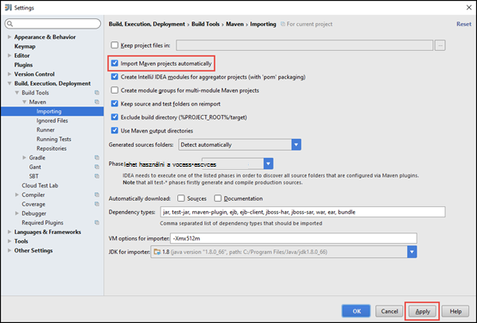

<properties
    pageTitle="Különálló scala alkalmazások futtatásához a HDInsight külső fürt létrehozása |} Microsoft Azure"
    description="Megtudhatja, hogy miként hozhat létre külső alkalmazás futtatásához a HDInsight külső fürt önálló."
    services="hdinsight"
    documentationCenter=""
    authors="nitinme"
    manager="jhubbard"
    editor="cgronlun"
    tags="azure-portal"/>

<tags
    ms.service="hdinsight"
    ms.workload="big-data"
    ms.tgt_pltfrm="na"
    ms.devlang="na"
    ms.topic="article"
    ms.date="10/28/2016"
    ms.author="nitinme"/>

# Hozzon létre egy önálló Scala alkalmazás futtatásához a HDInsight Linux Apache külső fürthöz

Ebben a cikkben részletes útmutatást Scala nyelven íródott önálló külső-alkalmazások fejlesztésével maven tesztelése használata IntelliJ arról. A cikk Apache maven tesztelése az összeállítás rendszert használja, és elindítja a egy meglévő maven tesztelése archetype IntelliJ arról által biztosított Scala.  A magas szintű egy Scala létrehozása IntelliJ arról az alkalmazás magában foglalja a következő lépéseket:

* Az összeállítás rendszer maven tesztelése használja.
* Frissítés a Project Object Model (POM) fájl külső modul függőségek feloldásához.
* Írja be az alkalmazás Scala.
* A HDInsight külső fürt küldött üveg fájl készítése.
* Futtassa az alkalmazást a külső fürthöz Livius használatával.

>[AZURE.NOTE] HDInsight is tartalmaz egy IntelliJ arról beépülő modul eszköz létrehozása és elküldése az alkalmazások Linux HDInsight külső fürthöz folyamata megkönnyítése érdekében. További tudnivalókért lásd: [Használata HDInsight eszközök beépülő modul hozhat létre, és a külső kérelmeiket IntelliJ arról](hdinsight-apache-spark-intellij-tool-plugin.md).

**Előfeltételek**

* Egy Azure-előfizetést. Lásd: [Ismerkedés az Azure ingyenes próbaverziót](https://azure.microsoft.com/documentation/videos/get-azure-free-trial-for-testing-hadoop-in-hdinsight/).
* Egy HDInsight Linux Apache külső fürthöz. Című cikkben olvashat [létrehozása Apache külső fürt az Azure hdinsight szolgáltatásból lehetőségre](hdinsight-apache-spark-jupyter-spark-sql.md).
* Az Oracle Java fejlesztési kit. Az [alábbi](http://www.oracle.com/technetwork/java/javase/downloads/jdk8-downloads-2133151.html)telepítheti.
* Egy Java IDE. Ez a cikk IntelliJ arról 15.0.1 használja. Az [alábbi](https://www.jetbrains.com/idea/download/)telepítheti.

## IntelliJ arról Scala beépülő modul telepítése

IntelliJ arról telepítési művelet nem kéri a Scala beépülő modul engedélyezése, ha IntelliJ arról indítsa el, és hajtsa végre az alábbi lépéseket a beépülő modul telepítése:

1. Indítsa el a IntelliJ arról, és az üdvözlőképernyő kattintson a **Konfigurálás** gombra, és kattintson a **bővítmények**.

    

2. A következő képernyőn kattintson a bal alsó sarkában **bővítmény telepítése JetBrains** . A megnyíló **JetBrains bővítmények Tallózás** párbeszédpanelen Scala kereshet, és kattintson a **telepítés**.

    

3. A beépülő modul sikeresen telepítését követően kattintson a **IntelliJ arról indítsa újra a gombra** , és indítsa újra az IDE.

## Különálló Scala projekt létrehozása

1. Indítsa el a IntelliJ arról, és hozzon létre egy új projektet. Az új projekt párbeszédpanelen az alábbi lehetőségek lehetővé tevő, és kattintson a **Tovább gombra**.

    

    * Jelölje be a projekt típusa **maven tesztelése** .
    * Adja meg a **Projekt SDK csomagjában talál**. Kattintson az új gombra, és keresse meg a Java telepítési könyvtár általában `C:\Program Files\Java\jdk1.8.0_66`.
    * Válassza a **Létrehozás fájlból archetype** lehetőséget.
    * A archetypes listából válassza ki a **org.scala tools.archetypes:scala-archetype-egyszerű**. Ez a megfelelő címtár tagoláshoz, és töltse le a szükséges alapértelmezett függőségeket Scala program írni.

2. Megfelelő értékek a **Csoportazonosító**, **ArtifactId**és **verziója**szükséges. Kattintson a **Tovább**gombra.

3. A következő párbeszédpanel, amelyen megadhat egy maven tesztelése otthoni könyvtár és a más felhasználói beállításokat, fogadja el az alapértelmezett beállításokat, és kattintson a **Tovább**gombra.

4. Utolsó párbeszédpanelen adja meg a projekt nevét és helyét, és kattintson a **Befejezés gombra**.

5. Törölje a **src\test\scala\com\microsoft\spark\example**a **MySpec.Scala** fájlt. Nem kell ezzel az alkalmazáshoz.

6. Ha szükséges, nevezze át az alapértelmezett forrás- és a fájlokat. A bal oldali munkaablakban a IntelliJ arról nyissa meg azt a **src\main\scala\com.microsoft.spark.example**. Kattintson a jobb gombbal a **App.scala**, kattintson a **Refactor**, kattintson az Átnevezés fájlra, és a párbeszédpanelen adja meg az új nevet az alkalmazáshoz, és válassza a **Refactor**.

      

7. Az ezt követő lépésekben frissíti a pom.xml meghatározása a külső Scala alkalmazáshoz a függőségeket. Letöltött, és a rendszer automatikusan adott függőségek meg kell adnia maven tesztelése lehetőséget.

    

    1. A **fájl** menüben kattintson a **Beállítások**gombra.
    2. Az a **Beállítások** párbeszédpanelen válassza a **Szerkesztés, végrehajtás, a telepítési** > **Összeállítása eszközök** > **maven tesztelése** > **importálása**.
    3. Jelölje ki a vezérlőt, amellyel **importálása maven tesztelése projektek automatikusan**.
    4. Kattintson az **Alkalmaz**gombra, és kattintson **az OK**gombra.

8. Frissítse a Scala forrásfájl, ha meg szeretné jeleníteni az alkalmazás kódját. Nyissa meg a és a meglévő példakódot cserélje ki az alábbi kódot, majd mentse a módosításokat. Ez a kód felolvassa (elérhető minden HDInsight külső fürt), a HVAC.csv adatainak olvassa be a sorokat, amelyek csak egy számjegyet a hatodik oszlopban, és a kimeneti ír **/HVACOut** az alapértelmezett tároló tároló a fürt alatt.

        package com.microsoft.spark.example

        import org.apache.spark.SparkConf
        import org.apache.spark.SparkContext

        /**
          * Test IO to wasb
          */
        object WasbIOTest {
          def main (arg: Array[String]): Unit = {
            val conf = new SparkConf().setAppName("WASBIOTest")
            val sc = new SparkContext(conf)

            val rdd = sc.textFile("wasbs:///HdiSamples/HdiSamples/SensorSampleData/hvac/HVAC.csv")

            //find the rows which have only one digit in the 7th column in the CSV
            val rdd1 = rdd.filter(s => s.split(",")(6).length() == 1)

            rdd1.saveAsTextFile("wasbs:///HVACout")
          }
        }

9. Frissítse a pom.xml.

    1.  Belül `<project>\<properties>` adja hozzá a következő:

            <scala.version>2.10.4</scala.version>
            <scala.compat.version>2.10.4</scala.compat.version>
            <scala.binary.version>2.10</scala.binary.version>

    2. Belül `<project>\<dependencies>` adja hozzá a következő:

            <dependency>
              <groupId>org.apache.spark</groupId>
              <artifactId>spark-core_${scala.binary.version}</artifactId>
              <version>1.4.1</version>
            </dependency>

    Pom.xml módosításainak mentéséhez.

10. Hozzon létre a .jar fájlt. IntelliJ arról lehetővé teszi a projekt-eltérés, üveg létrehozását. Hajtsa végre az alábbi lépéseket.

    1. A **fájl** menüben kattintson a **Projekt szerkezetének**.
    2. A **Projekt szerkezetének** párbeszédpanelen kattintson **az eltéréseket** , és válassza a a pluszjelre. Kattintson az előugró párbeszédpanelen kattintson **JAR**, majd **modulból való függőségek**.

        

    3. **Modulból JAR létrehozása** párbeszédpanelen kattintson a három pontra ( ) a **Fő osztály**szemben.

    4. **Fő osztály kiválasztása** párbeszédpanelen jelölje be az osztály, amely alapértelmezés szerint megjelenik, és kattintson **az OK**gombra.

        

    5. **Modulból JAR létrehozása** párbeszédpanelen győződjön meg arról, hogy be van jelölve a vezérlőt, amellyel **kinyerheti a célba üveg** , és kattintson **az OK**gombra. Ez az összes függőségek egy egyetlen üveg hoz létre.

        

    6. A kimenet elrendezés lap a maven tesztelése projekt részét képező összes kancsó sorolja fel. Jelölje ki, és törölheti azokat meg, amelyek a Scala alkalmazásnak nincs közvetlen függőség. Az alkalmazás, akkor itt létrehozása, eltávolíthatja az utolsó kivételével az összes egy (**SparkSimpleApp kimeneti fordítható le**). Jelölje ki a kancsó törli, és kattintson a **Törlés** ikonra.

        

        Ellenőrizze, hogy **Ellenőrizze épülnek** be van jelölve, amely biztosítja, hogy a üveg jön létre, minden alkalommal, amikor a projekt beépített vagy frissített. Kattintson az **alkalmazni** , kattintson az **OK gombra**.

    7. A menüsor kattintson a **Szerkesztés**gombra, és kattintson a **Projekt győződjön**. A üveg **Összeállítása eltérések** is kattinthat. A kimenet üveg **\out\artifacts**alatt jön létre.

        

## Futtassa az alkalmazást a külső fürt

Az alkalmazás futtatásához a fürt, a következőket kell tennie:

* **Másolja az alkalmazás üveg, hogy a tárhely Azure blob** fürthöz társított. [**AzCopy**](../storage/storage-use-azcopy.md), egy parancssori segédprogram ezt is használhatja. Vannak olyan sok más ügyfelek, valamint használó feltölteni az adatokat. További információ a névjegyek őket az [adatok HDInsight Hadoop feladatok feltöltése](hdinsight-upload-data.md)is megkeresheti.

* **Egy alkalmazás feladat távolról küldhetik használata Livius** a külső fürthöz. A külső fürt HDInsight, amely a többi végpontok távolról küldése külső feladatok közzététele Livius tartalmazza. További tudnivalókért lásd: [segítségével a külső fürt HDInsight Livius távolról küldése külső feladatok](hdinsight-apache-spark-livy-rest-interface.md).

## Lásd még:

* [Áttekintés: A külső Apache a Azure hdinsight szolgáltatáshoz](hdinsight-apache-spark-overview.md)

### Felhasználási területei

* [A BI külső: interaktív adatelemzés használata a külső HDInsight az Üzletiintelligencia-eszközeiről](hdinsight-apache-spark-use-bi-tools.md)

* [A külső és gépi tanulási: használata külső a HDInsight épület hőmérsékleti fűtés-és Légtechnikai adatok elemzéséhez](hdinsight-apache-spark-ipython-notebook-machine-learning.md)

* [A külső és gépi tanulási: a HDInsight élelmiszer vizsgálati eredmények előrejelzésére használata külső](hdinsight-apache-spark-machine-learning-mllib-ipython.md)

* [A külső adatfolyam: Használata külső a HDInsight valós idejű adatfolyam alkalmazások készítéséhez](hdinsight-apache-spark-eventhub-streaming.md)

* [Webhely napló analysis HDInsight külső használata](hdinsight-apache-spark-custom-library-website-log-analysis.md)

### Létrehozása és futtatása alkalmazások

* [Feladat távolról futtatható a külső fürtre Livius használatával](hdinsight-apache-spark-livy-rest-interface.md)

### Eszközök és bővítmények

* [Létrehozása és elküldése külső Scala alkalmazást IntelliJ arról HDInsight eszközök beépülő modul használatával](hdinsight-apache-spark-intellij-tool-plugin.md)

* [A külső alkalmazások távolról hibáinak IntelliJ arról HDInsight eszközök beépülő modul használatával](hdinsight-apache-spark-intellij-tool-plugin-debug-jobs-remotely.md)

* [A HDInsight külső fürt Zeppelin jegyzetfüzetek használata](hdinsight-apache-spark-use-zeppelin-notebook.md)

* [Elérhető az HDInsight-külső fürthöz Jupyter jegyzetfüzet mag](hdinsight-apache-spark-jupyter-notebook-kernels.md)

* [Külső csomagok Jupyter jegyzetfüzeteket használata](hdinsight-apache-spark-jupyter-notebook-use-external-packages.md)

* [Jupyter telepítése a számítógépen, és csatlakozzon az HDInsight külső fürthöz](hdinsight-apache-spark-jupyter-notebook-install-locally.md)

### Erőforrások kezelése

* [A Apache külső fürt Azure hdinsight szolgáltatáshoz a források kezelése](hdinsight-apache-spark-resource-manager.md)

* [A a HDInsight-Apache külső fürthöz nyomon követése és hibakeresési feladatok](hdinsight-apache-spark-job-debugging.md)
