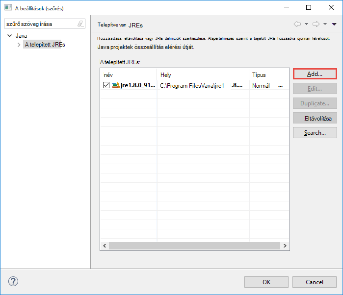
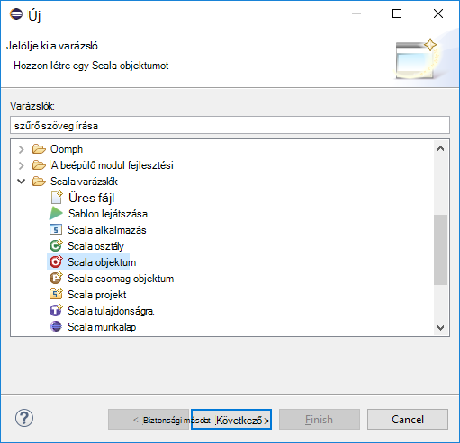

 <properties
    pageTitle="Hozzon létre külső Scala alkalmazások eszközökkel HDInsight az Azure eszközkészlet Holdas |} Microsoft Azure"
    description="Megtudhatja, hogy miként hozhat létre külső alkalmazás futtatásához a HDInsight külső fürt önálló."
    services="hdinsight"
    documentationCenter=""
    authors="nitinme"
    manager="jhubbard"
    editor="cgronlun"
    tags="azure-portal"/>

<tags
    ms.service="hdinsight"
    ms.workload="big-data"
    ms.tgt_pltfrm="na"
    ms.devlang="na"
    ms.topic="article"
    ms.date="08/30/2016"
    ms.author="nitinme"/>

# Holdas eszközkészlete Azure hdinsight szolgáltatáshoz eszközök segítségével külső HDInsight külső Linux fürt alkalmazások létrehozása

Ebben a cikkben részletes útmutatást a Scala és elküldése az, hogy egy HDInsight külső fürt eszközökkel HDInsight az Azure eszközkészlet Holdas írt külső-alkalmazások fejlesztésével. Többféleképpen is használhatja az eszközök:

* Valamint a Scala külső alkalmazások egy HDInsight külső fürt elküldése
* Az Azure hdinsight szolgáltatáshoz külső fürt erőforrások eléréséhez
* Valamint egy Scala külső alkalmazás helyileg futtatása

>[AZURE.IMPORTANT] Ez az eszköz létrehozása és elküldése az alkalmazások csak egy HDInsight külső fürthöz Linux használható.

##Előfeltételek

* Egy Azure-előfizetést. Lásd: [Ismerkedés az Azure ingyenes próbaverziót](https://azure.microsoft.com/documentation/videos/get-azure-free-trial-for-testing-hadoop-in-hdinsight/).

* Egy HDInsight Linux Apache külső fürthöz. Című cikkben olvashat [létrehozása Apache külső fürt az Azure hdinsight szolgáltatásból lehetőségre](hdinsight-apache-spark-jupyter-spark-sql.md).

* Az Oracle Java fejlesztési kit 7 és 8 verziója. 
    * **Java SDK 7** külső projektek összeállításához, mint a HDInsight fürt Java 7-es verzió támogatási használják. Az [alábbi](http://www.oracle.com/technetwork/java/javase/downloads/jdk7-downloads-1880260.html)Java SDK 7 letöltheti.
    * **Java SDK 8** Holdas IDE futtatókörnyezet szolgál. Az [alábbi](http://www.oracle.com/technetwork/java/javase/downloads/jdk8-downloads-2133151.html)letöltheti.

* Holdas IDE. Ez a cikk Holdas Neonfény használja. Az [alábbi](https://www.eclipse.org/downloads/)telepítheti.

* Scala IDE Holdas számára. 
    * **Ha Holdas IDE telepítve van**, a Scala IDE beépülő modul **segítségével**ismételt felveheti -> **Új szoftverek telepítése**, és adja hozzá a [http://download.scala-ide.org/sdk/lithium/e44/scala211/stable/site](http://download.scala-ide.org/sdk/lithium/e44/scala211/stable/site) letölteni a beépülő modul Scala Holdas forrásaként. 
    * **Ha nincs telepítve Holdas IDE**, a Scala IDE közvetlenül, az [Itt](http://scala-ide.org/download/sdk.html)is telepítheti. Töltse le a .zip fájlt erre a hivatkozásra, bontsa ki, keresse meg a **/eclipse** mappát, és futtassa a tárból **eclipse.exe** fájlt.
    
    >[AZURE.NOTE] A lépéseket a jelen dokumentum alapján Holdas IDE használata Scala beépülő modul telepítve van.

* Külső SDK csomagjában talál. Az [alábbi](http://go.microsoft.com/fwlink/?LinkID=723585&clcid=0x409)letöltheti.

* Telepítse az e (fx) clipse [https://www.eclipse.org/efxclipse/install.html](https://www.eclipse.org/efxclipse/install.html).

## Az eszközkészlet Azure HDInsight eszközök telepítése Holdas

HDInsight eszközök Holdas áll rendelkezésre az Azure eszközkészlete Holdas részeként. Az Azure eszközkészlet telepítése, tanulmányozza [az Azure eszközkészlete Holdas telepítése](../azure-toolkit-for-eclipse-installation.md).

## Jelentkezzen be az Azure előfizetés

1. Indítsa el az Holdas IDE, és nyissa meg az Azure Intézőt. Az IDE **ablak** menüből **Nézet megjelenítése** lehetőségre, és kattintson az **egyéb**gombra. Kattintson a megnyíló párbeszédpanelen bontsa ki az **Azure** **Azure Explorer**kattintson, és kattintson **az OK**gombra.

    

2. Kattintson a jobb gombbal az **Azure Explorer**a **Azure** csomópontot, és válassza az **Előfizetések kezelése**.

3. **Előfizetések kezelése** párbeszédpanelen kattintson a **Bejelentkezés** gombra, és írja be az Azure hitelesítő adatait.

    

4. Miután bejelentkezett, az **Előfizetések kezelése** párbeszédpanel a tartozó hitelesítő adatok Azure előfizetések sorolja fel. Kattintson a **Bezárás** a párbeszédpanel.

5. Bontsa ki az Azure Explorer lap **hdinsight szolgáltatásból lehetőségre** kattintva megtekintheti a külső HDInsight fürt csoportban az előfizetés.

    

6. További neve csomópont megállapításához, hogy a fürt kapcsolódó erőforrásokat (pl. tárterület-fiókok esetén) elemre.

    

## Egy külső HDInsight fürt külső Scala projekt beállítása

1. Holdas IDE munkaterület kattintson a **fájl**fülre, kattintson az **Új**gombra, és kattintson a **Projekt**. 

2. Az **Új projekt** varázslóban bontsa ki a **HDInsight**, jelölje be a **külső a HDInsight (Scala)**, és kattintson a **Tovább gombra**.

    

3. **Új HDInsight Scala projekt** párbeszédpanelen írja be vagy válassza ki értékeket az alábbi képen látható módon, és kattintson a **Tovább gombra**.

    

    * Adja meg a projekt nevét.
    * A **JRE** párbeszédpanelen győződjön meg arról, **használata egy végrehajtási környezet JRE** **JavaSE-1.7**van beállítva.
    * Ellenőrizze, hogy a külső SDK értéke azt a helyet, ahol letöltötte a SDK csomagjában talál. Letöltési helyére mutató hivatkozást a [Előfeltételek](#prerequisites) témakör tartalmazza. Is letöltheti a SDK csomagjában talál a a hivatkozás szerepel az ezen a párbeszédpanelen, a fenti képen látható módon.    

4. A következő párbeszédpanelen kattintson a **tárak** fülre, és kattintson duplán az **JRE rendszer tár [JavaSE-1.7]**.

    

5. A **Tár szerkesztése** párbeszédpanelen győződjön meg arról, **Végrehajtási környezet** **JavaSE-1.7(jdk1.7.0_79)**van beállítva. Ha ez nem választható lehetőség, kövesse az alábbi lépéseket.

    1. Jelölje ki a **Másodlagos JRE** lehetőséget, és **JavaSE-1.7(jdk1.7.0_79)** beállítás van-e érhető el.
    2. Ha nem, kattintson a **Telepített JREs** gombra.

          

    3. A **Telepített JREs** párbeszédpanelen kattintson a **Hozzáadás**gombra.

            

    4. **JRE típusa** párbeszédpanelen jelölje ki a **Virtuális szabványos**, és kattintson a **Tovább gombra**

            

    5. **JRE definiálása** párbeszédpanelen kattintson a címtár, majd keresse meg a beszúrandó JDK 7 telepítéshez, és válassza ki a legfelső szintű mappa **jdk1.7.0_79**.

            

    6. Kattintson a **Befejezés gombra**. A **Telepített JREs** párbeszédpanelen jelölje be az újonnan hozzáadott JRE, és kattintson **az OK**gombra.

           

    7. Az újonnan hozzáadott JRE **Végrehajtási**környezetben szerepelnie kell. Kattintson a **Befejezés gombra**.

           

6. Vissza a **tárak** lapon kattintson duplán a **Scala tár tároló [2.11.8]**. **Tár szerkesztése** párbeszédpanelen jelölje be a **rögzített Scala tár tároló: 2.10.6**. 

    

    Kattintson a **Befejezés gombra** , amíg a project beállításai párbeszédpanel bezárásához.

## A külső HDInsight fürt Scala-alkalmazás létrehozása

1. A **Csomag Explorer**, a már meg van nyitva Holdas ide bontsa ki a korábban létrehozott projektet, kattintson a jobb gombbal az **src**, mutasson az **Új**, és kattintson az **egyéb**gombra.

2. **Jelölje ki a varázsló** párbeszédpanelen bontsa ki a **Scala varázslók** **Scala objektum**kattintson, és kattintson a **Tovább gombra**.

    

3. **Új fájl létrehozása** párbeszédpanelen adja meg az objektum nevét, és kattintson a **Befejezés gombra**.

    

4. A text szerkesztő illessze be a következő kódot.

        import org.apache.spark.SparkConf
        import org.apache.spark.SparkContext
    
        object MyClusterApp{
          def main (arg: Array[String]): Unit = {
            val conf = new SparkConf().setAppName("MyClusterApp")
            val sc = new SparkContext(conf)
        
            val rdd = sc.textFile("wasbs:///HdiSamples/HdiSamples/SensorSampleData/hvac/HVAC.csv")
        
            //find the rows which have only one digit in the 7th column in the CSV
            val rdd1 =  rdd.filter(s => s.split(",")(6).length() == 1)
        
            rdd1.saveAsTextFile("wasbs:///HVACOut")
          }     
        }

5. Futtassa az alkalmazást egy HDInsight külső fürt.

    1. A **Csomag Explorer**kattintson a jobb gombbal a projekt nevét, és válassza a **Külső kérelem elküldése hdinsight szolgáltatásból lehetőségre**.      

    2. **A külső beadványokra adott** párbeszédpanelen adja meg az alábbi értékeket.

        * **Fürt neve**jelölje be a HDInsight külső fürt, amelyen szeretne az alkalmazásnak a futtatására.

        * Válasszon egy eltérés Holdas projektből, vagy válasszon egyet a merevlemezről szeretne.

        * Szemben **fő osztály neve** mezőbe írja be a megadott kódot objektum neve (lásd az alábbi képen).

            

        * Mivel ebben a példában az alkalmazás-kódja nem megkövetelése minden parancssori argumentumok vagy hivatkozás kancsó vagy a fájlokat, akkor hagyja a hátralévő szövegdobozok üres.

        * Kattintson a **Küldés**gombra.

    3. A **Külső beadványokra adott** lap kezdetének végrehajtását megjelenítéséhez. A "Külső beadványokra adott" ablakban piros gombra kattintva leállíthatja a az alkalmazást. Megtekintheti az adott alkalmazás, a földgömb ikon látható (a képen a kék négyzetbe lel) gombra kattintva futtassa a naplókat is.

        

    A következő szakaszban megismerheti, hogyan a kimeneti eszközeivel HDInsight Azure eszközkészlet Holdas a feladat eléréséhez.

## Hozzáférés és eszközökkel a HDInsight az Azure eszközkészlet Holdas HDInsight külső fürt kezelése

A különféle műveletek HDInsight eszközeivel végezheti el.

### Hozzáférés a tárhely tároló a fürthöz

1. Az Azure Intézőből bontsa ki a **HDInsight** legfelső szintű csomópontot a rendelkezésre álló HDInsight külső fürt listájának megtekintése.

3. Bontsa ki a fürt nevére a tárterület-fiók és az alapértelmezett tároló tároló a fürt.

    

4. Kattintson a tárterület-tároló fürthöz társított nevére. A jobb oldali ablaktáblában megjelenik egy **HVACOut**nevű mappát. Dupla kattintással nyissa meg a mappát, és megjelenik **rész -*** fájlokat. Nyissa meg az egyik ezeket a fájlokat, a kibocsátás, az alkalmazás megjelenítéséhez.

### A külső előzmények kiszolgáló elérése

1. Az **Azure Intéző**kattintson a jobb gombbal a külső csoport nevét, és válassza a **Megnyitás külső előzmények felhasználói felület**. Amikor a rendszer kéri, írja be a fürt a rendszergazdai hitelesítő adataival. Ezek a fürt kiépítése során van megadva.

2. A külső előzmények kiszolgáló irányítópulton kereshet az alkalmazást, csak kész az alkalmazás neve segítségével futnak. A fenti kódot, beállíthatja az alkalmazás nevét használja `val conf = new SparkConf().setAppName("MyClusterApp")`. A külső alkalmazásnév volt, így **MyClusterApp**.

### Indítsa el a Ambari portál

Az **Azure Intéző**kattintson a jobb gombbal a külső csoport nevét, és válassza a **Megnyitás fürt Kezelőportálja (Ambari)**. Amikor a rendszer kéri, írja be a fürt a rendszergazdai hitelesítő adataival. Ezek a fürt kiépítése során van megadva.

### Azure előfizetések kezelése

Alapértelmezés szerint a Holdas eszközkészlete Azure HDInsight eszközöket a külső fürt az Azure előfizetésekből sorolja fel. Ha szükséges, az előfizetések, amelyhez el szeretne érni a fürt is megadhat. Az **Azure Intéző**kattintson a jobb gombbal a **Azure** legfelső szintű csomópontot, és válassza az **Előfizetések kezelése**. A párbeszédpanelen törölje a jelet a jelölőnégyzetből, szemben az előfizetést, akkor nem szeretne elérni, és kattintson a **Bezárás**. Választhatja **Kijelentkezés** Ha jelentkezzen ki az Azure előfizetéséből.

## Egy külső Scala-alkalmazás futtatásához helyi meghajtóra

Holdas eszközkészlete Azure HDInsight eszközök segítségével külső Scala alkalmazásokat a számítógépen helyben futtatni. Általában ilyen alkalmazások nem szükséges fürt erőforrások, például tároló tároló eléréséhez és kell futtathatja és tesztelje a helyi meghajtóra.

### Előfeltételek

A helyi külső Scala alkalmazást egy Windows rendszerű futtatásakor kivételt [külső-2356](https://issues.apache.org/jira/browse/SPARK-2356) , amely akkor következik be, a Windows operációs rendszer hiányzó **WinUtils.exe** miatt leírtak jelenhet meg. Ez a hiba megkerüléséhez először [Töltse le a végrehajtható fájl innen](http://public-repo-1.hortonworks.com/hdp-win-alpha/winutils.exe) egy helyre, például **C:\WinUtils\bin**. Meg kell egy környezeti változóba **HADOOP_HOME** hozzáadása, majd adja meg az értéket a kijelölt változó **C\WinUtils**.

### A helyi külső Scala alkalmazásnak a futtatására  

1. Indítsa el a Holdas, és hozzon létre egy új projektet. Az új projekt párbeszédpanelen az alábbi lehetőségek lehetővé tevő, és kattintson a **Tovább gombra**.

    

    * A bal oldali ablaktáblában kattintson a **hdinsight szolgáltatásból lehetőségre**.
    * A jobb oldali ablaktáblán kattintson a **külső mintán HDInsight helyi futtatása (Scala)**.
    * Kattintson a **Tovább**gombra.

2. A projektadatok számára, kövesse a 3-as és 6 [-HDInsight külső fürt külső Scala alkalmazás projekt beállítása](#set-up-a-spark-scala-application-project-for-an-hdinsight-spark cluster)a korábbi szakaszban látható módon.

3. A sablon hozzáadása a számítógépen helyben futtathatja az **src** mappában példakódot (**LogQuery**).

    

4.  **LogQuery** alkalmazásáról kattintson a jobb gombbal, és menü **Futtatás parancsára**majd válassza az **1 Scala alkalmazás**. Ekkor megjelenik egy kimenet jelennek meg a **konzol** lapon, a képernyő alján.

    

## Visszajelzés és az ismert problémák

Közvetlenül a nem támogatott külső éppen látható exportálja, és dolgozunk, amely a.

Ha bármely a javaslatokat vagy visszajelzést, vagy ha bármilyen problémát ez az eszköz használatakor nyugodtan engedje us e-mailben a microsoft pont com hdivstool.

## Lásd még:

* [Áttekintés: A külső Apache a Azure hdinsight szolgáltatáshoz](hdinsight-apache-spark-overview.md)

### Felhasználási területei

* [A BI külső: interaktív adatelemzés használata a külső HDInsight az Üzletiintelligencia-eszközeiről](hdinsight-apache-spark-use-bi-tools.md)

* [A külső és gépi tanulási: használata külső a HDInsight épület hőmérsékleti fűtés-és Légtechnikai adatok elemzéséhez](hdinsight-apache-spark-ipython-notebook-machine-learning.md)

* [A külső és gépi tanulási: a HDInsight élelmiszer vizsgálati eredmények előrejelzésére használata külső](hdinsight-apache-spark-machine-learning-mllib-ipython.md)

* [A külső adatfolyam: Használata külső a HDInsight valós idejű adatfolyam alkalmazások készítéséhez](hdinsight-apache-spark-eventhub-streaming.md)

* [Webhely napló analysis HDInsight külső használata](hdinsight-apache-spark-custom-library-website-log-analysis.md)

### Létrehozása és futtatása alkalmazások

* [Scala használatával önálló-alkalmazás létrehozása](hdinsight-apache-spark-create-standalone-application.md)

* [Feladat távolról futtatható a külső fürtre Livius használatával](hdinsight-apache-spark-livy-rest-interface.md)

### Eszközök és bővítmények

* [A IntelliJ eszközkészlete Azure HDInsight eszközök segítségével létrehozása és elküldése külső Scala alkalmazást](hdinsight-apache-spark-intellij-tool-plugin.md)

* [IntelliJ eszközkészlete Azure hdinsight szolgáltatáshoz eszközök segítségével külső alkalmazások hibáinak távolról](hdinsight-apache-spark-intellij-tool-plugin-debug-jobs-remotely.md)

* [A HDInsight külső fürt Zeppelin jegyzetfüzetek használata](hdinsight-apache-spark-use-zeppelin-notebook.md)

* [Elérhető az HDInsight-külső fürthöz Jupyter jegyzetfüzet mag](hdinsight-apache-spark-jupyter-notebook-kernels.md)

* [Külső csomagok Jupyter jegyzetfüzeteket használata](hdinsight-apache-spark-jupyter-notebook-use-external-packages.md)

* [Jupyter telepítése a számítógépen, és csatlakozzon az HDInsight külső fürthöz](hdinsight-apache-spark-jupyter-notebook-install-locally.md)

### Erőforrások kezelése

* [A Apache külső fürt Azure hdinsight szolgáltatáshoz a források kezelése](hdinsight-apache-spark-resource-manager.md)

* [A a HDInsight-Apache külső fürthöz nyomon követése és hibakeresési feladatok](hdinsight-apache-spark-job-debugging.md)
