<properties 
    pageTitle="A HDInsight Apache külső adatfolyam feldolgozása Azure esemény hubok használata |} Microsoft Azure" 
    description="Adatok küldése a lépésenkénti adatfolyam-esemény Azure-hubon keresztül csatlakozott, és külső scala alkalmazást használ majd kap az események" 
    services="hdinsight" 
    documentationCenter="" 
    authors="nitinme" 
    manager="jhubbard" 
    editor="cgronlun"
    tags="azure-portal"/>

<tags 
    ms.service="hdinsight" 
    ms.workload="big-data" 
    ms.tgt_pltfrm="na" 
    ms.devlang="na" 
    ms.topic="article" 
    ms.date="09/30/2016" 
    ms.author="nitinme"/>

# A külső adatfolyam: Dolgozható az Azure esemény hubok HDInsight Linux Apache külső fürthöz

A folyamatos átvitelű külső kiterjeszti az alapvető külső API méretezhető, nagy átviteli, hibafa tervezett adatfolyam feldolgozás alkalmazások létrehozásához. Adatok több forrásból is lehet okozhatnak. Ez a cikk azt használatával Azure esemény hubok ingest adatok. Esemény hubok rendszer erősen méretezhető bevitel, hogy lehet bevitelének milliós másodpercenként eseményeket. 

Ebből az oktatóanyagból megtanulhatja, hogyan hozhat létre az Azure-esemény központban miként üzenetek ingest Java egy konzol alkalmazással esemény-elosztóhoz, illetve egy alkalmazásban a külső Scala nyelven íródott párhuzamosan lekérdezni. Ez az alkalmazás az esemény hubok keresztül folyamatosan lejátszott adatok fogyasztása, és továbbítja különböző kimeneti értékeket (Azure Blob-tároló struktúratáblával és SQL-táblázatot).

> [AZURE.NOTE] Kövesse a jelen cikk, hogy be kell használni az Azure portál változatát is. Egy esemény hubhoz létrehozása az [Azure klasszikus portál](https://manage.windowsazure.com)fogja használni. A HDInsight külső fürt dolgozni, az [Azure-portálon](https://portal.azure.com/)fogja használni.  

**Előfeltételek:**

Rendelkeznie kell a következőket:

- Egy Azure-előfizetést. Lásd: [Ismerkedés az Azure ingyenes próbaverziót](https://azure.microsoft.com/documentation/videos/get-azure-free-trial-for-testing-hadoop-in-hdinsight/).
- Egy külső Apache fürthöz. Című cikkben olvashat [létrehozása Apache külső fürt az Azure hdinsight szolgáltatásból lehetőségre](hdinsight-apache-spark-jupyter-spark-sql.md).
- Az Oracle Java fejlesztési kit. Az [alábbi](http://www.oracle.com/technetwork/java/javase/downloads/jdk8-downloads-2133151.html)telepítheti.
- Egy Java IDE. Ez a cikk IntelliJ arról 15.0.1 használja. Az [alábbi](https://www.jetbrains.com/idea/download/)telepítheti.
- Az SQL Server, Microsoft JDBC illesztőprogram v4.1 vagy újabb verziójában. Ez az esemény adatai írjon be egy SQL Server-adatbázis szükséges. Az [alábbi](https://msdn.microsoft.com/sqlserver/aa937724.aspx)telepítheti.
- Microsoft Azure SQL-adatbázisban. Című cikkben olvashat [percben SQL-adatbázis létrehozása](../sql-database/sql-database-get-started.md).

## Mit jelent ez a megoldás?

Ez az, hogy hogyan folyik át a továbbított megoldást:

1. Hozzon létre egy Azure esemény hubhoz, amely a teljes adatfolyam kapja.

2. A helyi önálló az alkalmazásnak a futtatására, amely eseményeket hoz létre, és ezt az Azure-esemény központban nyújtja azt. A minta alkalmazás, amely végzi [https://github.com/hdinsight/spark-streaming-data-persistence-examples](https://github.com/hdinsight/spark-streaming-data-persistence-examples)van közzétéve.

2. Egy adatfolyam alkalmazás futtatásához távolról a külső fürthöz, hogy olvassa be a továbbított események Azure esemény központból, és ezt nyújtja más helyekre (Azure Blob struktúratáblával és SQL-adatbázis tábla). 

## Azure esemény központi létrehozása

1. Az [Azure-portált](https://manage.windowsazure.com), kattintson az **Új** > **Szolgáltatás Bus** > **Esemény központi** > **Egyéni létrehozása**.

2. A **Hozzáadás új esemény hubon** képernyőn adja meg az **Esemény központi nevét**, válassza ki a **régió** létrehozása a központját, és hozzon létre egy új névtér, vagy jelöljön ki egy meglévőt. Kattintson a **nyílra** kattintva továbbra is.

    ![1 varázsló azon oldala] (./media/hdinsight-apache-spark-eventhub-streaming/hdispark.streaming.create.event.hub.png "Hozzon létre egy Azure esemény hubhoz")

    > [AZURE.NOTE] Ugyanazon a **helyen** , a késés és a költségek csökkentése HDInsight Apache külső fürt választhat.

3. **Esemény központi beállítása** képernyőn adja meg a **partíciót darab** és az **Üzenet adatmegőrzési** értékeket, és kattintson a pipára. Ebben a példában a partíciót száma 10-es és egy üzenet adatmegőrzési az 1 használja. Megjegyzés: partíciót számának, mert szüksége lesz az érték később.

    ![2 varázsló azon oldala] (./media/hdinsight-apache-spark-eventhub-streaming/hdispark.streaming.create.event.hub2.png "Adja meg partíciót méretét és az adatmegőrzési napig esemény központi")

4. Kattintson az esemény-központban létrehozott, kattintson a **Konfigurálás**gombra, és hozzon létre két access házirendek az esemény-központban.

    <table>
    <tr><th>név</th><th>Engedélyek</th></tr>
    <tr><td>mysendpolicy</td><td>Küldés</td></tr>
    <tr><td>myreceivepolicy</td><td>Meghallgatása</td></tr>
    </table>

    Miután létrehozta az engedélyeket, válassza a **Mentés** ikonra a lap alján. A megosztott access-házirendek (**mysendpolicy**) működőképessé (**myreceivepolicy**) meghallgatása a esemény központi használt létrehozása.

    ![házirendek] (./media/hdinsight-apache-spark-eventhub-streaming/hdispark.streaming.event.hub.policies.png "Hozzon létre esemény központi házirendek")

    
5. Ugyanezen a lapon a házirend kulcsokat hoz létre a két házirendek egy vegye figyelembe. Mentse a billentyűk, mivel később is használják.

    ![házirend-kulcsok] (./media/hdinsight-apache-spark-eventhub-streaming/hdispark.streaming.event.hub.policy.keys.png "Mentse a házirend-kulcsok")

6. Az **Irányítópult** lapon kattintson a **Kapcsolati adatokat** olvashat be és menteni a kapcsolati karakterláncot az esemény-központban, a két házirendekkel lentről felfelé.

    ![házirend-kulcsok] (./media/hdinsight-apache-spark-eventhub-streaming/hdispark.streaming.event.hub.policy.connection.strings.png "Házirend csatlakozási_karakterlánc mentése")

## Üzenetek küldése esemény-hubon keresztül csatlakozott egy Scala alkalmazással

Ebben a szakaszban a különálló helyi Scala alkalmazás Azure esemény-hubon keresztül csatlakozott az előző lépésben létrehozott események adatfolyam küldhet használhatja. Ez az alkalmazás megtalálható a GitHub [https://github.com/hdinsight/eventhubs-sample-event-producer](https://github.com/hdinsight/eventhubs-sample-event-producer). Itt ismertetett lépések feltételezik, hogy meg van már ágazik el a GitHub tárházba.

1. Nyissa meg az alkalmazást, **EventhubsSampleEventProducer**, IntelliJ arról.
    
2. Hozza létre a projekt. A **Szerkesztés** menüben kattintson a **Projekt ellenőrizze**. A kimenet üveg **\out\artifacts**alatt jön létre.

>[AZURE.TIP] A beállítás a IntelliJ arról az segítségével közvetlenül a projekt létrehozása GitHub összegyűjti. Megtudhatja, hogyan használja ezt a megközelítést, amellyel a képernyőn megjelenő utasításokat a következő szakaszban találhat. Figyelje meg, hogy a következő szakaszban leírt lépések sok nem fogja alkalmazni az ebben a lépésben létrehozott Scala alkalmazáshoz. Példa:

> * Nem lesz a POM, amelyet fel szeretne venni a külső verzió frissítéséhez. Amelyek azért, mert nincs függőség a külső hozhat létre, ez az alkalmazás
> * Nem lesz néhány függőség kancsó hozzáadása a project-tárat. Ennek az, mert adott kancsó nem szükséges ehhez a projekthez.

## Az alkalmazás az események fogadására streaming Scala frissítése

A minta Scala-alkalmazások és az esemény irányítja a különböző helyekre [https://github.com/hdinsight/spark-streaming-data-persistence-examples](https://github.com/hdinsight/spark-streaming-data-persistence-examples)címen érhető el. Hajtsa végre az alábbi lépéseket követve frissítse az alkalmazást, és a kimeneti üveg létrehozása.

1. Indítsa el a IntelliJ arról, és az indítási képernyőn válassza **a verziókövetés nézze meg** , és válassza a **mely számjegy**.
        
    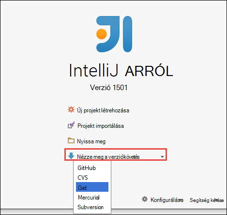

2. **Adatfeliratsor tárházba** párbeszédpanelen adja meg a klónozhatja, adja meg a könyvtár való klónozhatja, és válassza az **Adatfeliratsor**a mely számjegy-tár URL-CÍMÉT.

    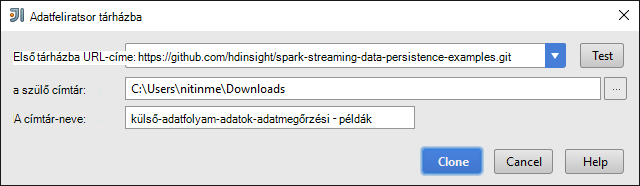

    
3. Amíg a projekt teljes egészében klónozva van, kövesse a képernyőn megjelenő utasításokat. **Alt + 1** billentyűkombináció lenyomásával nyissa meg a **Projekt nézetéhez**. Ez a következőhöz hasonló ad.

    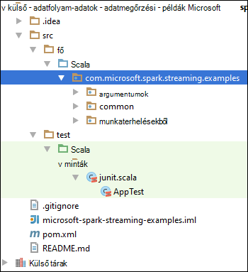
    
4. Győződjön meg arról, hogy az alkalmazás kódja a Java8 összeállítása után. Biztosítani, kattintson a **fájl**fülre, kattintson a **Projekt szerkezetének**és a **Projekt** lap, győződjön meg arról, hogy a Project nyelvi szintje pedig **8 - Lambdas, típus széljegyzetek, stb**.

    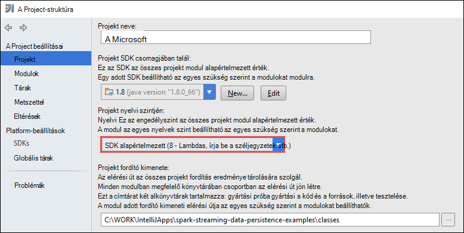

5. Nyissa meg a **pom.xml** , és ellenőrizze, hogy a megfelelő külső verziószáma. A <properties> csomópontot, keresse meg a következő kódtöredékének, és ellenőrizze a külső verzióját.

        <scala.version>2.10.4</scala.version>
        <scala.compat.version>2.10.4</scala.compat.version>
        <scala.binary.version>2.10</scala.binary.version>
        <spark.version>1.6.2</spark.version>
    
5. Az alkalmazás két függőség kancsó van szükség:

    * **EventHub címzett üveg**. Ez a szükséges külső az üzenetek fogadására esemény központból. Használja a üveg, frissítse a **pom.xml** hozzáadása területen a következő `<dependencies>`.

            <dependency>
              <groupId>com.microsoft.azure</groupId>
              <artifactId>spark-streaming-eventhubs_2.10</artifactId>
              <version>1.6.0</version>
            </dependency> 

    * **JDBC illesztőprogram üveg**. Ez az Azure SQL-adatbázishoz az esemény központból Beérkezett üzenetek írni szükséges. Letöltheti v4.1 vagy újabb verzió, az [alábbi](https://msdn.microsoft.com/sqlserver/aa937724.aspx)üveg fájl. A üveg mutató hivatkozás felvétele a project-tárban. Hajtsa végre az alábbi lépéseket:

        1. Hol van az alkalmazás megnyitásához kattintson a **fájl**IntelliJ arról ablakban kattintson a **Projekt szerkezetének**, és válassza a **tárak**. 
        
        2. Kattintson a Hozzáadás ikonra () **Java**kattintson, és nyissa meg azt a helyet, ahol letöltötte az JDBC illesztőprogram üveg. Kövesse a képernyőn megjelenő utasításokat a üveg fájl hozzáadása a project-tárban.

            ![Hiányzó függőségeket hozzáadása] (./media/hdinsight-apache-spark-eventhub-streaming/add-missing-dependency-jars.png "Hiányzó kancsó hozzáadása a függőség")

        3. Kattintson a **alkalmazása**gombra.

6. A kimenet üveg fájl létrehozása. Hajtsa végre az alábbi lépéseket.
    1. A **Projekt szerkezetének** párbeszédpanelen kattintson **az eltéréseket** , és válassza a a pluszjelre. Kattintson az előugró párbeszédpanelen kattintson **JAR**, majd **modulból való függőségek**.

        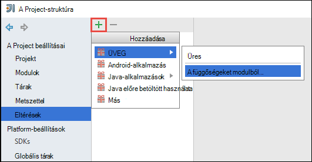

    1. **Modulból JAR létrehozása** párbeszédpanelen kattintson a három pontra () a **Fő osztály**szemben.

    1. A **Fő osztály kiválasztása** párbeszédpanelen jelölje ki a rendelkezésre álló osztályok valamelyikét, és kattintson **az OK**gombra.

        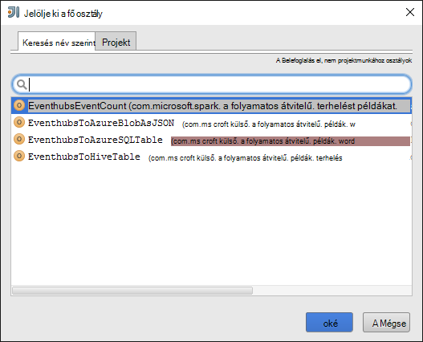

    1. **Modulból JAR létrehozása** párbeszédpanelen győződjön meg arról, hogy be van jelölve a vezérlőt, amellyel **kinyerheti a célba üveg** , és kattintson **az OK**gombra. Ez az összes függőségek egy egyetlen üveg hoz létre.

        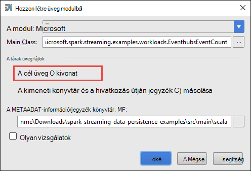

    1. A **Kimenet elrendezés** lapján a maven tesztelése projekt részét képező összes kancsó sorolja fel. Jelölje ki, és törölheti azokat meg, amelyek a Scala alkalmazásnak nincs közvetlen függőség. Az alkalmazás, akkor itt létrehozása, eltávolíthatja az utolsó kivételével az összes egy (a**microsoft-külső-adatfolyam-példák kimeneti fordítható le**). Jelölje ki a kancsó törli, és kattintson a **Törlés** ikonra ().

        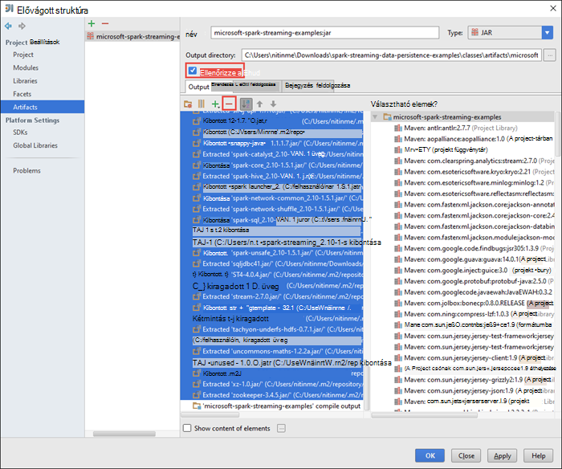

        Ellenőrizze, hogy **Ellenőrizze épülnek** be van jelölve, amely biztosítja, hogy a üveg jön létre, minden alkalommal, amikor a projekt beépített vagy frissített. Kattintson az **alkalmazni** , kattintson az **OK gombra**.

    1. **A kimenet elrendezés** lap jobb alsó részén a **Rendelkezésre álló elemek** mezőbe az SQL-JDBC üveg, hogy a projekt tár korábban hozzáadott lehetősége van. Hozzá kell adnia a **Kimeneti az elrendezés** lapon. Kattintson a jobb gombbal a üveg fájlt, és kattintson a **Kibontása kimeneti legfelső szintű be**.

        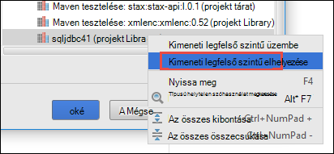  

        A **Kimenet elrendezés** lap így most néz ki.

        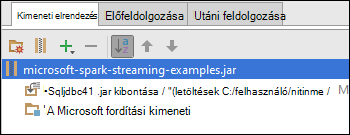     

        A **Projekt szerkezetének** párbeszédpanelen kattintson az **Alkalmaz** gombra, és kattintson **az OK**gombra. 

    1. A menüsor kattintson a **Szerkesztés**gombra, és kattintson a **Projekt győződjön**. A üveg **Összeállítása eltérések** is kattinthat. A kimenet üveg **\out\artifacts**alatt jön létre.

        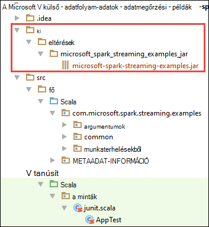

## Az alkalmazások futtatásához távolról a külső fürtre Livius használatával

A továbbított alkalmazás futtatásához távolról a külső fürthöz Livius fogjuk használni. Részletes vitafórum Livius HDInsight külső fürthöz című témakörben olvashat [távolról egy Apache külső fürthöz Azure hdinsight szolgáltatáshoz a Küldés feladatokat](hdinsight-apache-spark-livy-rest-interface.md)ismerteti. Futtatása előtt adatfolyam események külső ott használja a távoli feladatok néhány dolgot kell tennie:

1. Indítsa el a helyi önálló alkalmazást események létrehozásához, és esemény központi küldeni. Ehhez használja a az alábbi parancsot:

        java -cp EventhubsSampleEventProducer.jar com.microsoft.eventhubs.client.example.EventhubsClientDriver --eventhubs-namespace "mysbnamespace" --eventhubs-name "myeventhub" --policy-name "mysendpolicy" --policy-key "<policy key>" --message-length 32 --thread-count 32 --message-count -1

2. Másolja az adatfolyam üveg (**microsoft-külső-adatfolyam-examples.jar**) az Azure Blob-tárolóhoz fürthöz társított. Emiatt a üveg Livius elérhető. [**AzCopy**](../storage/storage-use-azcopy.md), egy parancssori segédprogram ezt is használhatja. Vannak olyan sok más ügyfelek feltölteni az adatokat is használhatja. További információ a névjegyek őket az [adatok HDInsight Hadoop feladatok feltöltése](hdinsight-upload-data.md)is megkeresheti.

3. CURL telepíthető át ezeket az alkalmazásokat futtató számítógép. CURL segítségével meghívása a Livius végpontok távolról a feladatok futtatásához.

### Az események fogadására be egy Azure tároló Blob szövegként alkalmazást

Nyisson meg egy parancssort, és keresse meg a címtárhoz, amelyen telepítette CURL (csere felhasználónevével és jelszavával, és a csoport neve) az alábbi parancsot:

    curl -k --user "admin:mypassword1!" -v -H "Content-Type: application/json" -X POST --data @C:\Temp\inputBlob.txt "https://mysparkcluster.azurehdinsight.net/livy/batches"

A fájl **inputBlob.txt** a paraméterek a következők:

    { "file":"wasbs:///example/jars/microsoft-spark-streaming-examples.jar", "className":"com.microsoft.spark.streaming.examples.workloads.EventhubsEventCount", "args":["--eventhubs-namespace", "mysbnamespace", "--eventhubs-name", "myeventhub", "--policy-name", "myreceivepolicy", "--policy-key", "<put-your-key-here>", "--consumer-group", "$default", "--partition-count", 10, "--batch-interval-in-seconds", 20, "--checkpoint-directory", "/EventCheckpoint", "--event-count-folder", "/EventCount/EventCount10"], "numExecutors":20, "executorMemory":"1G", "executorCores":1, "driverMemory":"2G" }

Tudassa velünk megérti, hogy a bemeneti fájl a paraméterek van:

* **a fájl az Azure tároló ügyfél fürthöz társított az alkalmazás üveg fájl elérési útját.**
* **osztálynév** pedig a üveg az osztály neve.
* **argumentumok** az argumentumlista követel meg az osztály
* **numExecutors** az adatfolyam alkalmazásnak a futtatására külső által használt magmintákat számát. Mindig kell legalább kétszer esemény központi partíciót számát.
* **executorMemory**, **executorCores**, **driverMemory** a szükséges erőforrások hozzárendelése az adatfolyam alkalmazás használt paraméterek.

>[AZURE.NOTE] Nem kell a kimeneti mappákba (EventCheckpoint, EventCount/EventCount10) paraméterként használt létrehozása. Az adatfolyam alkalmazás létrehozza őket.
    
Amikor a parancsot futtatja, meg kell jelennie a kibocsátás, az alábbihoz hasonló:

    < HTTP/1.1 201 Created
    < Content-Type: application/json; charset=UTF-8
    < Location: /18
    < Server: Microsoft-IIS/8.5
    < X-Powered-By: ARR/2.5
    < X-Powered-By: ASP.NET
    < Date: Tue, 01 Dec 2015 05:39:10 GMT
    < Content-Length: 37
    <
    {"id":1,"state":"starting","log":[]}* Connection #0 to host mysparkcluster.azurehdinsight.net left intact

Jegyezze le a köteg azonosító utolsó sorában a kimenet (példánkban "1"). Ha ellenőrizni szeretné, hogy az alkalmazás sikeresen elindul, akkor tekinthetik meg a fürthöz társított fiókja Azure tárhely, és meg kell jelennie a létrehozott **/EventCount/EventCount10** mappát. Ezt a mappát, amely jellemzi a idő a megadott időszakban a paraméter **Köteg intervallum-a-másodperc**feldolgozott események száma BLOB kell tartalmaznia.

Az alkalmazás továbbra is szeretné futtatni, amíg a állítsa le. Ehhez használja a következő parancsot:

    curl -k --user "admin:mypassword1!" -v -X DELETE "https://mysparkcluster.azurehdinsight.net/livy/batches/1"

### Az események fogadására be egy Azure tároló Blob JSON, az alkalmazások futtatása

Nyisson meg egy parancssort, és keresse meg a címtárhoz, amelyen telepítette CURL (csere felhasználónevével és jelszavával, és a csoport neve) az alábbi parancsot:

    curl -k --user "admin:mypassword1!" -v -H "Content-Type: application/json" -X POST --data @C:\Temp\inputJSON.txt "https://mysparkcluster.azurehdinsight.net/livy/batches"

A fájl **inputJSON.txt** a paraméterek a következők:

    { "file":"wasbs:///example/jars/microsoft-spark-streaming-examples.jar", "className":"com.microsoft.spark.streaming.examples.workloads.EventhubsToAzureBlobAsJSON", "args":["--eventhubs-namespace", "mysbnamespace", "--eventhubs-name", "myeventhub", "--policy-name", "myreceivepolicy", "--policy-key", "<put-your-key-here>", "--consumer-group", "$default", "--partition-count", 10, "--batch-interval-in-seconds", 20, "--checkpoint-directory", "/EventCheckpoint", "--event-count-folder", "/EventCount/EventCount10", "--event-store-folder", "/EventStore10"], "numExecutors":20, "executorMemory":"1G", "executorCores":1, "driverMemory":"2G" }

A paraméterek hasonlóak az a szöveg eredménye az előző lépésben megadott. Ismét szükségtelen hozza létre a kimeneti mappákat (EventCheckpoint, EventCount/EventCount10) paraméterként használt. Az adatfolyam alkalmazás létrehozza őket.

 A parancs futtatása után fürthöz társított fiókja Azure tároló megnézheti, és meg kell jelennie a létrehozott **/EventStore10** mappát. Nyissa meg bármely fájl előtaggal **rész -** és meg kell jelennie az események feldolgozása JSON formátumban.

### Az események fogadására struktúra táblába alkalmazást

Futtassa az alkalmazást, amely adatfolyamként továbbítja az események struktúra táblába néhány további összetevőit szüksége van. A következők:

* datanucleus-api-jdo-3.2.6.jar
* datanucleus-rdbms-3.2.9.jar
* datanucleus-core-3.2.10.jar
* struktúra-site.xml

A **.jar** fájlok érhetők el a HDInsight külső fürthöz `/usr/hdp/current/spark-client/lib`. A **struktúra-site.xml** címen érhető el `/usr/hdp/current/spark-client/conf`.

[WinScp](http://winscp.net/eng/download.php) segítségével a helyi számítógépre másolja át ezeket a fájlokat a fürt. Eszközök segítségével majd másolja a következő fájlokat fölé fürthöz társított a tárterület-fiókjába. További információt a fájlok feltöltése a tárterület-fiókjába olvassa el a [feltölteni az adatokat a HDInsight Hadoop-projektekhez](hdinsight-upload-data.md)című témakört.

Miután másolta a fájlokat a tárhely Azure-fiókjába, nyisson meg egy parancssorablakot, nyissa meg a címtárhoz, amelyen telepítette CURL és (csere felhasználónevével és jelszavával, és a csoport neve) az alábbi parancsot:

    curl -k --user "admin:mypassword1!" -v -H "Content-Type: application/json" -X POST --data @C:\Temp\inputHive.txt "https://mysparkcluster.azurehdinsight.net/livy/batches"

A fájl **inputHive.txt** a paraméterek a következők:

    { "file":"wasbs:///example/jars/microsoft-spark-streaming-examples.jar", "className":"com.microsoft.spark.streaming.examples.workloads.EventhubsToHiveTable", "args":["--eventhubs-namespace", "mysbnamespace", "--eventhubs-name", "myeventhub", "--policy-name", "myreceivepolicy", "--policy-key", "<put-your-key-here>", "--consumer-group", "$default", "--partition-count", 10, "--batch-interval-in-seconds", 20, "--checkpoint-directory", "/EventCheckpoint", "--event-count-folder", "/EventCount/EventCount10", "--event-hive-table", "EventHiveTable10" ], "jars":["wasbs:///example/jars/datanucleus-api-jdo-3.2.6.jar", "wasbs:///example/jars/datanucleus-rdbms-3.2.9.jar", "wasbs:///example/jars/datanucleus-core-3.2.10.jar"], "files":["wasbs:///example/jars/hive-site.xml"], "numExecutors":20, "executorMemory":"1G", "executorCores":1, "driverMemory":"2G" }

A paraméterek hasonlóak megadott szöveg kimeneti az előző lépéseket. Újra, nem kell a kimeneti mappákat (EventCheckpoint, EventCount/EventCount10) vagy a kimenet létrehozása struktúratáblával (EventHiveTable10) paraméterként használt. Az adatfolyam alkalmazás létrehozza őket. Figyelje meg, hogy a **kancsó** és a **fájlok** lehetőséget tartalmazza-e a .jar fájlokat és a struktúra-site.xml másolt fölé a tárterület-fiók elérési út.

Ha ellenőrizni szeretné, hogy a struktúratáblával létrehozása sikeresen befejeződött, SSH fürt és struktúra-lekérdezések futtatása is. Című cikkben olvashat [A Hadoop HDInsight SSH és a struktúra használatát](hdinsight-hadoop-use-hive-ssh.md). Miután csatlakozott SSH használ, ellenőrizze, hogy létrejönnek-e a struktúratáblával **EventHiveTable10**, a következő parancsot futtathatja.

    show tables;

Meg kell jelennie a kibocsátás, az alábbihoz hasonló:

    OK
    eventhivetable10
    hivesampletable

A táblázat tartalmának megtekintése a VÁLASZTÓ lekérdezés is futtathatók.

    SELECT * FROM eventhivetable10 LIMIT 10;

Meg kell jelennie a kibocsátás, az alábbihoz hasonló:

    ZN90apUSQODDTx7n6Toh6jDbuPngqT4c
    sor2M7xsFwmaRW8W8NDwMneFNMrOVkW1
    o2HcsU735ejSi2bGEcbUSB4btCFmI1lW
    TLuibq4rbj0T9st9eEzIWJwNGtMWYoYS
    HKCpPlWFWAJILwR69MAq863nCWYzDEw6
    Mvx0GQOPYvPR7ezBEpIHYKTKiEhYammQ
    85dRppSBSbZgThLr1s0GMgKqynDUqudr
    5LAWkNqorLj3ZN9a2mfWr9rZqeXKN4pF
    ulf9wSFNjD7BZXCyunozecov9QpEIYmJ
    vWzM3nvOja8DhYcwn0n5eTfOItZ966pa
    Time taken: 4.434 seconds, Fetched: 10 row(s)

### Az események fogadására egy Azure SQL-adatbázis táblába alkalmazást

Mielőtt ezt a lépést, győződjön meg arról, hogy az Azure SQL-adatbázis létrehozása. Az adatbázis nevét, adatbázis-kiszolgáló neve és az adatbázis-rendszergazdai hitelesítő adatok paraméterként kell értékeket. Nem kell az adatbázis-táblázat létrehozása. Az adatfolyam alkalmazás hoz létre, amely meg.

Nyisson meg egy parancssort, nyissa meg a címtárhoz, amelyen telepítette CURL, és futtassa az alábbi parancsot:

    curl -k --user "admin:mypassword1!" -v -H "Content-Type: application/json" -X POST --data @C:\Temp\inputSQL.txt "https://mysparkcluster.azurehdinsight.net/livy/batches"

A fájl **inputSQL.txt** a paraméterek a következők:

    { "file":"wasbs:///example/jars/microsoft-spark-streaming-examples.jar", "className":"com.microsoft.spark.streaming.examples.workloads.EventhubsToAzureSQLTable", "args":["--eventhubs-namespace", "mysbnamespace", "--eventhubs-name", "myeventhub", "--policy-name", "myreceivepolicy", "--policy-key", "<put-your-key-here>", "--consumer-group", "$default", "--partition-count", 10, "--batch-interval-in-seconds", 20, "--checkpoint-directory", "/EventCheckpoint", "--event-count-folder", "/EventCount/EventCount10", "--sql-server-fqdn", "<database-server-name>.database.windows.net", "--sql-database-name", "mysparkdatabase", "--database-username", "sparkdbadmin", "--database-password", "<put-password-here>", "--event-sql-table", "EventContent" ], "numExecutors":20, "executorMemory":"1G", "executorCores":1, "driverMemory":"2G" }

Ha ellenőrizni szeretné, hogy az alkalmazás sikeresen elindul, az Azure SQL-adatbázis használata SQL Server Management Studio csatlakozhat. Útmutatást megtennie olvassa el a [Csatlakozás az SQL Server Management Studio SQL-adatbázishoz](../sql-database/sql-database-connect-query-ssms.md). Miután csatlakozott az adatbázishoz, megkeresheti a az adatfolyam alkalmazás által létrehozott **EventContent** táblázatra. Úgy juthat az adatokat a táblázat gyors lekérdezés futtatását is lehetővé teszi. Futtassa a következő lekérdezést:

    SELECT * FROM EventCount

Meg kell jelennie a kimeneti az alábbihoz hasonló:

    00046b0f-2552-4980-9c3f-8bba5647c8ee
    000b7530-12f9-4081-8e19-90acd26f9c0c
    000bc521-9c1b-4a42-ab08-dc1893b83f3b
    00123a2a-e00d-496a-9104-108920955718
    0017c68f-7a4e-452d-97ad-5cb1fe5ba81b
    001KsmqL2gfu5ZcuQuTqTxQvVyGCqPp9
    001vIZgOStka4DXtud0e3tX7XbfMnZrN
    00220586-3e1a-4d2d-a89b-05c5892e541a
    0029e309-9e54-4e1b-84be-cd04e6fce5ec
    003333cf-874f-4045-9da3-9f98c2b4ea49
    0043c07e-8d73-420a-9af7-1fcb94575356
    004a11a9-0c2c-4bc0-a7d5-2e0ebd947ab9

    
## Lásd még:

* [Áttekintés: A külső Apache a Azure hdinsight szolgáltatáshoz](hdinsight-apache-spark-overview.md)

### Felhasználási területei

* [A BI külső: interaktív adatelemzés használata a külső HDInsight az Üzletiintelligencia-eszközeiről](hdinsight-apache-spark-use-bi-tools.md)

* [A külső és gépi tanulási: használata külső a HDInsight épület hőmérsékleti fűtés-és Légtechnikai adatok elemzéséhez](hdinsight-apache-spark-ipython-notebook-machine-learning.md)

* [A külső és gépi tanulási: a HDInsight élelmiszer vizsgálati eredmények előrejelzésére használata külső](hdinsight-apache-spark-machine-learning-mllib-ipython.md)

* [Webhely napló analysis HDInsight külső használata](hdinsight-apache-spark-custom-library-website-log-analysis.md)

### Létrehozása és futtatása alkalmazások

* [Scala használatával önálló-alkalmazás létrehozása](hdinsight-apache-spark-create-standalone-application.md)

* [Feladat távolról futtatható a külső fürtre Livius használatával](hdinsight-apache-spark-livy-rest-interface.md)

### Eszközök és bővítmények

* [Létrehozása és elküldése külső Scala alkalmazást IntelliJ arról HDInsight eszközök beépülő modul használatával](hdinsight-apache-spark-intellij-tool-plugin.md)

* [A külső alkalmazások távolról hibáinak IntelliJ arról HDInsight eszközök beépülő modul használatával](hdinsight-apache-spark-intellij-tool-plugin-debug-jobs-remotely.md)

* [A HDInsight külső fürt Zeppelin jegyzetfüzetek használata](hdinsight-apache-spark-use-zeppelin-notebook.md)

* [Elérhető az HDInsight-külső fürthöz Jupyter jegyzetfüzet mag](hdinsight-apache-spark-jupyter-notebook-kernels.md)

* [Külső csomagok Jupyter jegyzetfüzeteket használata](hdinsight-apache-spark-jupyter-notebook-use-external-packages.md)

* [Jupyter telepítése a számítógépen, és csatlakozzon az HDInsight külső fürthöz](hdinsight-apache-spark-jupyter-notebook-install-locally.md)

### Erőforrások kezelése

* [A Apache külső fürt Azure hdinsight szolgáltatáshoz a források kezelése](hdinsight-apache-spark-resource-manager.md)

* [A a HDInsight-Apache külső fürthöz nyomon követése és hibakeresési feladatok](hdinsight-apache-spark-job-debugging.md)

[hdinsight-versions]: hdinsight-component-versioning.md
[hdinsight-upload-data]: hdinsight-upload-data.md
[hdinsight-storage]: hdinsight-hadoop-use-blob-storage.md

[azure-purchase-options]: http://azure.microsoft.com/pricing/purchase-options/
[azure-member-offers]: http://azure.microsoft.com/pricing/member-offers/
[azure-free-trial]: http://azure.microsoft.com/pricing/free-trial/
[azure-management-portal]: https://manage.windowsazure.com/
[azure-create-storageaccount]: ../storage-create-storage-account/ 
