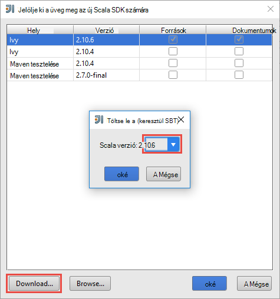
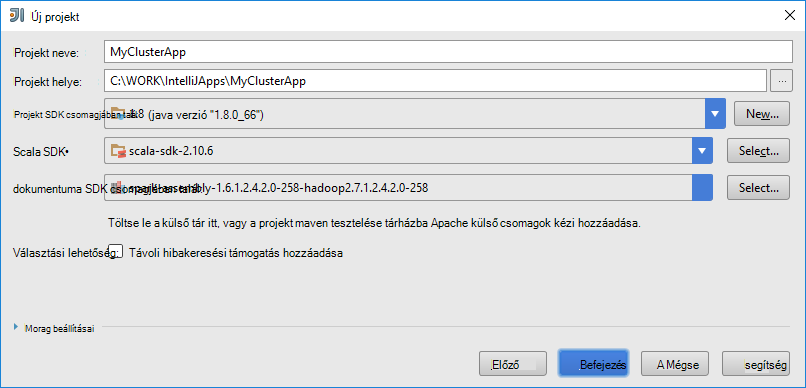
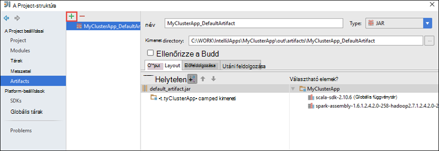
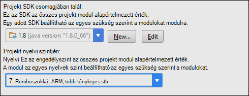
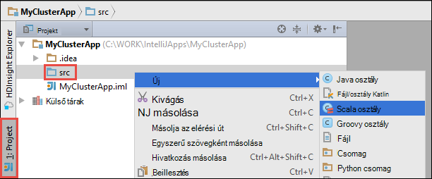

 <properties
    pageTitle="IntelliJ eszközkészlete Azure hdinsight szolgáltatáshoz eszközök segítségével távolról a HDInsight külső fürt futó alkalmazások hibáinak |} Microsoft Azure"
    description="Megtudhatja, hogyan IntelliJ eszközkészlete Azure HDInsight eszközök segítségével távolról hibakeresési HDInsight külső fürt futó alkalmazást."
    services="hdinsight"
    documentationCenter=""
    authors="nitinme"
    manager="jhubbard"
    editor="cgronlun"
    tags="azure-portal"/>

<tags
    ms.service="hdinsight"
    ms.workload="big-data"
    ms.tgt_pltfrm="na"
    ms.devlang="na"
    ms.topic="article"
    ms.date="09/09/2016"
    ms.author="nitinme"/>

# IntelliJ eszközkészlete Azure hdinsight szolgáltatáshoz eszközök segítségével külső alkalmazások távolról a HDInsight külső Linux fürthöz hibáinak

Ebben a cikkben részletes útmutatást olvashat a HDInsight eszközök segítségével IntelliJ eszközkészlete Azure HDInsight külső fürt külső feladat elküldése, és kattintson az asztali számítógépéről távolról hibakeresési azt. Kéri, akkor a következő magas szintű lépéseket kell elvégeznie:

1. Hozzon létre egy webhely vagy a webhely-pont Azure virtuális hálózat. A dokumentum ismertetett lépések feltételezik, hogy, hogy a webhely hálózatot használ.

2. Hozzon létre egy külső fürt Azure hdinsight szolgáltatáshoz a webhely Azure virtuális hálózat részét.

3. Ellenőrizze a fürt headnode és az asztal közötti kapcsolatot.

4. A IntelliJ arról Scala-alkalmazás létrehozása, és a távoli hibakereséshez beállítása.

5. Futtatása és az alkalmazás hibakeresése.

##Előfeltételek

* Egy Azure-előfizetést. Lásd: [Ismerkedés az Azure ingyenes próbaverziót](https://azure.microsoft.com/documentation/videos/get-azure-free-trial-for-testing-hadoop-in-hdinsight/).

* Egy HDInsight Linux Apache külső fürthöz. Című cikkben olvashat [létrehozása Apache külső fürt az Azure hdinsight szolgáltatásból lehetőségre](hdinsight-apache-spark-jupyter-spark-sql.md).
 
* Az Oracle Java fejlesztési kit. Az [alábbi](http://www.oracle.com/technetwork/java/javase/downloads/jdk8-downloads-2133151.html)telepítheti.
 
* IntelliJ arról. Ez a cikk a 15.0.1 verzióját használja. Az [alábbi](https://www.jetbrains.com/idea/download/)telepítheti.
 
* IntelliJ eszközkészlete Azure HDInsight eszközöket. IntelliJ HDInsight eszközök állnak rendelkezésre a Azure eszközkészlete IntelliJ részeként. Az Azure eszközkészlet telepítése, tanulmányozza [az Azure eszközkészlete IntelliJ telepítése](../azure-toolkit-for-intellij-installation.md).

* Jelentkezzen be az Azure IntelliJ arról szóló előfizetését. Kövesse [az alábbi](hdinsight-apache-spark-intellij-tool-plugin.md#log-into-your-azure-subscription).
 
* Külső Scala alkalmazást egy Windows rendszerű távoli hibakereséshez futtatásakor alóli kivételek leírtak [külső-2356](https://issues.apache.org/jira/browse/SPARK-2356) , amely akkor következik be, a hiányzó WinUtils.exe Windows miatt jelenhet meg. Ez a hiba megkerüléséhez először [Töltse le a végrehajtható fájl innen](http://public-repo-1.hortonworks.com/hdp-win-alpha/winutils.exe) egy helyre, például **C:\WinUtils\bin**. Meg kell egy környezeti változóba **HADOOP_HOME** hozzáadása, majd adja meg az értéket a kijelölt változó **C\WinUtils**.

## Lépés: 1: Hozzon létre egy Azure virtuális hálózat

Kövesse az utasításokat a alatti mutató hivatkozások létrehozása az Azure virtuális hálózat, és győződjön meg az asztali és Azure virtuális hálózati közötti kapcsolatot.

* [Hozzon létre egy VNet a webhely virtuális Magánhálózati kapcsolat Azure portál használatával](../vpn-gateway/vpn-gateway-howto-site-to-site-resource-manager-portal.md)
* [Hozzon létre egy VNet a webhely virtuális Magánhálózati kapcsolat PowerShell használatával](../vpn-gateway/vpn-gateway-create-site-to-site-rm-powershell.md)
* [A PowerShell használatá virtuális hálózati pont a webhely-kapcsolat beállítása](../vpn-gateway/vpn-gateway-howto-point-to-site-rm-ps.md)

## Lépés: 2: Hozzon létre egy külső HDInsight fürthöz

Egy külső Apache fürthöz kell is létrehozhat, hogy a Azure hdinsight szolgáltatáshoz, amely az Ön által létrehozott Azure virtuális hálózati része. Használja a rendelkezésre álló információk [létrehozása Linux-alapú fürt a hdinsight szolgáltatásból lehetőségre](hdinsight-hadoop-provision-linux-clusters.md). Választható beállítási részeként jelölje be az Azure virtuális hálózati az előző lépésben létrehozott.

## 3 lépés: Ellenőrizze a fürt headnode és az asztal közötti kapcsolatot

1. Ismerkedés a headnode IP-címét. Nyissa meg a fürt Ambari felhasználói felület. A fürt lap az **Irányítópult**elemre.

    

2. Kattintson a Ambari felhasználói felületének jobb felső sarkában, a **Hosts**.

    

3. Meg kell jelennie headnodes dolgozó csomópontok és zookeeper csomópontok listáját. A headnodes van a **hn*** előtagot. Kattintson az első headnode.

    

4. Alsó részén megjelenő oldalon, az **összefoglaló** mezőből másolja a vágólapra az IP-címe a headnode és az állomásnév.

    

5. Többek között az IP-cím és a headnode állomásneve a **hosts** -fájlok számítógépen való ahonnan szeretné futtatni, és a külső feladatok távolról hibakeresési. Ezzel engedélyezi az IP-címét, valamint a hostname (állomásnév) használatával headnode kommunikálhat.

    1. Nyissa meg a Jegyzettömb magasabb szintű jogosultsággal rendelkező. A Fájl menüben kattintson a **Megnyitás** gombra, és nyissa meg a hosts-fájl helyét. Windows rendszerű számítógépen, akkor `C:\Windows\System32\Drivers\etc\hosts`.

    2. Adja hozzá a következő a **hosts** fájlt.

            # For headnode0
            192.xxx.xx.xx hn0-nitinp
            192.xxx.xx.xx hn0-nitinp.lhwwghjkpqejawpqbwcdyp3.gx.internal.cloudapp.net

            # For headnode1
            192.xxx.xx.xx hn1-nitinp
            192.xxx.xx.xx hn1-nitinp.lhwwghjkpqejawpqbwcdyp3.gx.internal.cloudapp.net

5. Az Azure virtuális kapcsolódik, a HDInsight fürt által használt a számítógépről győződjön meg arról, hogy mindkét a headnodes IP-címét, valamint a hostname (állomásnév) segítségével is pingelést.

6. A [Csatlakozás SSH használatával HDInsight fürthöz](hdinsight-hadoop-linux-use-ssh-windows.md#connect-to-a-linux-based-hdinsight-cluster)a leírtak fürt headnode be SSH. A fürt headnode a ping parancsot az asztali számítógép. Tesztelje kapcsolat mindkét az IP-címek a számítógépen, egy a hálózati kapcsolat, a másik az Azure virtuális hálózatot, hogy a számítógép csatlakoztatva van rendelve.

7. Ismételje meg a többi headnode, valamint a lépéseket. 

## Lépés: 4: Eszközeivel HDInsight Azure eszközkészlet IntelliJ a külső Scala-alkalmazás létrehozása, és a távoli hibakereséshez beállítása

1. Indítsa el a IntelliJ arról, és hozzon létre egy új projektet. Az új projekt párbeszédpanelen az alábbi lehetőségek lehetővé tevő, és kattintson a **Tovább gombra**.

    

    * A bal oldali ablaktáblában kattintson a **hdinsight szolgáltatásból lehetőségre**.
    * A jobb oldali ablaktáblán kattintson a **külső a HDInsight (Scala)**.
    * Kattintson a **Tovább**gombra.

2. A következő ablakra nyújtanak a projekt adatait.

    * Adja meg a projektnév és a projekt helyét.
    * **Projekt SDK**győződjön meg arról, adja meg a nagyobb, mint 7 Java verziót.
    * **Scala SDK**kattintson a **Létrehozás**gombra, kattintson a **Letöltés**gombra, és válassza ki a használandó Scala verziója. **Ellenőrizze, hogy nem verziója segítségével 2.11.x**. Ez a példa **2.10.6**verzióját használja.

        

    * **Külső SDK**töltse le és használja az [alábbi](http://go.microsoft.com/fwlink/?LinkID=723585&clcid=0x409)a SDK csomagjában talál. Is figyelmen kívül hagyása ez, és használja a [külső maven tesztelése tárházba](http://mvnrepository.com/search?q=spark) helyette azonban győződjön meg arról, hogy a megfelelő maven tesztelése tárházba telepítve van a külső alkalmazások fejlesztéséhez. (Például kell győződjön meg arról, hogy telepítve van az alkalmazás használatakor a folyamatos átvitelű külső; a folyamatos átvitelű külső kijelző Is kérjük, ellenőrizze, hogy a tárházba megjelölve Scala 2.10 esetén – ne használja a tárházba Scala 2.11 megjelölve.)

        

    * Kattintson a **Befejezés gombra**.

3. A külső a project automatikusan hoz létre egy eltérés meg. Az eltérés megtekintéséhez kövesse az alábbi lépéseket.

    1. A **fájl** menüben kattintson a **Projekt szerkezetének**.
    2. A **Projekt szerkezetének** párbeszédpanelen kattintson az alapértelmezett eltérés létrehozott lásd: **eltérések** .

        

    Szükség esetén létrehozhatja saját eltérés bly parancsra a **+** ikon, a fenti képen kiemelve.

4. A **Projekt szerkezetének** párbeszédpanelen kattintson a **Projekt**gombra. Ha a **Projekt SDK** 1.8 van beállítva, győződjön meg arról, hogy a **Projekt nyelvi szint** értéke **7 - Rombuszokká, ARM, több tényleges, stb**.

    

4. Tárak hozzáadása a projekthez. Tár hozzáadásához kattintson a jobb gombbal a projekt nevét a projekt fában, és válassza a **Beállítások modul megnyitása**. A **Projekt szerkezetének** párbeszédpanel bal oldali ablaktábláján kattintson a **tárak**, kattintson a (+) szimbólum, és kattintson a **A maven tesztelése**gombra. 

     

    **Töltse le a diatárban maven tesztelése tárházba** párbeszédpanelen keresse meg és a következő tárak hozzáadása.

    * `org.scalatest:scalatest_2.10:2.2.1`
    * `org.apache.hadoop:hadoop-azure:2.7.1`

5. Másolás `yarn-site.xml` és `core-site.xml` a fürt headnode származó, és adja hozzá a projekthez. Az alábbi parancsokkal másolja át a fájlokat. Futtassa a következő [Cygwin](https://cygwin.com/install.html) is használhatja `scp` szolgáló parancsok a fürt headnodes másolja a fájlokat.

        scp <ssh user name>@<headnode IP address or host name>://etc/hadoop/conf/core-site.xml .

    Mivel a fürt headnode IP-címe és állomásnevekké már jelöltük fő a hosts fájlt az asztalra, azt is használja a **scp** parancsait a következő módon.

        scp sshuser@hn0-nitinp:/etc/hadoop/conf/core-site.xml .
        scp sshuser@hn0-nitinp:/etc/hadoop/conf/yarn-site.xml .

    Ezek a fájlok hozzáadása a projekthez másolásával a projekt fában **/src** mappán például `<your project directory>\src`.

6. Frissítés a `core-site.xml` a következő módosításokat.

    1. `core-site.xml`a titkosított kulcsot a tárterület-fiókjába, fürthöz társított tartalmazza. Az a `core-site.xml` az alapértelmezett tároló fiók társított, hogy hozzáadta a projekthez, a titkosított kulcsot cserélje ki a tényleges tároló billentyűt. Lásd: [a tárterület hívóbetűk kezelése](../storage/storage-create-storage-account.md#manage-your-storage-account).

            <property>
                <name>fs.azure.account.key.hdistoragecentral.blob.core.windows.net</name>
                <value>access-key-associated-with-the-account</value>
            </property>

    2. Távolítsa el a következő bejegyzés törlése a `core-site.xml`.

            <property>
                <name>fs.azure.account.keyprovider.hdistoragecentral.blob.core.windows.net</name>
                <value>org.apache.hadoop.fs.azure.ShellDecryptionKeyProvider</value>
            </property>

            <property>
                <name>fs.azure.shellkeyprovider.script</name>
                <value>/usr/lib/python2.7/dist-packages/hdinsight_common/decrypt.sh</value>
            </property>

            <property>
                <name>net.topology.script.file.name</name>
                <value>/etc/hadoop/conf/topology_script.py</value>
            </property>

    3. Mentse a fájlt.

7. A fő osztály az alkalmazás hozzáadása A **Project Explorer**kattintson a jobb gombbal az **src**, mutasson az **Új**, és válassza a **Scala osztály**parancsra.

    

8. **Új Scala osztály létrehozása** párbeszédpanelen adja meg a nevét, **milyen** választó **objektumra**, és kattintson **az OK**gombra.

    

9. Az a `MyClusterAppMain.scala` fájlt, illessze be a következő kódot. Ez a kód helyi és indítást hoz létre a külső egy `executeJob` származó mód a `SparkSample` objektum.

        import org.apache.spark.{SparkConf, SparkContext}

        object SparkSampleMain {
          def main (arg: Array[String]): Unit = {
            val conf = new SparkConf().setAppName("SparkSample")
                                      .set("spark.hadoop.validateOutputSpecs", "false")
            val sc = new SparkContext(conf)
        
            SparkSample.executeJob(sc,
                                   "wasbs:///HdiSamples/HdiSamples/SensorSampleData/hvac/HVAC.csv",
                                   "wasbs:///HVACOut")
          }
        }

10. Ismételje meg a 8 és 9 nevű új Scala objektum hozzáadása a fenti `SparkSample`. Az osztály adja hozzá a következő kódot. Ez a kód felolvassa (elérhető minden HDInsight külső fürt), a HVAC.csv adatainak olvassa be a sorokat, amelyek csak egy számjegyet az a CSV-fájlok a hetedik oszlopban, és a kimenet ír **/HVACOut** az alapértelmezett tároló tároló a fürt alatt.

        import org.apache.spark.SparkContext
    
        object SparkSample {
          def executeJob (sc: SparkContext, input: String, output: String): Unit = {
            val rdd = sc.textFile(input)
        
            //find the rows which have only one digit in the 7th column in the CSV
            val rdd1 =  rdd.filter(s => s.split(",")(6).length() == 1)
        
            val s = sc.parallelize(rdd.take(5)).cartesian(rdd).count()
            println(s)
        
            rdd1.saveAsTextFile(output)
            //rdd1.collect().foreach(println)
          }
        
        }

11. Ismételje meg a nevű 8 és 9 hozzon létre új a fenti lépések osztály `RemoteClusterDebugging`. Az osztály használható alkalmazások hibakeresése külső próba keretében hajtja végre. Adja hozzá a következő kódot a `RemoteClusterDebugging` osztály.

        import org.apache.spark.{SparkConf, SparkContext}
        import org.scalatest.FunSuite
        
        class RemoteClusterDebugging extends FunSuite {
        
          test("Remote run") {
            val conf = new SparkConf().setAppName("SparkSample")
                                      .setMaster("yarn-client")
                                      .set("spark.yarn.am.extraJavaOptions", "-Dhdp.version=2.4")
                                      .set("spark.yarn.jar", "wasbs:///hdp/apps/2.4.2.0-258/spark-assembly-1.6.1.2.4.2.0-258-hadoop2.7.1.2.4.2.0-258.jar")
                                      .setJars(Seq("""C:\WORK\IntelliJApps\MyClusterApp\out\artifacts\MyClusterApp_DefaultArtifact\default_artifact.jar"""))
                                      .set("spark.hadoop.validateOutputSpecs", "false")
            val sc = new SparkContext(conf)
        
            SparkSample.executeJob(sc,
              "wasbs:///HdiSamples/HdiSamples/SensorSampleData/hvac/HVAC.csv",
              "wasbs:///HVACOut")
          }
        }

    Néhány fontos megjegyzés itt:
    
    * A `.set("spark.yarn.jar", "wasbs:///hdp/apps/2.4.2.0-258/spark-assembly-1.6.1.2.4.2.0-258-hadoop2.7.1.2.4.2.0-258.jar")`, ellenőrizze, hogy a külső összeállítás üveg, a megadott path fürt tárolón érhető el.
    * A `setJars`, adja meg a helyet, ahová a eltérés üveg létrejön. Ez általában a `<Your IntelliJ project directory>\out\<project name>_DefaultArtifact\default_artifact.jar`. 

11. Az a `RemoteClusterDebugging` osztály, kattintson a jobb gombbal a `test` kulcsszó, és válassza a **RemoteClusterDebugging konfigurációs létrehozása**.

    

12. A párbeszédpanelen nevezze el a konfigurációs, és jelölje be **próba típusú** **vizsgálati nevét**. Minden más érték hagyja az alapértelmezett, kattintson az **Alkalmaz**gombra, és kattintson **az OK**gombra.

    

13. Ekkor megjelennek a **Távoli futtatása** konfiguráció legördülő listában a menüsávon. 

    

## 5 lépés: Az alkalmazásnak a futtatására hibakeresési módban

1. Nyissa meg a IntelliJ arról projekt `SparkSample.scala` és melletti "val rdd1" töréspont létrehozásához. Töréspont létrehozásához a helyi menüben válassza a **sor függvény executeJob a**.

    

2. Kattintson a melletti legördülő el az alkalmazást futtató **Távoli futtatása** konfigurációs **Hibakeresési futtatása** gombra.

    

3. Amikor a program végrehajtása eléri a töréspont, meg kell jelennie egy **Debugger** lapon, az alsó ablaktáblában.

    

4. Kattintson a (**+**) ikonra koppintva a Figyelőpont elhelyezése gombra az alábbi képen látható módon. 

    

    Itt, mert az alkalmazás eredményez, mielőtt a változó `rdd1` jött létre, használja a videó azt láthatja, Mik a változó első 5 sora megtekintése `rdd`. Nyomja le az **ENTER BILLENTYŰT**.

    

    A fenti képen látható az, hogy futásidőben, akkor sikerült lekérdezés adatok és a hibakeresési terrabytes hogyan az alkalmazás előrehaladtával. Például a eredménye a fenti képen látható, akkor láthatja, hogy a kimenet első sorában lévő-e a fejlécet. Ez alapján, az alkalmazás kód ugorja át a táblázat fejlécsora, szükség esetén módosíthatja.

5. Most kattinthat a **Önéletrajz Program** ikonjára az alkalmazás futtatása folytatásához.

    

6. Ha az alkalmazás sikeresen végrehajtotta, meg kell jelennie a kibocsátás, az alábbihoz hasonló.

    

 

## Lásd még:

* [Áttekintés: A külső Apache a Azure hdinsight szolgáltatáshoz](hdinsight-apache-spark-overview.md)

### Felhasználási területei

* [A BI külső: interaktív adatelemzés használata a külső HDInsight az Üzletiintelligencia-eszközeiről](hdinsight-apache-spark-use-bi-tools.md)

* [A külső és gépi tanulási: használata külső a HDInsight épület hőmérsékleti fűtés-és Légtechnikai adatok elemzéséhez](hdinsight-apache-spark-ipython-notebook-machine-learning.md)

* [A külső és gépi tanulási: a HDInsight élelmiszer vizsgálati eredmények előrejelzésére használata külső](hdinsight-apache-spark-machine-learning-mllib-ipython.md)

* [A külső adatfolyam: Használata külső a HDInsight valós idejű adatfolyam alkalmazások készítéséhez](hdinsight-apache-spark-eventhub-streaming.md)

* [Webhely napló analysis HDInsight külső használata](hdinsight-apache-spark-custom-library-website-log-analysis.md)

### Létrehozása és futtatása alkalmazások

* [Scala használatával önálló-alkalmazás létrehozása](hdinsight-apache-spark-create-standalone-application.md)

* [Feladat távolról futtatható a külső fürtre Livius használatával](hdinsight-apache-spark-livy-rest-interface.md)

### Eszközök és bővítmények

* [A IntelliJ eszközkészlete Azure HDInsight eszközök segítségével létrehozása és elküldése külső Scala alkalmazást](hdinsight-apache-spark-intellij-tool-plugin.md)

* [Holdas eszközkészlete Azure hdinsight szolgáltatáshoz eszközök segítségével külső alkalmazások létrehozása](hdinsight-apache-spark-eclipse-tool-plugin.md)

* [A HDInsight külső fürt Zeppelin jegyzetfüzetek használata](hdinsight-apache-spark-use-zeppelin-notebook.md)

* [Elérhető az HDInsight-külső fürthöz Jupyter jegyzetfüzet mag](hdinsight-apache-spark-jupyter-notebook-kernels.md)

* [Külső csomagok Jupyter jegyzetfüzeteket használata](hdinsight-apache-spark-jupyter-notebook-use-external-packages.md)

* [Jupyter telepítése a számítógépen, és csatlakozzon az HDInsight külső fürthöz](hdinsight-apache-spark-jupyter-notebook-install-locally.md)

### Erőforrások kezelése

* [A Apache külső fürt Azure hdinsight szolgáltatáshoz a források kezelése](hdinsight-apache-spark-resource-manager.md)

* [A a HDInsight-Apache külső fürthöz nyomon követése és hibakeresési feladatok](hdinsight-apache-spark-job-debugging.md)
