 <properties
    pageTitle="Hozzon létre külső Scala alkalmazások eszközökkel HDInsight az Azure eszközkészlet IntelliJ |} Microsoft Azure"
    description="Megtudhatja, hogy miként hozhat létre külső alkalmazás futtatásához a HDInsight külső fürt önálló."
    services="hdinsight"
    documentationCenter=""
    authors="nitinme"
    manager="jhubbard"
    editor="cgronlun"
    tags="azure-portal"/>

<tags
    ms.service="hdinsight"
    ms.workload="big-data"
    ms.tgt_pltfrm="na"
    ms.devlang="na"
    ms.topic="article"
    ms.date="09/09/2016"
    ms.author="nitinme"/>

# IntelliJ eszközkészlete Azure hdinsight szolgáltatáshoz eszközök segítségével külső HDInsight külső Linux fürt alkalmazások létrehozása

Ebben a cikkben részletes útmutatást a Scala és elküldése az, hogy egy HDInsight külső fürt eszközökkel HDInsight az Azure eszközkészlet IntelliJ írt külső-alkalmazások fejlesztésével.  Többféleképpen is használhatja az eszközök:

* Valamint a Scala külső alkalmazások egy HDInsight külső fürt elküldése
* Az Azure hdinsight szolgáltatáshoz külső fürt erőforrások eléréséhez
* Valamint egy Scala külső alkalmazás helyileg futtatása

Is követheti a videó [Itt](https://mix.office.com/watch/1nqkqjt5xonza) használatának megkezdéséhez.

>[AZURE.IMPORTANT] Ez az eszköz létrehozása és elküldése az alkalmazások csak egy HDInsight külső fürthöz Linux használható.

##Előfeltételek

* Egy Azure-előfizetést. Lásd: [Ismerkedés az Azure ingyenes próbaverziót](https://azure.microsoft.com/documentation/videos/get-azure-free-trial-for-testing-hadoop-in-hdinsight/).

* Egy HDInsight Linux Apache külső fürthöz. Című cikkben olvashat [létrehozása Apache külső fürt az Azure hdinsight szolgáltatásból lehetőségre](hdinsight-apache-spark-jupyter-spark-sql.md).

* Az Oracle Java fejlesztési kit. Az [alábbi](http://www.oracle.com/technetwork/java/javase/downloads/jdk8-downloads-2133151.html)telepítheti.

* IntelliJ arról. Ez a cikk a 15.0.1 verzióját használja. Az [alábbi](https://www.jetbrains.com/idea/download/)telepítheti.

## Az eszközkészlet Azure HDInsight eszközök telepítése IntelliJ

HDInsight eszközök IntelliJ áll rendelkezésre az Azure eszközkészlete IntelliJ részeként. Az Azure eszközkészlet telepítése, tanulmányozza [az Azure eszközkészlete IntelliJ telepítése](../azure-toolkit-for-intellij-installation.md).

## Jelentkezzen be az Azure előfizetés

1. Indítsa el az IntelliJ IDE, és nyissa meg az Azure Intézőt. A **Nézet** menüben a Ide kattintson az **Eszköz Windows** , és kattintson az **Azure Explorer**gombra.

    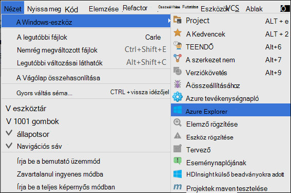

2. Kattintson a jobb gombbal az **Azure Explorer**a **Azure** csomópontot, és válassza az **Előfizetések kezelése**.

3. **Előfizetések kezelése** párbeszédpanelen kattintson a **Bejelentkezés** gombra, és írja be az Azure hitelesítő adatait.

    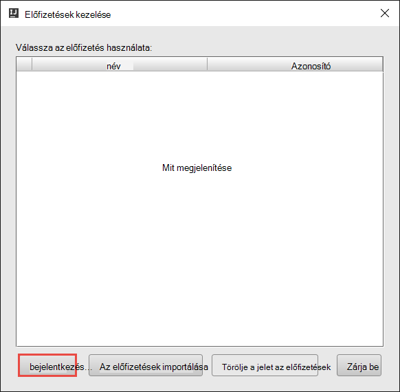

4. Miután bejelentkezett, az **Előfizetések kezelése** párbeszédpanel a tartozó hitelesítő adatok Azure előfizetések sorolja fel. Kattintson a **Bezárás** a párbeszédpanel.

5. Bontsa ki az **Azure Explorer** lap **hdinsight szolgáltatásból lehetőségre** kattintva megtekintheti a külső HDInsight fürt csoportban az előfizetés.

    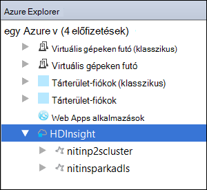

6. További neve csomópont megállapításához, hogy a fürt kapcsolódó erőforrásokat (pl. tárterület-fiókok esetén) elemre.

    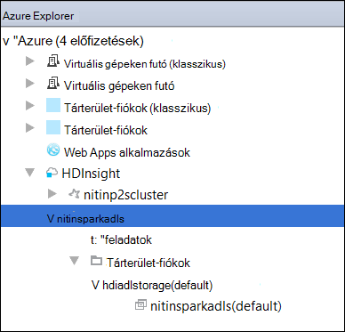

## Egy külső Scala alkalmazás futtatásához a egy HDInsight külső fürthöz

1. Indítsa el a IntelliJ arról, és hozzon létre egy új projektet. Az új projekt párbeszédpanelen az alábbi lehetőségek lehetővé tevő, és kattintson a **Tovább gombra**.

    

    * A bal oldali ablaktáblában kattintson a **hdinsight szolgáltatásból lehetőségre**.
    * A jobb oldali ablaktáblán kattintson a **külső a HDInsight (Scala)**.
    * Kattintson a **Tovább**gombra.

2. A következő ablakra nyújtanak a projekt adatait.

    * Adja meg a projektnév és a projekt helyét.
    * **Projekt SDK**győződjön meg arról, adja meg a nagyobb, mint 7 Java verziót.
    * **Scala SDK**kattintson a **Létrehozás**gombra, kattintson a **Letöltés**gombra, és válassza ki a használandó Scala verziója. **Ellenőrizze, hogy nem verziója segítségével 2.11.x**. Ez a példa **2.10.6**verzióját használja.

        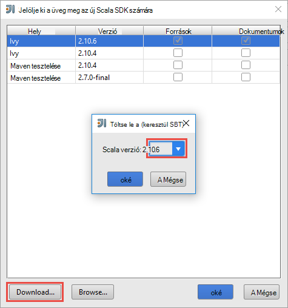

    * **Külső SDK**töltse le és használja az [alábbi](http://go.microsoft.com/fwlink/?LinkID=723585&clcid=0x409)a SDK csomagjában talál. Is figyelmen kívül hagyása ez, és használja a [külső maven tesztelése tárházba](http://mvnrepository.com/search?q=spark) helyette azonban győződjön meg arról, hogy a megfelelő maven tesztelése tárházba telepítve van a külső alkalmazások fejlesztéséhez. (Például kell győződjön meg arról, hogy telepítve van az alkalmazás használatakor a folyamatos átvitelű külső; a folyamatos átvitelű külső kijelző Is kérjük, ellenőrizze, hogy a tárházba megjelölve Scala 2.10 esetén – ne használja a tárházba Scala 2.11 megjelölve.)

        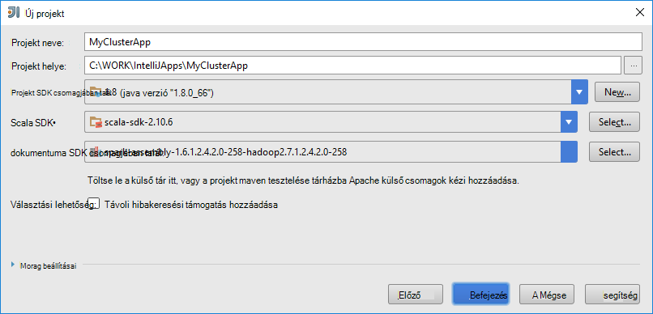

    * Kattintson a **Befejezés gombra**.

3. A külső a project automatikusan hoz létre egy eltérés meg. Az eltérés megtekintéséhez kövesse az alábbi lépéseket.

    1. A **fájl** menüben kattintson a **Projekt szerkezetének**.
    2. A **Projekt szerkezetének** párbeszédpanelen kattintson az alapértelmezett eltérés létrehozott lásd: **eltérések** .

        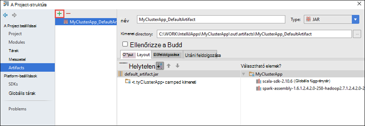

    Szükség esetén létrehozhatja saját eltérés bly parancsra a **+** ikon, a fenti képen kiemelve.

4. A **Projekt szerkezetének** párbeszédpanelen kattintson a **Projekt**gombra. Ha a **Projekt SDK** 1.8 van beállítva, győződjön meg arról, hogy a **Projekt nyelvi szint** értéke **7 - Rombuszokká, ARM, több tényleges, stb**.

    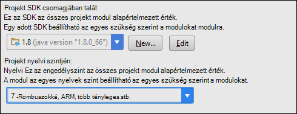

5. Az alkalmazás forráskód hozzáadása.

    1. A **Project Explorer**kattintson a jobb gombbal az **src**, mutasson az **Új**, és válassza a **Scala osztály**parancsra.

        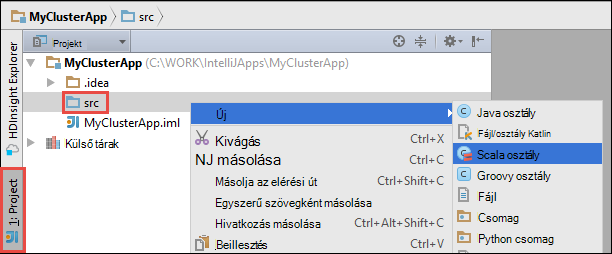

    2. **Új Scala osztály létrehozása** párbeszédpanelen adja meg a nevét, **milyen** választó **objektumra**, és kattintson **az OK**gombra.

        

    3. Illessze be a következő kódot a **MyClusterApp.scala** fájlt. Ez a kód felolvassa (elérhető minden HDInsight külső fürt), a HVAC.csv adatainak olvassa be a sorokat, amelyek csak egy számjegyet az a CSV-fájlok a hetedik oszlopban, és a kimenet ír **/HVACOut** az alapértelmezett tároló tároló a fürt alatt.

            import org.apache.spark.SparkConf
            import org.apache.spark.SparkContext

            object MyClusterApp{
              def main (arg: Array[String]): Unit = {
                val conf = new SparkConf().setAppName("MyClusterApp")
                val sc = new SparkContext(conf)

                val rdd = sc.textFile("wasbs:///HdiSamples/HdiSamples/SensorSampleData/hvac/HVAC.csv")

                //find the rows which have only one digit in the 7th column in the CSV
                val rdd1 =  rdd.filter(s => s.split(",")(6).length() == 1)

                rdd1.saveAsTextFile("wasbs:///HVACOut")
              }

            }

5. Futtassa az alkalmazást egy HDInsight külső fürt.

    1. A **Project Explorer**kattintson a jobb gombbal a projekt nevét, és válassza a **Külső kérelem elküldése hdinsight szolgáltatásból lehetőségre**.

        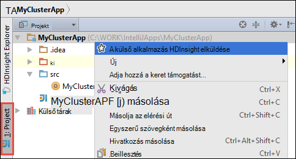

    2. Az Azure előfizetés hitelesítő adatok megadását kéri. **A külső beadványokra adott** párbeszédpanelen adja meg az alábbi értékeket.

        * A **külső fürt (csak Linux)**jelölje be a HDInsight külső fürt, amelyen szeretne az alkalmazásnak a futtatására.

        * Szükséges vagy jelölje ki az eltérés IntelliJ projektből, vagy válasszon egyet a merevlemezen.

        * Szemben a **fő osztály** szöveg mezőben kattintson a három pontra ( ), jelölje ki a fő osztály az alkalmazás forráskód, és kattintson **az OK**gombra.

            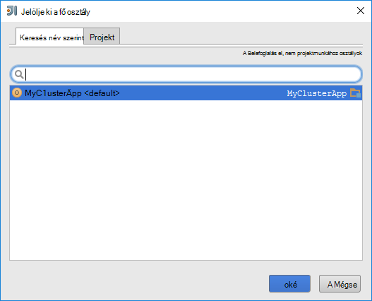

        * Mivel ebben a példában az alkalmazás-kódja nem megkövetelése minden parancssori argumentumok vagy hivatkozás kancsó vagy a fájlokat, akkor hagyja a hátralévő szövegdobozok üres.

        * Után minden bemenetben nyújtó, a párbeszédpanel kell az alábbihoz hasonló lesz.

            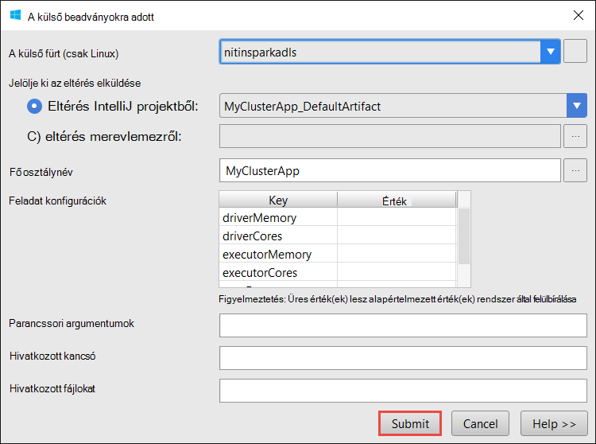

        * Kattintson a **Küldés**gombra.

    3. Az ablak alján a **Külső beadványokra adott** lap kezdetének végrehajtását megjelenítéséhez. Az alkalmazás meg is szüntetheti, kattintson a "Külső beadványokra adott" ablakban a piros gombra.

        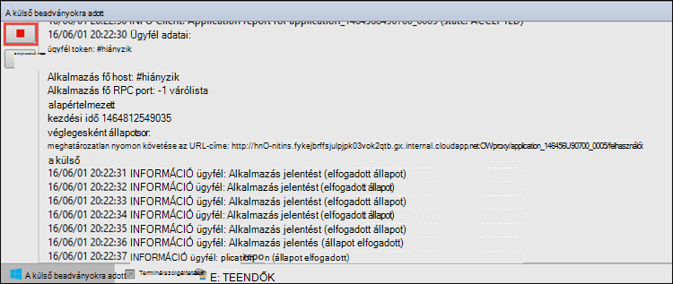

    A következő szakaszban megismerheti, hogyan a kimeneti eszközeivel HDInsight Azure eszközkészlet IntelliJ a feladat eléréséhez.

## Hozzáférés és eszközökkel a HDInsight az Azure eszközkészlet IntelliJ HDInsight külső fürt kezelése

A különféle műveletek az Azure eszközkészlete IntelliJ részét képező HDInsight eszközeivel végezheti el.

### Közvetlenül a feladatok nézetben elérhető a HDInsight-eszközök

1. Az **Azure Intéző**bontsa ki a **HDInsight**, bontsa ki a külső csoport nevét, és kattintson a **feladatok**parancsra.

2. A jobb oldali **Külső feladat nézet** lapján az a fürt futó alkalmazások jeleníti meg. Kattintson az alkalmazás nevét, amelynek meg szeretné kapcsolatban további részletekre kíváncsi.

    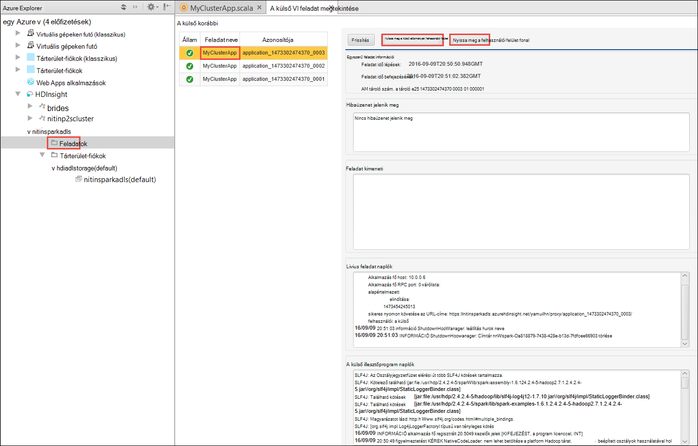

3. **Hibaüzenet jelenik meg**, a **Feladat kimeneti**, a **Livius feladat naplókról**és a **Külső illesztőprogram naplók** mezőibe bekerülnek az alkalmazást, akkor jelölje be a alapján.

4. A képernyő tetején a megfelelő gombokra kattintva a **Külső előzmények felhasználói felület** és a **Fonal felhasználói felület** (az alkalmazás szintjén) is megnyithatja.

### A külső előzmények kiszolgáló elérése

1. Az **Azure Intéző**bontsa ki a **HDInsight**, kattintson a jobb gombbal a külső csoport nevét, és válassza a **Megnyitás külső előzmények felhasználói felület**parancsra. Amikor a rendszer kéri, írja be a fürt a rendszergazdai hitelesítő adataival. Ezek a fürt kiépítése során van megadva.

2. A külső előzmények kiszolgáló irányítópulton kereshet az alkalmazást, csak kész az alkalmazás neve segítségével futnak. A fenti kódot, beállíthatja az alkalmazás nevét használja `val conf = new SparkConf().setAppName("MyClusterApp")`. A külső alkalmazásnév volt, így **MyClusterApp**.

### Indítsa el a Ambari portál

Az **Azure Intéző**bontsa ki a **HDInsight**, kattintson a jobb gombbal a külső csoport nevét, és válassza a **Megnyitás fürt Kezelőportálja (Ambari)**. Amikor a rendszer kéri, írja be a fürt a rendszergazdai hitelesítő adataival. Ezek a fürt kiépítése során van megadva.

### Azure előfizetések kezelése

Alapértelmezés szerint a HDInsight eszközök listája az Azure előfizetésekből a külső fürt. Ha szükséges, az előfizetések, amelyhez el szeretne érni a fürt is megadhat. Az **Azure Intéző**kattintson a jobb gombbal a **Azure** legfelső szintű csomópontot, és válassza az **Előfizetések kezelése**. A párbeszédpanelen törölje a jelet a jelölőnégyzetből, szemben az előfizetést, akkor nem szeretne elérni, és kattintson a **Bezárás**. Választhatja **Kijelentkezés** Ha jelentkezzen ki az Azure előfizetéséből.

## Egy külső Scala-alkalmazás futtatásához helyi meghajtóra

IntelliJ eszközkészlete Azure HDInsight eszközök segítségével külső Scala alkalmazásokat a számítógépen helyben futtatni. Általában ilyen alkalmazások nem szükséges fürt erőforrások, például tároló tároló eléréséhez és kell futtathatja és tesztelje a helyi meghajtóra.

### Előfeltételek

A helyi külső Scala alkalmazást egy Windows rendszerű futtatásakor kivételt [külső-2356](https://issues.apache.org/jira/browse/SPARK-2356) , amely akkor következik be, a hiányzó WinUtils.exe Windows miatt leírtak jelenhet meg. Ez a hiba megkerüléséhez először [Töltse le a végrehajtható fájl innen](http://public-repo-1.hortonworks.com/hdp-win-alpha/winutils.exe) egy helyre, például **C:\WinUtils\bin**. Meg kell egy környezeti változóba **HADOOP_HOME** hozzáadása, majd adja meg az értéket a kijelölt változó **C\WinUtils**.

### A helyi külső Scala alkalmazásnak a futtatására  

1. Indítsa el a IntelliJ arról, és hozzon létre egy új projektet. Az új projekt párbeszédpanelen az alábbi lehetőségek lehetővé tevő, és kattintson a **Tovább gombra**.

    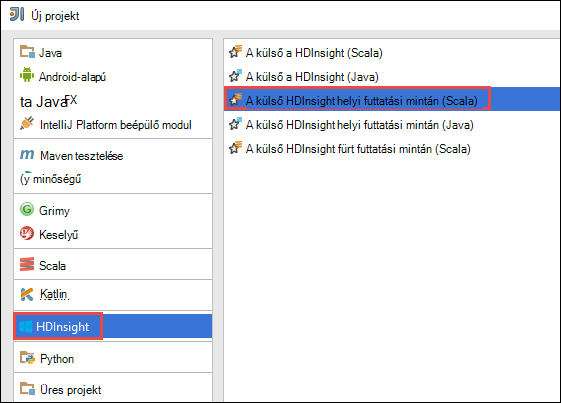

    * A bal oldali ablaktáblában kattintson a **hdinsight szolgáltatásból lehetőségre**.
    * A jobb oldali ablaktáblán kattintson a **külső mintán HDInsight helyi futtatása (Scala)**.
    * Kattintson a **Tovább**gombra.

2. A következő ablakra nyújtanak a projekt adatait.

    * Adja meg a projektnév és a projekt helyét.
    * **Projekt SDK**győződjön meg arról, adja meg a nagyobb, mint 7 Java verziót.
    * **Scala SDK**kattintson a **Létrehozás**gombra, kattintson a **Letöltés**gombra, és válassza ki a használandó Scala verziója. **Ellenőrizze, hogy nem verziója segítségével 2.11.x**. Ez a példa **2.10.6**verzióját használja.

        

    * **Külső SDK**töltse le és használja az [alábbi](http://go.microsoft.com/fwlink/?LinkID=723585&clcid=0x409)a SDK csomagjában talál. Is figyelmen kívül hagyása ez, és használja a [külső maven tesztelése tárházba](http://mvnrepository.com/search?q=spark) helyette azonban győződjön meg arról, hogy a megfelelő maven tesztelése tárházba telepítve van a külső alkalmazások fejlesztéséhez. (Például kell győződjön meg arról, hogy telepítve van az alkalmazás használatakor a folyamatos átvitelű külső; a folyamatos átvitelű külső kijelző Is kérjük, ellenőrizze, hogy a tárházba megjelölve Scala 2.10 esetén – ne használja a tárházba Scala 2.11 megjelölve.)

        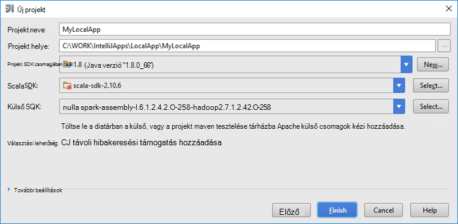

    * Kattintson a **Befejezés gombra**.

3. A sablon hozzáadása a számítógépen helyben futtathatja az **src** mappában példakódot (**LogQuery**).

    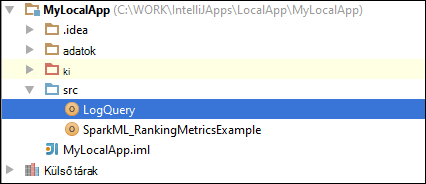

4.  Kattintson a **LogQuery** alkalmazás a jobb gombbal, és válassza a **"Futtatás"LogQuery""**. Ekkor megjelenik egy kimenet jelennek meg a **Futtatás** lapon, a képernyő alján.

    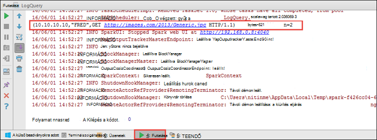

## Meglévő IntelliJ arról alkalmazásokat eszközkészlet Azure HDInsight eszközök használata IntelliJ konvertálása

A meglévő külső Scala alkalmazások létrehozott úgy, hogy kompatibilis-e a IntelliJ eszközkészlete Azure hdinsight szolgáltatáshoz eszközeivel IntelliJ arról is alakíthatók. Ezzel biztosíthatja, hogy az alkalmazások HDInsight külső fürthöz elküldése az eszköz segítségével. Tegye hajt végre az alábbi lépéseket:

1. Nyissa meg a társított .iml fájlt egy meglévő külső Scala kérelem beérkezésétől IntelliJ arról a készült.
2. A legfelső szinten látni fogja a **modul** elem jelennek meg:

        <module org.jetbrains.idea.maven.project.MavenProjectsManager.isMavenModule="true" type="JAVA_MODULE" version="4">

3. Az elem hozzáadása szerkesztése `UniqueKey="HDInsightTool"` , hogy a **modul** elemet az alábbiakhoz hasonlóan néz ki:

        <module org.jetbrains.idea.maven.project.MavenProjectsManager.isMavenModule="true" type="JAVA_MODULE" version="4" UniqueKey="HDInsightTool">

4. A módosítások mentéséhez. Az alkalmazás letöltése IntelliJ eszközkészlete Azure hdinsight szolgáltatáshoz eszközei kompatibilisnek kell lennie. Kattintson a jobb gombbal a projekt nevére a Project Explorer tesztelheti. A helyi menüben kell már **HDInsight külső kérelem elküldése**lehetőséget.

## Hibaelhárítás

### "Használja egy nagyobb felhalmozódott" hiba helyi futtatása

A külső 1,6, az alkalmazás használatakor a 32 bites Java SDK helyi futtatás, közben előfordulhatnak az alábbi hibák:

    Exception in thread "main" java.lang.IllegalArgumentException: System memory 259522560 must be at least 4.718592E8. Please use a larger heap size.
        at org.apache.spark.memory.UnifiedMemoryManager$.getMaxMemory(UnifiedMemoryManager.scala:193)
        at org.apache.spark.memory.UnifiedMemoryManager$.apply(UnifiedMemoryManager.scala:175)
        at org.apache.spark.SparkEnv$.create(SparkEnv.scala:354)
        at org.apache.spark.SparkEnv$.createDriverEnv(SparkEnv.scala:193)
        at org.apache.spark.SparkContext.createSparkEnv(SparkContext.scala:288)
        at org.apache.spark.SparkContext.<init>(SparkContext.scala:457)
        at LogQuery$.main(LogQuery.scala:53)
        at LogQuery.main(LogQuery.scala)
        at sun.reflect.NativeMethodAccessorImpl.invoke0(Native Method)
        at sun.reflect.NativeMethodAccessorImpl.invoke(NativeMethodAccessorImpl.java:57)
        at sun.reflect.DelegatingMethodAccessorImpl.invoke(DelegatingMethodAccessorImpl.java:43)
        at java.lang.reflect.Method.invoke(Method.java:606)
        at com.intellij.rt.execution.application.AppMain.main(AppMain.java:144)

Ez a, mivel a felhalmozódott nem elég nagy külső szeretné futtatni, mivel a külső igényel legalább 471MB (, amely letölthető további részleteket [a külső-12081](https://issues.apache.org/jira/browse/SPARK-12081) tetszés). Egy egyszerű megoldás, ha a 64 bites Java SDK használja. Az alábbi beállítások megadásával is módosíthatja az IntelliJ JVM beállításai:

    -Xms128m -Xmx512m -XX:MaxPermSize=300m -ea

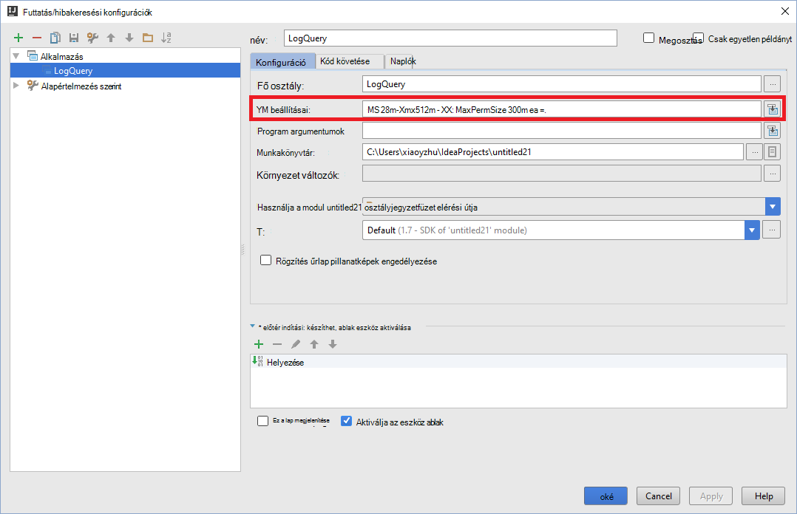

## Visszajelzés és az ismert problémák

Közvetlenül a nem támogatott külső éppen látható exportálja, és dolgozunk, amely a.

Ha bármelyik javaslatok vagy a visszajelzések, vagy ha bármilyen problémát az eszköz használatakor, nyugodtan engedje kapcsolatfelvételi e-mail hdivstool a microsoft pont com.

## Lásd még:

* [Áttekintés: A külső Apache a Azure hdinsight szolgáltatáshoz](hdinsight-apache-spark-overview.md)

### Felhasználási területei

* [A BI külső: interaktív adatelemzés használata a külső HDInsight az Üzletiintelligencia-eszközeiről](hdinsight-apache-spark-use-bi-tools.md)

* [A külső és gépi tanulási: használata külső a HDInsight épület hőmérsékleti fűtés-és Légtechnikai adatok elemzéséhez](hdinsight-apache-spark-ipython-notebook-machine-learning.md)

* [A külső és gépi tanulási: a HDInsight élelmiszer vizsgálati eredmények előrejelzésére használata külső](hdinsight-apache-spark-machine-learning-mllib-ipython.md)

* [A külső adatfolyam: Használata külső a HDInsight valós idejű adatfolyam alkalmazások készítéséhez](hdinsight-apache-spark-eventhub-streaming.md)

* [Webhely napló analysis HDInsight külső használata](hdinsight-apache-spark-custom-library-website-log-analysis.md)

### Létrehozása és futtatása alkalmazások

* [Scala használatával önálló-alkalmazás létrehozása](hdinsight-apache-spark-create-standalone-application.md)

* [Feladat távolról futtatható a külső fürtre Livius használatával](hdinsight-apache-spark-livy-rest-interface.md)

### Eszközök és bővítmények

* [IntelliJ eszközkészlete Azure hdinsight szolgáltatáshoz eszközök segítségével külső alkalmazások hibáinak távolról](hdinsight-apache-spark-intellij-tool-plugin-debug-jobs-remotely.md)

* [Holdas eszközkészlete Azure hdinsight szolgáltatáshoz eszközök segítségével külső alkalmazások létrehozása](hdinsight-apache-spark-eclipse-tool-plugin.md)

* [A HDInsight külső fürt Zeppelin jegyzetfüzetek használata](hdinsight-apache-spark-use-zeppelin-notebook.md)

* [Elérhető az HDInsight-külső fürthöz Jupyter jegyzetfüzet mag](hdinsight-apache-spark-jupyter-notebook-kernels.md)

* [Külső csomagok Jupyter jegyzetfüzeteket használata](hdinsight-apache-spark-jupyter-notebook-use-external-packages.md)

* [Jupyter telepítése a számítógépen, és csatlakozzon az HDInsight külső fürthöz](hdinsight-apache-spark-jupyter-notebook-install-locally.md)

### Erőforrások kezelése

* [A Apache külső fürt Azure hdinsight szolgáltatáshoz a források kezelése](hdinsight-apache-spark-resource-manager.md)

* [A a HDInsight-Apache külső fürthöz nyomon követése és hibakeresési feladatok](hdinsight-apache-spark-job-debugging.md)
