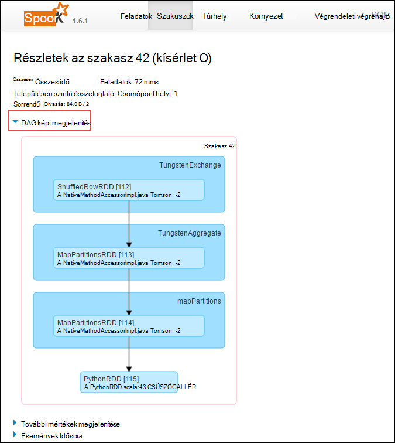

<properties 
    pageTitle="A HDInsight fürt Apache külső futó nyomon követése és hibakeresési feladatok |} Microsoft Azure" 
    description="FONAL felhasználói felület, a külső felhasználói felület és a külső előzmények server segítségével követhetik nyomon és a külső fürthöz Azure hdinsight szolgáltatáshoz a feladatok hibakeresése" 
    services="hdinsight" 
    documentationCenter="" 
    authors="nitinme" 
    manager="jhubbard" 
    editor="cgronlun"
    tags="azure-portal"/>

<tags 
    ms.service="hdinsight" 
    ms.workload="big-data" 
    ms.tgt_pltfrm="na" 
    ms.devlang="na" 
    ms.topic="article" 
    ms.date="08/25/2016" 
    ms.author="nitinme"/>

# A külső Apache fürthöz a HDInsight Linux nyomon követése és hibakeresési feladatok

Ebben a cikkben megtanulhatja, hogyan nyomon követésére és a felhasználói felület fonal, a külső felhasználói felület és a külső előzmények kiszolgáló külső feladatok hibakeresési. Ez a cikk a azt a program ekkor elkezdi a rendelkezésre álló Jegyzetfüzet használata a külső fürt külső feladat **tanulási gép: élelmiszer vizsgálati az adatoknak MLLib a cserélendő analysis**. Az alábbi lépésekkel olyan alkalmazás, amely az Ön által küldött bármely más megközelítés, valamint használatával nyomon követésére, például a **külső elküldése**is használhatja.

##Előfeltételek

Rendelkeznie kell a következőket:

- Egy Azure-előfizetést. Lásd: [Ismerkedés az Azure ingyenes próbaverziót](https://azure.microsoft.com/documentation/videos/get-azure-free-trial-for-testing-hadoop-in-hdinsight/).
- Egy HDInsight Linux Apache külső fürthöz. Című cikkben olvashat [létrehozása Apache külső fürt az Azure hdinsight szolgáltatásból lehetőségre](hdinsight-apache-spark-jupyter-spark-sql.md).
- Meg kell kezdeni a jegyzetfüzetet, futó **[tanulási gép: élelmiszer vizsgálati az adatoknak MLLib a cserélendő analysis](hdinsight-apache-spark-machine-learning-mllib-ipython.md)**. Útmutatást a jegyzetfüzet futtatása hivatkozásra.  

## Az alkalmazások fonal felhasználói felület nyomon követése

1. Indítsa el a felhasználói felület fonal. A fürt lap **Fürt irányítópult**elemre, és válassza a **fonal**.

    

    >[AZURE.TIP] Másik lehetőségként is elindíthatja az fonal a felhasználói felület a Ambari felhasználói felületen. Indítsa el a Ambari felhasználói felületének a fürt lap a **Fürt irányítópult**elemre, és válassza a **HDInsight fürt irányítópult**. A Ambari felhasználói felületének **fonal**gombra, kattintson a **Tartalom**, kattintson az aktív erőforrás-kezelő, és kattintson az **Erőforrás-kezelő felhasználói felület**.  

3. A külső feladat Jupyter jegyzetfüzetek elkezdett, mert az alkalmazásnak a név **remotesparkmagics** (Ez az összes alkalmazások indított a jegyzetfüzeteket a neve). Kattintson az alkalmazás azonosítója szemben az alkalmazás nevét a feladattal kapcsolatos további információk. Ez elindítja az alkalmazást nézet.

    

    A Jupyter jegyzetfüzetek indítható ilyen alkalmazáshoz állapota mindig **operációs rendszert futtató** amíg ki nem lép a jegyzetfüzetet.

4. Az alkalmazás nézetből tud alsóbb szintre megtudhatja, hogy a tárolók az alkalmazás és a naplókat (stdout/stderr) kapcsolódó tovább. A külső felhasználói felületének elindításához kattintson a csatolás az **URL-cím nyomon követése**megfelelő alább látható módon. 

    

## Az alkalmazások külső felhasználói felület nyomon követése

Külső felhasználói felület akkor is részletezést a külső feladatok, amely a korábban elkezdett üzeneten alkalmazás is van.

1. Indítsa el a külső felhasználói felületének a alkalmazás nézetben kattintson a hivatkozásra, szemben a **Követés URL-CÍMÉT**, a képernyőképet felett látható módon. Megtekintheti a külső feladatokat az operációs rendszert futtató Jupyter jegyzetfüzetben alkalmazás által indított vannak.

    

2. Kattintson a **végrendeleti végrehajtó** fülre kattintva tekintheti meg az egyes executor feldolgozása és tárolása információkat. A **Szál kiírása** hivatkozására kattintva is beviheti a hívás Papírhalom.

    
 
3. Kattintson a **szakaszok** fülre, a szakaszokat, az alkalmazás társított megjelenítéséhez.

    

    Egyes szakaszait, amelynek megtekintése végrehajtás statisztikai adatokat, például több tevékenység is alábbi ábrán látható.

     

4. A szakasz részletei lapról DAG képi megjelenítés elindíthatja. Bontsa ki a **DAG képi megjelenítés** hivatkozásra a lap tetején a alább látható módon.

    

    DAG vagy közvetlen Aclyic Graph jelöli a különböző szakaszok alkalmazásban. A diagramon, kék mezőkben egy az alkalmazásból meghívott külső művelet jelöli.

5. A szakasz részletei lapról is elindíthatja az alkalmazás Ütemterv nézetben. Bontsa ki a **Események Idősora** hivatkozásra a lap tetején a alább látható módon.

    

    Ez a külső események ütemterv formájában jeleníti meg. Az Ütemterv nézetben érhető el három szinten keresztül feladatokat, egy feladatot, és egy szakasz belül. A fenti képet rögzíti az Ütemterv nézetben, az adott szakaszában.

    >[AZURE.TIP] Ha bejelöli a **Nagyítás vagy kicsinyítés engedélyezése** jelölőnégyzetet, görgetve balra és jobbra az idősor nézet között.

6. A külső felhasználói felületének másik lapját, valamint a külső példány hasznos információt nyújtanak.

    * Tárterület lap – az alkalmazás létrehoz egy RDDs, ha talál információt a tárolás lapon a.
    * Környezet - ezen a lapon füllel számos hasznos információt a külső példány például a 
        * Scala verziója
        * A fürt társított eseménynaplójának címtár
        * Az alkalmazás executor fúrásmintáit száma
        * Stb.

## Információ a kész feladatokat a külső előzmények-kiszolgáló használata

A feladat befejezése után a feladattal kapcsolatos információk a külső előzmények kiszolgálón van állandó.

1. Indítsa el a külső előzmények kiszolgálóról a fürt lap **Fürt irányítópult**elemre, és kattintson a **Külső előzmények kiszolgáló**.

    

    >[AZURE.TIP] Másik lehetőségként is elindíthatja a külső előzmények Server felhasználói felületének a Ambari felhasználói felületen. Indítsa el a Ambari felhasználói felületének a fürt lap a **Fürt irányítópult**elemre, és válassza a **HDInsight fürt irányítópult**. Ambari a felhasználói felület kattintson a **külső**, kattintson a **Tartalom**gombra, és kattintson a **Külső előzmények kiszolgáló felhasználói felület**.

2. Ekkor megjelenik a felsorolt összes bejegyzett alkalmazást. Kattintson egy alkalmazás Azonosítójára további információt a kérelmet végezhet részletezést.

    
    

## Lásd még:

* [Áttekintés: A külső Apache a Azure hdinsight szolgáltatáshoz](hdinsight-apache-spark-overview.md)

### Felhasználási területei

* [A BI külső: interaktív adatelemzés használata a külső HDInsight az Üzletiintelligencia-eszközeiről](hdinsight-apache-spark-use-bi-tools.md)

* [A külső és gépi tanulási: használata külső a HDInsight épület hőmérsékleti fűtés-és Légtechnikai adatok elemzéséhez](hdinsight-apache-spark-ipython-notebook-machine-learning.md)

* [A külső és gépi tanulási: a HDInsight élelmiszer vizsgálati eredmények előrejelzésére használata külső](hdinsight-apache-spark-machine-learning-mllib-ipython.md)

* [A külső adatfolyam: Használata külső a HDInsight valós idejű adatfolyam alkalmazások készítéséhez](hdinsight-apache-spark-eventhub-streaming.md)

* [Webhely napló analysis HDInsight külső használata](hdinsight-apache-spark-custom-library-website-log-analysis.md)

### Létrehozása és futtatása alkalmazások

* [Scala használatával standalone-alkalmazás létrehozása](hdinsight-apache-spark-create-standalone-application.md)

* [Feladat távolról futtatható a külső fürtre Livius használatával](hdinsight-apache-spark-livy-rest-interface.md)

### Eszközök és bővítmények

* [Létrehozása és elküldése külső Scala alkalmazást IntelliJ arról HDInsight eszközök beépülő modul használatával](hdinsight-apache-spark-intellij-tool-plugin.md)

* [A külső alkalmazások távolról hibáinak IntelliJ arról HDInsight eszközök beépülő modul használatával](hdinsight-apache-spark-intellij-tool-plugin-debug-jobs-remotely.md)

* [A HDInsight külső fürt Zeppelin jegyzetfüzetek használata](hdinsight-apache-spark-use-zeppelin-notebook.md)

* [Elérhető az HDInsight-külső fürthöz Jupyter jegyzetfüzet mag](hdinsight-apache-spark-jupyter-notebook-kernels.md)

* [Külső csomagok Jupyter jegyzetfüzeteket használata](hdinsight-apache-spark-jupyter-notebook-use-external-packages.md)

* [Jupyter telepítése a számítógépen, és csatlakozzon az HDInsight külső fürthöz](hdinsight-apache-spark-jupyter-notebook-install-locally.md)

### Erőforrások kezelése

* [A Apache külső fürt Azure hdinsight szolgáltatáshoz a források kezelése](hdinsight-apache-spark-resource-manager.md)
