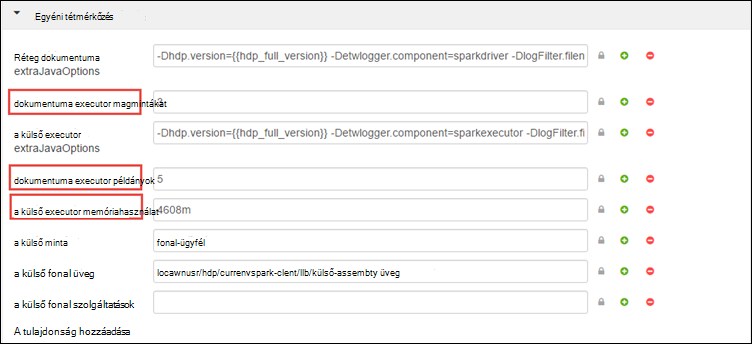
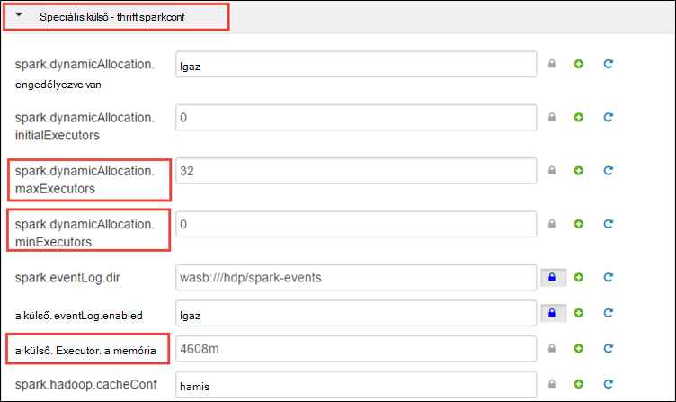
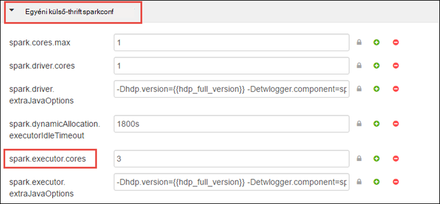

<properties 
    pageTitle="Erőforrás-kezelő a Apache külső fürthöz HDInsight az erőforrásokat |} Microsoft Azure" 
    description="Megtudhatja, hogy miként az erőforrás-kezelő használata a teljesítmény növelése érdekében külső HDInsight fürt." 
    services="hdinsight" 
    documentationCenter="" 
    authors="nitinme" 
    manager="jhubbard" 
    editor="cgronlun"
    tags="azure-portal"/>

<tags 
    ms.service="hdinsight" 
    ms.workload="big-data" 
    ms.tgt_pltfrm="na" 
    ms.devlang="na" 
    ms.topic="article" 
    ms.date="08/25/2016" 
    ms.author="nitinme"/>

# A külső Apache fürt HDInsight Linux erőforrások kezelése

Ez a cikk megtanulhatja, hogyan érhető el a felületeken, például Ambari felhasználói felülete fonal felhasználói felülete és a külső előzmények kiszolgáló társított a külső fürt. Emellett megismerheti arról, hogy miként optimalizálhatja a fürt konfigurálása az optimális teljesítmény eléréséhez.

**Előfeltételek:**

Rendelkeznie kell a következőket:

- Egy Azure-előfizetést. Lásd: [Ismerkedés az Azure ingyenes próbaverziót](https://azure.microsoft.com/documentation/videos/get-azure-free-trial-for-testing-hadoop-in-hdinsight/).
- Egy HDInsight Linux Apache külső fürthöz. Című cikkben olvashat [létrehozása Apache külső fürt az Azure hdinsight szolgáltatásból lehetőségre](hdinsight-apache-spark-jupyter-spark-sql.md).

## Hogyan indítsa el a Ambari webes felülete?

1. Az [Azure-portált](https://portal.azure.com/)a a startboard kattintson a csempére a külső fürt (Ha a startboard a kiemelt). Az **Összes böngészése**a fürthöz is navigálhat > **Fürt hdinsight szolgáltatásból lehetőségre**. 
 
2. A külső fürt lap az **Irányítópult**elemre. Amikor a rendszer kéri, írja be a külső fürt a rendszergazdai hitelesítő adataival.

    ![Indítsa el a Ambari] (./media/hdinsight-apache-spark-resource-manager/hdispark.cluster.launch.dashboard.png "Erőforrás-kezelő elindítása")

3. Ez célszerű indítsa el a Ambari webes felület alább látható módon.

    ![Ambari webes felhasználói felület] (./media/hdinsight-apache-spark-resource-manager/ambari-web-ui.png "Ambari webes felhasználói felület")   

## Hogyan indítsa el a külső előzmények kiszolgáló?

1. Az [Azure-portált](https://portal.azure.com/)a a startboard kattintson a csempére a külső fürt (Ha a startboard a kiemelt).

2. A fürt lap, a **Tartalom**csoportban **Fürt irányítópult**elemre. Kattintson a **Fürt irányítópult** lap **Külső előzmények kiszolgáló**.

    ![A külső előzmények kiszolgáló] (./media/hdinsight-apache-spark-resource-manager/launch-history-server.png "A külső előzmények kiszolgáló")

    Amikor a rendszer kéri, írja be a külső fürt a rendszergazdai hitelesítő adataival.

## Hogyan indítsa el a felhasználói felület fonal?

A felhasználói felület fonal segítségével figyelheti a külső fürt aktuálisan futó alkalmazást. 

1. A fürt lap **Fürt irányítópult**elemre, és válassza a **fonal**.

    

    >[AZURE.TIP] Másik lehetőségként is elindíthatja az fonal a felhasználói felület a Ambari felhasználói felületen. Indítsa el a Ambari felhasználói felületének a fürt lap a **Fürt irányítópult**elemre, és válassza a **HDInsight fürt irányítópult**. A Ambari felhasználói felületének **fonal**gombra, kattintson a **Tartalom**, kattintson az aktív erőforrás-kezelő, és kattintson az **Erőforrás-kezelő felhasználói felület**.

## Mi az a optimális fürt konfigurálása külső alkalmazások futtatásához?

A három fő paraméterek, attól függően, hogy az alkalmazás követelmények külső konfigurációhoz használt `spark.executor.instances`, `spark.executor.cores`, és `spark.executor.memory`. A következő külső alkalmazáshoz indított áll egy Executor. Az alábbiakon futtatható a dolgozó csomópontot, és az alkalmazás a feladatok elvégzéséhez a felelős. Az alapértelmezett szám végrendeleti végrehajtó és minden fürthöz executor méretű számítása dolgozó csomópontok és a dolgozó csomópont méretének száma alapján történik. Ezek a tárolódnak `spark-defaults.conf` központi fürt csomóponton. 

A három beállítási paraméterek beállítható a fürt szintjén (az összes a fürt futó alkalmazások), vagy minden egyes alkalmazáshoz adható meg.

### A Ambari felhasználói felület használatával paramétereinek módosítása

1. A Ambari felhasználói felületen kattintson a **külső** **konfigurációk**kattintson, és bontsa ki a **egyéni külső-alapértékeit**.

    

2. Az alapértelmezett értékeket akkor célszerű, hogy az alkalmazások egy időben futnak a fürt 4 külső. Azt is megteheti módosítások ezeket az értékeket a felhasználói felület, az alább látható módon.

    

3. Mentheti a módosításokat a **Mentés** gombra. A lap tetején kéri indítsa újra az érintett szolgáltatásokat. Kattintson az **Újraindítás**gombra.

    

### Jupyter Jegyzetfüzet alkalmazás paramétereinek módosítása

Az alkalmazások az Jupyter jegyzetfüzetet, használhatja a `%%configure` mágikus, hogy a módosításokat. Ezek a változások ideális esetben az elejére, az alkalmazás, a kód első cellájára futtatása előtt kell végeznie. Ezzel biztosíthatja, hogy a konfigurációt a Livius munkamenet, amikor megkapja a létrehozott van hozzárendelve. Ha az alkalmazás későbbi szakaszában a konfiguráció módosítani szeretné, akkor kell használnia a `-f` paraméter. Azonban módon úgy, hogy az alkalmazás az összes folyamatban el fog veszni.

Az alábbi kódtöredékének megtudhatja, hogy miként Jupyter futó alkalmazás beállításainak módosításához.

    %%configure 
    {"executorMemory": "3072M", "executorCores": 4, “numExecutors”:10}

A beállítandó át kell adni a JSON karakterláncként és későbbinek kell lennie a következő sorban a mágikus, például oszlopában látható módon. 

### A paraméterek használata kérelem külső-elküldése módosítása

Parancs a következő képen egy köteg alkalmazás segítségével küldött konfigurációs paramétereinek módosítása `spark-submit`.

    spark-submit --class <the application class to execute> --executor-memory 3072M --executor-cores 4 –-num-executors 10 <location of application jar file> <application parameters>

### A kérelem cURL használatával paramétereinek módosítása

A következő parancs példája egy köteg alkalmazás használata cURL küldött konfigurációs paramétereinek módosítása.

    curl -k -v -H 'Content-Type: application/json' -X POST -d '{"file":"<location of application jar file>", "className":"<the application class to execute>", "args":[<application parameters>], "numExecutors":10, "executorMemory":"2G", "executorCores":5' localhost:8998/batches

### Hogyan változtatható meg ezeket a paramétereket a külső Thrift kiszolgálón?

A külső Thrift kiszolgáló JDBC/ODBC hozzáférést biztosít a külső fürt és szolgáltatás külső SQL-lekérdezések használják. Eszközök, mint például a Power BI, Tableau stb. kommunikáció a külső Thrift kiszolgálót, hajtsa végre a külső SQL-lekérdezések külső alkalmazásként ODBC protokollt használja. A külső fürtre létrehozásakor a külső Thrift kiszolgáló két példánya elindított, egy minden központi csomóponton. Egyes külső Thrift kiszolgáló nem láthatók a felhasználói felület fonal külső alkalmazásként. 

A külső Thrift kiszolgáló használja-e a külső dinamikus executor terhelés és így a `spark.executor.instances` nem használható. Ehelyett a külső Thrift kiszolgálóban `spark.dynamicAllocation.minExecutors` és `spark.dynamicAllocation.maxExecutors` executor számának megadása. A konfigurációs paraméterek `spark.executor.cores` és `spark.executor.memory` executor méretének módosításához használja. Módosíthatja a paramétereket alább látható módon.

* Bontsa ki a **külső-thrift-sparkconf speciális** kategóriát, frissítheti a paraméterek `spark.dynamicAllocation.minExecutors`, `spark.dynamicAllocation.maxExecutors`, és `spark.executor.memory`.

     

* Bontsa ki a **külső-thrift-sparkconf egyéni** kategória a paraméter frissítése `spark.executor.cores`.

    

### Hogyan módosíthatom a illesztőprogram memória Thrift külső kiszolgáló?

A külső Thrift kiszolgáló illesztőprogram memória van konfigurálva a fő csomópont RAM mérete 25 %-át, feltéve, a fő csomópont RAM méretével 14GB-nál nagyobb. A felhasználói felület Ambari segítségével megváltoztathatja az illesztőprogram memória konfigurációt alább látható módon.

* A Ambari felhasználói felületen kattintson a **külső**, kattintson **konfigurációk**, bontsa ki a **külső-boríték speciális**, és kattintson a az érték **spark_thrift_cmd_opts**szükséges.

    

## A külső fürthöz nem használható BI Hogyan tudom vissza igénybe az erőforrások?

Külső dinamikus terhelés használjuk, mivel a az csak azokat az erőforrásokat felhasznált thrift kiszolgáló által a két alkalmazás mesteralakzatok az erőforrások. Ezek az erőforrások visszanyeréséhez le kell állítania a a fürthöz Thrift kiszolgáló szolgáltatások.

1. Kattintson a **külső**Ambari a felhasználói felület, a bal oldali ablaktáblájában.

2. A következő lapon kattintson a **Külső Thrift kiszolgálók**elemre.

    

3. Meg kell jelennie a két headnodes, amelyen a külső Thrift kiszolgálón fut. Kattintson a headnodes egyikére.

    

4. A következő lapra, hogy headnode futó szolgáltatások listája. A listából külső Thrift kiszolgáló mellett lévő legördülő lista gombra, és kattintson a **Leállítás**gombra.

    

5. Ismételje meg ezeket a lépéseket a többi headnode, valamint a.

## A Jupyter jegyzetfüzetek nem futtatja a várt módon működik. Hogyan lehet indítsa újra a szolgáltatást?

1. Indítsa el a Ambari webes felület, ahogy alább látható. A bal oldali navigációs ablakból **Jupyter**kattintson kattintson a **Szolgáltatás műveletek**, és kattintson az **Összes indítsa újra**. Ez a Jupyter szolgáltatás kezdése az összes headnodes.

    ![Indítsa újra a Jupyter] (./media/hdinsight-apache-spark-resource-manager/restart-jupyter.png "Indítsa újra a Jupyter")

    

## Lásd még:

* [Áttekintés: A külső Apache a Azure hdinsight szolgáltatáshoz](hdinsight-apache-spark-overview.md)

### Felhasználási területei

* [A BI külső: interaktív adatelemzés használata a külső HDInsight az Üzletiintelligencia-eszközeiről](hdinsight-apache-spark-use-bi-tools.md)

* [A külső és gépi tanulási: használata külső a HDInsight épület hőmérsékleti fűtés-és Légtechnikai adatok elemzéséhez](hdinsight-apache-spark-ipython-notebook-machine-learning.md)

* [A külső és gépi tanulási: a HDInsight élelmiszer vizsgálati eredmények előrejelzésére használata külső](hdinsight-apache-spark-machine-learning-mllib-ipython.md)

* [A külső adatfolyam: Használata külső a HDInsight valós idejű adatfolyam alkalmazások készítéséhez](hdinsight-apache-spark-eventhub-streaming.md)

* [Webhely napló analysis HDInsight külső használata](hdinsight-apache-spark-custom-library-website-log-analysis.md)

### Létrehozása és futtatása alkalmazások

* [Scala használatával önálló-alkalmazás létrehozása](hdinsight-apache-spark-create-standalone-application.md)

* [Feladat távolról futtatható a külső fürtre Livius használatával](hdinsight-apache-spark-livy-rest-interface.md)

### Eszközök és bővítmények

* [Létrehozása és elküldése külső Scala alkalmazást IntelliJ arról HDInsight eszközök beépülő modul használatával](hdinsight-apache-spark-intellij-tool-plugin.md)

* [A külső alkalmazások távolról hibáinak IntelliJ arról HDInsight eszközök beépülő modul használatával](hdinsight-apache-spark-intellij-tool-plugin-debug-jobs-remotely.md)

* [A HDInsight külső fürt Zeppelin jegyzetfüzetek használata](hdinsight-apache-spark-use-zeppelin-notebook.md)

* [Elérhető az HDInsight-külső fürthöz Jupyter jegyzetfüzet mag](hdinsight-apache-spark-jupyter-notebook-kernels.md)

* [Külső csomagok Jupyter jegyzetfüzeteket használata](hdinsight-apache-spark-jupyter-notebook-use-external-packages.md)

* [Jupyter telepítése a számítógépen, és csatlakozzon az HDInsight külső fürthöz](hdinsight-apache-spark-jupyter-notebook-install-locally.md)

### Erőforrások kezelése

* [A a HDInsight-Apache külső fürthöz nyomon követése és hibakeresési feladatok](hdinsight-apache-spark-job-debugging.md)

[hdinsight-versions]: hdinsight-component-versioning.md
[hdinsight-upload-data]: hdinsight-upload-data.md
[hdinsight-storage]: hdinsight-hadoop-use-blob-storage.md

[azure-purchase-options]: http://azure.microsoft.com/pricing/purchase-options/
[azure-member-offers]: http://azure.microsoft.com/pricing/member-offers/
[azure-free-trial]: http://azure.microsoft.com/pricing/free-trial/
[azure-management-portal]: https://manage.windowsazure.com/
[azure-create-storageaccount]: storage-create-storage-account.md 
