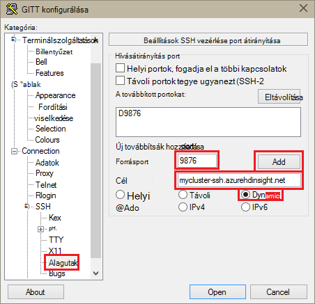
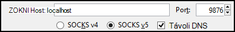
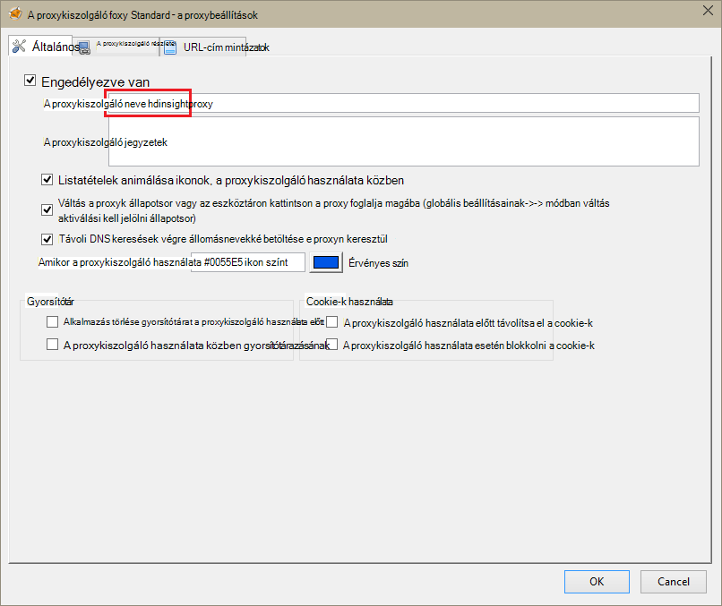
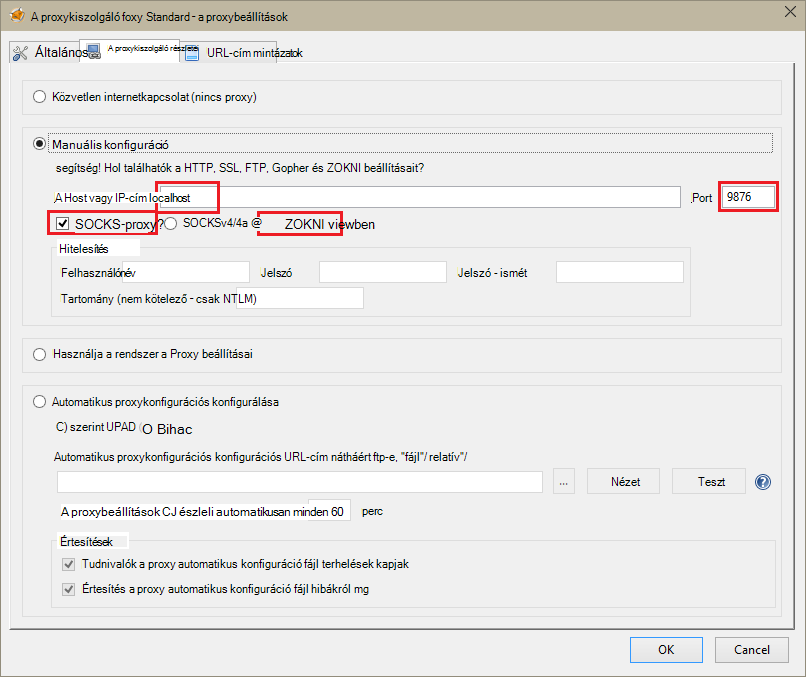
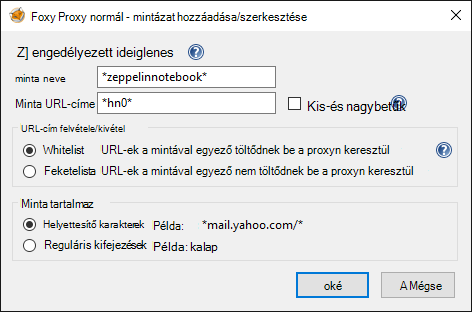
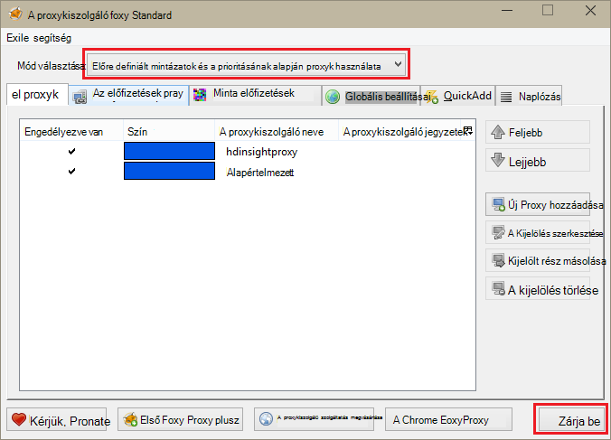

<properties 
    pageTitle="HDInsight Linux Zeppelin jegyzetfüzetek Apache külső fürt telepítése |} Microsoft Azure" 
    description="Lépésenkénti szeretné telepíteni, és használjon HDInsight Linux külső fürt Zeppelin jegyzetfüzeteket." 
    services="hdinsight" 
    documentationCenter="" 
    authors="nitinme" 
    manager="jhubbard" 
    editor="cgronlun"/>

<tags 
    ms.service="hdinsight" 
    ms.workload="big-data" 
    ms.tgt_pltfrm="na" 
    ms.devlang="na" 
    ms.topic="article" 
    ms.date="10/28/2016" 
    ms.author="nitinme"/>

# HDInsight Linux Zeppelin jegyzetfüzetek Apache külső fürt telepítése

Útmutató: Zeppelin jegyzetfüzetek telepítése Apache külső fürt és feladatok külső futtatása a Zeppelin jegyzetfüzetek használatával.

> [AZURE.IMPORTANT] A külső fürt alapértelmezés szerint Zeppelin jegyzetfüzetek elérhetők. Nem kell kifejezetten telepítse azokat a külső fürthöz eltűnt. További információ, [Apache külső használata Zeppelin jegyzetfüzetek fürt HDInsight Linux](hdinsight-apache-spark-zeppelin-notebook.md). 

**Előfeltételek:**

* Ebben az oktatóanyagban megkezdése előtt az Azure előfizetéssel kell rendelkeznie. Lásd: [Ismerkedés az Azure ingyenes próbaverziót](https://azure.microsoft.com/documentation/videos/get-azure-free-trial-for-testing-hadoop-in-hdinsight/).
* Egy külső Apache fürthöz. Című cikkben olvashat [létrehozása Apache külső fürt az Azure hdinsight szolgáltatásból lehetőségre](hdinsight-apache-spark-jupyter-spark-sql.md).
* Egy SSH ügyfél. Linux és Unix terjesztését vagy Macintosh-OS X az `ssh` parancs hiányzik az operációs rendszerrel. A Windows azt javasoljuk [gitt](http://www.chiark.greenend.org.uk/~sgtatham/putty/download.html)

    > [AZURE.NOTE] Ha egy SSH ügyfél eltérő használni kívánt `ssh` vagy gitt, olvassa el a dokumentáció a használatát, hogy miként létesíthet-SSH alagutas.

* Egy webböngészőben, amely beállítható úgy, hogy egy SOCKS proxykiszolgáló használata

* __(nem kötelező)__: A beépülő modul, például [FoxyProxy](http://getfoxyproxy.org/,) alkalmazható szabályok csak átirányíthatja révén a alagutas kérései.

    > [AZURE.WARNING] Például FoxyProxy beépülő modul nélkül a böngészőn keresztül kérések lehet továbbítani az alagutas keresztül. Ez a eredményezhet lassabban a böngészőben a weblapok betöltését.

## A külső fürtre Zeppelin telepítése

A külső fürtre parancsfájl művelettel Zeppelin telepíthető. Parancsfájl műveletet használja egyéni parancsfájlok, amelyek nem érhető el, alapértelmezés szerint a fürt összetevők telepítése. Az egyéni parancsfájl használatával Zeppelin telepítse az Azure portálról, HDInsight .NET SDK használatával, vagy Azure PowerShell használatával. A parancsfájl használatával Zeppelin vagy részeként fürt létrehozása, vagy a fürt lépéseket követően telepítse. Az alábbi szakaszokban található hivatkozásokra kattintva a képernyőn megjelenő utasításokat meg, hogyan. 

### Az Azure portál használatával

Az Azure-portálon használatát futtatható parancsfájl műveletet Zeppelin telepítése című cikkben olvashat [testreszabása HDInsight fürt parancsfájl művelettel](hdinsight-hadoop-customize-cluster-linux.md#use-a-script-action-from-the-azure-portal). A módosítások néhány kell végeznie az ebben a cikkben utasításokat.

* A parancsprogram Zeppelin telepíteni kell használnia. A következő hivatkozásokkal szembeni Zeppelin telepítése a HDInsight külső fürt egyéni parancsfájl érhető el:
    * A külső 1.6.0 fürtre - vonatkozóan`https://hdiconfigactions.blob.core.windows.net/linuxincubatorzeppelinv01/install-zeppelin-spark160-v01.sh`
    * A külső 1.5.2 fürtre - vonatkozóan`https://hdiconfigactions.blob.core.windows.net/linuxincubatorzeppelinv01/install-zeppelin-spark151-v01.sh`

* A parancsfájlok művelet csak a headnode kell futtatni.

* A parancsprogram nem szükséges paramétereket. 

### HDInsight .NET SDK használatával

HDInsight .NET SDK használatát futtatható parancsfájl műveletet Zeppelin telepítése című cikkben olvashat [testreszabása HDInsight fürt parancsfájl művelettel](hdinsight-hadoop-customize-cluster-linux.md#use-a-script-action-from-the-hdinsight-net-sdk). A módosítások néhány kell végeznie az ebben a cikkben utasításokat.

* A parancsprogram Zeppelin telepíteni kell használnia. A következő hivatkozásokkal szembeni Zeppelin telepítése a HDInsight külső fürt egyéni parancsfájl érhető el:
    * A külső 1.6.0 fürtre - vonatkozóan`https://hdiconfigactions.blob.core.windows.net/linuxincubatorzeppelinv01/install-zeppelin-spark160-v01.sh`
    * A külső 1.5.2 fürtre - vonatkozóan`https://hdiconfigactions.blob.core.windows.net/linuxincubatorzeppelinv01/install-zeppelin-spark151-v01.sh`

* A parancsprogram nem szükséges paramétereket. 

* Állítsa a fürt típus hoz létre külső.

### Azure PowerShell használatával

Használja az alábbi PowerShell kódtöredékének HDInsight Linux Zeppelin telepítve van a külső fürt létrehozásához. Attól függően, hogy melyik verziója van külső fürt frissítenie kell a a hivatkozás a megfelelő egyéni parancsfájlokat az alábbi PowerShell kódtöredékének. 

* A külső 1.6.0 fürtre - vonatkozóan`https://hdiconfigactions.blob.core.windows.net/linuxincubatorzeppelinv01/install-zeppelin-spark160-v01.sh`
* A külső 1.5.2 fürtre - vonatkozóan`https://hdiconfigactions.blob.core.windows.net/linuxincubatorzeppelinv01/install-zeppelin-spark151-v01.sh`

[AZURE.INCLUDE [upgrade-powershell](../../includes/hdinsight-use-latest-powershell.md)]

    Login-AzureRMAccount
    
    # PROVIDE VALUES FOR THE VARIABLES
    $clusterAdminUsername="admin"
    $clusterAdminPassword="<<password>>"
    $clusterSshUsername="adminssh"
    $clusterSshPassword="<<password>>"
    $clusterName="<<clustername>>"
    $clusterContainerName=$clusterName
    $resourceGroupName="<<resourceGroupName>>"
    $location="<<region>>"
    $storage1Name="<<storagename>>"
    $storage1Key="<<storagekey>>"
    $subscriptionId="<<subscriptionId>>"
    
    Select-AzureRmSubscription -SubscriptionId $subscriptionId
    
    $passwordAsSecureString=ConvertTo-SecureString $clusterAdminPassword -AsPlainText -Force
    $clusterCredential=New-Object System.Management.Automation.PSCredential ($clusterAdminUsername, $passwordAsSecureString)
    $passwordAsSecureString=ConvertTo-SecureString $clusterSshPassword -AsPlainText -Force
    $clusterSshCredential=New-Object System.Management.Automation.PSCredential ($clusterSshUsername, $passwordAsSecureString)
    
    $azureHDInsightConfigs= New-AzureRmHDInsightClusterConfig -ClusterType Spark
    $azureHDInsightConfigs.DefaultStorageAccountKey = $storage1Key
    $azureHDInsightConfigs.DefaultStorageAccountName = "$storage1Name.blob.core.windows.net"
    
    Add-AzureRMHDInsightScriptAction -Config $azureHDInsightConfigs -Name "Install Zeppelin" -NodeType HeadNode -Parameters "void" -Uri "https://hdiconfigactions.blob.core.windows.net/linuxincubatorzeppelinv01/install-zeppelin-spark151-v01.sh"
    
    New-AzureRMHDInsightCluster -Config $azureHDInsightConfigs -OSType Linux -HeadNodeSize "Standard_D12" -WorkerNodeSize "Standard_D12" -ClusterSizeInNodes 2 -Location $location -ResourceGroupName $resourceGroupName -ClusterName $clusterName -HttpCredential $clusterCredential -DefaultStorageContainer $clusterContainerName -SshCredential $clusterSshCredential -Version "3.3"
 
## Zeppelin jegyzetfüzet eléréséhez tunneling SSH beállítása

A Zeppelin jegyzetfüzetek a külső fürthöz Linux HDInsight elérése SSH alagutak fogja használni. Az alábbi lépésekkel bemutatják, hogy miként hozhat létre egy SSH alagutas ssh (Linux) parancssori és használatával gitt (Windows).

### Hozzon létre egy alagutas SSH paranccsal (Linux)

A következő parancsot a hozzon létre egy SSH átjáró segítségével használata a `ssh` parancsot. __Felhasználónév__ helyére egy SSH a HDInsight fürt felhasználó, és cserélje le __CLUSTERNAME__ a HDInsight fürt neve

    ssh -C2qTnNf -D 9876 USERNAME@CLUSTERNAME-ssh.azurehdinsight.net

Ezzel létrehozott egy kapcsolatot, amely a forgalom átirányítása a fürthöz helyi port 9876 SSH fölé. A beállítások a következők:

* **D 9876** – a helyi olyan portot, amely irányítja a forgalmat a alagutas keresztül.

* **C** - tömörítése adatok, mert a web forgalom főként szöveget.

* **2** – hatályba SSH próbálja ki a 2-es verziójú csak protokoll.

* **kérdések** - csendes.

* **Kétmintás T** - letiltása pszeudo-tty terhelés, akkor csak olyan portot továbbítása óta.

* **n** - megakadályozhatja, hogy olvasása STDIN, akkor csak olyan portot továbbítása óta.

* **N** - nem hajtható végre távoli parancs, akkor csak olyan portot továbbítása óta.

* **az f** - futtatása a háttérben.

Ha úgy állította be a fürt SSH kulccsal, előfordulhat, használja a `-i` paraméter, és adja meg a személyes SSH kulcs elérési útja.

A parancs befejezi, a helyi számítógép 9876 portjához küldött forgalmat át lesz irányítva Secure Sockets Layer (SSL) a fürthöz központi csomópontot, és úgy tűnik, hogy nincs származnak.

### Hozzon létre egy alagutas használatával gitt (Windows)

Egy SSH alagutas gitt használatával létrehozásához kövesse az alábbi lépéseket.

1. Nyissa meg a gitt, és adja meg a kapcsolat adatait. Ha nem ismeri a gitt, [Használjon SSH a Linux-alapú Hadoop a HDInsight a Windows](hdinsight-hadoop-linux-use-ssh-windows.md) kapcsolatos információk találhatók használatához a hdinsight szolgáltatásból lehetőségre.

2. A párbeszédpanel bal oldalán a **kategória** csoportban bontsa ki a **kapcsolatot**, bontsa ki a **SSH**, és válassza a **alagutak**parancsra.

3. Adja meg a **SSH port átirányítás ellenőrzése beállítások** képernyőn az alábbi adatokat:

    * **Forrásport** - továbbítani szeretné az ügyfél portjához. Ha például **9876**.

    * **Címzett** – az SSH a HDInsight Linux-alapú fürt címét. Ha például **en_furtom nevű fürt-ssh.azurehdinsight.net**.

    * **Dinamikus** - lehetővé teszi, hogy dinamikus SOCKS-proxy útválasztás.

    

4. Kattintson a **Hozzáadás gombra** , a beállítások gombra, és kattintson a **megnyitni** egy SSH kapcsolat megnyitásához.

5. Amikor a rendszer kéri, jelentkezzen be a kiszolgáló. Ez egy SSH munkamenetet, és a alagutas engedélyezése.

### Nyissa meg a böngészőjében a alagutas használata

> [AZURE.NOTE] Ez a szakasz lépéseit a FireFox böngésző használatával az Linux rendszerhez, a Unix, a Macintosh-OS X és a Windows rendszerben olyan szabadon használható. Más modern, például a Google Chrome, Microsoft Edge vagy Apple Safari böngészőben is; kell működniük néhány lépést használt FoxyProxy beépülő modul azonban nem feltétlenül vehető igénybe az összes böngészők.

1. A böngésző **localhost:9876** tartományként **ZOKNI v5** proxy beállítása. Az alábbiakban a Firefox beállítások néz. Ha egy másik port mint 9876 használt, módosítása a port használt egy:

    

    > [AZURE.NOTE] Válassza a **Távoli DNS** megoldja a tartománynév (DNS) kérelmek a HDInsight fürt használatával. Ha nincs bejelölve, DNS helyileg oldható.

2. Győződjön meg arról, hogy forgalom van be érkezik a alagutas keresztül, például [http://www.whatismyip.com/](http://www.whatismyip.com/) vising a engedélyezett, és a Firefox tiltott proxybeállításokhoz. Engedélyezi-e a beállításokat, miközben az IP-cím lesz, a Microsoft Azure adatközpontban géphez.

### Böngészőbővítményeket

A böngésző használata a alagutas konfigurálása működik, míg a nem általában kívánt összes forgalmat a alagutas fölé. Böngészőbővítményeket, például [FoxyProxy](http://getfoxyproxy.org/) támogatja a mintával egyező iránti kérelmek URL-cím (FoxyProxy normál vagy plusz csak), hogy csak bizonyos URL-címek kérelem küld a alagutas fölé.

Ha FoxyProxy Standard telepítve van, az alábbi lépéseket segítségével állította be, hogy csak továbbítja a forgalmat a HDInsight a alagutas fölé.

1. Nyissa meg a FoxyProxy kiterjesztése a böngészőben. Ha például a Firefoxban a ikonnal FoxyProxy mellett a cím mezőbe.

    

2. Jelölje be az **Új Proxy hozzáadása**, válassza az **Általános** lapot, és írja be a proxy **HDInsightProxy**nevét.

    

3. Jelölje ki a **Proxy részletek** fülre, és feltölteni a következő mezőket:

    * **A host vagy IP-cím** – Ez a localhost, mivel a helyi számítógépen egy SSH alagutas azt használja.

    * A **port** – Ez az Ön által használt a SSH alagutas port.

    * **SOCKS-proxy** – akkor válassza ezt a ahhoz, hogy a böngészőben a alagutas tartományként proxy.

    * **ZOKNI v5** – akkor válassza ezt a megfelelő verziójú a proxy beállítása.

    

4. Jelölje be az **URL-cím mintázat** lapot, és válassza az **Új minta hozzáadása**. A következő segítségével a minta megadása, és kattintson **az OK**gombra:

    * **Mintázat neve** - **zeppelinnotebook** – csak a mintázat felhasználóbarát neve.

    * **URL-cím mintát** - **\*hn0** * – határozza meg, amely megfelel a belső tartománynevét hol vannak tárolva a Zeppelin jegyzetfüzeteket végpont mintát. Mivel Zeppelin jegyzetfüzetek csak állnak rendelkezésre a headnode0 a fürt, és a végpont általában `http://hn0-<string>.internal.cloudapp.net`, a minta használatával * *hn0** szeretné biztosítani, hogy a kérelmet a rendszerünk átirányítja az Zeppelin végpontot.

        

4. Kattintson az **OK gombra** hozzáadása a proxy, és zárja be a **Proxybeállításait**.

5. A FoxyProxy párbeszédpanel tetején **Válassza a módjának** megváltoztatása **használata proxyk előre definiált mintázatok és prioritásának alapján**, és kattintson a **Bezárás**.

    

Leírt lépések végrehajtását követően ezeket a lépéseket, csak a karakterlánc __hn0__ tartalmazó URL-eket kéréseit lesz irányítva, az SSL alagutas fölé. 

## Az Access a Zeppelin jegyzetfüzet

Ha befejezte a telepítő tunneling SSH, az alábbi lépéseket követve a külső fürt Zeppelin jegyzetfüzet eléréséhez is kövesse az alábbi lépéseket. Ebben a részben hogyan tehető függővé % sql és % struktúra kimutatások jelenik meg.

1. A webböngészőben nyissa meg a következő végpontot:

        http://hn0-myspar:9995

    * **hn0** azt jelzi, headnode0
    * **myspar** a külső fürt nevét az első hat betű.
    * **9995** a port Zeppelin jegyzetfüzet esetén érhető el.

2. Hozzon létre új jegyzetfüzetet. A fejléc ablakból a **Jegyzetfüzet**elemre, és kattintson az **Új feljegyzés létrehozása**.

    ![Új Zeppelin jegyzetfüzet létrehozása] (./media/hdinsight-apache-spark-use-zeppelin-notebook/hdispark.createnewnote.png "Új Zeppelin jegyzetfüzet létrehozása")

    Ugyanezen a lapon, a **Jegyzetfüzet** alatt meg kell jelennie egy új jegyzetfüzetet **Megjegyzés XXXXXXXXX**kezdődő nevű. Az Új jegyzetfüzet elemre.

3. Az új jegyzetfüzetet az weblapon kattintson a, és módosítsa a arra a jegyzetfüzetre, ha azt szeretné, hogy. Nyomja le az ENTER a név módosítás mentéséhez. Győződjön meg arról, hogy a jegyzetfüzet fejléc állapotjelzője a **Connected** jobb felső sarokban.

    ![Zeppelin jegyzetfüzet állapota] (./media/hdinsight-apache-spark-use-zeppelin-notebook/hdispark.newnote.connected.png "Zeppelin jegyzetfüzet állapota")

### SQL-utasítások futtatása

4. Mintaadatok betöltése ideiglenes táblába. Amikor a külső fürtre HDInsight hoz létre, az adatfájl – minta, **hvac.csv**, másolja az alkalmazás a fiókhoz társított tároló **\HdiSamples\SensorSampleData\hvac**.

    Az új jegyzetfüzetet az alapértelmezés szerint jön létre üres bekezdés illessze be az alábbi kódtöredékének.

        // Create an RDD using the default Spark context, sc
        val hvacText = sc.textFile("wasbs:///HdiSamples/HdiSamples/SensorSampleData/hvac/HVAC.csv")
        
        // Define a schema
        case class Hvac(date: String, time: String, targettemp: Integer, actualtemp: Integer, buildingID: String)
        
        // Map the values in the .csv file to the schema
        val hvac = hvacText.map(s => s.split(",")).filter(s => s(0) != "Date").map(
            s => Hvac(s(0), 
                    s(1),
                    s(2).toInt,
                    s(3).toInt,
                    s(6)
            )
        ).toDF()
        
        // Register as a temporary table called "hvac"
        hvac.registerTempTable("hvac")
        
    Nyomja le a **SHIFT + ENTER BILLENTYŰKOMBINÁCIÓT** , vagy kattintson a kódtöredék futtatásához a bekezdés a **Lejátszás** gombra. A bekezdés jobb-sarkában állapota Kész FÜGGŐBEN befejezett futtatása a kell haladnia. A kimenet ugyanahhoz a bekezdéshez alján jelenik meg. A képernyőképet formátumban, például a következőket:

    ![Ideiglenes nyers adatokból a tábla létrehozása] (./media/hdinsight-apache-spark-use-zeppelin-notebook/hdispark.note.loaddDataintotable.png "Ideiglenes nyers adatokból a tábla létrehozása")

    A bekezdések címet is megadhat. A jobb sarkában kattintson a **Beállítások** ikonra, és kattintson a **cím megjelenítése**.

5. Most már a **Fűtés-és légtechnikai** táblázatban futtatását is lehetővé teszi a külső SQL-utasításait. Új bekezdés illessze be az alábbi lekérdezés. A lekérdezés által visszaadott az épület Azonosítóját, illetve a cél és egy adott dátum minden létrehozásának tényleges átlaghőmérsékletűek közötti különbség. Nyomja le a **SHIFT + ENTER BILLENTYŰKOMBINÁCIÓT**.

        %sql
        select buildingID, (targettemp - actualtemp) as temp_diff, date 
        from hvac
        where date = "6/1/13" 

    Az elején **% sql** -utasítás azt jelenti, hogy a külső SQL értelmező használni a jegyzetfüzetet. Megnézheti a definiált tolmácsok a **értelmező** lapon, a jegyzetfüzet fejlécében.

    Az alábbi képernyőképen a kimenet.

    ![Egy külső SQL-utasítást a jegyzetfüzetet használó futtatása] (./media/hdinsight-apache-spark-use-zeppelin-notebook/hdispark.note.sparksqlquery1.png "Egy külső SQL-utasítást a jegyzetfüzetet használó futtatása")

     A megjelenítési beállítások (téglalap kiemelve) kattintson a azonos kimeneti különböző megadott közötti váltáshoz. Kattintson a **Beállítások** a kulcsot és értékek kimeneti milyen consitutes választhatja ki. Fent, a képernyőfelvétel **buildingID** **temp_diff** átlagát, valamint a kulcs értékként használja.

    
6. Változók használata a lekérdezési külső SQL-utasítások is futtathatók. A következő kódtöredékének határozhat meg egy változó, **Temp**, a lekérdezés, amelynek a lehetséges értékek a lekérdezni kívánt mutatja. Amikor először futtatja a lekérdezést, egy legördülő automatikusan kitölti a változó megadott értékek.

        %sql
        select buildingID, date, targettemp, (targettemp - actualtemp) as temp_diff
        from hvac
        where targettemp > "${Temp = 65,65|75|85}" 

    Illessze be a kódtöredék új bekezdés, és nyomja le a **SHIFT + ENTER BILLENTYŰKOMBINÁCIÓT**. Az alábbi képernyőképen a kimenet.

    ![Egy külső SQL-utasítást a jegyzetfüzetet használó futtatása] (./media/hdinsight-apache-spark-use-zeppelin-notebook/hdispark.note.sparksqlquery2.png "Egy külső SQL-utasítást a jegyzetfüzetet használó futtatása")

    Későbbi lekérdezések esetén választhat egy új értéket a legördülő listában, és futtassa újra a lekérdezést. Kattintson a **Beállítások** a kulcsot és értékek kimeneti milyen consitutes választhatja ki. A fenti képernyőképet **buildingID** használja, mint a kulcsot, **temp_diff** értékként és **targettemp** csoportként átlaga.

7. Indítsa újra a külső SQL értelmező lépjen ki az alkalmazást. Kattintson a **értelmező** fülre a képernyő tetején, és a külső értelmező, kattintson az **Újraindítás**gombra.

    ![Indítsa újra a Zeppelin intepreter] (./media/hdinsight-apache-spark-use-zeppelin-notebook/hdispark.zeppelin.restart.interpreter.png "Indítsa újra a Zeppelin intepreter")

### Futtassa a struktúra kimutatások

1. A Zeppelin jegyzetfüzetből a **értelmező** gombra.

    ![Frissítés struktúra értelmező] (./media/hdinsight-apache-spark-use-zeppelin-notebook/zeppelin-update-hive-interpreter-1.png "Frissítés struktúra értelmező")

2. A **struktúra** értelmező esetében kattintson a **Szerkesztés**gombra.

    ![Frissítés struktúra értelmező] (./media/hdinsight-apache-spark-use-zeppelin-notebook/zeppelin-update-hive-interpreter-2.png "Frissítés struktúra értelmező")

    Frissítse a következő tulajdonságokat.

    * Állítsa **default.password** a megadott jelszót a rendszergazda felhasználó a HDInsight külső fürt létrehozásakor.
    * Állítsa **default.url** `jdbc:hive2://<spark_cluster_name>.azurehdinsight.net:443/default;ssl=true?hive.server2.transport.mode=http;hive.server2.thrift.http.path=/hive2`. Csere ** \<spark_cluster_name >** a külső fürt a nevet.
    * **Default.user** állítsuk be a csoport létrehozásakor megadott felügyeleti felhasználó nevére. Ha például *felügyeleti*.

3. Kattintson a **Mentés** gombra, és indítsa újra a struktúra értelmező kéri, kattintson **az OK gombra**.

4. Hozzon létre új jegyzetfüzetet, és futtassa az alábbi utasítás szeretné megjeleníteni a fürt struktúra táblázatokat.

        %hive
        SHOW TABLES

    Alapértelmezés szerint egy HDInsight fürthöz rendelkezik a mintatáblázat **hivesampletable** néven, hogy meg kell jelennie a következő eredményt.

    ![Kimeneti struktúra] (./media/hdinsight-apache-spark-use-zeppelin-notebook/zeppelin-update-hive-interpreter-3.png "Kimeneti struktúra")

5. Futtassa a következő utasítást a táblázatban a rekordok listáját.

        %hive
        SELECT * FROM hivesampletable LIMIT 5

    Tegye a következőt: olyan eredménye az alábbihoz hasonló.

    ![Kimeneti struktúra] (./media/hdinsight-apache-spark-use-zeppelin-notebook/zeppelin-update-hive-interpreter-4.png "Kimeneti struktúra")

## Lásd még:

* [Áttekintés: A külső Apache a Azure hdinsight szolgáltatáshoz](hdinsight-apache-spark-overview.md)

### Felhasználási területei

* [A BI külső: interaktív adatelemzés használata a külső HDInsight az Üzletiintelligencia-eszközeiről](hdinsight-apache-spark-use-bi-tools.md)

* [A külső és gépi tanulási: használata külső a HDInsight épület hőmérsékleti fűtés-és Légtechnikai adatok elemzéséhez](hdinsight-apache-spark-ipython-notebook-machine-learning.md)

* [A külső és gépi tanulási: a HDInsight élelmiszer vizsgálati eredmények előrejelzésére használata külső](hdinsight-apache-spark-machine-learning-mllib-ipython.md)

* [A külső adatfolyam: Használata külső a HDInsight valós idejű adatfolyam alkalmazások készítéséhez](hdinsight-apache-spark-eventhub-streaming.md)

* [Webhely napló analysis HDInsight külső használata](hdinsight-apache-spark-custom-library-website-log-analysis.md)

### Létrehozása és futtatása alkalmazások

* [Scala használatával önálló-alkalmazás létrehozása](hdinsight-apache-spark-create-standalone-application.md)

* [Feladat távolról futtatható a külső fürtre Livius használatával](hdinsight-apache-spark-livy-rest-interface.md)

### Eszközök és bővítmények

* [Létrehozása és elküldése külső Scala alkalmazást IntelliJ arról HDInsight eszközök beépülő modul használatával](hdinsight-apache-spark-intellij-tool-plugin.md)

* [A külső alkalmazások távolról hibáinak IntelliJ arról HDInsight eszközök beépülő modul használatával](hdinsight-apache-spark-intellij-tool-plugin-debug-jobs-remotely.md)

* [Elérhető az HDInsight-külső fürthöz Jupyter jegyzetfüzet mag](hdinsight-apache-spark-jupyter-notebook-kernels.md)

* [Külső csomagok Jupyter jegyzetfüzeteket használata](hdinsight-apache-spark-jupyter-notebook-use-external-packages.md)

* [Jupyter telepítése a számítógépen, és csatlakozzon az HDInsight külső fürthöz](hdinsight-apache-spark-jupyter-notebook-install-locally.md)

### Erőforrások kezelése

* [A Apache külső fürt Azure hdinsight szolgáltatáshoz a források kezelése](hdinsight-apache-spark-resource-manager.md)

* [A a HDInsight-Apache külső fürthöz nyomon követése és hibakeresési feladatok](hdinsight-apache-spark-job-debugging.md)

[hdinsight-versions]: hdinsight-component-versioning.md
[hdinsight-upload-data]: hdinsight-upload-data.md
[hdinsight-storage]: hdinsight-hadoop-use-blob-storage.md

[azure-purchase-options]: http://azure.microsoft.com/pricing/purchase-options/
[azure-member-offers]: http://azure.microsoft.com/pricing/member-offers/
[azure-free-trial]: http://azure.microsoft.com/pricing/free-trial/
[azure-management-portal]: https://manage.windowsazure.com/
[azure-create-storageaccount]: storage-create-storage-account.md 

