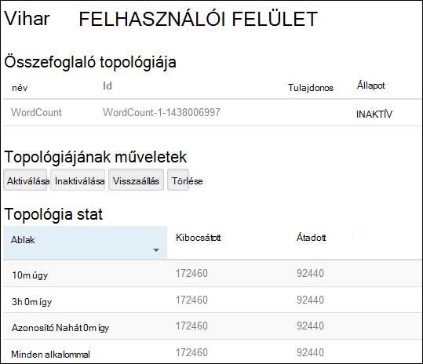
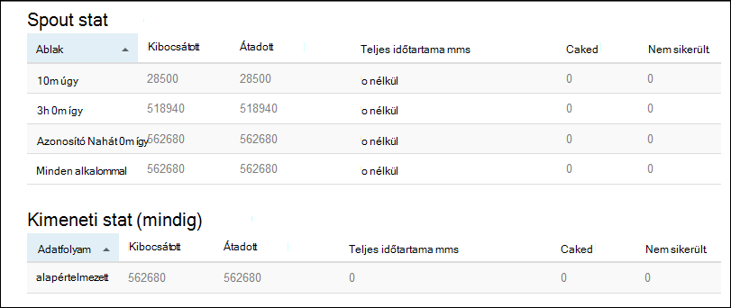

<properties
    pageTitle="Apache vihar oktatóprogram: első lépések a HDInsight Linux-alapú vihar |} Microsoft Azure"
    description="Első lépések a nagy adatok analytics Apache vihar és a minták vihar Starter használata Linux-alapú hdinsight szolgáltatásból lehetőségre. Megtudhatja, hogy miként vihar segítségével folyamat adatainak valós időben."
    keywords="Apache vihar, apache vihar oktatóprogram, nagy adatok analytics, vihar starter"
    services="hdinsight"
    documentationCenter=""
    authors="Blackmist"
    manager="jhubbard"
    editor="cgronlun"/>

<tags
   ms.service="hdinsight"
   ms.devlang="java"
   ms.topic="get-started-article"
   ms.tgt_pltfrm="na"
   ms.workload="big-data"
   ms.date="10/12/2016"
   ms.author="larryfr"/>

# Apache vihar oktatóprogram: első lépések a vihar Starter minták HDInsight a nagy adatok elemzéséhez

Apache vihar méretezhető, hibafa alternatív, elosztott, valós idejű számítási rendszer feldolgozásához adatok adatfolyam megjelenítését. Azure hdinsight szolgáltatáshoz a vihar, a felhőalapú vihar fürt valós idejű adatok nagy analytics végző hozhat létre.

> [AZURE.NOTE] Ez a cikk lépéseinek Linux-alapú HDInsight fürt létrehozása. A Windows-alapú vihar létrehozni a HDInsight fürt című témakör tartalmazza [Apache vihar oktatóprogram: első lépések az adatok analytics használata HDInsight vihar Starter minta](hdinsight-apache-storm-tutorial-get-started.md)

## Előfeltételek

[AZURE.INCLUDE [delete-cluster-warning](../../includes/hdinsight-delete-cluster-warning.md)]

Az alábbi módon Apache vihar oktatóprogram fejeződik be kell rendelkeznie:

- **Az Azure-előfizetés**. Lásd: [Ismerkedés az Azure ingyenes próbaverziót](https://azure.microsoft.com/documentation/videos/get-azure-free-trial-for-testing-hadoop-in-hdinsight/).

- **SSH és SCP ismerős**. SSH és SCP használata HDInsight további tájékoztatást talál a következő:

    - **Linux, Unix vagy OS X ügyfelek**: lásd: [Használata SSH a Linux-alapú Hadoop a HDInsight Linux, az OS X vagy a Unix](hdinsight-hadoop-linux-use-ssh-unix.md)

    - **Windows-ügyfelek**: lásd: [Használata SSH a Linux-alapú Hadoop a HDInsight a Windows](hdinsight-hadoop-linux-use-ssh-windows.md)

### Access-ellenőrzési követelmények

[AZURE.INCLUDE [access-control](../../includes/hdinsight-access-control-requirements.md)]

## Vihar fürt létrehozása

Ebben a részben egy HDInsight verzió 3,2 fürthöz (vihar verzió 0.9.3) hoz létre egy erőforrás-kezelő Azure-sablon segítségével. HDInsight-verziók és azok SLA kapcsolatos további tudnivalókért lásd [HDInsight-összetevő verziószámozás](hdinsight-component-versioning.md). Más fürt létrehozási módjai [létrehozása HDInsight fürt](hdinsight-hadoop-provision-linux-clusters.md)talál.

1. Kattintson az alábbi képen a az Azure-portálon nyissa meg a sablont.         

    
    
    A sablon nyilvános blob tároló, *https://hditutorialdata.blob.core.windows.net/armtemplates/create-linux-based-storm-cluster-in-hdinsight.json*található. 
   
2. A Paraméterek lap az adja meg az alábbiakat:

    - **Fürtnév**: Adja meg a létrehozandó Hadoop fürt nevét.
    - **Fürt felhasználónév és jelszó**: az alapértelmezett bejelentkezési neve rendszergazdaként.
    - **SSH felhasználónevet és jelszót**.
    
    Kérjük, jegyezze fel ezeket az értékeket.  Szüksége lesz rájuk az oktatóprogram belül.

    > [AZURE.NOTE] A HDInsight fürt használatával a parancssorban távoli eléréséhez SSH használják. A felhasználónév és jelszó itt adhat meg a fürt SSH keresztül való csatlakozáskor használják. Is a SSH felhasználónév egyedinek kell lennie, mint hoz létre felhasználói fiókot a HDInsight fürt csomóponton. Az alábbi néhány a fürt szolgáltatások számára fenntartva fiók nevét, és nem használhatók a SSH felhasználónévvel:
    >
    > legfelső szintű, hdiuser, vihar, hbase, ubuntu, zookeeper, fájlrendszerhez, fonal, mapred, hbase, struktúra, oozie, sólyom, sqoop, felügyeleti, tez, hcat, hdinsight-zookeeper.

    > A HDInsight SSH használja a további tudnivalókért lásd: az alábbi cikkekben:

    > * [A HDInsight Linux, Unix vagy OS X Linux-alapú Hadoop SSH használata](hdinsight-hadoop-linux-use-ssh-unix.md)
    > * [A Windows HDInsight Linux-alapú Hadoop SSH használata](hdinsight-hadoop-linux-use-ssh-windows.md)

    
3.a mentéséhez kattintson **az OK** gombra a paraméterek.

4. az **Egyéni telepítés** lap, kattintson az **erőforrás csoport** legördülő listában, és kattintson az **Új** hozhat létre új erőforráscsoport. Az erőforráscsoport, amely a fürt, a függő tárterület-fiók és más csatolt erőforrás csoportosítja tároló.

5.a **jogi feltételek**gombra, és kattintson a **Létrehozás**gombra.

6. Kattintson **létrehozása**parancsra. Új sablon telepítéshez Submitting telepítési című csempe jelenik meg. Szükséges időt körülbelül 20 perc kapcsolatban a fürt és SQL-adatbázis létrehozása.

##Mintaként szolgáló vihar Starter futtathatnak HDInsight

A HDInsight fürt [vihar-starter](https://github.com/apache/storm/tree/master/examples/storm-starter) példák szerepelnek. Az alábbi lépésekkel futtathatók az WordCount példa.

1. A HDInsight fürt SSH használatával csatlakozhat:

        ssh USERNAME@CLUSTERNAME-ssh.azurehdinsight.net
        
    Ha a használt jelszót secure SSH fiókját, a rendszer kéri, adja meg. Nyilvános kulccsal használatakor előfordulhat, hogy akkor alkalmazza a `-i` paraméterrel adja meg a megfelelő titkos kulcs. Ha például `ssh -i ~/.ssh/id_rsa USERNAME@CLUSTERNAME-ssh.azurehdinsight.net`.
        
    További tájékoztatást a Linux-alapú HDInsight SSH használja az alábbi cikkekben talál:
    
    * [A HDInsight Linux, Unix vagy OS X Linux-alapú Hadoop SSH használata](hdinsight-hadoop-linux-use-ssh-unix.md)

    * [A Windows HDInsight Linux-alapú Hadoop SSH használata](hdinsight-hadoop-linux-use-ssh-windows)

2. A következő parancsot használja egy példa topológia indítása:

        storm jar /usr/hdp/current/storm-client/contrib/storm-starter/storm-starter-topologies-*.jar storm.starter.WordCountTopology wordcount
        
    > [AZURE.NOTE] A `*` részét a fájlnevet használja megfelelően változik HDInsight frissül verziószáma.

    Ez a példa WordCount topológia indul, a "wordcount" egy könnyen megjegyezhető nevet a fürt. Azt véletlenszerűen mondatok készítése és az egyes szót a mondatok előfordulását megszámolása.

    > [AZURE.NOTE] A fürthöz topológia elküldésekor kell másolnia a fürt tartalmazó használata előtt, üveg fájlt a `storm` parancsot. A lehet elvégezni használata a `scp` az ügyféltől, ahol a fájl létezik parancsot. Ha például`scp FILENAME.jar USERNAME@CLUSTERNAME-ssh.azurehdinsight.net:FILENAME.jar`
    >
    > A WordCount példa és más vihar starter példák már megtalálhatók a fürthöz `/usr/hdp/current/storm-client/contrib/storm-starter/`.

##A topológia monitor

A felhasználói felület vihar webes felületet biztosít a topológiák fut, és a HDInsight fürt megtalálható.

A topológia a vihar felhasználói felületének használata Lync-kövesse az alábbi lépéseket:

1. Nyissa meg a webböngészőben történő https://CLUSTERNAME.azurehdinsight.net/stormui, hol __CLUSTERNAME__ -e a csoport nevére. Ekkor megnyílik a felhasználói felület vihar.

    > [AZURE.NOTE] Ha a felhasználónév és jelszó megadására kéri, adja meg a csoport rendszergazdája (rendszergazda) és mikor használt jelszót a fürt létrehozása.

2. Az **összefoglaló topológia**jelölje ki a **wordcount** a **név** oszlopban. Ekkor megjelenik a topológia további információt.

    

    Ezen az oldalon az alábbi információk találhatók:

    * **Topológia stat** – a topológia teljesítményére alapvető információ idő windows vannak rendezve.

        > [AZURE.NOTE] Egy adott időtartomány kijelölése módosítja a időkeret információt a lap más részén jelennek meg.

    * **Spouts** - spouts, beleértve az utolsó hibát eredményeként kapott valamennyi spout vonatkozó alapadatok.

    * **Bolts** - csapszegek vonatkozó alapadatok.

    * **Topológiájának konfigurálása** – a topológia konfigurációs részletes adatait.

    Ezen az oldalon a műveleteket, amelyeket a topológia meg lehessen hozni is tartalmazza:

    * **Aktiválás** – egy inaktiválva topológia önéletrajzok feldolgozása.

    * **Inaktiválás** - felfüggeszti a futó topológiában.

    * A párhuzamos a topológia **visszaállás** - állítja be. A futó topológiák kell visszaállás, miután módosította a fürt csomópontok számának. A párhuzamos-e a fürt csomópontok növekedett vagy csökkent számának kompenzálja topológiát lehetővé teszi. További információ a [egy vihar topológiájának a párhuzamos ismertetése](http://storm.apache.org/documentation/Understanding-the-parallelism-of-a-Storm-topology.html)című cikk nyújt.

    * Egy vihar topológia **törlése** - megszakítja az megadott idő után.

3. Ezen a lapon jelölje ki egy bejegyzést a **Spouts** vagy **Bolts** szakaszából. Ekkor megjelenik a kijelölt összetevő információt.

    

    Ezen a lapon látható az alábbi adatokat:

    * **Spout/rögzített stat** - összetevő teljesítményére alapvető információ idő windows vannak rendezve.

        > [AZURE.NOTE] Egy adott időtartomány kijelölése módosítja a időkeret információt a lap más részén jelennek meg.

    * **Beviteli stat** (csak szög) - összetevők, a rögzített felhasznált adatok okozó olvashat.

    * **Kimeneti stat** - adatok a rögzített által kibocsátott olvashat.

    * **Végrendeleti végrehajtó** - példányok az összetevő olvashat.

    * **Hibák** - összetevő készített hibákat.

4. A részletek spout vagy rögzített megtekintésekor jelölje ki egy bejegyzést a **Port** oszlop az **végrendeleti végrehajtó** szakasz az összetevő példányára részleteinek megtekintése.

        2015-01-27 14:18:02 b.s.d.task [INFO] Emitting: split default ["with"]
        2015-01-27 14:18:02 b.s.d.task [INFO] Emitting: split default ["nature"]
        2015-01-27 14:18:02 b.s.d.executor [INFO] Processing received message source: split:21, stream: default, id: {}, [snow]
        2015-01-27 14:18:02 b.s.d.task [INFO] Emitting: count default [snow, 747293]
        2015-01-27 14:18:02 b.s.d.executor [INFO] Processing received message source: split:21, stream: default, id: {}, [white]
        2015-01-27 14:18:02 b.s.d.task [INFO] Emitting: count default [white, 747293]
        2015-01-27 14:18:02 b.s.d.executor [INFO] Processing received message source: split:21, stream: default, id: {}, [seven]
        2015-01-27 14:18:02 b.s.d.task [INFO] Emitting: count default [seven, 1493957]

    Az adatok alapján láthatja, hogy a word **hét** történt 1493957 időpontokat. Ez a topológia kezdete óta történt, hány alkalommal.

##A topológia leállítása

Térjen vissza a **topológia összefoglaló** lapot a szószám topológia, és válassza a **topológia műveletek** szakaszából a **törlése** gombra. Amikor a rendszer kéri, adja meg a másodperc várakozás után a topológia leállítása 10. A határidő lejárta után a topológia már nem jelenik meg az irányítópult **Vihar felhasználói felület** szakasza megnyitásakor.

##A csoport törlése

[AZURE.INCLUDE [delete-cluster-warning](../../includes/hdinsight-delete-cluster-warning.md)]

##Következő lépések

Az oktatóprogram Apache vihar használva a vihar Starter megtudhatja, hogy miként hozzon létre egy vihar HDInsight fürt, és használja a vihar irányítópult telepíthető, figyelésére és vihar topológiák kezelése. Ezután megtudhatja, hogyan [kidolgozása Java-alapú topológiák maven tesztelése használatával](hdinsight-storm-develop-java-topology.md).

Ha már ismeri a fejlesztéséhez Java-alapú topológiák és egy meglévő topológia HDInsight telepítéshez használni kívánt, látható [Deploy és kezelheti a HDInsight Apache vihar topológiák](hdinsight-storm-deploy-monitor-topology-linux.md).

Ha a .NET fejlesztő, létrehozhat C# vagy hibrid C# / Java topológiák Visual Studio segítségével. További tudnivalókért lásd: [Apache vihar HDInsight Hadoop tools for Visual Studio segítségével a topológiát kidolgozása C#](hdinsight-storm-develop-csharp-visual-studio-topology.md).

Példa a HDInsight, vihar használható topológiák lásd az alábbi példákat:

    * [Példa a HDInsight vihar topológiát](hdinsight-storm-example-topology.md)

[apachestorm]: https://storm.incubator.apache.org
[stormdocs]: http://storm.incubator.apache.org/documentation/Documentation.html
[stormstarter]: https://github.com/apache/storm/tree/master/examples/storm-starter
[stormjavadocs]: https://storm.incubator.apache.org/apidocs/
[azureportal]: https://manage.windowsazure.com/
[hdinsight-provision]: hdinsight-provision-clusters.md
[preview-portal]: https://portal.azure.com/
